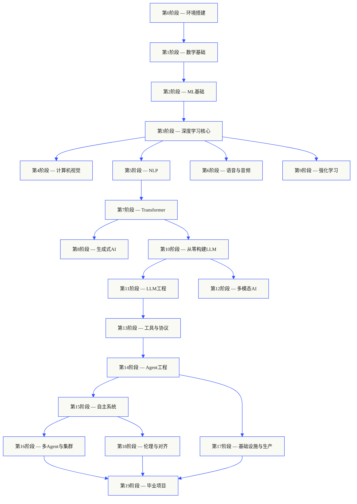
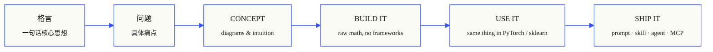

<p align="center">
  
</p>

<p align="center">
  <a href="LICENSE"></a>
  <a href="ROADMAP.md"></a>
  <a href="#contents"></a>
  <a href="https://github.com/xiaojiaenen/ai-engineering-from-scratch-zh/stargazers"></a>
</p>

```
░░░▒▒▒░░░▒▒▒░░░▒▒▒░░░▒▒▒░░░▒▒▒░░░▒▒▒░░░▒▒▒░░░▒▒▒░░░▒▒▒░░░▒▒▒░░░▒▒▒░░░▒▒▒░░░▒▒▒░░░▒▒▒░░░▒▒▒
```

> **84% 的学生已经在使用 AI 工具。只有 18% 感觉已准备好将其用于专业领域。** 本课程旨在弥合这一差距。
>
> 435 课时。20 个阶段。约 320 小时。涵盖 Python、TypeScript、Rust、Julia。每课都产出一个可复用的构件：一个提示词、一项技能、一个智能体、一个 MCP 服务器。免费、开源、采用 MIT 许可证。
>
> 你不只是学习 AI。你将亲手构建它。端到端。全程动手。

## 课程运作方式

大多数 AI 教学材料都是零散的。这里一篇论文，那里一篇微调帖子，别处再看个炫酷的智能体演示。这些碎片很少连贯。你发布了一个聊天机器人，却无法解释其损失曲线。你将函数连接到智能体，却说不清调用它的模型内部注意力机制是如何工作的。

本课程是这条主线。20 个阶段，435 课时，四种语言：Python、TypeScript、Rust、Julia。一端是线性代数，另一端是自主集群。每个算法都先从原始数学开始构建。反向传播、分词器、注意力机制、智能体循环。等到 PyTorch 出现时，你早已清楚它内部的运作原理。

每课遵循相同的循环：阅读问题、推导数学、编写代码、运行测试、保留构件。没有五分钟的视频，没有一键部署，也没有手把手指导。免费、开源，并设计为可在你自己的笔记本电脑上运行。

```
░░░▒▒▒░░░▒▒▒░░░▒▒▒░░░▒▒▒░░░▒▒▒░░░▒▒▒░░░▒▒▒░░░▒▒▒░░░▒▒▒░░░▒▒▒░░░▒▒▒░░░▒▒▒░░░▒▒▒░░░▒▒▒░░░▒▒▒
```

## 课程结构

二十个阶段层层递进。数学是基础。智能体和生产环境是顶峰。如果你已经掌握底层内容，可以跳过，但不要跳过后又困惑为何顶层内容会出问题。



```
░░░▒▒▒░░░▒▒▒░░░▒▒▒░░░▒▒▒░░░▒▒▒░░░▒▒▒░░░▒▒▒░░░▒▒▒░░░▒▒▒░░░▒▒▒░░░▒▒▒░░░▒▒▒░░░▒▒▒░░░▒▒▒░░░▒▒▒
```

## 单课结构

每课都位于自己的文件夹中，整个课程保持相同的结构：

```
phases/<NN>-<phase-name>/<NN>-<lesson-name>/
├── code/      runnable implementations (Python, TypeScript, Rust, Julia)
├── docs/
│   └── en.md  lesson narrative
└── outputs/   prompts, skills, agents, or MCP servers this lesson produces
```

每课遵循六个步骤。*构建它 / 使用它* 的划分是核心——你首先从头实现算法，然后通过生产库运行同样的功能。你理解框架在做什么，是因为你曾自己编写过更小的版本。



## 开始学习

**第 1 步 — 克隆仓库。**

```bash
git clone https://github.com/xiaojiaenen/ai-engineering-from-scratch-zh.git
cd ai-engineering-from-scratch-zh
```

**第 2 步 — 定位你的起点 *(推荐)*。**

在 Claude、Cursor、Codex 或任何安装了课程技能的 AI 助手中运行定位测验，智能跳过已掌握的内容：

```bash
/find-your-level
```

十个问题，给出你的起始阶段和个性化学习路径。学完每个阶段后可以自测：

```bash
/check-understanding 3        # 测验第 3 阶段掌握情况
```

**第 3 步 — 运行一课。**

```bash
python phases/01-math-foundations/01-linear-algebra-intuition/code/vectors.py
```

每节课都有独立文件夹，打开 `docs/zh.md` 读概念，在 `code/` 下找实现。

### 前提条件

- 你能编写代码（任何语言；Python 有帮助）。
- 你想了解 AI **实际如何运作**，而不仅仅是调用 API。

### 内置智能体技能（Claude、Cursor、Codex、OpenClaw、Hermes）

| 技能 | 功能 |
|---|---|
| [`/find-your-level`](.claude/skills/find-your-level/SKILL.md) | 十个问题的定位测试。将你的知识映射到起始阶段，并生成包含时间估算的个性化路径。 |
| [`/check-understanding <phase>`](.claude/skills/check-understanding/SKILL.md) | 每阶段测试，八个问题，附带反馈和具体的复习课程。 |

```
░░░▒▒▒░░░▒▒▒░░░▒▒▒░░░▒▒▒░░░▒▒▒░░░▒▒▒░░░▒▒▒░░░▒▒▒░░░▒▒▒░░░▒▒▒░░░▒▒▒░░░▒▒▒░░░▒▒▒░░░▒▒▒░░░▒▒▒
```

## 每课产出可交付物

其他课程以 *"恭喜你，你学会了 X"* 结束。这里的每课都以一个**可复用的工具**结束，你可以将其安装或粘贴到日常工作中。

<table>
<tr>
<th align="left" width="25%"><br/><sub>图 001 · A</sub><br/><b>提示词</b></th>
<th align="left" width="25%"><br/><sub>图 001 · B</sub><br/><b>技能</b></th>
<th align="left" width="25%"><br/><sub>图 001 · C</sub><br/><b>智能体</b></th>
<th align="left" width="25%"><br/><sub>图 001 · D</sub><br/><b>MCP 服务器</b></th>
</tr>
<tr>
<td valign="top">粘贴到任何 AI 助手中，以获得针对特定任务的专家级帮助。</td>
<td valign="top">放入 Claude、Cursor、Codex、OpenClaw、Hermes 或任何读取 <code>SKILL.md</code> 的智能体中。</td>
<td valign="top">部署为自主工作者——你在第 14 阶段亲手编写了循环。</td>
<td valign="top">接入任何兼容 MCP 的客户端。在第 13 阶段端到端构建。</td>
</tr>
</table>

> 使用 `python3 scripts/install_skills.py` 安装全部技能。这是真正的工具，不是作业。
> 课程结束时，你将拥有一个包含 435 个构件的作品集，因为你亲手构建了它们，所以你真正理解它们。

### 图 002 · 一个实例

第 14 阶段，第 1 课：智能体循环。约 120 行纯 Python，无依赖。

<table>
<tr>
<td valign="top" width="50%">

**`code/agent_loop.py`** &nbsp; <sub><i>构建它</i></sub>

```python
def run(query, tools):
    history = [user(query)]
    for step in range(MAX_STEPS):
        msg = llm(history)
        if msg.tool_calls:
            for call in msg.tool_calls:
                result = tools[call.name](**call.args)
                history.append(tool_result(call.id, result))
            continue
        return msg.content
    raise StepLimitExceeded
```

</td>
<td valign="top" width="50%">

</td>
</tr>
</table>**`outputs/skill-agent-loop.md`** &nbsp; <sub><i>部署它</i></sub>

```markdown
---
name: agent-loop
description: ReAct-style loop for any tool list
phase: 14
lesson: 01
---

Implement a minimal agent loop that...
```

**`outputs/prompt-debug-agent.md`**

```markdown
You are an agent debugger. Given the trace
of an agent run, identify the step where
the agent went wrong and explain why...
```

</td>
</tr>
</table>

```
░░░▒▒▒░░░▒▒▒░░░▒▒▒░░░▒▒▒░░░▒▒▒░░░▒▒▒░░░▒▒▒░░░▒▒▒░░░▒▒▒░░░▒▒▒░░░▒▒▒░░░▒▒▒░░░▒▒▒░░░▒▒▒░░░▒▒▒
```

<a id="contents"></a>

## 目录

二十个阶段。点击任何阶段可展开其课程列表。

<a id="phase-0"></a>
### 阶段 0：环境设置与工具 `12 课`
> 为后续所有内容准备好你的环境。

| # | 课程 | 类型 | 语言 |
|:---:|--------|:----:|------|
| 01 | [开发环境](phases/00-setup-and-tooling/01-dev-environment/) | 构建 | Python, TypeScript, Rust |
| 02 | [Git 与协作](phases/00-setup-and-tooling/02-git-and-collaboration/) | 学习 | — |
| 03 | [GPU 设置与云服务](phases/00-setup-and-tooling/03-gpu-setup-and-cloud/) | 构建 | Python |
| 04 | [API 与密钥](phases/00-setup-and-tooling/04-apis-and-keys/) | 构建 | Python, TypeScript |
| 05 | [Jupyter Notebooks](phases/00-setup-and-tooling/05-jupyter-notebooks/) | 构建 | Python |
| 06 | [Python 环境](phases/00-setup-and-tooling/06-python-environments/) | 构建 | Python |
| 07 | [用于 AI 的 Docker](phases/00-setup-and-tooling/07-docker-for-ai/) | 构建 | Python |
| 08 | [编辑器设置](phases/00-setup-and-tooling/08-editor-setup/) | 构建 | — |
| 09 | [数据管理](phases/00-setup-and-tooling/09-data-management/) | 构建 | Python |
| 10 | [终端与 Shell](phases/00-setup-and-tooling/10-terminal-and-shell/) | 学习 | — |
| 11 | [面向 AI 的 Linux](phases/00-setup-and-tooling/11-linux-for-ai/) | 学习 | — |
| 12 | [调试与性能分析](phases/00-setup-and-tooling/12-debugging-and-profiling/) | 构建 | Python |

<details id="phase-1">
<summary><b>阶段 1 — 数学基础</b> &nbsp;<code>22 课</code>&nbsp; <em>通过代码理解每个 AI 算法背后的直觉。</em></summary>
<br/>

| # | 课程 | 类型 | 语言 |
|:---:|--------|:----:|------|
| 01 | [线性代数直觉](phases/01-math-foundations/01-linear-algebra-intuition/) | 学习 | Python, Julia |
| 02 | [向量、矩阵与运算](phases/01-math-foundations/02-vectors-matrices-operations/) | 构建 | Python, Julia |
| 03 | [矩阵变换与特征值](phases/01-math-foundations/03-matrix-transformations/) | 构建 | Python, Julia |
| 04 | [机器学习的微积分：导数与梯度](phases/01-math-foundations/04-calculus-for-ml/) | 学习 | Python |
| 05 | [链式法则与自动微分](phases/01-math-foundations/05-chain-rule-and-autodiff/) | 构建 | Python |
| 06 | [概率与分布](phases/01-math-foundations/06-probability-and-distributions/) | 学习 | Python |
| 07 | [贝叶斯定理与统计思维](phases/01-math-foundations/07-bayes-theorem/) | 构建 | Python |
| 08 | [优化：梯度下降家族](phases/01-math-foundations/08-optimization/) | 构建 | Python |
| 09 | [信息论：熵、KL 散度](phases/01-math-foundations/09-information-theory/) | 学习 | Python |
| 10 | [降维：PCA, t-SNE, UMAP](phases/01-math-foundations/10-dimensionality-reduction/) | 构建 | Python |
| 11 | [奇异值分解](phases/01-math-foundations/11-singular-value-decomposition/) | 构建 | Python, Julia |
| 12 | [张量运算](phases/01-math-foundations/12-tensor-operations/) | 构建 | Python |
| 13 | [数值稳定性](phases/01-math-foundations/13-numerical-stability/) | 构建 | Python |
| 14 | [范数与距离](phases/01-math-foundations/14-norms-and-distances/) | 构建 | Python |
| 15 | [机器学习的统计学](phases/01-math-foundations/15-statistics-for-ml/) | 构建 | Python |
| 16 | [采样方法](phases/01-math-foundations/16-sampling-methods/) | 构建 | Python |
| 17 | [线性系统](phases/01-math-foundations/17-linear-systems/) | 构建 | Python |
| 18 | [凸优化](phases/01-math-foundations/18-convex-optimization/) | 构建 | Python |
| 19 | [面向 AI 的复数](phases/01-math-foundations/19-complex-numbers/) | 学习 | Python |
| 20 | [傅里叶变换](phases/01-math-foundations/20-fourier-transform/) | 构建 | Python |
| 21 | [面向 ML 的图论](phases/01-math-foundations/21-graph-theory/) | 构建 | Python |
| 22 | [随机过程](phases/01-math-foundations/22-stochastic-processes/) | 学习 | Python |

</details>

<details id="phase-2">
<summary><b>阶段 2 — 机器学习基础</b> &nbsp;<code>18 课</code>&nbsp; <em>经典机器学习——仍然是大多数生产级 AI 的支柱。</em></summary>
<br/>

| # | 课程 | 类型 | 语言 |
|:---:|--------|:----:|------|
| 01 | [什么是机器学习](phases/02-ml-fundamentals/01-what-is-machine-learning/) | 学习 | Python |
| 02 | [从零开始实现线性回归](phases/02-ml-fundamentals/02-linear-regression/) | 构建 | Python |
| 03 | [逻辑回归与分类](phases/02-ml-fundamentals/03-logistic-regression/) | 构建 | Python |
| 04 | [决策树与随机森林](phases/02-ml-fundamentals/04-decision-trees/) | 构建 | Python |
| 05 | [支持向量机](phases/02-ml-fundamentals/05-support-vector-machines/) | 构建 | Python |
| 06 | [KNN 与距离度量](phases/02-ml-fundamentals/06-knn-and-distances/) | 构建 | Python |
| 07 | [无监督学习：K-Means, DBSCAN](phases/02-ml-fundamentals/07-unsupervised-learning/) | 构建 | Python |
| 08 | [特征工程与选择](phases/02-ml-fundamentals/08-feature-engineering/) | 构建 | Python |
| 09 | [模型评估：指标、交叉验证](phases/02-ml-fundamentals/09-model-evaluation/) | 构建 | Python |
| 10 | [偏差、方差与学习曲线](phases/02-ml-fundamentals/10-bias-variance/) | 学习 | Python |
| 11 | [集成方法：Boosting, Bagging, Stacking](phases/02-ml-fundamentals/11-ensemble-methods/) | 构建 | Python |
| 12 | [超参数调优](phases/02-ml-fundamentals/12-hyperparameter-tuning/) | 构建 | Python |
| 13 | [ML 管道与实验追踪](phases/02-ml-fundamentals/13-ml-pipelines/) | 构建 | Python || 14 | [朴素贝叶斯](phases/02-ml-fundamentals/14-naive-bayes/) | 构建 | Python |
| 15 | [时间序列基础](phases/02-ml-fundamentals/15-time-series/) | 构建 | Python |
| 16 | [异常检测](phases/02-ml-fundamentals/16-anomaly-detection/) | 构建 | Python |
| 17 | [处理不平衡数据](phases/02-ml-fundamentals/17-imbalanced-data/) | 构建 | Python |
| 18 | [特征选择](phases/02-ml-fundamentals/18-feature-selection/) | 构建 | Python |

</details>

<details id="phase-3">
<summary><b>阶段 3 — 深度学习核心</b> &nbsp;<code>13 节课</code>&nbsp; <em>从第一性原理开始学习神经网络。在自己动手构建之前，不使用任何框架。</em></summary>
<br/>

| # | 课程 | 类型 | 语言 |
|:---:|--------|:----:|------|
| 01 | [感知机：一切的起点](phases/03-deep-learning-core/01-the-perceptron/) | 构建 | Python |
| 02 | [多层网络与前向传播](phases/03-deep-learning-core/02-multi-layer-networks/) | 构建 | Python |
| 03 | [从零开始实现反向传播](phases/03-deep-learning-core/03-backpropagation/) | 构建 | Python |
| 04 | [激活函数：ReLU、Sigmoid、GELU及其原理](phases/03-deep-learning-core/04-activation-functions/) | 构建 | Python |
| 05 | [损失函数：MSE、交叉熵、对比损失](phases/03-deep-learning-core/05-loss-functions/) | 构建 | Python |
| 06 | [优化器：SGD、动量、Adam、AdamW](phases/03-deep-learning-core/06-optimizers/) | 构建 | Python |
| 07 | [正则化：Dropout、权重衰减、BatchNorm](phases/03-deep-learning-core/07-regularization/) | 构建 | Python |
| 08 | [权重初始化与训练稳定性](phases/03-deep-learning-core/08-weight-initialization/) | 构建 | Python |
| 09 | [学习率调度与预热](phases/03-deep-learning-core/09-learning-rate-schedules/) | 构建 | Python |
| 10 | [构建你自己的微型框架](phases/03-deep-learning-core/10-mini-framework/) | 构建 | Python |
| 11 | [PyTorch 入门](phases/03-deep-learning-core/11-intro-to-pytorch/) | 构建 | Python |
| 12 | [JAX 入门](phases/03-deep-learning-core/12-intro-to-jax/) | 构建 | Python |
| 13 | [调试神经网络](phases/03-deep-learning-core/13-debugging-neural-networks/) | 构建 | Python |

</details>

<details id="phase-4">
<summary><b>阶段 4 — 计算机视觉</b> &nbsp;<code>28 节课</code>&nbsp; <em>从像素到理解——图像、视频、3D、视觉语言模型与世界模型。</em></summary>
<br/>

| # | 课程 | 类型 | 语言 |
|:---:|--------|:----:|------|
| 01 | [图像基础：像素、通道、色彩空间](phases/04-computer-vision/01-image-fundamentals/) | 学习 | Python |
| 02 | [从零开始实现卷积](phases/04-computer-vision/02-convolutions-from-scratch/) | 构建 | Python |
| 03 | [CNN：从LeNet到ResNet](phases/04-computer-vision/03-cnns-lenet-to-resnet/) | 构建 | Python |
| 04 | [图像分类](phases/04-computer-vision/04-image-classification/) | 构建 | Python |
| 05 | [迁移学习与微调](phases/04-computer-vision/05-transfer-learning/) | 构建 | Python |
| 06 | [目标检测——从零实现YOLO](phases/04-computer-vision/06-object-detection-yolo/) | 构建 | Python |
| 07 | [语义分割——U-Net](phases/04-computer-vision/07-semantic-segmentation-unet/) | 构建 | Python |
| 08 | [实例分割——Mask R-CNN](phases/04-computer-vision/08-instance-segmentation-mask-rcnn/) | 构建 | Python |
| 09 | [图像生成——GANs](phases/04-computer-vision/09-image-generation-gans/) | 构建 | Python |
| 10 | [图像生成——扩散模型](phases/04-computer-vision/10-image-generation-diffusion/) | 构建 | Python |
| 11 | [Stable Diffusion——架构与微调](phases/04-computer-vision/11-stable-diffusion/) | 构建 | Python |
| 12 | [视频理解——时序建模](phases/04-computer-vision/12-video-understanding/) | 构建 | Python |
| 13 | [3D视觉：点云、NeRFs](phases/04-computer-vision/13-3d-vision-nerf/) | 构建 | Python |
| 14 | [视觉Transformer (ViT)](phases/04-computer-vision/14-vision-transformers/) | 构建 | Python |
| 15 | [实时视觉：边缘部署](phases/04-computer-vision/15-real-time-edge/) | 构建 | Python, Rust |
| 16 | [构建一个完整的视觉流水线](phases/04-computer-vision/16-vision-pipeline-capstone/) | 构建 | Python |
| 17 | [自监督视觉——SimCLR、DINO、MAE](phases/04-computer-vision/17-self-supervised-vision/) | 构建 | Python |
| 18 | [开放词汇视觉——CLIP](phases/04-computer-vision/18-open-vocab-clip/) | 构建 | Python |
| 19 | [OCR与文档理解](phases/04-computer-vision/19-ocr-document-understanding/) | 构建 | Python |
| 20 | [图像检索与度量学习](phases/04-computer-vision/20-image-retrieval-metric/) | 构建 | Python |
| 21 | [关键点检测与姿态估计](phases/04-computer-vision/21-keypoint-pose/) | 构建 | Python |
| 22 | [从零实现3D高斯溅射](phases/04-computer-vision/22-3d-gaussian-splatting/) | 构建 | Python |
| 23 | [扩散Transformer与整流流](phases/04-computer-vision/23-diffusion-transformers-rectified-flow/) | 构建 | Python |
| 24 | [SAM 3与开放词汇分割](phases/04-computer-vision/24-sam3-open-vocab-segmentation/) | 构建 | Python |
| 25 | [视觉语言模型 (ViT-MLP-LLM)](phases/04-computer-vision/25-vision-language-models/) | 构建 | Python |
| 26 | [单目深度与几何估计](phases/04-computer-vision/26-monocular-depth/) | 构建 | Python |
| 27 | [多目标跟踪与视频记忆](phases/04-computer-vision/27-multi-object-tracking/) | 构建 | Python |
| 28 | [世界模型与视频扩散](phases/04-computer-vision/28-world-models-video-diffusion/) | 构建 | Python |

</details>

<details id="phase-5">
<summary><b>阶段 5 — NLP：从基础到高级</b> &nbsp;<code>29 节课</code>&nbsp; <em>语言是通向智能的接口。</em></summary>
<br/>

| # | 课程 | 类型 | 语言 |
||:---:|--------|:----:|------|
| 01 | [文本处理：分词、词干提取、词形还原](phases/05-nlp-foundations-to-advanced/01-text-processing/) | 实践 | Python |
| 02 | [词袋模型、TF-IDF 与文本表示](phases/05-nlp-foundations-to-advanced/02-bag-of-words-tfidf/) | 实践 | Python |
| 03 | [词嵌入：从零开始实现 Word2Vec](phases/05-nlp-foundations-to-advanced/03-word-embeddings-word2vec/) | 实践 | Python |
| 04 | [GloVe、FastText 与子词嵌入](phases/05-nlp-foundations-to-advanced/04-glove-fasttext-subword/) | 实践 | Python |
| 05 | [情感分析](phases/05-nlp-foundations-to-advanced/05-sentiment-analysis/) | 实践 | Python |
| 06 | [命名实体识别（NER）](phases/05-nlp-foundations-to-advanced/06-named-entity-recognition/) | 实践 | Python |
| 07 | [词性标注与句法分析](phases/05-nlp-foundations-to-advanced/07-pos-tagging-parsing/) | 实践 | Python |
| 08 | [文本分类——用于文本的 CNN 与 RNN](phases/05-nlp-foundations-to-advanced/08-cnns-rnns-for-text/) | 实践 | Python |
| 09 | [序列到序列模型](phases/05-nlp-foundations-to-advanced/09-sequence-to-sequence/) | 实践 | Python |
| 10 | [注意力机制——突破性进展](phases/05-nlp-foundations-to-advanced/10-attention-mechanism/) | 实践 | Python |
| 11 | [机器翻译](phases/05-nlp-foundations-to-advanced/11-machine-translation/) | 实践 | Python |
| 12 | [文本摘要](phases/05-nlp-foundations-to-advanced/12-text-summarization/) | 实践 | Python |
| 13 | [问答系统](phases/05-nlp-foundations-to-advanced/13-question-answering/) | 实践 | Python |
| 14 | [信息检索与搜索](phases/05-nlp-foundations-to-advanced/14-information-retrieval-search/) | 实践 | Python |
| 15 | [主题建模：LDA、BERTopic](phases/05-nlp-foundations-to-advanced/15-topic-modeling/) | 实践 | Python |
| 16 | [文本生成](phases/05-nlp-foundations-to-advanced/16-text-generation-pre-transformer/) | 实践 | Python |
| 17 | [聊天机器人：从基于规则到神经网络](phases/05-nlp-foundations-to-advanced/17-chatbots-rule-to-neural/) | 实践 | Python |
| 18 | [多语言 NLP](phases/05-nlp-foundations-to-advanced/18-multilingual-nlp/) | 实践 | Python |
| 19 | [子词分词：BPE、WordPiece、Unigram、SentencePiece](phases/05-nlp-foundations-to-advanced/19-subword-tokenization/) | 学习 | Python |
| 20 | [结构化输出与受控解码](phases/05-nlp-foundations-to-advanced/20-structured-outputs-constrained-decoding/) | 实践 | Python |
| 21 | [自然语言推理与文本蕴含](phases/05-nlp-foundations-to-advanced/21-nli-textual-entailment/) | 学习 | Python |
| 22 | [嵌入模型深入解析](phases/05-nlp-foundations-to-advanced/22-embedding-models-deep-dive/) | 学习 | Python |
| 23 | [用于 RAG 的分块策略](phases/05-nlp-foundations-to-advanced/23-chunking-strategies-rag/) | 实践 | Python |
| 24 | [共指消解](phases/05-nlp-foundations-to-advanced/24-coreference-resolution/) | 学习 | Python |
| 25 | [实体链接与消歧](phases/05-nlp-foundations-to-advanced/25-entity-linking/) | 实践 | Python |
| 26 | [关系抽取与知识图谱构建](phases/05-nlp-foundations-to-advanced/26-relation-extraction-kg/) | 实践 | Python |
| 27 | [LLM 评估：RAGAS、DeepEval、G-Eval](phases/05-nlp-foundations-to-advanced/27-llm-evaluation-frameworks/) | 实践 | Python |
| 28 | [长上下文评估：NIAH、RULER、LongBench、MRCR](phases/05-nlp-foundations-to-advanced/28-long-context-evaluation/) | 学习 | Python |
| 29 | [对话状态追踪](phases/05-nlp-foundations-to-advanced/29-dialogue-state-tracking/) | 实践 | Python |

</details>

<details id="phase-6">
<summary><b>第 6 阶段 — 语音与音频</b> &nbsp;<code>17 节课</code>&nbsp; <em>听、理解、说。</em></summary>
<br/>

| # | 课程 | 类型 | 语言 |
|:---:|--------|:----:|------|
| 01 | [音频基础：波形、采样、FFT](phases/06-speech-and-audio/01-audio-fundamentals) | 学习 | Python |
| 02 | [频谱图、梅尔刻度与音频特征](phases/06-speech-and-audio/02-spectrograms-mel-features) | 实践 | Python |
| 03 | [音频分类](phases/06-speech-and-audio/03-audio-classification) | 实践 | Python |
| 04 | [语音识别（ASR）](phases/06-speech-and-audio/04-speech-recognition-asr) | 实践 | Python |
| 05 | [Whisper：架构与微调](phases/06-speech-and-audio/05-whisper-architecture-finetuning) | 实践 | Python |
| 06 | [说话人识别与验证](phases/06-speech-and-audio/06-speaker-recognition-verification) | 实践 | Python |
| 07 | [文本转语音（TTS）](phases/06-speech-and-audio/07-text-to-speech) | 实践 | Python |
| 08 | [语音克隆与语音转换](phases/06-speech-and-audio/08-voice-cloning-conversion) | 实践 | Python |
| 09 | [音乐生成](phases/06-speech-and-audio/09-music-generation) | 实践 | Python |
| 10 | [音频-语言模型](phases/06-speech-and-audio/10-audio-language-models) | 实践 | Python |
| 11 | [实时音频处理](phases/06-speech-and-audio/11-real-time-audio-processing) | 实践 | Python, Rust |
| 12 | [构建语音助手流水线](phases/06-speech-and-audio/12-voice-assistant-pipeline) | 实践 | Python |
| 13 | [神经音频编解码器 — EnCodec、SNAC、Mimi、DAC](phases/06-speech-and-audio/13-neural-audio-codecs) | 学习 | Python |
| 14 | [语音活动检测与轮次切换](phases/06-speech-and-audio/14-voice-activity-detection-turn-taking) | 实践 | Python |
| 15 | [流式语音到语音 — Moshi、Hibiki](phases/06-speech-and-audio/15-streaming-speech-to-speech-moshi-hibiki) | 学习 | Python |
| 16 | [语音反欺骗与音频水印](phases/06-speech-and-audio/16-anti-spoofing-audio-watermarking) | 实践 | Python |
| 17 | [音频评估 — WER、MOS、MMAU、排行榜](phases/06-speech-and-audio/17-audio-evaluation-metrics) | 学习 | Python |

</details>

<details id="phase-7"><summary><b>阶段7 — Transformer深度解析</b> &nbsp;<code>14课</code>&nbsp; <em>改变一切的架构。</em></summary>
<br/>

| # | 课程 | 类型 | 语言 |
|:---:|--------|:----:|------|
| 01 | [为什么选择Transformer：RNN的问题](phases/07-transformers-deep-dive/01-why-transformers/) | 学习 | Python |
| 02 | [从零开始构建自注意力机制](phases/07-transformers-deep-dive/02-self-attention-from-scratch/) | 构建 | Python |
| 03 | [多头注意力机制](phases/07-transformers-deep-dive/03-multi-head-attention/) | 构建 | Python |
| 04 | [位置编码：正弦、RoPE、ALiBi](phases/07-transformers-deep-dive/04-positional-encoding/) | 构建 | Python |
| 05 | [完整的Transformer：编码器+解码器](phases/07-transformers-deep-dive/05-full-transformer/) | 构建 | Python |
| 06 | [BERT — 掩码语言建模](phases/07-transformers-deep-dive/06-bert-masked-language-modeling/) | 构建 | Python |
| 07 | [GPT — 因果语言建模](phases/07-transformers-deep-dive/07-gpt-causal-language-modeling/) | 构建 | Python |
| 08 | [T5, BART — 编码器-解码器模型](phases/07-transformers-deep-dive/08-t5-bart-encoder-decoder/) | 学习 | Python |
| 09 | [视觉Transformer (ViT)](phases/07-transformers-deep-dive/09-vision-transformers/) | 构建 | Python |
| 10 | [音频Transformer — Whisper架构](phases/07-transformers-deep-dive/10-audio-transformers-whisper/) | 学习 | Python |
| 11 | [混合专家模型 (MoE)](phases/07-transformers-deep-dive/11-mixture-of-experts/) | 构建 | Python |
| 12 | [KV缓存、Flash Attention与推理优化](phases/07-transformers-deep-dive/12-kv-cache-flash-attention/) | 构建 | Python |
| 13 | [缩放定律](phases/07-transformers-deep-dive/13-scaling-laws/) | 学习 | Python |
| 14 | [从零构建一个Transformer](phases/07-transformers-deep-dive/14-build-a-transformer-capstone/) | 构建 | Python |

</details>

<details id="phase-8">
<summary><b>阶段8 — 生成式AI</b> &nbsp;<code>14课</code>&nbsp; <em>创造图像、视频、音频、3D等更多内容。</em></summary>
<br/>

| # | 课程 | 类型 | 语言 |
|:---:|--------|:----:|------|
| 01 | [生成模型：分类与历史](phases/08-generative-ai/01-generative-models-taxonomy-history/) | 学习 | Python |
| 02 | [自编码器与VAE](phases/08-generative-ai/02-autoencoders-vae/) | 构建 | Python |
| 03 | [GANs：生成器 vs 判别器](phases/08-generative-ai/03-gans-generator-discriminator/) | 构建 | Python |
| 04 | [条件GAN与Pix2Pix](phases/08-generative-ai/04-conditional-gans-pix2pix/) | 构建 | Python |
| 05 | [StyleGAN](phases/08-generative-ai/05-stylegan/) | 构建 | Python |
| 06 | [扩散模型 — 从零开始构建DDPM](phases/08-generative-ai/06-diffusion-ddpm-from-scratch/) | 构建 | Python |
| 07 | [潜在扩散与Stable Diffusion](phases/08-generative-ai/07-latent-diffusion-stable-diffusion/) | 构建 | Python |
| 08 | [ControlNet、LoRA与条件控制](phases/08-generative-ai/08-controlnet-lora-conditioning/) | 构建 | Python |
| 09 | [图像修复、扩展与编辑](phases/08-generative-ai/09-inpainting-outpainting-editing/) | 构建 | Python |
| 10 | [视频生成](phases/08-generative-ai/10-video-generation/) | 构建 | Python |
| 11 | [音频生成](phases/08-generative-ai/11-audio-generation/) | 构建 | Python |
| 12 | [3D生成](phases/08-generative-ai/12-3d-generation/) | 构建 | Python |
| 13 | [流匹配与整流流](phases/08-generative-ai/13-flow-matching-rectified-flows/) | 构建 | Python |
| 14 | [评估：FID，CLIP分数](phases/08-generative-ai/14-evaluation-fid-clip-score/) | 构建 | Python |

</details>

<details id="phase-9">
<summary><b>阶段9 — 强化学习</b> &nbsp;<code>12课</code>&nbsp; <em>RLHF和游戏AI的基础。</em></summary>
<br/>

| # | 课程 | 类型 | 语言 |
|:---:|--------|:----:|------|
| 01 | [马尔可夫决策过程、状态、动作与奖励](phases/09-reinforcement-learning/01-mdps-states-actions-rewards/) | 学习 | Python |
| 02 | [动态规划](phases/09-reinforcement-learning/02-dynamic-programming/) | 构建 | Python |
| 03 | [蒙特卡洛方法](phases/09-reinforcement-learning/03-monte-carlo-methods/) | 构建 | Python |
| 04 | [Q-Learning, SARSA](phases/09-reinforcement-learning/04-q-learning-sarsa/) | 构建 | Python |
| 05 | [深度Q网络 (DQN)](phases/09-reinforcement-learning/05-dqn/) | 构建 | Python |
| 06 | [策略梯度 — REINFORCE](phases/09-reinforcement-learning/06-policy-gradients-reinforce/) | 构建 | Python |
| 07 | [Actor-Critic — A2C, A3C](phases/09-reinforcement-learning/07-actor-critic-a2c-a3c/) | 构建 | Python |
| 08 | [PPO](phases/09-reinforcement-learning/08-ppo/) | 构建 | Python |
| 09 | [奖励建模与RLHF](phases/09-reinforcement-learning/09-reward-modeling-rlhf/) | 构建 | Python |
| 10 | [多智能体强化学习](phases/09-reinforcement-learning/10-multi-agent-rl/) | 构建 | Python |
| 11 | [模拟到现实迁移](phases/09-reinforcement-learning/11-sim-to-real-transfer/) | 构建 | Python |
| 12 | [用于游戏的强化学习](phases/09-reinforcement-learning/12-rl-for-games/) | 构建 | Python |

</details>

<details id="phase-10">
<summary><b>阶段10 — 从零开始构建LLM</b> &nbsp;<code>22课</code>&nbsp; <em>构建、训练并理解大语言模型。</em></summary>
<br/>

| # | 课程 | 类型 | 语言 |
|:---:|--------|:----:|------|
| 01 | [分词器：BPE、WordPiece、SentencePiece](phases/10-llms-from-scratch/01-tokenizers/) | 构建 | Python |
| 02 | [从零构建一个分词器](phases/10-llms-from-scratch/02-building-a-tokenizer/) | 构建 | Python |
| 03 | [预训练数据管道](phases/10-llms-from-scratch/03-data-pipelines/) | 构建 | Python |
| 04 | [预训练一个迷你GPT (124M)](phases/10-llms-from-scratch/04-pre-training-mini-gpt/) | 构建 | Python |
| 05 | [分布式训练、FSDP、DeepSpeed](phases/10-llms-from-scratch/05-scaling-distributed/) | 构建 | Python |
</details>| 编号 | 课程 | 类型 | 语言 |
|:---:|--------|:----:|------|
| 06 | [指令调优 — SFT](phases/10-llms-from-scratch/06-instruction-tuning-sft/) | 构建 | Python |
| 07 | [RLHF — 奖励模型 + PPO](phases/10-llms-from-scratch/07-rlhf/) | 构建 | Python |
| 08 | [DPO — 直接偏好优化](phases/10-llms-from-scratch/08-dpo/) | 构建 | Python |
| 09 | [宪法式AI与自我改进](phases/10-llms-from-scratch/09-constitutional-ai-self-improvement/) | 构建 | Python |
| 10 | [评估 — 基准测试与评估](phases/10-llms-from-scratch/10-evaluation/) | 构建 | Python |
| 11 | [量化：INT8、GPTQ、AWQ、GGUF](phases/10-llms-from-scratch/11-quantization/) | 构建 | Python, Rust |
| 12 | [推理优化](phases/10-llms-from-scratch/12-inference-optimization/) | 构建 | Python |
| 13 | [构建完整的LLM流水线](phases/10-llms-from-scratch/13-building-complete-llm-pipeline/) | 构建 | Python |
| 14 | [开源模型：架构解析](phases/10-llms-from-scratch/14-open-models-architecture-walkthroughs/) | 学习 | Python |
| 15 | [投机解码与EAGLE-3](phases/10-llms-from-scratch/15-speculative-decoding-eagle3/) | 构建 | Python |
| 16 | [差分注意力 (V2)](phases/10-llms-from-scratch/16-differential-attention-v2/) | 构建 | Python |
| 17 | [原生稀疏注意力 (DeepSeek NSA)](phases/10-llms-from-scratch/17-native-sparse-attention/) | 构建 | Python |
| 18 | [多词元预测 (MTP)](phases/10-llms-from-scratch/18-multi-token-prediction/) | 构建 | Python |
| 19 | [DualPipe并行化](phases/10-llms-from-scratch/19-dualpipe-parallelism/) | 学习 | Python |
| 20 | [DeepSeek-V3架构解析](phases/10-llms-from-scratch/20-deepseek-v3-walkthrough/) | 学习 | Python |
| 21 | [Jamba — 混合SSM-Transformer](phases/10-llms-from-scratch/21-jamba-hybrid-ssm-transformer/) | 学习 | Python |
| 22 | [异步与Hogwild!推理](phases/10-llms-from-scratch/22-async-hogwild-inference/) | 构建 | Python |

</details>

<details id="phase-11">
<summary><b>阶段 11 — LLM工程</b> &nbsp;<code>17 课时</code>&nbsp; <em>将LLM应用于生产环境。</em></summary>
<br/>

| 编号 | 课程 | 类型 | 语言 |
|:---:|--------|:----:|------|
| 01 | [提示工程：技巧与模式](phases/11-llm-engineering/01-prompt-engineering/) | 构建 | Python |
| 02 | [少样本、思维链、思维树](phases/11-llm-engineering/02-few-shot-cot/) | 构建 | Python |
| 03 | [结构化输出](phases/11-llm-engineering/03-structured-outputs/) | 构建 | Python, TypeScript |
| 04 | [嵌入与向量表示](phases/11-llm-engineering/04-embeddings/) | 构建 | Python |
| 05 | [上下文工程](phases/11-llm-engineering/05-context-engineering/) | 构建 | Python, TypeScript |
| 06 | [RAG：检索增强生成](phases/11-llm-engineering/06-rag/) | 构建 | Python, TypeScript |
| 07 | [高级RAG：分块、重排序](phases/11-llm-engineering/07-advanced-rag/) | 构建 | Python |
| 08 | [使用LoRA与QLoRA微调](phases/11-llm-engineering/08-fine-tuning-lora/) | 构建 | Python |
| 09 | [函数调用与工具使用](phases/11-llm-engineering/09-function-calling/) | 构建 | Python |
| 10 | [评估与测试](phases/11-llm-engineering/10-evaluation/) | 构建 | Python |
| 11 | [缓存、速率限制与成本](phases/11-llm-engineering/11-caching-cost/) | 构建 | Python |
| 12 | [防护栏与安全性](phases/11-llm-engineering/12-guardrails/) | 构建 | Python |
| 13 | [构建生产级LLM应用](phases/11-llm-engineering/13-production-app/) | 构建 | Python |
| 14 | [模型上下文协议 (MCP)](phases/11-llm-engineering/14-model-context-protocol/) | 构建 | Python |
| 15 | [提示缓存与上下文缓存](phases/11-llm-engineering/15-prompt-caching/) | 构建 | Python |
| 16 | [LangGraph：智能体的状态机](phases/11-llm-engineering/16-langgraph-state-machines/) | 构建 | Python |
| 17 | [智能体框架权衡](phases/11-llm-engineering/17-agent-framework-tradeoffs/) | 学习 | Python |

</details>

<details id="phase-12">
<summary><b>阶段 12 — 多模态AI</b> &nbsp;<code>25 课时</code>&nbsp; <em>跨模态看、听、读与推理——从ViT图块到计算机使用智能体。</em></summary>
<br/>

| 编号 | 课程 | 类型 | 语言 |
|:---:|--------|:----:|------|
| 01 | [视觉Transformer与图块-词元原语](phases/12-multimodal-ai/01-vision-transformer-patch-tokens/) | 学习 | Python |
| 02 | [CLIP与对比视觉-语言预训练](phases/12-multimodal-ai/02-clip-contrastive-pretraining/) | 构建 | Python |
| 03 | [BLIP-2 Q-Former作为模态桥](phases/12-multimodal-ai/03-blip2-qformer-bridge/) | 构建 | Python |
| 04 | [Flamingo与门控交叉注意力](phases/12-multimodal-ai/04-flamingo-gated-cross-attention/) | 学习 | Python |
| 05 | [LLaVA与视觉指令调优](phases/12-multimodal-ai/05-llava-visual-instruction-tuning/) | 构建 | Python |
| 06 | [任意分辨率视觉 — Patch-n'-Pack与NaFlex](phases/12-multimodal-ai/06-any-resolution-patch-n-pack/) | 构建 | Python |
| 07 | [开源VLM方案：什么真正重要](phases/12-multimodal-ai/07-open-weight-vlm-recipes/) | 学习 | Python |
| 08 | [LLaVA-OneVision：单模态、多模态、视频](phases/12-multimodal-ai/08-llava-onevision-single-multi-video/) | 构建 | Python |
| 09 | [Qwen-VL家族与动态FPS视频](phases/12-multimodal-ai/09-qwen-vl-family-dynamic-fps/) | 学习 | Python |
| 10 | [InternVL3原生多模态预训练](phases/12-multimodal-ai/10-internvl3-native-multimodal/) | 学习 | Python |
| 11 | [Chameleon早期融合纯词元架构](phases/12-multimodal-ai/11-chameleon-early-fusion-tokens/) | 构建 | Python |
| 12 | [Emu3用于生成的下一词元预测](phases/12-multimodal-ai/12-emu3-next-token-for-generation/) | 学习 | Python |
| 13 | [Transfusion自回归+扩散模型](phases/12-multimodal-ai/13-transfusion-autoregressive-diffusion/) | 构建 | Python || 14 | [Show-o 离散扩散统一模型](phases/12-multimodal-ai/14-show-o-discrete-diffusion-unified/) | 学习 | Python |
| 15 | [Janus-Pro 解耦编码器](phases/12-multimodal-ai/15-janus-pro-decoupled-encoders/) | 构建 | Python |
| 16 | [MIO 任意到任意流式处理](phases/12-multimodal-ai/16-mio-any-to-any-streaming/) | 学习 | Python |
| 17 | [视频-语言时序定位](phases/12-multimodal-ai/17-video-language-temporal-grounding/) | 构建 | Python |
| 18 | [百万词元上下文的长视频](phases/12-multimodal-ai/18-long-video-million-token/) | 构建 | Python |
| 19 | [音频-语言模型：从 Whisper 到 AF3](phases/12-multimodal-ai/19-audio-language-whisper-to-af3/) | 构建 | Python |
| 20 | [全能模型：思考者-讲述者流式架构](phases/12-multimodal-ai/20-omni-models-thinker-talker/) | 构建 | Python |
| 21 | [具身视觉语言动作模型：RT-2, OpenVLA, π0, GR00T](phases/12-multimodal-ai/21-embodied-vlas-openvla-pi0-groot/) | 学习 | Python |
| 22 | [文档与图表理解](phases/12-multimodal-ai/22-document-diagram-understanding/) | 构建 | Python |
| 23 | [ColPali 视觉原生文档 RAG](phases/12-multimodal-ai/23-colpali-vision-native-rag/) | 构建 | Python |
| 24 | [多模态 RAG 与跨模态检索](phases/12-multimodal-ai/24-multimodal-rag-cross-modal/) | 构建 | Python |
| 25 | [多模态智能体与计算机使用（毕业项目）](phases/12-multimodal-ai/25-multimodal-agents-computer-use/) | 构建 | Python |

</details>

<details id="phase-13">
<summary><b>第 13 阶段 — 工具与协议</b> &nbsp;<code>23 课</code>&nbsp; <em>AI 与现实世界之间的接口。</em></summary>
<br/>

| # | 课程 | 类型 | 语言 |
|:---:|--------|:----:|------|
| 01 | [工具接口](phases/13-tools-and-protocols/01-the-tool-interface/) | 学习 | Python |
| 02 | [函数调用深入解析](phases/13-tools-and-protocols/02-function-calling-deep-dive/) | 构建 | Python |
| 03 | [并行与流式工具调用](phases/13-tools-and-protocols/03-parallel-and-streaming-tool-calls/) | 构建 | Python |
| 04 | [结构化输出](phases/13-tools-and-protocols/04-structured-output/) | 构建 | Python |
| 05 | [工具模式设计](phases/13-tools-and-protocols/05-tool-schema-design/) | 学习 | Python |
| 06 | [MCP 基础](phases/13-tools-and-protocols/06-mcp-fundamentals/) | 学习 | Python |
| 07 | [构建 MCP 服务器](phases/13-tools-and-protocols/07-building-an-mcp-server/) | 构建 | Python |
| 08 | [构建 MCP 客户端](phases/13-tools-and-protocols/08-building-an-mcp-client/) | 构建 | Python |
| 09 | [MCP 传输](phases/13-tools-and-protocols/09-mcp-transports/) | 学习 | Python |
| 10 | [MCP 资源与提示词](phases/13-tools-and-protocols/10-mcp-resources-and-prompts/) | 构建 | Python |
| 11 | [MCP 采样](phases/13-tools-and-protocols/11-mcp-sampling/) | 构建 | Python |
| 12 | [MCP 根与引导](phases/13-tools-and-protocols/12-mcp-roots-and-elicitation/) | 构建 | Python |
| 13 | [MCP 异步任务](phases/13-tools-and-protocols/13-mcp-async-tasks/) | 构建 | Python |
| 14 | [MCP 应用程序](phases/13-tools-and-protocols/14-mcp-apps/) | 构建 | Python |
| 15 | [MCP 安全 I — 工具投毒](phases/13-tools-and-protocols/15-mcp-security-tool-poisoning/) | 学习 | Python |
| 16 | [MCP 安全 II — OAuth 2.1](phases/13-tools-and-protocols/16-mcp-security-oauth-2-1/) | 构建 | Python |
| 17 | [MCP 网关与注册表](phases/13-tools-and-protocols/17-mcp-gateways-and-registries/) | 学习 | Python |
| 18 | [生产环境中的 MCP 认证 — DCR + JWKS 实战](phases/13-tools-and-protocols/18-mcp-auth-production/) | 构建 | Python |
| 19 | [A2A 协议](phases/13-tools-and-protocols/19-a2a-protocol/) | 构建 | Python |
| 20 | [OpenTelemetry GenAI](phases/13-tools-and-protocols/20-opentelemetry-genai/) | 构建 | Python |
| 21 | [LLM 路由层](phases/13-tools-and-protocols/21-llm-routing-layer/) | 学习 | Python |
| 22 | [技能与智能体 SDK](phases/13-tools-and-protocols/22-skills-and-agent-sdks/) | 学习 | Python |
| 23 | [毕业项目 — 工具生态系统](phases/13-tools-and-protocols/23-capstone-tool-ecosystem/) | 构建 | Python |

</details>

<details id="phase-14">
<summary><b>第 14 阶段 — 智能体工程</b> &nbsp;<code>42 课</code>&nbsp; <em>从第一性原理构建智能体——循环、记忆、规划、框架、基准、生产、工作台。</em></summary>
<br/>

| # | 课程 | 类型 | 语言 |
|:---:|--------|:----:|------|
| 01 | [智能体循环](phases/14-agent-engineering/01-the-agent-loop/) | 构建 | Python |
| 02 | [ReWOO 与规划-执行模式](phases/14-agent-engineering/02-rewoo-plan-and-execute/) | 构建 | Python |
| 03 | [Reflexion 与语言强化学习](phases/14-agent-engineering/03-reflexion-verbal-rl/) | 构建 | Python |
| 04 | [思维树与 LATS](phases/14-agent-engineering/04-tree-of-thoughts-lats/) | 构建 | Python |
| 05 | [Self-Refine 与 CRITIC](phases/14-agent-engineering/05-self-refine-and-critic/) | 构建 | Python |
| 06 | [工具使用与函数调用](phases/14-agent-engineering/06-tool-use-and-function-calling/) | 构建 | Python |
| 07 | [记忆 — 虚拟上下文与 MemGPT](phases/14-agent-engineering/07-memory-virtual-context-memgpt/) | 构建 | Python |
| 08 | [记忆块与睡眠时间计算](phases/14-agent-engineering/08-memory-blocks-sleep-time-compute/) | 构建 | Python |
| 09 | [混合记忆 — Mem0 向量+图+KV 存储](phases/14-agent-engineering/09-hybrid-memory-mem0/) | 构建 | Python |
| 10 | [技能库与终身学习 — Voyager](phases/14-agent-engineering/10-skill-libraries-voyager/) | 构建 | Python |
| 11 | [基于 HTN 与进化搜索的规划](phases/14-agent-engineering/11-planning-htn-and-evolutionary/) | 构建 | Python |
| 12 | [Anthropic 工作流模式](phases/14-agent-engineering/12-anthropic-workflow-patterns/) | 构建 | Python || 序号 | 课程 | 类型 | 语言 |
|:---:|--------|:----:|------|
| 13 | [LangGraph — 状态化图与持久化执行](phases/14-agent-engineering/13-langgraph-stateful-graphs/) | 构建 | Python |
| 14 | [AutoGen v0.4 — Actor模型](phases/14-agent-engineering/14-autogen-actor-model/) | 构建 | Python |
| 15 | [CrewAI — 基于角色的团队与流程](phases/14-agent-engineering/15-crewai-role-based-crews/) | 构建 | Python |
| 16 | [OpenAI Agents SDK — 任务移交、防护栏、追踪](phases/14-agent-engineering/16-openai-agents-sdk/) | 构建 | Python |
| 17 | [Claude Agent SDK — 子代理与会话存储](phases/14-agent-engineering/17-claude-agent-sdk/) | 构建 | Python |
| 18 | [Agno与Mastra — 生产运行时](phases/14-agent-engineering/18-agno-and-mastra-runtimes/) | 学习 | Python, TypeScript |
| 19 | [基准测试 — SWE-bench, GAIA, AgentBench](phases/14-agent-engineering/19-benchmarks-swebench-gaia/) | 学习 | Python |
| 20 | [基准测试 — WebArena与OSWorld](phases/14-agent-engineering/20-benchmarks-webarena-osworld/) | 学习 | Python |
| 21 | [计算机使用 — Claude, OpenAI CUA, Gemini](phases/14-agent-engineering/21-computer-use-agents/) | 构建 | Python |
| 22 | [语音代理 — Pipecat与LiveKit](phases/14-agent-engineering/22-voice-agents-pipecat-livekit/) | 构建 | Python |
| 23 | [OpenTelemetry GenAI语义规范](phases/14-agent-engineering/23-otel-genai-conventions/) | 构建 | Python |
| 24 | [代理可观测性 — Langfuse, Phoenix, Opik](phases/14-agent-engineering/24-agent-observability-platforms/) | 学习 | Python |
| 25 | [多代理辩论与协作](phases/14-agent-engineering/25-multi-agent-debate/) | 构建 | Python |
| 26 | [失败模式 — 代理为何出错](phases/14-agent-engineering/26-failure-modes-agentic/) | 构建 | Python |
| 27 | [提示注入与PVE防御](phases/14-agent-engineering/27-prompt-injection-defense/) | 构建 | Python |
| 28 | [编排模式 — 监督者、集群、层级式](phases/14-agent-engineering/28-orchestration-patterns/) | 构建 | Python |
| 29 | [生产运行时 — 队列、事件、定时任务](phases/14-agent-engineering/29-production-runtimes/) | 学习 | Python |
| 30 | [评估驱动的代理开发](phases/14-agent-engineering/30-eval-driven-agent-development/) | 构建 | Python |
| 31 | [代理工作台：能力强大的模型为何仍然失败](phases/14-agent-engineering/31-agent-workbench-why-models-fail/) | 学习 | Python |
| 32 | [最小化代理工作台](phases/14-agent-engineering/32-minimal-agent-workbench/) | 构建 | Python |
| 33 | [代理指令作为可执行约束](phases/14-agent-engineering/33-instructions-as-executable-constraints/) | 构建 | Python |
| 34 | [仓库记忆与持久化状态](phases/14-agent-engineering/34-repo-memory-and-state/) | 构建 | Python |
| 35 | [代理初始化脚本](phases/14-agent-engineering/35-initialization-scripts/) | 构建 | Python |
| 36 | [范围契约与任务边界](phases/14-agent-engineering/36-scope-contracts/) | 构建 | Python |
| 37 | [运行时反馈循环](phases/14-agent-engineering/37-runtime-feedback-loops/) | 构建 | Python |
| 38 | [验证门](phases/14-agent-engineering/38-verification-gates/) | 构建 | Python |
| 39 | [评审代理：将构建者与标记器分离](phases/14-agent-engineering/39-reviewer-agent/) | 构建 | Python |
| 40 | [多会话移交](phases/14-agent-engineering/40-multi-session-handoff/) | 构建 | Python |
| 41 | [真实仓库上的工作台](phases/14-agent-engineering/41-workbench-for-real-repos/) | 构建 | Python |
| 42 | [毕业项目：交付可复用的代理工作台包](phases/14-agent-engineering/42-agent-workbench-capstone/) | 构建 | Python |

阶段14的每个工作台课程（31-42）都会提供一个 `mission.md` 文件，在代理打开完整课程文档前为其提供简报。

</details>

<details id="phase-15">
<summary><b>阶段15 — 自主系统</b> &nbsp;<code>22节课</code>&nbsp; <em>长时程代理、自我改进与2026安全栈。</em></summary>
<br/>

| 序号 | 课程 | 类型 | 语言 |
|:---:|--------|:----:|------|
| 01 | [从聊天机器人到长时程代理（METR）](phases/15-autonomous-systems/01-long-horizon-agents/) | 学习 | Python |
| 02 | [STaR, V-STaR, Quiet-STaR：自学推理](phases/15-autonomous-systems/02-star-family-reasoning/) | 学习 | Python |
| 03 | [AlphaEvolve：进化式编码代理](phases/15-autonomous-systems/03-alphaevolve-evolutionary-coding/) | 学习 | Python |
| 04 | [达尔文哥德尔机器：自修改代理](phases/15-autonomous-systems/04-darwin-godel-machine/) | 学习 | Python |
| 05 | [AI科学家v2：研讨会级研究](phases/15-autonomous-systems/05-ai-scientist-v2/) | 学习 | Python |
| 06 | [自动化对齐研究（Anthropic AAR）](phases/15-autonomous-systems/06-automated-alignment-research/) | 学习 | Python |
| 07 | [递归自我改进：能力 vs 对齐](phases/15-autonomous-systems/07-recursive-self-improvement/) | 学习 | Python |
| 08 | [有界自我改进设计](phases/15-autonomous-systems/08-bounded-self-improvement/) | 学习 | Python |
| 09 | [自主编码代理生态（SWE-bench, CodeAct）](phases/15-autonomous-systems/09-coding-agent-landscape/) | 学习 | Python |
| 10 | [Claude Code权限模式与自动模式](phases/15-autonomous-systems/10-claude-code-permission-modes/) | 学习 | Python |
| 11 | [浏览器代理与间接提示注入](phases/15-autonomous-systems/11-browser-agents/) | 学习 | Python |
| 12 | [长时运行代理的持久化执行](phases/15-autonomous-systems/12-durable-execution/) | 学习 | Python |
| 13 | [动作预算、迭代上限、成本控制器](phases/15-autonomous-systems/13-cost-governors/) | 学习 | Python |
| 14 | [紧急停止开关、熔断机制、金丝雀令牌](phases/15-autonomous-systems/14-kill-switches-canaries/) | 学习 | Python |
| 15 | [人在回路：提议然后提交](phases/15-autonomous-systems/15-propose-then-commit/) | 学习 | Python || 16 | [检查点与回滚](phases/15-autonomous-systems/16-checkpoints-rollback/) | 学习 | Python |
| 17 | [宪法式AI与规则覆盖](phases/15-autonomous-systems/17-constitutional-ai/) | 学习 | Python |
| 18 | [Llama Guard与输入/输出分类](phases/15-autonomous-systems/18-llama-guard/) | 学习 | Python |
| 19 | [Anthropic负责任扩展政策 v3.0](phases/15-autonomous-systems/19-anthropic-rsp/) | 学习 | Python |
| 20 | [OpenAI准备就绪框架与DeepMind FSF](phases/15-autonomous-systems/20-openai-preparedness-deepmind-fsf/) | 学习 | Python |
| 21 | [METR时间范围与外部评估](phases/15-autonomous-systems/21-metr-external-evaluation/) | 学习 | Python |
| 22 | [CAIS、CAISI与社会规模风险](phases/15-autonomous-systems/22-cais-caisi-societal-risk/) | 学习 | Python |

</details>

<details id="phase-16">
<summary><b>阶段 16 — 多智能体与群体智能</b> &nbsp;<code>25节课</code>&nbsp; <em>协调、涌现与集体智慧。</em></summary>
<br/>

| # | 课程 | 类型 | 语言 |
|:---:|--------|:----:|------|
| 01 | [为什么需要多智能体](phases/16-multi-agent-and-swarms/01-why-multi-agent/) | 学习 | TypeScript |
| 02 | [FIPA-ACL传统与言语行为](phases/16-multi-agent-and-swarms/02-fipa-acl-heritage/) | 学习 | Python |
| 03 | [通信协议](phases/16-multi-agent-and-swarms/03-communication-protocols/) | 构建 | TypeScript |
| 04 | [多智能体基础模型](phases/16-multi-agent-and-swarms/04-primitive-model/) | 学习 | Python |
| 05 | [监督者/编排者-工作者模式](phases/16-multi-agent-and-swarms/05-supervisor-orchestrator-pattern/) | 构建 | Python |
| 06 | [层级架构与分解漂移](phases/16-multi-agent-and-swarms/06-hierarchical-architecture/) | 学习 | Python |
| 07 | [心智社会与多智能体辩论](phases/16-multi-agent-and-swarms/07-society-of-mind-debate/) | 构建 | Python |
| 08 | [角色专化 — 规划者/批评者/执行者/验证者](phases/16-multi-agent-and-swarms/08-role-specialization/) | 构建 | Python |
| 09 | [并行群体与网络化架构](phases/16-multi-agent-and-swarms/09-parallel-swarm-networks/) | 构建 | Python |
| 10 | [群聊与发言者选择](phases/16-multi-agent-and-swarms/10-group-chat-speaker-selection/) | 构建 | Python |
| 11 | [交接与例程（无状态编排）](phases/16-multi-agent-and-swarms/11-handoffs-and-routines/) | 构建 | Python |
| 12 | [A2A — 智能体间协议](phases/16-multi-agent-and-swarms/12-a2a-protocol/) | 构建 | Python |
| 13 | [共享内存与黑板模式](phases/16-multi-agent-and-swarms/13-shared-memory-blackboard/) | 构建 | Python |
| 14 | [共识与拜占庭容错](phases/16-multi-agent-and-swarms/14-consensus-and-bft/) | 构建 | Python |
| 15 | [投票、自一致性与辩论拓扑](phases/16-multi-agent-and-swarms/15-voting-debate-topology/) | 构建 | Python |
| 16 | [协商与议价](phases/16-multi-agent-and-swarms/16-negotiation-bargaining/) | 构建 | Python |
| 17 | [生成式智能体与涌现模拟](phases/16-multi-agent-and-swarms/17-generative-agents-simulation/) | 构建 | Python |
| 18 | [心智理论与涌现协调](phases/16-multi-agent-and-swarms/18-theory-of-mind-coordination/) | 构建 | Python |
| 19 | [群体优化（PSO、ACO）](phases/16-multi-agent-and-swarms/19-swarm-optimization-pso-aco/) | 构建 | Python |
| 20 | [多智能体强化学习 — MADDPG、QMIX、MAPPO](phases/16-multi-agent-and-swarms/20-marl-maddpg-qmix-mappo/) | 学习 | Python |
| 21 | [智能体经济、代币激励与信誉](phases/16-multi-agent-and-swarms/21-agent-economies/) | 学习 | Python |
| 22 | [生产扩展 — 队列、检查点、持久化](phases/16-multi-agent-and-swarms/22-production-scaling-queues-checkpoints/) | 构建 | Python |
| 23 | [故障模式 — MAST、群体思维、单一文化](phases/16-multi-agent-and-swarms/23-failure-modes-mast-groupthink/) | 学习 | Python |
| 24 | [评估与协调基准](phases/16-multi-agent-and-swarms/24-evaluation-coordination-benchmarks/) | 学习 | Python |
| 25 | [案例研究与2026年最新进展](phases/16-multi-agent-and-swarms/25-case-studies-2026-sota/) | 学习 | Python |

</details>

<details id="phase-17">
<summary><b>阶段 17 — 基础设施与生产</b> &nbsp;<code>28节课</code>&nbsp; <em>将AI部署到真实世界。</em></summary>
<br/>

| # | 课程 | 类型 | 语言 |
|:---:|--------|:----:|------|
| 01 | 托管LLM平台 — Bedrock、Azure OpenAI、Vertex AI | 学习 | Python |
| 02 | 推理平台经济学 — Fireworks、Together、Baseten、Modal | 学习 | Python |
| 03 | Kubernetes上的GPU自动扩展 — Karpenter、KAI Scheduler | 学习 | Python |
| 04 | vLLM服务内部原理 — PagedAttention、连续批处理、分块预填充 | 学习 | Python |
| 05 | 生产环境中的EAGLE-3投机解码 | 学习 | Python |
| 06 | 面向前缀密集型工作负载的SGLang与RadixAttention | 学习 | Python |
| 07 | 基于Blackwell的TensorRT-LLM与FP8和NVFP4 | 学习 | Python |
| 08 | 推理指标 — TTFT、TPOT、ITL、吞吐率、P99 | 学习 | Python |
| 09 | 生产量化 — AWQ、GPTQ、GGUF、FP8、NVFP4 | 学习 | Python |
| 10 | 无服务器LLM的冷启动缓解 | 学习 | Python |
| 11 | 多区域LLM服务与KV缓存局部性 | 学习 | Python |
| 12 | 边缘推理 — ANE、Hexagon、WebGPU、Jetson | 学习 | Python |
| 13 | LLM可观测性技术栈选择 | 学习 | Python |
| 14 | 提示缓存与语义缓存经济学 | 学习 | Python |
| 15 | 批量API — 50%折扣成为行业标准 | 学习 | Python |
| 16 | 模型路由作为降低成本的原语 | 学习 | Python |
| 17 | 分离式预填充/解码 — NVIDIA Dynamo与llm-d | 学习 | Python |
| 18 | 带有LMCache KV卸载的vLLM生产技术栈 | 学习 | Python || 19 | AI 网关 — LiteLLM、Portkey、Kong、Bifrost | 学习 | Python |
| 20 | 影子部署、金丝雀部署与渐进式部署 | 学习 | Python |
| 21 | LLM 功能的 A/B 测试 — GrowthBook 与 Statsig | 学习 | Python |
| 22 | LLM API 负载测试 — k6、LLMPerf、GenAI-Perf | 构建 | Python |
| 23 | AI 的 SRE — 多智能体事件响应 | 学习 | Python |
| 24 | LLM 生产环境的混沌工程 | 学习 | Python |
| 25 | 安全 — 密钥管理、PII 擦除、审计日志 | 学习 | Python |
| 26 | 合规 — SOC 2、HIPAA、GDPR、EU AI Act、ISO 42001 | 学习 | Python |
| 27 | LLM 的 FinOps — 单位经济学与多租户归因 | 学习 | Python |
| 28 | 自托管服务选型 — llama.cpp、Ollama、TGI、vLLM、SGLang | 学习 | Python |

</details>

<details id="phase-18">
<summary><b>阶段 18 — 伦理、安全与对齐</b> &nbsp;<code>30 节课</code>&nbsp; <em>构建造福人类的AI。这不是可选项。</em></summary>
<br/>

| # | 课程 | 类型 | 语言 |
|:---:|--------|:----:|------|
| 01 | [作为对齐信号的指令遵循](phases/18-ethics-safety-alignment/01-instruction-following-alignment-signal/) | 学习 | Python |
| 02 | [奖励黑客与古德哈特定律](phases/18-ethics-safety-alignment/02-reward-hacking-goodhart/) | 学习 | Python |
| 03 | [直接偏好优化家族](phases/18-ethics-safety-alignment/03-direct-preference-optimization-family/) | 学习 | Python |
| 04 | [阿谀奉承作为RLHF的放大器](phases/18-ethics-safety-alignment/04-sycophancy-rlhf-amplification/) | 学习 | Python |
| 05 | [宪法AI与RLAIF](phases/18-ethics-safety-alignment/05-constitutional-ai-rlaif/) | 学习 | Python |
| 06 | [内部优化与欺骗性对齐](phases/18-ethics-safety-alignment/06-mesa-optimization-deceptive-alignment/) | 学习 | Python |
| 07 | [沉睡者特工 — 持续性欺骗](phases/18-ethics-safety-alignment/07-sleeper-agents-persistent-deception/) | 学习 | Python |
| 08 | [前沿模型中的上下文内图谋](phases/18-ethics-safety-alignment/08-in-context-scheming-frontier-models/) | 学习 | Python |
| 09 | [对齐伪装](phases/18-ethics-safety-alignment/09-alignment-faking/) | 学习 | Python |
| 10 | [AI 控制 — 无惧颠覆的安全](phases/18-ethics-safety-alignment/10-ai-control-subversion/) | 学习 | Python |
| 11 | [可扩展监督与弱到强泛化](phases/18-ethics-safety-alignment/11-scalable-oversight-weak-to-strong/) | 学习 | Python |
| 12 | [红队测试：PAIR与自动化攻击](phases/18-ethics-safety-alignment/12-red-teaming-pair-automated-attacks/) | 构建 | Python |
| 13 | [多镜头越狱](phases/18-ethics-safety-alignment/13-many-shot-jailbreaking/) | 学习 | Python |
| 14 | [ASCII 艺术与视觉越狱](phases/18-ethics-safety-alignment/14-ascii-art-visual-jailbreaks/) | 构建 | Python |
| 15 | [间接提示注入](phases/18-ethics-safety-alignment/15-indirect-prompt-injection/) | 构建 | Python |
| 16 | [红队工具：Garak、Llama Guard、PyRIT](phases/18-ethics-safety-alignment/16-red-team-tooling-garak-llamaguard-pyrit/) | 构建 | Python |
| 17 | [WMDP 与双重用途能力评估](phases/18-ethics-safety-alignment/17-wmdp-dual-use-evaluation/) | 学习 | Python |
| 18 | [前沿安全框架 — RSP、PF、FSF](phases/18-ethics-safety-alignment/18-frontier-safety-frameworks-rsp-pf-fsf/) | 学习 | — |
| 19 | [模型福祉研究](phases/18-ethics-safety-alignment/19-model-welfare-research/) | 学习 | Python |
| 20 | [偏见与表征伤害](phases/18-ethics-safety-alignment/20-bias-representational-harm/) | 构建 | Python |
| 21 | [公平性标准：群体、个体、反事实](phases/18-ethics-safety-alignment/21-fairness-criteria-group-individual-counterfactual/) | 学习 | Python |
| 22 | [针对LLM的差分隐私](phases/18-ethics-safety-alignment/22-differential-privacy-for-llms/) | 构建 | Python |
| 23 | [数字水印：SynthID、Stable Signature、C2PA](phases/18-ethics-safety-alignment/23-watermarking-synthid-stable-signature-c2pa/) | 构建 | Python |
| 24 | [监管框架：欧盟、美国、英国、韩国](phases/18-ethics-safety-alignment/24-regulatory-frameworks-eu-us-uk-korea/) | 学习 | — |
| 25 | [EchoLeak与AI的CVE](phases/18-ethics-safety-alignment/25-echoleak-cves-for-ai/) | 学习 | Python |
| 26 | [模型、系统与数据集卡片](phases/18-ethics-safety-alignment/26-model-system-dataset-cards/) | 构建 | Python |
| 27 | [数据溯源与训练数据治理](phases/18-ethics-safety-alignment/27-data-provenance-training-governance/) | 学习 | Python |
| 28 | [对齐研究生态系统：MATS、Redwood、Apollo、METR](phases/18-ethics-safety-alignment/28-alignment-research-ecosystem/) | 学习 | — |
| 29 | [内容审核系统：OpenAI、Perspective、Llama Guard](phases/18-ethics-safety-alignment/29-moderation-systems-openai-perspective-llamaguard/) | 构建 | Python |
| 30 | [双重用途风险：网络、生物、化学、核](phases/18-ethics-safety-alignment/30-dual-use-risk-cyber-bio-chem-nuclear/) | 学习 | — |

</details>

<details id="phase-19">
<summary><b>阶段 19 — 顶石项目</b> &nbsp;<code>17 个项目</code>&nbsp; <em>2026年端到端可交付产品，每个项目需20-40小时。</em></summary>
<br/>

| # | 项目 | 综合阶段 | 语言 |
|:---:|---------|----------|------|
| 01 | [终端原生编码智能体](phases/19-capstone-projects/01-terminal-native-coding-agent/) | P0 P5 P7 P10 P11 P13 P14 P15 P17 P18 | TypeScript, Python |
| 02 | [基于代码库的RAG（跨仓库语义搜索）](phases/19-capstone-projects/02-rag-over-codebase/) | P5 P7 P11 P13 P17 | Python, TypeScript |
| 03 | [实时语音助手（ASR → LLM → TTS）](phases/19-capstone-projects/03-realtime-voice-assistant/) | P6 P7 P11 P13 P14 P17 | Python, TypeScript |
| 04 | [多模态文档问答（视觉优先）](phases/19-capstone-projects/04-multimodal-document-qa/) | P4 P5 P7 P11 P12 P17 | Python, TypeScript || 05 | [自主研究代理（AI-科学家类）](phases/19-capstone-projects/05-autonomous-research-agent/) | P0 P2 P3 P7 P10 P14 P15 P16 P18 | Python |
| 06 | [面向 Kubernetes 的 DevOps 故障排除代理](phases/19-capstone-projects/06-devops-troubleshooting-agent/) | P11 P13 P14 P15 P17 P18 | Python, TypeScript |
| 07 | [端到端微调流水线](phases/19-capstone-projects/07-end-to-end-fine-tuning-pipeline/) | P2 P3 P7 P10 P11 P17 P18 | Python |
| 08 | [生产级 RAG 聊天机器人（受监管垂直领域）](phases/19-capstone-projects/08-production-rag-chatbot/) | P5 P7 P11 P12 P17 P18 | Python, TypeScript |
| 09 | [代码迁移代理（仓库级升级）](phases/19-capstone-projects/09-code-migration-agent/) | P5 P7 P11 P13 P14 P15 P17 | Python, TypeScript |
| 10 | [多代理软件工程团队](phases/19-capstone-projects/10-multi-agent-software-team/) | P11 P13 P14 P15 P16 P17 | Python, TypeScript |
| 11 | [LLM 可观测性与评估仪表盘](phases/19-capstone-projects/11-llm-observability-dashboard/) | P11 P13 P17 P18 | TypeScript, Python |
| 12 | [视频理解流水线（场景 → 问答）](phases/19-capstone-projects/12-video-understanding-pipeline/) | P4 P6 P7 P11 P12 P17 | Python, TypeScript |
| 13 | [带注册中心和治理的 MCP 服务器](phases/19-capstone-projects/13-mcp-server-with-registry/) | P11 P13 P14 P17 P18 | Python, TypeScript |
| 14 | [投机解码推理服务器](phases/19-capstone-projects/14-speculative-decoding-server/) | P3 P7 P10 P17 | Python |
| 15 | [宪法安全防护 + 红队靶场](phases/19-capstone-projects/15-constitutional-safety-harness/) | P10 P11 P13 P14 P18 | Python |
| 16 | [GitHub Issue 到 PR 自主代理](phases/19-capstone-projects/16-github-issue-to-pr-agent/) | P11 P13 P14 P15 P17 | Python, TypeScript |
| 17 | [个人 AI 导师（自适应、多模态）](phases/19-capstone-projects/17-personal-ai-tutor/) | P5 P6 P11 P12 P14 P17 P18 | Python, TypeScript |

</details>

```
░░░▒▒▒░░░▒▒▒░░░▒▒▒░░░▒▒▒░░░▒▒▒░░░▒▒▒░░░▒▒▒░░░▒▒▒░░░▒▒▒░░░▒▒▒░░░▒▒▒░░░▒▒▒░░░▒▒▒░░░▒▒▒░░░▒▒▒
```

## 工具包

每节课都会产出一个可复用的构件。课程结束后，您将拥有：

```
outputs/
├── prompts/      prompt templates for every AI task
└── skills/       SKILL.md files for AI coding agents
```

使用 `python3 scripts/install_skills.py` 进行安装。将其集成到 Claude、Cursor、Codex、OpenClaw、Hermes 或任何兼容 MCP 的代理中。这是真实的工具，而非作业练习。

### 将课程技能安装到您的代理中

本仓库包含 378 项技能和 99 个提示，位于 `phases/**/outputs/` 目录下。
`scripts/install_skills.py` 会遍历每个构件，解析 YAML 前置元数据，并将匹配的文件按照您的代理所期望的布局复制到目标目录。

```bash
python3 scripts/install_skills.py ~/.claude/skills                 # every skill, nested layout
python3 scripts/install_skills.py ./out --type all                 # skills + prompts + agents
python3 scripts/install_skills.py ./out --phase 14                 # one phase only
python3 scripts/install_skills.py ./out --tag rag                  # filter by tag
python3 scripts/install_skills.py ./out --layout flat              # flat files
python3 scripts/install_skills.py ./out --dry-run                  # preview without writing
python3 scripts/install_skills.py ./out --force                    # overwrite existing files
```

默认情况下，脚本会拒绝覆盖现有目标文件，并在列出所有冲突路径后以退出码 1 结束。使用 `--dry-run` 可预览冲突，或使用 `--force` 覆盖。每次非模拟运行都会在目标目录写入一个 `manifest.json`，其中包含按类型和阶段分组的完整清单。选择您的代理读取的布局：

| `--layout`  | 写入路径 |
|---|---|
| `skills`    | `<target>/<name>/SKILL.md`（Claude / Cursor 约定） |
| `by-phase`  | `<target>/phase-NN/<name>.md` |
| `flat`      | `<target>/<name>.md` |

### 将代理工作台放入您自己的仓库

第 14 阶段的顶点项目提供了一个可复用的代理工作台包（AGENTS.md、模式、初始化/验证/交接脚本）。使用以下命令将其搭建到任何仓库中：

```bash
python3 scripts/scaffold_workbench.py path/to/your-repo            # full pack + seeds
python3 scripts/scaffold_workbench.py path/to/your-repo --minimal  # skip docs/
python3 scripts/scaffold_workbench.py path/to/your-repo --dry-run  # preview only
python3 scripts/scaffold_workbench.py path/to/your-repo --force    # overwrite
```

您将获得七个已连接的工作台表面、一个起始的 `task_board.json`，以及一个位于 `schema_version: 1` 的全新 `agent_state.json`。从这里开始：编辑任务，编辑 `AGENTS.md`，运行 `scripts/init_agent.py`，将契约交给您的代理。该包的源代码位于 `phases/14-agent-engineering/42-agent-workbench-capstone/outputs/agent-workbench-pack/`。

### 将整个课程作为 JSON 浏览

`scripts/build_catalog.py` 会遍历每个阶段、每节课、磁盘上的每个构件，并在仓库根目录下写入 `catalog.json`。一个文件，包含所有课程的真相。

```bash
python3 scripts/build_catalog.py               # writes <repo>/catalog.json
python3 scripts/build_catalog.py --stdout      # to stdout, do not touch repo
python3 scripts/build_catalog.py --out path/to/file.json
```

该目录基于文件系统生成，而非 README，因此计数始终与磁盘上的实际内容匹配。将其用于站点构建、下游工具，或验证 README 计数是否已过时。模式在脚本顶部有文档说明。

一个 GitHub Action（`.github/workflows/curriculum.yml`）会在每次 PR 时重新构建 `catalog.json`，如果提交的文件已过时则构建失败。编辑任何课程后，请运行 `python3 scripts/build_catalog.py` 并提交结果，否则 CI 会拒绝该 PR。同一工作流还会以仅警告模式运行 `audit_lessons.py`（因此现有的偏差不会阻碍贡献者）。

### 对每节课的 Python 代码进行冒烟检查

`scripts/lesson_run.py` 会字节编译每节课的 `code/` 目录下的每个 `.py` 文件。默认模式仅进行语法检查——不执行，不需要 API 密钥，也不需要繁重的 ML 依赖。能捕捉贡献者最常引入的回归错误（缩进错误、损坏的 f 字符串、不必要的编辑）。

```bash
python3 scripts/lesson_run.py                  # syntax-check the whole curriculum
python3 scripts/lesson_run.py --phase 14       # one phase only
python3 scripts/lesson_run.py --json           # JSON report on stdout
python3 scripts/lesson_run.py --strict         # exit 1 if any lesson fails
python3 scripts/lesson_run.py --execute        # actually run, 10s timeout per lesson
```

`--execute` 会以 10 秒超时运行每节课的 `code/main.py`（或第一个 `.py` 文件）。入口文件以 `# requires: pkg1, pkg2` 注释开头，列出了非标准库依赖的课程将以 `needs <deps>` 原因跳过。该脚本是选择性加入的，未集成到 CI 中。

仅限标准库，Python 3.10+。设置 `LINK_CHECK_SKIP=domain1,domain2` 可覆盖默认跳过列表（`twitter.com`、`x.com`、`linkedin.com`、`instagram.com`、`medium.com` —— 这些域名会主动阻止自动的 HEAD/GET 请求）。

## 从哪里开始

| 背景 | 从...开始 | 预计时间 |
|---|---|---|
| 编程和 AI 新手 | 第 0 阶段 — 设置 | ~306 小时 |
| 懂 Python，ML 新手 | 第 1 阶段 — 数学基础 | ~270 小时 |
| 懂 ML，深度学习新手 | 第 3 阶段 — 深度学习核心 | ~200 小时 |
| 懂深度学习，想学 LLM 和代理 | 第 10 阶段 — 从零开始 LLM | ~100 小时 |
| 高级工程师，只想要代理工程 | 第 14 阶段 — 代理工程 | ~60 小时 |

```
░░░▒▒▒░░░▒▒▒░░░▒▒▒░░░▒▒▒░░░▒▒▒░░░▒▒▒░░░▒▒▒░░░▒▒▒░░░▒▒▒░░░▒▒▒░░░▒▒▒░░░▒▒▒░░░▒▒▒░░░▒▒▒░░░▒▒▒
```

## 为何这很重要

<table>
<tr>
<th align="left" width="50%"><sub>FIG_003 · A</sub><br/><b>行业信号</b></th><th align="left" width="50%"><sub>图_003 · B</sub><br/><b>涵盖的基础论文</b></th>
</tr>
<tr>
<td valign="top">

> *“最热门的新编程语言是英语。”*<br/>
> — **安德烈·卡帕西** ([推文](https://x.com/karpathy/status/1617979122625712128))

> *“软件工程正在我们眼前被重塑。”*<br/>
> — **鲍里斯·切尔尼**，Claude Code 的创造者

> *“模型会不断进步。真正复利增长的技能是 **知道要构建什么**。”*<br/>
> — 行业共识，2026年

</td>
<td valign="top">

- *Attention Is All You Need* — Vaswani 等，2017 → [第7阶段](#phase-7)
- *Language Models are Few-Shot Learners* (GPT-3) → [第10阶段](#phase-10)
- *Denoising Diffusion Probabilistic Models* → [第8阶段](#phase-8)
- *InstructGPT / RLHF* → [第10阶段](#phase-10)
- *Direct Preference Optimization* → [第10阶段](#phase-10)
- *Chain-of-Thought Prompting* → [第11阶段](#phase-11)
- *ReAct: Reasoning + Acting in LLMs* → [第14阶段](#phase-14)
- *Model Context Protocol* — Anthropic → [第13阶段](#phase-13)

</td>
</tr>
</table>

```
░░░▒▒▒░░░▒▒▒░░░▒▒▒░░░▒▒▒░░░▒▒▒░░░▒▒▒░░░▒▒▒░░░▒▒▒░░░▒▒▒░░░▒▒▒░░░▒▒▒░░░▒▒▒░░░▒▒▒░░░▒▒▒░░░▒▒▒
```

## 许可证

MIT。您可以随心所欲地使用——复刻、教授、销售、发布。欢迎注明归属，
但并非强制要求。

由社区贡献者维护。

<sub>
  <a href="https://github.com/xiaojiaenen/ai-engineering-from-scratch-zh/issues/new/choose">报告 / 建议</a>
</sub>
