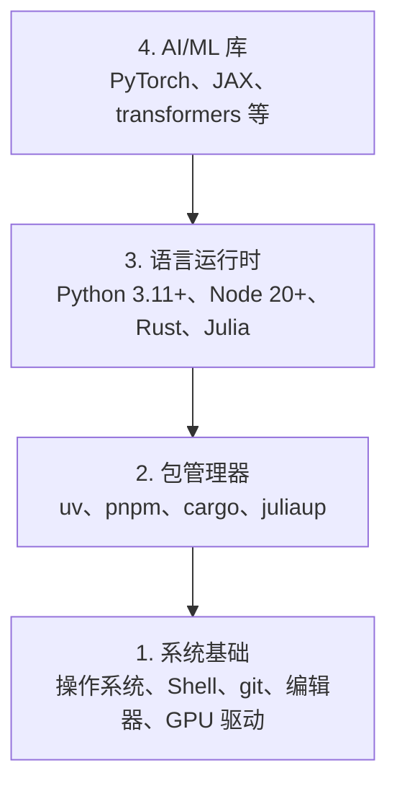

# 开发环境

> 工具塑造你的思维。搭建一次，就要搭对。

**类型：** 构建
**语言：** Python、Node.js、Rust
**前置知识：** 无
**时间：** 约 45 分钟

## 学习目标

- 从零搭建 Python 3.11+、Node.js 20+ 和 Rust 工具链
- 配置虚拟环境和包管理器以实现可复现的构建
- 验证 GPU 访问能力（CUDA/MPS）并运行测试张量操作
- 理解四层架构：系统层、包管理层、运行时层、AI 库层

## 问题所在

你即将通过 500+ 课程学习 AI 工程，涉及 Python、TypeScript、Rust 和 Julia。如果环境配置不当，每一课都会变成与工具链搏斗，而非真正学习。

大多数人跳过环境配置这一步，然后花数小时调试导入错误、版本冲突和缺失的 CUDA 驱动。我们将一次性做好这件事。

## 概念解析

AI 工程环境分为四层：



我们自底向上安装，每一层都依赖其下方的一层。

```figure
s0-env-stack
```

## 动手搭建

### 第一步：系统基础

检查你的系统并安装基础工具。

```bash
# macOS
xcode-select --install
brew install git curl wget

# Ubuntu/Debian
sudo apt update && sudo apt install -y build-essential git curl wget

# Windows（使用 WSL2）
wsl --install -d Ubuntu-24.04
```

### 第二步：使用 uv 安装 Python

我们使用 `uv` —— 它比 pip 快 10-100 倍，并自动处理虚拟环境。

```bash
curl -LsSf https://astral.sh/uv/install.sh | sh

uv python install 3.12

uv venv
source .venv/bin/activate  # 或在 Windows 上使用 .venv\Scripts\activate

uv pip install numpy matplotlib jupyter
```

验证：

```python
import sys
print(f"Python {sys.version}")

import numpy as np
print(f"NumPy {np.__version__}")
a = np.array([1, 2, 3])
print(f"向量: {a}, 自身点积: {np.dot(a, a)}")
```

### 第三步：使用 pnpm 安装 Node.js

用于 TypeScript 相关课程（智能体、MCP 服务器、Web 应用）。

```bash
curl -fsSL https://fnm.vercel.app/install | bash
fnm install 22
fnm use 22

npm install -g pnpm

node -e "console.log('Node', process.version)"
```

**macOS / Apple Silicon（M1/M2/M3/M4）：** 如果安装程序停止并提示 `Error: Cannot install under Rosetta 2 in ARM default prefix (/opt/homebrew)`，说明你的终端在 Rosetta 2 下运行（`arch` 输出 `i386`），而 Homebrew 是原生 arm64 版本。强制以 arm64 安装 fnm，将其接入你的 Shell，然后重新运行上述命令（从 `fnm install 22` 开始）：

```bash
arch -arm64 brew install fnm
echo 'eval "$(fnm env --use-on-cd)"' >> ~/.zshrc
source ~/.zshrc
```

### 第四步：安装 Rust

用于对性能要求高的课程（推理、系统级开发）。

```bash
curl --proto '=https' --tlsv1.2 -sSf https://sh.rustup.rs | sh

rustc --version
cargo --version
```

### 第五步：安装 Julia（可选）

用于数学密集型课程，Julia 在此类场景表现优异。

```bash
curl -fsSL https://install.julialang.org | sh

julia -e 'println("Julia ", VERSION)'
```

### 第六步：GPU 设置（如有 GPU）

**NVIDIA（Linux / Windows）：**

```bash
nvidia-smi

# 安装带 CUDA 支持的 PyTorch
uv pip install torch torchvision torchaudio --index-url https://download.pytorch.org/whl/cu124
```

**macOS / Apple Silicon（M1/M2/M3/M4）：** Mac 上没有 CUDA —— 这是正常的，不是故障。**不要**传递 `--index-url .../cuXXX`（这些 wheel 仅适用于 Linux/Windows，会导致安装失败）。安装普通版本，其中包含 Apple 的 MPS（Metal）GPU 后端：

```bash
uv pip install torch torchvision torchaudio
```

验证（任意平台均可运行）：

```python
import torch
print(f"CUDA 可用: {torch.cuda.is_available()}")           # macOS 上为 False —— 符合预期
print(f"MPS 可用:  {torch.backends.mps.is_available()}")   # Apple Silicon 上为 True
if torch.cuda.is_available():
    print(f"GPU: {torch.cuda.get_device_name(0)}")
```

没有 GPU？没问题。大多数课程可在 CPU 上运行。对于训练密集型课程，可使用 Google Colab 或云端 GPU。

### 第七步：验证你要开始的路线

从仓库根目录（包含 `README.md` 和 `phases/` 的目录）运行本课的所有命令。预检脚本只检查你启动所选路线所需的工具。默认跳过后续工具，让新手看到一个清晰的结果，而不是一堆警告。

启动完整的初学者序列：

```bash
python3 phases/00-setup-and-tooling/01-dev-environment/code/verify.py --route beginner
```

或仅检查你想要的路线：

```bash
python3 phases/00-setup-and-tooling/01-dev-environment/code/verify.py --route ml-foundations
python3 phases/00-setup-and-tooling/01-dev-environment/code/verify.py --route llm-engineering
python3 phases/00-setup-and-tooling/01-dev-environment/code/verify.py --route agents
python3 phases/00-setup-and-tooling/01-dev-environment/code/verify.py --route mcp
python3 phases/00-setup-and-tooling/01-dev-environment/code/verify.py --route agent-skills
python3 phases/00-setup-and-tooling/01-dev-environment/code/verify.py --route certification
```

如需让预检脚本同时检查后续课程使用的可选工具和依赖，添加 `--show-later` 参数。缺失的后续工具永远不会阻塞当前所选路线。

每个失败的必检项都会提供检测到的路径或导入错误，以及精确的修复命令。智能体技能（Agent Skills）和认证路线还会显示手动主机检查，因为 Python 脚本无法证明 AI 主机已发现某个技能，也无法验证你选择的技能范围是否可写。

当初学者预检通过后，会输出第一条可运行的课程：

```text
Ready to start Beginner course.
Next: python3 phases/01-math-foundations/01-linear-algebra-intuition/code/vectors.py
```

## 使用指南

你的环境已就绪，可以开始你所检查的路线。当课程需要时再安装后续工具，而不是在所有工具栈就绪后才开始第一节课。以下是整个课程中你会用到的内容：

| 语言 | 用于 | 包管理器 |
|------|------|----------|
| Python | 阶段 1-12（ML、DL、NLP、视觉、音频、LLM） | uv |
| TypeScript | 阶段 13-17（工具、智能体、蜂群、基础设施） | pnpm |
| Rust | 阶段 12、15-17（性能关键型系统） | cargo |
| Julia | 阶段 1（数学基础） | Pkg |

## 交付成果

本课产出的是一个验证脚本，任何人都可以运行它来检查自己的环境配置。

参见 `outputs/prompt-env-check.md`，其中包含一个帮助 AI 助手诊断环境问题的提示词。

## 练习

1. 运行验证脚本并修复任何失败项
2. 为此课程创建一个 Python 虚拟环境并安装 PyTorch
3. 用四种语言分别编写 "hello world" 并逐一运行
