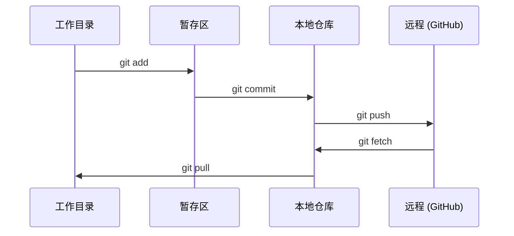

# Git 与协作

> 版本控制不是可选项。这里构建的每个实验、每个模型、每个课程都会被追踪。

**类型：** 学习
**语言：** --
**前置知识：** 阶段0，课程01
**时间：** 约30 分钟

## 学习目标

- 配置 git 身份并使用添加、提交和推送的日常工作流程
- 创建和合并分支以进行隔离的实验，不会破坏主分支
- 编写排除模型检查点和大型二进制文件的 `.gitignore`
- 使用 `git log` 浏览提交历史，了解项目的演进过程

## 问题

你即将在 20 个阶段中编写数百个代码文件。如果没有版本控制，你会丢失工作成果，破坏无法撤销的内容，并且无法与他人协作。

Git 是工具，GitHub 是代码存放的地方。本课涵盖本课程所需的内容，不多不少。

## 核心概念



记住三件事：
1. 频繁保存（`git commit`）
2. 推送到远程（`git push`）
3. 为实验创建分支（`git checkout -b experiment`）

```figure
s0-commit-dag
```

## 动手实践

### 第 1 步：配置 git

```bash
git config --global user.name "Your Name"
git config --global user.email "you@example.com"
```

### 第 2 步：日常工作流程

```bash
git status
git add file.py
git commit -m "Add perceptron implementation"
git push origin main
```

### 第 3 步：为实验创建分支

```bash
git checkout -b experiment/new-optimizer

# ... 进行修改，然后提交 ...

git checkout main
git merge experiment/new-optimizer
```

### 第 4 步：与本课程的仓库协作

你不能直接向课程仓库推送代码——只有维护者拥有写权限。先在 GitHub 上 Fork（点击右上角的 Fork 按钮），让 `origin` 指向你自己的副本：

```bash
git clone https://github.com/YOUR-USERNAME/ai-engineering-from-scratch.git
cd ai-engineering-from-scratch

git checkout -b my-progress
# 完成课程内容，提交你的代码
git push origin my-progress
```

## 使用方式

对于本课程，你只需要以下命令：

| 命令 | 使用场景 |
|------|---------|
| `git clone` | 获取课程仓库 |
| `git add` + `git commit` | 保存你的工作 |
| `git push` | 备份到 GitHub |
| `git checkout -b` | 尝试新功能，不破坏主分支 |
| `git log --oneline` | 查看你的操作记录 |

就这些。本课程不需要 rebase、cherry-pick 或 submodule。

## 练习

1. Fork 本仓库，克隆你的副本，创建名为 `my-progress` 的分支，新建一个文件，提交它，然后推送
2. 创建一个 `.gitignore`，排除模型检查点文件（`.pt`、`.pth`、`.safetensors`）
3. 使用 `git log --oneline` 查看本仓库的提交历史，了解课程是如何逐步添加的

## 关键术语

| 术语 | 人们怎么说 | 实际含义 |
|------|-----------|---------|
| Commit（提交） | "保存" | 你在某个时间点对整个项目的一份快照 |
| Branch（分支） | "一份副本" | 指向某个提交的指针，随着你的工作向前移动 |
| Merge（合并） | "合并代码" | 将某个分支的更改应用到另一个分支 |
| Remote（远程） | "云端" | 你的仓库的另一个副本，托管在某处（GitHub、GitLab） |
