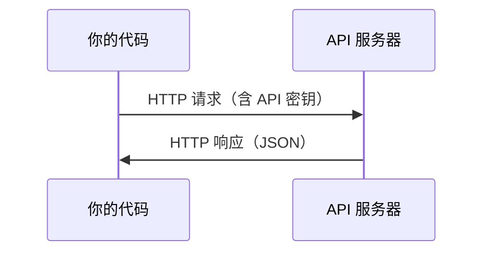

# API 与密钥

> 每个 AI API 的工作方式都相同：发送请求，获取响应。细节有所不同，但模式不变。

**类型：** 构建
**语言：** Python、TypeScript
**前置条件：** Phase 0、Lesson 01
**时间：** 约 30 分钟

## 学习目标

- 使用环境变量和 `.env` 文件安全地存储 API 密钥
- 使用 Anthropic Python SDK 和原始 HTTP 发起 LLM API 调用
- 对比基于 SDK 和原始 HTTP 的请求/响应格式，便于调试
- 识别并处理常见 API 错误，包括认证失败和速率限制

## 问题

从 Phase 11 开始，你将调用 LLM API（Anthropic、OpenAI、Google）。在 Phase 13-16 中，你会构建在这些 API 循环中运行的智能体。你需要了解 API 密钥的工作原理、如何安全存储它们，以及如何发起你的第一次 API 调用。

## 概念



每次 API 调用都包含：
1. 一个端点（URL）
2. 一个 API 密钥（身份验证）
3. 一个请求体（你请求的内容）
4. 一个响应体（你收到的结果）

```figure
s0-secret-inject
```

## 动手实现

### 步骤 1：安全地存储 API 密钥

永远不要将 API 密钥写在代码里。使用环境变量。

```bash
export ANTHROPIC_API_KEY="sk-ant-..."
export OPENAI_API_KEY="sk-..."
```

或者使用 `.env` 文件（将其添加到 `.gitignore`）：

```
ANTHROPIC_API_KEY=sk-ant-...
OPENAI_API_KEY=sk-...
```

### 步骤 2：第一次 API 调用（Python）

```python
import os

import anthropic

client = anthropic.Anthropic()

MODEL = os.environ.get("LLM_MODEL", "claude-sonnet-5")

response = client.messages.create(
    model=MODEL,
    max_tokens=256,
    messages=[{"role": "user", "content": "用一句话解释什么是神经网络"}]
)

print(response.content[0].text)
```

`LLM_MODEL` 用于选择 Anthropic 模型 id，默认是未标注日期的 Sonnet 别名。其他提供商（OpenAI、Google 及其他）也遵循"密钥 + 模型 id"的模式，但每家都有自己独有的 SDK、端点和请求/响应结构。

### 步骤 3：第一次 API 调用（TypeScript）

```typescript
import Anthropic from "@anthropic-ai/sdk";

const client = new Anthropic();

const MODEL = process.env.LLM_MODEL ?? "claude-sonnet-5";

const response = await client.messages.create({
  model: MODEL,
  max_tokens: 256,
  messages: [{ role: "user", content: "用一句话解释什么是神经网络" }],
});

console.log(response.content[0].text);
```

### 步骤 4：原始 HTTP（不使用 SDK）

```python
import os
import urllib.request
import json

url = "https://api.anthropic.com/v1/messages"
headers = {
    "Content-Type": "application/json",
    "x-api-key": os.environ["ANTHROPIC_API_KEY"],
    "anthropic-version": "2023-06-01",
}
body = json.dumps({
    "model": os.environ.get("LLM_MODEL", "claude-sonnet-5"),
    "max_tokens": 256,
    "messages": [{"role": "user", "content": "用一句话解释什么是神经网络"}],
}).encode()

req = urllib.request.Request(url, data=body, headers=headers, method="POST")
with urllib.request.urlopen(req) as resp:
    result = json.loads(resp.read())
    print(result["content"][0]["text"])
```

这正是 SDK 在底层所做的事情。理解原始 HTTP 调用有助于调试。

## 使用指南

本课程中：

| API | 使用时机 | 免费额度 |
|-----|---------|---------|
| Anthropic（Claude） | Phase 11-16（智能体、工具） | 注册送 $5 额度 |
| OpenAI | Phase 11（对比练习） | 注册送 $5 额度 |
| Hugging Face | Phase 4-10（模型、数据集） | 免费 |

你不需要现在就全部设置好。在课程需要时再配置。

## 交付物

本课产出：
- `outputs/prompt-api-troubleshooter.md` — 诊断常见 API 错误

## 练习

1. 获取 Anthropic API 密钥并发起你的第一次 API 调用
2. 尝试原始 HTTP 版本，并将响应格式与 SDK 版本进行对比
3. 故意使用错误的 API 密钥，阅读错误信息

## 关键术语

| 术语 | 人们怎么说 | 实际含义 |
|------|-----------|---------|
| API 密钥 | "API 的密码" | 标识你账户并授权请求的唯一字符串 |
| 速率限制 | "他们在限制我" | 每分钟/每小时最大请求数，用于防止滥用并保障公平使用 |
| Token | "一个词"（API 语境下） | 计费单位：输入和输出的 token 分别计数并分别计费 |
| 流式传输 | "实时响应" | 逐词接收响应，而非等待完整响应返回 |
