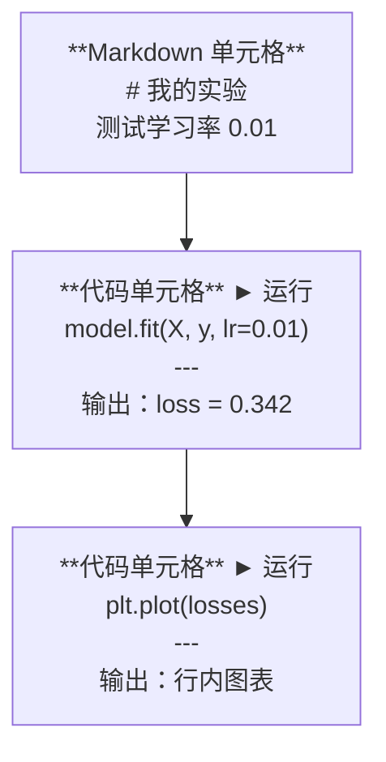
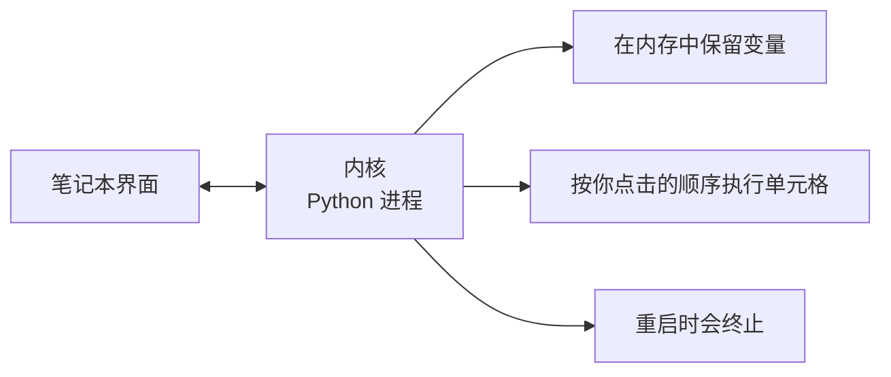

# Jupyter Notebooks

> Notebooks are the lab bench of AI engineering. You prototype here, then move what works into production.

**类型：** 构建
**语言：** Python
**前置知识：** Phase 0, Lesson 01
**时间：** 约 30 分钟

## 学习目标

- 安装并启动 JupyterLab、Jupyter Notebook 或带 Jupyter 扩展的 VS Code
- 使用魔法命令（`%timeit`、`%%time`、`%matplotlib inline`）进行基准测试和行内可视化
- 区分何时使用笔记本（notebook）与脚本，并应用"在笔记本中探索，用脚本交付"的工作流
- 识别并避免常见的笔记本陷阱：执行顺序错乱、隐藏状态和内存泄漏

## 问题背景

每篇 AI 论文、教程和 Kaggle 比赛都在使用 Jupyter 笔记本。它们让你可以分段运行代码、行内查看输出、将代码与解释混合排列，并快速迭代。如果你不借助笔记本学习 AI，就如同做数学题却不用草稿纸。

但笔记本存在真实的陷阱。有人把它们用于所有事情，包括他们并不擅长的事。知道何时该用笔记本、何时该用脚本，能帮你避免日后调试时的噩梦。

## 概念解析

一个笔记本是一系列单元格的列表。每个单元格要么是代码，要么是文本。



内核（kernel）是一个在后台运行的 Python 进程。当你运行某个单元格时，它会把代码发送给内核，内核执行后把结果发回。所有单元格共享同一个内核，因此变量在单元格之间会持久保留。



"按你点击的顺序执行"这部分既是超能力，也是脚踩地雷。

```figure
s0-cell-order
```

## 动手构建

### 第 1 步：选择你的界面

三种选择，同一种格式：

| 界面 | 安装方式 | 最适合 |
|-----------|---------|----------|
| JupyterLab | `pip install jupyterlab` 然后 `jupyter lab` | 完整 IDE 体验，多个标签页，文件浏览器，终端 |
| Jupyter Notebook | `pip install notebook` 然后 `jupyter notebook` | 简单轻量，一次一个笔记本 |
| VS Code | 安装 "Jupyter" 扩展 | 已在编辑器内，git 集成，支持调试 |

三者读取和写入的都是同一种 `.ipynb` 文件。选你喜欢的就行。JupyterLab 在 AI 工作中最常见。

```bash
pip install jupyterlab
jupyter lab
```

### 第 2 步：常用的键盘快捷键

你有两种操作模式。按 `Escape` 进入命令模式（左侧出现蓝色条），按 `Enter` 进入编辑模式（左侧出现绿色条）。

**命令模式（最常用）：**

| 按键 | 操作 |
|-----|--------|
| `Shift+Enter` | 运行当前单元格，移动到下一个 |
| `A` | 在上方插入单元格 |
| `B` | 在下方插入单元格 |
| `DD` | 删除单元格 |
| `M` | 转换为 Markdown |
| `Y` | 转换为代码 |
| `Z` | 撤销单元格操作 |
| `Ctrl+Shift+H` | 显示所有快捷键 |

**编辑模式：**

| 按键 | 操作 |
|-----|--------|
| `Tab` | 自动补全 |
| `Shift+Tab` | 显示函数签名 |
| `Ctrl+/` | 切换注释 |

`Shift+Enter` 是你每天会按上千次的那个。先学会它。

### 第 3 步：单元格类型

**代码单元格** 运行 Python 并显示输出：

```python
import numpy as np
data = np.random.randn(1000)
data.mean(), data.std()
```

输出：`(0.0032, 0.9987)`

**Markdown 单元格** 渲染格式化的文本。用它来记录你在做什么以及为什么这样做。支持标题、加粗、斜体、LaTeX 数学公式（`$E = mc^2$`）、表格和图片。

### 第 4 步：魔法命令

这些不是 Python，而是 Jupyter 特有的命令，以 `%`（行魔法）或 `%%`（单元魔法）开头。

**对你的代码计时：**

```python
%timeit np.random.randn(10000)
```

输出：`45.2 us +/- 1.3 us per loop`

```python
%%time
model.fit(X_train, y_train, epochs=10)
```

输出：`Wall time: 2.34 s`

`%timeit` 多次运行代码并取平均值。`%%time` 只运行一次。用 `%timeit` 做微基准测试，用 `%%time` 做训练过程计时。

**启用行内图表：**

```python
%matplotlib inline
```

之后每一个 `plt.plot()` 或 `plt.show()` 都会直接在笔记本中渲染。

**不离开笔记本就能安装包：**

```python
!pip install scikit-learn
```

`!` 前缀可以运行任意 shell 命令。

**查看环境变量：**

```python
%env CUDA_VISIBLE_DEVICES
```

### 第 5 步：行内显示丰富的输出

笔记本会自动显示单元格中的最后一个表达式。但你也可以自己控制：

```python
import pandas as pd

df = pd.DataFrame({
    "模型": ["线性", "随机森林", "神经网络"],
    "准确率": [0.72, 0.89, 0.94],
    "训练时间": [0.1, 2.3, 45.6]
})
df
```

这会渲染出一个格式化的 HTML 表格，而不是纯文本。图表也一样：

```python
import matplotlib.pyplot as plt

plt.figure(figsize=(8, 4))
plt.plot([1, 2, 3, 4], [1, 4, 2, 3])
plt.title("行内图表")
plt.show()
```

图表会直接出现在单元格下方。这就是笔记本在 AI 领域占据主导地位的原因。你把数据、图表和代码放在一起看。

对于图片：

```python
from IPython.display import Image, display
display(Image(filename="architecture.png"))
```

### 第 6 步：Google Colab

Colab 是云端的免费 Jupyter 笔记本。它提供 GPU、预装库和 Google Drive 集成。无需本地设置。

1. 访问 [colab.research.google.com](https://colab.research.google.com)
2. 从本课程中上传任意 `.ipynb` 文件
3. 运行时 > 更改运行时类型 > T4 GPU（免费）

Colab 与本地 Jupyter 的差异：
- 文件在不同会话之间不会保留（保存到 Drive 或下载）
- 预装：numpy、pandas、matplotlib、torch、tensorflow、sklearn
- 用 `from google.colab import files` 上传/下载文件
- 用 `from google.colab import drive; drive.mount('/content/drive')` 实现持久化存储
- 免费套餐下，会话在 90 分钟无活动后会超时

## 使用技巧

### 笔记本 vs 脚本：何时用哪个

| 适合用笔记本的场景 | 适合用脚本的场景 |
|-------------------|-----------------|
| 探索数据集 | 训练流水线 |
| 原型设计模型 | 可复用的工具函数 |
| 可视化结果 | 包含 `if __name__` 的代码 |
| 解释你的工作 | 定时运行的代码 |
| 快速实验 | 生产环境代码 |
| 课程练习 | 包和库 |

核心原则：**在笔记本中探索，用脚本交付**。

AI 中常见的工作流：
1. 在笔记本中探索数据
2. 在笔记本中原型化你的模型
3. 验证可行后，把代码移到 `.py` 文件里
4. 在笔记本中重新导入这些 `.py` 文件进行进一步实验

### 常见陷阱

**执行顺序错乱。** 你先运行了第 5 个单元格，又运行第 2 个，再运行第 7 个。你的机器上正常运行，但别人从头到尾顺序执行时就崩了。解决方法：分享前执行 内核 > 重启并运行全部。

**隐藏状态。** 你删除了一个单元格，但它创建的那个变量依然留在内存里。笔记本看起来干干净净，却依赖一个"幽灵单元格"。解决方法：定期重启内核。

**内存泄漏。** 加载一个 4GB 的数据集，训练模型，再加载另一个数据集。没有任何内存被释放。解决方法：`del variable_name` 并调用 `gc.collect()`，或直接重启内核。

## 交付成果

本课产出：
- `outputs/prompt-notebook-helper.md`，用于调试笔记本问题

## 练习

1. 打开 JupyterLab，创建一个笔记本，使用 `%timeit` 比较列表推导式与 numpy 在生成 10 万个随机数的数组时的性能差异
2. 创建一个同时包含 Markdown 和代码单元格的笔记本，加载 CSV、显示 dataframe 并绘制图表。然后运行 内核 > 重启并运行全部 来验证从头到尾顺序执行时是否正常工作
3. 把 `code/notebook_tips.py` 中的代码粘贴到 Colab 笔记本中，使用免费 GPU 运行它

## 关键术语

| 术语 | 人们常说的 | 实际含义 |
|------|----------------|----------------------|
| Kernel（内核） | "运行我代码的那个东西" | 一个独立的 Python 进程，负责执行单元格并将变量保留在内存中 |
| Cell（单元格） | "一段代码块" | 笔记本中可独立运行的单位，可以是代码或 Markdown |
| Magic command（魔法命令） | "Jupyter 小技巧" | 以 `%` 或 `%%` 开头的特殊命令，用于控制笔记本环境 |
| `.ipynb` | "笔记本文件" | 包含单元格、输出和元数据的 JSON 文件。IPython Notebook 的缩写 |

## 延伸阅读

- [JupyterLab 文档](https://jupyterlab.readthedocs.io/) 完整功能介绍
- [Google Colab FAQ](https://research.google.com/colaboratory/faq.html) Colab 专属限制与特性
- [28 条 Jupyter Notebook 技巧](https://www.dataquest.io/blog/jupyter-notebook-tips-tricks-shortcuts/) 高级用户快捷键与技巧
