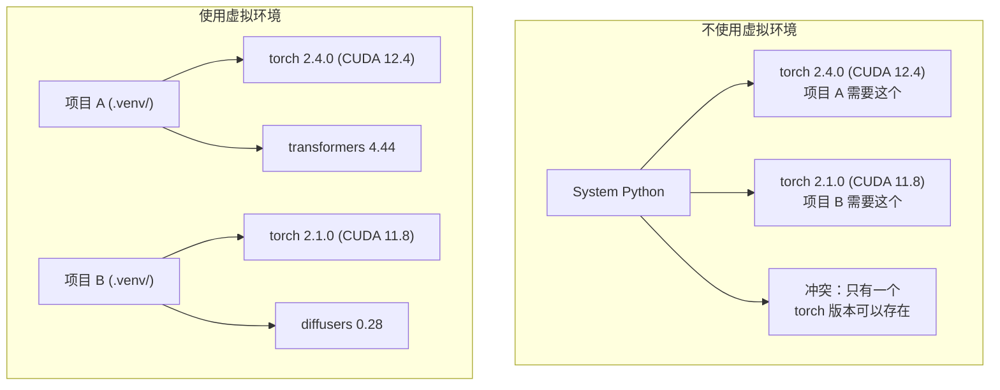

# Python 环境

> 依赖地狱是真实存在的。虚拟环境是解药。

**类型：** Build
**语言：** Shell
**前置条件：** Phase 0, Lesson 01
**时间：** 约 30 分钟

## 学习目标

- 使用 `uv`、`venv` 或 `conda` 创建隔离的虚拟环境
- 编写带有可选依赖组的 `pyproject.toml`，并生成锁文件以确保可复现性
- 诊断并修复常见陷阱：全局安装、pip/conda 混用、CUDA 版本不匹配
- 为存在冲突依赖的项目实施分阶段环境策略

## 问题所在

你为微调项目安装了 PyTorch 2.4。到了下周，另一个项目需要 PyTorch 2.1，因为它的 CUDA 构建版本被固定了。你在全局升级了，第一个项目就崩了。你降级了，第二个项目又崩了。

这就是依赖地狱。在 AI/ML 工作中它经常发生，因为：

- PyTorch、JAX 和 TensorFlow 各自携带自己的 CUDA 绑定
- 模型库会固定特定框架版本
- 全局 `pip install` 会覆盖之前安装的任何内容
- CUDA 11.8 构建无法与 CUDA 12.x 驱动配合使用（反之亦然）

解决方法：每个项目都拥有自己独立的隔离环境，以及自己独立的包。

## 概念



```figure
s0-env-isolation
```

## 构建它

### 方案一：uv venv（推荐）

`uv` 是最快的 Python 包管理器（比 pip 快 10-100 倍）。它在一个工具中处理虚拟环境、Python 版本和依赖解析。

```bash
curl -LsSf https://astral.sh/uv/install.sh | sh

uv python install 3.12

cd your-project
uv venv
source .venv/bin/activate
```

安装包：

```bash
uv pip install torch numpy
```

一步创建带有 `pyproject.toml` 的项目：

```bash
uv init my-ai-project
cd my-ai-project
uv add torch numpy matplotlib
```

### 方案二：venv（内置）

如果你无法安装 `uv`，Python 自带 `venv`：

```bash
python3 -m venv .venv
source .venv/bin/activate  # Linux/macOS
.venv\Scripts\activate     # Windows

pip install torch numpy
```

比 `uv` 慢，但在安装了 Python 的任何地方都能工作。

### 方案三：conda（需要时再用）

Conda 管理非 Python 依赖，如 CUDA 工具包、cuDNN 和 C 库。以下情况使用它：

- 需要特定 CUDA 工具包版本，但不想全局安装
- 在共享集群上，无法安装系统包
- 某个库的安装说明写着"使用 conda"

```bash
# 安装 miniconda（不是完整的 Anaconda）
curl -LsSf https://repo.anaconda.com/miniconda/Miniconda3-latest-Linux-x86_64.sh -o miniconda.sh
bash miniconda.sh -b

conda create -n myproject python=3.12
conda activate myproject

conda install pytorch torchvision torchaudio pytorch-cuda=12.4 -c pytorch -c nvidia
```

一条规则：如果你用 conda 管理某个环境，那该环境中的所有包都用 conda 安装。将 `pip install` 混入 conda 环境会导致难以调试的依赖冲突。

### 本课程：分阶段策略

你可以为整个课程创建一个环境。但不要这样做。不同阶段需要不同的（有时是冲突的）依赖。

策略如下：

```
ai-engineering-from-scratch/
├── .venv/                    <-- 阶段 0-3 共用的轻量级环境
├── phases/
│   ├── 04-neural-networks/
│   │   └── .venv/            <-- PyTorch 环境
│   ├── 05-cnns/
│   │   └── .venv/            <-- 相同 PyTorch 环境（符号链接或共享）
│   ├── 08-transformers/
│   │   └── .venv/            <-- 可能需要不同版本的 transformer
│   └── 11-llm-apis/
│       └── .venv/            <-- API SDK，不需要 torch
```

`code/env_setup.sh` 中的脚本会为本课程创建基础环境。

## pyproject.toml 基础

每个 Python 项目都应该有 `pyproject.toml`。它在一个文件中替代了 `setup.py`、`setup.cfg` 和 `requirements.txt`。

```toml
[project]
name = "ai-engineering-from-scratch"
version = "0.1.0"
requires-python = ">=3.11"
dependencies = [
    "numpy>=1.26",
    "matplotlib>=3.8",
    "jupyter>=1.0",
    "scikit-learn>=1.4",
]

[project.optional-dependencies]
torch = ["torch>=2.3", "torchvision>=0.18"]
llm = ["anthropic>=0.39", "openai>=1.50"]
```

然后安装：

```bash
uv pip install -e ".[torch]"    # 基础 + PyTorch
uv pip install -e ".[llm]"     # 基础 + LLM SDK
uv pip install -e ".[torch,llm]" # 全部
```

## 锁文件

锁文件将每个依赖（包括传递依赖）固定到精确版本。这保证了可复现性：任何从锁文件安装的人都将获得完全相同的包。

```bash
# 使用 uv add 时，uv 会自动生成 uv.lock
uv add numpy

# pip-tools 方案
uv pip compile pyproject.toml -o requirements.lock
uv pip install -r requirements.lock
```

将锁文件提交到 git。当有人克隆仓库时，他们从锁文件安装，获得完全相同的版本。

## 常见错误

### 1. 全局安装

```bash
pip install torch  # 错误：安装到系统 Python

source .venv/bin/activate
pip install torch  # 正确：安装到虚拟环境
```

检查包安装到哪里：

```bash
which python       # 应该显示 .venv/bin/python，而不是 /usr/bin/python
which pip           # 应该显示 .venv/bin/pip
```

### 2. 混用 pip 和 conda

```bash
conda create -n myenv python=3.12
conda activate myenv
conda install pytorch -c pytorch
pip install some-other-package   # 错误：可能破坏 conda 的依赖追踪
conda install some-other-package # 正确：让 conda 管理一切
```

如果你必须要在 conda 中使用 pip（有些包只有 pip 版本），先安装所有 conda 包，最后再安装 pip 包。

### 3. 忘记激活

```bash
python train.py           # 使用系统 Python，缺少包
source .venv/bin/activate
python train.py           # 使用项目 Python，找到包
```

你的 shell 提示符应该显示环境名称：

```
(.venv) $ python train.py
```

### 4. 将 .venv 提交到 git

```bash
echo ".venv/" >> .gitignore
```

虚拟环境大小在 200MB-2GB 之间。它们是本地化的，无法在不同机器间移植。应该提交 `pyproject.toml` 和锁文件。

### 5. CUDA 版本不匹配

```bash
nvidia-smi                # 显示驱动 CUDA 版本（例如 12.4）
python -c "import torch; print(torch.version.cuda)"  # 显示 PyTorch CUDA 版本

# 这两个必须兼容。
# PyTorch CUDA 版本必须 <= 驱动 CUDA 版本。
```

## 使用它

运行设置脚本以创建你的课程环境：

```bash
bash phases/00-setup-and-tooling/06-python-environments/code/env_setup.sh
```

这会在仓库根目录创建一个 `.venv`，其中安装了核心依赖并已验证通过。

## 练习

1. 运行 `env_setup.sh` 并确认所有检查通过
2. 创建第二个虚拟环境，在其中安装不同版本的 numpy，并确认两个环境是隔离的
3. 为一个同时需要 PyTorch 和 Anthropic SDK 的项目编写 `pyproject.toml`
4. 故意全局安装一个包（不激活 venv），观察它安装到哪里，然后卸载它

## 关键术语

| 术语 | 人们怎么说 | 实际含义 |
|------|-----------|---------|
| 虚拟环境 | "A venv" | 包含 Python 解释器和包的隔离目录，与系统 Python 分离 |
| 锁文件 | "Pinned dependencies" | 列出每个包及其精确版本的文件，保证跨机器安装完全一致 |
| pyproject.toml | "The new setup.py" | Python 项目的标准配置文件，替代 setup.py/setup.cfg/requirements.txt |
| 传递依赖 | "A dependency of a dependency" | 包 B 依赖 C；如果你安装的 A 依赖 B，则 C 是 A 的传递依赖 |
| CUDA 不匹配 | "My GPU isn't working" | PyTorch 编译时使用的 CUDA 版本与你的 GPU 驱动支持的不一致 |
