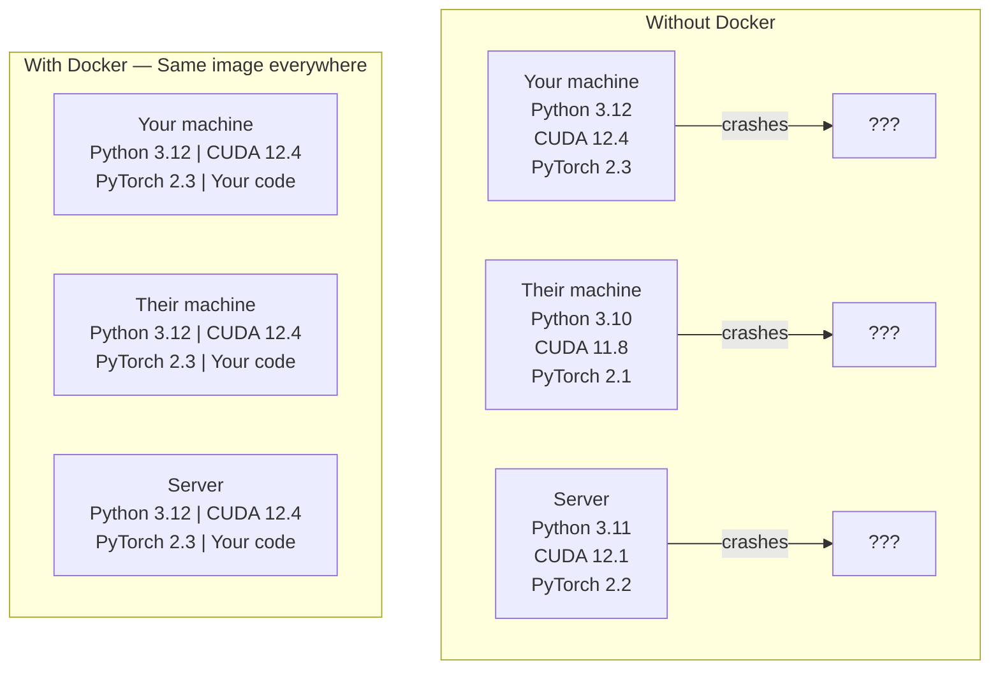

# Docker for AI

> 容器让"在我机器上能跑"成为历史。

**类型：** Build
**语言：** Docker
**前置知识：** Phase 0、Lesson 01 和 Lesson 03
**时间：** ~60 分钟

## 学习目标

- 从 Dockerfile 构建带有 CUDA、PyTorch 和 AI 库的 GPU 加速 Docker 镜像
- 挂载宿主机目录作为 Volume，在容器重建后保留模型、数据集和代码
- 配置 NVIDIA Container Toolkit，在容器内暴露 GPU
- 使用 Docker Compose 编排多服务 AI 应用（推理服务器 + 向量数据库）

## 问题所在

你在笔记本电脑上用 PyTorch 2.3、CUDA 12.4 和 Python 3.12 训练了一个模型。你的同事用的是 PyTorch 2.1、CUDA 11.8 和 Python 3.10。你的模型在他的机器上崩溃了。但你的 Dockerfile 在两台机器上都能正常工作。

AI 项目的依赖配置是一场噩梦。典型的堆栈包括 Python、PyTorch、CUDA 驱动、cuDNN、系统级 C 库，以及像 flash-attn 这样需要精确编译器版本的专用包。Docker 把所有这些打包成一个在任何地方都能一致运行的镜像。

## 概念

Docker 将你的代码、运行时、库和系统工具封装到一个名为容器的隔离单元中。可以把它想象成轻量级虚拟机，但它共享宿主机内核而不是运行自己的内核，所以启动时间是秒级而不是分钟级。



### 为什么 AI 项目比大多数项目更需要 Docker

1. **GPU 驱动很脆弱。** CUDA 12.4 的代码不能在 CUDA 11.8 上运行。Docker 将 CUDA 工具包隔离在容器内部，同时通过 NVIDIA Container Toolkit 共享宿主机 GPU 驱动。

2. **模型权重很大。** 一个 7B 参数的模型在 fp16 下是 14 GB。你不想每次重建容器时都重新下载它。Docker Volume 让你从宿主机挂载一个 models 目录。

3. **多服务架构很常见。** 一个真正的 AI 应用不仅仅是一个 Python 脚本。它是推理服务器、用于 RAG 的向量数据库，可能还有一个 Web 前端。Docker Compose 用一条命令编排所有这些服务。

### 关键词汇

| 术语 | 含义 |
|------|------|
| Image（镜像） | 只读模板。你的配方。从 Dockerfile 构建。 |
| Container（容器） | 镜像的运行实例。你的厨房。 |
| Dockerfile | 构建镜像的指令。逐层执行。 |
| Volume（卷） | 容器重启后仍能持久化的存储。 |
| docker-compose | 在 YAML 中定义多容器应用的工具。 |

### AI 中常见的容器模式

```
Dev Container
  完整的工具链。编辑器支持。Jupyter。调试工具。
  在开发和实验阶段使用。

Training Container
  极简。只有训练脚本和依赖。
  在 GPU 集群上运行。无编辑器，无 Jupyter。

Inference Container
  为服务化优化。镜像小。冷启动快。
  在生产环境的负载均衡器后面运行。
```

```figure
s0-image-layers
```

## 动手做

### 第 1 步：安装 Docker

```bash
# macOS
brew install --cask docker
open /Applications/Docker.app

# Ubuntu
curl -fsSL https://get.docker.com | sh
sudo usermod -aG docker $USER
# 注销并重新登录使组更改生效
```

验证：

```bash
docker --version
docker run hello-world
```

### 第 2 步：安装 NVIDIA Container Toolkit（带 NVIDIA GPU 的 Linux）

这能让 Docker 容器访问你的 GPU。macOS 和 Windows (WSL2) 用户可以跳过此步；Docker Desktop 在这些平台上以不同方式处理 GPU 直通。

```bash
distribution=$(. /etc/os-release;echo $ID$VERSION_ID)
curl -fsSL https://nvidia.github.io/libnvidia-container/gpgkey | sudo gpg --dearmor -o /usr/share/keyrings/nvidia-container-toolkit-keyring.gpg
curl -s -L https://nvidia.github.io/libnvidia-container/$distribution/libnvidia-container.list | \
    sed 's#deb https://#deb [signed-by=/usr/share/keyrings/nvidia-container-toolkit-keyring.gpg] https://#g' | \
    sudo tee /etc/apt/sources.list.d/nvidia-container-toolkit.list

sudo apt-get update
sudo apt-get install -y nvidia-container-toolkit
sudo nvidia-ctk runtime configure --runtime=docker
sudo systemctl restart docker
```

在容器内测试 GPU 访问：

```bash
docker run --rm --gpus all nvidia/cuda:12.4.1-base-ubuntu22.04 nvidia-smi
```

如果你看到 GPU 信息，说明工具包正常工作。

### 第 3 步：了解基础镜像

选择合适的的基础镜像可以节省数小时的调试时间。

```
nvidia/cuda:12.4.1-devel-ubuntu22.04
  完整的 CUDA 工具包。包含编译器。
  适用场景：构建需要 nvcc 的包（flash-attn、bitsandbytes）
  大小：~4 GB

nvidia/cuda:12.4.1-runtime-ubuntu22.04
  仅 CUDA 运行时。无编译器。
  适用场景：运行预构建代码
  大小：~1.5 GB

pytorch/pytorch:2.6.0-cuda12.4-cudnn9-runtime
  在 CUDA 基础上预装 PyTorch。
  适用场景：跳过 PyTorch 安装步骤
  大小：~6 GB

python:3.12-slim
  无 CUDA。纯 CPU。
  适用场景：CPU 推理、轻量工具
  大小：~150 MB
```

### 第 4 步：为 AI 开发编写 Dockerfile

这是位于 `code/Dockerfile` 的 Dockerfile。逐行解释：

```dockerfile
FROM nvidia/cuda:12.4.1-devel-ubuntu22.04

ENV DEBIAN_FRONTEND=noninteractive
ENV PYTHONUNBUFFERED=1

RUN apt-get update && apt-get install -y --no-install-recommends \
    software-properties-common \
    git \
    curl \
    build-essential \
    && add-apt-repository -y ppa:deadsnakes/ppa \
    && apt-get update && apt-get install -y --no-install-recommends \
    python3.12 \
    python3.12-venv \
    python3.12-dev \
    && rm -rf /var/lib/apt/lists/*

RUN update-alternatives --install /usr/bin/python python /usr/bin/python3.12 1

RUN curl -sSL https://raw.githubusercontent.com/pypa/get-pip/3b73145063be545b649ad9ca83ea8da5fc915a4f/public/get-pip.py -o /tmp/get-pip.py \
    && echo "a341e1a43e38001c551a1508a73ff23636a11970b61d901d9a1cad2a18f57055  /tmp/get-pip.py" | sha256sum -c - \
    && python /tmp/get-pip.py \
    && rm /tmp/get-pip.py \
    && update-alternatives --install /usr/bin/pip pip /usr/local/bin/pip3.12 1

RUN python -m pip install --no-cache-dir --upgrade pip setuptools wheel

RUN python -m pip install --no-cache-dir \
    torch==2.6.0+cu124 \
    torchvision==0.21.0+cu124 \
    torchaudio==2.6.0+cu124 \
    --index-url https://download.pytorch.org/whl/cu124

RUN python -m pip install --no-cache-dir \
    numpy \
    pandas \
    scikit-learn \
    matplotlib \
    jupyter \
    transformers \
    datasets \
    accelerate \
    safetensors

WORKDIR /workspace

VOLUME ["/workspace", "/models"]

EXPOSE 8888

CMD ["python"]
```

构建它：

```bash
docker build -t ai-dev -f phases/00-setup-and-tooling/07-docker-for-ai/code/Dockerfile .
```

第一次构建需要一些时间（下载 CUDA 基础镜像 + PyTorch）。后续构建会使用缓存层。

运行它：

```bash
docker run --rm -it --gpus all \
    -v $(pwd):/workspace \
    -v ~/models:/models \
    ai-dev python -c "import torch; print(f'PyTorch {torch.__version__}, CUDA: {torch.cuda.is_available()}')"
```

在容器内运行 Jupyter：

```bash
docker run --rm -it --gpus all \
    -v $(pwd):/workspace \
    -v ~/models:/models \
    -p 8888:8888 \
    ai-dev jupyter notebook --ip=0.0.0.0 --port=8888 --no-browser --allow-root
```

### 第 5 步：用于数据和模型的 Volume 挂载

Volume 挂载对 AI 工作至关重要。没有它们，你的 14 GB 模型下载会在容器停止时消失。

```bash
# 挂载你的代码
-v $(pwd):/workspace

# 挂载共享的 models 目录
-v ~/models:/models

# 挂数据集
-v ~/datasets:/data
```

在训练脚本中，从挂载路径加载：

```python
from transformers import AutoModel

model = AutoModel.from_pretrained("/models/llama-7b")
```

模型保存在你的宿主机文件系统上。可以随意重建容器而无需重新下载。

### 第 6 步：用 Docker Compose 做多服务 AI 应用

一个真正的 RAG 应用需要推理服务器和向量数据库。Docker Compose 一条命令同时运行两者。

参见 `code/docker-compose.yml`：

```yaml
services:
  ai-dev:
    build:
      context: .
      dockerfile: Dockerfile
    deploy:
      resources:
        reservations:
          devices:
            - driver: nvidia
              count: all
              capabilities: [gpu]
    volumes:
      - ../../../:/workspace
      - ~/models:/models
      - ~/datasets:/data
    ports:
      - "8888:8888"
    stdin_open: true
    tty: true
    command: jupyter notebook --ip=0.0.0.0 --port=8888 --no-browser --allow-root

  qdrant:
    image: qdrant/qdrant:v1.12.5
    ports:
      - "6333:6333"
      - "6334:6334"
    volumes:
      - qdrant_data:/qdrant/storage

volumes:
  qdrant_data:
```

启动一切：

```bash
cd phases/00-setup-and-tooling/07-docker-for-ai/code
docker compose up -d
```

现在你的 AI 开发容器可以通过服务名访问向量数据库 `http://qdrant:6333`。Docker Compose 会自动创建共享网络。

从 AI 容器内部测试连接：

```python
from qdrant_client import QdrantClient

client = QdrantClient(host="qdrant", port=6333)
print(client.get_collections())
```

停止一切：

```bash
docker compose down
```

加上 `-v` 还会删除 qdrant 数据卷：

```bash
docker compose down -v
```

### 第 7 步：AI 工作中常用的 Docker 命令

```bash
# 列出运行中的容器
docker ps

# 列出所有镜像及其大小
docker images

# 删除未使用的镜像（释放磁盘空间）
docker system prune -a

# 查看运行中容器内的 GPU 使用情况
docker exec -it <container_id> nvidia.sm

# 从容器复制文件到宿主机
docker cp <container_id>:/workspace/results.csv ./results.csv

# 查看容器日志
docker logs -f <container_id>
```

## 使用它

你现在拥有了一个可复现的 AI 开发环境。在后续课程中：

- 使用 `docker compose up` 同时启动开发环境和向量数据库
- 将代码、模型和数据挂载为 Volume，确保重建之间不会丢失任何内容
- 当某个课程需要新的 Python 包时，将其添加到 Dockerfile 并重新构建
- 与队友分享你的 Dockerfile。他们获得完全相同的环境。

### 没有 GPU？

去掉 `--gpus all` 标志和 NVIDIA deploy 块。容器仍然可以用于基于 CPU 的课程。PyTorch 会自动检测 CUDA 的缺失并回退到 CPU。

## 练习

1. 构建 Dockerfile 并在容器内运行 `python -c "import torch; print(torch.__version__)"`
2. 启动 docker-compose 栈，验证 Qdrant 可从 AI 容器通过 `http://qdrant:6333/collections` 访问
3. 在 Dockerfile 中添加 `flask`，重新构建，并在 5000 端口运行一个简单的 API 服务器。用 `-p 5000:5000` 映射端口
4. 用 `docker images` 测量镜像大小。尝试将基础镜像从 `devel` 切换到 `runtime` 并比较大小

## 关键术语

| 术语 | 人们怎么说 | 实际含义 |
|------|-----------|---------|
| Container（容器） | "轻量级 VM" | 使用宿主机内核的隔离进程，拥有独立的文件系统和网络 |
| Image layer（镜像层） | "缓存步骤" | 每个 Dockerfile 指令创建一个层。未改变的层会被缓存，因此重建速度快。 |
| NVIDIA Container Toolkit | "Docker 中的 GPU" | 一个运行时钩子，通过 `--gpus` 标志将宿主机 GPU 暴露给容器 |
| Volume mount（卷挂载） | "共享文件夹" | 宿主机上的目录映射到容器内部。容器停止后更改仍然保留。 |
| Base image（基础镜像） | "起点" | 你的 Dockerfile 在其基础上构建的 `FROM` 镜像。决定哪些内容已预装。 |
