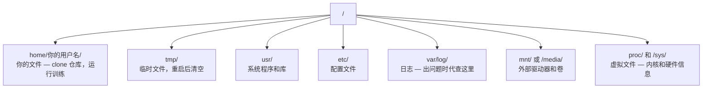

# Linux for AI

> 大多数 AI 运行在 Linux 上。你需要掌握足够多的知识，以免卡住。

**类型：** 学习
**语言：** --
**前置条件：** Phase 0, Lesson 01
**预计时间：** ~30 分钟

## 学习目标

- 通过命令行导航 Linux 文件系统并执行基本的文件操作
- 使用 `chmod` 和 `chown` 管理文件权限，解决"Permission denied"错误
- 使用 `apt` 安装系统包，并为 AI 工作准备一台全新的 GPU 机器
- 识别从 macOS 切换到 Linux 时常见的差异，这些差异常会让远程机器的开发者踩坑

## 问题所在

你在 macOS 或 Windows 上开发。但当你 SSH 到云 GPU 机器、租赁 Lambda 实例或启动 EC2 机器的那一刻，你进入的是 Ubuntu 环境。终端是你唯一的界面。没有 Finder，没有资源管理器，没有 GUI。如果你无法从命令行导航文件系统、安装软件和管理工作进程，你就会陷入困境——付着闲置的 GPU 小时费，却在 Google 搜索"如何在 Linux 中解压文件"。

这是一份生存指南。它只涵盖你在远程 Linux 机器上从事 AI 工作所需的知识。不多不少。

## 文件系统布局

Linux 将所有内容组织在单一根目录 `/` 之下。没有 `C:\` 或 `/Volumes`。你实际会用到的目录：



你的家目录是 `~` 或 `/home/你的用户名`。你几乎一切操作都在这里进行。

## 常用命令

这 15 个命令覆盖了你在使用远程 GPU 机器时 95% 的操作。

### 移动与导航

```bash
pwd                         # 我在哪里？
ls                          # 这里有什么？
ls -la                      # 这里有什么，包括带详情的隐藏文件？
cd /path/to/dir             # 进入某个目录
cd ~                        # 回到家目录
cd ..                       # 退到上一级目录
```

### 文件与目录

```bash
mkdir my-project            # 创建一个目录
mkdir -p a/b/c              # 一次性创建嵌套目录

cp file.txt backup.txt      # 复制一个文件
cp -r src/ src-backup/      # 递归复制目录

mv old.txt new.txt          # 重命名文件
mv file.txt /tmp/           # 移动文件

rm file.txt                 # 删除文件（没有回收站，删了就没了）
rm -rf my-dir/              # 删除目录及其所有内容
```

`rm -rf` 是永久删除，无法撤销。按下回车前务必确认路径。

### 读取文件

```bash
cat file.txt                # 打印整个文件内容
head -20 file.txt           # 查看前 20 行
tail -20 file.txt           # 查看后 20 行
tail -f log.txt             # 实时跟踪日志文件（Ctrl+C 停止）
less file.txt               # 分页浏览文件（q 退出）
```

### 搜索

```bash
grep "error" training.log           # 查找包含 "error" 的行
grep -r "learning_rate" .           # 在当前目录下所有文件中搜索
grep -i "cuda" config.yaml          # 忽略大小写搜索

find . -name "*.py"                 # 查找当前目录下所有 Python 文件
find . -name "*.ckpt" -size +1G     # 查找大于 1GB 的 checkpoint 文件
```

## 权限

Linux 中的每个文件都有所有者和权限位。你会在脚本无法执行或无法写入目录时遇到这个问题。

```bash
ls -l train.py
# -rwxr-xr-- 1 user group 2048 Mar 19 10:00 train.py
#  ^^^             所有者权限：读、写、执行
#     ^^^          组权限：读、执行
#        ^^        其他人：只读
```

常见修复：

```bash
chmod +x train.sh           # 让脚本可执行
chmod 755 deploy.sh         # 所有者：完整权限，其他人：读+执行
chmod 644 config.yaml       # 所有者：读+写，其他人：只读

chown user:group file.txt   # 更改文件所有者（需要 sudo）
```

当提示"Permission denied"时，几乎总是权限问题。`chmod +x` 或 `sudo` 能解决大部分情况。

## 包管理 (apt)

Ubuntu 使用 `apt`。这是安装系统级软件的方式。

```bash
sudo apt update             # 刷新软件包列表（始终先执行这一步）
sudo apt install -y htop    # 安装包（-y 跳过确认）
sudo apt install -y build-essential  # C 编译器、make 等。许多 Python 包需要
sudo apt install -y tmux    # 终端复用器（断开连接后保持会话存活）

apt list --installed        # 查看已安装的包
sudo apt remove htop        # 卸载
```

在新 GPU 机器上常用安装的包：

```bash
sudo apt update && sudo apt install -y \
    build-essential \
    git \
    curl \
    wget \
    tmux \
    htop \
    unzip \
    python3-venv
```

## 用户与 sudo

你通常以普通用户身份登录。某些操作需要 root（管理员）权限。

```bash
whoami                      # 我是哪个用户？
sudo command                # 以 root 身份运行单条命令
sudo su                     # 切换为 root（exit 返回，谨慎使用）
```

在云 GPU 实例上，你通常是唯一的用户并且已经拥有 sudo 权限。不要以 root 运行所有命令。仅在需要时使用 sudo。

## 进程与 systemd

当训练卡住，或你需要查看正在运行的进程时：

```bash
htop                        # 交互式进程查看器（q 退出）
ps aux | grep python        # 查找正在运行的 Python 进程
kill 12345                  # 优雅地停止 PID 为 12345 的进程
kill -9 12345               # 强制杀进程（优雅停止无效时使用）
nvidia-smi                  # 查看 GPU 进程和显存使用情况
```

systemd 管理服务（后台守护进程）。如果你运行推理服务时会用到它：

```bash
sudo systemctl start nginx          # 启动服务
sudo systemctl stop nginx           # 停止服务
sudo systemctl restart nginx        # 重启服务
sudo systemctl status nginx         # 检查服务是否在运行
sudo systemctl enable nginx         # 开机自动启动
```

## 磁盘空间

GPU 机器通常磁盘空间有限。模型和数据集会快速占用空间。

```bash
df -h                       # 查看所有已挂载磁盘的使用情况
df -h /home                 # 专门查看 /home 的使用情况

du -sh *                    # 当前目录下每项的大小
du -sh ~/.cache             # 缓存大小（pip、Hugging Face 模型存放在这里）
du -sh /data/checkpoints/   # 查看 checkpoint 有多大

# 找出最大的空间占用者
du -h --max-depth=1 / 2>/dev/null | sort -hr | head -20
```

常用清理方式：

```bash
# 清除 pip 缓存
pip cache purge

# 清除 apt 缓存
sudo apt clean

# 删除不再需要的旧 checkpoint
rm -rf checkpoints/epoch_01/ checkpoints/epoch_02/
```

## 网络

你会从命令行下载模型、传输文件、调用 API。

```bash
# 下载文件
wget https://example.com/model.bin                   # 下载文件
curl -O https://example.com/data.tar.gz              # 用 curl 做同样的事
curl -s https://api.example.com/health | python3 -m json.tool  # 调用 API，格式化 JSON 输出

# 在机器间传输文件
scp model.bin user@remote:/data/                     # 将文件复制到远程机器
scp user@remote:/data/results.csv .                  # 从远程复制文件到本地
scp -r user@remote:/data/checkpoints/ ./local-dir/   # 复制目录

# 同步目录（大量数据传输比 scp 更快，支持断点续传）
rsync -avz --progress ./data/ user@remote:/data/
rsync -avz --progress user@remote:/results/ ./results/
```

对于较大的传输，优先使用 `rsync` 而非 `scp`。它只传输变化的字节，并能处理中断连接后的断点续传。

## tmux：保持会话存活

当你 SSH 到远程机器时，合上笔记本会终止你的训练任务。tmux 可以防止这个问题。

```bash
tmux new -s train           # 创建一个名为 "train" 的新会话
# ... 启动训练，然后：
# Ctrl+B，然后 D            # 分离（训练继续运行）

tmux ls                     # 列出所有会话
tmux attach -t train        # 重新连接到会话

# 在 tmux 内：
# Ctrl+B，然后 %            # 垂直分屏
# Ctrl+B，然后 "            # 水平分屏
# Ctrl+B，然后方向键        # 在窗格间切换
```

始终在 tmux 中运行长时间训练任务。始终。

## Windows 用户的 WSL2

如果你使用 Windows，WSL2 为你提供了一个真实的 Linux 环境，无需双启动。

```bash
# 在 PowerShell（管理员）中
wsl --install -d Ubuntu-24.04

# 重启后，从开始菜单打开 Ubuntu
sudo apt update && sudo apt upgrade -y
```

WSL2 运行一个真实的 Linux 内核。本课的所有内容都可以在其中正常工作。你的 Windows 文件在 WSL2 内部位于 `/mnt/c/Users/YourName/`。

GPU 直通需要在 Windows 侧安装 NVIDIA 驱动。安装 Windows 版 NVIDIA 驱动（不是 Linux 版），CUDA 就可以在 WSL2 内部使用了。

## 常见坑点：macOS 到 Linux

如果你来自 macOS，以下事项可能会让你踩坑：

| macOS | Linux | 说明 |
|-------|-------|-------|
| `brew install` | `sudo apt install` | 软件包名称有时不同。`brew install htop` 与 `sudo apt install htop` 效果相同，但 `brew install readline` 与 `sudo apt install libreadline-dev` 并不对应。 |
| `open file.txt` | `xdg-open file.txt` | 但远程机器上没有 GUI。使用 `cat` 或 `less`。 |
| `pbcopy` / `pbpaste` | 不可用 | SSH 中没有管道剪贴板功能。 |
| `~/.zshrc` | `~/.bashrc` | macOS 默认使用 zsh。大多数 Linux 服务器使用 bash。 |
| `/opt/homebrew/` | `/usr/bin/`, `/usr/local/bin/` | 二进制文件位于不同的位置。 |
| `sed -i '' 's/a/b/' file` | `sed -i 's/a/b/' file` | macOS sed 在 `-i` 后需要空字符串。Linux 不需要。 |
| 大小写不敏感文件系统 | 大小写敏感文件系统 | `Model.py` 和 `model.py` 在 Linux 上是两个不同的文件。 |
| 换行符 `\n` | 换行符 `\n` | 相同。但 Windows 使用 `\r\n`，会导致 bash 脚本出错。运行 `dos2unix` 修复。 |

## 速查卡片

```
导航:     pwd, ls, cd, find
文件:     cp, mv, rm, mkdir, cat, head, tail, less
搜索:     grep, find
权限:     chmod, chown, sudo
软件包:   apt update, apt install
进程:     htop, ps, kill, nvidia-smi
服务:     systemctl start/stop/restart/status
磁盘:     df -h, du -sh
网络:     curl, wget, scp, rsync
会话:     tmux new/attach/detach
```

```figure
s0-process-fork
```

## 练习题

1. SSH 到任意 Linux 机器（或打开 WSL2），导航到你的家目录。创建一个项目文件夹，用 `touch` 在里面创建三个空文件，然后用 `ls -la` 列出它们。
2. 使用 apt 安装 `htop`，运行它，并找出占用内存最多的进程。
3. 启动一个 tmux 会话，在其中运行 `sleep 300`，分离会话，列出会话，然后重新连接。
4. 使用 `df -h` 检查可用磁盘空间，然后使用 `du -sh ~/.cache/*` 查找缓存中占用空间的项。
5. 使用 `scp` 将文件从本地机器传输到远程机器，然后用 `rsync` 做同样的传输，对比两者的体验。
