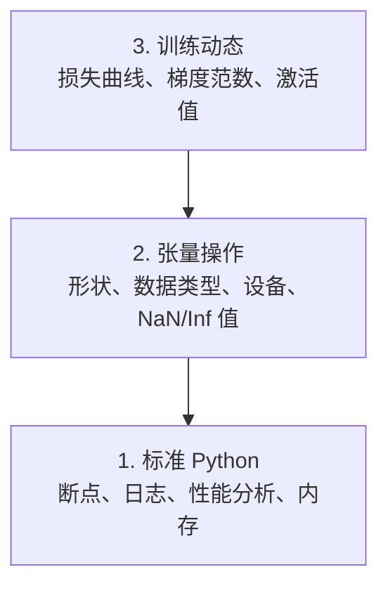

# 调试与性能分析

> 最糟糕的 AI Bug 不会崩溃。它们会在垃圾数据上默默训练，然后报告一条漂亮得可疑的损失曲线。

**类型：** Build
**语言：** Python
**前置知识：** 第1课（开发环境）、基本 PyTorch 熟悉度
**时间：** 约 60 分钟

## 学习目标

- 使用条件断点 `breakpoint()` 和 `debug_print` 检查训练过程中的张量形状、数据类型和 NaN 值
- 使用 `cProfile`、`line_profiler` 和 `tracemalloc` 分析训练循环，找出瓶颈
- 检测常见 AI Bug：形状不匹配、NaN 损失、数据泄漏、设备错误的张量
- 配置 TensorBoard 可视化损失曲线、权重直方图和梯度分布

## 问题所在

AI 代码的失败方式与常规代码不同。Web 应用会带着堆栈跟踪崩溃。而配置错误的训练循环会运行 8 小时，花费 200 美元 GPU 费用，最终产出一个预测每个输入均值的模型。代码从未报错。Bug 可能是一个放错设备的张量、一个遗忘的 `.detach()`、或标签泄漏到了特征中。

你需要能在这类无声失败浪费你的时间和算力之前捕获它们的调试工具。

## 概念

AI 调试分为三个层次：



大多数人会直接跳到第 3 层（盯着 TensorBoard 看）。但 80% 的 AI Bug 其实存在于第 1 和第 2 层。

```figure
s0-flame-hot
```

## 动手实现

### 第 1 部分：Print 调试（没错，真的有用）

Print 调试常被轻视。但不该如此。对于张量代码，一条精准的 print 语句胜过一步步跟调试器，因为你一眼就能看到形状、数据类型和数值范围。

```python
def debug_print(name, tensor):
    print(f"{name}: shape={tensor.shape}, dtype={tensor.dtype}, "
          f"device={tensor.device}, "
          f"min={tensor.min().item():.4f}, max={tensor.max().item():.4f}, "
          f"mean={tensor.mean().item():.4f}, "
          f"has_nan={tensor.isnan().any().item()}")
```

在每次可疑操作后调用它。找到 Bug 后，删掉这些 print。就这么简单。

### 第 2 部分：Python 调试器（pdb 和 breakpoint）

内置调试器在 AI 开发中被严重低估。把 `breakpoint()` 插入你的训练循环，然后交互式检查张量。

```python
def training_step(model, batch, criterion, optimizer):
    inputs, labels = batch
    outputs = model(inputs)
    loss = criterion(outputs, labels)

    if loss.item() > 100 or torch.isnan(loss):
        breakpoint()

    loss.backward()
    optimizer.step()
```

当调试器切入时，常用命令：

- `p outputs.shape` 检查形状
- `p loss.item()` 查看损失值
- `p torch.isnan(outputs).sum()` 统计 NaN 个数
- `p model.fc1.weight.grad` 检查梯度
- `c` 继续运行，`q` 退出

这是条件调试——只有看起来不对劲时才停下。对于一次 10,000 步的训练，这非常关键。

### 第 3 部分：Python 日志

当调试超出快速检查的范畴时，用日志替换 print 语句。

```python
import logging

logging.basicConfig(
    level=logging.INFO,
    format="%(asctime)s [%(levelname)s] %(message)s",
    handlers=[
        logging.FileHandler("training.log"),
        logging.StreamHandler()
    ]
)
logger = logging.getLogger(__name__)

logger.info("Starting training: lr=%.4f, batch_size=%d", lr, batch_size)
logger.warning("Loss spike detected: %.4f at step %d", loss.item(), step)
logger.error("NaN loss at step %d, stopping", step)
```

日志提供时间戳、严重级别和文件输出。当训练在凌晨 3 点失败时，你需要的是一个日志文件，而不是一行行早已滚出终端屏幕的输出。

### 第 4 部分：为代码段计时

了解时间花在哪里，是优化的第一步。

```python
import time

class Timer:
    def __init__(self, name=""):
        self.name = name

    def __enter__(self):
        self.start = time.perf_counter()
        return self

    def __exit__(self, *args):
        elapsed = time.perf_counter() - self.start
        print(f"[{self.name}] {elapsed:.4f}s")

with Timer("data loading"):
    batch = next(dataloader_iter)

with Timer("forward pass"):
    outputs = model(batch)

with Timer("backward pass"):
    loss.backward()
```

常见发现：数据加载占了 60% 的训练时间。解决方案是 DataLoader 里设置 `num_workers > 0`，而不是换更快的 GPU。

### 第 5 部分：cProfile 和 line_profiler

当手工计时不够用时：

```bash
python -m cProfile -s cumtime train.py
```

这显示所有函数调用，按累计时间排序。要逐行分析：

```bash
pip install line_profiler
```

```python
@profile
def train_step(model, data, target):
    output = model(data)
    loss = F.cross_entropy(output, target)
    loss.backward()
    return loss

# 运行：kernprof -l -v train.py
```

### 第 6 部分：内存分析

#### 使用 tracemalloc 分析 CPU 内存

```python
import tracemalloc

tracemalloc.start()

# your code here
model = build_model()
data = load_dataset()

snapshot = tracemalloc.take_snapshot()
top_stats = snapshot.statistics("lineno")
for stat in top_stats[:10]:
    print(stat)
```

#### 使用 memory_profiler 分析 CPU 内存

```bash
pip install memory_profiler
```

```python
from memory_profiler import profile

@profile
def load_data():
    raw = read_csv("data.csv")       # 观察内存在此处跳升
    processed = preprocess(raw)       # 以及这里
    return processed
```

运行 `python -m memory_profiler your_script.py` 查看逐行内存使用情况。

#### 使用 PyTorch 分析 GPU 内存

```python
import torch

if torch.cuda.is_available():
    print(torch.cuda.memory_summary())

    print(f"Allocated: {torch.cuda.memory_allocated() / 1e9:.2f} GB")
    print(f"Cached: {torch.cuda.memory_reserved() / 1e9:.2f} GB")
```

遇到 OOM（内存溢出）时：

1. 减小 batch size（第一优先级，始终尝试）
2. 使用 `torch.cuda.empty_cache()` 释放缓存内存
3. 对大型中间张量，使用 `del tensor` 后跟 `torch.cuda.empty_cache()`
4. 使用混合精度（`torch.cuda.amp`）将内存占用减半
5. 对极深模型使用梯度检查点（gradient checkpointing）

### 第 7 部分：常见 AI Bug 及检测方法

#### 形状不匹配

最常见的 Bug。张量形状是 `[batch, features]`，但模型期望 `[batch, channels, height, width]`。

```python
def check_shapes(model, sample_input):
    print(f"Input: {sample_input.shape}")
    hooks = []

    def make_hook(name):
        def hook(module, inp, out):
            in_shape = inp[0].shape if isinstance(inp, tuple) else inp.shape
            out_shape = out.shape if hasattr(out, "shape") else type(out)
            print(f"  {name}: {in_shape} -> {out_shape}")
        return hook

    for name, module in model.named_modules():
        hooks.append(module.register_forward_hook(make_hook(name)))

    with torch.no_grad():
        model(sample_input)

    for h in hooks:
        h.remove()
```

用一批样本运行一次。它会绘制你模型中每一步的形状变化。

#### NaN 损失

NaN 损失意味着某些东西炸了。常见原因：

- 学习率太高
- 自定义损失函数中的除以零
- 对零或负数取对数
- RNN 中的梯度爆炸

```python
def detect_nan(model, loss, step):
    if torch.isnan(loss):
        print(f"NaN loss at step {step}")
        for name, param in model.named_parameters():
            if param.grad is not None:
                if torch.isnan(param.grad).any():
                    print(f"  NaN gradient in {name}")
                if torch.isinf(param.grad).any():
                    print(f"  Inf gradient in {name}")
        return True
    return False
```

#### 数据泄漏

你的模型在测试集上达到 99% 准确率。听起来很棒。这是个 Bug。

```python
def check_data_leakage(train_set, test_set, id_column="id"):
    train_ids = set(train_set[id_column].tolist())
    test_ids = set(test_set[id_column].tolist())
    overlap = train_ids & test_ids
    if overlap:
        print(f"DATA LEAKAGE: {len(overlap)} samples in both train and test")
        return True
    return False
```

还要检查时序泄漏：用未来数据预测过去。在划分前先按时间戳排序。

#### 错误的设备

不同设备（CPU 与 GPU）上的张量会导致运行时错误。但有时某个张量静默地留在 CPU 上，而其他所有内容都在 GPU 上，训练只是运行得慢一些。

```python
def check_devices(model, *tensors):
    model_device = next(model.parameters()).device
    print(f"Model device: {model_device}")
    for i, t in enumerate(tensors):
        if t.device != model_device:
            print(f"  WARNING: tensor {i} on {t.device}, model on {model_device}")
```

### 第 8 部分：TensorBoard 基础

TensorBoard 让你看到训练中发生的事情随时间的变化。

```bash
pip install tensorboard
```

```python
from torch.utils.tensorboard import SummaryWriter

writer = SummaryWriter("runs/experiment_1")

for step in range(num_steps):
    loss = train_step(model, batch)

    writer.add_scalar("loss/train", loss.item(), step)
    writer.add_scalar("lr", optimizer.param_groups[0]["lr"], step)

    if step % 100 == 0:
        for name, param in model.named_parameters():
            writer.add_histogram(f"weights/{name}", param, step)
            if param.grad is not None:
                writer.add_histogram(f"grads/{name}", param.grad, step)

writer.close()
```

启动：

```bash
tensorboard --logdir=runs
```

注意观察：

- **损失不下降**：学习率太低，或模型架构有问题
- **损失剧烈震荡**：学习率太高
- **损失变成 NaN**：数值不稳定（见上方 NaN 部分）
- **训练损失下降，验证损失上升**：过拟合
- **权重直方图塌陷为零**：梯度消失
- **梯度直方图爆炸**：需要梯度裁剪

### 第 9 部分：VS Code 调试器

进行交互式调试时，通过 `launch.json` 配置 VS Code：

```json
{
    "version": "0.2.0",
    "configurations": [
        {
            "name": "Debug Training",
            "type": "debugpy",
            "request": "launch",
            "program": "${file}",
            "console": "integratedTerminal",
            "justMyCode": false
        }
    ]
}
```

点击行号旁的 gutter 设置断点。使用 Variables 面板检查张量属性。调试控制台允许你在执行过程中运行任意 Python 表达式。

适用于需要逐步查看数据预处理流水线中每一步转换的场景。

## 实践应用

以下工作流能捕获大多数 AI Bug：

1. **训练前**：用样本批次运行 `check_shapes`。验证输入和输出维度符合预期。
2. **前 10 步**：对损失、输出和梯度使用 `debug_print`。确认没有 NaN 且数值在合理范围内。
3. **训练中**：记录损失、学习率和梯度范数。使用 TensorBoard 可视化。
4. **出错时**：在失败点插入 `breakpoint()`。交互式检查张量。
5. **性能优化**：对数据加载、前向传播和反向传播分别计时。接近 OOM 时分析内存。

## 交付

运行调试工具脚本：

```bash
python phases/00-setup-and-tooling/12-debugging-and-profiling/code/debug_tools.py
```

参见 `outputs/prompt-debug-ai-code.md` 获取一个帮助诊断 AI 特有 Bug 的提示词。

## 练习

1. 运行 `debug_tools.py` 并通读各部分的输出。修改占位模型引入 NaN（提示：在前向传播中除以零），观察检测器如何捕获它。
2. 使用 `cProfile` 分析训练循环，找出最慢的函数。
3. 使用 `tracemalloc` 找出数据加载流水线中哪一行分配了最多内存。
4. 为一个简单训练任务配置 TensorBoard，判断模型是否过拟合。
5. 在训练循环中使用 `breakpoint()`。练习从调试器提示符检查张量形状、设备和梯度值。
