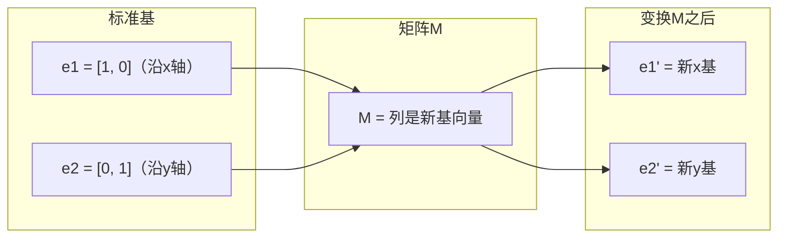
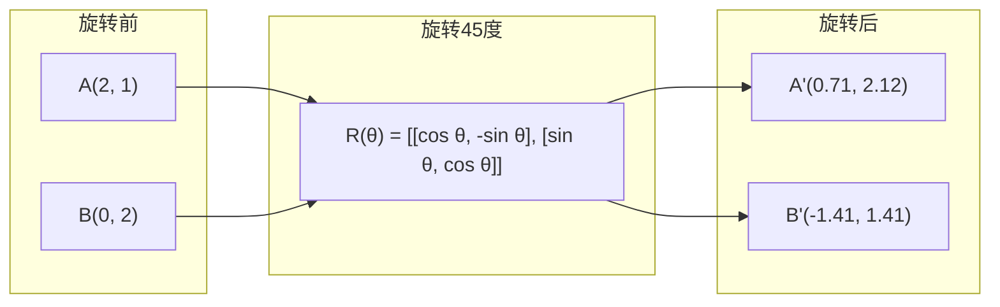
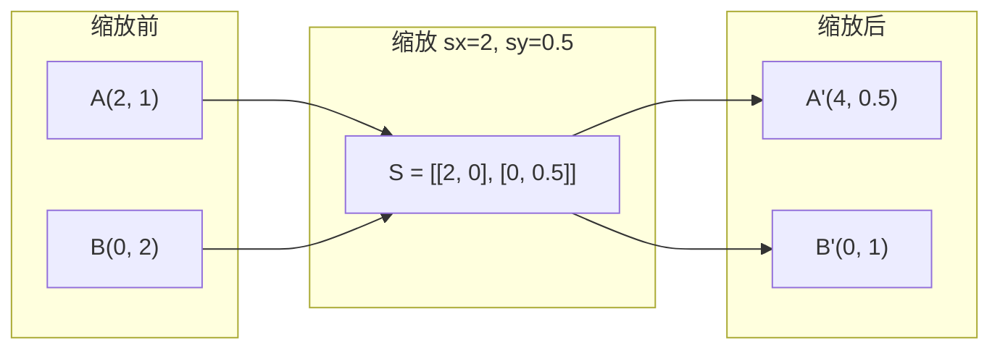
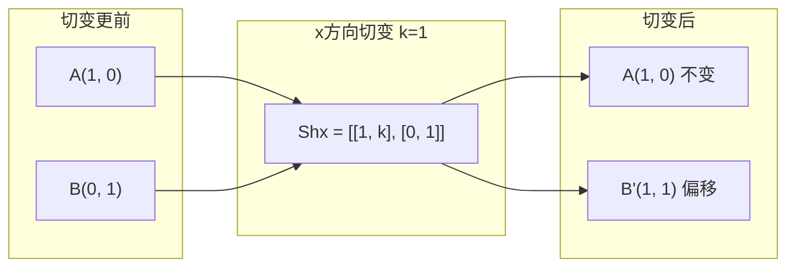
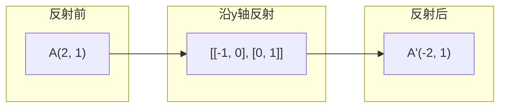
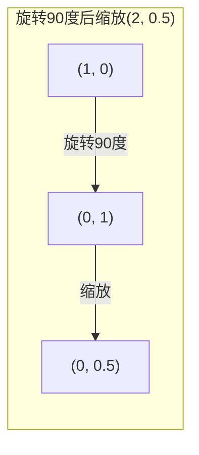
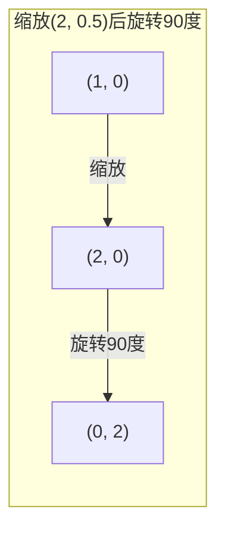

# 矩阵变换

> 矩阵是一台重塑空间的机器。了解它对每个点做了什么，你就理解了整个变换。

**类型：** 实践
**语言：** Python, Julia
**前置知识：** 第一阶段，课程01-02（线性代数直觉、向量与矩阵运算）
**时间：** 约75分钟

## 学习目标

- 构造旋转、缩放、切变和反射矩阵，并将它们应用到2D和3D点
- 通过矩阵乘法组合多个变换，并验证顺序的重要性
- 从特征方程计算2x2矩阵的特征值和特征向量
- 解释为什么特征值决定PCA方向、RNN稳定性和谱聚类行为

## 问题所在

你读到PCA时看到"求协方差矩阵的特征向量"。你读到模型稳定性时看到"检查所有特征值的模是否小于1"。你读到数据增强时看到"应用随机旋转"。在你理解矩阵在几何上对空间做了什么之前，这一切都不合逻辑。

矩阵不仅仅是数字网格。它们是空间机器。旋转矩阵旋转点，缩放矩阵拉伸它们，切变矩阵倾斜它们。神经网络对数据应用的每一个变换都是这些操作之一或它们的组合。本课让这些操作具体化。

## 概念

### 变换作为矩阵

2D中的每个线性变换都可以写成2x2矩阵。矩阵告诉你基向量 [1, 0] 和 [0, 1] 最终去哪里。其他一切随之而来。



### 旋转

2D旋转角度theta保持距离和角度不变。它沿圆弧移动每个点。



在3D中，你绕轴旋转。每个轴都有自己的旋转矩阵：

```
Rz(theta) = | cos  -sin  0 |     绕z轴旋转
            | sin   cos  0 |     （x-y平面旋转，z保持不变）
            |  0     0   1 |

Rx(theta) = | 1   0     0    |   绕x轴旋转
            | 0  cos  -sin   |   （y-z平面旋转，x保持不变）
            | 0  sin   cos   |

Ry(theta) = |  cos  0  sin |     绕y轴旋转
            |   0   1   0  |     （x-z平面旋转，y保持不变）
            | -sin  0  cos |
```

### 缩放

缩放沿每个轴独立拉伸或压缩。



### 切变

切变倾斜一个轴而保持另一个轴固定。它将矩形变为平行四边形。



切变矩阵：
- `Shx = [[1, k], [0, 1]]` 沿x轴偏移 k * y
- `Shy = [[1, 0], [k, 1]]` 沿y轴偏移 k * x

### 反射

反射沿轴或线镜像点。



反射矩阵：
- 沿y轴反射：`[[-1, 0], [0, 1]]`
- 沿x轴反射：`[[1, 0], [0, -1]]`

### 组合：链式变换

应用变换A然后B等同于相乘它们的矩阵：`result = B @ A @ point`。顺序很重要。先旋转再缩放与先缩放再旋转产生不同的结果。



组合：`S @ R = [[0, -2], [0.5, 0]]`



组合：`R @ S = [[0, -0.5], [2, 0]]`

不同的结果。矩阵乘法不满足交换律。

### 特征值和特征向量

大多数向量在矩阵作用于它们时改变方向。特征向量是特殊的：矩阵只缩放它们，从不旋转它们。缩放因子就是特征值。

```
A @ v = lambda * v

v 是特征向量（存活的方向）
lambda 是特征值（拉伸多少）

示例：A = | 2  1 |
         | 1  2 |

特征向量 [1, 1] 对应特征值3：
  A @ [1,1] = [3, 3] = 3 * [1, 1]     （同方向，缩放3倍）

特征向量 [1, -1] 对应特征值1：
  A @ [1,-1] = [1, -1] = 1 * [1, -1]  （同方向，不变）
```

矩阵沿[1, 1]拉伸空间3倍，保持[1, -1]不变。其他所有方向都是这两个的混合。

### 特征分解

如果矩阵有n个线性无关的特征向量，它可以分解：

```
A = V @ D @ V^(-1)

V = 以特征向量为列的矩阵
D = 特征值的对角矩阵
V^(-1) = V的逆

这说明：旋转到特征向量坐标系，沿每个轴缩放，再旋转回去。
```

### 为什么特征值重要

**PCA。** 协方差矩阵的特征向量是主成分。特征值告诉你每个分量捕获了多少方差。按特征值排序，保留前k个，你就有了降维。

**稳定性。** 在循环网络和动力系统中，模大于1的特征值导致输出爆炸。模小于1的特征值导致它们消失。这就是一句话说出的梯度消失/爆炸问题。

**谱方法。** 图神经网络使用邻接矩阵的特征值。谱聚类使用拉普拉斯矩阵的特征值。特征向量揭示图的结构。

### 行列式作为体积缩放因子

变换矩阵的行列式告诉你它缩放面积（2D）或体积（3D）的程度。

```
det = 1:   面积保持不变（旋转）
det = 2:   面积翻倍
det = 0:   空间塌陷到更低维度（奇异）
det = -1:  面积保持不变但方向翻转（反射）

| det(旋转) | = 1        （总是）
| det(缩放 sx, sy) | = sx * sy
| det(切变) | = 1           （面积保持不变）
| det(反射) | = -1     （方向翻转）
```

```figure
matrix-transform
```

## 动手实现

### 步骤1：从零开始构建变换矩阵（Python）

```python
import math

def rotation_2d(theta):
    c, s = math.cos(theta), math.sin(theta)
    return [[c, -s], [s, c]]

def scaling_2d(sx, sy):
    return [[sx, 0], [0, sy]]

def shearing_2d(kx, ky):
    return [[1, kx], [ky, 1]]

def reflection_x():
    return [[1, 0], [0, -1]]

def reflection_y():
    return [[-1, 0], [0, 1]]

def mat_vec_mul(matrix, vector):
    return [
        sum(matrix[i][j] * vector[j] for j in range(len(vector)))
        for i in range(len(matrix))
    ]

def mat_mul(a, b):
    rows_a, cols_b = len(a), len(b[0])
    cols_a = len(a[0])
    return [
        [sum(a[i][k] * b[k][j] for k in range(cols_a)) for j in range(cols_b)]
        for i in range(rows_a)
    ]

point = [1.0, 0.0]
angle = math.pi / 4

rotated = mat_vec_mul(rotation_2d(angle), point)
print(f"Rotate (1,0) by 45 deg: ({rotated[0]:.4f}, {rotated[1]:.4f})")

scaled = mat_vec_mul(scaling_2d(2, 3), [1.0, 1.0])
print(f"Scale (1,1) by (2,3): ({scaled[0]:.1f}, {scaled[1]:.1f})")

sheared = mat_vec_mul(shearing_2d(1, 0), [1.0, 1.0])
print(f"Shear (1,1) kx=1: ({sheared[0]:.1f}, {sheared[1]:.1f})")

reflected = mat_vec_mul(reflection_y(), [2.0, 1.0])
print(f"Reflect (2,1) across y: ({reflected[0]:.1f}, {reflected[1]:.1f})")
```

### 步骤2：变换的组合

```python
R = rotation_2d(math.pi / 2)
S = scaling_2d(2, 0.5)

rotate_then_scale = mat_mul(S, R)
scale_then_rotate = mat_mul(R, S)

point = [1.0, 0.0]
result1 = mat_vec_mul(rotate_then_scale, point)
result2 = mat_vec_mul(scale_then_rotate, point)

print(f"Rotate 90 then scale: ({result1[0]:.2f}, {result1[1]:.2f})")
print(f"Scale then rotate 90: ({result2[0]:.2f}, {result2[1]:.2f})")
print(f"Same? {result1 == result2}")
```

### 步骤3：从零开始计算特征值（2x2）

对于2x2矩阵`[[a, b], [c, d]]`，特征值求解特征方程：`lambda^2 - (a+d)*lambda + (ad - bc) = 0`。

```python
def eigenvalues_2x2(matrix):
    a, b = matrix[0]
    c, d = matrix[1]
    trace = a + d
    det = a * d - b * c
    discriminant = trace ** 2 - 4 * det
    if discriminant < 0:
        real = trace / 2
        imag = (-discriminant) ** 0.5 / 2
        return (complex(real, imag), complex(real, -imag))
    sqrt_disc = discriminant ** 0.5
    return ((trace + sqrt_disc) / 2, (trace - sqrt_disc) / 2)

def eigenvector_2x2(matrix, eigenvalue):
    a, b = matrix[0]
    c, d = matrix[1]
    if abs(b) > 1e-10:
        v = [b, eigenvalue - a]
    elif abs(c) > 1e-10:
        v = [eigenvalue - d, c]
    else:
        if abs(a - eigenvalue) < 1e-10:
            v = [1, 0]
        else:
            v = [0, 1]
    mag = (v[0] ** 2 + v[1] ** 2) ** 0.5
    return [v[0] / mag, v[1] / mag]

A = [[2, 1], [1, 2]]
vals = eigenvalues_2x2(A)
print(f"Matrix: {A}")
print(f"Eigenvalues: {vals[0]:.4f}, {vals[1]:.4f}")

for val in vals:
    vec = eigenvector_2x2(A, val)
    result = mat_vec_mul(A, vec)
    scaled = [val * vec[0], val * vec[1]]
    print(f"  lambda={val:.1f}, v={[round(x,4) for x in vec]}")
    print(f"    A@v = {[round(x,4) for x in result]}")
    print(f"    l*v = {[round(x,4) for x in scaled]}")
```

### 步骤4：行列式作为体积缩放因子

```python
def det_2x2(matrix):
    return matrix[0][0] * matrix[1][1] - matrix[0][1] * matrix[1][0]

print(f"det(rotation 45) = {det_2x2(rotation_2d(math.pi/4)):.4f}")
print(f"det(scale 2,3)   = {det_2x2(scaling_2d(2, 3)):.1f}")
print(f"det(shear kx=1)  = {det_2x2(shearing_2d(1, 0)):.1f}")
print(f"det(reflect y)   = {det_2x2(reflection_y()):.1f}")

singular = [[1, 2], [2, 4]]
print(f"det(singular)     = {det_2x2(singular):.1f}")
print("Singular: columns are proportional, space collapses to a line.")
```

## 实际应用

NumPy 用优化的例程处理所有这些。

```python
import numpy as np

theta = np.pi / 4
R = np.array([[np.cos(theta), -np.sin(theta)],
              [np.sin(theta),  np.cos(theta)]])

point = np.array([1.0, 0.0])
print(f"Rotate (1,0) by 45 deg: {R @ point}")

S = np.diag([2.0, 3.0])
composed = S @ R
print(f"Scale(2,3) after Rotate(45): {composed @ point}")

A = np.array([[2, 1], [1, 2]], dtype=float)
eigenvalues, eigenvectors = np.linalg.eig(A)
print(f"\nEigenvalues: {eigenvalues}")
print(f"Eigenvectors (columns):\n{eigenvectors}")

for i in range(len(eigenvalues)):
    v = eigenvectors[:, i]
    lam = eigenvalues[i]
    print(f"  A @ v{i} = {A @ v}, lambda * v{i} = {lam * v}")

print(f"\ndet(R) = {np.linalg.det(R):.4f}")
print(f"det(S) = {np.linalg.det(S):.1f}")

B = np.array([[3, 1], [0, 2]], dtype=float)
vals, vecs = np.linalg.eig(B)
D = np.diag(vals)
V = vecs
reconstructed = V @ D @ np.linalg.inv(V)
print(f"\nEigendecomposition A = V @ D @ V^-1:")
print(f"Original:\n{B}")
print(f"Reconstructed:\n{reconstructed}")
```

### 使用NumPy进行3D旋转

```python
def rotation_3d_z(theta):
    c, s = np.cos(theta), np.sin(theta)
    return np.array([[c, -s, 0], [s, c, 0], [0, 0, 1]])

def rotation_3d_x(theta):
    c, s = np.cos(theta), np.sin(theta)
    return np.array([[1, 0, 0], [0, c, -s], [0, s, c]])

point_3d = np.array([1.0, 0.0, 0.0])
rotated_z = rotation_3d_z(np.pi / 2) @ point_3d
rotated_x = rotation_3d_x(np.pi / 2) @ point_3d

print(f"\n3D point: {point_3d}")
print(f"Rotate 90 around z: {np.round(rotated_z, 4)}")
print(f"Rotate 90 around x: {np.round(rotated_x, 4)}")
```

## 交付使用

本课为PCA（第二阶段）和神经网络权重分析构建了几何基础。这里构建的特征值/特征向量代码正是生产ML系统中驱动降维、谱聚类和稳定性分析的相同算法。

## 练习

1. 对单位正方形（角点在[0,0]、[1,0]、[1,1]、[0,1]）应用旋转、缩放和切变。打印每种变换后的角点坐标。验证旋转保持角点之间的距离不变。

2. 用手算特征方程求矩阵[[4, 2], [1, 3]]的特征值。然后用你的从零开始的函数和NumPy验证。

3. 创建三个变换的组合（旋转30度、缩放[1.5, 0.8]、切变kx=0.3）并应用到圆周上排列的8个点。打印变换前后的坐标。计算组合矩阵的行列式并验证它等于各单独行列式的乘积。

## 关键术语

| 术语 | 人们怎么说 | 实际含义 |
|------|------------|----------|
| Rotation matrix | "旋转物体" | 一个正交矩阵，沿圆弧移动点同时保持距离和角度不变。行列式总是1。 |
| Scaling matrix | "放大物体" | 一个对角矩阵，沿每个轴独立拉伸或压缩。行列式是缩放因子的乘积。 |
| Shearing matrix | "倾斜物体" | 一个矩阵，使一个坐标按另一个坐标的固定比例偏移，将矩形变为平行四边形。行列式为1。 |
| Reflection | "镜像物体" | 一个矩阵，沿轴或平面翻转空间。行列式为-1。 |
| Composition | "做两件事" | 相乘变换矩阵以链式操作。顺序重要：B @ A表示先应用A，然后B。 |
| Eigenvector | "特殊方向" | 矩阵只缩放而不旋转的方向。变换的指纹。 |
| Eigenvalue | "拉伸多少" | 矩阵缩放其特征向量的标量因子。可以为负（翻转）或复数（旋转）。 |
| Eigendecomposition | "分解矩阵" | 将矩阵写为V @ D @ V^(-1)，将其分离为基本缩放方向和幅度。 |
| Determinant | "来自矩阵的一个数" | 变换缩放面积（2D）或体积（3D）的因子。零意味着变换不可逆。 |
| Characteristic equation | "特征值的来源" | det(A - lambda * I) = 0。其根为特征值的多项式。 |

## 延伸阅读

- [3Blue1Brown: Linear Transformations](https://www.3blue1brown.com/lessons/linear-transformations) -- 矩阵如何重塑空间的视觉直觉
- [3Blue1Brown: Eigenvectors and Eigenvalues](https://www.3blue1brown.com/lessons/eigenvalues) -- 特征向量几何意义的最佳视觉解释
- [MIT 18.06 Lecture 21: Eigenvalues and Eigenvectors](https://ocw.mit.edu/courses/18-06-linear-algebra-spring-2010/) -- Gilbert Strang的经典论述
