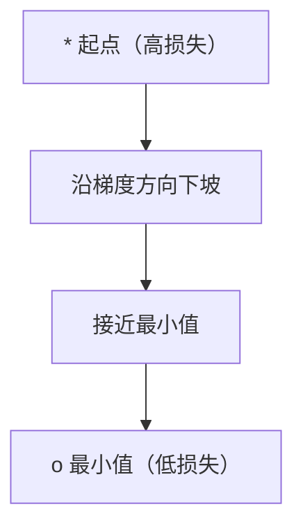
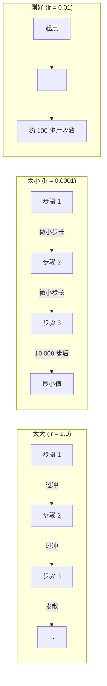
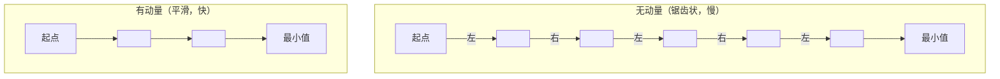
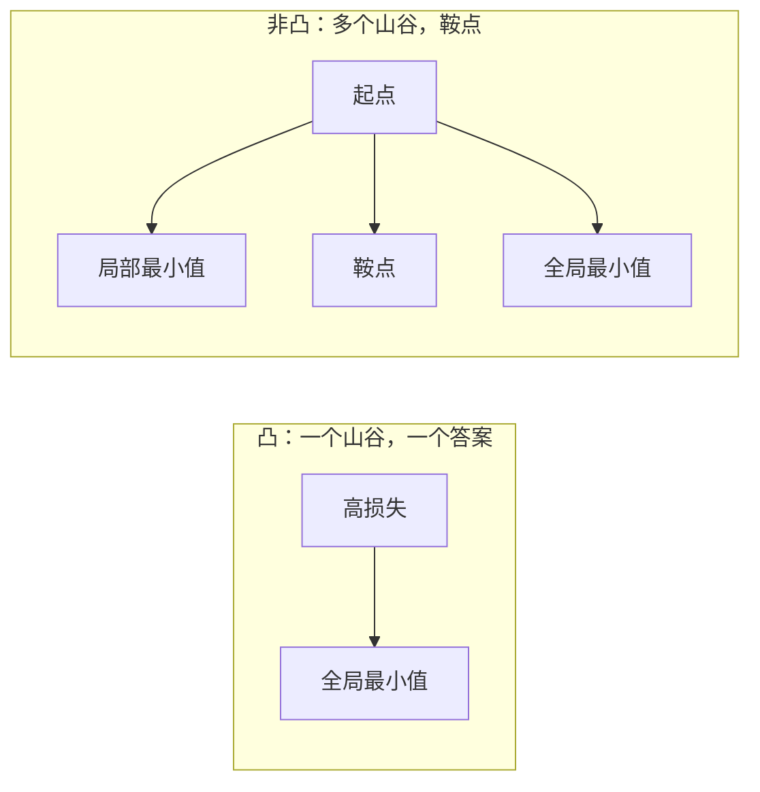
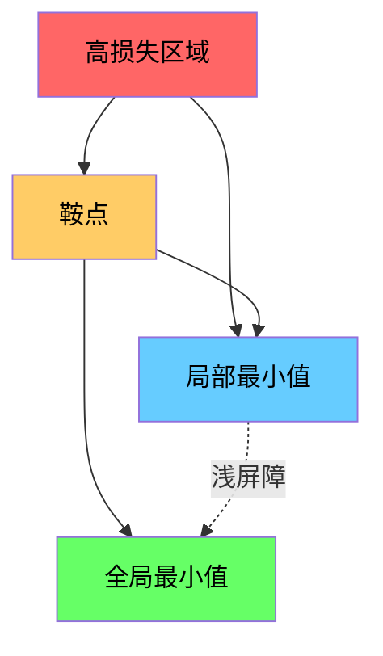

# 优化

> 训练神经网络，无非就是找到山谷的最低点。

**类型：** Build
**语言：** Python
**前置知识：** Phase 1，第 04-05 课（导数、梯度）
**时间：** 约 75 分钟

## 学习目标

- 从零实现基本的梯度下降、带动量的 SGD 和 Adam 优化器
- 在 Rosenbrock 函数上对比不同优化器的收敛效果，并解释 Adam 如何实现自适应每权重学习率
- 区分凸与非凸损失地形，并解释高维空间中鞍点的作用
- 配置学习率调度策略（步进衰减、余弦退火、预热），提升训练稳定性

## 问题所在

你有一个损失函数，它告诉你模型的预测有多错误。你也有梯度，它们指向使损失增大的方向。现在你需要一个策略来沿下坡方向行进。

最直接的方法是：沿着梯度的反方向移动，步长乘以一个称为学习率的数值。重复此过程。这就是梯度下降，它可以工作。但"可以工作"是有前提条件的。学习率太大，你会直接冲过整个山谷，在两壁之间来回弹跳。学习率太小，你要花几千步才能缓慢爬行到答案附近。遇到鞍点时，你可能停止移动，尽管你还没有找到最小值。

深度学习中的每个优化器都是对同一个问题的回答：你如何更快、更可靠地到达山谷底部？

## 概念解析

### 优化的含义

优化是寻找使函数最小化（或最大化）的输入值。在机器学习中，函数是损失。输入是模型的权重。训练就是优化。

```
minimize L(w) 其中：
  L = 损失函数
  w = 模型权重（可能有数百万个参数）
```

### 梯度下降（基础版）

最简单的优化器。计算损失关于每个权重的梯度。将每个权重沿其梯度的反方向移动。步长乘以学习率。

```
w = w - lr * gradient
```

整个算法就这一行。



### 学习率：最重要的超参数

学习率控制步长大小。它决定了收敛的所有方面。



没有公式可以确定正确的学习率。你需要通过实验来寻找。常见的起点值：Adam 用 0.001，带动量的 SGD 用 0.01。

### SGD、批量与迷你批量

基础梯度下降在每次更新前在整个数据集上计算梯度。这称为批量梯度下降。它稳定但慢。

随机梯度下降（SGD）在一个随机样本上计算梯度后立即更新。它有噪声但快。

迷你批量梯度下降折中两者的特点。在小型批次（32、64、128、256 个样本）上计算梯度，然后更新。这才是大家实际使用的方法。

| 变体 | 批量大小 | 梯度质量 | 每步速度 | 噪声 |
|------|---------|---------|---------|------|
| 批量 GD | 整个数据集 | 精确 | 慢 | 无 |
| SGD | 1 个样本 | 噪声很大 | 快 | 高 |
| 迷你批量 | 32-256 | 较好的估计 | 平衡 | 中等 |

SGD 和迷你批量中的噪声不是 bug。它有助于逃离浅层局部最小值和鞍点。

### 动量：下坡滚动的球

基础梯度下降只看向当前梯度。如果梯度方向来回震荡（在狭窄山谷中很常见），进度会很慢。动量通过将过去的梯度累积到速度项中来解决这个问题。

```
v = beta * v + gradient
w = w - lr * v
```

类比：下坡滚动的球。它不会在每个颠簸处停下来重新启动。它在一致的方向上积累速度，并减弱振荡。



`beta`（通常为 0.9）控制保留多少历史信息。更高的 beta 意味着更多动量、更平滑的路径，但对方向变化的响应更慢。

### Adam：自适应学习率

不同的权重需要不同的学习率。很少获得大梯度的权重，在终于获得大梯度时应走大步。经常获得巨大梯度的权重应走小步。

Adam（自适应矩估计）为每个权重跟踪两件事：

1. 一阶矩（m）：梯度的指数移动平均（类似于动量）
2. 二阶矩（v）：梯度平方的指数移动平均（梯度幅度）

```
m = beta1 * m + (1 - beta1) * gradient
v = beta2 * v + (1 - beta2) * gradient^2

m_hat = m / (1 - beta1^t)    偏差修正
v_hat = v / (1 - beta2^t)    偏差修正

w = w - lr * m_hat / (sqrt(v_hat) + epsilon)
```

除以 `sqrt(v_hat)` 是关键洞察。梯度大的权重被一个大数除（有效步长小）。梯度小的权重被一个小数除（有效步长大）。每个权重都获得自己的自适应学习率。

默认超参数：`lr=0.001, beta1=0.9, beta2=0.999, epsilon=1e-8`。这些默认值对大多数问题都有效。

### 学习率调度

固定学习率是一种妥协。训练初期，你需要大步快速前进。训练后期，你需要小步在最小值附近精细调整。

常见调度策略：

| 调度 | 公式 | 适用场景 |
|------|------|---------|
| 步进衰减 | lr = lr * factor 每 N 个 epoch | 简单，手动控制 |
| 指数衰减 | lr = lr_0 * decay^t | 平滑衰减 |
| 余弦退火 | lr = lr_min + 0.5 * (lr_max - lr_min) * (1 + cos(pi * t / T)) | Transformer、现代训练 |
| 预热 + 衰减 | 线性上升，然后衰减 | 大模型，防止早期不稳定 |

### 凸与非凸

凸函数只有一个最小值。梯度下降总能找到它。像 `f(x) = x^2` 这样的二次函数是凸的。

神经网络的损失函数是非凸的。它们有许多局部最小值、鞍点和平坦区域。



在实践中，高维神经网络中的局部最小值很少是个问题。大多数局部最小值的损失值接近全局最小值。鞍点（某些方向平坦，其他方向弯曲）才是真正的障碍。动量和迷你批量的噪声有助于逃离它们。

### 损失地形可视化

损失是所有权重的函数。对于拥有 100 万个权重的模型，损失地形存在于 1000001 维空间中。我们通过权重空间中选择两个随机方向，并沿这些方向绘制损失，生成 2D 表面来进行可视化。



尖锐的最小值泛化能力差。平坦的最小值泛化能力强。这是带动量的 SGD 在最终测试准确率上经常优于 Adam 的原因之一：其噪声阻止陷入尖锐最小值。

```figure
gradient-descent
```

## 动手实现

### 步骤 1：定义测试函数

Rosenbrock 函数是经典的优化基准测试。它的最小值位于 (1, 1)，在一个狭窄的弯曲山谷中，容易被发现但难以追踪。

```
f(x, y) = (1 - x)^2 + 100 * (y - x^2)^2
```

```python
def rosenbrock(params):
    x, y = params
    return (1 - x) ** 2 + 100 * (y - x ** 2) ** 2

def rosenbrock_gradient(params):
    x, y = params
    df_dx = -2 * (1 - x) + 200 * (y - x ** 2) * (-2 * x)
    df_dy = 200 * (y - x ** 2)
    return [df_dx, df_dy]
```

### 步骤 2：基础梯度下降

```python
class GradientDescent:
    def __init__(self, lr=0.001):
        self.lr = lr

    def step(self, params, grads):
        return [p - self.lr * g for p, g in zip(params, grads)]
```

### 步骤 3：带动量的 SGD

```python
class SGDMomentum:
    def __init__(self, lr=0.001, momentum=0.9):
        self.lr = lr
        self.momentum = momentum
        self.velocity = None

    def step(self, params, grads):
        if self.velocity is None:
            self.velocity = [0.0] * len(params)
        self.velocity = [
            self.momentum * v + g
            for v, g in zip(self.velocity, grads)
        ]
        return [p - self.lr * v for p, v in zip(params, self.velocity)]
```

### 步骤 4：Adam

```python
class Adam:
    def __init__(self, lr=0.001, beta1=0.9, beta2=0.999, epsilon=1e-8):
        self.lr = lr
        self.beta1 = beta1
        self.beta2 = beta2
        self.epsilon = epsilon
        self.m = None
        self.v = None
        self.t = 0

    def step(self, params, grads):
        if self.m is None:
            self.m = [0.0] * len(params)
            self.v = [0.0] * len(params)

        self.t += 1

        self.m = [
            self.beta1 * m + (1 - self.beta1) * g
            for m, g in zip(self.m, grads)
        ]
        self.v = [
            self.beta2 * v + (1 - self.beta2) * g ** 2
            for v, g in zip(self.v, grads)
        ]

        m_hat = [m / (1 - self.beta1 ** self.t) for m in self.m]
        v_hat = [v / (1 - self.beta2 ** self.t) for v in self.v]

        return [
            p - self.lr * mh / (vh ** 0.5 + self.epsilon)
            for p, mh, vh in zip(params, m_hat, v_hat)
        ]
```

### 步骤 5：运行并对比

```python
def optimize(optimizer, func, grad_func, start, steps=5000):
    params = list(start)
    history = [params[:]]
    for _ in range(steps):
        grads = grad_func(params)
        params = optimizer.step(params, grads)
        history.append(params[:])
    return history

start = [-1.0, 1.0]

gd_history = optimize(GradientDescent(lr=0.0005), rosenbrock, rosenbrock_gradient, start)
sgd_history = optimize(SGDMomentum(lr=0.0001, momentum=0.9), rosenbrock, rosenbrock_gradient, start)
adam_history = optimize(Adam(lr=0.01), rosenbrock, rosenbrock_gradient, start)

for name, history in [("GD", gd_history), ("SGD+M", sgd_history), ("Adam", adam_history)]:
    final = history[-1]
    loss = rosenbrock(final)
    print(f"{name:6s} -> x={final[0]:.6f}, y={final[1]:.6f}, loss={loss:.8f}")
```

预期输出：Adam 收敛最快。带动量的 SGD 走更平滑的路径。基础 GD 沿狭窄山谷缓慢前进。

## 实际应用

在实践中，使用 PyTorch 或 JAX 的优化器。它们处理参数组、权重衰减、梯度裁剪和 GPU 加速。

```python
import torch

model = torch.nn.Linear(784, 10)

sgd = torch.optim.SGD(model.parameters(), lr=0.01, momentum=0.9)
adam = torch.optim.Adam(model.parameters(), lr=0.001)
adamw = torch.optim.AdamW(model.parameters(), lr=0.001, weight_decay=0.01)

scheduler = torch.optim.lr_scheduler.CosineAnnealingLR(adam, T_max=100)
```

经验法则：

- 从 Adam 开始（lr=0.001）。它对大多数问题无需调参即可工作。
- 当需要最佳最终准确率且能承担更多调参时，切换到带动量的 SGD（lr=0.01，momentum=0.9）。
- 对 Transformer 使用 AdamW（带解耦权重衰减的 Adam）。
- 对超过几个 epoch 的训练始终使用学习率调度。
- 如果训练不稳定，降低学习率。如果训练太慢，提高学习率。

## 交付物

本课生成一个用于选择合适优化器的提示词，见 `outputs/prompt-optimizer-guide.md`。

这里构建的优化器类将在 Phase 3 中从零训练神经网络时再次出现。

## 练习

1. **学习率扫描。** 在 Rosenbrock 函数上使用学习率 [0.0001, 0.0005, 0.001, 0.005, 0.01] 运行基础梯度下降。对每个学习率打印 5000 步后的最终损失，或绘制图表。找出仍能收敛的最大学习率。

2. **动量对比。** 在 Rosenbrock 函数上使用动量值 [0.0, 0.5, 0.9, 0.99] 运行带动量的 SGD。跟踪每一步的损失。哪个动量值收敛最快？哪个过冲？

3. **逃离鞍点。** 定义函数 `f(x, y) = x^2 - y^2`（在原点处有一个鞍点）。从 (0.01, 0.01) 开始。比较基础 GD、带动量的 SGD 和 Adam 的行为。哪个能逃离鞍点？

4. **实现学习率衰减。** 给 GradientDescent 类添加指数衰减调度：`lr = lr_0 * 0.999^step`。在 Rosenbrock 函数上对比有无衰减的收敛效果。

## 关键术语

| 术语 | 人们怎么说 | 实际含义 |
|------|-----------|---------|
| 梯度下降 | "沿下坡走" | 通过减去学习率缩放的梯度来更新权重。最基础的优化器。 |
| 学习率 | "步长" | 一个标量，控制每次更新移动多远的权重。太大导致发散。太小浪费计算。 |
| 动量 | "继续滚动" | 将过去梯度累积到速度向量中。减弱振荡并加速沿一致方向的移动。 |
| SGD | "随机采样" | 随机梯度下降。在随机子集而非整个数据集上计算梯度。实践中几乎总是指迷你批量 SGD。 |
| 迷你批量 | "一批数据" | 用于估计梯度的训练数据小子集（32-256 个样本）。平衡速度与梯度准确性。 |
| Adam | "默认优化器" | 自适应矩估计。跟踪每个权重的梯度和梯度平方的移动平均，给每个权重独立的学习率。 |
| 偏差修正 | "修复冷启动" | Adam 的一阶和二阶矩初始化为零。偏差修正通过除以 (1 - beta^t) 补偿早期步骤。 |
| 学习率调度 | "随时间变化 lr" | 在训练过程中调整学习率的函数。前期大步，后期小步。 |
| 凸函数 | "一个山谷" | 任何局部最小值都是全局最小值的函数。梯度下降总能找到它。神经网络损失不是凸的。 |
| 鞍点 | "平坦但非最小" | 梯度为零，但在某些方向是最小值、其他方向是最大值的点。在高维空间中很常见。 |
| 损失地形 | "地形" | 在权重空间上绘制的损失函数。通过沿两个随机方向切片进行可视化。 |
| 收敛 | "到达目的地" | 优化器已达到进一步步骤不再显著降低损失的点。 |

## 延伸阅读

- [Sebastian Ruder: 梯度下降优化算法概览](https://ruder.io/optimizing-gradient-descent/) - 所有主要优化器的综合综述
- [为什么动量真的有效（Distill）](https://distill.pub/2017/momentum/) - 动量动力学的交互式可视化
- [Adam: 随机优化方法（Kingma & Ba，2014）](https://arxiv.org/abs/1412.6980) - 原始 Adam 论文，易读且简短
- [神经网络损失地形可视化（Li 等，2018）](https://arxiv.org/abs/1712.09913) - 展示尖锐 vs 平坦最小值的论文
