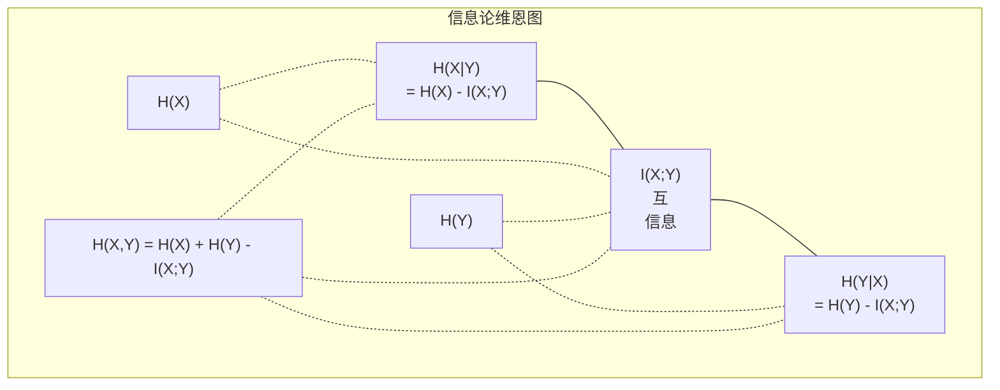

# 信息论

> 信息论衡量的是"惊喜"程度。损失函数建立在其基础上。

**类型:** 学习
**语言:** Python
**前置知识:** Phase 1, Lesson 06（概率）
**时间:** ~60 分钟

## 学习目标

- 从零推导熵、交叉熵和 KL 散度，并解释它们之间的关系
- 推导为什么最小化交叉熵损失等价于最大化对数似然
- 计算特征与目标之间的互信息，用于排序特征重要性
- 解释困惑度（perplexity）是语言模型从中选择的等效词汇表大小

## 问题

你在训练每个分类模型时都会调用 `CrossEntropyLoss()`。你在每篇语言模型论文中都会看到"困惑度"。你在变分自编码器（VAE）、蒸馏和 RLHF 中读到过 KL 散度。这些不是孤立的概念，它们是同一个思想穿着不同的外衣。

信息论给了你描述不确定性、压缩和预测的语言。Claude Shannon 在 1948 年发明它来解决通信问题。结果发现，训练神经网络就是一个通信问题：模型试图通过由学习到的权重组成的噪声信道来传输正确的标签。

本课程从零推导所有公式，让你看清它们的来源和工作原理。

## 概念

### 信息量（惊喜）

当不太可能发生的事件发生时，它携带更多信息。抛硬币正面朝上？并不意外。中彩票？非常意外。

概率为 p 的事件的信息量为：

```
I(x) = -log(p(x))
```

使用以 2 为底的对数得到比特（bits）。使用自然对数得到奈特（nats）。想法相同，单位不同。

```
事件                  概率          惊喜程度（比特）
公平硬币正面朝上       0.5           1.0
掷出 6              0.167         2.58
千分之一事件         0.001         9.97
必然事件            1.0           0.0
```

必然事件不携带任何信息。你已经知道它们会发生。

### 熵（平均惊喜）

熵是一个分布中所有可能结果的期望惊喜程度。

```
H(P) = -sum( p(x) * log(p(x)) )  对所有 x 求和
```

公平硬币作为二元变量具有最大熵：1 比特。偏置硬币（99% 正面朝上）的熵很低：0.08 比特。你已经知道会发生什么，所以每次投掷告诉你的信息几乎为零。

```
公平硬币:    H = -(0.5 * log2(0.5) + 0.5 * log2(0.5)) = 1.0 比特
偏置硬币:    H = -(0.99 * log2(0.99) + 0.01 * log2(0.01)) = 0.08 比特
```

熵衡量了分布中不可约简的不确定性。你无法将其压缩到低于这个值。

### 交叉熵（你每天都在使用的损失函数）

交叉熵衡量当使用分布 Q 来编码实际上来自分布 P 的事件时的平均惊喜程度。

```
H(P, Q) = -sum( p(x) * log(q(x)) )  对所有 x 求和
```

P 是真实分布（标签）。Q 是模型的预测。如果 Q 完全匹配 P，则交叉熵等于熵。任何不匹配都会使其增大。

在分类中，P 是一个独热向量（真实类别的概率为 1，其他为 0）。这使得交叉熵简化为：

```
H(P, Q) = -log(q(真实类别))
```

这就是分类的整个交叉熵损失公式。最大化正确类别的预测概率。

### KL 散度（分布之间的距离）

KL 散度衡量使用 Q 代替 P 时获得的额外惊喜程度。

```
D_KL(P || Q) = sum( p(x) * log(p(x) / q(x)) )  对所有 x 求和
             = H(P, Q) - H(P)
```

交叉熵等于熵加上 KL 散度。由于真实分布的熵在训练过程中是常数，最小化交叉熵等价于最小化 KL 散度。你在将模型的分布推向真实分布。

KL 散度不是对称的：D_KL(P || Q) != D_KL(Q || P)。它不是真正的距离度量。

### 互信息

互信息衡量了解一个变量能告诉你多少关于另一个变量的信息。

```
I(X; Y) = H(X) - H(X|Y)
        = H(X) + H(Y) - H(X, Y)
```

如果 X 和 Y 相互独立，则互信息为零。了解其中一个对另一个一无所知。如果它们完全相关，则互信息等于任一变量的熵。

在特征选择中，特征与目标之间的高互信息意味着该特征是有效的。低互信息意味着它是噪声。

### 条件熵

H(Y|X) 衡量在观察到 X 后关于 Y 的剩余不确定性。

```
H(Y|X) = H(X,Y) - H(X)
```

两种极端情况：
- 如果 X 完全决定 Y，则 H(Y|X) = 0。了解 X 消除了关于 Y 的所有不确定性。例如：X = 摄氏温度，Y = 华氏温度。
- 如果 X 对 Y 毫无帮助，则 H(Y|X) = H(Y)。了解 X 完全不减少你的不确定性。例如：X = 抛硬币，Y = 明天的天气。

条件熵总是非负的，且不超过 H(Y)：

```
0 <= H(Y|X) <= H(Y)
```

在机器学习中，条件熵出现在决策树中。在每个分裂点，算法选择使 H(Y|X) 最小的特征 X——即消除标签 Y 不确定性最多的特征。

### 联合熵

H(X,Y) 是 X 和 Y 联合分布的熵。

```
H(X,Y) = -sum sum p(x,y) * log(p(x,y))   对所有 x, y 求和
```

关键性质：

```
H(X,Y) <= H(X) + H(Y)
```

当 X 和 Y 独立时等号成立。如果它们共享信息，则联合熵小于各单独熵之和。"缺失"的熵正好是互信息。



关系式：
- H(X,Y) = H(X) + H(Y|X) = H(Y) + H(X|Y)
- I(X;Y) = H(X) - H(X|Y) = H(Y) - H(Y|X)
- H(X,Y) = H(X) + H(Y) - I(X;Y)

### 互信息（深入探讨）

互信息 I(X;Y) 量化了了解一个变量能减少多少关于另一个变量的不确定性。

```
I(X;Y) = H(X) - H(X|Y)
       = H(Y) - H(Y|X)
       = H(X) + H(Y) - H(X,Y)
       = sum sum p(x,y) * log(p(x,y) / (p(x) * p(y)))
```

性质：
- I(X;Y) >= 0 始终成立。观察某事物永远不会丢失信息。
- I(X;Y) = 0 当且仅当 X 和 Y 相互独立。
- I(X;Y) = I(Y;X)。它是对称的，不同于 KL 散度。
- I(X;X) = H(X)。一个变量与自身共享其全部信息。

**互信息用于特征选择。** 在 ML 中，你希望特征能为目标提供信息。互信息为你提供了一种原则性的特征排序方式：

1. 对于每个特征 X_i，计算 I(X_i; Y)，其中 Y 是目标变量。
2. 按互信息分数对特征进行排序。
3. 保留前 k 个特征。

这适用于特征与目标之间的任何关系——线性、非线性、单调或非单调。相关性只能捕捉线性关系。互信息能捕捉一切。

| 方法 | 检测 | 计算成本 | 处理分类变量？ |
|--------|---------|-------------------|---------------------|
| 皮尔逊相关系数 | 线性关系 | O(n) | 否 |
| 斯皮尔曼相关系数 | 单调关系 | O(n log n) | 否 |
| 互信息 | 任何统计依赖 | 使用分箱时为 O(n log n) | 是 |

### 标签平滑与交叉熵

标准分类使用硬标签：[0, 0, 1, 0]。真实类别获得概率 1，其他类别获得概率 0。标签平滑将这些替换为软标签：

```
soft_target = (1 - epsilon) * hard_target + epsilon / num_classes
```

当 epsilon = 0.1 且有 4 个类别时：
- 硬标签：  [0, 0, 1, 0]
- 软标签：  [0.025, 0.025, 0.925, 0.025]

从信息论的角度来看，标签平滑增加了目标分布的熵。硬独热标签的熵为 0——没有任何不确定性。软标签具有正熵。

为什么这有帮助：
- 防止模型将 logits 推向极端值（在交叉熵下，完美匹配独热目标需要无限大的 logits）
- 起到正则化作用：模型不能 100% 确信
- 改善校准：预测概率更好地反映真实不确定性
- 缩小训练和推理行为之间的差距

带标签平滑的交叉熵损失变为：

```
L = (1 - epsilon) * CE(hard_target, prediction) + epsilon * H_uniform(prediction)
```

第二项惩罚远离均匀分布的预测——这是对置信度的直接正则化。

### 为什么交叉熵是分类损失的首选

三种视角，同一个结论。

**信息论视角。** 交叉熵衡量使用模型分布代替真实分布时浪费了多少比特。最小化它使你的模型成为现实的最有效编码器。

**最大似然视角。** 对于 N 个训练样本，真实类别为 y_i：

```
似然           = product( q(y_i) )
对数似然       = sum( log(q(y_i)) )
负对数似然     = -sum( log(q(y_i)) )
```

最后一行就是交叉熵损失。最小化交叉熵 = 最大化你的模型下训练数据的似然。

**梯度视角。** 交叉熵关于 logits 的梯度简单地等于（预测值 - 真实值）。干净、稳定且计算快速。这就是为什么它与 softmax 完美配合。

### 比特与奈特

唯一的区别是对数的底数。

```
以 2 为底的对数  -> 比特     （信息论传统）
以 e 为底的对数  -> 奈特     （机器学习惯例）
以 10 为底的对数 -> hartleys  （很少使用）
```

1 奈特 = 1/ln(2) 比特 = 1.4427 比特。PyTorch 和 TensorFlow 默认使用自然对数（奈特）。

### 困惑度

困惑度是交叉熵的指数。它告诉你模型不确定的等效等概率选择数量。

```
困惑度 = 2^H(P,Q)   （如果使用的是比特）
困惑度 = e^H(P,Q)   （如果使用的是奈特）
```

困惑度为 50 的语言模型，平均而言，就像它必须从 50 个可能的下一个词中均匀选择一样困惑。越低越好。

GPT-2 在常见基准测试中实现了约 30 的困惑度。现代模型在表征良好的领域中的困惑度已经是个位数。

```figure
entropy-kl
```

## 动手实现

### 第 1 步：信息量和熵

```python
import math

def information_content(p, base=2):
    if p <= 0 or p > 1:
        return float('inf') if p <= 0 else 0.0
    return -math.log(p) / math.log(base)

def entropy(probs, base=2):
    return sum(
        p * information_content(p, base)
        for p in probs if p > 0
    )

fair_coin = [0.5, 0.5]
biased_coin = [0.99, 0.01]
fair_die = [1/6] * 6

print(f"公平硬币熵:   {entropy(fair_coin):.4f} 比特")
print(f"偏置硬币熵: {entropy(biased_coin):.4f} 比特")
print(f"公平骰子熵:    {entropy(fair_die):.4f} 比特")
```

### 第 2 步：交叉熵和 KL 散度

```python
def cross_entropy(p, q, base=2):
    total = 0.0
    for pi, qi in zip(p, q):
        if pi > 0:
            if qi <= 0:
                return float('inf')
            total += pi * (-math.log(qi) / math.log(base))
    return total

def kl_divergence(p, q, base=2):
    return cross_entropy(p, q, base) - entropy(p, base)

true_dist = [0.7, 0.2, 0.1]
good_model = [0.6, 0.25, 0.15]
bad_model = [0.1, 0.1, 0.8]

print(f"真实分布的熵:     {entropy(true_dist):.4f} 比特")
print(f"CE（好模型）:          {cross_entropy(true_dist, good_model):.4f} 比特")
print(f"CE（差模型）:           {cross_entropy(true_dist, bad_model):.4f} 比特")
print(f"KL 散度（好）:     {kl_divergence(true_dist, good_model):.4f} 比特")
print(f"KL 散度（差）:      {kl_divergence(true_dist, bad_model):.4f} 比特")
```

### 第 3 步：交叉熵作为分类损失

```python
def softmax(logits):
    max_logit = max(logits)
    exps = [math.exp(z - max_logit) for z in logits]
    total = sum(exps)
    return [e / total for e in exps]

def cross_entropy_loss(true_class, logits):
    probs = softmax(logits)
    return -math.log(probs[true_class])

logits = [2.0, 1.0, 0.1]
true_class = 0

probs = softmax(logits)
loss = cross_entropy_loss(true_class, logits)

print(f"Logits:      {logits}")
print(f"Softmax:     {[f'{p:.4f}' for p in probs]}")
print(f"真实类别:  {true_class}")
print(f"损失:        {loss:.4f} 奈特")
print(f"困惑度:  {math.exp(loss):.2f}")
```

### 第 4 步：交叉熵等于负对数似然

```python
import random

random.seed(42)

n_samples = 1000
n_classes = 3
true_labels = [random.randint(0, n_classes - 1) for _ in range(n_samples)]
model_logits = [[random.gauss(0, 1) for _ in range(n_classes)] for _ in range(n_samples)]

ce_loss = sum(
    cross_entropy_loss(label, logits)
    for label, logits in zip(true_labels, model_logits)
) / n_samples

nll = -sum(
    math.log(softmax(logits)[label])
    for label, logits in zip(true_labels, model_logits)
) / n_samples

print(f"交叉熵损失:      {ce_loss:.6f}")
print(f"负对数似然: {nll:.6f}")
print(f"差异:              {abs(ce_loss - nll):.2e}")
```

### 第 5 步：互信息

```python
def mutual_information(joint_probs, base=2):
    rows = len(joint_probs)
    cols = len(joint_probs[0])

    margin_x = [sum(joint_probs[i][j] for j in range(cols)) for i in range(rows)]
    margin_y = [sum(joint_probs[i][j] for i in range(rows)) for j in range(cols)]

    mi = 0.0
    for i in range(rows):
        for j in range(cols):
            pxy = joint_probs[i][j]
            if pxy > 0:
                mi += pxy * math.log(pxy / (margin_x[i] * margin_y[j])) / math.log(base)
    return mi

independent = [[0.25, 0.25], [0.25, 0.25]]
dependent = [[0.45, 0.05], [0.05, 0.45]]

print(f"MI（独立）: {mutual_information(independent):.4f} 比特")
print(f"MI（依赖）:   {mutual_information(dependent):.4f} 比特")
```

## 实践应用

使用 NumPy 的相同概念，这是你在实践中会使用的方式：

```python
import numpy as np

def np_entropy(p):
    p = np.asarray(p, dtype=float)
    mask = p > 0
    result = np.zeros_like(p)
    result[mask] = p[mask] * np.log(p[mask])
    return -result.sum()

def np_cross_entropy(p, q):
    p, q = np.asarray(p, dtype=float), np.asarray(q, dtype=float)
    mask = p > 0
    return -(p[mask] * np.log(q[mask])).sum()

def np_kl_divergence(p, q):
    return np_cross_entropy(p, q) - np_entropy(p)

true = np.array([0.7, 0.2, 0.1])
pred = np.array([0.6, 0.25, 0.15])
print(f"熵:    {np_entropy(true):.4f} 奈特")
print(f"交叉熵:  {np_cross_entropy(true, pred):.4f} 奈特")
print(f"KL 散度:     {np_kl_divergence(true, pred):.4f} 奈特")
```

你从零构建了 `torch.nn.CrossEntropyLoss()` 内部的实现。现在你知道为什么训练过程中损失会下降：模型的预测分布正在逐渐接近真实分布，以浪费的奈特数来衡量。

## 练习题

1. 假设英文字母均匀分布（26 个字母），计算其熵。然后使用实际的字母频率进行估计。哪个更高，为什么？

2. 一个模型对真实类别为 1 的样本输出 logits [5.0, 2.0, 0.5]。手动计算交叉熵损失，然后用你的 `cross_entropy_loss` 函数验证。什么样的 logits 能使损失为零？

3. 证明 KL 散度不是对称的。选择两个分布 P 和 Q，计算 D_KL(P || Q) 和 D_KL(Q || P)。解释为什么它们不同。

4. 构建一个函数来计算词元预测序列的困惑度。给定 (真实词元索引, 预测 logits) 对的列表，返回该序列的困惑度。

## 关键术语

| 术语 | 人们常说的 | 实际含义 |
|------|----------------|----------------------|
| 信息量 | "惊喜" | 编码一个事件所需的比特（或奈特）数：-log(p) |
| 熵 | "随机性" | 分布所有结果的平均惊喜程度。衡量不可约简的不确定性。 |
| 交叉熵 | "损失函数" | 使用模型分布 Q 编码来自真实分布 P 的事件时的平均惊喜程度。 |
| KL 散度 | "分布之间的距离" | 使用 Q 代替 P 时浪费的额外比特数。等于交叉熵减去熵。不是对称的。 |
| 互信息 | "X 和 Y 有多相关" | 了解 Y 后关于 X 的不确定性减少量。为零意味着相互独立。 |
| Softmax | "将 logits 转化为概率" | 指数化并归一化。将任意实值向量映射到有效的概率分布。 |
| 困惑度 | "模型有多困惑" | 交叉熵的指数。模型在每个步骤中选择的等效词汇表大小。 |
| 比特 | "香农的单位" | 使用以 2 为底的对数测量的信息量。一个比特可以解决一次公平硬币投掷。 |
| 奈特 | "ML 的单位" | 使用自然对数测量的信息量。PyTorch 和 TensorFlow 默认使用。 |
| 负对数似然 | "NLL 损失" | 对于独热标签，与交叉熵损失相同。最小化它即最大化正确预测的概率。 |

## 延伸阅读

- [Shannon 1948: A Mathematical Theory of Communication](https://people.math.harvard.edu/~ctm/home/text/others/shannon/entropy/entropy.pdf) - 原始论文，仍然可读
- [Visual Information Theory (Chris Olah)](https://colah.github.io/posts/2015-09-Visual-Information/) - 熵和 KL 散度最好的可视化解释
- [PyTorch CrossEntropyLoss docs](https://pytorch.org/docs/stable/generated/torch.nn.CrossEntropyLoss.html) - 框架如何实现你刚刚构建的内容
