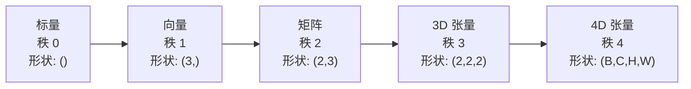
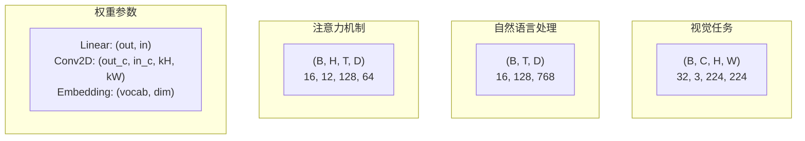
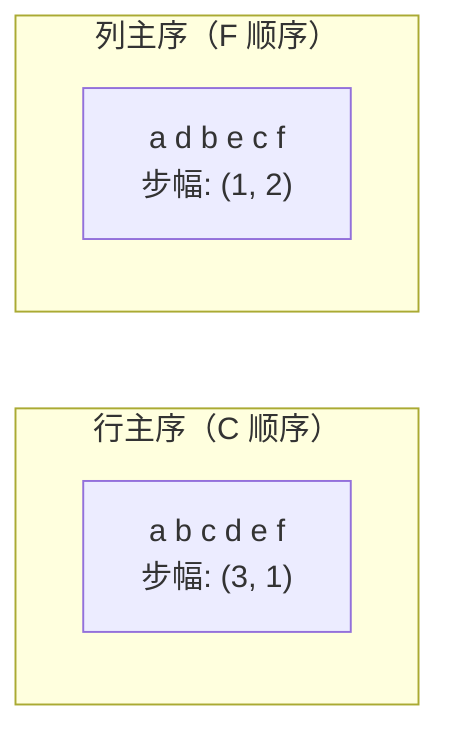
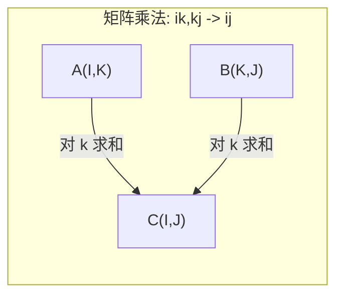

# 张量运算

> 张量是数据和深度学习之间的通用语言。每一张图像、每一句话、每一个梯度都流经其中。

**类型：** 构建
**语言：** Python
**前置知识：** 第一阶段，课程 01（线性代数直觉）、02（向量、矩阵与运算）
**时间：** 约 90 分钟

## 学习目标

- 从零实现具有 shape、strides、reshape、transpose 和逐元素运算的张量类
- 运用广播规则对不同形状的张量进行运算而无需复制数据
- 写出用于点积、矩阵乘法、外积和批处理运算的 einsum 表达式
- 追踪多头注意力中每一步的精确张量形状

## 问题所在

你构建了一个 Transformer。前向传播看起来很整洁。运行起来却得到：`RuntimeError: mat1 and mat2 shapes cannot be multiplied (32x768 and 512x768)`。你盯着那些形状。试着转置一下。现在又说 `Expected 4D input (got 3D input)`。加个 unsqueeze。又有别的地方崩了。

形状错误是深度学习代码中最常见的 bug。概念上并不难——每个操作都有形状契约——但它们会迅速累积。一个 Transformer 中有几十次 reshape、transpose 和 broadcast 链式连接。一个轴错了，错误就会级联扩散。更糟的是，有些形状错误根本不会报错。它们会沿着错误的维度静默广播或沿错误的轴求和，输出垃圾结果。

矩阵处理的是两个集合之间的两两关系。真实数据并不能放入二维空间中。一批 32 张 RGB 图像，每张 224x224，是一个 4D 张量：`(32, 3, 224, 224)`。12 头自注意力同样是 4D 的：`(batch, heads, seq_len, head_dim)`。你需要一个能推广到任意维度的数据结构，且运算能干净地组合所有维度。这个数据结构就是张量。掌握它的运算，形状错误就变成 trivial 的调试问题。

## 概念讲解

### 什么是张量

张量是一个具有统一数据类型的多维数字数组。维度数量称为**秩**（或**阶**）。每个维度称为一个**轴**。**形状**是按各轴列出的大小元组。



总元素数 = 所有尺寸的乘积。形状 `(2, 3, 4)` 容纳 `2 * 3 * 4 = 24` 个元素。

### 深度学习中的张量形状

不同数据类型按约定映射到特定张量形状。



PyTorch 使用 NCHW（通道在前）。TensorFlow 默认为 NHWC（通道在后）。布局不匹配会导致静默变慢或报错。

### 内存布局如何工作

内存中的一维数组是一个字节的线性序列。**步幅**告诉你沿每个轴移动一步需要跳过多少元素。



转置不会移动数据。它交换步幅，使张量变为**非连续**——一行的元素在内存中不再相邻。

### 广播规则

广播允许你在不同形状的张量上进行运算而无需复制数据。从右对齐形状。两个维度相等或其中一个为 1 时兼容。维度较少的在左侧填充 1。

```
张量 A:     (8, 1, 6, 1)
张量 B:        (7, 1, 5)
填充后的 B: (1, 7, 1, 5)
结果:       (8, 7, 6, 5)
```

### Einsum：通用的张量运算

爱因斯坦求和约定用字母标记每个轴。出现在输入但未出现在输出的轴会被求和。同时出现在输入和输出中的轴会被保留。



关键模式：`i,i->`（点积）、`i,j->ij`（外积）、`ii->`（迹）、`ij->ji`（转置）、`bij,bjk->bik`（批处理矩阵乘法）、`bhtd,bhsd->bhts`（注意力分数）。

```figure
tensor-broadcast
```

## 动手构建

代码位于 `code/tensors.py`。每一步都在其中引用对应实现。

### 第 1 步：张量存储与步幅

张量存储一个扁平的数字列表加上形状元数据。步幅告诉索引逻辑如何将多维索引映射到扁平位置。

```python
class Tensor:
    def __init__(self, data, shape=None):
        if isinstance(data, (list, tuple)):
            self._data, self._shape = self._flatten_nested(data)
        elif isinstance(data, np.ndarray):
            self._data = data.flatten().tolist()
            self._shape = tuple(data.shape)
        else:
            self._data = [data]
            self._shape = ()

        if shape is not None:
            total = reduce(lambda a, b: a * b, shape, 1)
            if total != len(self._data):
                raise ValueError(
                    f"无法将 {len(self._data)} 个元素重塑为形状 {shape}"
                )
            self._shape = tuple(shape)

        self._strides = self._compute_strides(self._shape)

    @staticmethod
    def _compute_strides(shape):
        if len(shape) == 0:
            return ()
        strides = [1] * len(shape)
        for i in range(len(shape) - 2, -1, -1):
            strides[i] = strides[i + 1] * shape[i + 1]
        return tuple(strides)
```

对于形状 `(3, 4)`，步幅为 `(4, 1)`——沿行移动跳 4 个元素，沿列移动跳 1 个元素。

### 第 2 步：重塑、压缩、扩展

reshape 改变形状但不改变元素顺序。元素总数必须保持不变。使用 `-1` 表示一个维度以自动推断其大小。

```python
t = Tensor(list(range(12)), shape=(2, 6))
r = t.reshape((3, 4))
r = t.reshape((-1, 3))
```

squeeze 移除大小为 1 的轴。unsqueeze 插入一个轴。unsqueeze 对广播至关重要——将偏差向量 `(D,)` 加到批次 `(B, T, D)` 上时，需要将其 unsqueeze 为 `(1, 1, D)`。

```python
t = Tensor(list(range(6)), shape=(1, 3, 1, 2))
s = t.squeeze()
v = Tensor([1, 2, 3])
u = v.unsqueeze(0)
```

### 第 3 步：转置与置换

transpose 交换两个轴。permute 重新排列所有轴。这是你在 NCHW 和 NHWC 之间转换的方式。

```python
mat = Tensor(list(range(6)), shape=(2, 3))
tr = mat.transpose(0, 1)

t4d = Tensor(list(range(24)), shape=(1, 2, 3, 4))
perm = t4d.permute((0, 2, 3, 1))
```

转置或置换后，张量在内存中变为非连续的。在 PyTorch 中，`view` 在非连续张量上会失败——使用 `reshape` 或先调用 `.contiguous()`。

### 第 4 步：逐元素运算与归约

逐元素运算（加、乘、减）独立应用于每个元素并保持形状不变。归约运算（求和、均值、最大值）折叠一个或多个轴。

```python
a = Tensor([[1, 2], [3, 4]])
b = Tensor([[10, 20], [30, 40]])
c = a + b
d = a * 2
s = a.sum(axis=0)
```

CNN 中的全局平均池化：`(B, C, H, W).mean(axis=[2, 3])` 产生 `(B, C)`。NLP 中的序列均值池化：`(B, T, D).mean(axis=1)` 产生 `(B, D)`。

### 第 5 步：使用 NumPy 进行广播

`tensors.py` 中的 `demo_broadcasting_numpy()` 函数展示了核心模式。

```python
activations = np.random.randn(4, 3)
bias = np.array([0.1, 0.2, 0.3])
result = activations + bias

images = np.random.randn(2, 3, 4, 4)
scale = np.array([0.5, 1.0, 1.5]).reshape(1, 3, 1, 1)
result = images * scale

a = np.array([1, 2, 3]).reshape(-1, 1)
b = np.array([10, 20, 30, 40]).reshape(1, -1)
outer = a * b
```

通过广播计算成对距离：将 `(M, 2)` reshape 为 `(M, 1, 2)`，将 `(N, 2)` reshape 为 `(1, N, 2)`，相减、平方、沿最后轴求和、取平方根。结果：`(M, N)`。

### 第 6 步：Einsum 运算

`tensors.py` 中的 `demo_einsum()` 和 `demo_einsum_gallery()` 函数逐步演示每种常见模式。

```python
a = np.array([1.0, 2.0, 3.0])
b = np.array([4.0, 5.0, 6.0])
dot = np.einsum("i,i->", a, b)

A = np.array([[1, 2], [3, 4], [5, 6]], dtype=float)
B = np.array([[7, 8, 9], [10, 11, 12]], dtype=float)
matmul = np.einsum("ik,kj->ij", A, B)

batch_A = np.random.randn(4, 3, 5)
batch_B = np.random.randn(4, 5, 2)
batch_mm = np.einsum("bij,bjk->bik", batch_A, batch_B)
```

缩并的计算代价是所有索引大小的乘积（保留的与求和的）。对于 `bij,bjk->bik`，当 B=32、I=128、J=64、K=128 时：`32 * 128 * 64 * 128 = 33,554,432` 次乘加运算。

### 第 7 步：通过 einsum 实现注意力机制

`tensors.py` 中的 `demo_attention_einsum()` 函数端到端实现了多头注意力。

```python
B, H, T, D = 2, 4, 8, 16
E = H * D

X = np.random.randn(B, T, E)
W_q = np.random.randn(E, E) * 0.02

Q = np.einsum("bte,ek->btk", X, W_q)
Q = Q.reshape(B, T, H, D).transpose(0, 2, 1, 3)

scores = np.einsum("bhtd,bhsd->bhts", Q, K) / np.sqrt(D)
weights = softmax(scores, axis=-1)
attn_output = np.einsum("bhts,bhsd->bhtd", weights, V)

concat = attn_output.transpose(0, 2, 1, 3).reshape(B, T, E)
output = np.einsum("bte,ek->btk", concat, W_o)
```

每一步都是一个张量运算：投影（通过 einsum 做 matmul）、切头（reshape + transpose）、注意力分数（通过 einsum 做批处理 matmul）、加权求和（通过 einsum 做批处理 matmul）、合并头（transpose + reshape）、输出投影（通过 einsum 做 matmul）。

## 使用指南

### 从零实现 vs NumPy

| 运算 | 从零实现（Tensor 类） | NumPy |
|---|---|---|
| 创建 | `Tensor([[1,2],[3,4]])` | `np.array([[1,2],[3,4]])` |
| 重塑 | `t.reshape((3,4))` | `a.reshape(3,4)` |
| 转置 | `t.transpose(0,1)` | `a.T` 或 `a.transpose(0,1)` |
| 压缩 | `t.squeeze(0)` | `np.squeeze(a, 0)` |
| 求和 | `t.sum(axis=0)` | `a.sum(axis=0)` |
| Einsum | 不适用 | `np.einsum("ij,jk->ik", a, b)` |

### 从零实现 vs PyTorch

```python
import torch

t = torch.tensor([[1, 2, 3], [4, 5, 6]], dtype=torch.float32)
t.shape
t.stride()
t.is_contiguous()

t.reshape(3, 2)
t.unsqueeze(0)
t.transpose(0, 1)
t.transpose(0, 1).contiguous()

torch.einsum("ik,kj->ij", A, B)
```

PyTorch 增加了自动微分、GPU 支持和优化的 BLAS 内核。形状语义完全相同。如果你理解从零实现版本，PyTorch 的形状错误就变得可读。

### 每个神经网络层作为张量运算

| 运算 | 张量形式 | Einsum |
|---|---|---|
| 线性层 | `Y = X @ W.T + b` | `"bd,od->bo"` + 偏置 |
| 注意力 QKV | `Q = X @ W_q` | `"btd,dh->bth"` |
| 注意力分数 | `Q @ K.T / sqrt(d)` | `"bhtd,bhsd->bhts"` |
| 注意力输出 | `softmax(scores) @ V` | `"bhts,bhsd->bhtd"` |
| 批归一化 | `(X - mu) / sigma * gamma` | 逐元素 + 广播 |
| Softmax | `exp(x) / sum(exp(x))` | 逐元素 + 归约 |

## 交付成果

本课程产生两个可复用的提示词：

1. **`outputs/prompt-tensor-shapes.md`** —— 一个系统化的张量形状不匹配调试提示词。包含每种常见运算（matmul、broadcast、cat、Linear、Conv2d、BatchNorm、softmax）的决策表和修复查找表。

2. **`outputs/prompt-tensor-debugger.md`** —— 一个逐步调试提示词，当形状错误卡住你时粘贴到任何 AI 助手。提供错误消息和你的张量形状，获得精确的修复方案。

## 练习

1. **简单 — 重塑往返。** 取一个形状为 `(2, 3, 4)` 的张量。将其重塑为 `(6, 4)`，再重塑为 `(24,)`，然后还原回 `(2, 3, 4)`。通过打印扁平数据验证每一步的元素顺序是否保持不变。

2. **中等 — 实现广播。** 为 `Tensor` 类添加一个 `broadcast_to(shape)` 方法，将大小为 1 的维度扩展到匹配目标形状。然后修改 `_elementwise_op` 使其在运算前自动广播。用形状 `(3, 1)` 和 `(1, 4)` 产生 `(3, 4)` 进行测试。

3. **困难 — 从零实现 einsum。** 实现一个基本的 `einsum(subscripts, *tensors)` 函数，至少处理：点积（`i,i->`）、矩阵乘法（`ij,jk->ik`）、外积（`i,j->ij`）和转置（`ij->ji`）。解析下标字符串，识别缩并索引，并对所有索引组合进行循环。将你的结果与 `np.einsum` 对比验证。

4. **困难 — 注意力形状追踪器。** 编写一个函数，接受 `batch_size`、`seq_len`、`embed_dim` 和 `num_heads` 作为输入，打印多头注意力每一步的精确形状：输入、Q/K/V 投影、切头、注意力分数、softmax 权重、加权求和、合并头、输出投影。与 `demo_attention_einsum()` 的输出进行对比验证。

## 核心术语

| 术语 | 人们怎么说 | 实际含义 |
|---|---|---|
| 张量 | "维度更多的矩阵" | 具有统一类型和定义好的形状、步幅及运算的多维数组 |
| 秩 | "维度数量" | 轴的数量。矩阵的秩是 2，不等于其矩阵秩 |
| 形状 | "张量的大小" | 按各轴列出的大小元组。`(2, 3)` 表示 2 行 3 列 |
| 步幅 | "内存如何排列" | 沿每个轴前进一个位置需要跳过的元素数量 |
| 广播 | "形状不同时它自己就工作了" | 一套严格规则：从右对齐，维度必须相等或其中一个为 1 |
| 连续 | "张量是正常的" | 元素在内存中顺序存储，没有间隔或相对于逻辑布局的重排 |
| Einsum | "写矩阵乘法的花哨方式" | 一种通用记号，用一行表达任意张量缩并、外积、迹或转置 |
| View | "和 reshape 一样" | 共享同一内存缓冲区但具有不同形状/步幅元数据的张量。在非连续数据上失败 |
| 缩并 | "对索引求和" | 张量间共享索引被乘加的一般运算，产生更低秩的结果 |
| NCHW / NHWC | "PyTorch 与 TensorFlow 格式" | 图像张量的内存布局约定。NCHW 将通道放在空间维度之前，NHWC 放在之后 |

## 延伸阅读

- [NumPy Broadcasting](https://numpy.org/doc/stable/user/basics.broadcasting.html) —— 权威规则及可视化示例
- [PyTorch Tensor Views](https://pytorch.org/docs/stable/tensor_view.html) —— 何时 view 有效、何时会复制
- [einops](https://github.com/arogozhnikov/einops) —— 让张量重塑可读且安全的库
- [The Illustrated Transformer](https://jalammar.github.io/illustrated-transformer/) —— 可视化流经注意力的张量形状
- [Einstein Summation in NumPy](https://numpy.org/doc/stable/reference/generated/numpy.einsum.html) —— 含完整示例的 einsum 文档
