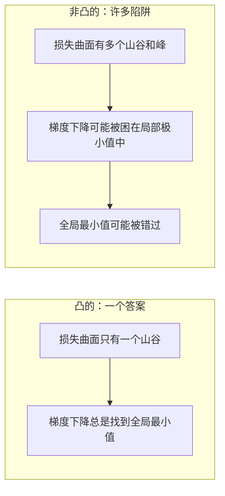
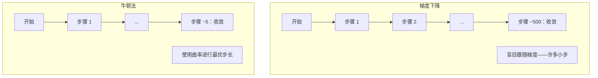
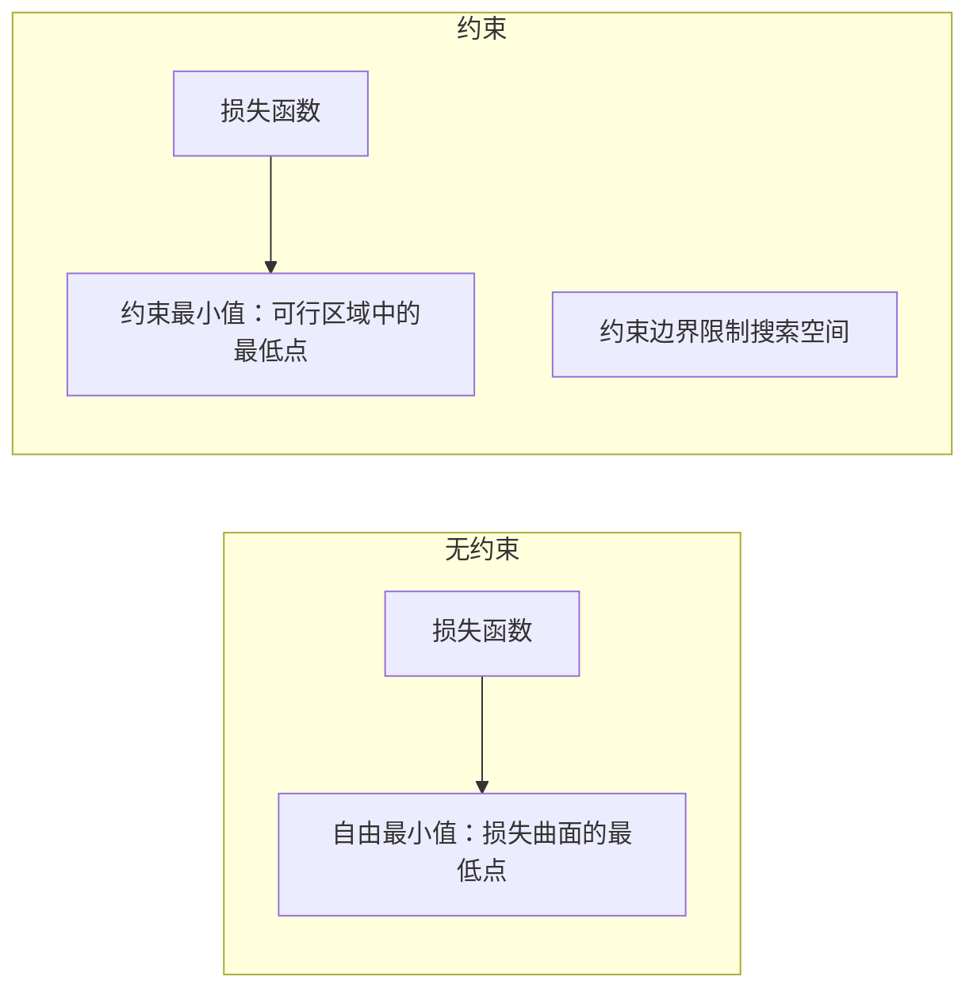
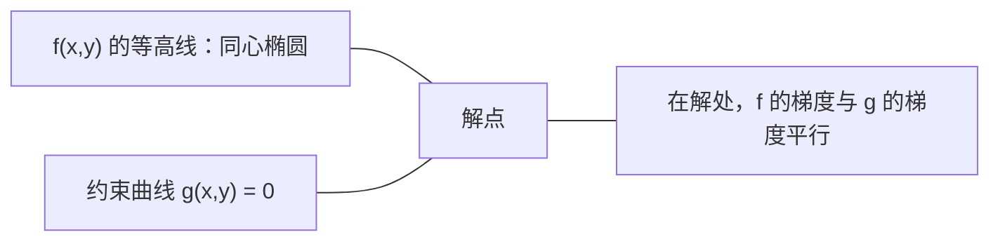

# 凸优化

> 凸问题只有一个山谷。神经网络却有数百万个。了解这一差异至关重要。

**类型：** Build
**语言：** Python
**前置知识：** Phase 1, Lessons 04 (ML中的微积分), 08 (优化)
**时间：** ~90 分钟

## 学习目标

- 使用定义、二阶导数和 Hessian 准则检验函数是否为凸函数
- 实现牛顿法并与梯度下降比较其二次收敛性
- 使用拉格朗日乘子法求解约束优化问题并解释 KKT 条件
- 解释为什么神经网络损失函数是非凸的但 SGD 仍能找到好的解

## 问题所在

Lesson 08 教了你在任意曲面上走下坡路的梯度下降、动量和 Adam。但那些优化器没有任何保证。在非凸景观上做梯度下降可能会陷入坏的局部极小值、被困在山脊点上，或者永远振荡。你之所以仍然使用它们，是因为神经网络是非凸的，而别无选择。

但机器学习中的许多问题是凸的。线性回归、逻辑回归、SVM、LASSO、岭回归。对于这些，存在更强大的东西：带有数学保证的优化。凸问题只有一个山谷。任何走下坡路的算法都会到达全局最小值。无需重启。无需学习率调度。无需祈祷。

理解凸性有三件事可以做。首先，它告诉你什么时候问题简单（凸的） versus 困难（非凸的）。其次，它为你提供了更快的工具，例如用于凸问题的牛顿法。第三，它解释了贯穿整个 ML 的概念：正则化作为约束、SVM 中的对偶性，以及深度学习和为什么在违反凸性赋予的所有美好属性的情况下仍能工作。

## 概念部分

### 凸集

如果集合 S 中任意两点之间的线段完全位于 S 内，则称 S 为凸集。

| 凸集 | 非凸 |
|---|---|
| **矩形**：内部任意两点可以用留在内部的线段连接 | **星形/新月形**：两点之间的线段可能穿过集合外部 |
| **三角形**：对所有内部点都成立相同属性 | **甜甜圈/圆环**：空洞意味着某些线段离开集合 |
| 任意两点之间的线段保持在集合内 | 某些点对之间的线段离开集合 |

正式检验：对于 S 中的任意点 x, y 和任何 t in [0, 1]，点 tx + (1-t)y 也在 S 中。

凸集示例：
- 直线、平面、整个 R^n
- 球体（圆、球面、超球面）
- 半空间：{x : a^T x <= b}
- 任意数量凸集的交集

非凸集示例：
- 甜甜圈（圆环）
- 两个不相交圆的并集
- 任何有"凹陷"或"洞"的集合

### 凸函数

函数 f 是凸函数，如果其定义域是凸集，且对于其定义域中的任意两点 x, y 和任何 t in [0, 1]：

```
f(tx + (1-t)y) <= t*f(x) + (1-t)*f(y)
```

几何上：图上任意两点之间的线段位于图上方或与之重合。

| 属性 | 凸函数 | 非凸函数 |
|---|---|---|
| **线段检验** | 图上任意两点之间的线位于曲线**上方或之上** | 图上某些点之间的线**低于**曲线 |
| **形状** | 单一碗/山谷向上弯曲 | 多个峰和谷，曲率混合 |
| **局部极小值** | 每个局部极小值都是全局极小值 | 可能存在多个不同高度的局部极小值 |

常见凸函数：
- f(x) = x^2（抛物线）
- f(x) = |x|（绝对值）
- f(x) = e^x（指数）
- f(x) = max(0, x)（ReLU，虽然是分段线性）
- f(x) = -log(x)，其中 x > 0（负对数）
- 任何线性函数 f(x) = a^T x + b（既是凸的也是凹的）

### 凸性检验

三种实用检验方法，从最简单到最严格。

**检验 1：二阶导数检验（一维）。** 如果 f''(x) >= 0 对所有 x，则 f 是凸的。

- f(x) = x^2：f''(x) = 2 >= 0。凸的。
- f(x) = x^3：f''(x) = 6x。x < 0 时为负。非凸。
- f(x) = e^x：f''(x) = e^x > 0。凸的。

**检验 2：Hessian 检验（多元）。** 如果 Hessian 矩阵 H(x) 对所有 x 是正半定的，则 f 是凸的。Hessian 是二阶偏导数的矩阵。

**检验 3：定义检验。** 直接检查不等式 f(tx + (1-t)y) <= t*f(x) + (1-t)*f(y)。对于难以计算导数的函数很有用。

### 为什么凸性很重要

凸优化的中心定理：

**对于凸函数，每个局部极小值都是全局极小值。**

这意味着梯度下降不会被困住。任何下坡路径都导向相同的答案。算法保证收敛到最优解。



后果：
- 无需随机重启
- 无需复杂的 学习率调度
- 收敛性证明是可能的（速率取决于函数属性）
- 解是唯一的（在平坦区域上）

### 凸 vs 非凸在 ML 中

| 问题 | 是否凸？ | 原因 |
|---------|---------|-----|
| 线性回归（MSE） | 是 | 损失是关于权重的二次函数 |
| 逻辑回归 | 是 | 对数损失是关于权重的凸函数 |
| SVM（合页损失） | 是 | 线性函数的最大值 |
| LASSO（L1 回归） | 是 | 凸函数之和是凸的 |
| 岭回归（L2） | 是 | 二次 + 二次 = 凸 |
| 神经网络（任意损失） | 否 | 非线性激活创建非凸景观 |
| k-means 聚类 | 否 | 离散分配步骤 |
| 矩阵分解 | 否 | 未知量的乘积 |

具有凸损失的线性模型是凸的。你添加带非线性激活的隐藏层的时刻，凸性就破坏了。

### Hessian 矩阵

函数 f: R^n -> R 的 Hessian H 是 n x n 的二阶偏导数矩阵。

```
H[i][j] = d^2 f / (dx_i dx_j)
```

对于 f(x, y) = x^2 + 3xy + y^2：

```
df/dx = 2x + 3y       d^2f/dx^2 = 2      d^2f/dxdy = 3
df/dy = 3x + 2y       d^2f/dydx = 3      d^2f/dy^2 = 2

H = [ 2  3 ]
    [ 3  2 ]
```

Hessian 告诉你关于曲率的信息：
- 所有特征值都为正：函数在每个方向上都向上弯曲（在该点是凸的）
- 所有特征值都为负：在每个方向上都向下弯曲（凹的，局部最大值）
- 混合符号：鞍点（在某些方向向上弯曲，在其他方向向下）
- 零特征值：在该方向平坦（退化）

对于凸性，Hessian 必须在所有地方都是正半定的（所有特征值 >= 0），而不仅仅是在某一点。

### 牛顿法

梯度下降使用一阶信息（梯度）。牛顿法使用二阶信息（Hessian）。它在当前点拟合二次近似并直接跳到该二次函数的最小值。

```
更新规则：
  x_new = x - H^(-1) * gradient

与梯度下降比较：
  x_new = x - lr * gradient
```

牛顿法用逆 Hessian 替换标量学习率。这根据局部曲率自动调整步长和方向。



优点：
- 在最小值附近有二次收敛性（每步误差平方）
- 无需调节学习率
- 尺度不变（无论你怎么参数化问题都能工作）

缺点：
- 计算 Hessian 需要 O(n^2) 内存，求逆需要 O(n^3)
- 对于拥有 100 万权重的神经网络，那就是 10^12 个条目和 10^18 次运算
- 对深度学习不实际

### 约束优化

无约束优化：在所有 x 上最小化 f(x)。
约束优化：在满足约束的情况下最小化 f(x)。

实际问题都有约束。你想最小化成本但预算有限。你想最小化误差但模型复杂度有界。



### 拉格朗日乘子法

拉格朗日乘子法将约束问题转换为无约束问题。

问题：在 g(x) = 0 的约束下最小化 f(x)。

解法：引入一个新变量（拉格朗日乘子 lambda）并求解无约束问题：

```
L(x, lambda) = f(x) + lambda * g(x)
```

在解处，L 的梯度为零：

```
dL/dx = df/dx + lambda * dg/dx = 0
dL/dlambda = g(x) = 0
```

几何直觉：在约束最小值处，f 的梯度必须与约束 g 的梯度平行。如果它们不平 行，你可以沿着约束曲面移动并进一步减小 f。



示例：在 x + y = 1 的约束下最小化 f(x,y) = x^2 + y^2。

```
L = x^2 + y^2 + lambda(x + y - 1)

dL/dx = 2x + lambda = 0  =>  x = -lambda/2
dL/dy = 2y + lambda = 0  =>  y = -lambda/2
dL/dlambda = x + y - 1 = 0

从前两个：x = y
代入：2x = 1，所以 x = y = 0.5，lambda = -1
```

直线 x + y = 1 上距离原点最近的点是 (0.5, 0.5)。

### KKT 条件

Karush-Kuhn-Tucker 条件将拉格朗日乘子法扩展到不等式约束。

问题：在 g_i(x) <= 0（i = 1, ..., m）的约束下最小化 f(x)。

KKT 条件（最优性的必要条件）：

```
1. 平稳性：    df/dx + sum(lambda_i * dg_i/dx) = 0
2. 原始可行性：  g_i(x) <= 0  对所有 i
3. 对偶可行性：  lambda_i >= 0  对所有 i
4. 互补松弛性：  lambda_i * g_i(x) = 0  对所有 i
```

互补松弛性是关键见解：要么约束是活跃的（g_i = 0，解位于边界上），要么乘子为零（约束无关紧要）。不影响解的约束具有 lambda = 0。

KKT 条件对 SVM 至关重要。支持向量是约束活跃的（lambda > 0）的数据点。所有其他数据点的 lambda = 0，不影响决策边界。

### 正则化作为约束优化

L1 和 L2 正则化不是任意技巧。它们是伪装成约束优化问题的问题。

**L2 正则化（Ridge）：**

```
在 ||w||^2 <= t 的约束下最小化 Loss(w)

等价的无约束形式：
最小化 Loss(w) + lambda * ||w||^2
```

约束 ||w||^2 <= t 定义了一个球（二维中的圆，三维中的球面）。解是损失等高线首次接触该球的位置。

**L1 正则化（LASSO）：**

```
在 ||w||_1 <= t 的约束下最小化 Loss(w)

等价的无约束形式：
最小化 Loss(w) + lambda * ||w||_1
```

约束 ||w||_1 <= t 定义了一个菱形（二维中的旋转正方形）。

| 属性 | L2 约束（圆形） | L1 约束（菱形） |
|---|---|---|
| **约束形状** | 圆形（高维中为球面） | 菱形（二维中为旋转正方形） |
| **损失等高线接触的位置** | 平滑边界——圆上的任意点 | 角点——与轴对齐 |
| **解的行为** | 权重很小但不为零 | 一些权重恰好为零（稀疏） |
| **结果** | 权重收缩 | 特征选择 |

这解释了为什么 L1 产生稀疏模型（特征选择）而 L2 仅收缩权重。菱形有与轴对齐的角。损失等高线更可能接触到角点，将一个或多个权重精确设为零。

### 对偶性

每个约束优化问题（原问题）都有一个伴随问题（对偶问题）。对于凸问题，原问题和对偶问题具有相同的最优值。这叫做强对偶性。

拉格朗日对偶函数：

```
原问题：在 g(x) <= 0 的约束下最小化 f(x)
拉格朗日：L(x, lambda) = f(x) + lambda * g(x)
对偶函数：d(lambda) = min_x L(x, lambda)
对偶问题：在 lambda >= 0 的约束下最大化 d(lambda)
```

为什么对偶性重要：
- 对偶问题有时比原问题更容易求解
- SVMs 在其对偶形式中求解，其中问题取决于数据点之间的点积（启用核技巧）
- 对偶为原问题最优值提供下界，有助于检查解的质量

具体对于 SVMs：

```
原问题：找到 w, b 以最大化间隔 2/||w||，满足
        y_i(w^T x_i + b) >= 1 对所有 i

对偶：   最大化 sum(alpha_i) - 0.5 * sum_ij(alpha_i * alpha_j * y_i * y_j * x_i^T x_j)
        满足 alpha_i >= 0 且 sum(alpha_i * y_i) = 0

对偶只涉及点积 x_i^T x_j。
将 x_i^T x_j 替换为 K(x_i, x_j) 以获得核技巧。
```

### 为什么深度学习在非凸性下仍能工作

神经网络损失函数极其非凸。根据每个经典度量，优化它们应该失败。然而随机梯度下降可靠地找到好的解。几个因素解释了这一点。

**大多数局部极小值都足够好。** 在高维空间中，随机临界点（梯度为零的点）绝大多数是鞍点，而不是局部极小值。存在的少数局部极小值往往具有接近全局最小值的损失值。当参数空间有数百万维度时，被困在一个糟糕的局部极小值的可能性极小。

**鞍点而非局部极小值才是真正的障碍。** 在具有 n 个参数的函数中，鞍点在正负曲率方向上是混合的。对于高维中的随机临界点，所有 n 个特征值为正（局部极小值）的概率约为 2^(-n)。几乎所有的临界点都是鞍点。SGD 的噪声帮助逃逸它们。

**过参数化平滑了景观。** 参数多于训练样本的网络具有更平滑、更连通 的损失曲面。更宽的网络有更少坏的局部极小值。这是反直觉的但与经验一致。

**损失景观结构：**

| 属性 | 低维空间 | 高维空间 |
|---|---|---|
| **景观** | 许多孤立峰和谷 | 平滑连接的谷 |
| **极小值** | 许多孤立的局部极小值 | 少量坏局部极小值；大多数接近最优 |
| **导航** | 难以找到全局最小值 | 多条路径导向好的解 |
| **临界点** | 局部极小值和鞍点的混合 | 压倒性地是鞍点，而非局部极小值 |

**随机噪声充当隐式正则化。** Mini-batch SGD 添加的噪声防止陷入尖锐极小值。尖锐极小值过拟合；平坦极小值泛化。噪声将优化偏向损失景观的平坦区域。

### 实践中的一阶 vs 二阶方法

纯牛顿法对于大模型不实际。几种近似使二阶信息变得可用。

**L-BFGS（有限内存 BFGS）：** 使用后 m 个梯度差来近似逆 Hessian。需要 O(mn) 内存而不是 O(n^2)。适用于最多约 10,000 参数的问题。在经典 ML（逻辑回归、CRFs）中使用，但不在深度学习中。

**自然梯度：** 使用 Fisher 信息矩阵（对数似然的期望 Hessian）代替标准 Hessian。这考虑了概率分布的几何。K-FAC（Kronecker 分解近似曲率）将 Fisher 矩阵近似为 Kronecker 乘积，使其对神经网络实用。

**Hessian 自由优化：** 使用共轭梯度求解 Hx = g 而无需形成 H。仅需 Hessian-向量积，可通过自动微分在 O(n) 时间内计算。

**对角近似：** Adam 的二阶矩是 Hessian 对角线的对角近似。AdaHessian 通过 Hutchinson 估计器扩展这一方法使用实际的 Hessian 对角元素。

| 方法 | 内存 | 每步成本 | 使用时机 |
|--------|--------|--------------|-------------|
| 梯度下降 | O(n) | O(n) | 基准，大模型 |
| 牛顿法 | O(n^2) | O(n^3) | 小凸问题 |
| L-BFGS | O(mn) | O(mn) | 中等凸问题 |
| Adam | O(n) | O(n) | 深度学习默认 |
| K-FAC | O(n) | 每层 O(n) | 研究，大批量训练 |

```figure
convex-vs-nonconvex
```

## 构建它

### 步骤 1：凸性检查器

构建一个通过采样点并检查定义来经验性检验凸性的函数。

```python
import random
import math

def check_convexity(f, dim, bounds=(-5, 5), samples=1000):
    violations = 0
    for _ in range(samples):
        x = [random.uniform(*bounds) for _ in range(dim)]
        y = [random.uniform(*bounds) for _ in range(dim)]
        t = random.uniform(0, 1)
        mid = [t * xi + (1 - t) * yi for xi, yi in zip(x, y)]
        lhs = f(mid)
        rhs = t * f(x) + (1 - t) * f(y)
        if lhs > rhs + 1e-10:
            violations += 1
    return violations == 0, violations
```

### 步骤 2：二维牛顿法

使用显式 Hessian 实现牛顿法。将收敛速度与伦 梯度下降比较。

```python
def newtons_method(f, grad_f, hessian_f, x0, steps=50, tol=1e-12):
    x = list(x0)
    history = [x[:]]
    for _ in range(steps):
        g = grad_f(x)
        H = hessian_f(x)
        det = H[0][0] * H[1][1] - H[0][1] * H[1][0]
        if abs(det) < 1e-15:
            break
        H_inv = [
            [H[1][1] / det, -H[0][1] / det],
            [-H[1][0] / det, H[0][0] / det],
        ]
        dx = [
            H_inv[0][0] * g[0] + H_inv[0][1] * g[1],
            H_inv[1][0] * g[0] + H_inv[1][1] * g[1],
        ]
        x = [x[0] - dx[0], x[1] - dx[1]]
        history.append(x[:])
        if sum(gi ** 2 for gi in g) < tol:
            break
    return history
```

### 步骤 3：拉格朗日乘子求解器

在拉格朗日函数上使用梯度下降求解约束优化。

```python
def lagrange_solve(f_grad, g_val, g_grad, x0, lr=0.01,
                   lr_lambda=0.01, steps=5000):
    x = list(x0)
    lam = 0.0
    history = []
    for _ in range(steps):
        fg = f_grad(x)
        gv = g_val(x)
        gg = g_grad(x)
        x = [
            xi - lr * (fgi + lam * ggi)
            for xi, fgi, ggi in zip(x, fg, gg)
        ]
        lam = lam + lr_lambda * gv
        history.append((x[:], lam, gv))
    return history
```

### 步骤 4：比较一阶 vs 二阶

在相同的二次函数上运行梯度下降和牛顿法。统计收敛所需的步数。

```python
def quadratic(x):
    return 5 * x[0] ** 2 + x[1] ** 2

def quadratic_grad(x):
    return [10 * x[0], 2 * x[1]]

def quadratic_hessian(x):
    return [[10, 0], [0, 2]]
```

牛顿法将在 1 步内收敛（它对二次函数是精确的）。梯度下降将需要数百步，因为 Hessian 的特征值相差 5 倍，创建了长椭圆形山谷。

## 使用它

凸性分析直接适用于选择 ML 模型和求解器。

对于凸问题（逻辑回归、SVMs、LASSO）：
- 使用专用求解器（liblinear、CVXPY、scipy.optimize.minimize with method='L-BFGS-B'）
- 期望唯一的全局解
- 二阶方法实用且快速

对于非凸问题（神经网络）：
- 使用一阶方法（SGD、Adam）
- 接受解依赖于初始化和随机性
- 使用过参数化、噪声和学习率调度作为隐式正则化
- 不要浪费时间寻找全局最小值。一个好的局部极小值就足够了。

```python
from scipy.optimize import minimize

result = minimize(
    fun=lambda w: sum((y - X @ w) ** 2) + 0.1 * sum(w ** 2),
    x0=np.zeros(d),
    method='L-BFGS-B',
    jac=lambda w: -2 * X.T @ (y - X @ w) + 0.2 * w,
)
```

对于 SVMs，对偶公式让你可以使用核技巧：

```python
from sklearn.svm import SVC

svm = SVC(kernel='rbf', C=1.0)
svm.fit(X_train, y_train)
print(f"支持向量: {svm.n_support_}")
```

## 练习

1. **凸性画廊。** 使用检查器检验以下函数的凸性：f(x) = x^4, f(x) = sin(x), f(x,y) = x^2 + y^2, f(x,y) = x*y, f(x) = max(x, 0)。解释每个结果为何合理。

2. **牛顿法 vs 梯度下降竞赛。** 在 f(x,y) = 50*x^2 + y^2 上从起点 (10, 10) 运行两种方法。每种方法需要多少步才能达到损失 < 1e-10？当条件数（最大与最小 Hessian 特征值之比）增加时会发生什么？

3. **拉格朗日乘子几何。** 在 x + 2y = 4 的约束下最小化 f(x,y) = (x-3)^2 + (y-3)^2。通过检查解处 f 的梯度是否与 g 的梯度平行来验证解。

4. **正则化约束。** 实现 L1 约束优化：在 |x| + |y| <= 1 的约束下最小化 (x-3)^2 + (y-2)^2。证明解有一个坐标等于零（菱形约束产生的稀疏性）。

5. **Hessian 特征值分析。** 计算 Rosenbrock 函数在 (1,1) 和 (-1,1) 处的 Hessian。在两个点计算特征值。特征值告诉你关于最小值处与远离它时的曲率的什么信息？

## 关键术语

| 术语 | 含义 |
|------|---------------|
| 凸集 | 集合中任意两点之间的线段保持在集合内的集合 |
| 凸函数 | 图上任意两点之间的线位于曲线上方或之上的函数。等价地，Hessian 处处正半定 |
| 局部极小值 | 比所有邻近点都低的点。对于凸函数，每个局部极小值都是全局极小值 |
| 全局极小值 | 函数在整个定义域上的最低点 |
| Hessian 矩阵 | 所有二阶偏导数的矩阵。编码曲率信息 |
| 正半定 | 所有特征值非负的矩阵。"二阶导数 >= 0"的多维类比 |
| 条件数 | Hessian 最大与最小特征值之比。高条件数意味着拉长山谷和缓慢的梯度下降 |
| 牛顿法 | 使用逆 Hessian 确定步长方向和大小的二阶优化器。在最小值附近有二次收敛性 |
| 拉格朗日乘子 | 引入的变量，将约束优化问题转换为无约束问题 |
| KKT 条件 | 带不等式约束的最优性必要条件。推广拉格朗日乘子 |
| 互补松弛性 | 在解处，要么约束是活跃的，要么其乘子为零。两者永不同时为非零 |
| 对偶性 | 每个约束问题都有一个伴随对偶问题。对于凸问题，两者具有相同的最优值 |
| 强对偶性 | 原问题和对偶问题的最优值相等。对于满足 Slater 条件的凸问题成立 |
| L-BFGS | 近似二阶方法，存储最后 m 个梯度差而不是完整 Hessian |
| 鞍点 | 梯度为零但在某些方向是极小值、在其他方向是极大值的点 |
| 过参数化 | 使用多于训练样本的参数。平滑损失景观并减少坏的局部极小值 |

## 延伸阅读

- [Boyd & Vandenberghe: Convex Optimization](https://web.stanford.edu/~boyd/cvxbook/) - 标准教材，免费在线可用
- [Bottou, Curtis, Nocedal: Optimization Methods for Large-Scale Machine Learning (2018)](https://arxiv.org/abs/1606.04838) - 桥接凸优化理论与深度学习实践
- [Choromanska et al.: The Loss Surfaces of Multilayer Networks (2015)](https://arxiv.org/abs/1412.0233) - 为什么非凸神经网络景观并不像看起来那么糟
- [Nocedal & Wright: Numerical Optimization](https://link.springer.com/book/10.1007/978-0-387-40065-5) - 牛顿法、L-BFGS 和约束优化的全面参考
