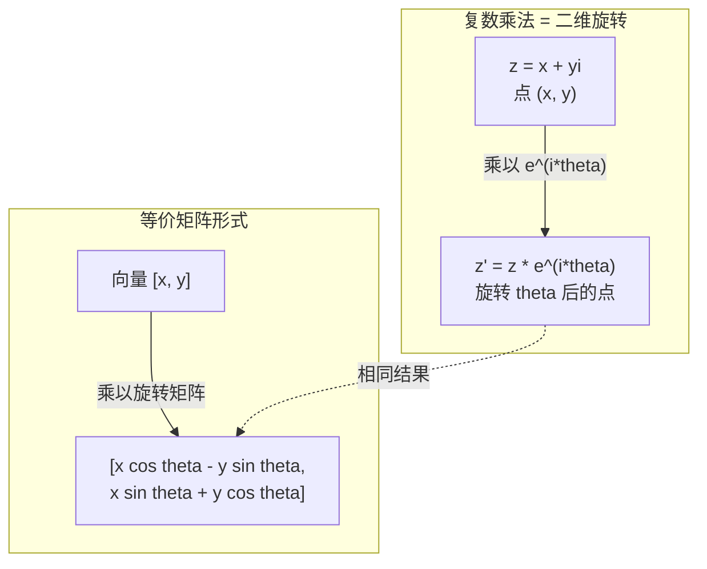
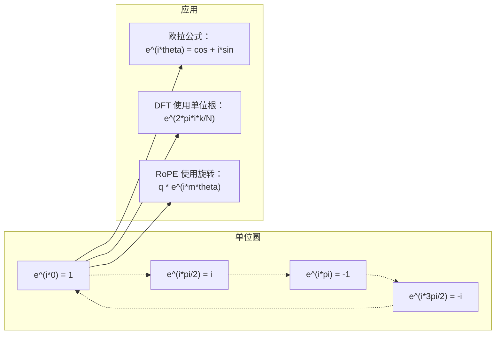

# AI 中的复数

> -1 的平方根并非"虚构"。它是旋转、频率和信号处理半壁江山的钥匙。

**类型:** 学习
**语言:** Python
**前置知识:** 第一阶段，课程 01-04（线性代数、微积分）
**时长:** ~60 分钟

## 学习目标

- 在直角坐标和极坐标形式下执行复数运算（加、乘、除、共轭）
- 应用欧拉公式在复指数与三角函数之间转换
- 使用复单位根实现离散傅里叶变换
- 解释复数旋转如何支撑 Transformer 中的 RoPE 和正弦位置编码

## 问题

你打开一篇关于傅里叶变换的论文，发现到处都有 `i`。你看 Transformer 的位置编码，看到不同频率的 `sin` 和 `cos`——那正是复指数的实部和虚部。你读量子计算，发现一切都在复向量空间中表达。

复数看起来抽象。建立在 -1 的平方根上的数系感觉像个数学把戏。但它不是把戏。它是旋转和振动的自然语言。每当有东西旋转、振动或振荡时，复数就是正确的工具。

不理解复数，你就无法理解离散傅里叶变换。你无法理解 FFT。你无法理解现代语言模型中 RoPE（旋转位置嵌入）的工作原理。你无法理解为什么原始 Transformer 论文中的正弦位置编码使用那些频率。

本课从零开始构建复数算术，将其与几何联系起来，并精确展示复数在机器学习中的出现位置。

## 概念

### 什么是复数？

复数有两个部分：实部和虚部。

```
z = a + bi

其中：
  a 是实部
  b 是虚部
  i 是虚数单位，定义为 i^2 = -1
```

就是这样。你将数轴扩展到平面。实数坐在一根轴上，虚数坐在另一根轴上。每个复数都是这个平面中的一个点。

### 复数算术

**加法。** 实部相加，虚部相加。

```
(a + bi) + (c + di) = (a + c) + (b + d)i

示例：(3 + 2i) + (1 + 4i) = 4 + 6i
```

**乘法。** 使用分配律，记住 i^2 = -1。

```
(a + bi)(c + di) = ac + adi + bci + bdi^2
                 = ac + adi + bci - bd
                 = (ac - bd) + (ad + bc)i

示例：(3 + 2i)(1 + 4i) = 3 + 12i + 2i + 8i^2
                            = 3 + 14i - 8
                            = -5 + 14i
```

**共轭。** 翻转虚部的符号。

```
(a + bi) 的共轭 = a - bi
```

复数与其共轭的乘积永远是实数：

```
(a + bi)(a - bi) = a^2 + b^2
```

**除法。** 分子分母同乘分母的共轭。

```
(a + bi) / (c + di) = (a + bi)(c - di) / (c^2 + d^2)
```

这消除了分母中的虚部，给你一个干净的复数。

### 复平面

复平面将每个复数映射到二维点。水平轴是实轴，垂直轴是虚轴。

```
z = 3 + 2i  对应点 (3, 2)
z = -1 + 0i 对应实轴上的点 (-1, 0)
z = 0 + 4i  对应虚轴上的点 (0, 4)
```

复数同时是一个点和从原点出发的向量。这种双重解释使复数对几何有用。

### 极坐标形式

平面中的任何点都可以用其到原点的距离和与正实轴的夹角来描述。

```
z = r * (cos(theta) + i*sin(theta))

其中：
  r = |z| = sqrt(a^2 + b^2)     （模长，或模）
  theta = atan2(b, a)             （辐角，或幅角）
```

直角坐标形式（a + bi）适合加法。极坐标形式（r, theta）适合乘法。

**极坐标下的乘法。** 模长相乘，角度相加。

```
z1 = r1 * e^(i*theta1)
z2 = r2 * e^(i*theta2)

z1 * z2 = (r1 * r2) * e^(i*(theta1 + theta2))
```

这就是复数完美适合旋转的原因。乘以模长为 1 的复数就是纯旋转。

### 欧拉公式

连接复指数与三角学的桥梁：

```
e^(i*theta) = cos(theta) + i*sin(theta)
```

这是本课最重要的公式。当 theta = pi 时：

```
e^(i*pi) = cos(pi) + i*sin(pi) = -1 + 0i = -1

因此：e^(i*pi) + 1 = 0
```

五个基本常数（e、i、pi、1、0）在一个等式中联系到一起。

### 为什么欧拉公式对 ML 重要

欧拉公式说 `e^(i*theta)` 在 theta 变化时描绘单位圆。theta = 0 时，你在 (1, 0)。theta = pi/2 时，你在 (0, 1)。theta = pi 时，你在 (-1, 0)。theta = 3*pi/2 时，你在 (0, -1)。完整旋转是 theta = 2*pi。

这意味着复指数就是旋转。而旋转无处不在信号处理和 ML 中。

### 与二维旋转的联系

复数 (x + yi) 乘以 e^(i*theta) 将点 (x, y) 绕原点旋转 theta 角度。

```
复数乘法旋转：
  (x + yi) * (cos(theta) + i*sin(theta))
  = (x*cos(theta) - y*sin(theta)) + (x*sin(theta) + y*cos(theta))i

矩阵乘法旋转：
  [cos(theta)  -sin(theta)] [x]   [x*cos(theta) - y*sin(theta)]
  [sin(theta)   cos(theta)] [y] = [x*sin(theta) + y*cos(theta)]
```

它们产生相同的结果。复数乘法就是二维旋转。旋转矩阵只是用矩阵记法写出的复数乘法。



### 相量和旋转信号

复指数 e^(i*omega*t) 是一个以角频率 omega 绕单位圆旋转的点。随着 t 增加，该点描绘圆周。

这个旋转点的实部是 cos(omega*t)。虚部是 sin(omega*t)。正弦信号就是旋转复数的影子。

```
e^(i*omega*t) = cos(omega*t) + i*sin(omega*t)

实部：       cos(omega*t)    -- 余弦波
虚部：       sin(omega*t)    -- 正弦波
```

这就是相量表示。与其追踪波浪形的正弦波，不如追踪一个平滑旋转的箭头。相位偏移变成角度偏移。幅度变化变成模长变化。信号相加变成向量相加。

### 单位根

N 次单位根是单位圆上均匀分布的 N 个点：

```
w_k = e^(2*pi*i*k/N)    其中 k = 0, 1, 2, ..., N-1
```

对于 N = 4，根为：1, i, -1, -i（四个罗盘点）。
对于 N = 8，你得到四个罗盘点加上四个对角点。

单位根是离散傅里叶变换的基础。DFT 将信号分解为这些 N 个等间距频率的分量。

### 与 DFT 的联系

信号 x[0], x[1], ..., x[N-1] 的离散傅里叶变换为：

```
X[k] = sum_{n=0}^{N-1} x[n] * e^(-2*pi*i*k*n/N)
```

每个 X[k] 衡量信号与第 k 个单位根的关联程度——即频率为 k 的复正弦波。DFT 将信号分解为 N 个旋转相量，并告诉你每个的幅度和相位。

### 为什么 i 不是"虚构"的

"虚构"这个词是历史的偶然。笛卡尔用它来表示轻视。但 i 并不比当初被拒绝的负数更"虚构"。负数回答"从 3 中减去 5 要问什么数？"虚数单位回答"什么数平方得 -1？"

更有用的是：i 是 90 度旋转算子。将实数乘以 i 一次，你旋转 90 度到虚轴。再乘以 i（i^2），你再旋转 90 度——现在指向负实方向。这就是 i^2 = -1 的原因。它不神秘。它是两个四分之一旋转构成的半圈。

这就是复数在工程中无处不在的原因。任何旋转的东西——电磁波、量子态、信号振荡、位置编码——都可以用复数自然描述。

### 复指数与三角函数

在欧拉公式之前，工程师将信号写为 A*cos(omega*t + phi)——振幅 A、频率 omega、相位 phi。这可行但算术繁琐。将两个不同相位的余弦相加需要三角恒等式。

使用复指数，同一信号是 A*e^(i*(omega*t + phi))。两个信号相加只需相加两个复数。相乘（调制）只需相乘模长、相加角度。相位偏移变成角度相加。频率偏移变成乘以相量。

整个信号处理领域切换到复指数记法，因为数学更简洁。"实信号"总是复表示的实部。虚部作为记账信息携带，使所有代数自然成立。

### 与 Transformer 的联系

**正弦位置编码**（原始 Transformer 论文）：

```
PE(pos, 2i) = sin(pos / 10000^(2i/d))
PE(pos, 2i+1) = cos(pos / 10000^(2i/d))
```

sin 和 cos 对是不同频率复指数的实部和虚部。每个频率提供不同的位置编码"分辨率"。低频变化缓慢（粗略位置）。高频变化迅速（精细位置）。它们共同给每个位置独特的频率指纹。

**RoPE（旋转位置嵌入）**更进一步。它显式地将查询和键向量乘以复数旋转矩阵。两个 token 之间的相对位置变成旋转角度。使用这些旋转向量计算注意力，使模型通过复数乘法感知相对位置。

| 运算 | 代数形式 | 几何意义 |
|------|---------|---------|
| 加法 | (a+c) + (b+d)i | 平面中的向量加法 |
| 乘法 | (ac-bd) + (ad+bc)i | 旋转并缩放 |
| 共轭 | a - bi | 关于实轴反射 |
| 模长 | sqrt(a^2 + b^2) | 到原点的距离 |
| 辐角 | atan2(b, a) | 与正实轴的夹角 |
| 除法 | 乘以共轭 | 反转旋转并重新缩放 |
| 幂 | r^n * e^(i*n*theta) | 旋转 n 次，按 r^n 缩放 |



```figure
roots-of-unity
```

## 构建它

### 第 1 步：复数类

构建一个支持算术、模长、辐角以及直角坐标与极坐标转换的 Complex 类。

```python
import math

class Complex:
    def __init__(self, real, imag=0.0):
        self.real = real
        self.imag = imag

    def __add__(self, other):
        return Complex(self.real + other.real, self.imag + other.imag)

    def __mul__(self, other):
        r = self.real * other.real - self.imag * other.imag
        i = self.real * other.imag + self.imag * other.real
        return Complex(r, i)

    def __truediv__(self, other):
        denom = other.real ** 2 + other.imag ** 2
        r = (self.real * other.real + self.imag * other.imag) / denom
        i = (self.imag * other.real - self.real * other.imag) / denom
        return Complex(r, i)

    def magnitude(self):
        return math.sqrt(self.real ** 2 + self.imag ** 2)

    def phase(self):
        return math.atan2(self.imag, self.real)

    def conjugate(self):
        return Complex(self.real, -self.imag)
```

### 第 2 步：极坐标转换与欧拉公式

```python
def to_polar(z):
    return z.magnitude(), z.phase()

def from_polar(r, theta):
    return Complex(r * math.cos(theta), r * math.sin(theta))

def euler(theta):
    return Complex(math.cos(theta), math.sin(theta))
```

验证：`euler(theta).magnitude()` 应始终为 1.0。`euler(0)` 应返回 (1, 0)。`euler(pi)` 应返回 (-1, 0)。

### 第 3 步：旋转

将点 (x, y) 旋转 theta 角度只需一次复数乘法：

```python
point = Complex(3, 4)
rotated = point * euler(math.pi / 4)
```

模长保持不变。只有角度改变。

### 第 4 步：从复数算术实现 DFT

```python
def dft(signal):
    N = len(signal)
    result = []
    for k in range(N):
        total = Complex(0, 0)
        for n in range(N):
            angle = -2 * math.pi * k * n / N
            total = total + Complex(signal[n], 0) * euler(angle)
        result.append(total)
    return result
```

这是 O(N^2) 的 DFT。每个输出 X[k] 是信号样本与单位根相乘的和。

### 第 5 步：逆 DFT

逆 DFT 从频谱重建原始信号。与前向 DFT 的唯一区别：翻转指数符号并除以 N。

```python
def idft(spectrum):
    N = len(spectrum)
    result = []
    for n in range(N):
        total = Complex(0, 0)
        for k in range(N):
            angle = 2 * math.pi * k * n / N
            total = total + spectrum[k] * euler(angle)
        result.append(Complex(total.real / N, total.imag / N))
    return result
```

这给你完美重建。应用 DFT 然后 IDFT，你返回到机器精度的原始信号。没有信息损失。

### 第 6 步：单位根

```python
def roots_of_unity(N):
    return [euler(2 * math.pi * k / N) for k in range(N)]
```

验证两个性质：
- 每个根的模长恰好为 1。
- 所有 N 个根的和为零（它们通过对称性相互抵消）。

这些性质使 DFT 可逆。单位根构成频域的完备正交基。

## 使用它

Python 内置复数支持。字面量 `j` 代表虚数单位。

```python
z = 3 + 2j
w = 1 + 4j

print(z + w)
print(z * w)
print(abs(z))

import cmath
print(cmath.phase(z))
print(cmath.exp(1j * cmath.pi))
```

对于数组，numpy 原生支持复数：

```python
import numpy as np

z = np.array([1+2j, 3+4j, 5+6j])
print(np.abs(z))
print(np.angle(z))
print(np.conj(z))
print(np.real(z))
print(np.imag(z))

signal = np.sin(2 * np.pi * 5 * np.linspace(0, 1, 128))
spectrum = np.fft.fft(signal)
freqs = np.fft.fftfreq(128, d=1/128)
```

## 完成它

运行 `code/complex_numbers.py` 生成 `outputs/skill-complex-arithmetic.md`。

## 练习

1. **手算复数算术。** 计算 (2 + 3i) * (4 - i) 并用代码验证。然后计算 (5 + 2i) / (1 - 3i)。在复平面上画出两个结果，检查乘法是否旋转并缩放了第一个数。

2. **旋转序列。** 从点 (1, 0) 开始。连续乘以 e^(i*pi/6) 十二次。验证经过 12 次乘法后回到 (1, 0)。打印每一步的坐标，确认它们描绘正十二边形。

3. **已知信号的 DFT。** 创建一个信号，它是 sin(2*pi*3*t) 和 0.5*sin(2*pi*7*t) 的和，在 32 个点采样。运行你的 DFT。验证幅度谱在频率 3 和 7 处有峰值，且 7 处的峰值高度是 3 处的一半。

4. **单位根可视化。** 计算 8 次单位根。验证它们的和为零。验证将任何根乘以本原根 e^(2*pi*i/8) 得到下一个根。

5. **旋转矩阵等价性。** 对 10 个随机角度和 10 个随机点，验证复数乘法与 2x2 旋转矩阵的矩阵-向量乘法产生相同结果。打印最大数值差。

## 关键术语

| 术语 | 含义 |
|------|------|
| 复数 | 形如 a + bi 的数，其中 a 是实部，b 是虚部，且 i^2 = -1 |
| 虚数单位 | 数 i，定义为 i^2 = -1。并非哲学意义上的"虚构"——它是一个旋转算子 |
| 复平面 | 二维平面，x 轴为实轴，y 轴为虚轴。也称为阿甘德平面 |
| 模长（模） | 到原点的距离：sqrt(a^2 + b^2)。记作 \|z\| |
| 辐角（幅角） | 与正实轴的夹角：atan2(b, a)。记作 arg(z) |
| 共轭 | 关于实轴的镜像：a + bi 的共轭是 a - bi |
| 极坐标形式 | 将 z 表示为 r * e^(i*theta) 而非 a + bi。使乘法简便 |
| 欧拉公式 | e^(i*theta) = cos(theta) + i*sin(theta)。连接指数与三角学 |
| 相量 | 旋转复数 e^(i*omega*t)，表示正弦信号 |
| 单位根 | N 个复数 e^(2*pi*i*k/N)，k 从 0 到 N-1。单位圆上 N 个等距点 |
| DFT | 离散傅里叶变换。使用单位根将信号分解为复正弦分量 |
| RoPE | 旋转位置嵌入。使用复数乘法在 Transformer 注意力中编码相对位置 |

## 延伸阅读

- [欧拉公式的可视化介绍](https://betterexplained.com/articles/intuitive-understanding-of-eulers-formula/) - 在不依赖繁复记法的情况下建立几何直觉
- [Su 等：RoFormer (2021)](https://arxiv.org/abs/2104.09864) - 引入使用复数旋转的旋转位置嵌入的论文
- [Vaswani 等：Attention Is All You Need (2017)](https://arxiv.org/abs/1706.03762) - 包含正弦位置编码的原始 Transformer 论文
- [3Blue1Brown：带入门群论的欧拉公式](https://www.youtube.com/watch?v=mvmuCPvRoWQ) - 解释为何 e^(i*pi) = -1 的可视化讲解
- [Needham：Visual Complex Analysis](https://global.oup.com/academic/product/visual-complex-analysis-9780198534464) - 复数最好的可视化讲解，充满几何洞察
- [Strang：线性代数导论，第 10 章](https://math.mit.edu/~gs/linearalgebra/) - 线性代数和特征值背景下的复数
