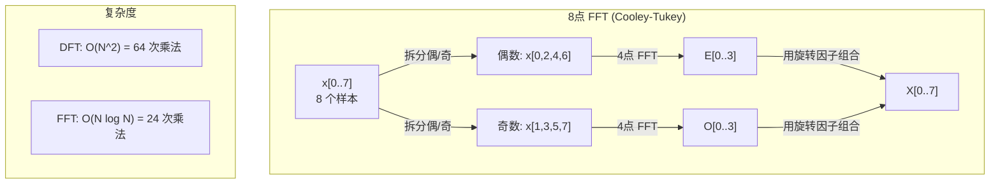
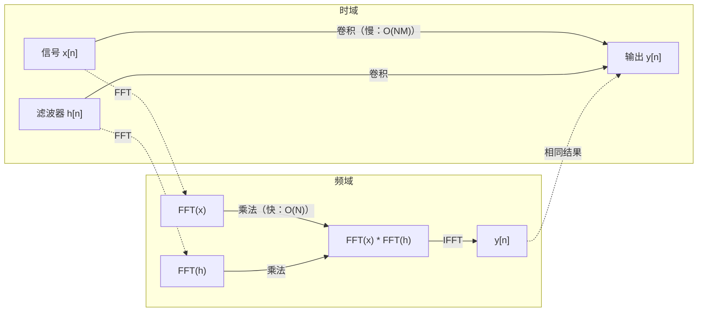

# 傅里叶变换

> 每一个信号都是正弦波的叠加。傅里叶变换告诉你它们各自是什么。

**类型:** Build
**语言:** Python
**先修知识:** Phase 1, Lessons 01-04, 19（复数）
**时间:** 约 90 分钟

## 学习目标

- 从零实现 DFT，并用 O(N log N) 的 Cooley-Tukey FFT 进行验证
- 解读频率系数：从信号中提取振幅、相位和功率谱
- 应用卷积定理，通过 FFT 乘法执行卷积
- 建立傅里叶频域分解与 Transformer 位置编码、CNN 卷积层之间的联系

## 问题背景

一段音频录音是随时间变化的压力测量序列。一只股票的价格是随天数变化的数值序列。一幅图像是在空间上排列的像素强度网格。所有这些都是在时域（或空域）中的数据——你看到的是值随着某个索引而变化。

但许多模式在时域中是不可见的。这段音频信号是一个纯音还是一个和弦？这只股票是否有周周期模式？这张图像是否有重复纹理？这些问题都关乎频率成分，而时域将其隐藏了。

傅里叶变换将数据从时域转换到频域。它把一个信号分解成不同频率的正弦波。每个正弦波都有振幅（强度多大）和相位（从何处开始）。傅里叶变换告诉你两者。

这对机器学习很重要，因为频域思维无处不在。卷积神经网络执行卷积操作，而卷积在频域中等价于乘法。Transformer 的位置编码利用频域分解来表示位置。音频模型（语音识别、音乐生成）在 spectrogram（频谱图）上操作——这是声音的频率表示。时序模型寻找周期性模式。理解傅里叶变换让你拥有与所有这些领域对话的词汇。

## 概念

### DFT 定义

给定 N 个样本 x[0], x[1], ..., x[N-1]，离散傅里叶变换产生 N 个频率系数 X[0], X[1], ..., X[N-1]：

```
X[k] = sum_{n=0}^{N-1} x[n] * e^(-2*pi*i*k*n/N)

for k = 0, 1, ..., N-1
```

每个 X[k] 都是一个复数。其模 |X[k]| 告诉你频率 k 的振幅。其相位 angle(X[k]) 告诉你该频率的相位偏移。

关键洞察：`e^(-2*pi*i*k*n/N)` 是在频率 k 处旋转的相量。DFT 计算信号与 N 个等间隔频率之间的相关性。如果信号在频率 k 处含有能量，相关性就大；否则接近零。

### 每个系数的含义

**X[0]：直流分量。** 这是所有样本的总和——与均值成正比。它代表信号的恒定（零频）偏移。

```
X[0] = sum_{n=0}^{N-1} x[n] * e^0 = 所有样本之和
```

**X[k]（1 <= k <= N/2）：正频率。** X[k] 代表每 N 个样本中 k 个周期的频率。更高的 k 意味着更高的频率（更快的振荡）。

**X[N/2]：奈奎斯特频率。** 用 N 个样本可以表示的最高频率。高于此频率会出现混叠——高频伪装成低频。

**X[k]（N/2 < k < N）：负频率。** 对于实值信号，X[N-k] = conj(X[k])。负频率是正频率的镜像。这就是为什么有用信息在前 N/2 + 1 个系数中。

### 逆 DFT

逆 DFT 从频率系数重建原始信号：

```
x[n] = (1/N) * sum_{k=0}^{N-1} X[k] * e^(2*pi*i*k*n/N)

for n = 0, 1, ..., N-1
```

与前向 DFT 的唯一区别：指数中的符号为正（而非负），并且有一个 1/N 的归一化因子。

逆 DFT 可以实现完美重建。没有任何信息丢失。你可以从时域到频域再回到时域而没有任何误差。DFT 是一种基变换——它在不同的坐标系中重新表达相同的信息。

### FFT：让计算更快

如上定义的 DFT 是 O(N^2) 复杂度：对于 N 个输出系数中的每一个，你需要对 N 个输入样本求和。对于 N = 100 万，那是 10^12 次运算。

快速傅里叶变换（FFT）以 O(N log N) 复杂度计算相同的结果。对于 N = 100 万，大约是 2000 万次运算而不是万亿次。这正是频域分析变得可行的原因。

Cooley-Tukey 算法（最常见的 FFT）通过分治法工作：

1. 将信号拆分为偶数索引和奇数索引样本。
2. 递归计算每个半段的 DFT。
3. 使用"旋转因子" e^(-2*pi*i*k/N) 组合两个半尺寸 DFT。

```
X[k] = E[k] + e^(-2*pi*i*k/N) * O[k]          for k = 0, ..., N/2 - 1
X[k + N/2] = E[k] - e^(-2*pi*i*k/N) * O[k]    for k = 0, ..., N/2 - 1

其中 E = 偶数索引样本的 DFT
      O = 奇数索引样本的 DFT
```

对称性意味着每层递归进行 O(N) 工作，共有 log2(N) 层。总计：O(N log N)。



FFT 要求信号长度为 2 的幂。在实践中，信号会被补零到下一个 2 的幂。

### 频谱分析

**功率谱**是 |X[k]|^2——每个频率系数的模的平方。它显示了每个频率处的能量分布。

**相位谱**是 angle(X[k])——每个频率的相位偏移。对于大多数分析任务，你关心功率谱而忽略相位。

```
频率 k 处的功率:  P[k] = |X[k]|^2 = X[k].real^2 + X[k].imag^2
频率 k 处的相位:  phi[k] = atan2(X[k].imag, X[k].real)
```

### 频率分辨率

DFT 的频率分辨率取决于样本数 N 和采样率 fs。

```
第 k 个 bin 的频率:     f_k = k * fs / N
频率分辨率:            delta_f = fs / N
最高频率:              f_max = fs / 2（奈奎斯特频率）
```

要分辨两个相近的频率，你需要更多的样本。要捕捉高频，你需要更高的采样率。

### 卷积定理

这是信号处理中最重要的结果之一，也与 CNN 直接相关。

**时域中的卷积等于频域中的逐点乘法。**

```
x * h = IFFT(FFT(x) . FFT(h))

其中 * 表示卷积，. 表示逐元素乘法
```

这很重要，因为：

- 两个长度分别为 N 和 M 的信号的直接卷积需要 O(N*M) 次运算。
- 基于 FFT 的卷积只需要 O(N log N)：变换两者、相乘、再变换回来。
- 对于大核，FFT 卷积快得多。
- 这正是大感受野卷积层中发生的事情。

注意：DFT 计算的是循环卷积（信号会绕回）。对于线性卷积（无绕回），在计算前将两个信号补零到长度 N + M - 1。



### 加窗

DFT 假设信号是周期性的——它将 N 个样本视为一个无限重复信号的单个周期。如果信号不是从相同的值开始和结束，这会在边界处产生不连续，表现为虚假的高频成分。这称为频谱泄漏。

加窗通过在计算 DFT 之前将信号在两端衰减到零来减少泄漏。

常见窗函数：

| 窗函数 | 形状 | 主瓣宽度 | 旁瓣电平 | 适用场景 |
|--------|-------|----------------|-----------------|----------|
| 矩形窗 | 平坦（无窗） | 最窄 | 最高 (-13 dB) | 信号恰好在一个 N 样本周期内周期性时 |
| Hann 窗 | 升余弦 | 中等 | 低 (-31 dB) | 通用频谱分析 |
| Hamming 窗 | 修正余弦 | 中等 | 更低 (-42 dB) | 音频处理、语音分析 |
| Blackman 窗 | 三重余弦 | 宽 | 非常低 (-58 dB) | 旁瓣抑制至关重要的情况 |

```
Hann 窗:    w[n] = 0.5 * (1 - cos(2*pi*n / (N-1)))
Hamming 窗: w[n] = 0.54 - 0.46 * cos(2*pi*n / (N-1))
```

通过将窗函数与信号逐元素相乘来应用窗函数，然后再进行 DFT：`X = DFT(x * w)`。

### DFT 性质

| 性质 | 时域 | 频域 |
|----------|-------------|-----------------|
| 线性性 | a*x + b*y | a*X + b*Y |
| 时移 | x[n - k] | X[f] * e^(-2*pi*i*f*k/N) |
| 频移 | x[n] * e^(2*pi*i*f0*n/N) | X[f - f0] |
| 卷积 | x * h | X * H（逐点） |
| 乘法 | x * h（逐点） | X * H（循环卷积，缩放 1/N） |
| 帕塞瓦尔定理 | sum \|x[n]\|^2 | (1/N) * sum \|X[k]\|^2 |
| 共轭对称（实输入） | x[n] 为实数 | X[k] = conj(X[N-k]) |

帕塞瓦尔定理说明总能量在两个域中是相同的。能量在变换过程中守恒。

### 与位置编码的联系

原始 Transformer 使用正弦位置编码：

```
PE(pos, 2i)   = sin(pos / 10000^(2i/d_model))
PE(pos, 2i+1) = cos(pos / 10000^(2i/d_model))
```

每一对维度 (2i, 2i+1) 以不同频率振荡。频率从高频（维度 0,1）到低频（最后几个维度）呈几何分布。这为每个位置在所有频带上提供了独特的模式——类似于傅里叶系数如何唯一标识一个信号。

这提供的关键属性：

- **唯一性：** 没有两个位置具有相同的编码。
- **有界值：** sin 和 cos 始终在 [-1, 1] 范围内。
- **相对位置：** 位置 p+k 的编码可以表示为位置 p 处编码的线性函数。模型可以学习关注相对位置。

### 与 CNN 的联系

卷积层通过将学习到的滤波器（核）滑过信号或图像来应用于输入。从数学上讲，这是卷积操作。

根据卷积定理，这等价于：
1. 对输入做 FFT
2. 对核做 FFT
3. 在频域相乘
4. 对结果做 IFFT

标准 CNN 实现使用直接卷积（对小 3x3 核更快）。但对于大核或全局卷积，基于 FFT 的方法显著更快。一些架构（如 FNet）用 FFT 完全替换注意力机制，以 O(N log N) 而非 O(N^2) 的复杂度达到有竞争力的准确率。

### 频谱图与短时傅里叶变换

单次 FFT 给出整个信号的频率内容，但无法告诉你这些频率何时出现。一个啁啾信号（频率随时间增加）和一个和弦（所有频率同时存在）可以有相同的幅度谱。

短时傅里叶变换（STFT）通过在信号的重叠窗口上计算 FFT 来解决这个问题。结果是一个 spectrogram：在两个轴上分别是时间和频率的 2D 表示。每个点的强度显示该时刻该频率处的能量。

```
STFT 步骤：
1. 选择窗口大小（例如 1024 个样本）
2. 选择步长（例如 256 个样本——75% 重叠）
3. 对于每个窗口位置：
   a. 提取加窗片段
   b. 应用 Hann/Hamming 窗
   c. 计算 FFT
   d. 将幅度谱存储为 spectrogram 的一列
```

频谱图是音频 ML 模型的标准输入表示。语音识别模型（Whisper、DeepSpeech）在 mel 频谱图上操作——频率映射到 mel 刻度的频谱图，这与人类音高感知更匹配。

### 混叠

如果信号包含高于 fs/2（奈奎斯特频率）的频率，以 fs 速率采样将产生混叠副本。一个 90 Hz 的信号以 100 Hz 采样看起来与一个 10 Hz 的信号完全相同。仅从样本来看无法区分它们。

```
示例：
  真实信号：90 Hz 正弦波
  采样率：100 Hz
  表观频率：100 - 90 = 10 Hz

  以 100 Hz 采样率采样的 90 Hz 信号的样本
  与 10 Hz 信号的样本完全相同。
  任何数学方法都无法恢复原始 90 Hz。
```

这就是为什么模数转换器包含抗混叠滤波器，在采样前移除奈奎斯特频率以上的频率。在 ML 中，当在不进行适当低通滤波的情况下对特征图进行下采样时会出现混叠——一些架构通过抗混叠池化层来解决这个问题。

### 补零不会提高分辨率

一个常见的误解：在 FFT 之前对信号补零可以提高频率分辨率。它不能。补零在现有频率 bin 之间进行插值，给你一个更平滑的谱图。但它无法揭示原始样本中不存在的频率细节。

真实的频率分辨率仅取决于观测时间 T = N / fs。要分辨两个相差 delta_f 的频率，你需要至少 T = 1 / delta_f 秒的数据。任何数量的补零都无法改变这个基本限制。

```figure
fourier-synthesis
```

## 动手实现

### 步骤 1：从零实现 DFT

O(N^2) DFT 直接来自定义。

```python
import math

class Complex:
    ...

def dft(x):
    N = len(x)
    result = []
    for k in range(N):
        total = Complex(0, 0)
        for n in range(N):
            angle = -2 * math.pi * k * n / N
            w = Complex(math.cos(angle), math.sin(angle))
            xn = x[n] if isinstance(x[n], Complex) else Complex(x[n])
            total = total + xn * w
        result.append(total)
    return result
```

### 步骤 2：逆 DFT

结构相同，指数为正，除以 N。

```python
def idft(X):
    N = len(X)
    result = []
    for n in range(N):
        total = Complex(0, 0)
        for k in range(N):
            angle = 2 * math.pi * k * n / N
            w = Complex(math.cos(angle), math.sin(angle))
            total = total + X[k] * w
        result.append(Complex(total.real / N, total.imag / N))
    return result
```

### 步骤 3：FFT（Cooley-Tukey）

递归 FFT 要求长度为 2 的幂。拆分为偶数和奇数部分，递归，用旋转因子组合。

```python
def fft(x):
    N = len(x)
    if N <= 1:
        return [x[0] if isinstance(x[0], Complex) else Complex(x[0])]
    if N % 2 != 0:
        return dft(x)

    even = fft([x[i] for i in range(0, N, 2)])
    odd = fft([x[i] for i in range(1, N, 2)])

    result = [Complex(0)] * N
    for k in range(N // 2):
        angle = -2 * math.pi * k / N
        twiddle = Complex(math.cos(angle), math.sin(angle))
        t = twiddle * odd[k]
        result[k] = even[k] + t
        result[k + N // 2] = even[k] - t
    return result
```

### 步骤 4：频谱分析辅助函数

```python
def power_spectrum(X):
    return [xk.real ** 2 + xk.imag ** 2 for xk in X]

def convolve_fft(x, h):
    N = len(x) + len(h) - 1
    padded_N = 1
    while padded_N < N:
        padded_N *= 2

    x_padded = x + [0.0] * (padded_N - len(x))
    h_padded = h + [0.0] * (padded_N - len(h))

    X = fft(x_padded)
    H = fft(h_padded)

    Y = [xk * hk for xk, hk in zip(X, H)]

    y = idft(Y)
    return [y[n].real for n in range(N)]
```

## 实际应用

对于实际工作，使用 numpy 的 FFT，它由高度优化的 C 库支持。

```python
import numpy as np

signal = np.sin(2 * np.pi * 5 * np.arange(256) / 256)
spectrum = np.fft.fft(signal)
freqs = np.fft.fftfreq(256, d=1/256)

power = np.abs(spectrum) ** 2

positive_freqs = freqs[:len(freqs)//2]
positive_power = power[:len(power)//2]
```

对于加窗和更高级的频谱分析：

```python
from scipy.signal import windows, stft

window = windows.hann(256)
windowed = signal * window
spectrum = np.fft.fft(windowed)
```

对于卷积：

```python
from scipy.signal import fftconvolve

result = fftconvolve(signal, kernel, mode='full')
```

对于频谱图：

```python
from scipy.signal import stft

frequencies, times, Zxx = stft(signal, fs=sample_rate, nperseg=256)
spectrogram = np.abs(Zxx) ** 2
```

频谱图矩阵的形状为 (n_frequencies, n_time_frames)。每一列是单个时间窗口的功率谱。这就是音频 ML 模型消费的输入。

## 交付

运行 `code/fourier.py` 生成 `outputs/prompt-spectral-analyzer.md`。

## 练习

1. **纯音识别。** 创建一个单频正弦波信号，频率在 1 到 50 Hz 之间未知，以 128 Hz 采样 1 秒。使用你的 DFT 识别频率。验证答案是否正确。现在添加标准差为 0.5 的高斯噪声并重复。噪声如何影响频谱？

2. **FFT vs DFT 验证。** 生成长度为 64 的随机信号。分别计算 DFT（O(N^2)）和 FFT。验证所有系数的匹配精度在 1e-10 以内。在长度为 256、512、1024 和 2048 的信号上测试两个函数的运行时间。绘制 DFT 时间与 FFT 时间的比值图。

3. **通过示例证明卷积定理。** 创建信号 x = [1, 2, 3, 4, 0, 0, 0, 0] 和滤波器 h = [1, 1, 1, 0, 0, 0, 0, 0]。直接用嵌套循环计算它们的循环卷积。然后通过 FFT（变换、相乘、逆变换）计算。验证结果匹配。现在通过适当补零进行线性卷积。

4. **加窗效果。** 创建一个由 10 Hz 和 12 Hz 两个正弦波叠加而成的信号（非常接近）。以 128 Hz 采样 1 秒。分别在不加窗、Hann 窗和 Hamming 窗的情况下计算功率谱。哪个窗函数最容易区分两个峰值？为什么？

5. **位置编码分析。** 生成 d_model = 128 和 max_pos = 512 的正弦位置编码。对于每对位置 (p1, p2)，计算它们编码的点积。证明点积只取决于 |p1 - p2|，而与绝对位置无关。随着距离增加，点积会怎样变化？

## 关键术语

| 术语 | 含义 |
|------|---------------|
| DFT（离散傅里叶变换） | 将 N 个时域样本转换为 N 个频域系数。每个系数是与该频率复正弦波的相关性 |
| FFT（快速傅里叶变换） | 计算 DFT 的 O(N log N) 算法。Cooley-Tukey 算法递归拆分偶数/奇数索引 |
| 逆 DFT | 从频率系数重建时域信号。公式与 DFT 相同，只是指数符号翻转并乘以 1/N |
| 频率 bin | DFT 输出的每个索引 k 代表频率 k*fs/N Hz。"bin" 是离散的频率槽 |
| DC 分量 | X[0]，零频系数。与信号均值成正比 |
| 奈奎斯特频率 | fs/2，在采样率 fs 下可表示的最高频率。高于此频率会发生混叠 |
| 功率谱 | \|X[k]\|^2，每个频率系数的模的平方。显示频率间的能量分布 |
| 相位谱 | angle(X[k])，每个频率分量的相位偏移。分析中常被忽略 |
| 频谱泄漏 | 将非周期信号视为周期信号时产生的虚假频率成分。通过加窗减少 |
| 窗函数 | 在 DFT 前应用的衰减函数（Hann、Hamming、Blackman），用于减少频谱泄漏 |
| 旋转因子 | 复指数 e^(-2*pi*i*k/N)，用于在 FFT 蝶形计算中组合子 DFT |
| 卷积定理 | 时域卷积等于频域逐点乘法。对信号处理和 CNN 至关重要 |
| 循环卷积 | 信号绕回的卷积。这是 DFT 自然计算的结果 |
| 线性卷积 | 无绕回的标准卷积。通过 DFT 前补零实现 |
| 帕塞瓦尔定理 | 总能量通过傅里叶变换守恒。sum \|x[n]\|^2 = (1/N) sum \|X[k]\|^2 |
| 混叠 | 高于奈奎斯特的频率因采样率不足而表现为低频 |

## 延伸阅读

- [Cooley & Tukey：用于机器计算复傅里叶级数的算法 (1965)](https://www.ams.org/journals/mcom/1965-19-090/S0025-5718-1965-0178586-1/) —— 改变了计算方式的原始 FFT 论文
- [3Blue1Brown：傅里叶变换到底是什么？](https://www.youtube.com/watch?v=spUNpyF58BY) —— 最好的傅里叶变换可视化入门
- [Lee-Thorp 等：FNet：用傅里叶变换混合 Token (2021)](https://arxiv.org/abs/2105.03824) —— 在 Transformer 中用 FFT 替换自注意力
- [Smith：科学家和工程师的数字信号处理指南](http://www.dspguide.com/) —— 免费在线教材，深入覆盖 FFT、加窗和频谱分析
- [Vaswani 等：Attention Is All You Need (2017)](https://arxiv.org/abs/1706.03762) —— 从傅里叶频域分解推导出的正弦位置编码
- [Radford 等：Whisper (2022)](https://arxiv.org/abs/2212.04356) —— 使用 mel 频谱图作为输入表示的语音识别
