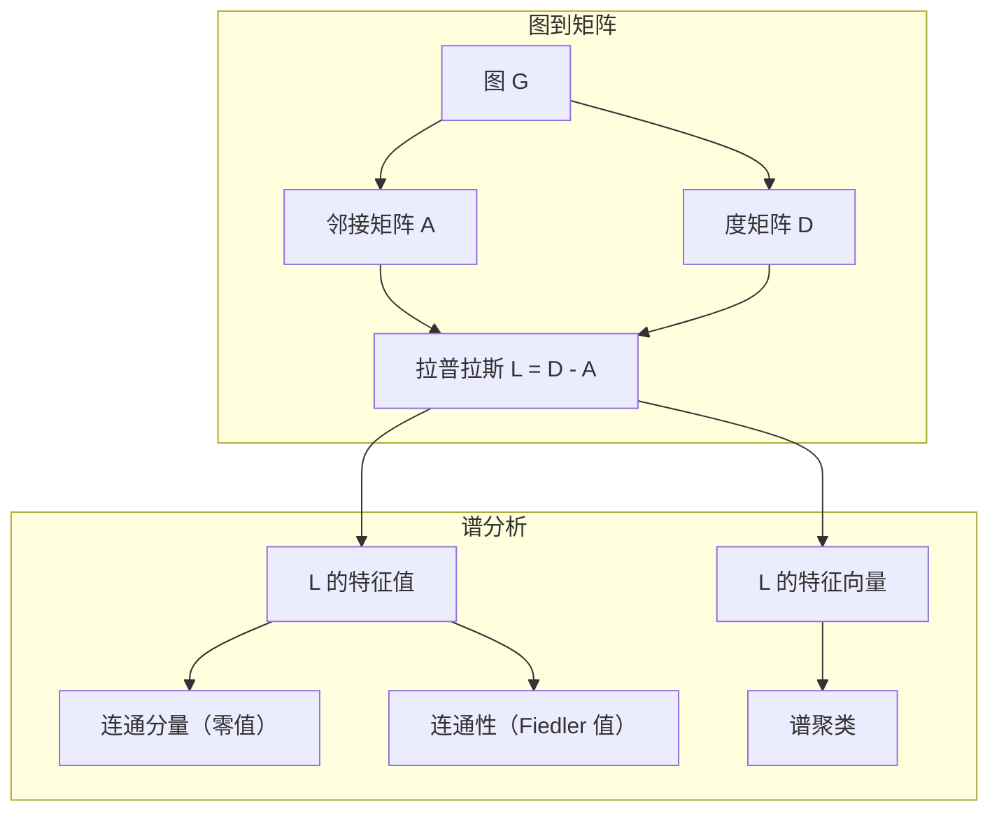
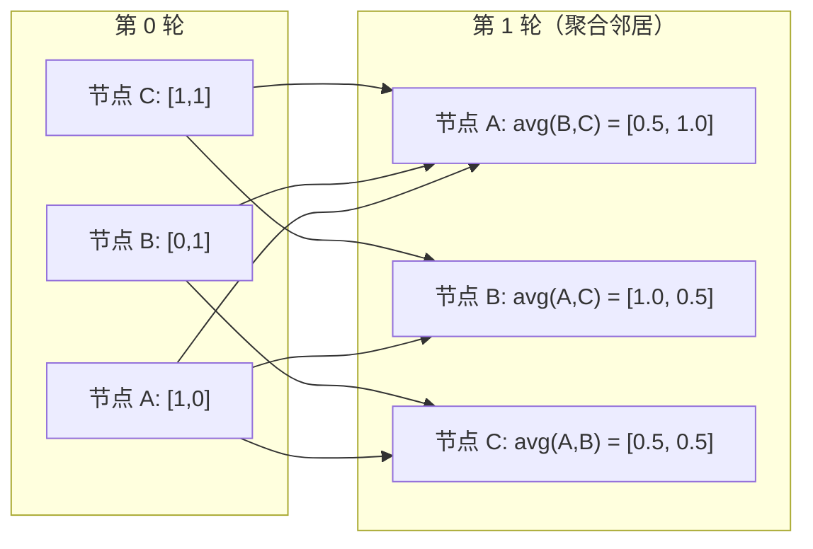

# 机器学习中的图论

> 图是关系型数据结构。如果你的数据存在关联，就需要图论。

**类型：** 构建
**语言：** Python
**前置知识：** 第 1 阶段，课程 01-03（线性代数、矩阵）
**时间：** 约 90 分钟

## 学习目标

- 构建一个包含邻接矩阵/邻接表表示的图类，并实现 BFS 和 DFS 遍历算法
- 计算图拉普拉斯矩阵，并利用其特征值检测连通分量和聚类节点
- 实现一轮 GNN 风格的消息传递（作为归一化邻接矩阵乘法）
- 使用 Fiedler 向量通过谱聚类对图进行划分

## 问题背景

社交网络、分子结构、知识库、引用网络、道路地图——全都是图。传统机器学习将数据视为扁平表格。每一行独立存在，每个特征是列。但当连接结构本身至关重要时，表格就失效了。

考虑一个社交网络。你想预测用户会购买什么产品。他们的购买历史很重要。但朋友们的购买历史更重要。连接中蕴含信号。

或者考虑一个分子。你想预测它是否能与蛋白质结合。原子很重要，但真正重要的是原子之间的键合方式。结构就是数据。

图神经网络（GNN）是深度学习发展最快的领域。它们赋能药物发现、社交推荐、欺诈检测和知识图谱推理。每个 GNN 都建立在同一个基础之上：基本图论。

你需要四样东西：
1. 一种将图表示为矩阵的方法（以便进行矩阵乘法）
2. 遍历算法来探索图结构
3. 拉普拉斯矩阵——谱图理论中最重要的一阶矩阵
4. 消息传递——让 GNN 工作的核心操作

## 核心概念

### 图：节点与边

图 $G = (V, E)$ 由顶点（节点）$V$ 和边 $E$ 组成。每条边连接两个节点。

**有向图与无向图。** 在无向图中，边 $(u, v)$ 意味着 $u$ 连接到 $v$ 且 $v$ 也连接到 $u$。在有向图（digraph）中，边 $(u, v)$ 意味着 $u$ 指向 $v$，但不一定反向。

**带权图与无权图。** 在无权图中，边要么存在要么不存在。在带权图中，每条边都有一个数值权重——距离、代价、强度等。

| 图类型 | 示例 |
|-----------|---------|
| 无向、无权 | Facebook 好友网络 |
| 有向、无权 | Twitter 关注网络 |
| 无向、有权 | 道路地图（距离） |
| 有向、有权 | 网页链接（PageRank 权重） |

### 邻接矩阵

邻接矩阵 $A$ 是核心表示方法。对于一个包含 $n$ 个节点的图：

```
A[i][j] = 1    如果存在从节点 i 到节点 j 的边
A[i][j] = 0    否则
```

对于无向图，$A$ 是对称的：$A[i][j] = A[j][i]$。对于带权图，$A[i][j] =$ 边 $(i, j)$ 的权重。

**示例——三角形：**

```
节点：0, 1, 2
边：(0,1), (1,2), (0,2)

A = [[0, 1, 1],
     [1, 0, 1],
     [1, 1, 0]]
```

邻接矩阵是每个 GNN 的输入。对 $A$ 进行的矩阵运算对应于对图的操作。

### 度

节点的度是与它相连的边的数量。对于有向图，你有入度（流入的边）和出度（流出的边）。

度矩阵 $D$ 是对角矩阵：

```
D[i][i] = 节点 i 的度
D[i][j] = 0    当 i != j 时
```

对于三角形示例：$D = \text{diag}(2, 2, 2)$，因为每个节点都连接到其他两个节点。

度反映了节点的重要性。高度数 = 枢纽节点。网络的度分布揭示了其结构。社交网络遵循幂律（少数枢纽节点，大量叶子节点）。随机图的度服从泊松分布。

### BFS 和 DFS

两种基本的图遍历算法。两者都需要掌握。

**广度优先搜索（BFS）：** 先探索所有邻居，再探索邻居的邻居。使用队列（FIFO）。

```
从节点 0 开始的 BFS：
  访问 0
  队列：[1, 2]        （0 的邻居）
  访问 1
  队列：[2, 3]        （添加 1 的邻居）
  访问 2
  队列：[3]           （2 的邻居已访问过）
  访问 3
  队列：[]            （完成）
```

BFS 能在无权图中找到最短路径。从起点到任意节点的距离等于该节点首次被发现时的 BFS 层级。这就是为什么 BFS 被用于社交网络中的跳数距离计算。

**深度优先搜索（DFS）：** 尽可能深入后再回溯。使用栈（LIFO）或递归。

```
从节点 0 开始的 DFS：
  访问 0
  栈：[1, 2]         （0 的邻居）
  访问 2               （从栈弹出）
  栈：[1, 3]          （添加 2 的邻居）
  访问 3               （从栈弹出）
  栈：[1]
  访问 1               （从栈弹出）
  栈：[]              （完成）
```

DFS 适用于：
- 查找连通分量（从未访问节点运行 DFS）
- 环检测（DFS 树中的后向边）
- 拓扑排序（DFS 完成顺序的逆序）

| 算法 | 数据结构 | 用途 | 适用场景 |
|-----------|---------------|-------|----------|
| BFS | 队列 | 最短路径 | 社交网络距离、知识图谱遍历 |
| DFS | 栈 | 连通分量、环 | 连通性、拓扑排序 |

### 图拉普拉斯矩阵

$L = D - A$。谱图理论中最重要的一阶矩阵。

对于三角形：

```
D = [[2, 0, 0],    A = [[0, 1, 1],    L = [[2, -1, -1],
     [0, 2, 0],         [1, 0, 1],         [-1, 2, -1],
     [0, 0, 2]]         [1, 1, 0]]         [-1, -1,  2]]
```

拉普拉斯矩阵具有如下显著性质：

1. **$L$ 是正半定的。** 所有特征值都 $\ge 0$。

2. **零特征值的数量等于连通分量的数量。** 连通图恰好有一个零特征值。具有 3 个不连通分量的图有三个零特征值。

3. **最小的非零特征值（Fiedler 值）衡量连通性。** 较大的 Fiedler 值意味着图连接良好。较小的 Fiedler 值意味着图存在薄弱点——瓶颈。

4. **Fiedler 值的特征向量（Fiedler 向量）揭示了最佳分割方式。** 正值节点归入一组，负值节点归入另一组。这就是谱聚类。



### 谱性质

邻接矩阵和拉普拉斯矩阵的特征值无需任何遍历即可揭示结构属性。

**谱聚类**的工作原理如下：
1. 计算拉普拉斯矩阵 $L$
2. 找到 $L$ 的 $k$ 个最小特征向量（跳过第一个，对于连通图它是全一向量）
3. 将这些特征向量作为每个节点的新坐标
4. 在这些坐标上运行 k-means

为什么这能工作？$L$ 的特征向量编码了图上"最平滑"的函数。连接良好的节点具有相似的特征向量值。被瓶颈分隔的节点具有不同的值。特征向量自然地分离出聚类。

**随机游走关联。** 归一化拉普拉斯矩阵与图上的随机游走相关。随机游走的平稳分布与节点度成正比。混合时间（游走收敛的速度）取决于谱间隙。

### 消息传递

图神经网络的核心操作。每个节点从其邻居收集消息，聚合它们，并更新自身状态。

```
h_v^(k+1) = UPDATE(h_v^(k), AGGREGATE({h_u^(k) : u ∈ neighbors(v)}))
```

在最简单的形式中，AGGREGATE = 均值，UPDATE = 线性变换 + 激活函数：

```
h_v^(k+1) = σ(W * mean({h_u^(k) : u ∈ neighbors(v)}))
```

这实质上是矩阵乘法。如果 $H$ 是所有节点特征的矩阵，$A$ 是邻接矩阵：

```
H^(k+1) = σ(A_norm * H^(k) * W)
```

其中 $A\_norm$ 是归一化邻接矩阵（每行求和为 1）。

一轮消息传递让每个节点"看到"其直接邻居。两轮让它看到邻居的邻居。$K$ 轮给每个节点提供来自其 $K$-跳邻域的信息。



### 概念与 ML 应用

| 概念 | ML 应用 |
|---------|---------------|
| 邻接矩阵 | GNN 输入表示 |
| 图拉普拉斯 | 谱聚类、社区检测 |
| BFS/DFS | 知识图谱遍历、路径查找 |
| 度分布 | 节点重要性、特征工程 |
| 消息传递 | GNN 层（GCN、GAT、GraphSAGE） |
| $L$ 的特征值 | 社区检测、图划分 |
| 谱聚类 | 无监督节点分组 |
| PageRank | 节点重要性、网页搜索 |

```figure
graph-degree-distribution
```

## 动手构建

### 第 1 步：从零实现 Graph 类

```python
class Graph:
    def __init__(self, n_nodes, directed=False):
        self.n = n_nodes
        self.directed = directed
        self.adj = {i: {} for i in range(n_nodes)}

    def add_edge(self, u, v, weight=1.0):
        self.adj[u][v] = weight
        if not self.directed:
            self.adj[v][u] = weight

    def neighbors(self, node):
        return list(self.adj[node].keys())

    def degree(self, node):
        return len(self.adj[node])

    def adjacency_matrix(self):
        import numpy as np
        A = np.zeros((self.n, self.n))
        for u in range(self.n):
            for v, w in self.adj[u].items():
                A[u][v] = w
        return A

    def degree_matrix(self):
        import numpy as np
        D = np.zeros((self.n, self.n))
        for i in range(self.n):
            D[i][i] = self.degree(i)
        return D

    def laplacian(self):
        return self.degree_matrix() - self.adjacency_matrix()
```

邻接表（`self.adj`）高效存储邻居信息。邻接矩阵转换使用 numpy，因为所有谱操作都需要它。

### 第 2 步：BFS 和 DFS

```python
from collections import deque

def bfs(graph, start):
    visited = set()
    order = []
    distances = {}
    queue = deque([(start, 0)])
    visited.add(start)
    while queue:
        node, dist = queue.popleft()
        order.append(node)
        distances[node] = dist
        for neighbor in graph.neighbors(node):
            if neighbor not in visited:
                visited.add(neighbor)
                queue.append((neighbor, dist + 1))
    return order, distances


def dfs(graph, start):
    visited = set()
    order = []
    stack = [start]
    while stack:
        node = stack.pop()
        if node in visited:
            continue
        visited.add(node)
        order.append(node)
        for neighbor in reversed(graph.neighbors(node)):
            if neighbor not in visited:
                stack.append(neighbor)
    return order
```

BFS 使用双端队列（deque）以实现 O(1) 的 popleft。DFS 使用列表作为栈。两者都以 O(V + E) 的时间复杂度恰好访问每个节点一次。

### 第 3 步：连通分量与拉普拉斯特征值

```python
def connected_components(graph):
    visited = set()
    components = []
    for node in range(graph.n):
        if node not in visited:
            order, _ = bfs(graph, node)
            visited.update(order)
            components.append(order)
    return components


def laplacian_eigenvalues(graph):
    import numpy as np
    L = graph.laplacian()
    eigenvalues = np.linalg.eigvalsh(L)
    return eigenvalues
```

`eigvalsh` 专用于对称矩阵——对于无向图，拉普拉斯矩阵总是对称的。它以升序返回特征值。统计零值的数量即可找到连通分量的数量。

### 第 4 步：谱聚类

```python
def spectral_clustering(graph, k=2):
    import numpy as np
    L = graph.laplacian()
    eigenvalues, eigenvectors = np.linalg.eigh(L)
    features = eigenvectors[:, 1:k+1]

    labels = np.zeros(graph.n, dtype=int)
    for i in range(graph.n):
        if features[i, 0] >= 0:
            labels[i] = 0
        else:
            labels[i] = 1
    return labels
```

对于 $k=2$，Fiedler 向量的符号将图划分为两个聚类。对于 $k>2$，你会在前 $k$ 个特征向量（排除平凡的全一向量）上运行 k-means。

### 第 5 步：消息传递

```python
def message_passing(graph, features, weight_matrix):
    import numpy as np
    A = graph.adjacency_matrix()
    row_sums = A.sum(axis=1, keepdims=True)
    row_sums[row_sums == 0] = 1
    A_norm = A / row_sums
    aggregated = A_norm @ features
    output = aggregated @ weight_matrix
    return output
```

这是一轮 GNN 消息传递。每个节点的新特征是其邻居特征的加权平均，再经权重矩阵变换。堆叠多轮以实现信息进一步传播。

## 实际应用

借助 networkx 和 numpy，相同的操作可以写成一行的形式：

```python
import networkx as nx
import numpy as np

G = nx.karate_club_graph()

A = nx.adjacency_matrix(G).toarray()
L = nx.laplacian_matrix(G).toarray()

eigenvalues = np.linalg.eigvalsh(L.astype(float))
print(f"最小特征值: {eigenvalues[:5]}")
print(f"连通分量数: {nx.number_connected_components(G)}")

communities = nx.community.greedy_modularity_communities(G)
print(f"找到的社区数: {len(communities)}")

pr = nx.pagerank(G)
top_nodes = sorted(pr.items(), key=lambda x: x[1], reverse=True)[:5]
print(f"PageRank 前 5 节点: {top_nodes}")
```

networkx 以优化的 C 后端处理任意规模的图。生产环境中使用它。用从零开始实现的版本来理解它的内部机制。

### numpy 谱分析

```python
import numpy as np

A = np.array([
    [0, 1, 1, 0, 0],
    [1, 0, 1, 0, 0],
    [1, 1, 0, 1, 0],
    [0, 0, 1, 0, 1],
    [0, 0, 0, 1, 0]
])

D = np.diag(A.sum(axis=1))
L = D - A

eigenvalues, eigenvectors = np.linalg.eigh(L)
print(f"特征值: {np.round(eigenvalues, 4)}")
print(f"Fiedler 值: {eigenvalues[1]:.4f}")
print(f"Fiedler 向量: {np.round(eigenvectors[:, 1], 4)}")

fiedler = eigenvectors[:, 1]
group_a = np.where(fiedler >= 0)[0]
group_b = np.where(fiedler < 0)[0]
print(f"聚类 A: {group_a}")
print(f"聚类 B: {group_b}")
```

Fiedler 向量承担主要工作。正值条目在一个聚类，负值在另一个。无需迭代优化——只需一次特征分解。

## 交付成果

本课程产出：
- `outputs/skill-graph-analysis.md` —— 分析图结构数据的手册

## 关联知识

| 概念 | 出现位置 |
|---------|---------------|
| 邻接矩阵 | GCN、GAT、GraphSAGE 输入 |
| 拉普拉斯 | 谱聚类、ChebNet 滤波器 |
| BFS | 知识图谱遍历、最短路径查询 |
| 消息传递 | 每个 GNN 层、神经消息传递 |
| 谱间隙 | 图连通性、随机游走的混合时间 |
| 度分布 | 幂律网络、节点特征工程 |
| 连通分量 | 预处理、处理不连通图 |
| PageRank | 节点重要性排序、注意力初始化 |

GNN 值得特别提及。GCN（Kipf & Welling, 2017）中的图卷积运算使用添加了自环的邻接矩阵，$A\_hat = A + I$：

```text
H^(l+1) = σ(D_hat^(-1/2) * A_hat * D_hat^(-1/2) * H^(l) * W^(l))
```

其中 $A\_hat = A + I$（邻接矩阵加自环），$D\_hat$ 是 $A\_hat$ 的度矩阵。自环确保每个节点在聚合时包含自身的特征。这正是带有对称归一化的消息传递。$D\_hat^(-1/2) * A\_hat * D\_hat^(-1/2)$ 是归一化邻接矩阵。拉普拉斯矩阵之所以出现，是因为此归一化与 $L\_sym = I - D^(-1/2) * A * D^(-1/2)$ 相关。理解拉普拉斯矩阵意味着理解 GCN 为何能工作。

## 练习

1. **从零实现 PageRank。** 从均匀分数开始。每一步：$score(v) = (1-d)/n + d * \sum(score(u)/out\_degree(u))$ 对所有指向 $v$ 的 $u$ 求和。使用 $d=0.85$。运行至收敛（变化量 $< 1e-6$）。在小型网页图上测试。

2. **使用谱聚类发现社区。** 创建一个具有两个明显分离聚类（例如，两个完全图通过一条边连接）的图。运行谱聚类并验证其能找到正确分割。随着跨聚类边的增加会发生什么？

3. **实现 Dijkstra 算法** 用于加权图的最短路径。与同一图（统一权重）上的 BFS 结果进行比较。

4. **构建 2 层消息传递网络。** 使用不同的权重矩阵执行两次消息传递。证明经过 2 轮后，每个节点获得了来自其 2-跳邻域的信息。

5. **分析真实世界图。** 使用 Karate Club 图（34 个节点，78 条边）。计算度分布、拉普拉斯特征值和谱聚类。将谱聚类结果与已知的真实分割进行比较。

## 关键术语

| 术语 | 人们常说 | 实际含义 |
|------|----------------|----------------------|
| 图 | "节点和边" | 一种编码成对关系的数学结构 $G=(V,E)$ |
| 邻接矩阵 | "连接表" | 一个 $n \times n$ 矩阵，其中 $A[i][j] = 1$ 当且仅当节点 $i$ 和 $j$ 相连 |
| 度 | "节点的连接程度" | 与该节点相连的边的数量 |
| 拉普拉斯 | "D 减 A" | $L = D - A$，其特征值揭示图结构的矩阵 |
| Fiedler 值 | "代数连通度" | $L$ 的最小非零特征值，衡量图的连通程度 |
| BFS | "逐层搜索" | 在深入之前访问所有邻居的遍历方式，用于找最短路径 |
| DFS | "先深入" | 沿一条路径走到尽头再回溯的遍历方式 |
| 消息传递 | "节点与邻居交流" | 每个节点聚合其邻居的信息，这是 GNN 的核心 |
| 谱聚类 | "按特征向量聚类" | 利用拉普拉斯矩阵的特征向量对图进行划分 |
| 连通分量 | "独立的一块" | 一个极大子图，其中任意节点可达任何其他节点 |

## 延伸阅读

- **Kipf & Welling (2017)** ——《使用图卷积网络的半监督分类》。开启现代 GNN 的论文。表明谱图卷积可简化为消息传递。
- **Spielman (2012)** ——《谱图理论》讲义。拉普拉斯矩阵、谱间隙和图划分的权威入门。
- **Hamilton (2020)** ——《图表示学习》。从基础到应用的 GNN 专著。
- **Bronstein et al. (2021)** ——《几何深度学习：网格、群、图、测地线与规范》。统一框架论文。
- **Veličković et al. (2018)** ——《图注意力网络》。通过注意力机制扩展消息传递。
