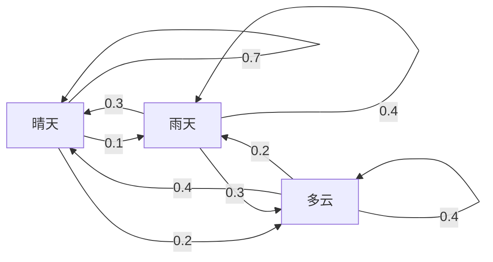
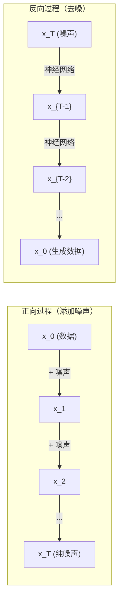

# 随机过程

> 有结构的随机性。随机游走、马尔可夫链和扩散模型背后的数学。

**类型：** 学习
**语言：** Python
**前置知识：** 第一阶段，第 06-07 课（概率论、贝叶斯）
**时间：** 约 75 分钟

## 学习目标

- 模拟一维和二维随机游走，验证位移的 sqrt(n) 缩放规律
- 构建马尔可夫链模拟器，并通过特征分解计算其平稳分布
- 实现 Metropolis-Hastings MCMC 和 Langevin 动力学，用于从目标分布中采样
- 建立正向扩散过程与布朗运动之间的联系，并解释反向过程如何生成数据

## 问题

许多 AI 系统涉及随时间演化的随机性。不是静态随机性——而是具有结构的、序列化的随机性，其中每一步都依赖于之前发生的过程。

语言模型一次生成一个 token。每个 token 取决于之前的上下文。模型输出一个概率分布，从中采样，然后继续。这就是一个随机过程。

扩散模型逐步向图像添加噪声，直到它变成纯静电噪声。然后逆转这个过程，逐步去除噪声，直到新图像出现。正向过程是一个马尔可夫链。反向过程是一个学习到的逆向运行的马尔可夫链。

强化学习智能体在环境中采取行动。每个行动都以一定的概率导致新状态。智能体在随机世界中遵循随机策略。整个过程是一个马尔可夫决策过程。

MCMC 采样——贝叶斯推断的支柱——构建一个其平稳分布是我们希望从中采样的后验分布的马尔可夫链。

所有这些都在四个基础概念之上建立：
1. 随机游走——最简单的随机过程
2. 马尔可夫链——具有转移矩阵的结构化随机性
3. Langevin 动力学——带噪声的梯度下降
4. Metropolis-Hastings——从任意分布中采样

## 概念

### 随机游走

从位置 0 开始。每步掷一枚公平的硬币。正面：向右移动（+1）。反面：向左移动（-1）。

经过 n 步后，你的位置是 n 个随机 +/-1 值之和。期望位置为 0（游说是无偏的）。但从原点到预期距离随 sqrt(n) 增长。

这很反直觉。游走是公平的——没有偏向任一方向的漂移。但随着时间推移，它会离起点越来越远。n 步后的标准差为 sqrt(n)。

```
第 0 步：位置 = 0
第 1 步：位置 = +1 或 -1
第 2 步：位置 = +2、0 或 -2
...
第 100 步：距离原点期望距离 ~ 10（sqrt(100)）
第 10000 步：距离原点期望距离 ~ 100（sqrt(10000)）
```

**在二维中**，游走以相等的概率向上、向下、向左或向右移动。到原点的距离同样遵循 sqrt(n) 缩放。路径呈现出类似分形的图案。

**为什么是 sqrt(n)？** 每步是等概率的 +1 或 -1。经过 n 步后，位置 S_n = X_1 + X_2 + ... + X_n，其中每个 X_i 是 +/-1。每步的方差为 1，且步之间相互独立，因此 Var(S_n) = n。标准差 = sqrt(n)。由中心极限定理，S_n / sqrt(n) 收敛到标准正态分布。

这种 sqrt(n) 缩放在机器学习中无处不在。SGD 噪声按 1/sqrt(批次大小) 缩放。嵌入维度按 sqrt(d) 缩放。平方根是独立随机累加的标志性特征。

**与布朗运动的联系。** 取步长为 1/sqrt(n)、单位时间内有 n 步的随机游走。当 n 趋于无穷大时，游走收敛到布朗运动 B(t)——一个连续时间过程，其中 B(t) 是均值为 0、方差为 t 的正态分布。

布朗运动是扩散的数学基础。它模拟了流体中粒子的随机抖动、股票价格的波动，以及——关键在于——扩散模型中的噪声过程。

**赌徒破产。** 从位置 k 开始的随机游走者，在 0 和 N 处有吸收壁。在到达 0 之前到达 N 的概率是多少？对于公平游走：P(到达 N) = k/N。这非常简单优美。它与鞅论有关——公平随机游走是一个鞅（期望未来价值 = 当前价值）。

### 马尔可夫链

马尔可夫链是一个根据固定概率在不同状态之间转换的系统。关键特性：下一步状态仅取决于当前状态，而不依赖于历史。

```
P(X_{t+1} = j | X_t = i, X_{t-1} = ...) = P(X_{t+1} = j | X_t = i)
```

这是马尔可夫性质。它意味着你可以用转移矩阵 P 描述整个动态：

```
P[i][j] = 从状态 i 转移到状态 j 的概率
```

P 的每一行之和为 1（你必须去往某处）。

**示例——天气：**

```
状态：晴天 (0)、雨天 (1)、多云 (2)

P = [[0.7, 0.1, 0.2],    (如果是晴天: 70% 晴天, 10% 雨天, 20% 多云)
     [0.3, 0.4, 0.3],    (如果是雨天: 30% 晴天, 40% 雨天, 30% 多云)
     [0.4, 0.2, 0.4]]    (如果是多云: 40% 晴天, 20% 雨天, 40% 多云)
```

从任何状态开始。经过多次转换后，状态的分布收敛到平稳分布 pi，满足 pi * P = pi。这是 P 对应特征值 1 的左特征向量。

对于天气链，平稳分布为 [0.55, 0.18, 0.27]——从长远来看，无论起始状态如何，晴天占 55% 的时间。



**计算平稳分布。** 有两种方法：

1. **幂迭代法**：将任意初始分布反复乘以 P。经过足够多的迭代后，它会收敛。
2. **特征值法**：找到 P 对应特征值 1 的左特征向量。即 P^T 对应特征值 1 的特征向量。

两种方法都需要链满足收敛条件。

**收敛条件。** 如果马尔可夫链满足以下条件，则收敛到唯一的平稳分布：
- **不可约**：每个状态都从其他所有状态可达
- **非周期**：链不以任何固定周期循环

你在机器学习中遇到的大多数链都满足这两个条件。

**吸收状态。** 如果一个状态一旦进入就永远不会离开（P[i][i] = 1），则该状态是吸收状态。吸收马尔可夫链建模了具有终止状态的过程——一局结束的游戏、流失的客户、到达文本结束 token 的词序列。

**混合时间。** 需要多少步才能让链"接近"平稳分布？正式地，是指总变差距离低于某个阈值所需的步数。快速混合 = 需要较少步数。P 的谱间隙（1 减去第二大特征值）控制混合时间。间隙越大 = 混合越快。

### 与语言模型的联系

语言模型中的 token 生成近似于马尔可夫过程。给定当前上下文，模型输出下一个 token 的分布。温度控制尖锐程度：

```
P(token_i) = exp(logit_i / 温度) / sum(exp(logit_j / 温度))
```

- 温度 = 1.0：标准分布
- 温度 < 1.0：更尖锐（更确定）
- 温度 > 1.0：更平坦（更随机）
- 温度 -> 0：argmax（贪婪）

Top-k 采样截断为概率最高的 k 个 token。Top-p（核）采样截断为满足累积概率超过 p 的最小 token 集。两者都修改了马尔可夫转移概率。

### 布朗运动

随机游走的连续时间极限。位置 B(t) 具有三个属性：
1. B(0) = 0
2. B(t) - B(s) 服从均值为 0、方差为 t - s 的正态分布（对于 t > s）
3. 在不相交区间上的增量是独立的

布朗运动是连续的但在任何点都不可微——它在每个尺度上都在抖动。路径在平面中的分形维度为 2。

在离散模拟中，你通过以下方式近似布朗运动：

```
B(t + dt) = B(t) + sqrt(dt) * z，其中 z ~ N(0, 1)
```

sqrt(dt) 的缩放很重要。它来自应用于随机游走的中心极限定理。

### Langevin 动力学

梯度下降寻找函数的最小值。Langevin 动力学寻找与 exp(-U(x)/T) 成正比的概率分布，其中 U 是能量函数，T 是温度。

```
x_{t+1} = x_t - dt * gradient(U(x_t)) + sqrt(2 * T * dt) * z_t
```

两个力作用在粒子上：
1. **梯度力** (-dt * gradient(U))：推向低能量区域（类似梯度下降）
2. **随机力** (sqrt(2*T*dt) * z)：推向随机方向（探索）

在温度 T = 0 时，这是纯梯度下降。在高温下，它几乎是随机游走。在合适的温度下，粒子探索能量景观并在低能量区域花更多时间。

**与扩散模型的联系。** 扩散模型的正向过程为：

```
x_t = sqrt(alpha_t) * x_{t-1} + sqrt(1 - alpha_t) * 噪声
```

这是一个逐渐将数据与噪声混合的马尔可夫链。经过足够多的步数后，x_T 变为纯高斯噪声。

反向过程——从噪声回到数据——也是一个马尔可夫链，但其转移概率由神经网络学习。网络学习预测在每步中添加的噪声，然后减去它。



### MCMC：马尔可夫链蒙特卡洛

有时你需要从一个分布 p(x) 中采样，该分布你可以评估（直到一个常数）但不能直接从中采样。贝叶斯后验是经典例子——你知道似然乘以先验，但归一化常数是难以处理的。

**Metropolis-Hastings** 构建一个平稳分布为 p(x) 的马尔可夫链：

1. 从某个位置 x 开始
2. 从建议分布 Q(x'|x) 提出一个新位置 x'
3. 计算接受比率：a = p(x') * Q(x|x') / (p(x) * Q(x'|x))
4. 以概率 min(1, a) 接受 x'。否则留在 x。
5. 重复。

如果 Q 是对称的（例如 Q(x'|x) = Q(x|x') = N(x, sigma^2)），比率简化为 a = p(x') / p(x)。你只需要概率的比率——归一化常数会消去。

在温和条件下，链保证收敛到 p(x)。但如果建议太小（随机游走）或太大（高拒绝率），收敛可能很慢。调整建议是 MCMC 的艺术。

**为什么有效。** 接受比率确保细致平衡：处于 x 并移动到 x' 的概率等于处于 x' 并移动到 x 的概率。细致平衡意味着 p(x) 是链的平稳分布。因此经过足够多的步数后，样本来自 p(x)。

**实际考虑：**
- **Burn-in（预热）**：丢弃前 N 个样本。链需要时间从其起始点到达平稳分布。
- **Thinning（稀疏化）**：每 k 个样本保留一个以减少自相关。
- **多条链**：从不同起始点运行多条链。如果它们收敛到相同分布，则证明收敛。
- **接受率**：对于 d 维的高斯建议，最优接受率约为 23%（Roberts & Rosenthal，2001）。太高意味着链几乎不动。太低意味着它拒绝了所有样本。

### 随机过程在 AI 中的应用

| 过程 | AI 应用 |
|------|---------|
| 随机游走 | RL 中的探索、Node2Vec 嵌入 |
| 马尔可夫链 | 文本生成、MCMC 采样 |
| 布朗运动 | 扩散模型（正向过程） |
| Langevin 动力学 | 基于 Score 的生成模型、SGLD |
| 马尔可夫决策过程 | 强化学习 |
| Metropolis-Hastings | 贝叶斯推断、后验采样 |

```figure
random-walk-diffusion
```

## 动手构建

### 第 1 步：随机游走模拟器

```python
import numpy as np

def random_walk_1d(n_steps, seed=None):
    rng = np.random.RandomState(seed)
    steps = rng.choice([-1, 1], size=n_steps)
    positions = np.concatenate([[0], np.cumsum(steps)])
    return positions


def random_walk_2d(n_steps, seed=None):
    rng = np.random.RandomState(seed)
    directions = rng.choice(4, size=n_steps)
    dx = np.zeros(n_steps)
    dy = np.zeros(n_steps)
    dx[directions == 0] = 1   # 右
    dx[directions == 1] = -1  # 左
    dy[directions == 2] = 1   # 上
    dy[directions == 3] = -1  # 下
    x = np.concatenate([[0], np.cumsum(dx)])
    y = np.concatenate([[0], np.cumsum(dy)])
    return x, y
```

一维游走存储累积和。每步是 +1 或 -1。经过 n 步后，位置是和。方差随 n 线性增长，因此标准差随 sqrt(n) 增长。

### 第 2 步：马尔可夫链

```python
class MarkovChain:
    def __init__(self, transition_matrix, state_names=None):
        self.P = np.array(transition_matrix, dtype=float)
        self.n_states = len(self.P)
        self.state_names = state_names or [str(i) for i in range(self.n_states)]

    def step(self, current_state, rng=None):
        if rng is None:
            rng = np.random.RandomState()
        probs = self.P[current_state]
        return rng.choice(self.n_states, p=probs)

    def simulate(self, start_state, n_steps, seed=None):
        rng = np.random.RandomState(seed)
        states = [start_state]
        current = start_state
        for _ in range(n_steps):
            current = self.step(current, rng)
            states.append(current)
        return states

    def stationary_distribution(self):
        eigenvalues, eigenvectors = np.linalg.eig(self.P.T)
        idx = np.argmin(np.abs(eigenvalues - 1.0))
        stationary = np.real(eigenvectors[:, idx])
        stationary = stationary / stationary.sum()
        return np.abs(stationary)
```

平稳分布是 P 对应特征值 1 的左特征向量。我们通过计算 P^T 的特征向量来找到它（转置将左特征向量转为右特征向量）。

### 第 3 步：Langevin 动力学

```python
def langevin_dynamics(grad_U, x0, dt, temperature, n_steps, seed=None):
    rng = np.random.RandomState(seed)
    x = np.array(x0, dtype=float)
    trajectory = [x.copy()]
    for _ in range(n_steps):
        noise = rng.randn(*x.shape)
        x = x - dt * grad_U(x) + np.sqrt(2 * temperature * dt) * noise
        trajectory.append(x.copy())
    return np.array(trajectory)
```

梯度将 x 推向低能量。噪声防止它陷入局部。在平衡时，样本的分布与 exp(-U(x)/temperature) 成正比。

### 第 4 步：Metropolis-Hastings

```python
def metropolis_hastings(target_log_prob, proposal_std, x0, n_samples, seed=None):
    rng = np.random.RandomState(seed)
    x = np.array(x0, dtype=float)
    samples = [x.copy()]
    accepted = 0
    for _ in range(n_samples - 1):
        x_proposed = x + rng.randn(*x.shape) * proposal_std
        log_ratio = target_log_prob(x_proposed) - target_log_prob(x)
        if np.log(rng.rand()) < log_ratio:
            x = x_proposed
            accepted += 1
        samples.append(x.copy())
    acceptance_rate = accepted / (n_samples - 1)
    return np.array(samples), acceptance_rate
```

算法提出一个新点，检查是否具有更高的概率（或以与比率成正比的概率接受），然后重复。接受率应在 23-50% 左右才能实现良好的混合。

## 使用

实际上，你使用已建立的库来实现这些算法。但理解机制对于调试和调整很重要。

```python
import numpy as np

rng = np.random.RandomState(42)
walk = np.cumsum(rng.choice([-1, 1], size=10000))
print(f"最终位置：{walk[-1]}")
print(f"期望距离：{np.sqrt(10000):.1f}")
print(f"实际距离：{abs(walk[-1])}")
```

### 使用 numpy 处理转移矩阵

```python
import numpy as np

P = np.array([[0.7, 0.1, 0.2],
              [0.3, 0.4, 0.3],
              [0.4, 0.2, 0.4]])

distribution = np.array([1.0, 0.0, 0.0])
for _ in range(100):
    distribution = distribution @ P

print(f"平稳分布：{np.round(distribution, 4)}")
```

将初始分布反复乘以 P。经过足够多的迭代后，无论从哪里开始，它都会收敛到平稳分布。这是用于寻找主左特征向量的幂迭代法。

### 与真实框架的联系

- **PyTorch 扩散：** Hugging Face `diffusers` 中的 `DDPMScheduler` 实现了正向和反向马尔可夫链
- **NumPyro / PyMC：** 使用 MCMC（NUTS 采样器，改进了 Metropolis-Hastings）进行贝叶斯推断
- **Gymnasium（RL）：** 环境步进函数定义了一个马尔可夫决策过程

### 验证马尔可夫链收敛

```python
import numpy as np

P = np.array([[0.9, 0.1], [0.3, 0.7]])

eigenvalues = np.linalg.eigvals(P)
spectral_gap = 1 - sorted(np.abs(eigenvalues))[-2]
print(f"特征值：{eigenvalues}")
print(f"谱间隙：{spectral_gap:.4f}")
print(f"近似混合时间：{1/spectral_gap:.1f} 步")
```

谱间隙告诉你链忘记其初始状态的速度。0.2 的间隙意味着大约 5 步即可混合。0.01 的间隙意味着大约 100 步。总是在运行长时间模拟之前检查这一点——缓慢混合的链会浪费计算资源。

## 交付

本课产出：
- `outputs/prompt-stochastic-process-advisor.md` -- 一个帮助识别哪个随机过程框架适用于给定问题的提示

## 联系

| 概念 | 出现位置 |
|------|---------|
| 随机游走 | Node2Vec 图嵌入、RL 中的探索 |
| 马尔可夫链 | LLM 中的 token 生成、MCMC 采样 |
| 布朗运动 | DDPM 中的正向扩散过程、基于 SDE 的模型 |
| Langevin 动力学 | 基于 Score 的生成模型、随机梯度 Langevin 动力学 (SGLD) |
| 平稳分布 | MCMC 收敛目标、PageRank |
| Metropolis-Hastings | 贝叶斯后验采样、模拟退火 |
| 温度 | LLM 采样、RL 中的玻尔兹曼探索、模拟退火 |
| 混合时间 | MCMC 收敛速度、谱间隙分析 |
| 吸收状态 | 序列结束 token、RL 中的终止状态 |
| 细致平衡 | MCMC 采样器正确性的保证 |

扩散模型值得特别关注。DDPM (Ho 等，2020) 定义了一个正向马尔可夫链：

```
q(x_t | x_{t-1}) = N(x_t; sqrt(1-beta_t) * x_{t-1}, beta_t * I)
```

其中 beta_t 是噪声调度。经过 T 步后，x_T 近似为 N(0, I)。反向过程由预测噪声的神经网络参数化：

```
p_theta(x_{t-1} | x_t) = N(x_{t-1}; mu_theta(x_t, t), sigma_t^2 * I)
```

生成的每一步都是学习到的马尔可夫链中的一步。理解马尔可夫链意味着理解扩散模型如何及为何生成数据。

SGLD（随机梯度 Langevin 动力学）将小批量梯度下降与 Langevin 噪声相结合。你不用计算完整梯度，而是使用随机估计并添加校准噪声。随着学习率衰减，SGLD 从优化过渡到采样——你可以免费获得近似的贝叶斯后验样本。这是从神经网络获取不确定性估计的最简单方法之一。

贯穿所有这些联系的关键见解：随机过程不仅仅是理论工具。它们是现代 AI 系统内部的计算机制。当你调整 LLM 的温度时，你正在调整马尔可夫链。当你训练扩散模型时，你正在学习逆转类布朗运动的过程。当你运行贝叶斯推断时，你正在构建收敛到后验的链。

## 练习

1. **模拟 1000 次随机游走，每次 10000 步。** 绘制最终位置的分布。验证它近似为正态分布，均值为 0，标准差为 sqrt(10000) = 100。

2. **使用马尔可夫链构建文本生成器。** 在小语料库上训练：对于每个词，统计到下一个词的转移。构建转移矩阵。通过从链中采样生成新句子。

3. **使用 Metropolis-Hastings 实现模拟退火。** 从高温开始（几乎接受所有样本），然后逐渐降温（只接受改进）。用它来寻找具有多个局部最小值的函数的最小值。

4. **比较不同温度下的 Langevin 动力学。** 从双阱势 U(x) = (x^2 - 1)^2 中采样。在低温下，样本集中在一个阱中。在高温下，它们分散在两个阱中。找到链在阱之间混合的临界温度。

5. **实现正向扩散过程。** 从一个一维信号（例如正弦波）开始。在 100 步内以线性噪声调度逐步添加噪声。展示信号如何退化为纯噪声。然后实现一个简单的去噪器来逆转过程（即使是仅减去估计噪声的朴素方法）。

## 关键术语

| 术语 | 人们怎么说 | 实际上是什么意思 |
|------|-----------|----------------|
| 随机游走 | "掷硬币移动" | 每一步位置由随机增量变化的过程 |
| 马尔可夫性质 | "无记忆" | 未来仅取决于当前状态，而与历史无关 |
| 转移矩阵 | "概率表" | P[i][j] = 从状态 i 转移到状态 j 的概率 |
| 平稳分布 | "长期平均值" | 满足 pi*P = pi 的分布——链的平衡状态 |
| 布朗运动 | "随机抖动" | 随机游走的连续时间极限，B(t) ~ N(0, t) |
| Langevin 动力学 | "带噪声的梯度下降" | 结合确定性梯度和随机扰动的更新规则 |
| MCMC | "走向目标" | 构建一个平稳分布是你想要的马尔可夫链 |
| Metropolis-Hastings | "提议并接受/拒绝" | 使用接受比率确保收敛的 MCMC 算法 |
| 温度 | "随机性旋钮" | 控制探索与利用之间权衡的参数 |
| 扩散过程 | "噪声进，噪声出" | 正向：逐步添加噪声。反向：逐步去除。生成数据。 |

## 延伸阅读

- **Ho, Jain, Abbeel (2020)** -- "Denoising Diffusion Probabilistic Models." 引发扩散模型革命的 DDPM 论文。清晰地推导了正向和反向马尔可夫链。
- **Song & Ermon (2019)** -- "Generative Modeling by Estimating Gradients of the Data Distribution." 基于 Score 的方法，使用 Langevin 动力学进行采样。
- **Roberts & Rosenthal (2004)** -- "General state space Markov chains and MCMC algorithms." MCMC 何时及为何有效的理论基础。
- **Norris (1997)** -- "Markov Chains." 标准教科书。涵盖收敛、平稳分布和击中时间。
- **Welling & Teh (2011)** -- "Bayesian Learning via Stochastic Gradient Langevin Dynamics." 将 SGD 与 Langevin 动力学结合以实现可扩展的贝叶斯推断。
