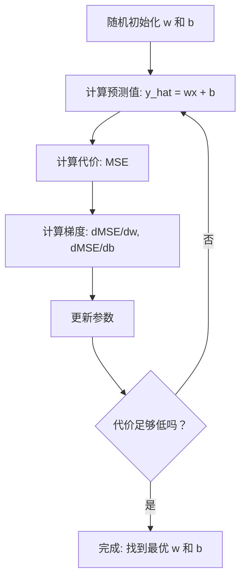

# 线性回归

> 线性回归通过数据拟合出最佳直线。它是机器学习的"Hello World"。

**类型：** 构建
**语言：** Python
**前置知识：** 第 1 阶段（线性代数、微积分、优化）、第 2 阶段第 1 课
**时长：** 约 90 分钟

## 学习目标

- 推导均方误差的梯度下降更新规则，并从零开始实现线性回归
- 从计算复杂度和适用场景两个维度比较梯度下降与正规方程
- 使用特征标准化构建多元线性回归模型并解读学习到的权重
- 解释岭回归（L2 正则化）如何通过惩罚大权重来防止过拟合

## 问题描述

你拥有一组数据：房屋面积和对应的售价。你想根据面积预测新房子的价格。你可以用散点图凭感觉估计，但你需要一个公式。你需要一条能最好地拟合数据的直线，这样输入任意面积就能得到价格预测。

线性回归就能给你这条直线。更重要的是，它引入了完整的机器学习训练循环：定义模型、定义代价函数、优化参数。每种 ML 算法都遵循同样的模式。在这里用最简单的情况掌握它，你就会在任何地方认出它。

这不仅仅适用于简单问题。线性回归被用于生产系统的需求预测、A/B 测试分析、金融建模，以及作为所有回归任务的性能基线。

## 概念讲解

### 模型

线性回归假设输入（x）和输出（y）之间存在线性关系：

```
y = wx + b
```

- `w`（权重/斜率）：x 每增加 1，y 的变化量
- `b`（偏置/截距）：x = 0 时 y 的值

对于多个输入（特征），可以扩展为：

```
y = w1*x1 + w2*x2 + ... + wn*xn + b
```

或用向量形式表示：`y = w^T * x + b`

目标：找到 w 和 b 的值，使预测的 y 在所有训练样本上尽可能接近实际的 y。

### 代价函数（均方误差）

如何衡量"尽可能接近"？你需要一个能概括预测偏差的单值指标。最常见的选择是均方误差（MSE）：

```
MSE = (1/n) * sum((y_predicted - y_actual)^2)
```

为什么要平方？有两个原因。第一，它对大误差的惩罚比小误差更严厉（误差 10 的代价是误差 1 的 100 倍，而不是 10 倍）。第二，平方函数处处光滑且可微，这使得优化更加直接。

代价函数会形成一个曲面。对于单个权重 w 和偏置 b，MSE 曲面看起来像一个碗（凸抛物面）。碗底对应 MSE 最小值。训练的过程就是找到那个碗底。

### 梯度下降

梯度下降通过沿着下坡方向走步来找到碗底。



梯度告诉你两件事：应该朝哪个方向移动每个参数，以及移动多少。

对于 MSE，其中 y_hat = wx + b：

```
dMSE/dw = (2/n) * sum((y_hat - y) * x)
dMSE/db = (2/n) * sum(y_hat - y)
```

更新规则：

```
w = w - 学习率 * dMSE/dw
b = b - 学习率 * dMSE/db
```

学习率控制步长。太大：会越过最小值并导致发散。太小：训练会花费极长时间。常见的起始值：0.01、0.001 或 0.0001。

### 正规方程（闭式解）

对于线性回归，存在一个直接的公式，无需迭代即可给出最优权重：

```
w = (X^T * X)^(-1) * X^T * y
```

它通过求逆矩阵一步求解 w。对于小规模数据集效果很好。对于大规模数据集（数百万行或数千个特征），梯度下降更优，因为矩阵求逆的时间复杂度为 O(n^3)（n 为特征数）。

### 多元线性回归

当有多个特征时，模型变为：

```
y = w1*x1 + w2*x2 + ... + wn*xn + b
```

其他部分完全相同：MSE 是代价函数，梯度下降同时更新所有权重。唯一不同的是拟合的不再是一条线而是一个超平面。

特征缩放在这里非常重要。如果一个特征的范围是 0 到 1，另一个特征的范围是 0 到 1,000,000，梯度下降会陷入困境，因为代价曲面会变得非常细长。训练前应对特征进行标准化（减去均值，除以标准差）。

### 多项式回归

如果关系不是线性的怎么办？你仍然可以使用线性回归，方法是创建多项式特征：

```
y = w1*x + w2*x^2 + w3*x^3 + b
```

这仍然是"线性"回归，因为模型在权重（w1、w2、w3）上是线性的。你只是在使用 x 的非线性特征。

更高次的多项式可以拟合更复杂的曲线，但有过拟合的风险。一个 10 次多项式在 10 个点的训练集上可以经过每个点，但在新数据上预测效果很差。

### R² 得分

MSE 告诉你误差有多大，但这个数值依赖于 y 的尺度。R²（R-squared）提供了一个与尺度无关的度量：

```
R^2 = 1 - (残差平方和) / (总平方和)
    = 1 - SS_res / SS_tot
```

- R² = 1.0：完美预测
- R² = 0.0：模型效果不比始终预测均值更好
- R² < 0.0：模型效果不如始终预测均值

### 正则化预览（岭回归）

当特征很多时，模型可能通过赋予大权重来过拟合。岭回归（L2 正则化）引入了惩罚项：

```
代价 = MSE + lambda * sum(w_i^2)
```

惩罚项可以阻止权重过大。超参数 lambda 控制权衡：lambda 越大，权重越小，正则化效果越强。这部分将在后续课程中深入讲解。现在只需知道它的存在和作用即可。

```figure
linear-regression-fit
```

## 动手实现

### 第 1 步：生成示例数据

```python
import random
import math

random.seed(42)

TRUE_W = 3.0
TRUE_B = 7.0
N_SAMPLES = 100

X = [random.uniform(0, 10) for _ in range(N_SAMPLES)]
y = [TRUE_W * x + TRUE_B + random.gauss(0, 2.0) for x in X]

print(f"已生成 {N_SAMPLES} 个样本")
print(f"真实关系: y = {TRUE_W}x + {TRUE_B} (+ 噪声)")
print(f"前 5 个点: {[(round(X[i], 2), round(y[i], 2)) for i in range(5)]}")
```

### 第 2 步：从零开始使用梯度下降实现线性回归

```python
class LinearRegression:
    def __init__(self, learning_rate=0.01):
        self.w = 0.0
        self.b = 0.0
        self.lr = learning_rate
        self.cost_history = []

    def predict(self, X):
        return [self.w * x + self.b for x in X]

    def compute_cost(self, X, y):
        predictions = self.predict(X)
        n = len(y)
        cost = sum((pred - actual) ** 2 for pred, actual in zip(predictions, y)) / n
        return cost

    def compute_gradients(self, X, y):
        predictions = self.predict(X)
        n = len(y)
        dw = (2 / n) * sum((pred - actual) * x for pred, actual, x in zip(predictions, y, X))
        db = (2 / n) * sum(pred - actual for pred, actual in zip(predictions, y))
        return dw, db

    def fit(self, X, y, epochs=1000, print_every=200):
        for epoch in range(epochs):
            dw, db = self.compute_gradients(X, y)
            self.w -= self.lr * dw
            self.b -= self.lr * db
            cost = self.compute_cost(X, y)
            self.cost_history.append(cost)
            if epoch % print_every == 0:
                print(f"  Epoch {epoch:4d} | Cost: {cost:.4f} | w: {self.w:.4f} | b: {self.b:.4f}")
        return self

    def r_squared(self, X, y):
        predictions = self.predict(X)
        y_mean = sum(y) / len(y)
        ss_res = sum((actual - pred) ** 2 for actual, pred in zip(y, predictions))
        ss_tot = sum((actual - y_mean) ** 2 for actual in y)
        return 1 - (ss_res / ss_tot)


print("=== 训练线性回归（梯度下降）===")
model = LinearRegression(learning_rate=0.005)
model.fit(X, y, epochs=1000, print_every=200)
print(f"\n学习得到: y = {model.w:.4f}x + {model.b:.4f}")
print(f"真实值:   y = {TRUE_W}x + {TRUE_B}")
print(f"R²:       {model.r_squared(X, y):.4f}")
```

### 第 3 步：正规方程（闭式解）

```python
class LinearRegressionNormal:
    def __init__(self):
        self.w = 0.0
        self.b = 0.0

    def fit(self, X, y):
        n = len(X)
        x_mean = sum(X) / n
        y_mean = sum(y) / n
        numerator = sum((X[i] - x_mean) * (y[i] - y_mean) for i in range(n))
        denominator = sum((X[i] - x_mean) ** 2 for i in range(n))
        self.w = numerator / denominator
        self.b = y_mean - self.w * x_mean
        return self

    def predict(self, X):
        return [self.w * x + self.b for x in X]

    def r_squared(self, X, y):
        predictions = self.predict(X)
        y_mean = sum(y) / len(y)
        ss_res = sum((actual - pred) ** 2 for actual, pred in zip(y, predictions))
        ss_tot = sum((actual - y_mean) ** 2 for actual in y)
        return 1 - (ss_res / ss_tot)


print("\n=== 正规方程（闭式解）===")
model_normal = LinearRegressionNormal()
model_normal.fit(X, y)
print(f"学习得到: y = {model_normal.w:.4f}x + {model_normal.b:.4f}")
print(f"R²:       {model_normal.r_squared(X, y):.4f}")
```

### 第 4 步：多元线性回归

```python
class MultipleLinearRegression:
    def __init__(self, n_features, learning_rate=0.01):
        self.weights = [0.0] * n_features
        self.bias = 0.0
        self.lr = learning_rate
        self.cost_history = []

    def predict_single(self, x):
        return sum(w * xi for w, xi in zip(self.weights, x)) + self.bias

    def predict(self, X):
        return [self.predict_single(x) for x in X]

    def compute_cost(self, X, y):
        predictions = self.predict(X)
        n = len(y)
        return sum((pred - actual) ** 2 for pred, actual in zip(predictions, y)) / n

    def fit(self, X, y, epochs=1000, print_every=200):
        n = len(y)
        n_features = len(X[0])
        for epoch in range(epochs):
            predictions = self.predict(X)
            errors = [pred - actual for pred, actual in zip(predictions, y)]
            for j in range(n_features):
                grad = (2 / n) * sum(errors[i] * X[i][j] for i in range(n))
                self.weights[j] -= self.lr * grad
            grad_b = (2 / n) * sum(errors)
            self.bias -= self.lr * grad_b
            cost = self.compute_cost(X, y)
            self.cost_history.append(cost)
            if epoch % print_every == 0:
                print(f"  Epoch {epoch:4d} | Cost: {cost:.4f}")
        return self

    def r_squared(self, X, y):
        predictions = self.predict(X)
        y_mean = sum(y) / len(y)
        ss_res = sum((actual - pred) ** 2 for actual, pred in zip(y, predictions))
        ss_tot = sum((actual - y_mean) ** 2 for actual in y)
        return 1 - (ss_res / ss_tot)


random.seed(42)
N = 100
X_multi = []
y_multi = []
for _ in range(N):
    size = random.uniform(500, 3000)
    bedrooms = random.randint(1, 5)
    age = random.uniform(0, 50)
    price = 50 * size + 10000 * bedrooms - 1000 * age + 50000 + random.gauss(0, 20000)
    X_multi.append([size, bedrooms, age])
    y_multi.append(price)


def standardize(X):
    n_features = len(X[0])
    means = [sum(X[i][j] for i in range(len(X))) / len(X) for j in range(n_features)]
    stds = []
    for j in range(n_features):
        variance = sum((X[i][j] - means[j]) ** 2 for i in range(len(X))) / len(X)
        stds.append(variance ** 0.5)
    X_scaled = []
    for i in range(len(X)):
        row = [(X[i][j] - means[j]) / stds[j] if stds[j] > 0 else 0 for j in range(n_features)]
        X_scaled.append(row)
    return X_scaled, means, stds


y_mean_val = sum(y_multi) / len(y_multi)
y_std_val = (sum((yi - y_mean_val) ** 2 for yi in y_multi) / len(y_multi)) ** 0.5
y_scaled = [(yi - y_mean_val) / y_std_val for yi in y_multi]

X_scaled, x_means, x_stds = standardize(X_multi)

print("\n=== 多元线性回归（3 个特征）===")
print("特征：房屋面积、卧室数量、房龄")
multi_model = MultipleLinearRegression(n_features=3, learning_rate=0.01)
multi_model.fit(X_scaled, y_scaled, epochs=1000, print_every=200)

print(f"\n权重（标准化后）: {[round(w, 4) for w in multi_model.weights]}")
print(f"偏置（标准化后）: {multi_model.bias:.4f}")
print(f"R²:              {multi_model.r_squared(X_scaled, y_scaled):.4f}")
```

### 第 5 步：多项式回归

```python
class PolynomialRegression:
    def __init__(self, degree, learning_rate=0.01):
        self.degree = degree
        self.weights = [0.0] * degree
        self.bias = 0.0
        self.lr = learning_rate

    def make_features(self, X):
        return [[x ** (d + 1) for d in range(self.degree)] for x in X]

    def predict(self, X):
        features = self.make_features(X)
        return [sum(w * f for w, f in zip(self.weights, row)) + self.bias for row in features]

    def fit(self, X, y, epochs=1000, print_every=200):
        features = self.make_features(X)
        n = len(y)
        for epoch in range(epochs):
            predictions = [sum(w * f for w, f in zip(self.weights, row)) + self.bias for row in features]
            errors = [pred - actual for pred, actual in zip(predictions, y)]
            for j in range(self.degree):
                grad = (2 / n) * sum(errors[i] * features[i][j] for i in range(n))
                self.weights[j] -= self.lr * grad
            grad_b = (2 / n) * sum(errors)
            self.bias -= self.lr * grad_b
            if epoch % print_every == 0:
                cost = sum(e ** 2 for e in errors) / n
                print(f"  Epoch {epoch:4d} | Cost: {cost:.6f}")
        return self

    def r_squared(self, X, y):
        predictions = self.predict(X)
        y_mean = sum(y) / len(y)
        ss_res = sum((actual - pred) ** 2 for actual, pred in zip(y, predictions))
        ss_tot = sum((actual - y_mean) ** 2 for actual in y)
        return 1 - (ss_res / ss_tot)


random.seed(42)
X_poly = [x / 10.0 for x in range(0, 50)]
y_poly = [0.5 * x ** 2 - 2 * x + 3 + random.gauss(0, 1.0) for x in X_poly]

x_max = max(abs(x) for x in X_poly)
X_poly_norm = [x / x_max for x in X_poly]
y_poly_mean = sum(y_poly) / len(y_poly)
y_poly_std = (sum((yi - y_poly_mean) ** 2 for yi in y_poly) / len(y_poly)) ** 0.5
y_poly_norm = [(yi - y_poly_mean) / y_poly_std for yi in y_poly]

print("\n=== 多项式回归（2 次 vs 5 次）===")
print("真实关系: y = 0.5x^2 - 2x + 3")

print("\n2 次多项式:")
poly2 = PolynomialRegression(degree=2, learning_rate=0.1)
poly2.fit(X_poly_norm, y_poly_norm, epochs=2000, print_every=500)
print(f"  R²: {poly2.r_squared(X_poly_norm, y_poly_norm):.4f}")

print("\n5 次多项式:")
poly5 = PolynomialRegression(degree=5, learning_rate=0.1)
poly5.fit(X_poly_norm, y_poly_norm, epochs=2000, print_every=500)
print(f"  R²: {poly5.r_squared(X_poly_norm, y_poly_norm):.4f}")

print("\n2 次多项式能很好地拟合真实曲线。5 次多项式在训练数据上拟合得略好，")
print("但在新数据上存在过拟合风险。")
```

### 第 6 步：岭回归（L2 正则化）

```python
class RidgeRegression:
    def __init__(self, n_features, learning_rate=0.01, alpha=1.0):
        self.weights = [0.0] * n_features
        self.bias = 0.0
        self.lr = learning_rate
        self.alpha = alpha

    def predict_single(self, x):
        return sum(w * xi for w, xi in zip(self.weights, x)) + self.bias

    def predict(self, X):
        return [self.predict_single(x) for x in X]

    def fit(self, X, y, epochs=1000, print_every=200):
        n = len(y)
        n_features = len(X[0])
        for epoch in range(epochs):
            predictions = self.predict(X)
            errors = [pred - actual for pred, actual in zip(predictions, y)]
            mse = sum(e ** 2 for e in errors) / n
            reg_term = self.alpha * sum(w ** 2 for w in self.weights)
            cost = mse + reg_term
            for j in range(n_features):
                grad = (2 / n) * sum(errors[i] * X[i][j] for i in range(n))
                grad += 2 * self.alpha * self.weights[j]
                self.weights[j] -= self.lr * grad
            grad_b = (2 / n) * sum(errors)
            self.bias -= self.lr * grad_b
            if epoch % print_every == 0:
                print(f"  Epoch {epoch:4d} | Cost: {cost:.4f} | L2 penalty: {reg_term:.4f}")
        return self


print("\n=== 岭回归（L2 正则化）===")
print("与多元回归相同的数据，alpha=0.1")
ridge = RidgeRegression(n_features=3, learning_rate=0.01, alpha=0.1)
ridge.fit(X_scaled, y_scaled, epochs=1000, print_every=200)
print(f"\n岭回归权重:   {[round(w, 4) for w in ridge.weights]}")
print(f"普通权重:     {[round(w, 4) for w in multi_model.weights]}")
print("岭回归权重更小（被拉向零），这是 L2 惩罚的结果。")
```

## 实际应用

下面是使用 scikit-learn 的实现方式，这才是实际在生产环境中会使用的方式。

```python
from sklearn.linear_model import LinearRegression as SklearnLR
from sklearn.linear_model import Ridge
from sklearn.preprocessing import PolynomialFeatures, StandardScaler
from sklearn.model_selection import train_test_split
from sklearn.metrics import mean_squared_error, r2_score
import numpy as np

np.random.seed(42)
X_sk = np.random.uniform(0, 10, (100, 1))
y_sk = 3.0 * X_sk.squeeze() + 7.0 + np.random.normal(0, 2.0, 100)

X_train, X_test, y_train, y_test = train_test_split(X_sk, y_sk, test_size=0.2, random_state=42)

lr = SklearnLR()
lr.fit(X_train, y_train)
y_pred = lr.predict(X_test)

print("=== Scikit-learn 线性回归 ===")
print(f"系数 (w):     {lr.coef_[0]:.4f}")
print(f"截距 (b):     {lr.intercept_:.4f}")
print(f"R² (测试集):  {r2_score(y_test, y_pred):.4f}")
print(f"MSE (测试集): {mean_squared_error(y_test, y_pred):.4f}")

poly = PolynomialFeatures(degree=2, include_bias=False)
X_poly_sk = poly.fit_transform(X_train)
X_poly_test = poly.transform(X_test)

lr_poly = SklearnLR()
lr_poly.fit(X_poly_sk, y_train)
print(f"\n2 次多项式 R²: {r2_score(y_test, lr_poly.predict(X_poly_test)):.4f}")

scaler = StandardScaler()
X_train_scaled = scaler.fit_transform(X_train)
X_test_scaled = scaler.transform(X_test)

ridge = Ridge(alpha=1.0)
ridge.fit(X_train_scaled, y_train)
print(f"岭回归 R²:     {r2_score(y_test, ridge.predict(X_test_scaled)):.4f}")
print(f"岭回归系数:     {ridge.coef_[0]:.4f}")
```

从零实现的版本与 scikit-learn 产生相同的结果。区别在于：scikit-learn 处理了边界情况、数值稳定性和性能优化。生产环境请使用库，从零实现版本用于理解背后的原理。

## 部署成果

本课将产出：
- `outputs/skill-regression.md` — 一个技能说明，用于根据问题选择合适的回归方法

## 练习题

1. 实现批量梯度下降、随机梯度下降（SGD）和小批量梯度下降。在相同数据集上比较收敛速度。哪种收敛最快？哪种代价曲线最平滑？
2. 从三次函数生成数据（y = ax^3 + bx^2 + cx + d + 噪声）。分别拟合 1 次、3 次和 10 次多项式。比较训练 R² 和测试 R²。在多少次时过拟合变得明显？
3. 实现 Lasso 回归（L1 正则化：惩罚项 = alpha * sum(|w_i|)）。在多特征房屋数据上训练。比较哪些权重变为零与岭回归的差异。为什么 L1 会产生稀疏解而 L2 不会？

## 核心术语

| 术语 | 人们通常的说法 | 实际含义 |
|------|----------------|----------|
| 线性回归 | "在数据上画一条线" | 寻找权重 w 和偏置 b，使 (wx+b) 与实际 y 值的平方差之和最小 |
| 代价函数 | "模型有多糟糕" | 将模型参数映射为单个数值以衡量预测误差的函数，优化过程的目标就是最小化它 |
| 均方误差 | "误差平方的平均值" | (1/n) * sum((predicted - actual)^2)，不成比例地惩罚大误差 |
| 梯度下降 | "沿下坡走" | 迭代地沿使代价函数减小的方向调整参数，使用偏导数指导方向 |
| 学习率 | "步长" | 一个标量，控制梯度下降每一步参数的变化幅度 |
| 正规方程 | "直接求解" | 闭式解 w = (X^T X)^-1 X^T y，无需迭代即可给出最优权重 |
| R² | "拟合效果有多好" | 模型解释的 y 的方差比例，取值范围从负无穷到 1.0 |
| 特征缩放 | "让特征可比" | 将特征变换到相似的取值范围（如零均值、单位方差），使梯度下降收敛更快 |
| 正则化 | "惩罚复杂度" | 在代价函数中添加一项以缩小权重，防止过拟合 |
| 岭回归 | "L2 正则化" | 在 MSE 基础上添加 lambda * sum(w_i^2) 惩罚项的线性回归 |
| 多项式回归 | "用线性方法拟合曲线" | 对多项式特征（x, x^2, x^3, ...）使用线性回归，在权重上仍然是线性的 |
| 过拟合 | "死记训练数据" | 使用过于复杂的模型，使其拟合了训练数据中的噪声，在新数据上表现糟糕 |

## 延伸阅读

- [An Introduction to Statistical Learning (ISLR)](https://www.statlearning.com/) — 免费 PDF，第 3 章和第 6 章涵盖线性回归和正则化，配有实用的 R 语言示例
- [The Elements of Statistical Learning (ESLR)](https://hastie.su.domains/ElemStatLearn/) — 免费 PDF，ISLR 更具数学深度的 companion，对岭回归和 Lasso 有更深入的处理
- [Stanford CS229 线性回归讲义](https://cs229.stanford.edu/main_notes.pdf) — Andrew Ng 的讲义，从基本原理出发推导正规方程和梯度下降
- [scikit-learn LinearRegression 文档](https://scikit-learn.org/stable/modules/linear_model.html) — LinearRegression、Ridge、Lasso 和 ElasticNet 的实用参考，附有代码示例
