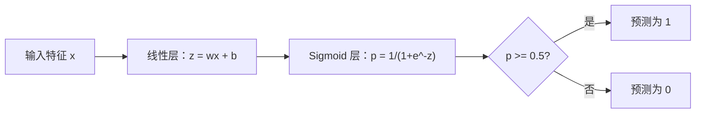
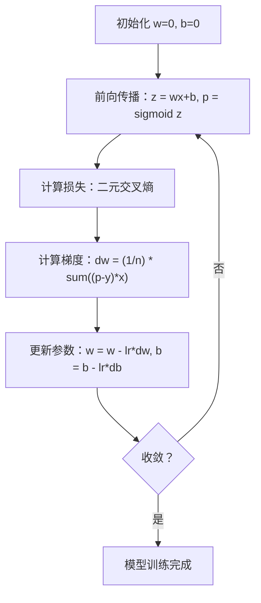

# 逻辑回归

> 逻辑回归将一条直线弯曲成 S 形曲线，用概率回答"是/否"类问题。

**类型：** Build（构建）
**语言：** Python
**前置知识：** Phase 2 第 1-2 课（什么是机器学习、线性回归）
**时间：** 约 90 分钟

## 学习目标

- 使用 sigmoid 函数和二元交叉熵损失从零实现逻辑回归
- 计算并解读精确率、召回率、F1 分数以及混淆矩阵（用于二分类）
- 解释为什么 MSE 在分类任务上失败，以及为什么二元交叉熵产生凸代价曲面
- 构建用于多分类的 softmax 回归模型，并评估阈值调优的权衡

## 问题描述

给定肿瘤的直径，你想预测它是恶性还是良性。你尝试了线性回归，它输出类似 0.3、1.7 或 -0.5 这样的数值。这些值代表什么？1.7 是"非常恶性"吗？-0.5 是"非常良性"吗？线性回归的输出是无界的；分类问题需要 0 到 1 之间有界的概率，以及一个明确的判断：是或否。

逻辑回归解决了这个问题。它采用与线性回归相同的线性组合（wx + b），再将其通过 sigmoid 函数，该函数可以将任意数值压缩到 (0, 1) 范围内。输出即为一个概率。设定一个阈值（通常为 0.5），即可做出决策。

这是实践中使用最广泛的算法之一。尽管名称中带有"回归"，逻辑回归实际上是一种分类算法，而非回归算法。名称来源于它所使用逻辑（sigmoid）函数。

## 概念讲解

### 为什么线性回归不适合分类

假设根据学习小时数预测及格/不及格（1/0）。线性回归会拟合一条穿过数据的直线：

```
小时数：  1   2   3   4   5   6   7   8   9   10
实际标签：0   0   0   0   1   1   1   1   1   1
```

线性拟合可能会产生如下预测值：小时 1 时为 -0.2，小时 10 时为 1.3。这些值并非概率，它们会低于 0 或高于 1。更糟糕的是，一个单独的异常点（比如学习了 50 小时的人）会把整条直线拖偏，从而改变所有人的预测结果。

分类任务需要一个满足以下条件的函数：
- 输出 0 到 1 之间的值（概率）
- 形成明显的突变（决策边界）
- 不受远离边界的异常点影响

### Sigmoid 函数

Sigmoid 函数恰好满足上述要求：

```
sigmoid(z) = 1 / (1 + e^(-z))
```

性质：
- 当 z 为正且很大时，sigmoid(z) 趋近于 1
- 当 z 为负且很小时，sigmoid(z) 趋近于 0
- 当 z = 0 时，sigmoid(z) = 0.5
- 输出始终在 0 到 1 之间
- 函数处处光滑且可导

其导数形式非常简洁：sigmoid'(z) = sigmoid(z) * (1 - sigmoid(z))。这使得梯度计算更加高效。

### 逻辑回归 = 线性模型 + Sigmoid

模型先计算 z = wx + b（与线性回归相同），再应用 sigmoid：



输出 p 被解释为 P(y=1 | x)，即该输入属于类别 1 的概率。决策边界出现在 wx + b = 0 处，此时 sigmoid 输出恰好为 0.5。

### 二元交叉熵损失

逻辑回归不能直接使用 MSE。MSE 配合 sigmoid 会产生非凸的代价曲面，存在多个局部极小值。应改用二元交叉熵（对数损失）：

```
Loss = -(1/n) * sum(y * log(p) + (1-y) * log(1-p))
```

为什么这样有效：
- 当 y=1 且 p 接近 1 时：log(1) = 0，损失接近 0（预测正确，代价低）
- 当 y=1 且 p 接近 0 时：log(0) 趋近负无穷，损失极大（预测错误，代价高）
- 当 y=0 且 p 接近 0 时：log(1) = 0，损失接近 0（预测正确，代价低）
- 当 y=0 且 p 接近 1 时：log(0) 趋近负无穷，损失极大（预测错误，代价高）

该损失函数在逻辑回归中是凸的，保证了全局唯一最优解。

### 逻辑回归的梯度下降

对于 sigmoid 配合二元交叉熵，梯度具有简洁的形式：

```
dL/dw = (1/n) * sum((p - y) * x)
dL/db = (1/n) * sum(p - y)
```

这与线性回归的梯度看起来完全相同。区别在于 p = sigmoid(wx + b) 而非 p = wx + b。非线性由 sigmoid 引入，但梯度更新规则保持不变。



### 决策边界

对于二维输入（两个特征），决策边界是满足以下条件的直线：

```
w1*x1 + w2*x2 + b = 0
```

边界一侧的点被分类为 1，另一侧的点被分类为 0。逻辑回归始终产生线性决策边界。如果需要曲线边界，要么添加多项式特征，要么使用非线性模型。

### 使用 Softmax 进行多分类

二值逻辑回归处理两个类别。对于 k 个类别，使用 softmax 函数：

```
softmax(z_i) = e^(z_i) / sum(e^(z_j) for all j)
```

每个类别拥有独立的权重向量。模型为每个类别计算得分 z_i，再由 softmax 将得分转换为和为 1 的概率分布。预测结果为概率最高的类别。

损失函数变为类别交叉熵：

```
Loss = -(1/n) * sum(sum(y_k * log(p_k)))
```

其中 y_k 在真实类别时为 1，其余类别为 0（one-hot 编码）。

### 评估指标

仅看准确率是不够的。对于 95% 负样本、5% 正样本的数据集，一个始终预测负样本的模型能达到 95% 的准确率，但实际上毫无用处。

**混淆矩阵**：

| | 预测为正 | 预测为负 |
|---|---|---|
| 实际为正 | 真正例 (TP) | 假负例 (FN) |
| 实际为负 | 假正例 (FP) | 真负例 (TN) |

**精确率（Precision）**：在所有被预测为正样本中，真正为正的比例是多少？
```
Precision = TP / (TP + FP)
```

**召回率（Recall，灵敏度）**：在所有真实正样本中，模型捕捉到了多少？
```
Recall = TP / (TP + FN)
```

**F1 分数**：精确率和召回率的调和平均数，兼顾两者。
```
F1 = 2 * (Precision * Recall) / (Precision + Recall)
```

何时优先使用：
- **精确率**：假正例代价高昂时（垃圾邮件过滤器，你不希望拦截正常邮件）
- **召回率**：假负例代价高昂时（癌症筛查，你不希望漏掉肿瘤）
- **F1**：需要一个综合平衡的指标时

```figure
logistic-sigmoid
```

## 动手实现

### 步骤 1：Sigmoid 函数与数据生成

```python
import random
import math

def sigmoid(z):
    z = max(-500, min(500, z))
    return 1.0 / (1.0 + math.exp(-z))


random.seed(42)
N = 200
X = []
y = []

for _ in range(N // 2):
    X.append([random.gauss(2, 1), random.gauss(2, 1)])
    y.append(0)

for _ in range(N // 2):
    X.append([random.gauss(5, 1), random.gauss(5, 1)])
    y.append(1)

combined = list(zip(X, y))
random.shuffle(combined)
X, y = zip(*combined)
X = list(X)
y = list(y)

print(f"已生成 {N} 个样本（2 个类别，2 个特征）")
print(f"类别 0 中心：(2, 2)，类别 1 中心：(5, 5)")
print(f"前 5 个样本：")
for i in range(5):
    print(f"  特征：[{X[i][0]:.2f}, {X[i][1]:.2f}]，标签：{y[i]}")
```

### 步骤 2：从零实现逻辑回归

```python
class LogisticRegression:
    def __init__(self, n_features, learning_rate=0.01):
        self.weights = [0.0] * n_features
        self.bias = 0.0
        self.lr = learning_rate
        self.loss_history = []

    def predict_proba(self, x):
        z = sum(w * xi for w, xi in zip(self.weights, x)) + self.bias
        return sigmoid(z)

    def predict(self, x, threshold=0.5):
        return 1 if self.predict_proba(x) >= threshold else 0

    def compute_loss(self, X, y):
        n = len(y)
        total = 0.0
        for i in range(n):
            p = self.predict_proba(X[i])
            p = max(1e-15, min(1 - 1e-15, p))
            total += y[i] * math.log(p) + (1 - y[i]) * math.log(1 - p)
        return -total / n

    def fit(self, X, y, epochs=1000, print_every=200):
        n = len(y)
        n_features = len(X[0])
        for epoch in range(epochs):
            dw = [0.0] * n_features
            db = 0.0
            for i in range(n):
                p = self.predict_proba(X[i])
                error = p - y[i]
                for j in range(n_features):
                    dw[j] += error * X[i][j]
                db += error
            for j in range(n_features):
                self.weights[j] -= self.lr * (dw[j] / n)
            self.bias -= self.lr * (db / n)
            loss = self.compute_loss(X, y)
            self.loss_history.append(loss)
            if epoch % print_every == 0:
                print(f"  Epoch {epoch:4d} | Loss: {loss:.4f} | w: [{self.weights[0]:.3f}, {self.weights[1]:.3f}] | b: {self.bias:.3f}")
        return self

    def accuracy(self, X, y):
        correct = sum(1 for i in range(len(y)) if self.predict(X[i]) == y[i])
        return correct / len(y)


split = int(0.8 * N)
X_train, X_test = X[:split], X[split:]
y_train, y_test = y[:split], y[split:]

print("\n=== 训练逻辑回归 ===")
model = LogisticRegression(n_features=2, learning_rate=0.1)
model.fit(X_train, y_train, epochs=1000, print_every=200)

print(f"\n训练集准确率：{model.accuracy(X_train, y_train):.4f}")
print(f"测试集准确率： {model.accuracy(X_test, y_test):.4f}")
print(f"权重：[{model.weights[0]:.4f}, {model.weights[1]:.4f}]")
print(f"偏置：{model.bias:.4f}")
```

### 步骤 3：从零实现混淆矩阵与评估指标

```python
class ClassificationMetrics:
    def __init__(self, y_true, y_pred):
        self.tp = sum(1 for t, p in zip(y_true, y_pred) if t == 1 and p == 1)
        self.tn = sum(1 for t, p in zip(y_true, y_pred) if t == 0 and p == 0)
        self.fp = sum(1 for t, p in zip(y_true, y_pred) if t == 0 and p == 1)
        self.fn = sum(1 for t, p in zip(y_true, y_pred) if t == 1 and p == 0)

    def accuracy(self):
        total = self.tp + self.tn + self.fp + self.fn
        return (self.tp + self.tn) / total if total > 0 else 0

    def precision(self):
        denom = self.tp + self.fp
        return self.tp / denom if denom > 0 else 0

    def recall(self):
        denom = self.tp + self.fn
        return self.tp / denom if denom > 0 else 0

    def f1(self):
        p = self.precision()
        r = self.recall()
        return 2 * p * r / (p + r) if (p + r) > 0 else 0

    def print_confusion_matrix(self):
        print(f"\n  混淆矩阵：")
        print(f"                  预测")
        print(f"                  正    负")
        print(f"  实际为正        {self.tp:4d}  {self.fn:4d}")
        print(f"  实际为负        {self.fp:4d}  {self.tn:4d}")

    def print_report(self):
        self.print_confusion_matrix()
        print(f"\n  准确率：   {self.accuracy():.4f}")
        print(f"  精确率：   {self.precision():.4f}")
        print(f"  召回率：   {self.recall():.4f}")
        print(f"  F1 分数：  {self.f1():.4f}")


y_pred_test = [model.predict(x) for x in X_test]
print("\n=== 分类报告（测试集）===")
metrics = ClassificationMetrics(y_test, y_pred_test)
metrics.print_report()
```

### 步骤 4：决策边界分析

```python
print("\n=== 决策边界 ===")
w1, w2 = model.weights
b = model.bias
print(f"决策边界：{w1:.4f}*x1 + {w2:.4f}*x2 + {b:.4f} = 0")
if abs(w2) > 1e-10:
    print(f"解出 x2：    x2 = {-w1/w2:.4f}*x1 + {-b/w2:.4f}")

print("\n边界附近的样本预测：")
test_points = [
    [3.0, 3.0],
    [3.5, 3.5],
    [4.0, 4.0],
    [2.5, 2.5],
    [5.0, 5.0],
]
for point in test_points:
    prob = model.predict_proba(point)
    pred = model.predict(point)
    print(f"  [{point[0]}, {point[1]}] -> 概率={prob:.4f}，类别={pred}")
```

### 步骤 5：使用 Softmax 进行多分类

```python
class SoftmaxRegression:
    def __init__(self, n_features, n_classes, learning_rate=0.01):
        self.n_features = n_features
        self.n_classes = n_classes
        self.lr = learning_rate
        self.weights = [[0.0] * n_features for _ in range(n_classes)]
        self.biases = [0.0] * n_classes

    def softmax(self, scores):
        max_score = max(scores)
        exp_scores = [math.exp(s - max_score) for s in scores]
        total = sum(exp_scores)
        return [e / total for e in exp_scores]

    def predict_proba(self, x):
        scores = [
            sum(self.weights[k][j] * x[j] for j in range(self.n_features)) + self.biases[k]
            for k in range(self.n_classes)
        ]
        return self.softmax(scores)

    def predict(self, x):
        probs = self.predict_proba(x)
        return probs.index(max(probs))

    def fit(self, X, y, epochs=1000, print_every=200):
        n = len(y)
        for epoch in range(epochs):
            grad_w = [[0.0] * self.n_features for _ in range(self.n_classes)]
            grad_b = [0.0] * self.n_classes
            total_loss = 0.0
            for i in range(n):
                probs = self.predict_proba(X[i])
                for k in range(self.n_classes):
                    target = 1.0 if y[i] == k else 0.0
                    error = probs[k] - target
                    for j in range(self.n_features):
                        grad_w[k][j] += error * X[i][j]
                    grad_b[k] += error
                true_prob = max(probs[y[i]], 1e-15)
                total_loss -= math.log(true_prob)
            for k in range(self.n_classes):
                for j in range(self.n_features):
                    self.weights[k][j] -= self.lr * (grad_w[k][j] / n)
                self.biases[k] -= self.lr * (grad_b[k] / n)
            if epoch % print_every == 0:
                print(f"  Epoch {epoch:4d} | 损失：{total_loss / n:.4f}")
        return self

    def accuracy(self, X, y):
        correct = sum(1 for i in range(len(y)) if self.predict(X[i]) == y[i])
        return correct / len(y)


random.seed(42)
X_3class = []
y_3class = []

centers = [(1, 1), (5, 1), (3, 5)]
for label, (cx, cy) in enumerate(centers):
    for _ in range(50):
        X_3class.append([random.gauss(cx, 0.8), random.gauss(cy, 0.8)])
        y_3class.append(label)

combined = list(zip(X_3class, y_3class))
random.shuffle(combined)
X_3class, y_3class = zip(*combined)
X_3class = list(X_3class)
y_3class = list(y_3class)

split_3 = int(0.8 * len(X_3class))
X_train_3 = X_3class[:split_3]
y_train_3 = y_3class[:split_3]
X_test_3 = X_3class[split_3:]
y_test_3 = y_3class[split_3:]

print("\n=== 多分类 Softmax 回归（3 个类别）===")
softmax_model = SoftmaxRegression(n_features=2, n_classes=3, learning_rate=0.1)
softmax_model.fit(X_train_3, y_train_3, epochs=1000, print_every=200)
print(f"\n训练集准确率：{softmax_model.accuracy(X_train_3, y_train_3):.4f}")
print(f"测试集准确率： {softmax_model.accuracy(X_test_3, y_test_3):.4f}")

print("\n样本预测示例：")
for i in range(5):
    probs = softmax_model.predict_proba(X_test_3[i])
    pred = softmax_model.predict(X_test_3[i])
    print(f"  真实标签：{y_test_3[i]}，预测：{pred}，概率：[{', '.join(f'{p:.3f}' for p in probs)}]")
```

### 步骤 6：阈值调优

```python
print("\n=== 阈值调优 ===")
print("默认阈值为 0.5。调整阈值会在精确率与召回率之间进行权衡。\n")

thresholds = [0.3, 0.4, 0.5, 0.6, 0.7]
print(f"{'阈值':>10} {'准确率':>10} {'精确率':>10} {'召回率':>10} {'F1':>10}")
print("-" * 52)

for t in thresholds:
    y_pred_t = [1 if model.predict_proba(x) >= t else 0 for x in X_test]
    m = ClassificationMetrics(y_test, y_pred_t)
    print(f"{t:>10.1f} {m.accuracy():>10.4f} {m.precision():>10.4f} {m.recall():>10.4f} {m.f1():>10.4f}")
```

## 实战应用

下面使用 scikit-learn 完成同样的任务。

```python
from sklearn.linear_model import LogisticRegression as SklearnLR
from sklearn.metrics import accuracy_score, precision_score, recall_score, f1_score
from sklearn.metrics import confusion_matrix, classification_report
from sklearn.model_selection import train_test_split
from sklearn.preprocessing import StandardScaler
import numpy as np

np.random.seed(42)
X_0 = np.random.randn(100, 2) + [2, 2]
X_1 = np.random.randn(100, 2) + [5, 5]
X_sk = np.vstack([X_0, X_1])
y_sk = np.array([0] * 100 + [1] * 100)

X_tr, X_te, y_tr, y_te = train_test_split(X_sk, y_sk, test_size=0.2, random_state=42)

scaler = StandardScaler()
X_tr_sc = scaler.fit_transform(X_tr)
X_te_sc = scaler.transform(X_te)

lr = SklearnLR()
lr.fit(X_tr_sc, y_tr)
y_pred = lr.predict(X_te_sc)

print("=== Scikit-learn 逻辑回归 ===")
print(f"准确率：  {accuracy_score(y_te, y_pred):.4f}")
print(f"精确率： {precision_score(y_te, y_pred):.4f}")
print(f"召回率：   {recall_score(y_te, y_pred):.4f}")
print(f"F1：        {f1_score(y_te, y_pred):.4f}")
print(f"\n混淆矩阵：\n{confusion_matrix(y_te, y_pred)}")
print(f"\n分类报告：\n{classification_report(y_te, y_pred)}")
```

从零实现的版本能够产生相同的决策边界和评估指标。Scikit-learn 额外提供了求解器选项（liblinear、lbfgs、saga）、自动正则化、多分类策略（one-vs-rest、multinomial）以及数值稳定性优化。

## 交付成果

本课结束后你将拥有：
- `code/logistic_regression.py` — 从零实现逻辑回归及评估指标

## 练习题

1. 生成一个**非线性可分**的数据集（例如两个同心圆）。训练逻辑回归并观察其失败之处。然后添加多项式特征（x1^2、x2^2、x1*x2）并重新训练，展示准确率的提升。
2. 为 3 分类 softmax 模型实现多分类混淆矩阵，计算每个类别的精确率和召回率。哪个类别最难分类？
3. 从零构建 ROC 曲线。对于 0 到 1 之间取 100 个阈值，分别计算真正例率和假正例率，并使用梯形法则计算 AUC（曲线下面积）。

## 关键术语

| 术语 | 人们常说的 | 实际含义 |
|------|------------|----------|
| 逻辑回归 | "用于分类的回归" | 线性模型后接 sigmoid 函数，输出类别概率 |
| Sigmoid 函数 | "S 形曲线" | 函数 1/(1+e^(-z))，将任意实数映射到 (0, 1) 区间 |
| 二元交叉熵 | "对数损失" | 损失函数 -[y*log(p) + (1-y)*log(1-p)]，对自信的错预测施加重罚 |
| 决策边界 | "分割线" | 模型输出概率等于 0.5 的分界面，用于划分预测类别 |
| Softmax | "多分类版 sigmoid" | 将一组得分转换为和为 1 的概率分布的函数 |
| 精确率 | "选中了多少相关的" | TP / (TP + FP)，预测为正例中真正为正的比例 |
| 召回率 | "召回了多少相关的" | TP / (TP + FN)，真实正例中被模型正确识别的比例 |
| F1 分数 | "平衡的准确率" | 精确率和召回率的调和平均数：2*P*R / (P+R) |
| 混淆矩阵 | "错误分解表" | 展示每个类别对的 TP、TN、FP、FN 计数的表格 |
| 阈值 | "截止点" | 概率高于此值时模型预测为类别 1（默认 0.5，可调） |
| One-hot 编码 | "类别的二进制列" | 将类别 k 表示为在位置 k 处为 1、其余为 0 的向量 |
| 类别交叉熵 | "多分类对数损失" | 二元交叉熵在多类别场景下的扩展，使用 one-hot 编码标签 |
