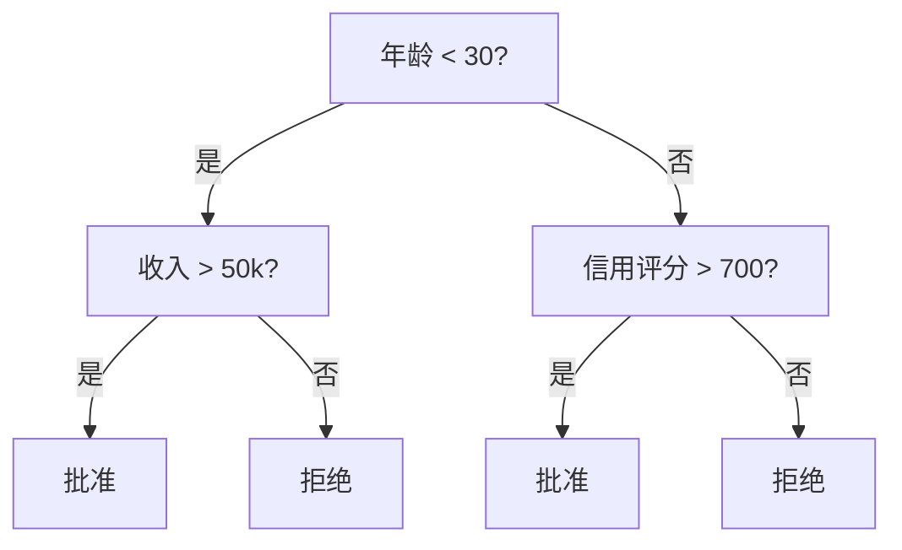
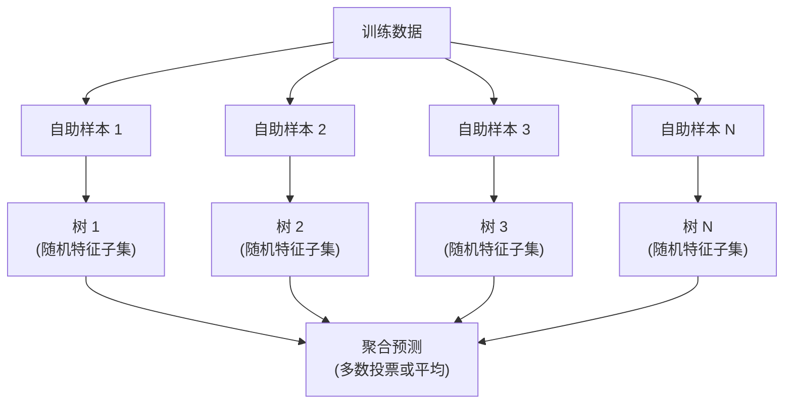

# 决策树与随机森林

> 决策树不过是一张流程图，但由它们组成的森林是机器学习中最强大的工具之一。

**类型:** 构建
**语言:** Python
**前置知识:** 第1阶段（第09节信息论、第06节概率）
**时间:** 约90分钟

## 学习目标

- 从零实现基尼不纯度、熵和信息增益的计算，以找到最优的决策树分裂点
- 构建带预剪枝控制（最大深度、最小样本数）的决策树分类器
- 使用自助采样和特征随机化构建随机森林，并解释它如何降低方差
- 比较MDI特征重要性与置换重要性，并识别MDI存在偏差的情况

## 问题背景

你面对的是表格数据。行是样本，列是特征，还有一个你想要预测的目标列。你可以用神经网络来处理。但对于表格数据，基于树的模型（决策树、随机森林、梯度提升树）的表现一致优于深度学习。在结构化数据上的Kaggle竞赛中，主导的是XGBoost和LightGBM，而非Transformer。

为什么？树模型无需预处理就能处理混合特征类型（数值型和分类型）。它们无需特征工程就能处理非线性关系。它们可解释：你可以查看树的结构，清楚地看到每个预测是如何得出的。而随机森林通过平均多棵树，对中等规模数据集上的过拟合具有高度抵抗力。

本教程从零开始使用递归分裂构建决策树，然后在此基础上构建随机森林。你将实现分裂准则背后的数学原理（基尼不纯度、熵、信息增益），并理解为什么弱学习器的集成能变成强学习器。

## 核心概念

### 决策树做什么

决策树通过一系列是/否问题将特征空间划分为矩形区域。



每个内部节点对特征进行阈值测试。每个叶节点做出预测。要对新数据点进行分类，从根节点开始，沿分支走直到到达叶节点。

树是自顶向下构建的，在每个节点选择最能分离数据的特征和阈值。"最佳"由分裂准则定义。

### 分裂准则：衡量不纯度

在每个节点，我们有一组样本。我们希望将它们分裂，使得子节点尽可能"纯"，即每个子节点主要包含一个类别。

**基尼不纯度**衡量如果按照该节点的类别分布来标记，随机选择的样本被错误分类的概率。

```
Gini(S) = 1 - sum(p_k^2)

其中 p_k 是集合S中类别k的比例。
```

对于纯节点（全为一个类别），Gini = 0。对于50/50类别的二分类，Gini = 0.5。越低越好。

```
示例：6只猫，4只狗

Gini = 1 - (0.6^2 + 0.4^2) = 1 - (0.36 + 0.16) = 0.48
```

**熵**衡量节点中的信息含量（无序程度）。在第1阶段第09节已讲解。

```
Entropy(S) = -sum(p_k * log2(p_k))
```

对于纯节点，熵 = 0。对于50/50二分类，熵 = 1.0。越低越好。

```
示例：6只猫，4只狗

Entropy = -(0.6 * log2(0.6) + 0.4 * log2(0.4))
        = -(0.6 * -0.737 + 0.4 * -1.322)
        = 0.442 + 0.529
        = 0.971 bits
```

**信息增益**是分裂后不纯度（熵或基尼）的减少量。

```
IG(S, feature, threshold) = Impurity(S) - weighted_avg(Impurity(S_left), Impurity(S_right))

其中权重是每个子节点中样本的比例。
```

贪心算法在每个节点：尝试每个特征和每个可能的阈值。选择使信息增益最大化的（特征，阈值）对。

### 分裂如何工作

对于具有n个特征和m个样本的数据集：

1. 对于每个特征j（j = 1到n）：
   - 按特征j对样本排序
   - 尝试每对连续不同值之间的中点作为阈值
   - 计算每个阈值的信息增益
2. 选择信息增益最高的特征和阈值
3. 将数据分为左侧（feature <= threshold）和右侧（feature > threshold）
4. 对每个子节点递归

这种贪心方法不能保证全局最优树。寻找最优树是NP-hard问题。但贪心分裂在实践中效果良好。

### 停止条件

如果没有停止条件，树会一直生长直到每个叶节点都是纯的（每个叶节点只有一个样本）。这会完美记忆训练数据但泛化能力极差。

**预剪枝**在树完全生长前停止它：
- 最大深度：当树达到设定深度时停止分裂
- 每个叶节点的最小样本数：如果节点样本少于k则停止
- 最小信息增益：如果最佳分裂的纯度改善低于阈值则停止
- 最大叶节点数：限制叶节点总数

**后剪枝**先完整生长树，然后修剪：
- 代价复杂度剪枝（scikit-learn使用）：增加与叶节点数成正比的惩罚。增加惩罚可获得较小的树
- 误差减少剪枝：如果验证误差不增加则移除子树

预剪枝更简单快速。后剪枝通常产生更好的树，因为它不会过早停止可能导致有用进一步分裂的分裂。

### 回归决策树

对于回归，叶节点的预测是该叶节点中目标值的均值。分裂准则也发生变化：

**方差减少**替换信息增益：

```
VR(S, feature, threshold) = Var(S) - weighted_avg(Var(S_left), Var(S_right))
```

选择使方差减少最多的分裂。树将输入空间划分为区域，并在每个区域预测一个常量（均值）。

### 随机森林：集成的威力

单个决策树具有高方差。数据的微小变化可能产生完全不同的树。随机森林通过平均多棵树来解决这个问题。



两个随机性来源使树多样化：

**Bagging（boostrap聚合）：** 每棵树在自助样本上训练，即从训练数据中有放回地随机采样。约63%的原始样本会出现在每个自助样本中（其余是OOB样本，可用于验证）。

**特征随机化：** 在每个分裂点，只考虑特征的随机子集。对于分类，默认值为sqrt(n_features)。对于回归，为n_features/3。这防止所有树都在同一个主导特征上分裂。

关键洞察：平均许多去相关的树可以在不增加偏差的情况下降低方差。每棵单独的树可能表现一般。但集成是强大的。

### 特征重要性

随机森林自然提供特征重要性评分。最常用的方法：

**平均不纯度减少（MDI）：** 对于每个特征，对所有使用该特征的节点汇总不纯度的总减少量。在较早分裂中产生更大不纯度减少的特征更重要。

```
importance(feature_j) = sum over all nodes where feature_j is used:
    (n_samples_at_node / n_total_samples) * impurity_decrease
```

这很快（训练时计算），但偏向高基数特征和有许多可能分裂点的特征。

**置换重要性**是替代方案：打乱一个特征的值并测量模型准确率下降的程度。更可靠但更慢。

### 何时树优于神经网络

在表格数据上，树和森林的表现优于神经网络。原因如下：

| 因素 | 树 | 神经网络 |
|------|-----|---------|
| 混合类型（数值+分类型） | 原生支持 | 需要编码 |
| 小数据集（< 10k行） | 效果好 | 过拟合 |
| 特征交互 | 通过分裂发现 | 需要架构设计 |
| 可解释性 | 完全透明 | 黑盒 |
| 训练时间 | 分钟级 | 小时级 |
| 超参数敏感性 | 低 | 高 |

当数据具有空间或序列结构时（图像、文本、音频），神经网络胜出的。对于平坦的特征表，树是默认选择。

```figure
decision-tree-depth
```

## 动手实现

### 步骤1：基尼不纯度和熵

从零实现两种分裂准则，并验证它们在判断哪些分裂好时达成一致。

```python
import math

def gini_impurity(labels):
    n = len(labels)
    if n == 0:
        return 0.0
    counts = {}
    for label in labels:
        counts[label] = counts.get(label, 0) + 1
    return 1.0 - sum((c / n) ** 2 for c in counts.values())

def entropy(labels):
    n = len(labels)
    if n == 0:
        return 0.0
    counts = {}
    for label in labels:
        counts[label] = counts.get(label, 0) + 1
    return -sum(
        (c / n) * math.log2(c / n) for c in counts.values() if c > 0
    )
```

### 步骤2：寻找最佳分裂

尝试每个特征和每个阈值。返回信息增益最高的那个。

```python
def information_gain(parent_labels, left_labels, right_labels, criterion="gini"):
    measure = gini_impurity if criterion == "gini" else entropy
    n = len(parent_labels)
    n_left = len(left_labels)
    n_right = len(right_labels)
    if n_left == 0 or n_right == 0:
        return 0.0
    parent_impurity = measure(parent_labels)
    child_impurity = (
        (n_left / n) * measure(left_labels) +
        (n_right / n) * measure(right_labels)
    )
    return parent_impurity - child_impurity
```

### 步骤3：构建DecisionTree类

递归分裂、预测和特征重要性追踪。`_build`是树的核心：当节点是纯的或触及预剪枝限制时停止，否则取最佳分裂并递归到两个子节点。

```python
import random

class DecisionTree:
    def __init__(self, max_depth=None, min_samples_split=2,
                 min_samples_leaf=1, criterion="gini",
                 max_features=None):
        self.max_depth = max_depth
        self.min_samples_split = min_samples_split
        self.min_samples_leaf = min_samples_leaf
        self.criterion = criterion
        self.max_features = max_features
        self.tree = None
        self.feature_importances_ = None

    def fit(self, X, y):
        self.n_features = len(X[0])
        self.feature_importances_ = [0.0] * self.n_features
        self.n_samples = len(X)
        self.tree = self._build(X, y, depth=0)
        total = sum(self.feature_importances_)
        if total > 0:
            self.feature_importances_ = [
                fi / total for fi in self.feature_importances_
            ]

    def predict(self, X):
        return [self._predict_one(x, self.tree) for x in X]

    def _build(self, X, y, depth):
        if len(set(y)) == 1:
            return {"leaf": True, "value": y[0]}

        if self.max_depth is not None and depth >= self.max_depth:
            return self._make_leaf(y)

        if len(y) < self.min_samples_split:
            return self._make_leaf(y)

        best_feature, best_threshold, best_gain = self._best_split(X, y)

        if best_feature is None or best_gain <= 0:
            return self._make_leaf(y)

        left_X, left_y, right_X, right_y = self._split_data(
            X, y, best_feature, best_threshold
        )

        if len(left_y) < self.min_samples_leaf or len(right_y) < self.min_samples_leaf:
            return self._make_leaf(y)

        weight = len(y) / self.n_samples
        self.feature_importances_[best_feature] += weight * best_gain

        return {
            "leaf": False,
            "feature": best_feature,
            "threshold": best_threshold,
            "left": self._build(left_X, left_y, depth + 1),
            "right": self._build(right_X, right_y, depth + 1),
        }

    def _make_leaf(self, y):
        counts = {}
        for label in y:
            counts[label] = counts.get(label, 0) + 1
        return {"leaf": True, "value": max(counts, key=counts.get)}

    def _best_split(self, X, y):
        best_feature = None
        best_threshold = None
        best_gain = -1.0

        if self.max_features == "sqrt":
            k = max(1, int(math.sqrt(self.n_features)))
            feature_indices = random.sample(range(self.n_features), k)
        elif isinstance(self.max_features, int):
            if self.max_features < 1:
                raise ValueError("max_features must be at least 1 when given as an integer")
            k = min(self.max_features, self.n_features)
            feature_indices = random.sample(range(self.n_features), k)
        else:
            feature_indices = list(range(self.n_features))

        for feature_idx in feature_indices:
            values = sorted(set(X[i][feature_idx] for i in range(len(X))))
            if len(values) <= 1:
                continue

            for i in range(len(values) - 1):
                threshold = (values[i] + values[i + 1]) / 2.0
                left_y = [y[j] for j in range(len(X)) if X[j][feature_idx] <= threshold]
                right_y = [y[j] for j in range(len(X)) if X[j][feature_idx] > threshold]

                if len(left_y) < self.min_samples_leaf or len(right_y) < self.min_samples_leaf:
                    continue

                gain = information_gain(y, left_y, right_y, self.criterion)
                if gain > best_gain:
                    best_gain = gain
                    best_feature = feature_idx
                    best_threshold = threshold

        return best_feature, best_threshold, best_gain

    def _split_data(self, X, y, feature, threshold):
        left_X, left_y, right_X, right_y = [], [], [], []
        for i in range(len(X)):
            if X[i][feature] <= threshold:
                left_X.append(X[i])
                left_y.append(y[i])
            else:
                right_X.append(X[i])
                right_y.append(y[i])
        return left_X, left_y, right_X, right_y

    def _predict_one(self, x, node):
        if node["leaf"]:
            return node["value"]
        if x[node["feature"]] <= node["threshold"]:
            return self._predict_one(x, node["left"])
        return self._predict_one(x, node["right"])
```

### 步骤4：构建RandomForest类

自助采样、特征随机化和多数投票。

```python
class RandomForest:
    def __init__(self, n_trees=100, max_depth=None,
                 min_samples_split=2, max_features="sqrt",
                 criterion="gini"):
        self.n_trees = n_trees
        self.max_depth = max_depth
        self.min_samples_split = min_samples_split
        self.max_features = max_features
        self.criterion = criterion
        self.trees = []

    def fit(self, X, y):
        n = len(X)
        for _ in range(self.n_trees):
            indices = [random.randint(0, n - 1) for _ in range(n)]
            X_boot = [X[i] for i in indices]
            y_boot = [y[i] for i in indices]
            tree = DecisionTree(
                max_depth=self.max_depth,
                min_samples_split=self.min_samples_split,
                max_features=self.max_features,
                criterion=self.criterion,
            )
            tree.fit(X_boot, y_boot)
            self.trees.append(tree)

    def predict(self, X):
        all_preds = [tree.predict(X) for tree in self.trees]
        predictions = []
        for i in range(len(X)):
            votes = {}
            for preds in all_preds:
                v = preds[i]
                votes[v] = votes.get(v, 0) + 1
            predictions.append(max(votes, key=votes.get))
        return predictions
```

参见 `code/trees.py` 获取包含所有辅助方法的完整实现。

## 使用指南

使用scikit-learn，训练随机森林只需三行：

```python
from sklearn.ensemble import RandomForestClassifier
from sklearn.datasets import load_iris
from sklearn.model_selection import train_test_split

X, y = load_iris(return_X_y=True)
X_train, X_test, y_train, y_test = train_test_split(X, y, random_state=42)

rf = RandomForestClassifier(n_estimators=100, random_state=42)
rf.fit(X_train, y_train)
print(f"Accuracy: {rf.score(X_test, y_test):.4f}")
print(f"Feature importances: {rf.feature_importances_}")
```

在实践中，梯度提升树（XGBoost、LightGBM、CatBoost）通常比随机森林更强，因为它们顺序构建树，每棵树修正前一棵树的错误。但随机森林更难配置错误，且几乎不需要超参数调优。

## 实战任务

本教程产出 `outputs/prompt-tree-interpreter.md` —— 一个用于向业务利益相关者解释决策树分裂的提示词。输入训练好的树的结构（深度、特征、分裂阈值、准确率），它将模型转化为自然语言规则、排名特征重要性、标记过拟合或数据泄露，并推荐下一步行动。当需要向非技术人员解释基于树的模型时使用。

## 练习

1. 在3类别的2D数据集上训练单棵决策树。手动追踪分裂过程并绘制矩形决策边界。比较max_depth=2与max_depth=10时的边界。

2. 实现回归树的方差减少分裂。生成y = sin(x) + noise的200个点并拟合你的回归树。绘制树的分段常数预测与真实曲线的对比。

3. 构建包含1、5、10、50和200棵树的随机森林。绘制训练准确率和测试准确率随树数量变化的曲线。观察测试准确率趋于平稳但不下降（森林抵抗过拟合）。

4. 在5个不同数据集上比较基尼不纯度与熵作为分裂准则。测量准确率和树深度。大多数情况下，它们产生几乎相同的结果。解释原因。

5. 实现置换重要性。在一个特征为随机噪声但具有高基数的数据集上比较它与MDI重要性。MDI会将噪声特征排名很高。置换重要性则不会。

## 关键术语

| 术语 | 人们常说 | 实际含义 |
|------|---------|---------|
| 决策树 | "用于预测的流程图" | 一种通过在特征空间中学习一系列if/else分裂来划分矩形区域的模型 |
| 基尼不纯度 | "节点有多混杂" | 在节点上随机样本被错误分类的概率。0表示纯，0.5表示二分类的最大不纯度 |
| 熵 | "节点的混乱程度" | 节点中的信息含量。0表示纯，1.0表示二分类的最大不确定性。来源于信息论 |
| 信息增益 | "分裂有多好" | 分裂后不纯度的减少量。选择分裂的贪心准则 |
| 预剪枝 | "提前停止树生长" | 通过设置最大深度、最小样本数或最小增益阈值来提前停止树的生长 |
| 后剪枝 | "之后修剪树" | 先完整生长树，然后移除不改善验证性能的子树 |
| Bagging | "在随机子集上训练" | 自助聚合。在每个不同随机样本上训练每个模型（有放回） |
| 随机森林 | "一堆树" | 决策树的集成，每棵树在包含随机特征子集的自助样本上训练 |
| 特征重要性（MDI） | "哪些特征重要" | 每个特征贡献的不纯度总减少量，在所有树和节点上求和 |
| 置换重要性 | "打乱并检查" | 当特征的值被随机打乱时的准确率下降。对于噪声特征比MDI更可靠 |
| 方差减少 | "信息增益的回归版本" | 回归树的类信息增益。选择使目标方差减少最多的分裂 |
| 自助样本 | "有重复的随机样本" | 从原始数据集中有放回地随机抽取的样本。大小相同，但包含重复项 |

## 延伸阅读

- [Breiman: Random Forests (2001)](https://link.springer.com/article/10.1023/A:1010933404324) - 随机森林原始论文
- [Grinsztajn et al.: Why do tree-based models still outperform deep learning on tabular data? (2022)](https://arxiv.org/abs/2207.08815) - 树模型与神经网络在表格任务上的严格比较
- [scikit-learn Decision Trees documentation](https://scikit-learn.org/stable/modules/tree.html) - 带有可视化工具的实用指南
- [XGBoost: A Scalable Tree Boosting System (Chen & Guestrin, 2016)](https://arxiv.org/abs/1603.02754) - 统治Kaggle的梯度提升论文
