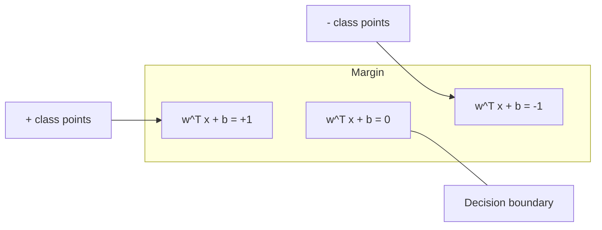
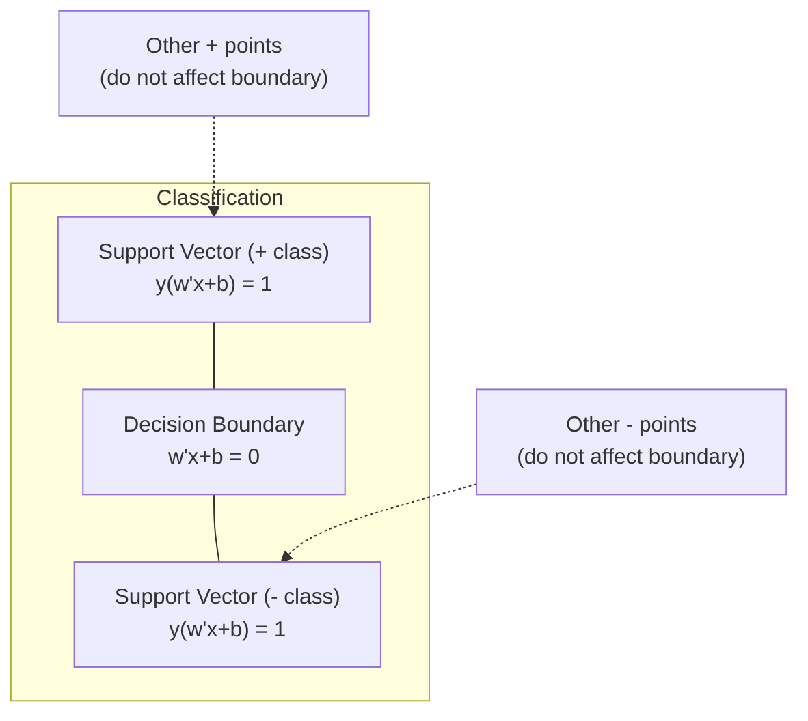
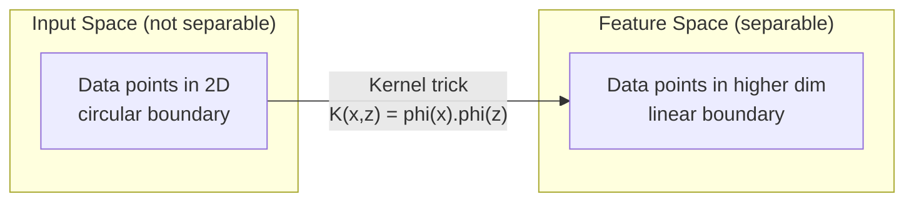

# 支持向量机

> 在两种类别之间找到最宽的街道。这就是全部思想。

**类型：** 构建
**语言：** Python
**前置课程：** 阶段1（第08课 优化、第14课 范数与距离、第18课 凸优化）
**时间：** ~90分钟

## 学习目标

- 使用铰链损失和梯度下降从零实现线性SVM（原始形式）
- 解释最大间隔原理，并从训练好的模型中识别支持向量
- 比较线性、多项式和RBF核函数，并解释核技巧如何避免显式的高维映射
- 评估C参数在间隔宽度和分类错误之间的权衡

## 问题描述

你有两类数据点，需要画一条线（或超平面）将它们分开。无数条线都可以做到。应该选哪一条？

间隔最大的那条。间隔是决策边界到两侧最近数据点之间的距离。更宽的间隔意味着分类器更有信心，对未见数据的泛化能力更好。

这种直觉引出了支持向量机（SVM），这是机器学习中最具数学优雅性的算法之一。SVM在深度学习之前一直是主导性的分类方法，并且仍然是小数据集、高维数据以及需要原理清晰、理论保障的模型时的最佳选择。

SVM与阶段1直接相关：优化是凸的（第18课），间隔用范数度量（第14课），核技巧利用点积来应对非线性边界，而无需在高维空间中计算。

## 核心概念

### 最大间隔分类器

给定标签 $y_i \in \{-1, +1\}$、特征向量为 $x_i$ 的线性可分数据，我们希望找到一个超平面 $w^T x + b = 0$ 来分隔两类。

点 $x_i$ 到超平面的距离为：

```
distance = |w^T x_i + b| / ||w||
```

对于正确分类的点：$y_i * (w^T x_i + b) > 0$。间隔是超平面到两侧最近点距离的两倍。



优化问题：

```
maximize    2 / ||w||     （间隔宽度）
subject to  y_i * (w^T x_i + b) >= 1  for all i
```

等价形式（最小化 $||w||^2$ 更容易优化）：

```
minimize    (1/2) ||w||^2
subject to  y_i * (w^T x_i + b) >= 1  for all i
```

这是一个凸二次规划问题，具有唯一的全局最优解。恰好位于间隔边界上的数据点（满足 $y_i * (w^T x_i + b) = 1$）就是支持向量。它们是决定决策边界的唯一点。移动或删除任何非支持向量点，边界都不会改变。

### 支持向量：关键少数



大多数训练点是无关的。只有支持向量才重要。这就是为什么SVM在预测时内存效率很高：你只需要存储支持向量，而不是整个训练集。

支持向量的数量也给出了泛化误差的上界。支持向量相对于数据集规模越少，泛化能力越好。

### 软间隔：用C参数处理噪声

真实数据很少是完美可分的。有些点可能位于边界另一侧，或进入间隔内部。软间隔公式通过引入松弛变量来允许违反。

```
minimize    (1/2) ||w||^2 + C * sum(xi_i)
subject to  y_i * (w^T x_i + b) >= 1 - xi_i
            xi_i >= 0  for all i
```

松弛变量 $\xi_i$ 度量点 $i$ 违反间隔的程度。C 控制权衡：

| C值 | 行为 |
|---------|----------|
| 大C | 对违反施加重罚。窄间隔，少分类错误。过拟合 |
| 小C | 允许更多违反。宽间隔，多分类错误。欠拟合 |

C 是正则化强度的倒数。大C = 少正则化。小C = 多正则化。

### 铰链损失：SVM的损失函数

软间隔SVM可以重写为无约束优化：

```
minimize    (1/2) ||w||^2 + C * sum(max(0, 1 - y_i * (w^T x_i + b)))
```

项 $\max(0, 1 - y_i * f(x_i))$ 就是铰链损失。当点被正确分类且位于间隔之外时为零。当点位于间隔内或被错误分类时呈线性。

```
单点的铰链损失：

loss
  |
  | \
  |  \
  |   \
  |    \
  |     \_______________
  |
  +-----|-----|-------->  y * f(x)
       0     1

当 y*f(x) >= 1 时损失为零（正确分类，间隔外）。
当 y*f(x) < 1 时为线性惩罚。
```

与逻辑损失（逻辑回归）比较：

```
铰链:     max(0, 1 - y*f(x))          在间隔处硬截断
逻辑:     log(1 + exp(-y*f(x)))        平滑，永远不会精确为零
```

铰链损失产生稀疏解（只有支持向量有非零贡献）。逻辑损失使用所有数据点。这使得SVM在预测时更加节省内存。

### 用梯度下降训练线性SVM

你可以使用梯度下降在铰链损失加上L2正则化的前提下训练线性SVM，无需求解约束QP：

```
L(w, b) = (lambda/2) * ||w||^2 + (1/n) * sum(max(0, 1 - y_i * (w^T x_i + b)))

对w的梯度：
  若 y_i * (w^T x_i + b) >= 1:  dL/dw = lambda * w
  若 y_i * (w^T x_i + b) < 1:   dL/dw = lambda * w - y_i * x_i

对b的梯度：
  若 y_i * (w^T x_i + b) >= 1:  dL/db = 0
  若 y_i * (w^T x_i + b) < 1:   dL/db = -y_i
```

这称为原始形式。每轮迭代的时间复杂度为 O(n * d)，其中 n 是样本数，d 是特征数。对于大规模、稀疏、高维数据（文本分类），这很快。

### 对偶形式与核技巧

SVM问题的Lagrangian对偶（来自阶段1第18课，KKT条件）为：

```
maximize    sum(alpha_i) - (1/2) * sum_ij(alpha_i * alpha_j * y_i * y_j * (x_i . x_j))
subject to  0 <= alpha_i <= C
            sum(alpha_i * y_i) = 0
```

对偶形式只涉及数据点之间的点积 $x_i . x_j$。这就是关键洞察。将每个点积替换为核函数 $K(x_i, x_j)$，SVM就能学习非线性边界，而无需显式计算变换。

```
线性核:          K(x, z) = x . z
多项式核:        K(x, z) = (x . z + c)^d
RBF（高斯）:     K(x, z) = exp(-gamma * ||x - z||^2)
```

RBF核将数据映射到无穷维空间。输入空间中接近的点核函数值接近1。相距远的点核函数值接近0。它可以学习任何平滑的决策边界。



核技巧在不真正进入高维空间的情况下计算那里的点积。对于D维空间中的d次多项式核，显式特征空间的维度为 $O(D^d)$。但 $K(x, z)$ 的计算时间为 $O(D)$。

### 用于回归的SVM（SVR）

支持向量回归在数据周围拟合一个宽度为 $\epsilon$ 的管。管内的点损失为零。管外的点受到线性惩罚。

```
minimize    (1/2) ||w||^2 + C * sum(xi_i + xi_i*)
subject to  y_i - (w^T x_i + b) <= epsilon + xi_i
            (w^T x_i + b) - y_i <= epsilon + xi_i*
            xi_i, xi_i* >= 0
```

$\epsilon$ 参数控制管的宽度。更宽的管 = 更少的支持向量 = 更平滑的拟合。更窄的管 = 更多的支持向量 = 更紧的拟合。

### 为什么SVM输给了深度学习（以及在哪些情况下仍然胜出）

SVM从1990年代末主导到2010年代初。深度学习在以下几个方面超越了它们：

| 因素 | SVM | 深度学习 |
|--------|------|---------------|
| 特征工程 | 需要 | 学习特征 |
| 可扩展性 | 核函数 $O(n^2)$ 到 $O(n^3)$ | SGD 每轮 $O(n)$ |
| 图像/文本/音频 | 需要手工特征 | 从原始数据学习 |
| 大数据集（>10万）| 慢 | 扩展性好 |
| GPU加速 | 收益有限 | 巨大提速 |

SVM在这些情况下仍然胜出：
- 小数据集（几百到几千样本）
- 高维稀疏数据（TF-IDF特征的文本）
- 需要数学保障（间隔边界）
- 训练时间必须最少（线性SVM非常快）
- 有明显间隔结构的二分类问题
- 异常检测（一类SVM）

```figure
svm-margin
```

## 构建实现

### 步骤1：铰链损失与梯度

基础。计算一个批次的铰链损失及其梯度。

```python
def hinge_loss(X, y, w, b):
    n = len(X)
    total_loss = 0.0
    for i in range(n):
        margin = y[i] * (dot(w, X[i]) + b)
        total_loss += max(0.0, 1.0 - margin)
    return total_loss / n
```

### 步骤2：通过梯度下降训练线性SVM

通过最小化正则化铰链损失来训练。不需要QP求解器。

```python
class LinearSVM:
    def __init__(self, lr=0.001, lambda_param=0.01, n_epochs=1000):
        self.lr = lr
        self.lambda_param = lambda_param
        self.n_epochs = n_epochs
        self.w = None
        self.b = 0.0

    def fit(self, X, y):
        n_features = len(X[0])
        self.w = [0.0] * n_features
        self.b = 0.0

        for epoch in range(self.n_epochs):
            for i in range(len(X)):
                margin = y[i] * (dot(self.w, X[i]) + self.b)
                if margin >= 1:
                    self.w = [wj - self.lr * self.lambda_param * wj
                              for wj in self.w]
                else:
                    self.w = [wj - self.lr * (self.lambda_param * wj - y[i] * X[i][j])
                              for j, wj in enumerate(self.w)]
                    self.b -= self.lr * (-y[i])

    def predict(self, X):
        return [1 if dot(self.w, x) + self.b >= 0 else -1 for x in X]
```

### 步骤3：核函数

实现线性、多项式和RBF核。

```python
def linear_kernel(x, z):
    return dot(x, z)

def polynomial_kernel(x, z, degree=3, c=1.0):
    return (dot(x, z) + c) ** degree

def rbf_kernel(x, z, gamma=0.5):
    diff = [xi - zi for xi, zi in zip(x, z)]
    return math.exp(-gamma * dot(diff, diff))
```

### 步骤4：间隔与支持向量识别

训练完成后，识别哪些点是支持向量并计算间隔宽度。

```python
def find_support_vectors(X, y, w, b, tol=1e-3):
    support_vectors = []
    for i in range(len(X)):
        margin = y[i] * (dot(w, X[i]) + b)
        if abs(margin - 1.0) < tol:
            support_vectors.append(i)
    return support_vectors
```

完整实现请参见 `code/svm.py`。

## 使用方式

使用 scikit-learn：

```python
from sklearn.svm import SVC, LinearSVC, SVR
from sklearn.preprocessing import StandardScaler
from sklearn.pipeline import Pipeline

clf = Pipeline([
    ("scaler", StandardScaler()),
    ("svm", SVC(kernel="rbf", C=1.0, gamma="scale")),
])
clf.fit(X_train, y_train)
print(f"Accuracy: {clf.score(X_test, y_test):.4f}")
print(f"Support vectors: {clf['svm'].n_support_}")
```

重要提示：训练SVM前务必缩放特征。SVM对特征量级敏感，因为间隔取决于 $||w||$，未缩放的特征会扭曲几何结构。

对于大数据集，使用 `LinearSVC`（原始形式，每轮 $O(n)$）而非 `SVC`（对偶形式，$O(n^2)$ 到 $O(n^3)$）：

```python
from sklearn.svm import LinearSVC

clf = Pipeline([
    ("scaler", StandardScaler()),
    ("svm", LinearSVC(C=1.0, max_iter=10000)),
])
```

## 练习

1. 生成一个2D线性可分数据集。训练你的LinearSVM并识别支持向量。验证支持向量确实是距离决策边界最近的点。

2. 在噪声数据集上将C从0.001变化到1000。绘制每个C值的决策边界。观察从宽间隔（欠拟合）到窄间隔（过拟合）的转变。

3. 创建一个类别边界为圆形的数据集（非线性）。展示线性SVM为何失败。计算RBF核矩阵，并证明类别在核诱导的特征空间中变为可分。

4. 在同一数据集上比较铰链损失与逻辑损失。训练线性SVM和逻辑回归。统计每个模型的决策边界由多少训练点贡献（支持向量 vs 所有点）。

5. 实现SVR（$\epsilon$-不敏感损失）。拟合 $y = \sin(x) + \text{noise}$。绘制预测周围的 $\epsilon$ 管，并高亮支持向量（管外的点）。

## 关键术语

| 术语 | 实际含义 |
|------|----------------------|
| 支持向量 | 距离决策边界最近的训练点。唯一决定超平面的点 |
| 间隔 | 决策边界与最近支持向量之间的距离。SVM最大化这个值 |
| 铰链损失 | $\max(0, 1 - y \cdot f(x))$。正确分类且在间隔外时为零。否则线性惩罚 |
| C参数 | 间隔宽度与分类错误之间的权衡。大C = 窄间隔，小C = 宽间隔 |
| 软间隔 | 通过松弛变量允许间隔违反的SVM公式。处理不可分数据 |
| 核技巧 | 在不显式映射到高维空间的情况下计算高维特征空间中的点积 |
| 线性核 | $K(x, z) = x \cdot z$。等价于标准点积。适用于线性可分数据 |
| RBF核 | $K(x, z) = \exp(-\gamma \cdot \|x-z\|^2)$。映射到无穷维。可学习任何平滑边界 |
| 多项式核 | $K(x, z) = (x \cdot z + c)^d$。映射到多项式组合的特征空间 |
| 对偶形式 | 仅依赖数据点间点积的SVM问题重构形式。启用核方法 |
| SVR | 支持向量回归。在数据周围拟合 $\epsilon$-管。管内点损失为零 |
| 松弛变量 | $\xi_i$：度量一个点违反间隔的程度。正确分类且在间隔外的点为零 |
| 最大间隔 | 选择使到每类最近点距离最大的超平面这一原则 |

## 延伸阅读

- [Vapnik: The Nature of Statistical Learning Theory (1995)](https://link.springer.com/book/10.1007/978-1-4757-3264-1) - SVM与统计学习理论的奠基之作
- [Cortes & Vapnik: Support-vector networks (1995)](https://link.springer.com/article/10.1007/BF00994018) - SVM原始论文
- [Platt: Sequential Minimal Optimization (1998)](https://www.microsoft.com/en-us/research/publication/sequential-minimal-optimization-a-fast-algorithm-for-training-support-vector-machines/) - 使SVM训练变得实用的SMO算法
- [scikit-learn SVM documentation](https://scikit-learn.org/stable/modules/svm.html) - 含实现细节的实践指南
- [LIBSVM: A Library for Support Vector Machines](https://www.csie.ntu.edu.tw/~cjlin/libsvm/) - 多数SVM实现背后的C++库
