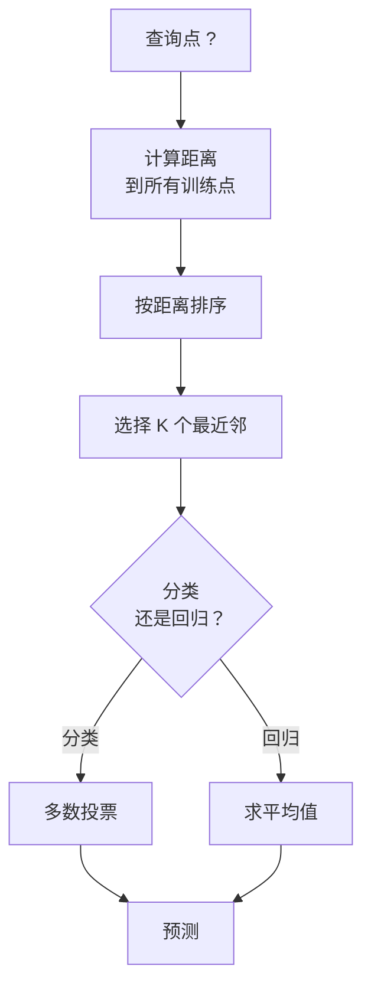
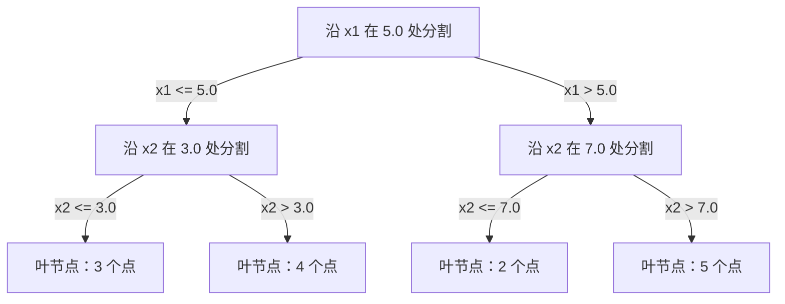

# K-Nearest Neighbors and Distances（K 最近邻与距离）

> 存储所有数据。通过查看邻居进行预测。真正有效的最简单算法。

**类型：** Build
**语言：** Python
**前置要求：** Phase 1（第 14 课 范数与距离）
**时间：** 约 90 分钟

## 学习目标

- 从零实现可配置 K 值和距离加权投票的 KNN 分类器与回归器
- 比较 L1、L2、余弦和闵可夫斯基距离度量，并根据数据类型选择合适的度量
- 解释维度灾难，并演示为何 KNN 在高维空间中性能退化
- 构建 KD-tree 以实现高效的最近邻搜索，并分析其何时优于暴力搜索

## 问题描述

你有一个数据集。一个新数据点到达。你需要对它进行分类或预测其值。与线性回归或 SVM 等方法不同，KNN 不从数据中学习参数，而是找到距离新点最近的 K 个训练点，让它们在投票。

这就是 K 最近邻（KNN）。没有训练阶段。没有需要学习的参数。没有需要最小化的损失函数。你存储整个训练集，在预测时计算距离。

这听起来太简单而不可能有效。但 KNN 在许多问题上 surprisingly 具有竞争力，尤其是小到中等规模数据集。深入理解 KNN 揭示了基本概念：距离度量的选择（与 Phase 1 第 14 课相连）、维度灾难，以及惰性学习与急切学习的区别。

KNN 也广泛出现在现代 AI 中，只是换了名字。向量数据库对嵌入向量做 KNN 搜索。检索增强生成（RAG）查找 K 个最近的文档片段。推荐系统寻找相似的用户或物品。算法是相同的，只是规模和数据结构不同。

## 概念解析

### KNN 工作原理

给定一个带标签点数据集和一个新的查询点：

1. 计算查询点到数据集中每个点的距离
2. 按距离排序
3. 取 K 个最近的点
4. 对于分类：K 个邻居中多数投票
5. 对于回归：K 个邻居值的平均（或加权平均）



这就是整个算法。无需拟合。无需梯度下降。无需训练轮次。

### 选择 K 值

K 是唯一超参数。它控制偏差-方差权衡：

| K | 行为 |
|---|----------|
| K = 1 | 决策边界跟随每个点。训练误差为零。高方差。过拟合 |
| 小 K（3-5）| 对局部结构敏感。可捕获复杂边界 |
| 大 K | 更平滑的边界。对噪声更鲁棒。可能欠拟合 |
| K = N | 对所有点预测多数类。最大偏差 |

一个常见的起点是 K = sqrt(N)，其中 N 是数据集的点数。对于二分类，使用奇数 K 以避免平票。


### 距离度量

距离函数定义了"近"的含义。不同的度量产生不同的邻居和不同的预测。

**L2（欧氏距离）** 是默认选择。直线距离。

```
d(a, b) = sqrt(sum((a_i - b_i)^2))
```

对特征尺度敏感。使用 L2 与 KNN 前，务必标准化特征。

**L1（曼哈顿距离）** 对各维度绝对差求和。比 L2 对异常值更鲁棒，因为它不对差值平方。

```
d(a, b) = sum(|a_i - b_i|)
```

**余弦距离** 衡量向量之间的夹角，忽略幅度。对于文本和嵌入数据至关重要。

```
d(a, b) = 1 - (a . b) / (||a|| * ||b||)
```

**闵可夫斯基距离** 用参数 p 泛化 L1 和 L2。

```
d(a, b) = (sum(|a_i - b_i|^p))^(1/p)

p=1: 曼哈顿距离
p=2: 欧氏距离
p->inf: 切比雪夫距离（最大绝对差）
```

选择哪个度量取决于数据：

| 数据类型 | 最佳度量 | 原因 |
|-----------|------------|-----|
| 数值特征，尺度相近 | L2（欧氏距离）| 默认，适用于空间数据 |
| 数值特征，含异常值 | L1（曼哈顿距离）| 鲁棒，不放大大的差异 |
| 文本嵌入 | 余弦距离 | 幅度是噪声，方向才是语义 |
| 高维稀疏 | 余弦距离或 L1 | L2 受维度灾难影响 |
| 混合类型 | 自定义距离 | 按特征类型组合度量 |

### 加权 KNN

标准 KNN 对所有 K 个邻居赋予相等权重。但距离为 0.1 的邻居应比距离为 5.0 的邻居更重要。

**距离加权 KNN** 按距离倒数给每个邻居加权：

```
weight_i = 1 / (distance_i + epsilon)

对于分类：加权投票
对于回归：     加权平均 = sum(w_i * y_i) / sum(w_i)
```

epsilon 防止在查询点恰好与某个训练点重合时除以零。

加权 KNN 对 K 值的选择不那么敏感，因为远距离邻居无论怎样都贡献很少。

### 维度灾难

KNN 性能在高维空间中会退化。这不是模糊的担忧，而是数学事实。

**问题 1：距离收敛。** 随着维度增加，最大距离与最小距离之比趋近于 1。所有点都变得与查询点"同样远"。

```
在 d 维空间中，对于随机均匀分布的点：

d=2:    max_dist / min_dist = 变化很大
d=100:  max_dist / min_dist ~ 1.01
d=1000: max_dist / min_dist ~ 1.001

当所有距离几乎相等时，"最近"就失去了意义。
```

**问题 2：体积爆炸。** 要在固定比例的数据内捕获 K 个邻居，你需要扩展搜索半径以覆盖特征空间的更大比例。高维空间中的"邻域"涵盖了大部分空间。

**问题 3：角落占主导。** 在 d 维单位超立方体中，大部分体积集中在角落附近，而不是中心。内切球体占的体积分数随 d 增大而趋近于零。

实际影响：KNN 在约 20-50 个特征以内表现良好。超过这个范围，应用 KNN 前需要降维（PCA、UMAP、t-SNE），或使用利用数据内在低维性的树状搜索结构。

### KD-tree：快速最近邻搜索

暴力 KNN 对每个查询点计算到所有训练点的距离。每次查询是 O(n * d)。对于大规模数据集，这太慢了。

KD-tree 沿特征轴递归划分空间。在每一层，它在中位数值处沿一个维度分割。



查找最近邻时，遍历到包含查询点的叶节点，然后回溯并仅检查可能包含更近点的相邻分区。

平均查询时间：低维时为 O(log n)。但在高维时（d > 20），KD-tree 退化为 O(n)，因为回溯剪枝的分支越来越少。

### Ball Tree：更适合中等维度

Ball Tree 将数据划分为嵌套超球体而非轴对齐的盒子。每个节点定义一个包含该子树中所有点的球体（中心 + 半径）。

相比 KD-tree 的优势：
- 在中等维度表现更好（约到 50 维）
- 处理非轴对齐的结构
- 更紧的包围体积意味着搜索时能剪枝更多分支

KD-tree 和 Ball Tree 都是精确算法。对于真正的大规模搜索（数百万点，数百维），使用近似最近邻方法（HNSW、IVF、乘积量化）。这些内容在 Phase 1 第 14 课中覆盖。

### 惰性学习 vs 急切学习

KNN 是惰性学习者：训练时不做任何工作，预测时做所有工作。大多数其他算法（线性回归、SVM、神经网络）是急切学习者：它们在训练时进行大量计算以构建紧凑模型，然后预测很快。

| 方面 | 惰性（KNN）| 急切（SVM、神经网络）|
|--------|------------|------------------------|
| 训练时间 | O(1)，仅存储数据 | O(n * epochs) |
| 预测时间 | 每次查询 O(n * d) | O(d) 或 O(参数数量) |
| 预测时内存 | 存储整个训练集 | 仅存储模型参数 |
| 适应新数据 | 即时添加点 | 重新训练模型 |
| 决策边界 | 隐式，现场计算 | 显式，训练后固定 |

惰性学习在以下情况理想：
- 数据集频繁变化（无需重新训练即可添加/移除点）
- 需要预测的查询很少
- 希望零训练时间
- 数据集足够小，暴力搜索很快

### KNN 用于回归

KNN 回归不像分类那样进行多数投票，而是对 K 个邻居的目标值求平均。

```
prediction = (1/K) * sum(y_i for i in K nearest neighbors)

或使用距离加权：
prediction = sum(w_i * y_i) / sum(w_i)
其中 w_i = 1 / distance_i
```

KNN 回归产生分段常数（或带加权时分段平滑）的预测。它无法外推到训练数据范围之外。如果训练目标值都在 0 到 100 之间，KNN 永远不会预测 200。

```figure
knn-smoothness
```

## 动手实现

### 步骤 1：距离函数

实现 L1、L2、余弦和闵可夫斯基距离。这些直接连接到 Phase 1 第 14 课。

```python
import math

def l2_distance(a, b):
    return math.sqrt(sum((ai - bi) ** 2 for ai, bi in zip(a, b)))

def l1_distance(a, b):
    return sum(abs(ai - bi) for ai, bi in zip(a, b))

def cosine_distance(a, b):
    dot_val = sum(ai * bi for ai, bi in zip(a, b))
    norm_a = math.sqrt(sum(ai ** 2 for ai in a))
    norm_b = math.sqrt(sum(bi ** 2 for bi in b))
    if norm_a == 0 or norm_b == 0:
        return 1.0
    return 1.0 - dot_val / (norm_a * norm_b)

def minkowski_distance(a, b, p=2):
    if p == float('inf'):
        return max(abs(ai - bi) for ai, bi in zip(a, b))
    return sum(abs(ai - bi) ** p for ai, bi in zip(a, b)) ** (1 / p)
```

### 步骤 2：KNN 分类器与回归器

构建完整的 KNN，支持可配置的 K、距离度量和可选的距离加权。

```python
class KNN:
    def __init__(self, k=5, distance_fn=l2_distance, weighted=False,
                 task="classification"):
        self.k = k
        self.distance_fn = distance_fn
        self.weighted = weighted
        self.task = task
        self.X_train = None
        self.y_train = None

    def fit(self, X, y):
        self.X_train = X
        self.y_train = y

    def predict(self, X):
        return [self._predict_one(x) for x in X]
```

### 步骤 3：用于高效搜索的 KD-tree

从零构建一个 KD-tree，递归地在每个维度的中位数处分割。

```python
class KDTree:
    def __init__(self, X, indices=None, depth=0):
        # 递归划分数据
        self.axis = depth % len(X[0])
        # 沿当前轴的中位数分割
        ...

    def query(self, point, k=1):
        # 遍历到叶节点，然后回溯
        ...
```

完整实现（含所有辅助方法和演示）见 `code/knn.py`。

### 步骤 4：特征缩放

KNN 需要特征缩放，因为距离对特征幅度敏感。范围 0 到 1000 的特征会主导范围 0 到 1 的特征。

```python
def standardize(X):
    n = len(X)
    d = len(X[0])
    means = [sum(X[i][j] for i in range(n)) / n for j in range(d)]
    stds = [
        max(1e-10, (sum((X[i][j] - means[j]) ** 2 for i in range(n)) / n) ** 0.5)
        for j in range(d)
    ]
    return [[((X[i][j] - means[j]) / stds[j]) for j in range(d)] for i in range(n)], means, stds
```

## 使用它

使用 scikit-learn：

```python
from sklearn.neighbors import KNeighborsClassifier
from sklearn.preprocessing import StandardScaler
from sklearn.pipeline import Pipeline

clf = Pipeline([
    ("scaler", StandardScaler()),
    ("knn", KNeighborsClassifier(n_neighbors=5, metric="euclidean")),
])
clf.fit(X_train, y_train)
print(f"Accuracy: {clf.score(X_test, y_test):.4f}")
```

当数据集足够大且维度足够低时，scikit-learn 会自动使用 KD-tree 或 Ball Tree。对于高维数据，它会回退到暴力搜索。你可以通过 `algorithm` 参数控制此行为。

对于大规模最近邻搜索（百万级向量），使用 FAISS、Annoy 或向量数据库：

```python
import faiss

index = faiss.IndexFlatL2(dimension)
index.add(embeddings)
distances, indices = index.search(query_vectors, k=5)
```

## 练习题

1. 在 2D 数据集上实现 KNN 分类（3 个类别）。绘制 K=1、K=5、K=15 和 K=N 的决策边界。观察从过拟合到欠拟合的过渡。

2. 生成 1000 个随机点，维度分别为 2、5、10、50、100 和 500。对于每个维度，计算最大成对距离与最小成对距离的比值。绘制比值与维度的关系图，以可视化维度灾难。

3. 在文本分类问题（使用 TF-IDF 向量）上比较 L1、L2 和余弦距离的 KNN。哪个度量给出最高的准确率？为什么余弦距离在文本任务上往往更优？

4. 实现 KD-tree，并在 2D、10D 和 50D 的 1k、10k 和 100k 点数据集上测量查询时间与暴力搜索的对比。KD-tree 在多少维度时不再比暴力搜索更快？

5. 构建加权 KNN 回归器用于 y = sin(x) + noise。与 K=3、10、30 的未加权 KNN 比较。展示加权如何产生更平滑的预测，尤其在大 K 值时。

## 关键术语

| 术语 | 实际含义 |
|------|----------------------|
| K-nearest neighbors（K 最近邻）| 非参数算法，通过查找距离查询点最近的 K 个训练点进行预测 |
| Lazy learning（惰性学习）| 训练时不做计算。所有工作发生在预测时。KNN 是典型示例 |
| Eager learning（急切学习）| 训练时进行大量计算以构建紧凑模型。大多数 ML 算法是急切学习 |
| Curse of dimensionality（维度灾难）| 在高维空间中，距离收敛且邻域扩展以覆盖大部分空间，使 KNN 失效 |
| KD-tree | 沿特征轴递归划分空间的二叉树。低维时查询为 O(log n) |
| Ball tree | 嵌套超球体的树结构。在中等维度（约到 50 维）下比 KD-tree 表现更好 |
| Weighted KNN（加权 KNN）| 邻居按距离倒数加权。更近的邻居对预测影响更大 |
| Feature scaling（特征缩放）| 将特征归一化到可比范围。距离基方法（如 KNN）必需 |
| Majority vote（多数投票）| 通过计数 K 个邻居中最常见的类别进行分类 |
| Brute force search（暴力搜索）| 计算到每个训练点的距离。每次查询 O(n*d)。精确但大 n 时慢 |
| Approximate nearest neighbor（近似最近邻）| （HNSW、LSH、IVF）等算法，比精确搜索快得多地找到近似最近点 |
| Voronoi diagram（Voronoi 图）| 空间划分，每个区域包含比到其他训练点更接近某个训练点的所有点。K=1 的 KNN 产生 Voronoi 边界 |

## 延伸阅读

- [Cover & Hart: Nearest Neighbor Pattern Classification (1967)](https://ieeexplore.ieee.org/document/1053964) - KNN 奠基论文，证明其误差率最多是贝叶斯最优的两倍
- [Friedman, Bentley, Finkel: An Algorithm for Finding Best Matches in Logarithmic Expected Time (1977)](https://dl.acm.org/doi/10.1145/355744.355745) - 原始 KD-tree 论文
- [Beyer et al.: When Is "Nearest Neighbor" Meaningful? (1999)](https://link.springer.com/chapter/10.1007/3-540-49257-7_15) - 最近邻维度灾难的形式化分析
- [scikit-learn Nearest Neighbors documentation](https://scikit-learn.org/stable/modules/neighbors.html) - 含算法选择的实用指南
- [FAISS: A Library for Efficient Similarity Search](https://github.com/facebookresearch/faiss) - Meta 的十亿级近似最近邻搜索库
