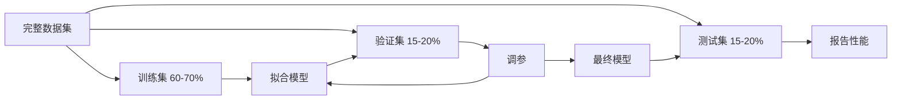

# 模型评估

> 模型的好坏取决于你如何衡量它。

**类型：** 构建
**语言：** Python
**前置知识：** 第 1 阶段（概率与分布、机器学习统计），第 2 阶段课程 1-8
**时间：** 约 90 分钟

## 学习目标

- 从零实现 K 折交叉验证和分层 K 折交叉验证，并解释为何对不均衡数据需要分层
- 从零计算精确率、召回率、F1、AUC-ROC 以及回归指标（MSE、RMSE、MAE、R²）
- 解读学习曲线以诊断模型是存在高偏差还是高方差
- 识别常见的评估错误，包括数据泄漏、指标选择和测试集污染

## 问题

你训练了一个模型，它在你的数据上获得了 95% 的准确率。它好吗？

也许好，也许不好。如果 95% 的数据属于同一个类别，一个总是预测该类别的模型也能获得 95% 的准确率，但实际上完全没用。如果你在用于训练的数据上做了评估，那 95% 的数字毫无意义，因为模型只是记住了答案。如果你的数据集有时间成分且在划分前进行了随机打乱，模型可能会利用未来的数据来预测过去。

模型评估是大多数 ML 项目出错的地方。错误的指标会让坏模型看起来不错。错误的划分会让模型作弊。错误的比较会让你选择更差的模型。评估做对不是可选项，它是模型在生产环境中正常工作与一见到真实数据就失败之间的区别。

## 概念

### 训练集、验证集、测试集



三个划分，三种用途：

- **训练集**：模型从这些数据中学习。训练期间模型会看到这些样本。
- **验证集**：用于调参和模型选择。模型不会在上面训练，但你的决策会受到它的影响。
- **测试集**：只在最后被触碰一次，用来报告最终性能。如果你看了测试集性能后又回去改模型，它就不再是测试集了，它变成了第二个验证集。

测试集是你最后的保证，确保报告的性能反映的是模型在真正未见过的数据上的表现。

### K 折交叉验证

对于小规模数据集，单一的 train/validation 划分会浪费数据且给出嘈杂的估计。K 折交叉验证让所有数据都同时用于训练和验证：


1. 将数据划分为 K 个等大小的折
2. 对于每个折，在 K-1 个折上训练，在剩余的一个折上验证
3. 对 K 个验证分数求平均

K=5 或 K=10 是标准选择。每个数据点都会被用作验证数据恰好一次。平均分数比任何单一划分都更稳定。

**分层 K 折**：保留每个折中的类别分布。如果数据集 70% 是 A 类、30% 是 B 类，那么每个折都会有大致相同的比例。这对不均衡数据集很重要，因为随机划分可能会把所有少数类样本放在同一个折里。

### 分类指标

**混淆矩阵**：基础。对于二分类：

|  | 预测为正 | 预测为负 |
|--|---|---|
| 实际为正 | 真阳性 (TP) | 假阴性 (FN) |
| 实际为负 | 假阳性 (FP) | 真阴性 (TN) |

从这个矩阵出发，所有其他指标都随之而来：

- **准确率（Accuracy）** = (TP + TN) / (TP + TN + FP + FN)。正确预测的占比。当类别不均衡时会误导。
- **精确率（Precision）** = TP / (TP + FP)。在所有被预测为正的东西中，有多少真的是正类？当假阳性代价很高时使用（如垃圾邮件过滤器把正常邮件判为垃圾邮件）。
- **召回率（Recall，灵敏度）** = TP / (TP + FN)。在所有真正的正例中，我们抓到了多少？当假阴性代价很高时使用（如癌症筛查漏掉肿瘤）。
- **F1 分数** = 2 * precision * recall / (precision + recall)。精确率和召回率的调和平均。当两者都没有明显占优时平衡二者。
- **AUC-ROC**：受试者工作特征曲线下面积。在不同分类阈值下绘制真阳性率与假阳性率的关系。AUC = 0.5 表示随机猜测，AUC = 1.0 表示完美分离。与阈值无关：它衡量的是模型将正类排到负类之上的能力，而不管你选取哪个截断点。

### 回归指标

- **MSE（均方误差）** = mean((y_true - y_pred)²)。对大误差进行平方惩罚。对异常值敏感。
- **RMSE（均方根误差）** = sqrt(MSE)。与目标变量单位相同。比 MSE 更容易解释。
- **MAE（平均绝对误差）** = mean(|y_true - y_pred|)。对所有误差线性处理。比 MSE 对异常值更稳健。
- **R²（决定系数）** = 1 - SS_res / SS_tot，其中 SS_res = sum((y_true - y_pred)²)，SS_tot = sum((y_true - y_mean)²)。模型解释的方差比例。R² = 1.0 为完美。R² = 0.0 意味着模型不比总是预测均值更好。如果模型比均值还差，R² 可以为负。

### 学习曲线

以训练集大小为横轴，绘制训练分数和验证分数：

- **高偏差（欠拟合）**：两条曲线都收敛到较低的分数。增加更多数据不会有帮助。你需要一个更复杂的模型。
- **高方差（过拟合）**：训练分数很高但验证分数低很多。两者之间的差距很大。增加更多数据应该会有帮助。

### 验证曲线

以超参数为横轴，绘制训练分数和验证分数：

- 低复杂度时：两条分数都低（欠拟合）
- 合适的复杂度时：两条分数都高且接近
- 高复杂度时：训练分数保持高位但验证分数下降（过拟合）

最优超参数值是验证分数达到峰值的位置。

### 常见评估错误

**数据泄漏**：测试集的信息泄漏到了训练中。例子：在划分之前对整个数据集拟合标准化器、时间序列预测中包含未来数据、使用从目标派生的特征。始终先划分，再预处理。

**类别不均衡**：99% 的交易是合法的，1% 是欺诈。总是预测"合法"的模型能获得 99% 的准确率。改用精确率、召回率、F1 或 AUC-ROC。

**错误的指标**：本应优化召回率时却优化准确率（医学诊断），或本应使用 MAE 时却优化 RMSE（数据有重尾异常值）。

**未使用分层划分**：对于不均衡数据，随机划分可能会让验证折中少数类样本极少，导致估计不稳定。

**频繁测试**：每次查看测试集性能并调整，都会导致对测试集的过拟合。测试集只能使用一次。

```figure
precision-recall-threshold
```

## 动手实现

### 步骤 1：训练/验证/测试集划分

```python
import random
import math


def train_val_test_split(X, y, train_ratio=0.6, val_ratio=0.2, seed=42):
    random.seed(seed)
    n = len(X)
    indices = list(range(n))
    random.shuffle(indices)

    train_end = int(n * train_ratio)
    val_end = int(n * (train_ratio + val_ratio))

    train_idx = indices[:train_end]
    val_idx = indices[train_end:val_end]
    test_idx = indices[val_end:]

    X_train = [X[i] for i in train_idx]
    y_train = [y[i] for i in train_idx]
    X_val = [X[i] for i in val_idx]
    y_val = [y[i] for i in val_idx]
    X_test = [X[i] for i in test_idx]
    y_test = [y[i] for i in test_idx]

    return X_train, y_train, X_val, y_val, X_test, y_test
```

### 步骤 2：K 折和分层 K 折交叉验证

```python
def kfold_split(n, k=5, seed=42):
    random.seed(seed)
    indices = list(range(n))
    random.shuffle(indices)

    fold_size = n // k
    folds = []

    for i in range(k):
        start = i * fold_size
        end = start + fold_size if i < k - 1 else n
        val_idx = indices[start:end]
        train_idx = indices[:start] + indices[end:]
        folds.append((train_idx, val_idx))

    return folds


def stratified_kfold_split(y, k=5, seed=42):
    random.seed(seed)

    class_indices = {}
    for i, label in enumerate(y):
        class_indices.setdefault(label, []).append(i)

    for label in class_indices:
        random.shuffle(class_indices[label])

    folds = [{"train": [], "val": []} for _ in range(k)]

    for label, indices in class_indices.items():
        fold_size = len(indices) // k
        for i in range(k):
            start = i * fold_size
            end = start + fold_size if i < k - 1 else len(indices)
            val_part = indices[start:end]
            train_part = indices[:start] + indices[end:]
            folds[i]["val"].extend(val_part)
            folds[i]["train"].extend(train_part)

    return [(f["train"], f["val"]) for f in folds]


def cross_validate(X, y, model_fn, k=5, metric_fn=None, stratified=False):
    n = len(X)

    if stratified:
        folds = stratified_kfold_split(y, k)
    else:
        folds = kfold_split(n, k)

    scores = []
    for train_idx, val_idx in folds:
        X_train = [X[i] for i in train_idx]
        y_train = [y[i] for i in train_idx]
        X_val = [X[i] for i in val_idx]
        y_val = [y[i] for i in val_idx]

        model = model_fn()
        model.fit(X_train, y_train)
        predictions = [model.predict(x) for x in X_val]

        if metric_fn:
            score = metric_fn(y_val, predictions)
        else:
            score = sum(1 for yt, yp in zip(y_val, predictions) if yt == yp) / len(y_val)
        scores.append(score)

    return scores
```

### 步骤 3：混淆矩阵与分类指标

```python
def confusion_matrix(y_true, y_pred):
    tp = sum(1 for yt, yp in zip(y_true, y_pred) if yt == 1 and yp == 1)
    tn = sum(1 for yt, yp in zip(y_true, y_pred) if yt == 0 and yp == 0)
    fp = sum(1 for yt, yp in zip(y_true, y_pred) if yt == 0 and yp == 1)
    fn = sum(1 for yt, yp in zip(y_true, y_pred) if yt == 1 and yp == 0)
    return tp, tn, fp, fn


def accuracy(y_true, y_pred):
    tp, tn, fp, fn = confusion_matrix(y_true, y_pred)
    total = tp + tn + fp + fn
    return (tp + tn) / total if total > 0 else 0.0


def precision(y_true, y_pred):
    tp, tn, fp, fn = confusion_matrix(y_true, y_pred)
    return tp / (tp + fp) if (tp + fp) > 0 else 0.0


def recall(y_true, y_pred):
    tp, tn, fp, fn = confusion_matrix(y_true, y_pred)
    return tp / (tp + fn) if (tp + fn) > 0 else 0.0


def f1_score(y_true, y_pred):
    p = precision(y_true, y_pred)
    r = recall(y_true, y_pred)
    return 2 * p * r / (p + r) if (p + r) > 0 else 0.0


def roc_curve(y_true, y_scores):
    thresholds = sorted(set(y_scores), reverse=True)
    tpr_list = []
    fpr_list = []

    total_positives = sum(y_true)
    total_negatives = len(y_true) - total_positives

    for threshold in thresholds:
        y_pred = [1 if s >= threshold else 0 for s in y_scores]
        tp = sum(1 for yt, yp in zip(y_true, y_pred) if yt == 1 and yp == 1)
        fp = sum(1 for yt, yp in zip(y_true, y_pred) if yt == 0 and yp == 1)

        tpr = tp / total_positives if total_positives > 0 else 0.0
        fpr = fp / total_negatives if total_negatives > 0 else 0.0

        tpr_list.append(tpr)
        fpr_list.append(fpr)

    return fpr_list, tpr_list, thresholds


def auc_roc(y_true, y_scores):
    fpr_list, tpr_list, _ = roc_curve(y_true, y_scores)

    pairs = sorted(zip(fpr_list, tpr_list))
    fpr_sorted = [p[0] for p in pairs]
    tpr_sorted = [p[1] for p in pairs]

    area = 0.0
    for i in range(1, len(fpr_sorted)):
        width = fpr_sorted[i] - fpr_sorted[i - 1]
        height = (tpr_sorted[i] + tpr_sorted[i - 1]) / 2
        area += width * height

    return area
```

### 步骤 4：回归指标

```python
def mse(y_true, y_pred):
    n = len(y_true)
    return sum((yt - yp) ** 2 for yt, yp in zip(y_true, y_pred)) / n


def rmse(y_true, y_pred):
    return math.sqrt(mse(y_true, y_pred))


def mae(y_true, y_pred):
    n = len(y_true)
    return sum(abs(yt - yp) for yt, yp in zip(y_true, y_pred)) / n


def r_squared(y_true, y_pred):
    mean_y = sum(y_true) / len(y_true)
    ss_res = sum((yt - yp) ** 2 for yt, yp in zip(y_true, y_pred))
    ss_tot = sum((yt - mean_y) ** 2 for yt in y_true)
    if ss_tot == 0:
        return 0.0
    return 1.0 - ss_res / ss_tot
```

### 步骤 5：学习曲线

```python
def learning_curve(X, y, model_fn, metric_fn, train_sizes=None, val_ratio=0.2, seed=42):
    random.seed(seed)
    n = len(X)
    indices = list(range(n))
    random.shuffle(indices)

    val_size = int(n * val_ratio)
    val_idx = indices[:val_size]
    pool_idx = indices[val_size:]

    X_val = [X[i] for i in val_idx]
    y_val = [y[i] for i in val_idx]

    if train_sizes is None:
        train_sizes = [int(len(pool_idx) * r) for r in [0.1, 0.2, 0.4, 0.6, 0.8, 1.0]]

    train_scores = []
    val_scores = []

    for size in train_sizes:
        subset = pool_idx[:size]
        X_train = [X[i] for i in subset]
        y_train = [y[i] for i in subset]

        model = model_fn()
        model.fit(X_train, y_train)

        train_pred = [model.predict(x) for x in X_train]
        val_pred = [model.predict(x) for x in X_val]

        train_scores.append(metric_fn(y_train, train_pred))
        val_scores.append(metric_fn(y_val, val_pred))

    return train_sizes, train_scores, val_scores
```

### 步骤 6：一个简单的分类器用于测试，以及完整演示

```python
class SimpleLogistic:
    def __init__(self, lr=0.1, epochs=100):
        self.lr = lr
        self.epochs = epochs
        self.weights = None
        self.bias = 0.0

    def sigmoid(self, z):
        z = max(-500, min(500, z))
        return 1.0 / (1.0 + math.exp(-z))

    def fit(self, X, y):
        n_features = len(X[0])
        self.weights = [0.0] * n_features
        self.bias = 0.0

        for _ in range(self.epochs):
            for xi, yi in zip(X, y):
                z = sum(w * x for w, x in zip(self.weights, xi)) + self.bias
                pred = self.sigmoid(z)
                error = yi - pred
                for j in range(n_features):
                    self.weights[j] += self.lr * error * xi[j]
                self.bias += self.lr * error

    def predict_proba(self, x):
        z = sum(w * xi for w, xi in zip(self.weights, x)) + self.bias
        return self.sigmoid(z)

    def predict(self, x):
        return 1 if self.predict_proba(x) >= 0.5 else 0


class SimpleLinearRegression:
    def __init__(self, lr=0.001, epochs=200):
        self.lr = lr
        self.epochs = epochs
        self.weights = None
        self.bias = 0.0

    def fit(self, X, y):
        n_features = len(X[0])
        self.weights = [0.0] * n_features
        self.bias = 0.0
        n = len(X)

        for _ in range(self.epochs):
            for xi, yi in zip(X, y):
                pred = sum(w * x for w, x in zip(self.weights, xi)) + self.bias
                error = yi - pred
                for j in range(n_features):
                    self.weights[j] += self.lr * error * xi[j] / n
                self.bias += self.lr * error / n

    def predict(self, x):
        return sum(w * xi for w, xi in zip(self.weights, x)) + self.bias


def standardize(values):
    n = len(values)
    mean = sum(values) / n
    var = sum((v - mean) ** 2 for v in values) / n
    std = math.sqrt(var) if var > 0 else 1.0
    return [(v - mean) / std for v in values], mean, std


def make_classification_data(n=300, seed=42):
    random.seed(seed)
    X = []
    y = []
    for _ in range(n):
        x1 = random.gauss(0, 1)
        x2 = random.gauss(0, 1)
        label = 1 if (x1 + x2 + random.gauss(0, 0.5)) > 0 else 0
        X.append([x1, x2])
        y.append(label)
    return X, y


def make_regression_data(n=200, seed=42):
    random.seed(seed)
    X = []
    y = []
    for _ in range(n):
        x1 = random.uniform(0, 10)
        x2 = random.uniform(0, 5)
        target = 3 * x1 + 2 * x2 + random.gauss(0, 2)
        X.append([x1, x2])
        y.append(target)
    return X, y


def make_imbalanced_data(n=300, minority_ratio=0.05, seed=42):
    random.seed(seed)
    X = []
    y = []
    for _ in range(n):
        if random.random() < minority_ratio:
            x1 = random.gauss(3, 0.5)
            x2 = random.gauss(3, 0.5)
            label = 1
        else:
            x1 = random.gauss(0, 1)
            x2 = random.gauss(0, 1)
            label = 0
        X.append([x1, x2])
        y.append(label)
    return X, y


if __name__ == "__main__":
    X_clf, y_clf = make_classification_data(300)

    print("=== 训练/验证/测试集划分 ===")
    X_train, y_train, X_val, y_val, X_test, y_test = train_val_test_split(X_clf, y_clf)
    print(f"  训练集: {len(X_train)}，验证集: {len(X_val)}，测试集: {len(X_test)}")
    print(f"  训练集类别分布: {sum(y_train)}/{len(y_train)} 正例")
    print(f"  验证集类别分布: {sum(y_val)}/{len(y_val)} 正例")

    model = SimpleLogistic(lr=0.1, epochs=200)
    model.fit(X_train, y_train)

    print("\n=== 分类指标 ===")
    y_pred = [model.predict(x) for x in X_test]
    tp, tn, fp, fn = confusion_matrix(y_test, y_pred)
    print(f"  混淆矩阵: TP={tp}, TN={tn}, FP={fp}, FN={fn}")
    print(f"  准确率:  {accuracy(y_test, y_pred):.4f}")
    print(f"  精确率: {precision(y_test, y_pred):.4f}")
    print(f"  召回率:    {recall(y_test, y_pred):.4f}")
    print(f"  F1 分数:  {f1_score(y_test, y_pred):.4f}")

    y_scores = [model.predict_proba(x) for x in X_test]
    auc = auc_roc(y_test, y_scores)
    print(f"  AUC-ROC:   {auc:.4f}")

    print("\n=== K 折交叉验证 (K=5) ===")
    cv_scores = cross_validate(
        X_clf, y_clf,
        model_fn=lambda: SimpleLogistic(lr=0.1, epochs=200),
        k=5,
        metric_fn=accuracy,
    )
    mean_cv = sum(cv_scores) / len(cv_scores)
    std_cv = math.sqrt(sum((s - mean_cv) ** 2 for s in cv_scores) / len(cv_scores))
    print(f"  各折分数: {[round(s, 4) for s in cv_scores]}")
    print(f"  均值: {mean_cv:.4f} (+/- {std_cv:.4f})")

    print("\n=== 分层 K 折交叉验证 (K=5) ===")
    strat_scores = cross_validate(
        X_clf, y_clf,
        model_fn=lambda: SimpleLogistic(lr=0.1, epochs=200),
        k=5,
        metric_fn=accuracy,
        stratified=True,
    )
    strat_mean = sum(strat_scores) / len(strat_scores)
    strat_std = math.sqrt(sum((s - strat_mean) ** 2 for s in strat_scores) / len(strat_scores))
    print(f"  各折分数: {[round(s, 4) for s in strat_scores]}")
    print(f"  均值: {strat_mean:.4f} (+/- {strat_std:.4f})")

    print("\n=== 不均衡数据：准确率为何会骗人 ===")
    X_imb, y_imb = make_imbalanced_data(300, minority_ratio=0.05)
    positives = sum(y_imb)
    print(f"  类别分布: {positives} 正例, {len(y_imb) - positives} 负例 ({positives/len(y_imb)*100:.1f}% 正例)")

    always_negative = [0] * len(y_imb)
    print(f"  总是预测负类基线:")
    print(f"    准确率:  {accuracy(y_imb, always_negative):.4f}")
    print(f"    精确率: {precision(y_imb, always_negative):.4f}")
    print(f"    召回率:    {recall(y_imb, always_negative):.4f}")
    print(f"    F1 分数:  {f1_score(y_imb, always_negative):.4f}")

    X_tr_i, y_tr_i, X_v_i, y_v_i, X_te_i, y_te_i = train_val_test_split(X_imb, y_imb)
    model_imb = SimpleLogistic(lr=0.5, epochs=500)
    model_imb.fit(X_tr_i, y_tr_i)
    y_pred_imb = [model_imb.predict(x) for x in X_te_i]
    print(f"\n  在不均衡数据上训练的模型:")
    print(f"    准确率:  {accuracy(y_te_i, y_pred_imb):.4f}")
    print(f"    精确率: {precision(y_te_i, y_pred_imb):.4f}")
    print(f"    召回率:    {recall(y_te_i, y_pred_imb):.4f}")
    print(f"    F1 分数:  {f1_score(y_te_i, y_pred_imb):.4f}")

    print("\n=== 回归指标 ===")
    X_reg, y_reg = make_regression_data(200)

    col0 = [x[0] for x in X_reg]
    col1 = [x[1] for x in X_reg]
    col0_s, m0, s0 = standardize(col0)
    col1_s, m1, s1 = standardize(col1)
    X_reg_scaled = [[col0_s[i], col1_s[i]] for i in range(len(X_reg))]

    X_tr_r, y_tr_r, X_v_r, y_v_r, X_te_r, y_te_r = train_val_test_split(X_reg_scaled, y_reg)
    reg_model = SimpleLinearRegression(lr=0.01, epochs=500)
    reg_model.fit(X_tr_r, y_tr_r)
    y_pred_r = [reg_model.predict(x) for x in X_te_r]

    print(f"  MSE:       {mse(y_te_r, y_pred_r):.4f}")
    print(f"  RMSE:      {rmse(y_te_r, y_pred_r):.4f}")
    print(f"  MAE:       {mae(y_te_r, y_pred_r):.4f}")
    print(f"  R²:        {r_squared(y_te_r, y_pred_r):.4f}")

    mean_baseline = [sum(y_tr_r) / len(y_tr_r)] * len(y_te_r)
    print(f"\n  均值基线:")
    print(f"    MSE:       {mse(y_te_r, mean_baseline):.4f}")
    print(f"    R²:        {r_squared(y_te_r, mean_baseline):.4f}")

    print("\n=== 学习曲线 ===")
    sizes, train_sc, val_sc = learning_curve(
        X_clf, y_clf,
        model_fn=lambda: SimpleLogistic(lr=0.1, epochs=200),
        metric_fn=accuracy,
    )
    print(f"  {'大小':>6} {'训练集':>8} {'验证集':>8}")
    for s, tr, va in zip(sizes, train_sc, val_sc):
        print(f"  {s:>6} {tr:>8.4f} {va:>8.4f}")

    print("\n=== 统计模型比较 ===")
    model_a_scores = cross_validate(
        X_clf, y_clf,
        model_fn=lambda: SimpleLogistic(lr=0.1, epochs=100),
        k=5, metric_fn=accuracy,
    )
    model_b_scores = cross_validate(
        X_clf, y_clf,
        model_fn=lambda: SimpleLogistic(lr=0.1, epochs=500),
        k=5, metric_fn=accuracy,
    )
    diffs = [a - b for a, b in zip(model_a_scores, model_b_scores)]
    mean_diff = sum(diffs) / len(diffs)
    std_diff = math.sqrt(sum((d - mean_diff) ** 2 for d in diffs) / len(diffs))
    t_stat = mean_diff / (std_diff / math.sqrt(len(diffs))) if std_diff > 0 else 0.0
    print(f"  模型 A（100 轮）均值: {sum(model_a_scores)/len(model_a_scores):.4f}")
    print(f"  模型 B（500 轮）均值: {sum(model_b_scores)/len(model_b_scores):.4f}")
    print(f"  均值差异: {mean_diff:.4f}")
    print(f"  配对 t 统计量: {t_stat:.4f}")
    print(f"  （df=4 时 |t| > 2.78 表示 p<0.05 显著）")
```

## 在实际中使用

借助 scikit-learn，评估已内置于工作流程中：

```python
from sklearn.model_selection import cross_val_score, StratifiedKFold, learning_curve
from sklearn.metrics import (
    accuracy_score, precision_score, recall_score, f1_score,
    roc_auc_score, confusion_matrix, mean_squared_error, r2_score,
)
from sklearn.linear_model import LogisticRegression

model = LogisticRegression()
scores = cross_val_score(model, X, y, cv=StratifiedKFold(5), scoring="f1")
```

从零实现的版本展示了交叉验证做了什么（没有魔法，就是 for 循环和索引追踪）、每个指标是如何计算的（就是数 TP/FP/TN/FN）、以及为何分层很重要（保留每个折中的类别比例）。库版本增加了并行化、更多评分选项和管道集成。

## 交付物

本课产出：
- `outputs/skill-evaluation.md` — 涵盖分类与回归模型评估策略的技能文档

## 练习

1. 实现精确率-召回率曲线：在不同阈值下绘制精确率 vs 召回率。计算平均精确率（PR 曲线下面积）。在不均衡数据集上将 PR 曲线与 ROC 曲线比较，并解释何时每个曲线更有信息量。
2. 构建嵌套交叉验证循环：外循环评估模型性能，内循环调参。用它在不泄漏验证数据到评估中的前提下公平比较两个模型。
3. 实现模型比较的置换检验：打乱标签、重新训练并测量性能。重复 100 次以构建零分布。针对该分布计算观测模型性能的 p 值。

## 关键术语

| 术语 | 人们通常的说法 | 它的真实含义 |
|------|----------------|----------------|
| 过拟合 | "背下了训练数据" | 模型捕捉了训练数据中的噪声，在训练集上表现良好但在未见数据上表现差 |
| 交叉验证 | "在不同子集上测试" | 系统地轮换哪部分数据用于验证，对全部轮换结果取平均 |
| 精确率 | "预测为正的那些有多少是对的" | TP / (TP + FP)：正预测中实际为正的比例 |
| 召回率 | "我们找到了多少真正的正例" | TP / (TP + FN)：真正正例中被正确识别的比例 |
| AUC-ROC | "模型区分类别的能力有多好" | 在所有阈值下，真阳性率与假阳性率曲线的下面积，范围从 0.5（随机）到 1.0（完美） |
| R² | "解释了多少方差" | 1 - (残差平方和 / 总平方和)：模型捕获的目标方差比例 |
| 数据泄漏 | "模型作弊了" | 在训练时使用了预测时不可用的信息，导致评估结果过于乐观 |
| 学习曲线 | "性能如何随更多数据变化" | 训练和验证分数对训练集大小的曲线图，揭示欠拟合或过拟合 |
| 分层划分 | "保持类别比例均衡" | 划分数据使得每个子集具有与全数据集相同的各类别比例 |

## 延伸阅读

- [scikit-learn 模型选择指南](https://scikit-learn.org/stable/model_selection.html) — 交叉验证、指标和超参数调优的综合参考
- [超越准确率：精确率与召回率（Google ML Crash Course）](https://developers.google.com/machine-learning/crash-course/classification/precision-and-recall) — 配有交互式示例的清晰讲解
- [交叉验证程序综述（Arlot & Celisse，2010）](https://projecteuclid.org/journals/statistics-surveys/volume-4/issue-none/A-survey-of-cross-validation-procedures-for-model-selection/10.1214/09-SS054.full) — 对不同 CV 策略为何有效及其适用条件的严谨论述
