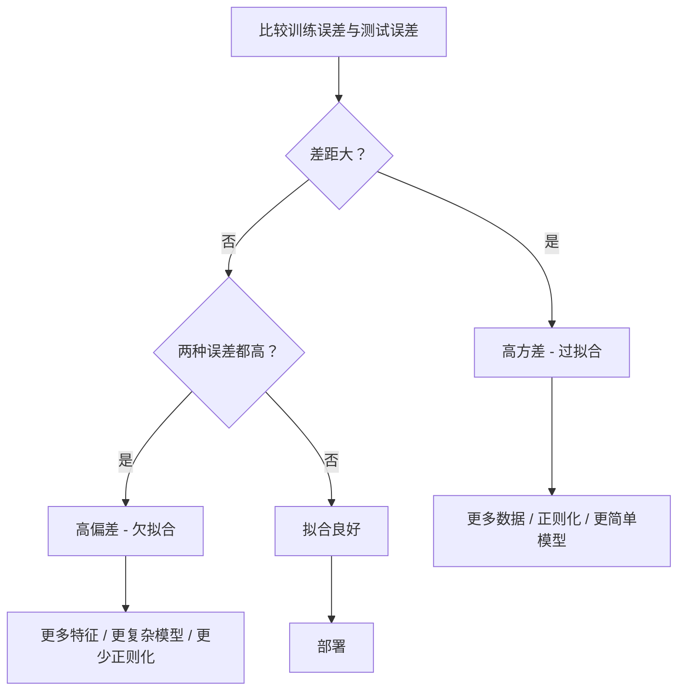
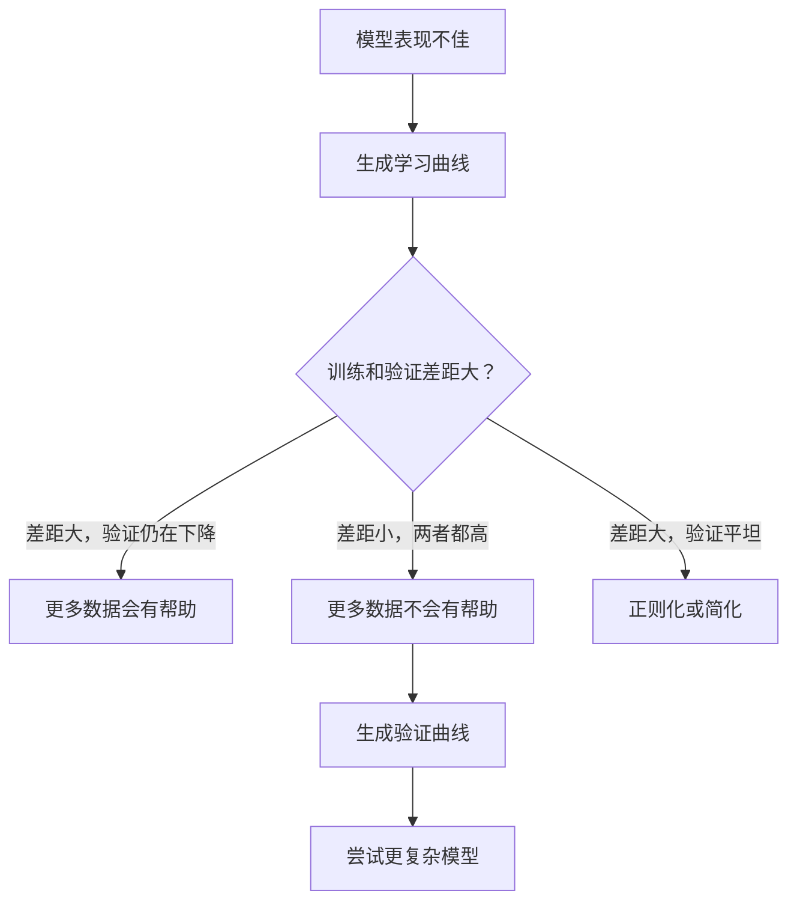

# 偏差-方差权衡

> 每个模型的误差都来自三个源头之一：偏差、方差或噪声。你只能控制前两个。

**类型：** 学习
**语言：** Python
**前置知识：** 第2阶段，课程01-09（机器学习基础、回归、分类、评估）
**时间：** 约75分钟

## 学习目标

- 推导预测误差的偏差-方差分解，并解释不可约噪声的作用
- 使用训练误差和测试误差模式诊断模型是高偏差还是高方差问题
- 解释正则化技术（L1、L2、Dropout、早停）如何以偏差换方差
- 实现实验，可视化不同复杂度模型的偏差-方差权衡

## 问题所在

你训练了一个模型，它在测试数据上有一定误差。这个误差从何而来？

如果你的模型太简单（对曲线数据集用线性回归），它会持续错过真实规律。这是偏差。如果你的模型太复杂（15个数据点用20次多项式），它会在训练数据上完美拟合，但在新数据上给出 wildly 不同的预测。这是方差。

对于固定模型容量，你无法同时最小化两者。压低偏差，方差就会上升。压低方差，偏差就会上升。理解这种权衡是机器学习中最重要的诊断技能。它能告诉你是否应该让模型更复杂或更简单，是否需要更多数据或更好的特征工程，是否需要加强或减弱正则化。

## 概念

### 偏差：系统性误差

偏差衡量模型的平均预测与真实值之间的差距。如果你在同一分布上多次抽取不同的训练集并训练同一模型，然后平均其预测，偏差就是这个平均值与真相之间的差距。

高偏差意味着模型过于僵化，无法捕捉真实规律。直线拟合抛物线时，无论给多少数据，它都会错过曲线。这是欠拟合。

```
高偏差（欠拟合）：
  模型始终预测大致相同的错误结果。
  训练误差：高
  测试误差：高
  两者差距：小
```

### 方差：对训练数据的敏感性

方差衡量在不同数据子集上训练时，你的预测变化有多大。如果训练集的微小变化导致模型大幅变化，则方差很高。

高方差意味着模型在拟合训练数据中的噪声，而非底层信号。20次多项式会穿过每一个训练点，但在它们之间剧烈振荡。这是过拟合。

```
高方差（过拟合）：
  模型完美拟合训练数据但在新数据上失败。
  训练误差：低
  测试误差：高
  两者差距：大
```

### 分解公式

对于任意点 x，在平方损失下的期望预测误差可以精确分解为：

```
期望误差 = 偏差² + 方差 + 不可约噪声

其中：
  偏差²   = (E[f_hat(x)] - f(x))²
  方差 = E[(f_hat(x) - E[f_hat(x)])²]
  噪声    = E[(y - f(x))²]             (sigma²)
```

- `f(x)` 是真实函数
- `f_hat(x)` 是模型的预测
- `E[...]` 是对不同训练集的期望
- `y` 是观测标签（真实函数加噪声）

噪声项是不可约的。在含噪数据上，没有模型能比 sigma² 做得更好。你的工作是在偏差²和方差之间找到正确的平衡。

### 模型复杂度 vs 误差


经典的 U 形曲线：

| 复杂度 | 偏差 | 方差 | 总误差 |
|--------|------|------|--------|
| 太低 | 高 | 低 | 高（欠拟合） |
| 适中 | 中等 | 中等 | 最低 |
| 太高 | 低 | 高 | 高（过拟合） |

### 正则化作为偏差-方差控制

正则化有意识地增加偏差以降低方差。它约束模型，使其无法追逐噪声。

- **L2（Ridge）：** 将所有权重收缩向零。保留所有特征但降低其影响。
- **L1（Lasso）：** 将部分权重精确推至零。执行特征选择。
- **Dropout：** 训练时随机禁用神经元。迫使冗余表示。
- **早停：** 在模型完全拟合训练数据之前停止训练。

正则化强度（lambda、dropout 率、epoch 数）直接控制你在偏差-方差曲线上的位置。更强的正则化意味着更高偏差、更低方差。

### 双下降：现代视角

经典理论认为：在最佳区域之后，更多复杂度总是有害。但2019年以来的研究表明了意外现象。如果你将模型容量远远超过插值阈值（模型参数量足以完美拟合训练数据的点），测试误差可能会再次下降。


这种"双下降"现象解释了为什么 massively overparameterized 的神经网络（参数数量远超训练样本）仍能很好地泛化。经典偏差-方差权衡并非错误，但对现代情形而言是不完整的。

关于双下降的关键观察：
- 它在线性模型、决策树和神经网络中都会发生
- 在插值区域，更多数据实际上可能有害（样本维度双下降）
- 更多训练 epoch 也会导致它（epoch 维度双下降）
- 正则化可以平滑峰值但无法消除它

为什么会这样？在插值阈值处，模型恰好有足够的容量拟合所有训练点。它被强制进入一个非常具体的解，穿过每一个点，而数据的微小扰动会导致拟合的大幅变化。这就是方差达到峰值的地方。超过阈值后，模型有多种能完美拟合数据的解。学习算法（如具有隐式正则化的梯度下降）倾向于从中选择最简单的那个。这种对简单解的隐式偏好正是过参数化模型能够泛化的原因。

| 情形 | 参数 vs 样本 | 行为 |
|------|-------------|------|
| 参数不足 | p << n | 适用经典权衡 |
| 插值阈值 | p ~ n | 方差达到峰值，测试误差尖峰 |
| 过参数化 | p >> n | 隐式正则化生效，测试误差下降 |

实际用途：如果你使用神经网络或大型树集成，不要在插值阈值处停下。要么保持在远低于它的位置（使用显式正则化），要么远远超过它。最糟糕的位置正是阈值处。

### 诊断你的模型



| 症状 | 诊断 | 修复 |
|------|------|------|
| 高训练误差，高测试误差 | 偏差 | 更多特征，更复杂模型，更少正则化 |
| 低训练误差，高测试误差 | 方差 | 更多数据，正则化，更简单模型，dropout |
| 低训练误差，低测试误差 | 拟合良好 | 上线部署 |
| 训练误差下降，测试误差上升 | 正在过拟合 | 早停 |

### 实用策略

**当偏差是问题时：**
- 添加多项式或交互特征
- 使用更灵活的模型（树集成替代线性模型）
- 降低正则化强度
- 训练更长时间（如果尚未收敛）

**当方差是问题时：**
- 获取更多训练数据
- 使用 bagging（随机森林）
- 增强正则化（更高 lambda，更多 dropout）
- 特征选择（移除噪声特征）
- 使用交叉验证尽早检测

### 集成方法与方差缩减

集成方法是对抗方差的最实用工具。

**Bagging（Bootstrap Aggregating）** 在训练数据的不同 bootstrap 样本上训练多个模型，然后平均它们的预测。每个单独模型有高方差，但平均值方差大大降低。随机森林是将 bagging 应用于决策树。

为什么数学上有效：如果你平均 N 个独立预测，每个方差为 sigma²，则平均值的方差为 sigma² / N。模型并非真正独立（它们都看到相似数据），所以缩减小于 1/N，但仍然显著。

**Boosting** 通过顺序构建模型来降低偏差，其中每个新模型专注于集成目前的错误。Gradient boosting 和 AdaBoost 是主要例子。如果你添加过多模型，boosting 可能过拟合，因此需要早停或正则化。

| 方法 | 主要效果 | 偏差变化 | 方差变化 |
|------|---------|---------|---------|
| Bagging | 降低方差 | 不变 | 降低 |
| Boosting | 降低偏差 | 降低 | 可能增加 |
| Stacking | 同时降低两者 | 取决于元学习器 | 取决于基模型 |
| Dropout | 隐式 bagging | 轻微增加 | 降低 |

**实用规则：** 如果基模型方差高（深树、高次多项式），使用 bagging。如果基模型偏差高（浅 stump、简单线性模型），使用 boosting。

### 学习曲线

学习曲线绘制训练误差和验证误差随训练集大小的变化。这是你最实用的诊断工具。与单一的训练/测试比较不同，学习曲线显示你模型的轨迹，并告诉你更多数据是否会有帮助。


如何阅读：

| 场景 | 训练误差 | 验证误差 | 差距 | 含义 | 该怎么做 |
|------|---------|---------|------|------|---------|
| 高偏差 | 高 | 高 | 小 | 模型无法捕捉规律 | 更多特征，更复杂模型，更少正则化 |
| 高方差 | 低 | 高 | 大 | 模型记忆训练数据 | 更多数据，正则化，更简单模型 |
| 拟合良好 | 中等 | 中等 | 小 | 模型泛化良好 | 上线部署 |
| 高方差，正在改善 | 低 | 随更多数据而下降 | 缩小 | 数据可解决的方差问题 | 收集更多数据 |
| 高偏差，平坦 | 高 | 高且平坦 | 小且平坦 | 更多数据没有帮助 | 改变模型架构 |

关键洞察：如果两条曲线都已 plateau 且差距小但两种误差都高，更多数据无济于事。你需要更好的模型。如果差距大且仍在缩小，更多数据会有帮助。

### 如何生成学习曲线

有两种方法：

**方法1：变化训练集大小，固定模型。** 保持模型和超参数恒定。在越来越大的训练数据子集上训练。在每个大小上测量训练误差和验证误差。这是标准学习曲线。

**方法2：变化模型复杂度，固定数据。** 保持数据恒定。扫描复杂度参数（多项式次数、树深度、层数）。在每个复杂度上测量训练误差和验证误差。这是验证曲线，直接显示偏差-方差权衡。

两种方法互为补充。第一种告诉你更多数据是否会有帮助。第二种告诉你不同模型是否会有帮助。在做出下一步决策前，两种都运行。



```figure
偏差-方差
```

## 动手实现

`code/bias_variance.py` 中的代码运行完整的偏差-方差分解实验。以下是逐步方法。

### 步骤1：从已知函数生成合成数据

我们使用 `f(x) = sin(1.5x) + 0.5x` 并添加高斯噪声。知道真实函数使我们能够计算精确的偏差和方差。

```python
def true_function(x):
    return np.sin(1.5 * x) + 0.5 * x

def generate_data(n_samples=30, noise_std=0.5, x_range=(-3, 3), seed=None):
    rng = np.random.RandomState(seed)
    x = rng.uniform(x_range[0], x_range[1], n_samples)
    y = true_function(x) + rng.normal(0, noise_std, n_samples)
    return x, y
```

### 步骤2：Bootstrap 采样和多项式拟合

对于每个多项式次数，我们抽取多个 bootstrap 训练集，拟合多项式，并记录在固定测试网格上的预测。这给出了每个测试点上预测的分布。

```python
def fit_polynomial(x_train, y_train, degree, lam=0.0):
    X = np.column_stack([x_train ** d for d in range(degree + 1)])
    if lam > 0:
        penalty = lam * np.eye(X.shape[1])
        penalty[0, 0] = 0  # 不对偏置项施加惩罚
        w = np.linalg.solve(X.T @ X + penalty, X.T @ y_train)
    else:
        w = np.linalg.lstsq(X, y_train, rcond=None)[0]
    return w
```

我们在200个不同的 bootstrap 样本上拟合。每个 bootstrap 样本从相同的底层分布中抽取，但包含不同的点。

### 步骤3：计算偏差²、方差分解

在每个测试点有200组预测后，我们可以直接从定义计算分解：

```python
mean_pred = predictions.mean(axis=0)
bias_sq = np.mean((mean_pred - y_true) ** 2)
variance = np.mean(predictions.var(axis=0))
total_error = np.mean(np.mean((predictions - y_true) ** 2, axis=1))
```

- `mean_pred` 是从 bootstrap 样本估计的 E[f_hat(x)]
- `bias_sq` 是平均预测与真相之间差距的平方
- `variance` 是 across bootstrap 样本的预测平均分散程度
- `total_error` 应近似等于偏差² + 方差 + 噪声

### 步骤4：学习曲线

学习曲线在固定模型复杂度下扫描训练集大小。它们显示你的模型是受限于数据还是受限于容量。

```python
def demo_learning_curves():
    sizes = [10, 15, 20, 30, 50, 75, 100, 150, 200, 300]
    degree = 5

    for n in sizes:
        train_errors = []
        test_errors = []
        for seed in range(50):
            x_train, y_train = generate_data(n_samples=n, seed=seed * 100)
            w = fit_polynomial(x_train, y_train, degree)
            train_pred = predict_polynomial(x_train, w)
            train_mse = np.mean((train_pred - y_train) ** 2)
            test_pred = predict_polynomial(x_test, w)
            test_mse = np.mean((test_pred - y_test) ** 2)
            train_errors.append(train_mse)
            test_errors.append(test_mse)
        # 多次运行的平均值给出学习曲线点
```

对于高方差模型（小数据的5次多项式），你会看到：
- 训练误差起始低，随着更多数据使记忆变难而上升
- 测试误差起始高，随着模型获得更多信号而下降
- 差距随更多数据而缩小

对于高偏差模型（1次），两种误差快速收敛到相同的高值，更多数据没有帮助。

### 步骤5：正则化扫描

代码还包含 `demo_regularization_sweep()`，它固定高次多项式（15次）并扫描 Ridge 正则化强度从 0.001 到 100。这从不同角度显示偏差-方差权衡：不是变化模型复杂度，而是变化约束强度。

```python
def demo_regularization_sweep():
    alphas = [0.001, 0.005, 0.01, 0.05, 0.1, 0.5, 1.0, 5.0, 10.0, 50.0, 100.0]
    for alpha in alphas:
        results = bias_variance_decomposition([15], lam=alpha)
        r = results[15]
        print(f"alpha={alpha:.3f}  bias={r['bias_sq']:.4f}  var={r['variance']:.4f}")
```

在低 alpha 时，15次多项式几乎无约束。方差占主导，因为模型追逐每个 bootstrap 样本中的噪声。在高 alpha 时，惩罚如此强烈，模型实际上变成近常数函数。偏差占主导。最优 alpha 位于这两个极端之间。

这与变化多项式次数的 U 形曲线相同，但由连续旋钮控制而非离散变量。在实践中，正则化是控制权衡的首选方式，因为它允许精细控制而不改变特征集。

## 使用它

sklearn 提供 `learning_curve` 和 `validation_curve` 来自动化这些诊断，无需编写 bootstrap 循环。

### 验证曲线：扫描模型复杂度

```python
from sklearn.model_selection import validation_curve
from sklearn.pipeline import make_pipeline
from sklearn.preprocessing import PolynomialFeatures
from sklearn.linear_model import Ridge

degrees = list(range(1, 16))
train_scores_all = []
val_scores_all = []

for d in degrees:
    pipe = make_pipeline(PolynomialFeatures(d), Ridge(alpha=0.01))
    train_scores, val_scores = validation_curve(
        pipe, X, y, param_name="polynomialfeatures__degree",
        param_range=[d], cv=5, scoring="neg_mean_squared_error"
    )
    train_scores_all.append(-train_scores.mean())
    val_scores_all.append(-val_scores.mean())
```

这直接给你偏差-方差权衡曲线。验证分数相对训练分数最差的地方，方差占主导。两者都差的地方，偏差占主导。

### 学习曲线：扫描训练集大小

```python
from sklearn.model_selection import learning_curve

pipe = make_pipeline(PolynomialFeatures(5), Ridge(alpha=0.01))
train_sizes, train_scores, val_scores = learning_curve(
    pipe, X, y, train_sizes=np.linspace(0.1, 1.0, 10),
    cv=5, scoring="neg_mean_squared_error"
)
train_mse = -train_scores.mean(axis=1)
val_mse = -val_scores.mean(axis=1)
```

绘制 `train_mse` 和 `val_mse` 随 `train_sizes` 的变化。形状告诉你关于模型的一切。

### 带正则化扫描的交叉验证

```python
from sklearn.model_selection import cross_val_score

alphas = [0.001, 0.01, 0.1, 1.0, 10.0, 100.0]
for alpha in alphas:
    pipe = make_pipeline(PolynomialFeatures(10), Ridge(alpha=alpha))
    scores = cross_val_score(pipe, X, y, cv=5, scoring="neg_mean_squared_error")
    print(f"alpha={alpha:>7.3f}  MSE={-scores.mean():.4f} +/- {scores.std():.4f}")
```

这扫描固定模型复杂度下的正则化强度。你会看到相同的偏差-方差权衡：低 alpha 意味着高方差，高 alpha 意味着高偏差。

### 综合：完整诊断工作流

在实践中，你按顺序运行这些诊断：

1. 训练你的模型。计算训练误差和测试误差。
2. 如果两者都高：你有偏差问题。跳到步骤4。
3. 如果训练低但测试高：你有方差问题。生成学习曲线看更多数据是否会有帮助。如果没有，正则化。
4. 生成验证曲线扫描你的主要复杂度参数。找到最佳区域。
5. 在最佳区域，生成学习曲线。如果差距仍然大，你需要更多数据或正则化。
6. 使用 `cross_val_score` 尝试不同 alpha 值的 Ridge/Lasso。选择在交叉验证误差最低处的 alpha。

这对大多数表格数据集仅需10-15分钟计算，节省数小时猜测。

## 交付

本课产出：`outputs/prompt-model-diagnostics.md`

## 练习

1. 使用 `noise_std=0`（无噪声）运行分解。不可约误差项会发生什么？最优复杂度会改变吗？

2. 将训练集大小从30增加到300。这如何影响方差分量？最优多项式次数会偏移吗？

3. 向实验添加 L2 正则化（Ridge 回归）。对于固定高次多项式（15次），扫描 lambda 从0到100。绘制偏差²和方差作为 lambda 的函数。

4. 将真实函数从多项式改为 `sin(x)`。偏差-方差分解会如何改变？仍有明确的最优次数吗？

5. 实现一个简单的 bootstrap aggregating（bagging）包装器：在 bootstrap 样本上训练10个模型并平均预测。展示这能降低方差而不显著增加偏差。

## 关键术语

| 术语 | 人们说的 | 实际含义 |
|------|---------|---------|
| 偏差 | "模型太简单" | 来自错误假设的系统性误差。平均模型预测与真相之间的差距。 |
| 方差 | "模型过拟合" | 来自对训练数据敏感性的误差。预测在不同训练集上变化有多大。 |
| 不可约误差 | "数据中的噪声" | 来自真实数据生成过程随机性的误差。没有模型能消除它。 |
| 欠拟合 | "学得不够" | 模型有高偏差。即使在训练数据上也错过真实规律。 |
| 过拟合 | "记忆数据" | 模型有高方差。拟合训练数据中不能泛化的噪声。 |
| 正则化 | "约束模型" | 添加惩罚以降低模型复杂度，以偏差换更低方差。 |
| 双下降 | "更多参数可能有帮助" | 当模型容量远超插值阈值时，测试误差再次下降。 |
| 模型复杂度 | "模型有多灵活" | 模型拟合任意规律的能力。由架构、特征或正则化控制。 |

## 延伸阅读

- [Hastie, Tibshirani, Friedman: Elements of Statistical Learning, 第7章](https://hastie.su.domains/ElemStatLearn/) -- 偏差-方差分解的权威论述
- [Belkin et al., Reconciling modern machine learning practice and the bias-variance trade-off (2019)](https://arxiv.org/abs/1812.11118) -- 双下降论文
- [Nakkiran et al., Deep Double Descent (2019)](https://arxiv.org/abs/1912.02292) -- epoch维度和样本维度双下降
- [Scott Fortmann-Roe: Understanding the Bias-Variance Tradeoff](http://scott.fortmann-roe.com/docs/BiasVariance.html) -- 清晰图解说明
