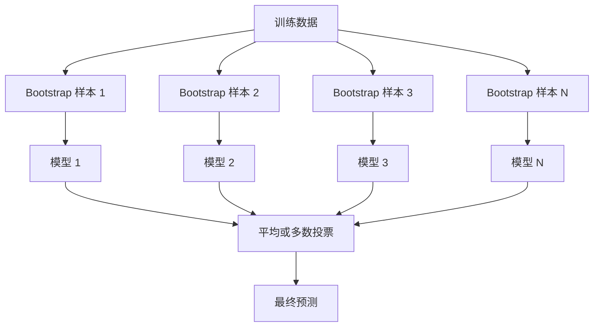
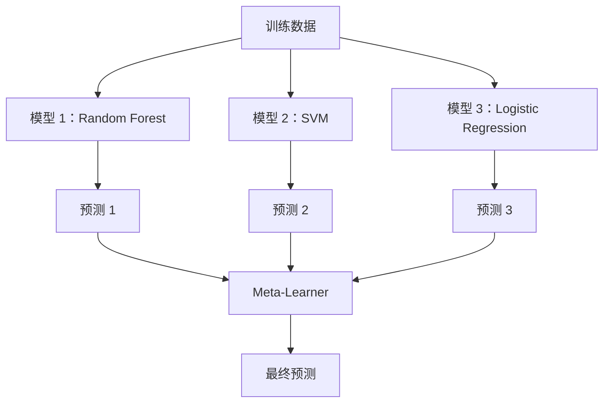

# 集成方法

> 一群弱学习器，若正确组合，便成为强学习器。这不是比喻，是定理。

**类型：** Build
**语言：** Python
**先决条件：** Phase 2, Lesson 10 (Bias-Variance Tradeoff)
**时间：** ~120 minutes

## 学习目标

- 从零实现 AdaBoost 和梯度提升，并解释提升如何逐步降低偏差
- 构建 bagging 集成，演示平均去相关模型如何在不增加偏差的情况下降低方差
- 从各方法针对的误差分量角度，比较 bagging、boosting 和 stacking
- 评估集成多样性，并解释为何多数投票的准确率随独立弱学习器数量增加而提升

## 问题

单个决策树训练快速且易于解释，但容易过拟合。单个线性模型在复杂边界上容易欠拟合。你可以花数天时间精心设计完美的模型架构，也可以组合一堆不完善的模型，获得比其中任何一个都更好的效果。

集成方法正是这样做的。它们是处理表格数据赢得 Kaggle 竞赛最可靠的技术，支撑着大多数生产级 ML 系统，并直观展示了偏差-方差权衡的实际应用。Bagging 降低方差，Boosting 降低偏差，Stacking 学习对哪些输入信任哪些模型。

## 概念

### 为什么集成有效

假设你有 N 个独立的分类器，每个准确率为 p > 0.5。多数投票的准确率为：

```
P(majority correct) = sum over k > N/2 of C(N,k) * p^k * (1-p)^(N-k)
```

对于 21 个准确率为 60% 的分类器，多数投票准确率约为 74%。若有 101 个分类器，则升至 84%。当模型犯下不同错误时，误差相互抵消。

关键要求是**多样性**。如果所有模型犯相同的错误，组合它们毫无帮助。集成之所以有效，是因为它们通过以下方式产生多样化的模型：

- 不同的训练子集（bagging）
- 不同的特征子集（random forests）
- 顺序错误修正（boosting）
- 不同的模型族（stacking）

### Bagging（Bootstrap Aggregating）

Bagging 通过在训练数据的不同 bootstrap 样本上训练每个模型来创造多样性。



bootstrap 样本是从原始数据中有放回抽取的，大小与原始数据相同。每个 bootstrap 中约出现 63.2% 的唯一样本。剩余的 36.8%（out-of-bag 样本）提供了一个免费的验证集。

Bagging 在不显著增加偏差的情况下降低方差。每个单独树都会过拟合其 bootstrap 样本，但每棵树的过拟合方式不同，因此平均可以抵消噪声。

**随机森林**是带有额外机制的 bagging：在每次分裂时，只考虑特征的随机子集。这迫使树之间产生更多样性。分类时典型候选特征数为 `sqrt(n_features)`，回归时为 `n_features / 3`。

### Boosting（顺序错误修正）

Boosting 顺序训练模型。每个新模型专注于前序模型判错的样本。


Boosting 降低偏差。每个新模型修正当前集成已有的系统性错误。最终预测是所有模型的加权和，表现更好的模型获得更高权重。

代价是：若迭代轮数过多，boosting 可能过拟合，因为它持续拟合更难样本，其中一些可能是噪声。

### AdaBoost

AdaBoost（自适应提升）是最早实用的 boosting 算法。它适用于任何基学习器，通常为 decision stumps（深度为 1 的树）。

算法如下：

```
1. 初始化样本权重：对所有 i，w_i = 1/N

2. 对 t = 1 到 T：
   a. 在加权数据上训练弱学习器 h_t
   b. 计算加权误差：
      err_t = sum(w_i * I(h_t(x_i) != y_i)) / sum(w_i)
   c. 计算模型权重：
      alpha_t = 0.5 * ln((1 - err_t) / err_t)
   d. 更新样本权重：
      w_i = w_i * exp(-alpha_t * y_i * h_t(x_i))
   e. 归一化权重使其和为 1

3. 最终预测：H(x) = sign(sum(alpha_t * h_t(x)))
```

误差较低的模型获得更高的 alpha。错分样本获得更高权重，使下一个模型专注于它们。

### Gradient Boosting

梯度提升将 boosting 推广到任意损失函数。它不重新加权样本，而是将每个新模型拟合到当前集成的残差（损失的负梯度）上。

```
1. 初始化：F_0(x) = argmin_c sum(L(y_i, c))

2. 对 t = 1 到 T：
   a. 计算伪残差：
      r_i = -dL(y_i, F_{t-1}(x_i)) / dF_{t-1}(x_i)
   b. 用树 h_t 拟合残差 r_i
   c. 寻找最优步长：
      gamma_t = argmin_gamma sum(L(y_i, F_{t-1}(x_i) + gamma * h_t(x_i)))
   d. 更新：
      F_t(x) = F_{t-1}(x) + learning_rate * gamma_t * h_t(x)

3. 最终预测：F_T(x)
```

对于平方误差损失，伪残差就是实际残差：`r_i = y_i - F_{t-1}(x_i)`。每棵树实质上拟合的是前序集成的误差。

学习率（shrinkage）控制每棵树的贡献程度。较小的学习率需要更多树，但泛化能力更好。典型取值：0.01 到 0.3。

### XGBoost：为何在表格数据上占主导地位

XGBoost（eXtreme Gradient Boosting）是在梯度提升基础上加入工程优化，使其快速、准确且抗过拟合：

- **正则化目标：** 对叶节点权重施加 L1 和 L2 惩罚，防止单棵树过于自信
- **二阶近似：** 同时使用损失的一阶和二阶导数，做出更好的分裂决策
- **稀疏感知分裂：** 原生处理缺失值，在每次分裂时学习缺失数据的最佳方向
- **列采样：** 类似于随机森林，在每次分裂时对特征采样以增加多样性
- **加权分位数草图：** 在分布式数据上高效寻找连续特征的分裂点
- **缓存感知块结构：** 内存布局针对 CPU cache lines 优化

对于表格数据，XGBoost（及其后继者 LightGBM）始终优于神经网络。这一态势短期内不会改变。如果你的数据适合用行列组成的表格表示，请从梯度提升开始。

### Stacking（Meta-Learning）

Stacking 将多个基模型的预测作为元学习器的特征使用。



元学习器学习对哪些输入信任哪些基模型。如果随机森林在某些区域表现更好而 SVM 在其他区域表现更好，元学习器将学会相应地进行路由。

为避免数据泄露，基模型预测必须通过对训练集进行交叉验证来生成。永远不要在同一数据上训练基模型并生成 meta-features。

### Voting

最简单的集成。直接将预测结果组合。

- **硬投票：** 对类别标签进行多数投票。
- **软投票：** 对预测概率求平均，选择平均概率最高的类别。通常更好，因为它利用了置信度信息。

```figure
f3-ensemble-average
```

## 动手实现

### 步骤 1：Decision Stump（基学习器）

`code/ensembles.py` 中的代码从零实现了所有内容。我们从 decision stump 开始：一棵只有一个分裂的树。

```python
class DecisionStump:
    def __init__(self):
        self.feature_idx = None
        self.threshold = None
        self.polarity = 1
        self.alpha = None

    def fit(self, X, y, weights):
        n_samples, n_features = X.shape
        best_error = float("inf")

        for f in range(n_features):
            thresholds = np.unique(X[:, f])
            for thresh in thresholds:
                for polarity in [1, -1]:
                    pred = np.ones(n_samples)
                    pred[polarity * X[:, f] < polarity * thresh] = -1
                    error = np.sum(weights[pred != y])
                    if error < best_error:
                        best_error = error
                        self.feature_idx = f
                        self.threshold = thresh
                        self.polarity = polarity

    def predict(self, X):
        n = X.shape[0]
        pred = np.ones(n)
        idx = self.polarity * X[:, self.feature_idx] < self.polarity * self.threshold
        pred[idx] = -1
        return pred
```

### 步骤 2：从零实现 AdaBoost

```python
class AdaBoostScratch:
    def __init__(self, n_estimators=50):
        self.n_estimators = n_estimators
        self.stumps = []
        self.alphas = []

    def fit(self, X, y):
        n = X.shape[0]
        weights = np.full(n, 1 / n)

        for _ in range(self.n_estimators):
            stump = DecisionStump()
            stump.fit(X, y, weights)
            pred = stump.predict(X)

            err = np.sum(weights[pred != y])
            err = np.clip(err, 1e-10, 1 - 1e-10)

            alpha = 0.5 * np.log((1 - err) / err)
            weights *= np.exp(-alpha * y * pred)
            weights /= weights.sum()

            stump.alpha = alpha
            self.stumps.append(stump)
            self.alphas.append(alpha)

    def predict(self, X):
        total = sum(a * s.predict(X) for a, s in zip(self.alphas, self.stumps))
        return np.sign(total)
```

### 步骤 3：从零实现梯度提升

```python
class GradientBoostingScratch:
    def __init__(self, n_estimators=100, learning_rate=0.1, max_depth=3):
        self.n_estimators = n_estimators
        self.lr = learning_rate
        self.max_depth = max_depth
        self.trees = []
        self.initial_pred = None

    def fit(self, X, y):
        self.initial_pred = np.mean(y)
        current_pred = np.full(len(y), self.initial_pred)

        for _ in range(self.n_estimators):
            residuals = y - current_pred
            tree = SimpleRegressionTree(max_depth=self.max_depth)
            tree.fit(X, residuals)
            update = tree.predict(X)
            current_pred += self.lr * update
            self.trees.append(tree)

    def predict(self, X):
        pred = np.full(X.shape[0], self.initial_pred)
        for tree in self.trees:
            pred += self.lr * tree.predict(X)
        return pred
```

### 步骤 4：与 sklearn 对比

代码验证我们的从零实现与 sklearn 的 `AdaBoostClassifier` 和 `GradientBoostingClassifier` 产生相似的准确率，并并列比较所有方法。

## 使用指南

### 何时使用各方法

| 方法 | 降低 | 最佳适用场景 | 注意事项 |
|--------|---------|----------|---------------|
| Bagging / Random Forest | Variance | Noisy data, many features | Does not help with bias |
| AdaBoost | Bias | Clean data, simple base learners | Sensitive to outliers and noise |
| Gradient Boosting | Bias | Tabular data, competitions | Slow to train, easy to overfit without tuning |
| XGBoost / LightGBM | Both | Production tabular ML | Many hyperparameters |
| Stacking | Both | Getting last 1-2% accuracy | Complex, risk of overfitting meta-learner |
| Voting | Variance | Quick combination of diverse models | Only helps if models are diverse |

### 表格数据的生产级技术栈

对于大多数表格预测问题，建议按以下顺序尝试：

1. **LightGBM 或 XGBoost** 使用默认参数
2. 调优 n_estimators、learning_rate、max_depth、min_child_weight
3. 若需要最后 0.5% 的提升，构建包含 3-5 个 diverse models 的 stacking 集成
4. 全程使用 cross-validation

尽管研究尝试不断，neural networks 在处理表格数据时几乎总是弱于梯度提升。TabNet、NODE 及类似 architectures 偶尔能持平，但很少胜过 well-tuned 的 XGBoost。

## 交付成果

本课产出 `outputs/prompt-ensemble-selector.md` —— 一个帮助你为给定 dataset 选择合适 ensemble method 的 prompt。描述你的数据（size、feature types、noise level、class balance）和正在解决的问题。该 prompt 将引导你完成 decision checklist，推荐方法，建议初始 hyperparameters，并警告该方法的 common mistakes。同时产出 `outputs/skill-ensemble-builder.md`，包含完整的 selection guide。

## 练习

1. 修改 AdaBoost 实现以追踪每轮后的 training accuracy。绘制 accuracy vs. number of estimators 的关系图。它何时 converge？

2. 通过向 regression tree 添加 random feature subsampling，从零实现 random forest。用 `max_features=sqrt(n_features)` 训练 100 棵树并 average predictions。与 single tree 比较 variance reduction 效果。

3. 在 gradient boosting 实现中添加 early stopping：追踪每轮后的 validation loss，当连续 10 轮未 improve 时停止。它实际只需要多少棵树？

4. 构建包含三个 base models（logistic regression、decision tree、k-nearest neighbors）和 logistic regression meta-learner 的 stacking 集成。使用 5-fold cross-validation 生成 meta-features。与单独的各 base model 比较。

5. 用 default parameters 在同一 dataset 上运行 XGBoost。将其 accuracy 与从零实现的 gradient boosting 比较。分别计时。speed difference 有多大？

## 核心术语

| 术语 | 人们常说的说法 | 实际含义 |
|------|----------------|----------------------|
| Bagging | "在随机子集上训练" | Bootstrap aggregating：在 bootstrap samples 上训练 models，average predictions 以降低 variance |
| Boosting | "专注于困难样本" | 顺序训练 models，每个 model 修正当前 ensemble 已有的 errors，以降低 bias |
| AdaBoost | "重新加权数据" | 通过 sample weight updates 实现 boosting；misclassified points 在下个 learner 中获得更高 weight |
| Gradient boosting | "拟合残差" | 通过拟合 loss function 的 negative gradient 实现 boosting |
| XGBoost | "Kaggle 利器" | 带 regularization、second-order optimization 和 system-level speed tricks 的 gradient boosting |
| Stacking | "模型之上套模型" | 将 base models 的 predictions 作为 meta-learner 的 input features |
| Random forest | "大量随机化树" | 基于 decision trees 的 bagging，在每次 split 时添加 random feature subsampling 以增加 diversity |
| Ensemble diversity | "犯不同的错误" | model errors 必须去相关，ensemble 才能优于 individuals |
| Out-of-bag error | "免费验证" | bootstrap 抽样中未出现的 samples（约 36.8%）充当 validation set，无需预留 holdout |

## 延伸阅读

- [Schapire & Freund: Boosting: Foundations and Algorithms](https://mitpress.mit.edu/9780262526036/) —— AdaBoost 创造者的著作
- [Friedman: Greedy Function Approximation: A Gradient Boosting Machine (2001)](https://statweb.stanford.edu/~jhf/ftp/trebst.pdf) —— 原始 gradient boosting 论文
- [Chen & Guestrin: XGBoost (2016)](https://arxiv.org/abs/1603.02754) —— XGBoost 论文
- [Wolpert: Stacked Generalization (1992)](https://www.sciencedirect.com/science/article/abs/pii/S0893608005800231) —— 原始 stacking 论文
- [scikit-learn Ensemble Methods](https://scikit-learn.org/stable/modules/ensemble.html) —— 实用参考
