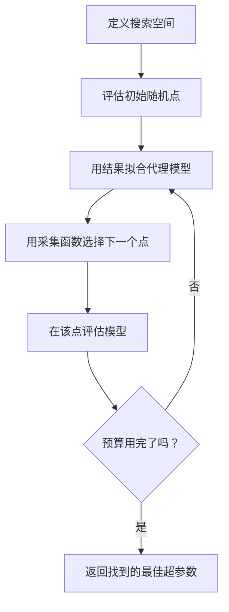
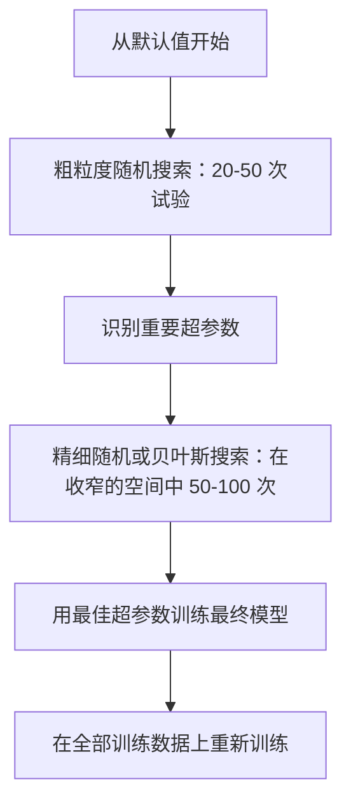
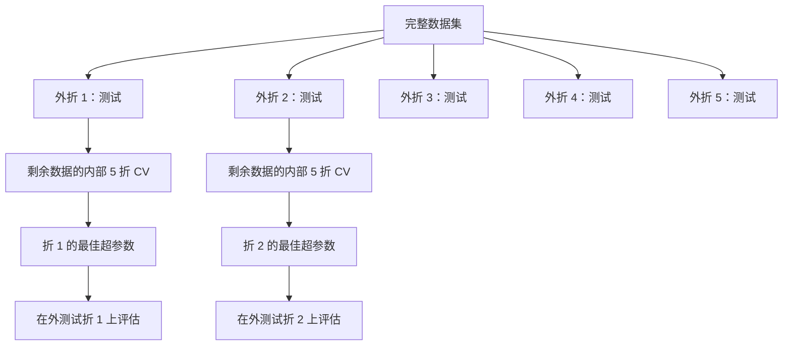

# 超参数调优

> 超参数是你在训练开始前可以调节的旋钮。调得好与调得差，就是平庸模型与优秀模型之间的差距。

**类型：** Build
**语言：** Python
**前置知识：** Phase 2，第 11 课（集成方法）
**预计时长：** 约 90 分钟

## 学习目标

- 从零实现网格搜索、随机搜索和贝叶斯优化，并比较它们的采样效率
- 解释为什么在大多数超参数有效维度较低时，随机搜索的表现优于网格搜索
- 使用代理模型和采集函数构建贝叶斯优化循环来指导搜索
- 通过合理的交叉验证设计超参数调优策略，避免对验证集过拟合

## 问题所在

你的梯度提升模型有学习率、树的数量、最大深度、叶节点最小样本数、子样本比例和列采样比例。这是六个超参数。如果每个有 5 个合理的取值，网格就有 $5^6 = 15{,}625$ 种组合。训练每一个需要 10 秒。要穷举所有组合需要 43 小时的计算。

网格搜索是显而易见的方法，也是在大尺度下最糟糕的方法。随机搜索用更少的计算量做得更好。贝叶斯优化通过从过去的评估中学习做得更好。知道该用哪种策略、哪些超参数真正重要，可以节省数天 wasted GPU 时间。

## 概念讲解

### 参数 vs 超参数

参数是在训练过程中学到的（权重、偏置、分裂阈值）。超参数是在训练开始前设定的，控制学习如何发生。

| 超参数 | 控制什么 | 典型范围 |
|--------|----------|----------|
| 学习率 | 每次更新的步长 | 0.001 到 1.0 |
| 树的数量/轮数 | 训练多长时间 | 10 到 10,000 |
| 最大深度 | 模型复杂度 | 1 到 30 |
| 正则化（lambda） | 防止过拟合 | 0.0001 到 100 |
| 批次大小 | 梯度估计噪声 | 16 到 512 |
| Dropout 比率 | 丢弃的神经元比例 | 0.0 到 0.5 |

### 网格搜索

网格搜索评估所有指定值的组合。它是穷举式的且易于理解，但随着超参数数量的增加呈指数级增长。

```
两个超参数的网格：

  learning_rate: [0.01, 0.1, 1.0]
  max_depth:     [3, 5, 7]

  评估次数：3 x 3 = 9 种组合

  (0.01, 3)  (0.01, 5)  (0.01, 7)
  (0.1,  3)  (0.1,  5)  (0.1,  7)
  (1.0,  3)  (1.0,  5)  (1.0,  7)
```

网格搜索有一个根本缺陷：如果一个超参数重要而另一个不重要，大部分评估都是浪费。你从 9 次评估中只得到了 3 个重要参数的唯一取值。

### 随机搜索

随机搜索从分布中采样超参数，而不是在网格上搜索。用同样 9 次评估的预算，你可以得到每个超参数的 9 个唯一取值。


随机搜索优于网格搜索的原因（Bergstra & Bengio，2012）：

- 大多数超参数有效维度较低。给定问题通常只有 1-2 个超参数真正重要。
- 网格搜索在不重要的维度上浪费评估。
- 随机搜索用同样的预算对重要维度进行更密集的覆盖。
- 进行 60 次随机试验，你有 95% 的概率找到一个距离最优解 5% 以内的点（如果搜索空间中存在最优解）。

### 贝叶斯优化

随机搜索不利用已有结果。它不知道高学习率会导致发散，也不知道深度 3 持续优于深度 10。贝叶斯优化利用过去的评估结果来决定下一步在哪里搜索。



两个关键组件：

**代理模型：** 一个计算廉价的模型（通常是高斯过程），用于近似代价高昂的目标函数。它在搜索空间的任意点给出预测值和不确定性估计。

**采集函数：** 通过对开发（在已知好点附近搜索）和探索（在高不确定性区域搜索）的权衡来决定下一步评估的位置。常见选择：

- **期望改进（EI）：** 在该点上我们预期能比当前最优值改进多少？
- **置信上界（UCB）：** 预测值加上不确定度的若干倍。UCB 越高意味着要么前景好，要么尚未探索。
- **改进概率（PI）：** 该点优于当前最优值的概率是多少？

贝叶斯优化通常用比随机搜索少 2-5 倍的评估次数找到更好的超参数。拟合代理模型的开销与实际训练模型相比可以忽略不计。

### 早停法

并非每次训练都需要跑完。如果某个配置在 10 个 epoch 之后就明显很差，停止它然后继续。这是在超参数搜索语境下的早停法。

策略：
- **耐心机制：** 如果验证损失在 N 个连续 epoch 内没有改善则停止
- **中位数剪枝：** 如果试验的中间结果差于同期已完成试验的中位数则停止
- **Hyperband：** 给许多配置分配小预算，然后逐步增加最优配置的预算

Hyperband 特别有效。它以每个配置 1 个 epoch 启动 81 个配置，保留前三分之一，给它们 3 个 epoch，再保留前三分之一，依此类推。这比对所有配置执行完整预算快 10-50 倍找到好的配置。

### 学习率调度器

学习率几乎总是最重要的超参数。调度器在训练过程中动态调整它，而不是保持固定。

| 调度器 | 公式 | 适用场景 |
|--------|------|----------|
| 步长衰减 | 每 N 个 epoch 乘以 0.1 | 经典 CNN 训练 |
| 余弦退火 | lr * 0.5 * (1 + cos(pi * t / T)) | 现代默认 |
| 预热 + 衰减 | 线性增加后余弦衰减 | Transformer |
| 单周期 | 一个周期内先增后减 | 快速收敛 |
| 基于平台下降 | 指标停滞时按因子降低 | 安全默认 |

### 超参数重要性

并非所有超参数的重要性都相同。对随机森林（Probst 等，2019）和梯度提升的研究显示了一致的规律：

**高重要性：**
- 学习率（始终最先调优）
- 估计器数量/epoch 数（使用早停而非调优）
- 正则化强度

**中等重要性：**
- 最大深度/层数
- 叶节点最小样本数/权重衰减
- 子样本比例

**低重要性：**
- 最大特征数（针对随机森林）
- 具体激活函数选择
- 批次大小（在合理范围内）

先调优重要的，其余保持默认。

### 实用策略



具体工作流程：

1. **从库默认值开始。** 它们由经验丰富的实践者选择，通常已经完成了 80% 的工作。
2. **粗粒度随机搜索。** 宽泛的范围，20-50 次试验。使用早停快速淘汰差的配置。
3. **分析结果。** 哪些超参数与性能相关？收窄搜索空间。
4. **精细搜索。** 在收窄的空间中用贝叶斯优化或聚焦随机搜索。50-100 次试验。
5. **用找到的最佳超参数在全部训练数据上重新训练。**

### 交叉验证集成

在单一验证分割上调优超参数是有风险的。最佳超参数可能过拟合到特定的验证折。嵌套交叉验证通过使用两个循环来解决这个问题：

- **外循环**（评估）：将数据分为训练+验证和测试。报告无偏性能。
- **内循环**（调优）：将训练+验证分为训练和验证。找到最佳超参数。



每个外折独立找到各自的最佳超参数。外折分数是对泛化性能的无偏估计。

使用 sklearn：

```python
from sklearn.model_selection import cross_val_score, GridSearchCV
from sklearn.ensemble import GradientBoostingRegressor

inner_cv = GridSearchCV(
    GradientBoostingRegressor(),
    param_grid={
        "learning_rate": [0.01, 0.05, 0.1],
        "max_depth": [2, 3, 5],
        "n_estimators": [50, 100, 200],
    },
    cv=5,
    scoring="neg_mean_squared_error",
)

outer_scores = cross_val_score(
    inner_cv, X, y, cv=5, scoring="neg_mean_squared_error"
)

print(f"嵌套 CV MSE: {-outer_scores.mean():.4f} +/- {outer_scores.std():.4f}")
```

这很昂贵（5 个外折 × 5 个内折 × 27 个网格点 = 675 次模型拟合），但它给你一个可信的性能估计。在发表论文报告最终结果或决策风险较高时使用。

### 实用建议

**从学习率开始。** 它始终是基于梯度的方法中最重要的超参数。差的学习率会让一切其他参数失去意义。将其他超参数固定在默认值，先扫描学习率。

**对学习率和正则化使用对数均匀分布。** 0.001 和 0.01 之间的差异与 0.1 和 1.0 之间的差异一样重要。线性搜索会在大值端浪费预算。

**用早停代替调优 n_estimators。** 对于提升法和神经网络，将 n_estimators 或 epoch 数设得高一些，让早停决定何时停止。这样可以减少一个待调超参数。

**预算分配。** 将 60% 的调优预算用于最重要的 2 个超参数。剩余 40% 用于其他所有参数。前 2 个解释了大部分性能差异。

**量级很重要。** 永远不要在对数尺度上搜索批次大小（16、32、64 就可以了）。总是用对数尺度搜索学习率。让搜索分布与超参数影响模型的方式相匹配。

| 模型类型 | 关键超参数 | 推荐搜索方式 | 预算 |
|----------|------------|--------------|------|
| 随机森林 | n_estimators、max_depth、min_samples_leaf | 随机搜索，50 次试验 | 低（训练快） |
| 梯度提升 | learning_rate、n_estimators、max_depth | 贝叶斯，100 次试验 + 早停 | 中等 |
| 神经网络 | learning_rate、weight_decay、batch_size | 贝叶斯或随机，100+ 次试验 | 高（训练慢） |
| SVM | C、gamma（RBF 核） | 对数尺度网格，25-50 次试验 | 低（2 个参数） |
| Lasso/Ridge | alpha | 对数尺度一维搜索，20 次试验 | 很低 |
| XGBoost | learning_rate、max_depth、subsample、colsample | 贝叶斯，100-200 次试验 + 早停 | 中等 |

**不确定时：** 用随机搜索，试验次数为超参数数量的 2 倍（例如，6 个超参数 = 至少 12 次试验）。你会发现随机搜索用 50 次试验频繁胜过精心设计的网格搜索。

```figure
k-fold-cv
```

## 动手实践

### 步骤 1：从零实现网格搜索

`code/tuning.py` 中的代码从零实现了网格搜索、随机搜索和简单的贝叶斯优化器。

```python
def grid_search(model_fn, param_grid, X_train, y_train, X_val, y_val):
    keys = list(param_grid.keys())
    values = list(param_grid.values())
    best_score = -float("inf")
    best_params = None
    n_evals = 0

    for combo in itertools.product(*values):
        params = dict(zip(keys, combo))
        model = model_fn(**params)
        model.fit(X_train, y_train)
        score = evaluate(model, X_val, y_val)
        n_evals += 1

        if score > best_score:
            best_score = score
            best_params = params

    return best_params, best_score, n_evals
```

### 步骤 2：从零实现随机搜索

```python
def random_search(model_fn, param_distributions, X_train, y_train,
                  X_val, y_val, n_iter=50, seed=42):
    rng = np.random.RandomState(seed)
    best_score = -float("inf")
    best_params = None

    for _ in range(n_iter):
        params = {k: sample(v, rng) for k, v in param_distributions.items()}
        model = model_fn(**params)
        model.fit(X_train, y_train)
        score = evaluate(model, X_val, y_val)

        if score > best_score:
            best_score = score
            best_params = params

    return best_params, best_score, n_iter
```

### 步骤 3：贝叶斯优化（简化版）

核心思想：对观测到的（超参数，得分）配对拟合高斯过程，然后使用采集函数来决定下一步搜索哪里。

```python
class SimpleBayesianOptimizer:
    def __init__(self, search_space, n_initial=5):
        self.search_space = search_space
        self.n_initial = n_initial
        self.X_observed = []
        self.y_observed = []

    def _kernel(self, x1, x2, length_scale=1.0):
        dists = np.sum((x1[:, None, :] - x2[None, :, :]) ** 2, axis=2)
        return np.exp(-0.5 * dists / length_scale ** 2)

    def _fit_gp(self, X_new):
        X_obs = np.array(self.X_observed)
        y_obs = np.array(self.y_observed)
        y_mean = y_obs.mean()
        y_centered = y_obs - y_mean

        K = self._kernel(X_obs, X_obs) + 1e-4 * np.eye(len(X_obs))
        K_star = self._kernel(X_new, X_obs)

        L = np.linalg.cholesky(K)
        alpha = np.linalg.solve(L.T, np.linalg.solve(L, y_centered))
        mu = K_star @ alpha + y_mean

        v = np.linalg.solve(L, K_star.T)
        var = 1.0 - np.sum(v ** 2, axis=0)
        var = np.maximum(var, 1e-6)

        return mu, var

    def _expected_improvement(self, mu, var, best_y):
        sigma = np.sqrt(var)
        z = (mu - best_y) / (sigma + 1e-10)
        ei = sigma * (z * norm_cdf(z) + norm_pdf(z))
        return ei

    def suggest(self):
        if len(self.X_observed) < self.n_initial:
            return sample_random(self.search_space)

        candidates = [sample_random(self.search_space) for _ in range(500)]
        X_cand = np.array([to_vector(c) for c in candidates])
        mu, var = self._fit_gp(X_cand)
        ei = self._expected_improvement(mu, var, max(self.y_observed))
        return candidates[np.argmax(ei)]

    def observe(self, params, score):
        self.X_observed.append(to_vector(params))
        self.y_observed.append(score)
```

高斯过程代理在每个候选点提供两样东西：预测得分（mu）和不确定性（var）。期望改进将两者结合：它偏好模型预测高分的点，也偏好不确定性高的点。在初期，大部分点都有高不确定性，因此优化器会广泛探索。后期则聚焦于最有前景的区域。

### 步骤 4：比较所有方法

在同一合成目标上运行三种方法并比较。此比较使用一个简化包装，直接调用每个优化器（无需训练模型），因此 API 与上述基于模型的实现有所不同：

```python
def synthetic_objective(params):
    lr = params["learning_rate"]
    depth = params["max_depth"]
    return -(np.log10(lr) + 2) ** 2 - (depth - 4) ** 2 + 10

param_grid = {
    "learning_rate": [0.001, 0.01, 0.1, 1.0],
    "max_depth": [2, 3, 4, 5, 6, 7, 8],
}

grid_best = None
grid_score = -float("inf")
grid_history = []
for combo in itertools.product(*param_grid.values()):
    params = dict(zip(param_grid.keys(), combo))
    score = synthetic_objective(params)
    grid_history.append((params, score))
    if score > grid_score:
        grid_score = score
        grid_best = params

param_dist = {
    "learning_rate": ("log_float", 0.001, 1.0),
    "max_depth": ("int", 2, 8),
}

rand_best = None
rand_score = -float("inf")
rand_history = []
rng = np.random.RandomState(42)
for _ in range(28):
    params = {k: sample(v, rng) for k, v in param_dist.items()}
    score = synthetic_objective(params)
    rand_history.append((params, score))
    if score > rand_score:
        rand_score = score
        rand_best = params

optimizer = SimpleBayesianOptimizer(param_dist, n_initial=5)
bayes_history = []
for _ in range(28):
    params = optimizer.suggest()
    score = synthetic_objective(params)
    optimizer.observe(params, score)
    bayes_history.append((params, score))
bayes_score = max(s for _, s in bayes_history)

print(f"{'方法':<20} {'最佳得分':>12} {'评估次数':>12}")
print("-" * 50)
print(f"{'网格搜索':<20} {grid_score:>12.4f} {len(grid_history):>12}")
print(f"{'随机搜索':<20} {rand_score:>12.4f} {len(rand_history):>12}")
print(f"{'贝叶斯优化':<20} {bayes_score:>12.4f} {len(bayes_history):>12}")
```

用同样的预算，贝叶斯优化通常最快找到最佳得分，因为它不会在明显差的区域浪费评估。随机搜索覆盖的范围比网格搜索更广。只有在超参数非常少且能负担穷举搜索时，网格搜索才会胜出。

## 实际应用

### Optuna 实践

Optuna 是进行专业超参数调优的首选库。它开箱即用支持剪枝、分布式搜索和可视化。

```python
import optuna

def objective(trial):
    lr = trial.suggest_float("learning_rate", 1e-4, 1e-1, log=True)
    n_est = trial.suggest_int("n_estimators", 50, 500)
    max_depth = trial.suggest_int("max_depth", 2, 10)

    model = GradientBoostingRegressor(
        learning_rate=lr,
        n_estimators=n_est,
        max_depth=max_depth,
    )
    model.fit(X_train, y_train)
    return mean_squared_error(y_val, model.predict(X_val))

study = optuna.create_study(direction="minimize")
study.optimize(objective, n_trials=100)

print(f"最佳参数: {study.best_params}")
print(f"最佳 MSE: {study.best_value:.4f}")
```

Optuna 关键功能：
- `suggest_float(..., log=True)` 用于适合在对数尺度上搜索的参数（学习率、正则化）
- `suggest_int` 用于整数参数
- `suggest_categorical` 用于离散选择
- 内置 MedianPruner 用于早停差的试验
- `study.trials_dataframe()` 用于分析

### 带剪枝的 Optuna

剪枝提前停止没有前景的试验，节省大量计算。模式如下：

```python
import optuna
from sklearn.model_selection import cross_val_score

def objective(trial):
    params = {
        "learning_rate": trial.suggest_float("lr", 1e-4, 0.5, log=True),
        "max_depth": trial.suggest_int("max_depth", 2, 10),
        "n_estimators": trial.suggest_int("n_estimators", 50, 500),
        "subsample": trial.suggest_float("subsample", 0.5, 1.0),
    }

    model = GradientBoostingRegressor(**params)
    scores = cross_val_score(model, X_train, y_train, cv=3,
                             scoring="neg_mean_squared_error")
    mean_score = -scores.mean()

    trial.report(mean_score, step=0)
    if trial.should_prune():
        raise optuna.TrialPruned()

    return mean_score

pruner = optuna.pruners.MedianPruner(n_startup_trials=10, n_warmup_steps=5)
study = optuna.create_study(direction="minimize", pruner=pruner)
study.optimize(objective, n_trials=200)
```

`MedianPruner` 当某试验的中间值差于同期所有已完成试验的中位数时停止该试验。剪枝需要调用 `trial.report()` 报告中间指标，并用 `trial.should_prune()` 检查是否应停止试验。`n_startup_trials=10` 确保至少有 10 个试验完整执行后才开始剪枝。这通常可节省 40-60% 的总计算量。

### sklearn 内置调优器

对于快速实验，sklearn 提供了 `GridSearchCV`、`RandomizedSearchCV` 和 `HalvingRandomSearchCV`：

```python
from sklearn.model_selection import RandomizedSearchCV
from scipy.stats import loguniform, randint

param_dist = {
    "learning_rate": loguniform(1e-4, 0.5),
    "max_depth": randint(2, 10),
    "n_estimators": randint(50, 500),
}

search = RandomizedSearchCV(
    GradientBoostingRegressor(),
    param_dist,
    n_iter=100,
    cv=5,
    scoring="neg_mean_squared_error",
    random_state=42,
    n_jobs=-1,
)
search.fit(X_train, y_train)
print(f"最佳参数: {search.best_params_}")
print(f"最佳 CV MSE: {-search.best_score_:.4f}")
```

对学习率和正则化使用 scipy 的 `loguniform`。对整数超参数使用 `randint`。`n_jobs=-1` 标志在所有 CPU 核心上并行化。

### 超参数调优中的常见错误

**预处理导致的数据泄漏。** 如果在交叉验证之前对整个数据集拟合缩放器，验证折的信息会泄漏到训练中。始终将预处理放在 `Pipeline` 内部，使其仅拟合训练折。

**对验证集过拟合。** 运行数千次试验实际上是在对验证集进行训练。使用嵌套交叉验证来获得最终性能估计，或者保留一个在调优过程中从不碰触的独立测试集。

**搜索范围过窄。** 如果你的最佳值位于搜索空间边界，说明搜索范围不够宽。最优值可能在你的范围之外。始终检查最佳参数是否在边缘上。

**忽视交互效应。** 学习率和估计器数量在提升法中强烈交互。低学习率需要更多估计器。独立调优它们得到的结果不如联合调优。

**对迭代模型不使用早停。** 对于梯度提升和神经网络，将 n_estimators 或 epoch 数设高，并使用早停。这严格优于将迭代次数作为超参数调优。

## 练习

1. 用相同的总预算（例如 50 次评估）运行网格搜索和随机搜索。比较找到的最佳得分。用不同种子重复实验 10 次。随机搜索获胜的频率有多高？

2. 从零实现 Hyperband。从 81 个配置开始，每个配置训练 1 个 epoch。每轮保留前三分之一，并将预算翻三倍。将总计算量（所有配置的所有 epoch 之和）与运行 81 个配置完整预算进行比较。

3. 在第 11 课的梯度提升实现中添加学习率调度器（余弦退火）。与固定学习率相比，它是否有帮助？

4. 使用 Optuna 在真实数据集上（例如 sklearn 的乳腺癌数据集）调优 RandomForestClassifier。使用 `optuna.visualization.plot_param_importances(study)` 查看哪些超参数最重要。结果与本课的重要性排序一致吗？

5. 实现一个简单的采集函数（期望改进），并展示探索与开发的对比。绘制代理模型的均值和不确定性，并展示 EI 选择在何处进行下一次评估。

## 关键术语

| 术语 | 人们怎么说 | 实际含义 |
|------|-----------|----------|
| 超参数 | "你选择的一个设置" | 在训练前设定的值，控制学习过程，而非从数据中学到 |
| 网格搜索 | "尝试所有组合" | 在指定参数网格上穷举搜索。成本指数级增长。 |
| 随机搜索 | "随机采样即可" | 从分布中采样超参数。对重要维度的覆盖优于网格搜索。 |
| 贝叶斯优化 | "智能搜索" | 使用目标函数的代理模型来决定下一步在哪里评估，平衡探索与开发 |
| 代理模型 | "廉价的近似" | 一个（通常是高斯过程）模型，从观测评估中近似代价高昂的目标函数 |
| 采集函数 | "下一步去哪里" | 通过对期望改进与不确定性的平衡来对候选点打分。EI 和 UCB 是常见选择。 |
| 早停法 | "别浪费时间" | 当验证性能停止改善时提前终止训练 |
| Hyperband | "配置的淘汰赛" | 自适应资源分配：先用小预算启动大量配置，保留最优的并增加其预算 |
| 学习率调度器 | "训练过程中改变 lr" | 在训练过程中调整学习率的函数，以实现更好的收敛 |

## 延伸阅读

- [Bergstra & Bengio: Random Search for Hyper-Parameter Optimization (2012)](https://jmlr.org/papers/v13/bergstra12a.html) —— 证明随机搜索优于网格搜索的论文
- [Snoek 等，Practical Bayesian Optimization of Machine Learning Algorithms (2012)](https://arxiv.org/abs/1206.2944) —— 机器学习中的贝叶斯优化
- [Li 等，Hyperband: A Novel Bandit-Based Approach (2018)](https://jmlr.org/papers/v18/16-558.html) —— Hyperband 论文
- [Optuna: A Next-generation Hyperparameter Optimization Framework](https://arxiv.org/abs/1907.10902) —— Optuna 论文
- [Probst 等，Tunability: Importance of Hyperparameters (2019)](https://jmlr.org/papers/v20/18-444.html) —— 哪些超参数真正重要
