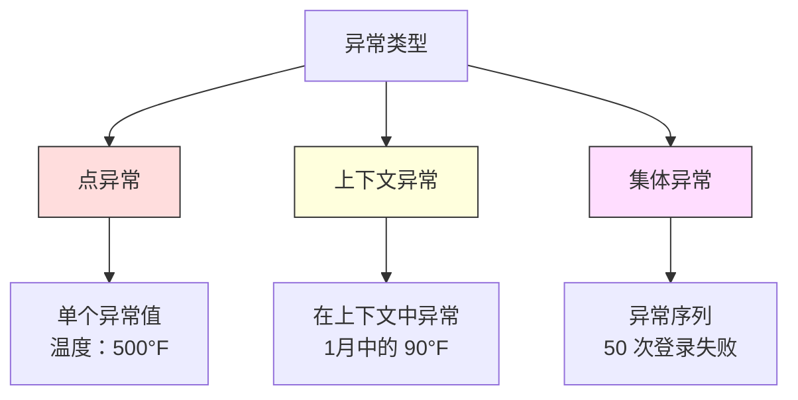
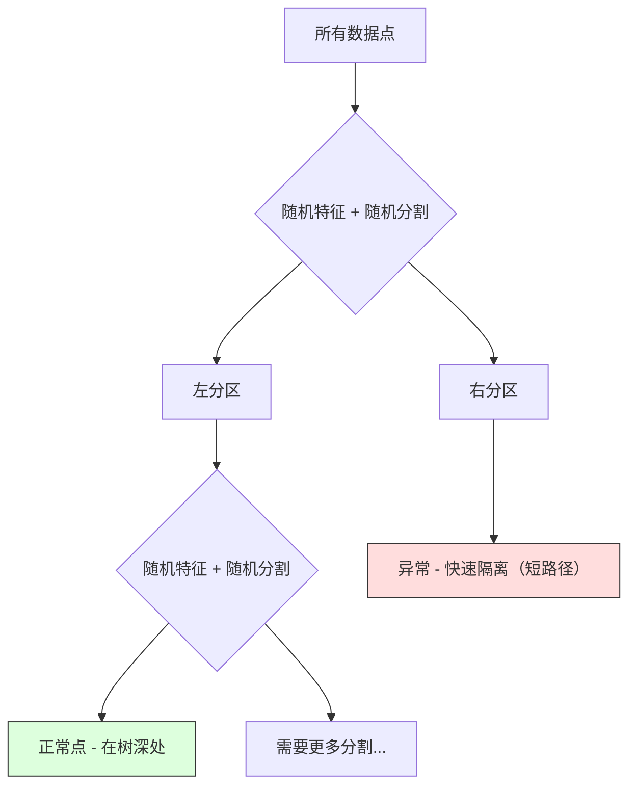

# 异常检测

> 正常易于定义，异常则是不符合任何规则的事物。

**类型：** Build
**语言：** Python
**前置条件：** Phase 2，第 01-09 课
**时间：** 约 75 分钟

## 学习目标

- 从零实现 Z-score、IQR 和 Isolation Forest 异常检测方法
- 区分点异常、上下文异常和集体异常，并为每种类型选择合适的检测方法
- 解释为什么异常检测被框架化为建模正常数据而非分类异常
- 比较无监督异常检测与有监督分类，并评估新型异常覆盖率与精确度之间的权衡

## 问题所在

一张信用卡下午 2 点在纽约使用，然后在下午 2:05 在东京使用。工厂传感器读数为 150 度，而正常范围是 80-120 度。一台服务器每秒发送 50,000 次请求，而日平均值仅为 200。

这些都是异常。发现它们很重要。欺诈损失数十亿美元。设备故障导致停机。网络入侵造成数据泄露。

挑战在于：你几乎没有异常的训练标签。欺诈只占交易的 0.1%。设备故障一年只发生几次。你无法训练标准分类器，因为"异常"类中几乎没有可学习的内容。即使你有了一些标签，见过的异常类型也不全是你会遇到的。明天的欺诈方案看起来与今天不同。

异常检测翻转了问题。与其学习什么是异常的，不如学习什么是正常的。任何偏离正常的都是可疑的。这种方法无需标签即可工作，能适应新型异常，且能扩展到大规模数据集。

## 概念

### 异常类型

并非所有异常都相同：

- **点异常（Point anomalies）。** 无论上下文如何都是异常的单个数据点。500 度的温度读数。一个通常消费 50 美元的账户发生了 50,000 美元的交易。
- **上下文异常（Contextual anomalies）。** 给定其上下文时显得异常的数据点。90 度在夏天是正常的，在冬天是异常的。相同的值，不同的上下文。
- **集体异常（Collective anomalies）。** 作为一个整体显得异常的连续数据点，尽管每个单独的点可能都是正常的。5 次登录失败是正常的。50 次连续失败则是暴力攻击。

大多数方法检测点异常。上下文异常需要时间或位置特征。集体异常需要序列感知方法。



### 无监督框架

在标准分类中，你对两个类都有标签。在异常检测中，你通常面临以下三种情况之一：

1. **完全无监督。** 完全没有标签。你在所有数据上训练检测器，并希望异常足够稀少而不会破坏"正常"模型。
2. **半监督。** 你只有干净的正常数据集。你在该干净集上拟合，然后对其他所有数据评分。这是可能的最强设置。
3. **弱监督。** 你有一些带标签的异常。将它们用于评估而非训练。无监督训练，然后在带标签子集上测量精确率和召回率。

关键洞察：异常检测从根本上不同于分类。你在建模正常数据的分布，而非两个类之间的决策边界。

### 有监督 vs 无监督：权衡

如果你有带标签的异常，应该用它们来训练（有监督分类）还是仅用于评估（无监督检测）？

**有监督（当作分类）：**
- 能检测到之前见过的确切类型的异常
- 对已知异常类型的精确度更高
- 完全错过新型异常
- 新异常类型出现时需要重新训练
- 需要足够的异常样本（通常太少）

**无监督（建模正常，标记偏离）：**
- 能检测任何偏离正常的事物，包括新型异常
- 不需要带标签的异常
- 假阳性率更高（并非所有异常事物都是坏的）
- 对分布漂移更鲁棒

在实践中，最好的系统结合两者：无监督检测用于广泛覆盖，有监督模型用于已知的优先级高的异常类型，人工审核用于模棱两可的案例。

### Z-score 方法

最简单的方法。计算每个特征的均值和标准差。标记任何距离均值超过 k 个标准差的数据点。

```text
z_score = (x - mean) / std
若 |z_score| > threshold 则为异常
```

默认阈值为 3.0（对于高斯分布，99.7% 的正常数据落在 3 个标准差内）。

**优点：** 简单。快速。可解释（"该值距离正常 4.5 个标准差"）。

**缺点：** 假设数据呈正态分布。对训练数据中的异常值敏感（异常值会偏移均值并膨胀标准差，使它们更难检测）。在多峰分布上失效。

**适用场景：** 数据大致呈钟形的单特征监控。服务器响应时间、制造公差、具有稳定基线的传感器读数。

**失效场景：** 多簇数据（两个办公地点有不同的基线温度）、偏斜数据（1000 美元的交易罕见但不算异常）、训练集中存在异常值的数据。

### IQR 方法

比 Z-score 更鲁棒。使用四分位距而非均值和标准差。

```
Q1 = 第 25 百分位数
Q3 = 第 75 百分位数
IQR = Q3 - Q1
下界 = Q1 - factor * IQR
上界 = Q3 + factor * IQR
若 x < 下界 或 x > 上界 则为异常
```

默认 factor 为 1.5。

**优点：** 对异常值鲁棒（百分位数不受极端值影响）。适用于偏斜分布。无需正态性假设。

**缺点：** 仅单变量（独立应用于每个特征）。无法检测仅在特征联合考虑时才异常的异常（一个点在单个特征上可能正常，但在联合空间中异常）。

**实践提示：** IQR 中的 1.5 因子对应箱线图的须线。须线外的点可能是异常值。使用 3.0 而非 1.5 会使检测器更保守（更少的标记，更少的假阳性）。合适的因子取决于你对误报的容忍度。

### Isolation Forest

关键洞察：异常是少数且不同的。在数据的随机划分中，异常更容易被隔离——它们需要更少的随机分割就能与其余数据分开。



**工作原理：**
1. 构建许多随机树（隔离森林）
2. 在每个节点，随机选择一个特征并在该特征的最小值和最大值之间随机选择一个分割值
3. 持续分割直到每个点都被隔离（在其各自的叶节点中）
4. 异常在所有树中具有更短的平均路径长度

**为什么有效：** 正常点存在于密集区域。许多随机分割才能将一个正常点从其邻居中隔离出来。异常点存在于稀疏区域。一两个随机分割就足以将它们隔离。

异常分数基于所有树中的平均路径长度，并除以随机二叉搜索树的期望路径长度进行归一化：

```
score(x) = 2^(-average_path_length(x) / c(n))
```

其中 `c(n)` 是 n 个样本的期望路径长度。分数接近 1 表示异常。分数接近 0.5 表示正常。分数接近 0 表示非常正常（在密集簇深处）。

**优点：** 无需分布假设。在高维中有效。可扩展性好（子线性于样本量，因为每棵树使用子样本）。处理混合特征类型。

**缺点：** 难以处理密集区域中的异常（遮蔽效应）。当许多特征不相关时，随机分割的效果较差。

**关键超参数：**
- `n_estimators`：树的数量。100 通常足够。更多的树给出更稳定的分数但计算更慢。
- `max_samples`：每棵树的样本数。原始论文中默认为 256。较小的值使单棵树精度较低但增加多样性。子采样正是 Isolation Forest 快的原因——每棵树只看到数据的一小部分。
- `contamination`：异常的预期比例。仅用于设置阈值。不影响分数本身。

### Local Outlier Factor（LOF）

LOF 将点周围的局部密度与其邻居的密度进行比较。处于稀疏区域且周围是密集区域的点是异常的。

**工作原理：**
1. 对于每个点，找到其 k 个最近邻居
2. 计算局部可达密度（邻域有多密集）
3. 将每个点的密度与其邻居的密度进行比较
4. 如果某个点的密度远低于其邻居，则它是离群点

**LOF 分数：**
- LOF 接近 1.0 表示与邻居密度相似（正常）
- LOF 大于 1.0 表示密度低于邻居（可能异常）
- LOF 远大于 1.0（如 2.0+）表示密度显著更低（很可能异常）

"局部"部分至关重要。考虑一个包含两个簇的数据集：一个包含 1000 个点的密集簇和一个包含 50 个点的稀疏簇。稀疏簇边缘的点在全局意义上并不异常——它有 50 个邻居。但如果其直接邻居比它更密集，那么它在局部意义上是异常的。LOF 捕捉了全局方法所遗漏的这种细微差别。

**优点：** 检测局部异常（在其邻域中异常的点，即使它们在全局意义上不异常）。适用于不同密度的簇。

**缺点：** 在大规模数据集上慢（朴素实现为 O(n²)）。对 k 的选择敏感。在高维中效果不佳（维度灾难影响距离计算）。

### 对比

| 方法 | 假设 | 速度 | 处理高维 | 检测局部异常 |
|------|------|------|----------|--------------|
| Z-score | 正态分布 | 非常快 | 是（每特征） | 否 |
| IQR | 无（每特征） | 非常快 | 是（每特征） | 否 |
| Isolation Forest | 无 | 快 | 是 | 部分 |
| LOF | 距离有意义 | 慢 | 差 | 是 |

### 评估挑战

评估异常检测器比评估分类器更难：

- **极端的类别不平衡。** 异常仅占 0.1% 时，对所有数据预测"正常"就能获得 99.9% 的准确率。准确率毫无用处。
- **AUROC 具有误导性。** 在重度不平衡的情况下，即使在实用阈值下模型错过了大多数异常，AUROC 看起来也很好。
- **更好的指标：** Precision@k（在前 k 个被标记的项目中，有多少是真实异常）、AUPRC（精确率-召回率曲线下面积），以及在固定假阳性率下的召回率。


### 异常检测流程

在实践中，异常检测遵循以下工作流：

1. **收集基线数据。** 理想情况下，一个你确定没有（或极少）异常的时间段。
2. **特征工程。** 原始特征加派生特征（滚动统计、时间特征、比率）。
3. **训练检测器。** 在基线数据上拟合。模型学习"正常"的样子。
4. **对新数据评分。** 每个新观测值都会获得一个异常分数。
5. **阈值选择。** 选择分数 cutoff。这是一个业务决策：更高的阈值意味着更少的误报但更多的漏报异常。
6. **告警并调查。** 被标记的点进入人工审核或自动响应。
7. **反馈收集。** 记录被标记的项目是真实异常还是误报。利用这些数据评估检测器并随时间调整阈值。

该流程永远"未完成"。数据分布会漂移，新的异常类型会出现，阈值需要调整。将异常检测视为一个活系统，而非一次性模型。

```figure
f3-anomaly-fence
```

## 动手实现

`code/anomaly_detection.py` 中的代码从零实现了 Z-score、IQR 和 Isolation Forest。

### Z-score 检测器

```python
def zscore_detect(X, threshold=3.0):
    mean = X.mean(axis=0)
    std = X.std(axis=0)
    std[std == 0] = 1.0
    z = np.abs((X - mean) / std)
    return z.max(axis=1) > threshold
```

简单且向量化。如果任何特征超过阈值则标记该点。

### IQR 检测器

```python
def iqr_detect(X, factor=1.5):
    q1 = np.percentile(X, 25, axis=0)
    q3 = np.percentile(X, 75, axis=0)
    iqr = q3 - q1
    iqr[iqr == 0] = 1.0
    lower = q1 - factor * iqr
    upper = q3 + factor * iqr
    outside = (X < lower) | (X > upper)
    return outside.any(axis=1)
```

### 从零实现 Isolation Forest

从零实现的版本构建随机划分特征空间的隔离树：

```python
class IsolationTree:
    def __init__(self, max_depth):
        self.max_depth = max_depth

    def fit(self, X, depth=0):
        n, p = X.shape
        if depth >= self.max_depth or n <= 1:
            self.is_leaf = True
            self.size = n
            return self
        self.is_leaf = False
        self.feature = np.random.randint(p)
        x_min = X[:, self.feature].min()
        x_max = X[:, self.feature].max()
        if x_min == x_max:
            self.is_leaf = True
            self.size = n
            return self
        self.threshold = np.random.uniform(x_min, x_max)
        left_mask = X[:, self.feature] < self.threshold
        self.left = IsolationTree(self.max_depth).fit(X[left_mask], depth + 1)
        self.right = IsolationTree(self.max_depth).fit(X[~left_mask], depth + 1)
        return self
```

隔离一个点的路径长度决定其异常分数。路径越短，异常程度越高。

`IsolationForest` 类封装了多棵树：

```python
class IsolationForest:
    def __init__(self, n_estimators=100, max_samples=256, seed=42):
        self.n_estimators = n_estimators
        self.max_samples = max_samples

    def fit(self, X):
        sample_size = min(self.max_samples, X.shape[0])
        max_depth = int(np.ceil(np.log2(sample_size)))
        for _ in range(self.n_estimators):
            idx = rng.choice(X.shape[0], size=sample_size, replace=False)
            tree = IsolationTree(max_depth=max_depth)
            tree.fit(X[idx])
            self.trees.append(tree)

    def anomaly_score(self, X):
        avg_path = 所有树中的平均路径长度
        scores = 2.0 ** (-avg_path / c(max_samples))
        return scores
```

归一化因子 `c(n)` 是在具有 n 个元素的二叉搜索树中进行不成功搜索的期望路径长度。它等于 `2 * H(n-1) - 2*(n-1)/n`，其中 `H` 是调和数。此归一化确保跨不同大小的数据集的分数可比较。

### 演示场景

代码生成多个测试场景：

1. **单簇含异常值。** 带有注入远离中心的异常的 2D 高斯簇。所有方法在此都应该有效。
2. **多模态数据。** 三个大小和密度不同的簇。簇间的点是异常的。Z-score 因每特征的取值范围较宽而表现不佳。
3. **高维数据。** 50 个特征，但异常仅在其中的 5 个上不同。测试方法是否能在特征子集中找到异常。

每个演示使用精确率、召回率、F1 和 Precision@k 比较所有方法。

## 使用它

使用 sklearn（使用库实现，而非从零实现）：

```python
from sklearn.ensemble import IsolationForest
from sklearn.neighbors import LocalOutlierFactor

iso = IsolationForest(n_estimators=100, contamination=0.05, random_state=42)
iso.fit(X_train)
predictions = iso.predict(X_test)

lof = LocalOutlierFactor(n_neighbors=20, contamination=0.05, novelty=True)
lof.fit(X_train)
predictions = lof.predict(X_test)
```

注意 `contamination` 设置异常的预期比例。正确设置它很重要——太低会错过异常，太高会产生误报。

`anomaly_detection.py` 中的代码在相同数据上将从零实现与 sklearn 进行比较。

### sklearn 的 Contamination 参数

sklearn 中的 `contamination` 参数决定将连续异常分数转换为二元预测的阈值。它不改变底层分数。

```python
iso_5 = IsolationForest(contamination=0.05)
iso_10 = IsolationForest(contamination=0.10)
```

两者产生相同的异常分数。但 `iso_5` 标记前 5%，而 `iso_10` 标记前 10%。如果你不知道真实的异常比例（你通常不知道），将 contamination 设为 "auto" 并直接使用原始分数。基于假阳性和假阴性的成本权衡设置你自己的阈值。

### One-Class SVM

另一个值得了解的无监督异常检测器。One-Class SVM 在高维特征空间中（使用核技巧）在正常数据周围拟合一个边界。

```python
from sklearn.svm import OneClassSVM

oc_svm = OneClassSVM(kernel="rbf", gamma="auto", nu=0.05)
oc_svm.fit(X_train)
predictions = oc_svm.predict(X_test)
```

`nu` 参数近似异常的比例。One-Class SVM 在小到中等规模数据集上效果良好，但不能扩展到非常大的数据（核矩阵呈二次增长）。

### 自编码器方法（预览）

自编码器是学习压缩和重建数据的神经网络。在正常数据上训练。在测试时，异常具有较高的重建误差，因为网络只学会了重建正常模式。

这将在 Phase 3（深度学习）中介绍，但原理相同：建模什么是正常的，标记什么偏离了正常。

### 集成异常检测

正如集成方法提升分类效果（第 11 课），结合多个异常检测器也能提升检测效果。最简单的方法：

1. 运行多个检测器（Z-score、IQR、Isolation Forest、LOF）
2. 将每个检测器的分数归一化到 [0, 1]
3. 对归一化分数取平均
4. 标记平均分数超过阈值的点

这减少了假阳性，因为不同的方法有不同的失效模式。被所有四种方法标记的点几乎肯定是异常的。仅被一种方法标记的点可能是该方法的一个 quirks。

更复杂的集成根据每个检测器的估计可靠性进行加权（在有已知异常的验证集上测量，如果有可用的话）。

### 生产注意事项

1. **阈值漂移。** 随着数据分布漂移，固定阈值会过时。监控异常分数的分布并定期调整。
2. **告警疲劳。** 太多误报会导致操作员不再关注。从高阈值开始（更少、更可靠的告警），随着信任建立再降低它。
3. **集成方法。** 在生产环境中，结合多个检测器。仅当多种方法一致认为某点是异常时才标记它。这能显著减少假阳性。
4. **特征工程。** 原始特征通常不够。添加滚动统计、比率、距上次事件的时间以及领域特定特征。好的特征集比检测器的选择更重要。
5. **反馈循环。** 当操作员调查被标记的项目并确认或驳回时，将这些反馈输入系统。随时间积累带标签的数据以评估和改进检测器。

## 交付

本课产出：
- `outputs/skill-anomaly-detector.md` -- 选择合适检测器的决策技能
- `code/anomaly_detection.py` -- 从零实现的 Z-score、IQR 和 Isolation Forest，以及 sklearn 对比

### 选择阈值

异常分数是连续的。你需要一个阈值来进行二元决策。这是一个业务决策，而非技术决策。

考虑两种场景：
- **欺诈检测。** 漏报欺诈代价高昂（chargebacks、客户信任）。误报成本是人工分析师 5 分钟的调查时间。设置较低的阈值以捕获更多欺诈，接受更多误报。
- **设备维护。** 误报意味着不必要的停机，成本 50,000 美元。漏报故障意味着 500,000 美元的维修。设置阈值以平衡这些成本。

两种情况下，最优阈值都取决于假阳性和假阴性的成本比例。绘制不同阈值下的精确率和召回率，叠加成本函数，并选择最小成本点。

### 扩展到生产

对于生产环境中的实时异常检测：

1. **批训练、在线评分。** 定期（每日、每周）在最近正常数据上训练模型。每条新观测到达时对其进行评分。
2. **特征计算必须匹配。** 如果你在 30 天的滚动统计上训练，你需要 30 天的历史数据来计算新观测的特征。缓冲所需的历史数据。
3. **分数分布监控。** 跟踪异常分数的分布随时间的变化。如果中位分数上升，要么数据在变化，要么模型已过时。
4. **可解释性。** 当你标记异常时，说明原因。Z-score："特征 X 比正常高出 4.2 个标准差。"Isolation Forest："该点平均在 3.1 次分割中被隔离（正常点需要 8.5 次）。"

## 练习

1. **阈值调优。** 使用从 1.0 到 5.0、步长为 0.5 的阈值运行 Z-score 检测器。绘制每个阈值下的精确率和召回率。你的数据的最佳甜蜜点在哪里？

2. **多元异常。** 创建 2D 数据，其中每个特征单独看都很正常，但组合起来是异常的（例如，远离主簇对角线的点）。展示 Z-score 逐特征会错过这些，但 Isolation Forest 能检测到。

3. **从零实现 LOF。** 使用 k 近邻实现 Local Outlier Factor。在相同数据上与 sklearn 的 LocalOutlierFactor 进行比较。使用 k=10 和 k=50 —— k 的选择如何影响结果？

4. **流式异常检测。** 修改 Z-score 检测器以在流式设置中工作：使用 Welford 的在线算法随着新点到来更新运行均值和方差。与相同数据上的批量 Z-score 进行比较。

5. **真实世界评估。** 获取一个带有已知异常的数据集（例如来自 Kaggle 的信用卡欺诈数据）。使用 precision@100、precision@500 和 AUPRC 评估所有四种方法。哪种方法效果最好？为什么？

## 关键术语

| 术语 | 人们说什么 | 实际含义 |
|------|-----------|---------|
| 异常（Anomaly） | "离群点、异常点" | 显著偏离正常数据预期模式的数据点 |
| 点异常（Point anomaly） | "单个奇怪的值" | 无论上下文如何都显得异常的单个观测值 |
| 上下文异常（Contextual anomaly） | "正常的值，错误的上下文" | 给定其上下文（时间、位置等）时显得异常的观测，但在其他上下文中可能是正常的 |
| Isolation Forest | "随机分割以查找离群点" | 由随机树组成的集成，用比正常点更少的分割隔离异常 |
| Local Outlier Factor | "将密度与邻居比较" | 标记其局部密度远低于邻居密度的点的方法 |
| Z-score | "距离均值的标准差数" | (x - mean) / std，衡量一个点距离中心有多少个标准差 |
| IQR | "四分位距" | Q3 - Q1，衡量中间 50% 数据的散布，用于鲁棒离群点检测 |
| Contamination | "异常的预期比例" | 告诉检测器应标记多少比例数据为异常的超参数 |
| Precision@k | "在前 k 个标记中，有多少是真实的" | 仅在前 k 个最可疑点上计算的精确率，适用于不平衡的异常检测 |
| AUPRC | "精确率-召回率曲线下的面积" | 总结所有阈值下精确率-召回率性能的指标，比 AUROC 更适合不平衡数据 |

## 延伸阅读

- [Liu et al., Isolation Forest (2008)](https://cs.nju.edu.cn/zhouzh/zhouzh.files/publication/icdm08b.pdf) -- 原始 Isolation Forest 论文
- [Breunig et al., LOF: Identifying Density-Based Local Outliers (2000)](https://dl.acm.org/doi/10.1145/342009.335388) -- 原始 LOF 论文
- [scikit-learn Outlier Detection docs](https://scikit-learn.org/stable/modules/outlier_detection.html) -- 所有 sklearn 异常检测器概述
- [Chandola et al., Anomaly Detection: A Survey (2009)](https://dl.acm.org/doi/10.1145/1541880.1541882) -- 异常检测方法的全面综述
- [Goldstein and Uchida, A Comparative Evaluation of Unsupervised Anomaly Detection Algorithms (2016)](https://journals.plos.org/plosone/article?id=10.1371/journal.pone.0152173) -- 在真实数据集上对 10 种方法的实证比较
