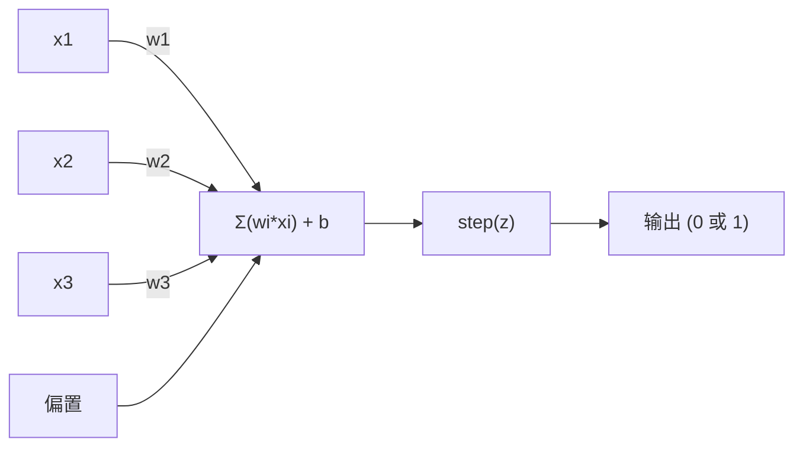
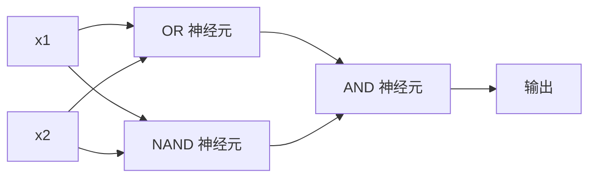

# 感知机

> 感知机是神经网络的原子。将其拆开，你找到的是权重、偏置和决策。

**类型:** 构建
**语言:** Python
**前置知识:** 第一阶段（线性代数直觉）
**时间:** ~60 分钟

## 学习目标

- 用 Python 从零实现感知机，包括权重更新规则和阶跃激活函数
- 解释为什么单个感知机只能解决线性可分问题，并演示 XOR 失败案例
- 通过组合 OR、NAND 和 AND 门构建多层感知机来解决 XOR 问题
- 使用 sigmoid 激活函数和反向传播训练一个两层网络，自动学习 XOR

## 问题所在

你懂向量和点积。你懂矩阵如何将输入转换为输出。但机器如何*学习*该使用哪种变换？

感知机回答了这个问题。它是最简单的学习机器：接受一些输入，乘以权重，加上偏置，做出二元决策。然后调整。就是这样。所有构建过的神经网络都是这种思想的层层叠加。

理解感知机意味着理解代码中"学习"的真正含义：调整数字，直到输出与现实匹配。

## 概念解析

### 一个神经元，一个决策

感知机接收 n 个输入，将每个输入乘以权重，求和，加上偏置，然后将结果通过激活函数。



阶跃函数很粗暴：如果加权总和加偏置 >= 0，输出 1。否则输出 0。

```
step(z) = 1  if z >= 0
           0  if z < 0
```

这是一个线性分类器。权重和偏置定义了一条线（或在更高维度中的超平面），将输入空间划分为两个区域。

### 决策边界

对于两个输入，感知机在 2D 空间中画一条线：

```
  x2
  ┤
  │  类别 1          /
  │    (0)          /
  │                /
  │               / w1·x1 + w2·x2 + b = 0
  │              /
  │             /     类别 2
  │            /        (1)
  ┼───────────/──────────── x1
```

线的一侧输出 0，另一侧输出 1。训练移动这条线，直到它正确分离类别。

### 学习规则

感知机学习规则很简单：

```
对于每个训练样本 (x, y_true):
    y_pred = predict(x)
    error = y_true - y_pred

    对于每个权重:
        w_i = w_i + learning_rate * error * x_i
    bias = bias + learning_rate * error
```

如果预测正确，error = 0，什么都不变。如果预测 0 但应该是 1，权重增加。如果预测 1 但应该是 0，权重减小。学习率控制每次调整的幅度。

### XOR 问题

问题在这里出现。看这些逻辑门：

```
AND 门:              OR 门:             XOR 门:
x1  x2  out          x1  x2  out         x1  x2  out
0   0   0            0   0   0           0   0   0
0   1   0            0   1   1           0   1   1
1   0   0            1   0   1           1   0   1
1   1   1            1   1   1           1   1   0
```

AND 和 OR 是线性可分的：你可以画一条单一的线将 0 和 1 分开。XOR 不是。没有一条单一的线能将 [0,1] 和 [1,0] 与 [0,0] 和 [1,1] 分开。

```
AND（可分离）:          XOR（不可分离）:

  x2                      x2
  1 ┤  0     1            1 ┤  1     0
    │     /                 │
  0 ┤  0 / 0              0 ┤  0     1
    ┼──/──────── x1         ┼──────────── x1
       line works!          no single line works!
```

这是一个根本性限制。单个感知机只能解决线性可分问题。Minsky 和 Papert 在 1969 年证明了这一点，这让神经网络研究停滞了近十年。

解决方案：将感知机堆叠成层。多层感知机可以通过将两个线性决策组合成一个非线性决策来解决 XOR。

```figure
perceptron-boundary
```

## 动手构建

### 步骤 1：感知机类

```python
class Perceptron:
    def __init__(self, n_inputs, learning_rate=0.1):
        self.weights = [0.0] * n_inputs
        self.bias = 0.0
        self.lr = learning_rate

    def predict(self, inputs):
        total = sum(w * x for w, x in zip(self.weights, inputs))
        total += self.bias
        return 1 if total >= 0 else 0

    def train(self, training_data, epochs=100):
        for epoch in range(epochs):
            errors = 0
            for inputs, target in training_data:
                prediction = self.predict(inputs)
                error = target - prediction
                if error != 0:
                    errors += 1
                    for i in range(len(self.weights)):
                        self.weights[i] += self.lr * error * inputs[i]
                    self.bias += self.lr * error
            if errors == 0:
                print(f"在第 {epoch + 1} 轮收敛")
                return
        print(f"{epochs} 轮后未收敛")
```

### 步骤 2：在逻辑门上训练

```python
and_data = [
    ([0, 0], 0),
    ([0, 1], 0),
    ([1, 0], 0),
    ([1, 1], 1),
]

or_data = [
    ([0, 0], 0),
    ([0, 1], 1),
    ([1, 0], 1),
    ([1, 1], 1),
]

not_data = [
    ([0], 1),
    ([1], 0),
]

print("=== AND 门 ===")
p_and = Perceptron(2)
p_and.train(and_data)
for inputs, _ in and_data:
    print(f"  {inputs} -> {p_and.predict(inputs)}")

print("\n=== OR 门 ===")
p_or = Perceptron(2)
p_or.train(or_data)
for inputs, _ in or_data:
    print(f"  {inputs} -> {p_or.predict(inputs)}")

print("\n=== NOT 门 ===")
p_not = Perceptron(1)
p_not.train(not_data)
for inputs, _ in not_data:
    print(f"  {inputs} -> {p_not.predict(inputs)}")
```

### 步骤 3：观察 XOR 失败

```python
xor_data = [
    ([0, 0], 0),
    ([0, 1], 1),
    ([1, 0], 1),
    ([1, 1], 0),
]

print("\n=== XOR 门（单个感知机）=== ")
p_xor = Perceptron(2)
p_xor.train(xor_data, epochs=1000)
for inputs, expected in xor_data:
    result = p_xor.predict(inputs)
    status = "正确" if result == expected else "错误"
    print(f"  {inputs} -> {result}（预期 {expected}）{status}")
```

它永远不会收敛。这是单个感知机无法学习 XOR 的硬证据。

### 步骤 4：用两层网络解决 XOR

技巧：XOR = (x1 OR x2) AND NOT (x1 AND x2)。组合三个感知机：



```python
def xor_network(x1, x2):
    or_neuron = Perceptron(2)
    or_neuron.weights = [1.0, 1.0]
    or_neuron.bias = -0.5

    nand_neuron = Perceptron(2)
    nand_neuron.weights = [-1.0, -1.0]
    nand_neuron.bias = 1.5

    and_neuron = Perceptron(2)
    and_neuron.weights = [1.0, 1.0]
    and_neuron.bias = -1.5

    hidden1 = or_neuron.predict([x1, x2])
    hidden2 = nand_neuron.predict([x1, x2])
    output = and_neuron.predict([hidden1, hidden2])
    return output


print("\n=== XOR 门（多层网络）=== ")
for inputs, expected in xor_data:
    result = xor_network(inputs[0], inputs[1])
    print(f"  {inputs} -> {result}（预期 {expected}）")
```

四个案例全部正确。将感知机堆叠成层，可以创建单个感知机无法产生的决策边界。

### 步骤 5：训练两层网络

步骤 4 手动设计了权重。这对 XOR 有效，但对真实问题无效——因为你不知道正确的权重。解决方案：用 sigmoid 替换阶跃函数，通过反向传播自动学习权重。

```python
class TwoLayerNetwork:
    def __init__(self, learning_rate=0.5):
        import random
        random.seed(0)
        self.w_hidden = [[random.uniform(-1, 1), random.uniform(-1, 1)] for _ in range(2)]
        self.b_hidden = [random.uniform(-1, 1), random.uniform(-1, 1)]
        self.w_output = [random.uniform(-1, 1), random.uniform(-1, 1)]
        self.b_output = random.uniform(-1, 1)
        self.lr = learning_rate

    def sigmoid(self, x):
        import math
        x = max(-500, min(500, x))
        return 1.0 / (1.0 + math.exp(-x))

    def forward(self, inputs):
        self.inputs = inputs
        self.hidden_outputs = []
        for i in range(2):
            z = sum(w * x for w, x in zip(self.w_hidden[i], inputs)) + self.b_hidden[i]
            self.hidden_outputs.append(self.sigmoid(z))
        z_out = sum(w * h for w, h in zip(self.w_output, self.hidden_outputs)) + self.b_output
        self.output = self.sigmoid(z_out)
        return self.output

    def train(self, training_data, epochs=10000):
        for epoch in range(epochs):
            total_error = 0
            for inputs, target in training_data:
                output = self.forward(inputs)
                error = target - output
                total_error += error ** 2

                d_output = error * output * (1 - output)

                saved_w_output = self.w_output[:]
                hidden_deltas = []
                for i in range(2):
                    h = self.hidden_outputs[i]
                    hd = d_output * saved_w_output[i] * h * (1 - h)
                    hidden_deltas.append(hd)

                for i in range(2):
                    self.w_output[i] += self.lr * d_output * self.hidden_outputs[i]
                self.b_output += self.lr * d_output

                for i in range(2):
                    for j in range(len(inputs)):
                        self.w_hidden[i][j] += self.lr * hidden_deltas[i] * inputs[j]
                    self.b_hidden[i] += self.lr * hidden_deltas[i]
```

```python
net = TwoLayerNetwork(learning_rate=2.0)
net.train(xor_data, epochs=10000)
for inputs, expected in xor_data:
    result = net.forward(inputs)
    predicted = 1 if result >= 0.5 else 0
    print(f"  {inputs} -> {result:.4f}（四舍五入：{predicted}，预期 {expected}）")
```

与步骤 4 有两个关键区别。第一，sigmoid 替换了阶跃函数——它是平滑的，因此梯度存在。第二，`train` 方法从输出层反向传播误差到隐藏层，根据每个权重对误差的贡献比例调整它。这就是 20 行代码的反向传播。

这是通往第 03 课的桥梁。`d_output` 和 `hidden_deltas` 背后的数学是链式法则在网络图上的应用。我们在那里会进行正式推导。

## 实际应用

你刚刚从零构建的一切，存在于一次导入中：

```python
from sklearn.linear_model import Perceptron as SkPerceptron
import numpy as np

X = np.array([[0,0],[0,1],[1,0],[1,1]])
y = np.array([0, 0, 0, 1])

clf = SkPerceptron(max_iter=100, tol=1e-3)
clf.fit(X, y)
print([clf.predict([x])[0] for x in X])
```

五行代码。你的 30 行 `Perceptron` 类实现了同样的功能。sklearn 版本添加了收敛检查、多种损失函数和稀疏输入支持——但核心循环完全相同：加权求和、阶跃函数、误差权重更新。

真正的差距在于规模扩展。生产网络中发生的变化：

- 阶跃函数变为 sigmoid、ReLUs 或其他平滑激活函数
- 权重通过反向传播自动学习（第 03 课）
- 网络层数加深：3、10、100+ 层
- 同一原则保持不变：每层从上一层的输出创建新特征

单个感知机只能画直线。将它们堆叠起来，你就可以画任何形状。

## 交付成果

本课产出：
- `outputs/skill-perceptron.md` - 一个技能指南，涵盖何时需要单层 vs 多层架构

## 练习题

1. 在 NAND 门（通用门——任何逻辑电路都可以用 NAND 构建）上训练感知机。验证其权重和偏置形成有效的决策边界。
2. 修改 Perceptron 类，在每个 epoch 跟踪决策边界（w1*x1 + w2*x2 + b = 0）。打印 AND 门训练过程中直线的移动情况。
3. 构建一个 3 输入感知机，仅当 3 个输入中至少有 2 个为 1 时输出 1（多数投票函数）。这是否是线性可分的？为什么？

## 关键术语

| 术语 | 人们常说的 | 实际含义 |
|------|-----------|----------|
| 感知机 | "假神经元" | 线性分类器：输入和权重的点积，加上偏置，通过阶跃函数 |
| 权重 | "输入有多重要" | 放大每个输入对决策贡献的乘数 |
| 偏置 | "阈值" | 一个常数，移动决策边界，让感知机即使在没有输入时也能触发 |
| 激活函数 | "压缩值的函数" | 在加权求和之后应用的函数——感知机用阶跃函数，现代网络用 sigmoid/ReLU |
| 线性可分 | "可以在它们之间画一条线" | 一个数据集，其中单个超平面可以完美分离类别 |
| XOR 问题 | "感知机做不到的事" | 证明单层网络无法学习非线性可分函数的示例 |
| 决策边界 | "分类器切换的位置" | 将输入空间划分为两个类别的超平面 w*x + b = 0 |
| 多层感知机 | "真正的神经网络" | 按层堆叠的感知机，每层的输出作为下一层的输入 |

## 延伸阅读

- Frank Rosenblatt，《感知机：大脑中信息存储和组织的概率模型》（1958）—— 开启一切的原始论文
- Minsky & Papert，《感知机》（1969）—— 证明 XOR 无法由单层网络解决的著作，让感知机研究停滞了近十年
- Michael Nielsen，《神经网络与深度学习》，第一章（http://neuralnetworksanddeeplearning.com/）—— 免费在线阅读，关于感知机如何组合成网络的最佳可视化解释
