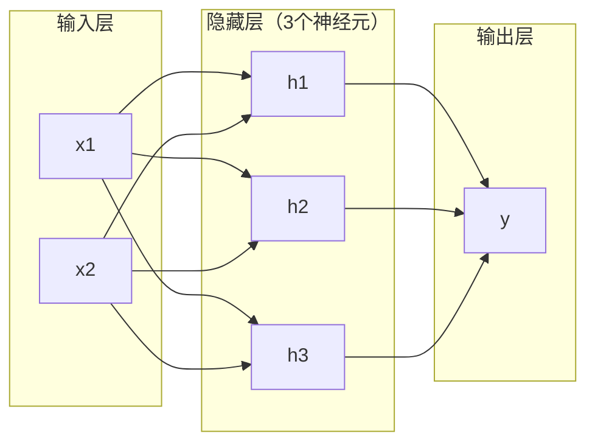
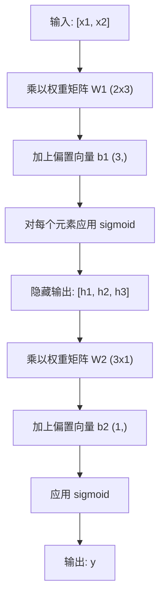

# 多层网络与正向传播

> 一个神经元画一条线。堆叠它们，你就能画出任何东西。

**类型：** 构建
**语言：** Python
**前置知识：** 阶段 01（数学基础），课程 03.01（感知机）
**时间：** 约 90 分钟

## 学习目标

- 从零开始使用 Layer 和 Network 类构建多层网络，实现完整的正向传播
- 追踪矩阵维度在网络各层中的变化，识别形状不匹配的问题
- 解释堆叠非线性激活函数如何使网络能够学习弯曲的决策边界
- 使用 2-2-1 架构和手工调优的 sigmoid 权重解决 XOR 问题

## 问题所在

单个神经元只能画直线。就是这样。在你的数据中画一条直线。AI 中的每一个真实问题——图像识别、语言理解、下围棋——都需要曲线。将神经元堆叠成层，你就能获得曲线。

1969 年，Minsky 和 Papert 证明了这种局限性是致命的：单层网络无法学习 XOR。不是"难以学习"——是数学上不可能。XOR 的真值表将 [0,1] 和 [1,0] 放在一边，[0,0] 和 [1,1] 放在另一边。没有任何一条直线能将它们分开。

这让神经网络的研究经费中断了十多年。 hindsight 看来的解决方案很明显：停止只使用一层。将神经元堆叠成层。让第一层将输入空间雕刻成新的特征，让第二层将这些特征组合成任何单一线条都无法做出的决策。

这种堆叠就是多层网络。它是当今生产环境中所有深度学习模型的基础。正向传播——数据从输入经过隐藏层流向输出——是你需要构建的第一件事。

## 概念解析

### 层：输入层、隐藏层、输出层

多层网络有三种类型的层：

**输入层**——严格来说不算真正的层。它存储你的原始数据。两个特征意味着两个输入节点。这里不发生任何计算。

**隐藏层**——工作发生的地方。每个神经元接收来自上一层的所有输出，应用权重和偏置，然后将结果通过激活函数传递。称为"隐藏"是因为你在训练数据中永远不会直接看到这些值。

**输出层**——最终答案。对于二分类，使用一个带有 sigmoid 的神经元。对于多分类，每个类别一个神经元。



这是一个 2-3-1 网络。两个输入，三个隐藏神经元，一个输出。每条连接都携带一个权重。每个神经元（除了输入层）都携带一个偏置。

每一层产生一个称为隐藏状态的数值向量。对于文本，隐藏状态增加维度——用 768 个数字编码一个词以捕捉语义含义。对于图像，它们降低维度——将数百万像素压缩为可管理的表示。隐藏状态是学习发生的地方。

### 神经元与激活函数

每个神经元做三件事：

1. 将每个输入乘以其对应的权重
2. 求所有乘积之和并加上偏置
3. 将总和通过激活函数传递

目前，激活函数是 sigmoid：

```
sigmoid(z) = 1 / (1 + e^(-z))
```

Sigmoid 将任意数值压缩到 (0, 1) 范围内。大的正输入推向 1。大的负输入推向 0。零映射到 0.5。这条平滑曲线使学习成为可能——与感知机的硬性阶跃不同，sigmoid 处处都有梯度。

### 正向传播：数据如何流动

正向传播将输入数据逐层推过网络，直到到达输出。正向传播过程中不会发生学习。它是纯计算：乘法、加法、激活、重复。



在每一层，三个操作按顺序发生：

```
z = W * input + b       (线性变换)
a = sigmoid(z)           (激活)
```

前一层的输出成为下一层的输入。这就是整个正向传播。

### 矩阵维度

追踪维度是深度学习中最重要的调试技能。以下是 2-3-1 网络：

| 步骤 | 操作 | 维度 | 结果形状 |
|------|-----------|------------|-------------|
| 输入 | x | -- | (2,) |
| 隐藏层线性 | W1 * x + b1 | W1: (3, 2), b1: (3,) | (3,) |
| 隐藏层激活 | sigmoid(z1) | -- | (3,) |
| 输出层线性 | W2 * h + b2 | W2: (1, 3), b2: (1,) | (1,) |
| 输出层激活 | sigmoid(z2) | -- | (1,) |

规则：第 k 层的权重矩阵 W 形状为 (第k层神经元数, 第k-1层神经元数)。行匹配当前层。列匹配前一层。如果形状不匹配，你有 bug。

### 通用近似定理

1989 年，George Cybenko 证明了某件非凡的事情：具有单个隐藏层和足够多神经元的神经网络可以将任何连续函数逼近到任意所需的精度。

这并不意味着一个隐藏层总是最好的。它意味着架构在理论上是可行的。在实践中，更深的网络（更多层，每层更少神经元）比浅而宽的网络用 far fewer total parameters 学习相同的函数。这就是深度学习有效的原因。

直觉：隐藏层的每个神经元学习一个"凸起"或特征。足够多的凸起放置在正确的位置可以逼近任何平滑曲线。更多神经元，更多凸起，更好的逼近。


### 可组合性

神经网络是可组合的。你可以堆叠它们、串联它们、并行运行它们。Whisper 模型使用编码器网络处理音频，使用独立的解码器网络生成文本。现代 LLM 是仅解码器。BERT 是仅编码器。T5 是编码器-解码器。架构选择决定了模型能做什么。

```figure
mlp-forward
```

## 构建它

纯 Python。不使用 numpy。每个矩阵操作都从零编写。

### 步骤 1：Sigmoid 激活函数

```python
import math

def sigmoid(x):
    x = max(-500.0, min(500.0, x))
    return 1.0 / (1.0 + math.exp(-x))
```

钳制到 [-500, 500] 防止溢出。`math.exp(500)` 是大但有限的。`math.exp(1000)` 是无穷大。

### 步骤 2：Layer 类

深度学习中最重要的操作是矩阵乘法。每一层、每个注意力头、每次正向传播——全是矩阵乘法。线性层接收输入向量，将其乘以权重矩阵，然后加上偏置向量：y = Wx + b。这个单一方程占据了神经网络 90% 的计算量。

层持有权重矩阵和偏置向量。其 forward 方法接收输入向量并返回激活后的输出。

```python
class Layer:
    def __init__(self, n_inputs, n_neurons, weights=None, biases=None):
        if weights is not None:
            self.weights = weights
        else:
            import random
            self.weights = [
                [random.uniform(-1, 1) for _ in range(n_inputs)]
                for _ in range(n_neurons)
            ]
        if biases is not None:
            self.biases = biases
        else:
            self.biases = [0.0] * n_neurons

    def forward(self, inputs):
        self.last_input = inputs
        self.last_output = []
        for neuron_idx in range(len(self.weights)):
            z = sum(
                w * x for w, x in zip(self.weights[neuron_idx], inputs)
            )
            z += self.biases[neuron_idx]
            self.last_output.append(sigmoid(z))
        return self.last_output
```

权重矩阵的形状为 (n_neurons, n_inputs)。每行是一个神经元在所有输入上的权重。forward 方法遍历神经元，计算加权和加上偏置，应用 sigmoid，并收集结果。

### 步骤 3：Network 类

网络是层的列表。正向传播将它们串联：第 k 层的输出 feeds into 第 k+1 层。

```python
class Network:
    def __init__(self, layers):
        self.layers = layers

    def forward(self, inputs):
        current = inputs
        for layer in self.layers:
            current = layer.forward(current)
        return current
```

这就是整个正向传播。四行逻辑。数据进去，流经每一层，从另一侧出来。

### 步骤 4：用手调权重解决 XOR

在第 01 课中，我们通过组合 OR、NAND 和 AND 感知机解决了 XOR。现在用我们的 Layer 和 Network 类做同样的事情。2-2-1 架构：两个输入，两个隐藏神经元，一个输出。

```python
hidden = Layer(
    n_inputs=2,
    n_neurons=2,
    weights=[[20.0, 20.0], [-20.0, -20.0]],
    biases=[-10.0, 30.0],
)

output = Layer(
    n_inputs=2,
    n_neurons=1,
    weights=[[20.0, 20.0]],
    biases=[-30.0],
)

xor_net = Network([hidden, output])

xor_data = [
    ([0, 0], 0),
    ([0, 1], 1),
    ([1, 0], 1),
    ([1, 1], 0),
]

for inputs, expected in xor_data:
    result = xor_net.forward(inputs)
    predicted = 1 if result[0] >= 0.5 else 0
    print(f"  {inputs} -> {result[0]:.6f} (rounded: {predicted}, expected: {expected})")
```

大的权重（20，-20）使 sigmoid 表现得像阶跃函数。第一个隐藏神经元近似 OR。第二个近似 NAND。输出神经元将它们组合成 AND，这就是 XOR。

### 步骤 5：圆分类

更困难的问题：将 2D 点分类为在半径为 0.5 的中心在原点的圆内或外。这需要弯曲的决策边界——对单个感知机是不可能的。

```python
import random
import math

random.seed(42)

data = []
for _ in range(200):
    x = random.uniform(-1, 1)
    y = random.uniform(-1, 1)
    label = 1 if (x * x + y * y) < 0.25 else 0
    data.append(([x, y], label))

circle_net = Network([
    Layer(n_inputs=2, n_neurons=8),
    Layer(n_inputs=8, n_neurons=1),
])
```

使用随机权重，网络将无法良好分类。但正向传播仍然运行。这就是重点——正向传播只是计算。学习正确的权重是反向传播，将在课程 03 中讲解。

```python
correct = 0
for inputs, expected in data:
    result = circle_net.forward(inputs)
    predicted = 1 if result[0] >= 0.5 else 0
    if predicted == expected:
        correct += 1

print(f"Accuracy with random weights: {correct}/{len(data)} ({100*correct/len(data):.1f}%)")
```

随机权重给出较差的准确率——通常比猜测多数类还差。经过训练（课程 03）后，具有 8 个隐藏神经元的相同架构将绘制一条分离内外的弯曲边界。

## 使用它

PyTorch 用四行代码完成上述所有操作：

```python
import torch
import torch.nn as nn

model = nn.Sequential(
    nn.Linear(2, 8),
    nn.Sigmoid(),
    nn.Linear(8, 1),
    nn.Sigmoid(),
)

x = torch.tensor([[0.0, 0.0], [0.0, 1.0], [1.0, 0.0], [1.0, 1.0]])
output = model(x)
print(output)
```

`nn.Linear(2, 8)` 就是你的 Layer 类：形状为 (8, 2) 的权重矩阵，形状为 (8,) 的偏置向量。`nn.Sigmoid()` 是你的 sigmoid 函数逐元素应用。`nn.Sequential` 就是你的 Network 类：按顺序串联层。

区别在于速度 and 规模。PyTorch 在 GPU 上运行，处理包含数百万样本的批次，并自动计算反向传播的梯度。但正向传播逻辑与你刚刚从零构建的完全相同。

## 交付成果

本课程产出可用于设计网络架构的可重用 prompt：

- `outputs/prompt-network-architect.md`

当你需要决定给定问题应该使用多少层、每层多少神经元以及哪些激活函数时，使用它。

## 练习

1. 构建一个 2-4-2-1 网络（两个隐藏层），并使用随机权重在 XOR 数据上运行正向传播。打印中间隐藏层的输出，观察表示如何在每一层变换。

2. 将圆分类器中的隐藏层大小从 8 改为 2，然后改为 32。每次都使用随机权重运行正向传播。隐藏神经元的数量是否改变输出范围 or 分布？为什么？

3. 在 Network 类上实现一个 `count_parameters` 方法，返回可训练权重和偏置的总数。在 784-256-128-10 网络（经典的 MNIST 架构）上测试它。它有多少参数？

4. 为 3-4-4-2 网络构建正向传播。输入 RGB 颜色值（归一化到 0-1），观察两个输出。这是具有两个类别的简单颜色分类器的架构。

5. 用"泄漏阶跃"函数替换 sigmoid：如果 z < 0 则返回 0.01 * z，否则返回 1.0。使用步骤 4 中相同的 hand-tuned 权重在 XOR 上运行正向传播。它还能工作吗？为什么平滑的 sigmoid 优于硬截断？

## 关键术语

| 术语 | 人们怎么说 | 实际含义 |
|------|----------------|----------------------|
| 正向传播 | "运行模型" | 将输入逐层推过——乘以权重，加偏置，激活——以产生输出 |
| 隐藏层 | "中间部分" | 输入和输出之间的任何层，其值在数据中未直接观察 |
| 多层网络 | "深度神经网络" | 逐序列堆叠的神经元层，每层的输出 feeds into 下一层的输入 |
| 激活函数 | "非线性" | 在线性变换后应用的函数，在决策边界中引入曲线 |
| Sigmoid | "S 形曲线" | sigma(z) = 1/(1+e^(-z))，将任意实数压缩到 (0,1)，处处平滑且可微 |
| 权重矩阵 | "参数" | 形状为 (当前层神经元数, 前一层神经元数) 的矩阵 W，包含可学习的连接强度 |
| 偏置向量 | "偏移" | 矩阵乘法后添加的向量，使神经元即使所有输入为零也能激活 |
| 通用近似 | "神经网络能学习任何东西" | 具有足够多神经元的单个隐藏层可以逼近任何连续函数——但"足够多"可能意味着数十亿 |
| 线性变换 | "矩阵乘法步骤" | z = W * x + b，激活前的计算，将输入映射到新空间 |
| 决策边界 | "分类器切换的位置" | 网络输出穿越分类阈值的输入空间中的表面 |

## 延伸阅读

- Michael Nielsen，《Neural Networks and Deep Learning》，第 1-2 章 (http://neuralnetworksanddeeplearning.com/)——正向传播和网络结构最清晰免费的解释，配有交互式可视化
- Cybenko，《Approximation by Superpositions of a Sigmoidal Function》(1989)——原始通用近似定理论文，出人意料地易读
- 3Blue1Brown，《But what is a neural network?》(https://www.youtube.com/watch?v=aircAruvnKk)——20 分钟可视化逐层讲解，涵盖层、权重和正向传播，构建正确的心理模型
- Goodfellow、Bengio、Courville，《Deep Learning》，第 6 章 (https://www.deeplearningbook.org/)——多层网络的标准参考，免费在线
