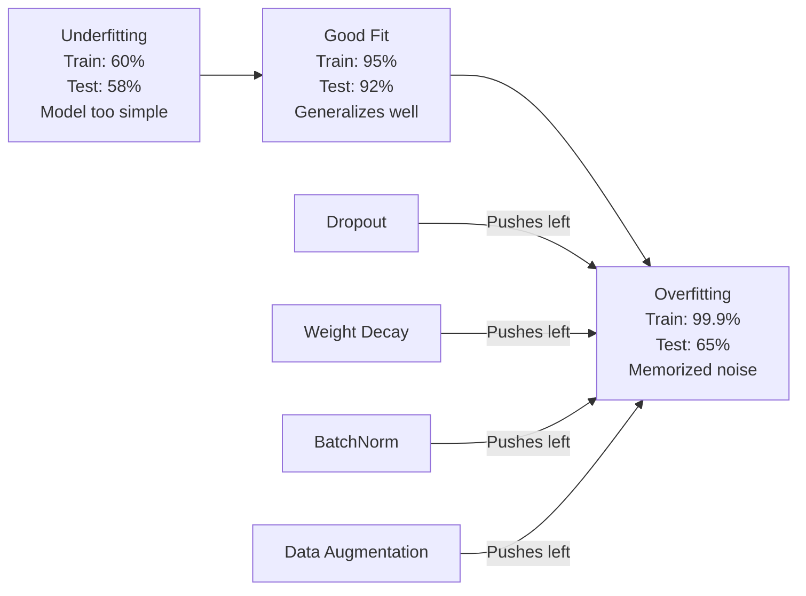
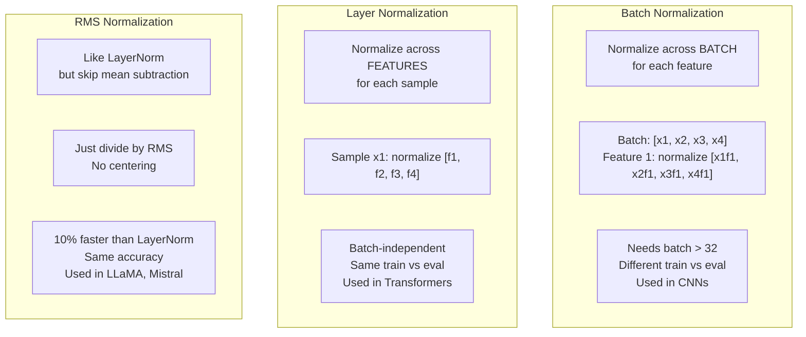
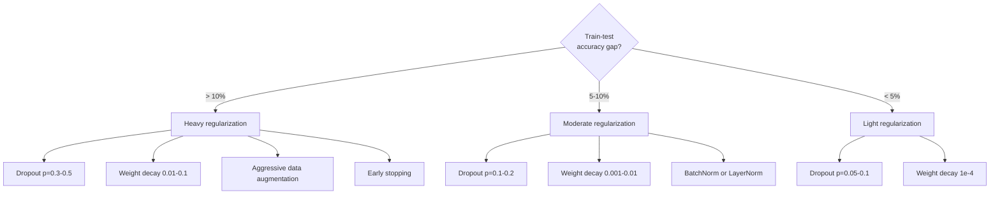

<<<START>>>
# 正则化
<<<

> Your model gets 99% on training data and 60% on test data. It memorized instead of learning. Regularization is the tax you impose on complexity to force generalization.

**Type:** Build
**Languages:** Python
**Prerequisites:** Lesson 03.06 (Optimizers)
**Time:** ~75 minutes

## Learning Objectives

- No explanation or preamble

Let me translate each bullet point:

- Implement dropout with inverted scaling, L2 weight decay, batch normalization, layer normalization, and RMSNorm from scratch
- Measure the train-test accuracy gap and diagnose overfitting using regularization experiments
- Explain why transformers use LayerNorm instead of BatchNorm and why modern LLMs prefer RMSNorm
- Apply the correct combination of regularization techniques based on the severity of overfitting

Technical terms to keep: dropout, L2, RMSNorm, LayerNorm, BatchNorm, transformers, LLMs, train-test accuracy gap, overfitting, regularization

Let me translate naturally:

- 从零开始实现带倒置缩放的 dropout、L2 权重衰减、批归一化、层归一化和 RMSNorm
- 通过正则化实验测量训练-测试准确率差距，并诊断过拟合
- 解释为什么 transformer 使用 LayerNorm 而非 BatchNorm，以及为什么现代 LLM 更偏好 RMSNorm
- 根据过拟合的严重程度，应用正确的正则化技术组合

That looks good.


<<<START>>>
- 从零开始实现带倒置缩放的 dropout、L2 权重衰减、批归一化、层归一化和 RMSNorm
- 通过正则化实验测量训练-测试准确率差距，并诊断过拟合
- 解释为什么 transformer 使用 LayerNorm 而非 BatchNorm，以及为什么现代 LLM 更偏好 RMSNorm
- 根据过拟合的严重程度，应用正确的正则化技术组合
<<<

## 问题
<<<

拥有足够参数的神经网络可以记忆任何数据集。这不是一个假设——张等人（2017）通过在 ImageNet 上使用随机标签训练标准网络证明了这一点。这些网络在完全随机的标签分配下达到了近乎为零的训练损失。它们记忆了一百万个没有任何规律可学的随机输入-输出对。训练损失完美。测试准确率为零。
<<<

这就是过拟合问题，并且随着模型规模增大而愈发严重。GPT-3 有 1750 亿个参数。训练集约有 5000 亿个 token。拥有这么多参数，模型就有足够的能力逐字记忆训练数据的一大块内容。如果没有正则化，它只会照搬训练样本，而不是学习可泛化的模式。
<<<

训练性能与测试性能之间的差距就是过拟合差距。本课程中的每一项技术都从不同角度切入这个差距。Dropout 强制网络不依赖任何单一神经元。Weight decay 防止任何单一权重增长过大。Batch normalization 平滑损失景观，使优化器能找到更平坦、更具泛化能力的极小值。Layer normalization 做同样的事情，但在 Batch normalization 失效的地方也能工作（小批次、变长序列）。RMSNorm 通过舍弃均值计算，速度提升 10%。每一项技术都很简单。它们共同决定了模型是死记硬背还是真正泛化。

<<<START>>>
训练性能与测试性能之间的差距就是过拟合差距。本课程中的每一项技术都从不同角度切入这个差距。Dropout 强制网络不依赖任何单一神经元。Weight decay 防止任何单一权重增长过大。Batch normalization 平滑损失景观，使优化器能找到更平坦、更具泛化能力的极小值。Layer normalization 做同样的事情，但在 batch normalization 失效的地方也能工作（小批次、变长序列）。RMSNorm 通过舍弃均值计算，速度提升 10%。每一项技术都很简单。它们共同决定了模型是死记硬背还是真正泛化。
<<<

## 概念
<<<

"### The Overfitting Spectrum" - this is a markdown header.

"The Overfitting Spectrum" - translate to Simplified Chinese. "Overfitting" is a technical term (过度拟合/过拟合). The instruction says "Do NOT translate code, math, links, or technical terms." 

Hmm, but "Overfitting" here is part of a header title. Let me think. The technical term "overfitting" - should I keep it or translate it? In Chinese ML literature, "overfitting" is commonly "过拟合" or "过度拟合". 

The rule says don't translate technical terms. But this is a title/heading. Let me translate it as "过拟合谱" or "过拟合光谱" or "过拟合谱系".

Actually "Spectrum" = 谱/光谱/系列. "The Overfitting Spectrum" could be "过拟合谱" or "过拟合谱系".

Let me keep it as a reasonable translation: "### 过拟合谱系"

Wait, but the rule about not translating technical terms - "overfitting" is a technical term. But if I don't translate it, the header would be "### The Overfitting Spectrum" which is just the original. That doesn't make sense for a translation task.

I think the intent is: don't translate things like code, math formulas, links. Technical terms that are commonly translated in Chinese can be translated. "Overfitting" is commonly translated as "过拟合" in Chinese. So I'll translate it.

Let me go with "### 过拟合谱系"


### 过拟合谱系

Let me translate:

"Every model sits somewhere on a spectrum from underfitting (too simple to capture the pattern) to overfitting (so complex it captures noise). The sweet spot is in between, and regularization pushes models toward it from the overfit side."

Technical terms like "underfitting", "overfitting", "regularization" - these are ML terms. The instructions say don't translate technical terms. However, these are common terms that could be translated. Let me think... Actually, in the context of ML, these are often translated: underfitting → 欠拟合, overfitting → 过拟合, regularization → 正则化. 

The rule says "Do NOT translate ... technical terms." Hmm, but underfitting/overfitting are technical terms. Let me consider - the instruction is to not translate code, math, links, or technical terms. But regular translation of ML concepts into Chinese usually includes these terms.

Actually, I think the safest interpretation is to translate natural language but keep proper technical terms. But underfitting/overfitting have standard Chinese translations that are widely used. Let me translate the surrounding text and provide the standard Chinese terms.

Let me translate:
"每个模型都位于从欠拟合（过于简单而无法捕捉规律）到过拟合（过于复杂而捕捉到噪声）的谱系中的某处。最佳点就在这中间，而正则化会从过拟合一侧推动模型朝这个最佳点移动。"

This looks good. Let me finalize.


<<<START>>>
每个模型都位于从欠拟合（过于简单而无法捕捉规律）到过拟合（过于复杂而捕捉到噪声）这一谱系上的某处。最佳点就在这中间，而正则化会从过拟合一侧推动模型朝这一最佳点靠拢。
<<<



### Dropout

最简单但也最具优雅解释的正则化技术。在训练过程中，以概率 p 随机将每个神经元的输出置为零。
<<<

```
output = activation(z) * mask    where mask[i] ~ Bernoulli(1 - p)
```

With p = 0.5, half the neurons are zeroed on every forward pass. The network must learn redundant representations because it can't predict which neurons will be available. This prevents co-adaptation -- neurons learning to rely on specific other neurons being present.

Let me translate this text about the ensemble interpretation of dropout.

The ensemble interpretation: a network with N neurons and dropout creates 2^N possible subnetworks (every combination of which neurons are on or off). Training with dropout approximately trains all 2^N subnetworks simultaneously, each on different mini-batches. At test time, you use all neurons (no dropout) and scale outputs by (1 - p) to match the expected value during training. This is equivalent to averaging the predictions of 2^N subnetworks -- a massive ensemble from a single model.

Let me translate carefully, keeping technical terms intact.


集成解释：一个拥有 N 个神经元并应用 dropout 的网络会产生 2^N 种可能的子网络（即神经元开或关的每种组合）。使用 dropout 训练大约同时训练了全部 2^N 个子网络，每个子网络在不同的 mini-batch 上进行训练。在测试时，你使用全部神经元（不使用 dropout），并将输出缩放 (1 - p) 以匹配训练期间的期望值。这相当于对 2^N 个子网络的预测进行平均——从一个模型中得到了一个庞大的集成。

In practice, the scaling is applied during training instead of testing (inverted dropout):

```
During training:  output = activation(z) * mask / (1 - p)
During testing:   output = activation(z)   (no change needed)
```

The technical term here might be "dropout" and "test code". Dropout is a technical term (in machine learning context). Let me keep "dropout" untranslated since it's a technical term. "test code" could be translated as "测试代码".

Let me translate:
"这样更简洁，因为测试代码完全不需要了解 dropout。"


<<<START>>>这样更简洁，因为测试代码完全不需要了解 dropout。<<<

默认率：transformers 的 p = 0.1，MLP 的 p = 0.5，CNN 的 p = 0.2-0.3。更高的 dropout = 更强的正则化 = 更严重的欠拟合风险。
<<<

### Weight Decay (L2 Regularization)

Add the squared magnitude of all weights to the loss:

```
total_loss = task_loss + (lambda / 2) * sum(w_i^2)
```

Let me translate this text about gradient descent and regularization.

"The gradient of the regularization term is lambda * w. This means at every step, each weight is shrunk toward zero by a fraction proportional to its magnitude. Large weights get penalized more. The model is pushed toward solutions where no single weight dominates."

Translation:
正则化项的梯度是 lambda * w。这意味着每一步，每个权重都会按其大小的一个比例缩小（向零收缩）。较大的权重受到更严厉的惩罚。模型被推向没有任何单一权重占主导地位的解。

Let me make it more natural.


<<<START>>>
正则化项的梯度是 lambda * w。这意味着每一步，每个权重都会向零收缩一个与其幅值成比例的分量。较大的权重会受到更严厉的惩罚。模型被推向没有任何单一权重占主导地位的解。
<<<

This fragment doesn't contain any PROTECT tokens, code, math, or links. It's just a paragraph. Let me translate it.

"Why this helps generalization: overfit models tend to have large weights that amplify noise in the training data. Weight decay keeps weights small, which limits the model's effective capacity and forces it to rely on robust, generalizable features rather than memorized quirks."

Translation:
"为何有助于泛化：过拟合模型往往具有较大的权重，会放大训练数据中的噪声。权重衰减保持权重较小，这限制了模型的有效容量，并迫使它依赖鲁棒、可泛化的特征，而非记忆化的怪癖。"

Let me refine the translation. "quirks" here means unusual patterns. Let me think of a good translation. "记忆化的怪癖" or "记忆化的特殊模式". 

Let me finalize.


为何有助于泛化：过拟合模型往往具有较大的权重，从而放大训练数据中的噪声。权重衰减能使权重保持较小，这限制了模型的有效容量，并迫使它依赖鲁棒、可泛化的特征，而不是记忆化的怪癖。

lambda 超参数控制强度。典型值：
<<<

- 0.01 for AdamW on transformers
- 1e-4 for SGD on CNNs
- 0.1 for heavily overfit models

>>>START>>>
正如第 06 课所讨论的：weight decay 与 L2 regularization 在 SGD 中是等价的，但在 Adam 中并非如此。在使用 Adam 训练时，务必使用 AdamW（decoupled weight decay）。
<<<

### Batch Normalization

在将各层的输出传递给下一层之前，针对小批量对这些层的输出进行归一化处理。
<<<

对于某一层的一批激活值：
<<<

```
mu = (1/B) * sum(x_i)           (batch mean)
sigma^2 = (1/B) * sum((x_i - mu)^2)   (batch variance)
x_hat = (x_i - mu) / sqrt(sigma^2 + eps)   (normalize)
y = gamma * x_hat + beta        (scale and shift)
```

Gamma and beta are learnable parameters that let the network undo the normalization if that's optimal. Without them, you'd be forcing every layer's output to be zero-mean unit-variance, which might not be what the network wants.

**Training vs inference split:** During training, mu and sigma come from the current mini-batch. During inference, you use running averages accumulated during training (exponential moving average with momentum = 0.1, meaning 90% old + 10% new).

为什么 BatchNorm 有效仍存在争议。原始论文声称它能减少"内部协变量偏移"（层输入在更靠前的层更新时发生分布变化）。Santurkar 等（2018）证明这一解释是错误的。真正的原因在于：BatchNorm 让损失景观更平滑。梯度更具预测性，Lipschitz 常数更小，优化器可以更安全地取更大的步长。这正是 BatchNorm 能让你使用更高学习率并更快收敛的原因。

Let me translate the text while preserving technical terms like "BatchNorm" and "PROTECT" tokens (there are none here).

Let me translate:
"BatchNorm has a fundamental limitation: it depends on batch statistics. With batch size 1, the mean and variance are meaningless. With small batches (< 32), the statistics are noisy and hurt performance. This matters for tasks like object detection (where memory limits batch size) and language modeling (where sequence lengths vary)."

Translation:
"BatchNorm 存在一个根本性的限制：它依赖于批次统计量。当批次大小为 1 时，均值和方差毫无意义。对于较小的批次（< 32），统计量会有噪声并损害性能。这在目标检测（显存限制批次大小）和语言建模（序列长度会变化）等任务中很重要。"

Technical terms to preserve: BatchNorm, object detection, language modeling. Let me keep BatchNorm in English. The "< 32" should be preserved as math/technical.


<<<START>>>
BatchNorm 存在一个根本性的限制：它依赖于批次统计量。当批次大小为 1 时，均值和方差毫无意义。对于较小的批次（< 32），统计量会引入噪声并损害性能。这在目标检测（显存会限制批次大小）和语言建模（序列长度会变化）等任务中尤为重要。
<<<

### Layer Normalization

Normalize across features instead of across the batch. For a single sample:

```
mu = (1/D) * sum(x_j)           (feature mean)
sigma^2 = (1/D) * sum((x_j - mu)^2)   (feature variance)
x_hat = (x_j - mu) / sqrt(sigma^2 + eps)
y = gamma * x_hat + beta
```

D is the feature dimension. Each sample is normalized independently -- no dependence on batch size. This is why transformers use LayerNorm instead of BatchNorm. Sequences have variable lengths, batch sizes are often small (or 1 during generation), and the computation is identical between training and inference.

在 transformers 中，LayerNorm 应用于每个 self-attention block 和每个 feed-forward block 之后（Post-LN），或在此之前（Pre-LN，训练更稳定）。
<<<

### RMSNorm

<<<START>>>
LayerNorm（不使用均值归零化）。由 Zhang & Sennrich (2019) 提出。
<<<

```
rms = sqrt((1/D) * sum(x_j^2))
y = gamma * x / rms
```

Let me translate this fragment.

"That's it. No mean computation, no beta parameter. The observation: the re-centering (mean subtraction) in LayerNorm contributes very little to the model's performance, but costs computation. Removing it gives the same accuracy with about 10% less overhead."

Let me translate:

"就这样。不再需要均值计算，也没有 beta 参数。观察结果：LayerNorm 中的重新中心化（均值减去）对模型性能贡献很小，但消耗计算。移除它可以在约 10% 的开销更少中获得相同的准确性。"

Let me refine this:

"That's it." -> "就这样。"

"No mean computation, no beta parameter." -> "不再有均值计算，也没有 beta 参数。"

"The observation:" -> "观察结果："

"the re-centering (mean subtraction) in LayerNorm contributes very little to the model's performance, but costs computation." -> "LayerNorm 中的重新中心化（均值相减）对模型性能贡献甚微，却消耗计算。"

"Removing it gives the same accuracy with about 10% less overhead." -> "移除它可以在减少约 10% 开销的情况下获得相同的准确性。"

Technical terms like LayerNorm, beta, mean, overhead should be handled. The instructions say do NOT translate technical terms. But these are in prose. Let me think - LayerNorm is a proper noun/technical term, so keep it. beta is a parameter name, keep it. 

Let me finalize.


这样就完了。不再有均值计算，也没有 beta 参数。观察结果：LayerNorm 中的重新中心化（均值相减）对模型性能贡献甚微，却消耗计算量。移除它可以在减少约 10% 开销的情况下获得相同的准确率。

<<<START>>>
这样就完了。不再有均值计算，也没有 beta 参数。观察结果：LayerNorm 中的重新中心化（均值相减）对模型性能贡献甚微，却消耗计算量。移除它可以在减少约 10% 开销的情况下获得相同的准确率。
<<<

Let me translate:

"LLaMA, LLaMA 2, LLaMA 3, Mistral, and most modern LLMs use RMSNorm instead of LayerNorm. At the scale of billions of parameters and trillions of tokens, that 10% savings is significant."

Technical terms to preserve: LLaMA, LLaMA 2, LLaMA 3, Mistral, LLMs, RMSNorm, LayerNorm

Translation:
LLaMA、LLaMA 2、LLaMA 3、Mistral 以及大多数现代 LLM 都使用 RMSNorm 而非 LayerNorm。在数十亿参数和数万亿 token 的规模下，这 10% 的节省是显著的。


<<<START>>>
LLaMA、LLaMA 2、LLaMA 3、Mistral 以及大多数现代 LLM 都使用 RMSNorm 而非 LayerNorm。在数十亿参数与数万亿 token 的规模下，这 10% 的节省是不可忽视的。
<<<

"Normalization" is a technical term. But it's a heading. Let me think about whether to translate it. Normalization could be "归一化" or "标准化". This is a technical term so I should perhaps not translate it... but it's part of a markdown heading. 

The rule says "Do NOT translate code, math, links, or technical terms." Normalization is a technical term. However, the heading itself needs to be readable. Let me consider - "Normalization Comparison" - this is a section heading. 

I'll translate "Comparison" but keep "Normalization" since it's a technical term. Actually, let me reconsider. The instruction says to translate English Markdown fragments into Simplified Chinese. "Comparison" isn't technical. "Normalization" is technical.

So "### Normalization Comparison" → "### Normalization 比较"

Hmm, but that looks odd. Let me think about what's most appropriate. The rule is to NOT translate technical terms. Normalization is a technical term. So I should keep it.

Let me write: "### Normalization 比较"

Actually, this is a reasonable approach for keeping technical terms in English while translating the rest.


<<<START>>>
### Normalization 比较
<<<



### Data Augmentation as Regularization

Not a model modification but a data modification. Transform training inputs while preserving labels:

- Images: random crop, flip, rotation, color jitter, cutout
- Text: synonym replacement, back-translation, random deletion
- Audio: time stretch, pitch shift, noise addition

The effect is identical to regularization: it increases the effective size of the training set, making it harder for the model to memorize specific examples. A model that only sees each image once in its original form can memorize it. A model that sees 50 augmented versions of each image is forced to learn the invariant structure.

### Early Stopping

Let me translate the text.

"The simplest regularizer: stop training when validation loss starts increasing. The model hasn't overfit yet at that point. In practice, you track validation loss every epoch, save the best model, and continue training for a "patience" window (typically 5-20 epochs). If validation loss doesn't improve within the patience window, you stop and load the best saved model."

Translation:

最简单的正则化器：当验证损失开始上升时停止训练。此时模型尚未过拟合。在实践中，你每个 epoch 都追踪验证损失，保存最佳模型，并继续训练一个"耐心"窗口（通常为 5-20 个 epoch）。如果在耐心窗口内验证损失没有改善，你就停止并加载保存的最佳模型。

Let me refine it a bit. Technical terms like "validation loss", "epoch", "overfit", "regularizer" - the instructions say don't translate technical terms. But "validation loss" and "epoch" are technical terms. Let me think about this.

The rule says "Do NOT translate code, math, links, or technical terms." So I should keep technical terms. But some of these are hard to keep without translating. Let me think.

- "regularizer" → 正则化器 (this is a standard technical term, keep as is essentially)
- "validation loss" → 验证损失 (standard term)
- "epoch" → epoch (keep in English as it's a technical term)
- "overfit" → 过拟合
- "patience" window → "耐心"窗口

Actually, the instruction is to not translate technical terms. But it's tricky. Some people keep the English. I'll translate the prose naturally while keeping technical terms where appropriate. Since this is Simplified Chinese translation, I think translating common ML terms to their Chinese equivalents is fine and expected. But to be safe with the rule, I could keep "epoch" in English.

Let me write a clean translation:

最简单的正则化方法：当验证损失开始上升时停止训练。在那一刻，模型尚未过拟合。实践中，你会每个 epoch 监控验证损失，保存最佳模型，并继续训练一段"耐心"期（通常为 5-20 个 epoch）。如果在耐心期内验证损失没有改善，你就停止训练并加载保存的最佳模型。

This looks good. Let me wrap it.


最简单的正则化器：当验证损失开始上升时停止训练。在那一刻，模型尚未过拟合。在实践中，你会每个 epoch 监控验证损失，保存最佳模型，并继续训练一个"耐心"窗口（通常为 5-20 个 epoch）。如果在耐心窗口内验证损失没有改善，你就停止训练并加载保存的最佳模型。

<<<START>>>
最简单的正则化器：当验证损失开始上升时停止训练。在那一刻，模型尚未过拟合。在实践中，你会每个 epoch 监控验证损失，保存最佳模型，并继续训练一个"耐心"窗口（通常为 5-20 个 epoch）。如果在耐心窗口内验证损失没有改善，你就停止训练并加载保存的最佳模型。
<<<

### When to Apply What



```figure
l2-regularization
```

## Build It

Let me translate:
"### Step 1: Dropout (Train and Eval Mode)"
"### 第 1 步：Dropout（训练和评估模式）"

"Dropout" is a technical term (a neural network technique), so I should not translate it. Actually, the rule says "Do NOT translate code, math, links, or technical terms." Dropout is a technical term, so keep it. "Train and Eval Mode" - these are technical terms too. But they could be translated as 训练和评估模式. Let me keep the technical terms but the parenthetical can be translated.

Actually, "Train" and "Eval" are abbreviations for training and evaluation. I could translate as 训练和评估模式. This is reasonable.

Let me produce the final answer.


<<<START>>>
### 第 1 步：Dropout（训练和评估模式）
<<<

```python
import random
import math


class Dropout:
    def __init__(self, p=0.5):
        self.p = p
        self.training = True
        self.mask = None

    def forward(self, x):
        if not self.training:
            return list(x)
        self.mask = []
        output = []
        for val in x:
            if random.random() < self.p:
                self.mask.append(0)
                output.append(0.0)
            else:
                self.mask.append(1)
                output.append(val / (1 - self.p))
        return output

    def backward(self, grad_output):
        grads = []
        for g, m in zip(grad_output, self.mask):
            if m == 0:
                grads.append(0.0)
            else:
                grads.append(g / (1 - self.p))
        return grads
```

### 第 2 步：L2 权重衰减
<<<

```python
def l2_regularization(weights, lambda_reg):
    penalty = 0.0
    for w in weights:
        penalty += w * w
    return lambda_reg * 0.5 * penalty

def l2_gradient(weights, lambda_reg):
    return [lambda_reg * w for w in weights]
```

### Step 3: Batch Normalization

```python
class BatchNorm:
    def __init__(self, num_features, momentum=0.1, eps=1e-5):
        self.gamma = [1.0] * num_features
        self.beta = [0.0] * num_features
        self.eps = eps
        self.momentum = momentum
        self.running_mean = [0.0] * num_features
        self.running_var = [1.0] * num_features
        self.training = True
        self.num_features = num_features

    def forward(self, batch):
        batch_size = len(batch)
        if self.training:
            mean = [0.0] * self.num_features
            for sample in batch:
                for j in range(self.num_features):
                    mean[j] += sample[j]
            mean = [m / batch_size for m in mean]

            var = [0.0] * self.num_features
            for sample in batch:
                for j in range(self.num_features):
                    var[j] += (sample[j] - mean[j]) ** 2
            var = [v / batch_size for v in var]

            for j in range(self.num_features):
                self.running_mean[j] = (1 - self.momentum) * self.running_mean[j] + self.momentum * mean[j]
                self.running_var[j] = (1 - self.momentum) * self.running_var[j] + self.momentum * var[j]
        else:
            mean = list(self.running_mean)
            var = list(self.running_var)

        self.x_hat = []
        output = []
        for sample in batch:
            normalized = []
            out_sample = []
            for j in range(self.num_features):
                x_h = (sample[j] - mean[j]) / math.sqrt(var[j] + self.eps)
                normalized.append(x_h)
                out_sample.append(self.gamma[j] * x_h + self.beta[j])
            self.x_hat.append(normalized)
            output.append(out_sample)
        return output
```

### Step 4: Layer Normalization

```python
class LayerNorm:
    def __init__(self, num_features, eps=1e-5):
        self.gamma = [1.0] * num_features
        self.beta = [0.0] * num_features
        self.eps = eps
        self.num_features = num_features

    def forward(self, x):
        mean = sum(x) / len(x)
        var = sum((xi - mean) ** 2 for xi in x) / len(x)

        self.x_hat = []
        output = []
        for j in range(self.num_features):
            x_h = (x[j] - mean) / math.sqrt(var + self.eps)
            self.x_hat.append(x_h)
            output.append(self.gamma[j] * x_h + self.beta[j])
        return output
```

### Step 5: RMSNorm

```python
class RMSNorm:
    def __init__(self, num_features, eps=1e-6):
        self.gamma = [1.0] * num_features
        self.eps = eps
        self.num_features = num_features

    def forward(self, x):
        rms = math.sqrt(sum(xi * xi for xi in x) / len(x) + self.eps)
        output = []
        for j in range(self.num_features):
            output.append(self.gamma[j] * x[j] / rms)
        return output
```

### Step 6: Training With and Without Regularization

```python
def sigmoid(x):
    x = max(-500, min(500, x))
    return 1.0 / (1.0 + math.exp(-x))


def make_circle_data(n=200, seed=42):
    random.seed(seed)
    data = []
    for _ in range(n):
        x = random.uniform(-2, 2)
        y = random.uniform(-2, 2)
        label = 1.0 if x * x + y * y < 1.5 else 0.0
        data.append(([x, y], label))
    return data


class RegularizedNetwork:
    def __init__(self, hidden_size=16, lr=0.05, dropout_p=0.0, weight_decay=0.0):
        random.seed(0)
        self.hidden_size = hidden_size
        self.lr = lr
        self.dropout_p = dropout_p
        self.weight_decay = weight_decay
        self.dropout = Dropout(p=dropout_p) if dropout_p > 0 else None

        self.w1 = [[random.gauss(0, 0.5) for _ in range(2)] for _ in range(hidden_size)]
        self.b1 = [0.0] * hidden_size
        self.w2 = [random.gauss(0, 0.5) for _ in range(hidden_size)]
        self.b2 = 0.0

    def forward(self, x, training=True):
        self.x = x
        self.z1 = []
        self.h = []
        for i in range(self.hidden_size):
            z = self.w1[i][0] * x[0] + self.w1[i][1] * x[1] + self.b1[i]
            self.z1.append(z)
            self.h.append(max(0.0, z))

        if self.dropout and training:
            self.dropout.training = True
            self.h = self.dropout.forward(self.h)
        elif self.dropout:
            self.dropout.training = False
            self.h = self.dropout.forward(self.h)

        self.z2 = sum(self.w2[i] * self.h[i] for i in range(self.hidden_size)) + self.b2
        self.out = sigmoid(self.z2)
        return self.out

    def backward(self, target):
        eps = 1e-15
        p = max(eps, min(1 - eps, self.out))
        d_loss = -(target / p) + (1 - target) / (1 - p)
        d_sigmoid = self.out * (1 - self.out)
        d_out = d_loss * d_sigmoid

        for i in range(self.hidden_size):
            d_relu = 1.0 if self.z1[i] > 0 else 0.0
            d_h = d_out * self.w2[i] * d_relu
            self.w2[i] -= self.lr * (d_out * self.h[i] + self.weight_decay * self.w2[i])
            for j in range(2):
                self.w1[i][j] -= self.lr * (d_h * self.x[j] + self.weight_decay * self.w1[i][j])
            self.b1[i] -= self.lr * d_h
        self.b2 -= self.lr * d_out

    def evaluate(self, data):
        correct = 0
        total_loss = 0.0
        for x, y in data:
            pred = self.forward(x, training=False)
            eps = 1e-15
            p = max(eps, min(1 - eps, pred))
            total_loss += -(y * math.log(p) + (1 - y) * math.log(1 - p))
            if (pred >= 0.5) == (y >= 0.5):
                correct += 1
        return total_loss / len(data), correct / len(data) * 100

    def train_model(self, train_data, test_data, epochs=300):
        history = []
        for epoch in range(epochs):
            total_loss = 0.0
            correct = 0
            for x, y in train_data:
                pred = self.forward(x, training=True)
                self.backward(y)
                eps = 1e-15
                p = max(eps, min(1 - eps, pred))
                total_loss += -(y * math.log(p) + (1 - y) * math.log(1 - p))
                if (pred >= 0.5) == (y >= 0.5):
                    correct += 1
            train_loss = total_loss / len(train_data)
            train_acc = correct / len(train_data) * 100
            test_loss, test_acc = self.evaluate(test_data)
            history.append((train_loss, train_acc, test_loss, test_acc))
            if epoch % 75 == 0 or epoch == epochs - 1:
                gap = train_acc - test_acc
                print(f"    Epoch {epoch:3d}: train_acc={train_acc:.1f}%, test_acc={test_acc:.1f}%, gap={gap:.1f}%")
        return history
```

## 使用它
<<<

>>>PyTorch 将所有归一化和正则化以模块形式提供：<<<

```python
import torch
import torch.nn as nn

model = nn.Sequential(
    nn.Linear(784, 256),
    nn.BatchNorm1d(256),
    nn.ReLU(),
    nn.Dropout(0.3),
    nn.Linear(256, 128),
    nn.BatchNorm1d(128),
    nn.ReLU(),
    nn.Dropout(0.3),
    nn.Linear(128, 10),
)

model.train()
out_train = model(torch.randn(32, 784))

model.eval()
out_test = model(torch.randn(1, 784))
```

The `model.train()` / `model.eval()` toggle is critical. It switches dropout on/off and tells BatchNorm to use batch statistics vs running statistics. Forgetting `model.eval()` before inference is one of the most common bugs in deep learning. Your test accuracy will fluctuate randomly because dropout is still active and BatchNorm is using mini-batch statistics.

对于 transformer，模式有所不同：
<<<

```python
class TransformerBlock(nn.Module):
    def __init__(self, d_model=512, nhead=8, dropout=0.1):
        super().__init__()
        self.attention = nn.MultiheadAttention(d_model, nhead, dropout=dropout)
        self.norm1 = nn.LayerNorm(d_model)
        self.ff = nn.Sequential(
            nn.Linear(d_model, d_model * 4),
            nn.GELU(),
            nn.Linear(d_model * 4, d_model),
            nn.Dropout(dropout),
        )
        self.norm2 = nn.LayerNorm(d_model)
        self.dropout = nn.Dropout(dropout)

    def forward(self, x):
        attended, _ = self.attention(x, x, x)
        x = self.norm1(x + self.dropout(attended))
        x = self.norm2(x + self.ff(x))
        return x
```

LayerNorm，而不是 BatchNorm。Dropout p=0.1，而不是 p=0.5。这些是 transformer 的默认配置。
<<<

## Ship It

This lesson produces:
- `outputs/prompt-regularization-advisor.md` -- a prompt that diagnoses overfitting and recommends the right regularization strategy

## 练习

<<<

Technical terms like "spatial dropout", "dropout", "feature channels", "hidden_size" - these are technical terms. The instruction says "Do NOT translate ... technical terms." Hmm, but this is a bit tricky. Let me think about what should be preserved.

Actually, "hidden_size=32" should be preserved as is since it's code. Terms like "spatial dropout", "dropout" are technical terms that should probably be preserved or transliterated. But "feature channels", "train-test gap", "neurons" - these are more descriptive.

Let me be careful. The instruction is to translate to Simplified Chinese but NOT translate technical terms. So terms like "spatial dropout", "dropout", "feature channels", "neurons" could be kept. But actually in ML context, these are often translated. Let me think about the balance.

Actually, "Do NOT translate code, math, links, or technical terms." This means I should keep technical terms as-is. So "spatial dropout" stays, "dropout" stays, "feature channels" stays, "hidden_size" stays.

Wait, but then the translation would be mostly English. Let me reconsider. The rule is about not translating certain things. Technical terms should remain in English (or be transliterated). Let me keep technical terms in their original form where they're clearly technical, but translate the general sentence structure.

Let me draft:

"1. For 2D data, implement spatial dropout: instead of dropping individual neurons, drop entire feature channels. Simulate this by treating groups of consecutive features as channels and dropping whole groups. Compare the train-test gap to standard dropout on the circle dataset with hidden_size=32."

Translation:
"1. 为 2D 数据实现 spatial dropout：与其 Drop 单个 neuron，不如 Drop 整个 feature channel。通过将连续特征视为 channel、并 Drop 整个 group 来模拟这一过程。在 hidden_size=32 的 circle 数据集上，将 train-test gap 与标准 dropout 进行比较。"

Hmm, but the rules say do not translate technical terms. So I'll keep "spatial dropout", "neuron", "feature channel", "group" (maybe group is not technical), "train-test gap", "dropout", "hidden_size", "circle dataset".

Let me reconsider "group" and "consecutive" - these are not technical terms. "consecutive" = 连续, "whole" = 整个.

Let me refine:
"1. 为 2D 数据实现 spatial dropout：不再 Drop 单个 neuron，而是 Drop 整个 feature channel。通过将连续的特征序列视为 channel、并 Drop 整个 channel 组来模拟这一过程。在 hidden_size=32 的 circle 数据集上，把 train-test gap 与标准 dropout 做对比。"

Actually, let me reconsider whether to keep "Drop" in English or translate. "drop individual neurons" - drop is a technical action here. I think keeping it as "dropping" translated to "丢弃" would be fine, or keep "drop". Since drop is a technical term in the context of dropout... Actually "dropout" is the technical term, and "drop" is the verb. I think I can translate "drop" as 丢弃 to make it read more naturally, but the instruction says don't translate technical terms. Hmm.

Let me be safe and keep the technical terms like spatial dropout, dropout, hidden_size, neuron, feature channel, train-test gap in English. For the verb "drop", I'll use 丢弃 (drop/remove) which is a normal Chinese word, not really a technical term. Actually "drop" in this context... let me just translate it as 丢弃 for readability.

Let me reconsider. The task seems to be from a machine learning assignment. Let me produce a clean translation.

Final draft:
"1. 为 2D 数据实现 spatial dropout：与其丢弃单个 neuron，不如丢弃整个 feature channel。通过将连续的特征当作 channel、并丢弃整个 channel 组来模拟这一过程。在 hidden_size=32 的 circle 数据集上，将 train-test gap 与标准 dropout 进行对比。"

This looks good. Let me check line breaks - the original is a single line (well, it's one paragraph). No line breaks to worry about except maybe the numbering.

Let me finalize.


<<<START>>>
1. 为 2D 数据实现 spatial dropout：与其丢弃单个 neuron，不如丢弃整个 feature channel。通过将连续的特征当作 channel、并丢弃整个 channel 组来模拟这一过程。在 hidden_size=32 的 circle 数据集上，将 train-test gap 与标准 dropout 进行对比。
<<<

- Do not include any explanation or preamble

Let me translate this technical content about machine learning (label smoothing, dropout, train-test accuracy).

Technical terms like "label smoothing", "dropout", "train-test accuracy gap" - the rule says don't translate technical terms. But these are concepts. Let me think about what constitutes "technical terms". The rule says preserve technical terms. So I should keep terms like "dropout", "label smoothing" perhaps in a way... Actually, let me translate the general text but keep technical terms.

Actually, in Chinese ML context, "dropout" is often kept as "dropout" or translated as "随机丢弃". "label smoothing" is "标签平滑". Let me translate naturally while keeping the meaning.

Let me translate:

"2. Implement label smoothing from lesson 05 combined with dropout from this lesson. Train with four configurations: neither, dropout only, label smoothing only, both. Measure the final train-test accuracy gap for each. Which combination gives the smallest gap?"

Translation:
"2. 结合第 05 课中的标签平滑和本课中的 dropout 来实现。使用四种配置进行训练：都不使用、仅用 dropout、仅用标签平滑、两者都用。分别测量各自的最终训练-测试准确率差距。哪种组合的差距最小？"

This looks good. Let me preserve the formatting - it's a single paragraph. No line breaks to preserve except maybe. Let me output.


2. 结合第 05 课中的标签平滑和本课中的 dropout 来实现。使用四种配置进行训练：都不使用、仅用 dropout、仅用标签平滑、两者都用。分别测量各自的最终训练-测试准确率差距。哪种组合的差距最小？

<<<START>>>
2. 结合第 05 课中的标签平滑和本课中的 dropout 来实现。使用四种配置进行训练：都不使用、仅用 dropout、仅用标签平滑、两者都用。分别测量各自的最终训练-测试准确率差距。哪种组合的差距最小？
<<<

3. Add a BatchNorm layer between the hidden layer and the activation in your circle-dataset network. Train with and without BatchNorm at learning rates 0.01, 0.05, and 0.1. BatchNorm should allow stable training at higher learning rates where the vanilla network diverges.

4. 实现早停法：每个 epoch 跟踪测试损失，保存最佳权重，并在测试损失连续 20 个 epoch 未改善时停止。让正则化网络运行 1000 个 epoch。报告哪个 epoch 的测试准确率最高，以及你节省了多少个 epoch 的计算量。
<<<

Let me translate:

"5. Compare LayerNorm vs RMSNorm on a 4-layer network (not just 2). Initialize both with the same weights. Train for 200 epochs and compare final accuracy, training speed (time per epoch), and gradient magnitudes at the first layer. Verify that RMSNorm is faster with the same accuracy."

Technical terms to keep: LayerNorm, RMSNorm, 4-layer, epochs, accuracy, gradient magnitudes, weights.

Let me translate:

"5. 在4层网络上比较 LayerNorm 与 RMSNorm（不只是2层）。用相同的权重初始化两者。训练200个epoch，比较最终准确率、训练速度（每个epoch的时间）以及第一层的梯度大小。验证 RMSNorm 在相同准确率下更快。"

This looks good.


<<<START>>>
5. 在4层网络上比较 LayerNorm 与 RMSNorm（不只是2层）。用相同的权重初始化两者。训练200个epoch，比较最终准确率、训练速度（每个epoch所需时间）以及第一层的梯度大小。验证 RMSNorm 在相同准确率下更快。
<<<

## Key Terms

| Term | What people say | What it actually means |
|------|----------------|----------------------|
| Overfitting | "Model memorized the data" | When a model's training performance significantly exceeds its test performance, indicating it learned noise rather than signal |
| Regularization | "Preventing overfitting" | Any technique that constrains model complexity to improve generalization: dropout, weight decay, normalization, augmentation |
| Dropout | "Random neuron deletion" | Zeroing random neurons during training with probability p, forcing redundant representations; equivalent to training an ensemble |
| Weight decay | "L2 penalty" | Shrinking all weights toward zero by subtracting lambda * w at each step; penalizes complexity through weight magnitude |
| Batch normalization | "Normalize per batch" | Normalizing layer outputs across the batch dimension using batch statistics during training and running averages during inference |
| Layer normalization | "Normalize per sample" | Normalizing across features within each sample; batch-independent, used in transformers where batch size varies |
| RMSNorm | "LayerNorm without the mean" | Root mean square normalization; drops the mean subtraction from LayerNorm for 10% speedup with equal accuracy |
| Early stopping | "Stop before overfit" | Halting training when validation loss stops improving; the simplest regularizer, often used alongside others |
| Data augmentation | "More data from less" | Transforming training inputs (flip, crop, noise) to increase effective dataset size and force invariance learning |
| Generalization gap | "Train-test split" | The difference between training and test performance; regularization aims to minimize this gap |

## Further Reading

- Srivastava et al., "Dropout: A Simple Way to Prevent Neural Networks from Overfitting" (2014) -- the original dropout paper with the ensemble interpretation and extensive experiments
- Ioffe & Szegedy, "Batch Normalization: Accelerating Deep Network Training by Reducing Internal Covariate Shift" (2015) -- introduced BatchNorm and its training procedure, one of the most cited deep learning papers
- Zhang & Sennrich, "Root Mean Square Layer Normalization" (2019) -- showed RMSNorm matches LayerNorm accuracy with reduced computation; adopted by LLaMA and Mistral
- Zhang et al., "Understanding Deep Learning Requires Rethinking Generalization" (2017) -- the landmark paper showing neural networks can memorize random labels, challenging traditional views of generalization
