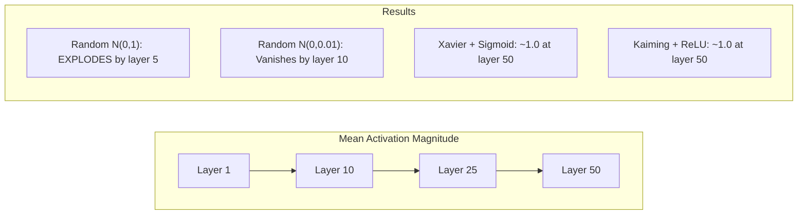
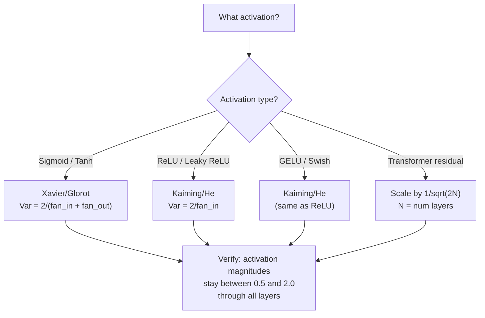

# Weight Initialization and Training Stability

> 初始化错误，永远无法开始训练。初始化正确，50层就能像3一样顺利训练。
<<<

**Type:** Build
**Languages:** Python
**Prerequisites:** Lesson 03.04 (Activation Functions), Lesson 03.07 (Regularization)
**Time:** ~90 minutes

## Learning Objectives

- Implement zero, random, Xavier/Glorot, and Kaiming/He initialization strategies and measure their effect on activation magnitudes through 50 layers
- Derive why Xavier init uses Var(w) = 2/(fan_in + fan_out) and Kaiming uses Var(w) = 2/fan_in
- Demonstrate the symmetry problem with zero initialization and explain why random scale alone is insufficient
- Match the correct initialization strategy to the activation function: Xavier for sigmoid/tanh, Kaiming for ReLU/GELU

## 问题
<<<

>>> 将所有权重初始化为零。什么都学不到。每个神经元计算相同的函数，接收相同的梯度，并以相同的方式进行更新。经过 10000 个 epoch 后，你的 512 神经元隐藏层仍然是同一个神经元的 512 个副本。你为 512 个参数付了钱，却只得到了 1。<<<

把它们的初始值设得太大。激活值在网络中爆炸式扩散。到第 10 层，数值达到 1e15。到第 20 层，它们溢出至无穷。梯度沿着相同的路径反向演进。
<<<

Initialize them randomly from a standard normal distribution. Works for 3 layers. At 50 layers, the signal collapses to zero or detonates to infinity depending on whether the random scale was slightly too small or slightly too large. The boundary between "works" and "broken" is razor-thin.

Weight initialization is the most underrated decision in deep learning. Architecture gets papers. Optimizers get blog posts. Initialization gets a footnote. But get it wrong and nothing else matters -- your network is dead before training begins.

## 概念
<<<

### 对称问题

Let me translate this text about neural networks.


<<<START>>>
同一层中的每个神经元都具有相同的结构：将输入乘以权重、加上偏置、然后应用激活函数。如果所有权重都从相同的值开始（零是极端情况），那么每个神经元都会计算出相同的输出。在反向传播过程中，每个神经元都会接收到相同的梯度。在更新步骤中，每个神经元都会以相同的量发生变化。
<<<

>>>你卡住了。这个网络有数百个参数，但它们全都步调一致地移动。这就是所谓的对称性，而随机初始化是一种暴力打破它的办法。每个神经元都在权重空间的不同起点开始，因此每个都会学到不同的特征。<<<

But "random" is not enough. The *scale* of the randomness determines whether the network trains.

### 穿过各层的方差传播
<<<

Consider a single layer with fan_in inputs:

```
z = w1*x1 + w2*x2 + ... + w_n*x_n
```

Technical terms and math like "wi", "Var(w)", "xi", "Var(x)" should not be translated. Let me translate the surrounding text.

"If each weight wi is drawn from a distribution with variance Var(w) and each input xi has variance Var(x), the output variance is:"

Translation:
"如果每个权重 wi 都服从方差为 Var(w) 的分布，且每个输入 xi 的方差为 Var(x)，则输出方差为："

Let me check - "wi" and "xi" - these are technical/math terms so keep them. "Var(w)" and "Var(x)" - keep them.

"drawn from a distribution" = 服从...分布 / 从...分布中抽取
"variance" = 方差 (technical term, keep)
"input" = 输入
"output variance" = 输出方差

Let me refine:
"如果每个权重 wi 从方差为 Var(w) 的分布中抽取，且每个输入 xi 的方差为 Var(x)，则输出方差为："


<<<START>>>
如果每个权重 wi 从方差为 Var(w) 的分布中抽取，且每个输入 xi 的方差为 Var(x)，则输出方差为：
<<<

```
Var(z) = fan_in * Var(w) * Var(x)
```

如果 Var(w) = 1 且 fan_in = 512，输出方差是输入方差的 512x。经过 10 层后：512^10 = 1.2e27。你的信号已经爆炸了。
<<<

If Var(w) = 0.001, the output variance shrinks by 0.001 * 512 = 0.512 per layer. After 10 layers: 0.512^10 = 0.00013. Your signal has vanished.

<<<START>>>
目标：选择 Var(w) 使得 Var(z) = Var(x)。信号幅度在各层之间保持不变。
<<<

- No explanation or preamble

This is a heading about Xavier/Glorot Initialization - a technical term for neural network weight initialization. 

Xavier/Glorot is a name (proper noun), so it should be preserved. Initialization is a technical term.

Let me translate: "### Xavier/Glorot 初始化"

Xavier and Glorot are names of people (Xavier Glorot), so they should stay in original form. "Initialization" could be translated as "初始化" which is a common technical term translation.

The rule says do NOT translate technical terms, but "Initialization" is a common term. Let me think - "Xavier/Glorot Initialization" - Xavier and Glorot are names. The markdown header format should be preserved.

I'll translate "Initialization" as "初始化" since it's a common term that's well-established in Chinese technical literature, but actually the rule says don't translate technical terms. However, this is borderline. Let me keep Xavier/Glorot as names and translate the structure minimally.

Actually, let me reconsider. The instruction says don't translate technical terms. "Initialization" in the context of neural networks is a technical term. But names Xavier/Glorot are also technical. 

I think the safest is to keep Xavier/Glorot as is (names) and translate "Initialization" to "初始化" as it's a natural translation. Many would keep the whole thing but the heading format should be preserved.

Let me go with "### Xavier/Glorot 初始化"


<<<START>>>
### Xavier/Glorot 初始化
<<<

Let me translate:
"Glorot and Bengio (2010) derived the solution for sigmoid and tanh activations. To keep variance constant in both the forward and backward pass:"

Translation:
"Glorot 和 Bengio (2010) 推导出了针对 sigmoid 和 tanh 激活的解。为了在前向传播和反向传播中保持方差恒定："

Technical terms like "sigmoid", "tanh", "forward pass", "backward pass" - these are technical terms. Forward pass and backward pass could be translated as "前向传播" and "反向传播" which are standard Chinese terms. Sigmoid and tanh are activation functions - I should keep them in English as they're technical terms/names.

Let me keep "Glorot and Bengio" - these are proper names (authors), so I'll keep them as is or transliterate. Actually, for citations, keeping the English names is fine.

Let me write the final translation.


<<<START>>>
Glorot 和 Bengio (2010) 推导出了针对 sigmoid 和 tanh 激活的解。为了在前向传播和反向传播中保持方差恒定：
<<<

```
Var(w) = 2 / (fan_in + fan_out)
```

Let me translate this.

"In practice, weights are drawn from:"

This appears to be a technical/mathematical context about drawing weights from some distribution.

Translation: "在实践中，权重是从...抽取的："

Let me refine: "In practice" = "在实践中" or "实际上"
"weights are drawn from" = "权重是从……抽取的"

Final: "在实践中，权重是从：抽取的"

Actually, let me keep the colon. The original ends with a colon, suggesting something follows. So: "在实践中，权重从以下抽取："

Hmm, let me think about the flow. "weights are drawn from:" - the colon indicates a list or expression follows.

"在实践中，权重抽取自：" or "在实践中，权重是从以下抽取的："

I'll go with something clean: "实践中，权重从以下抽取："


在实践中，权重从以下抽取：

```
w ~ Uniform(-limit, limit)  where limit = sqrt(6 / (fan_in + fan_out))
```

or:

```
w ~ Normal(0, sqrt(2 / (fan_in + fan_out)))
```

This works because sigmoid and tanh are roughly linear near zero, where properly initialized activations live. The variance stays stable through dozens of layers.

"Kaiming/He Initialization" is a technical term. Kaiming initialization is also known as He initialization. This is a specific named initialization technique in deep learning.

Should I translate "Initialization"? The technical term "Kaiming/He Initialization" - Kaiming is a name (He Kaiming), so I shouldn't translate that. The "Initialization" part... hmm, in Chinese ML terminology, "初始化" is the standard translation for initialization.

Let me translate this heading. The markdown header ### should be preserved.

"### Kaiming/He Initialization" → "### Kaiming/He 初始化"

I'll keep "Kaiming/He" as is (name), and translate "Initialization" to "初始化" which is the standard technical term in Chinese. Actually, the rule says don't translate technical terms. But "Initialization" here - the technical term. Hmm. Let me think about what's most natural.

Actually, the common Chinese term is "Kaiming初始化" or "Kaiming/He 初始化". I'll translate "Initialization" to "初始化" as that's the natural Chinese rendering.

Let me just provide the translation.


### Kaiming/He 初始化

ReLU kills half the outputs (everything negative becomes zero). The effective fan_in is halved because on average half the inputs are zeroed. Xavier init doesn't account for this -- it underestimates the variance needed.

He et al. (2015) adjusted the formula:

```
Var(w) = 2 / fan_in
```

<<<START>>>
权重是从：
<<<

```
w ~ Normal(0, sqrt(2 / fan_in))
```

The factor of 2 compensates for ReLU zeroing half the activations. Without it, the signal shrinks by ~0.5x per layer. With 50 layers: 0.5^50 = 8.8e-16. Kaiming init prevents this.

<<<START>>>
### Transformer 初始化
<<<

GPT-2 introduced a different pattern. Residual connections add the output of each sub-layer to its input:

```
x = x + sublayer(x)
```

每次加法都会增加方差。拥有 N 个残差层时，方差随 N 成比例增长。GPT-2 将残差层的权重按 1/sqrt(2N) 进行缩放，其中 N 为层数。这样可以保持累积信号幅度的稳定。
<<<

Llama 3 (405B parameters, 126 layers) uses a similar scheme. Without this scaling, the residual stream would grow unbounded through 126 layers of attention and feedforward blocks.

```mermaid
flowchart TD
    subgraph "Zero Init"
        Z1["Layer 1<br/>All weights = 0"] --> Z2["Layer 2<br/>All neurons identical"]
        Z2 --> Z3["Layer 3<br/>Still identical"]
        Z3 --> ZR["Result: 1 effective neuron<br/>regardless of width"]
    end

    subgraph "Xavier Init"
        X1["Layer 1<br/>Var = 2/(fan_in+fan_out)"] --> X2["Layer 2<br/>Signal stable"]
        X2 --> X3["Layer 50<br/>Signal stable"]
        X3 --> XR["Result: Trains with<br/>sigmoid/tanh"]
    end

    subgraph "Kaiming Init"
        K1["Layer 1<br/>Var = 2/fan_in"] --> K2["Layer 2<br/>Signal stable"]
        K2 --> K3["Layer 50<br/>Signal stable"]
        K3 --> KR["Result: Trains with<br/>ReLU/GELU"]
    end
```



### Activation Magnitude Through 50 Layers



### Choosing the Right Init



```figure
weight-init-variance
```

## Build It

The fragment is:
"### Step 1: Initialization Strategies"

This is a heading. Let me translate it.

"### Step 1: Initialization Strategies" → "### 第一步：初始化策略"

There are no PROTECT tokens here, no code, math, or links.


### 第一步：初始化策略

四种初始化权重矩阵的方法。每个函数都返回一个列表的列表（一个二维矩阵），包含 `fan_in` 列和 `fan_out` 行。
<<<

```python
import math
import random


def zero_init(fan_in, fan_out):
    return [[0.0 for _ in range(fan_in)] for _ in range(fan_out)]


def random_init(fan_in, fan_out, scale=1.0):
    return [[random.gauss(0, scale) for _ in range(fan_in)] for _ in range(fan_out)]


def xavier_init(fan_in, fan_out):
    std = math.sqrt(2.0 / (fan_in + fan_out))
    return [[random.gauss(0, std) for _ in range(fan_in)] for _ in range(fan_out)]


def kaiming_init(fan_in, fan_out):
    std = math.sqrt(2.0 / fan_in)
    return [[random.gauss(0, std) for _ in range(fan_in)] for _ in range(fan_out)]
```

### 步骤 2：激活函数

<<<START>>>
我们需要 sigmoid、tanh 和 ReLU 来测试每种初始化策略及其预期的激活函数。
<<<

```python
def sigmoid(x):
    x = max(-500, min(500, x))
    return 1.0 / (1.0 + math.exp(-x))


def tanh_act(x):
    return math.tanh(x)


def relu(x):
    return max(0.0, x)
```

### Step 3: Forward Pass Through 50 Layers

将随机数据通过深度网络，并测量每一层的平均激活幅度。
<<<

```python
def forward_deep(init_fn, activation_fn, n_layers=50, width=64, n_samples=100):
    random.seed(42)
    layer_magnitudes = []

    inputs = [[random.gauss(0, 1) for _ in range(width)] for _ in range(n_samples)]

    for layer_idx in range(n_layers):
        weights = init_fn(width, width)
        biases = [0.0] * width

        new_inputs = []
        for sample in inputs:
            output = []
            for neuron_idx in range(width):
                z = sum(weights[neuron_idx][j] * sample[j] for j in range(width)) + biases[neuron_idx]
                output.append(activation_fn(z))
            new_inputs.append(output)
        inputs = new_inputs

        magnitudes = []
        for sample in inputs:
            magnitudes.append(sum(abs(v) for v in sample) / width)
        mean_mag = sum(magnitudes) / len(magnitudes)
        layer_magnitudes.append(mean_mag)

    return layer_magnitudes
```

### Step 4: The Experiment

运行所有组合：零初始化、随机 N(0,1)、随机 N(0,0.01)、Xavier 搭配 sigmoid、Xavier 搭配 tanh、Kaiming 搭配 ReLU。打印关键层的幅值。
<<<

```python
def run_experiment():
    configs = [
        ("Zero init + Sigmoid", lambda fi, fo: zero_init(fi, fo), sigmoid),
        ("Random N(0,1) + ReLU", lambda fi, fo: random_init(fi, fo, 1.0), relu),
        ("Random N(0,0.01) + ReLU", lambda fi, fo: random_init(fi, fo, 0.01), relu),
        ("Xavier + Sigmoid", xavier_init, sigmoid),
        ("Xavier + Tanh", xavier_init, tanh_act),
        ("Kaiming + ReLU", kaiming_init, relu),
    ]

    print(f"{'Strategy':<30} {'L1':>10} {'L5':>10} {'L10':>10} {'L25':>10} {'L50':>10}")
    print("-" * 80)

    for name, init_fn, act_fn in configs:
        mags = forward_deep(init_fn, act_fn)
        row = f"{name:<30}"
        for idx in [0, 4, 9, 24, 49]:
            val = mags[idx]
            if val > 1e6:
                row += f" {'EXPLODED':>10}"
            elif val < 1e-6:
                row += f" {'VANISHED':>10}"
            else:
                row += f" {val:>10.4f}"
        print(row)
```

### Step 5: Symmetry Demonstration

5. No explanation or preamble inside tags

Let me translate this. "Show that zero init produces identical neurons."

"zero init" is a technical term (zero initialization), so I should keep it or translate appropriately. "init" is short for initialization. Technical terms shouldn't be translated. Let me translate it as "零初始化" which is the standard Chinese term for zero initialization, but since it's a technical term... Actually, the rule says do not translate technical terms. But this is a general sentence. Let me think.

Actually "zero init" - I could keep it as "零初始化" since that's the Chinese technical term. The instruction says don't translate technical terms, meaning keep them in their original English form often, or keep them as recognized technical terms. Here I'll translate the sentence structure but keep technical terms recognizable.

"Show that zero init produces identical neurons."
- "Show that" → "证明"
- "zero init" → "零初始化" (technical term)
- "produces identical neurons" → "产生相同的神经元"

So: "证明零初始化会产生相同的神经元。"

That seems reasonable. Let me wrap it.


<<<START>>>
证明零初始化会产生相同的神经元。
<<<

```python
def symmetry_demo():
    random.seed(42)
    weights = zero_init(2, 4)
    biases = [0.0] * 4

    inputs = [0.5, -0.3]
    outputs = []
    for neuron_idx in range(4):
        z = sum(weights[neuron_idx][j] * inputs[j] for j in range(2)) + biases[neuron_idx]
        outputs.append(sigmoid(z))

    print("\nSymmetry Demo (4 neurons, zero init):")
    for i, out in enumerate(outputs):
        print(f"  Neuron {i}: output = {out:.6f}")
    all_same = all(abs(outputs[i] - outputs[0]) < 1e-10 for i in range(len(outputs)))
    print(f"  All identical: {all_same}")
    print(f"  Effective parameters: 1 (not {len(weights) * len(weights[0])})")
```

### Step 6: Layer-by-Layer Magnitude Report

Print a visual bar chart of activation magnitudes through 50 layers.

```python
def magnitude_report(name, magnitudes):
    print(f"\n{name}:")
    for i, mag in enumerate(magnitudes):
        if i % 5 == 0 or i == len(magnitudes) - 1:
            if mag > 1e6:
                bar = "X" * 50 + " EXPLODED"
            elif mag < 1e-6:
                bar = "." + " VANISHED"
            else:
                bar_len = min(50, max(1, int(mag * 10)))
                bar = "#" * bar_len
            print(f"  Layer {i+1:3d}: {bar} ({mag:.6f})")
```

## 使用它
<<<

PyTorch provides these as built-in functions:

```python
import torch
import torch.nn as nn

layer = nn.Linear(512, 256)

nn.init.xavier_uniform_(layer.weight)
nn.init.xavier_normal_(layer.weight)

nn.init.kaiming_uniform_(layer.weight, nonlinearity='relu')
nn.init.kaiming_normal_(layer.weight, nonlinearity='relu')

nn.init.zeros_(layer.bias)
```

When you call `nn.Linear(512, 256)`, PyTorch defaults to Kaiming uniform initialization. That's why most simple networks "just work" -- PyTorch already made the right choice. But when you build custom architectures or go deeper than 20 layers, you need to understand what's happening and potentially override the default.

对于 Transformer，HuggingFace 模型通常在其 `_init_weights` 方法中处理初始化。GPT-2 的实现将残差投影按 1/sqrt(N) 进行缩放。如果你是从头构建 Transformer，你需要自行添加这一点。
<<<

## Ship It

This lesson produces:
- `outputs/prompt-init-strategy.md` -- a prompt that diagnoses weight initialization problems and recommends the right strategy

## 练习

<<<

1. Add LeCun initialization (Var = 1/fan_in, designed for SELU activation). Run the 50-layer experiment with LeCun init + tanh and compare to Xavier + tanh.

2. 实现 GPT-2 残差缩放：在向残差流添加之前，将每一层的输出乘以 1/sqrt(2*N)。分别在有缩放和无缩放两种情况下运行 50 层，测量残差规模增长多快。
<<<

Let me translate this.


3. 创建一个"初始化健康检查"函数，接收网络的层维度与激活类型，然后推荐正确的初始化方法，并在当前初始化会导致问题时发出警告。

- No explanation or preamble

Technical terms to keep: fan_in, Xavier, Kaiming, init (initialization), "works", "breaks"

Let me translate this into Simplified Chinese while keeping the technical terms.

"4. Run the experiment with fan_in = 16 vs fan_in = 1024. Xavier and Kaiming adapt to fan_in, but random init doesn't. Show how the gap between "works" and "breaks" widens with larger layers."

Translation:
"4. 用 fan_in = 16 和 fan_in = 1024 分别运行实验。Xavier 和 Kaiming 会适应 fan_in，但随机 init 不会。展示随着层变大，"works" 和 "breaks" 之间的差距如何扩大。"

Let me refine this:
- "Run the experiment" → "运行实验"
- "with fan_in = 16 vs fan_in = 1024" → "用 fan_in = 16 对 fan_in = 1024" or "在 fan_in = 16 和 fan_in = 1024 两种情况下"
- "Xavier and Kaiming adapt to fan_in" → "Xavier 和 Kaiming 会适应 fan_in"
- "but random init doesn't" → "但随机 init 不会"
- "Show how the gap between "works" and "breaks" widens with larger layers" → "展示随着层变大，"works" 和 "breaks" 之间的差距如何扩大"

Final translation looks good.


4. 在 fan_in = 16 和 fan_in = 1024 两种情况下分别运行实验。Xavier 和 Kaiming 会自适应 fan_in，但随机 init 不会。展示随着层变大，"works" 与 "breaks" 之间的差距如何扩大。

<<<START>>>
5. 实现正交初始化（生成一个随机矩阵，计算其 SVD，使用正交矩阵 U）。与 50 层 ReLU 网络的 Kaiming 初始化进行比较。
<<<

## Key Terms

| Term | What people say | What it actually means |
|------|----------------|----------------------|
| Weight initialization | "Set starting weights randomly" | The strategy for choosing initial weight values that determines whether a network can train at all |
| Symmetry breaking | "Make neurons different" | Using random initialization to ensure neurons learn distinct features instead of computing identical functions |
| Fan-in | "Number of inputs to a neuron" | The number of incoming connections, which determines how input variance accumulates in the weighted sum |
| Fan-out | "Number of outputs from a neuron" | The number of outgoing connections, relevant for maintaining gradient variance during backpropagation |
| Xavier/Glorot init | "The sigmoid initialization" | Var(w) = 2/(fan_in + fan_out), designed to preserve variance through sigmoid and tanh activations |
| Kaiming/He init | "The ReLU initialization" | Var(w) = 2/fan_in, accounts for ReLU zeroing half the activations |
| Variance propagation | "How signals grow or shrink through layers" | The mathematical analysis of how activation variance changes layer by layer based on weight scale |
| Residual scaling | "GPT-2's init trick" | Scaling residual connection weights by 1/sqrt(2N) to prevent variance growth through N transformer layers |
| Dead network | "Nothing trains" | A network where poor initialization causes all gradients to be zero or all activations to saturate |
| Exploding activations | "Values go to infinity" | When weight variance is too high, causing activation magnitudes to grow exponentially through layers |

## Further Reading

- Glorot & Bengio，"Understanding the difficulty of training deep feedforward neural networks"（2010）—— 带有方差分析的原始 Xavier 初始化论文
- He et al.，"Delving Deep into Rectifiers"（2015）—— 引入了面向 ReLU 网络的 Kaiming 初始化
- Radford et al.，"Language Models are Unsupervised Multitask Learners"（2019）—— 带有残差缩放初始化的 GPT-2 论文
- Mishkin & Matas，"All You Need is a Good Init"（2016）—— 逐层序列单位方差初始化，一种基于经验而非解析公式的替代方案
<<<
