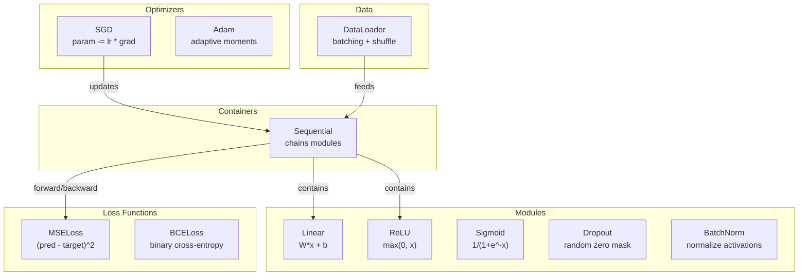
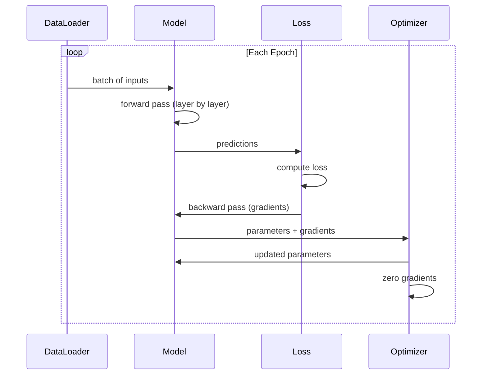
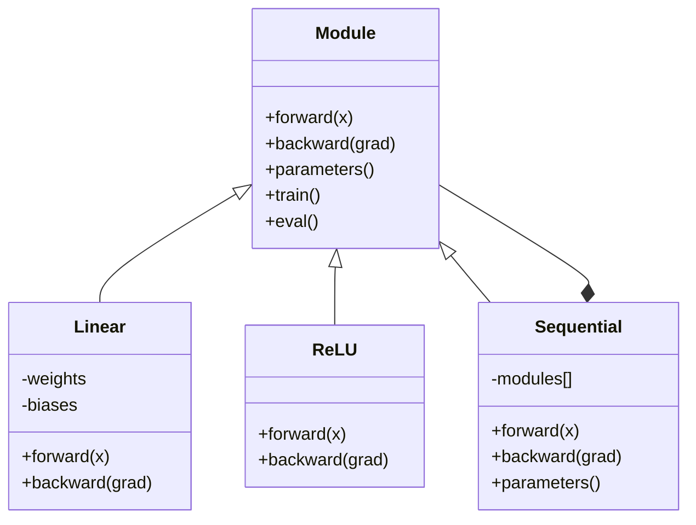

- Do not include explanation or preamble

The text is:
"# Build Your Own Mini Framework"

This is a header/heading. Let me translate it.

"Build Your Own Mini Framework" → "构建你自己的迷你框架"

This is a technical term "Mini Framework" - framework could be considered a technical term. But it's a title/heading, so I should translate it reasonably. "框架" is the translation for "framework" which is commonly used in Chinese tech context.

Let me translate this.


<<<START>>>
# 构建你自己的迷你框架
<<<

> You have built neurons, layers, networks, backprop, activations, loss functions, optimizers, regularization, initialization, and LR schedules. All as separate pieces. Now wire them together into a framework. Not PyTorch. Not TensorFlow. Yours.

**Type:** Build
**Languages:** Python
**Prerequisites:** All of Phase 03 (Lessons 01-09)
**Time:** ~120 minutes

## Learning Objectives

- 构建一个完整的深度学习框架（约 500 行），包含 Module、Linear、ReLU、Sigmoid、Dropout、BatchNorm、Sequential、损失函数、优化器和 DataLoader
- 解释 Module 抽象（forward、backward、parameters）以及为什么需要切换 train/eval 模式
- 将所有组件接入一个可运行的训练循环，在圆分类上训练一个 4 层网络
- 将框架中的每个组件映射到其 PyTorch 等价物（nn.Module、nn.Sequential、optim.Adam、DataLoader）
<<<

## 问题
<<<

You have ten lessons of building blocks scattered across separate files. A `Value` class here, a training loop there, weight initialization in another file, learning rate schedules in yet another. To train a network, you copy-paste from five different lessons and wire them together by hand.

这就是框架要解决的问题。PyTorch 为你提供 `nn.Module`、`nn.Sequential`、`optim.Adam`、`DataLoader`，以及将它们串联起来的训练循环模式。TensorFlow 为你提供 `keras.Layer`、`keras.Sequential`、`keras.optimizers.Adam`。这些都不是魔法。它们是有组织的模式，让你无需每次重新发明底层管道即可定义、训练和评估网络。
<<<

你要用大约500行Python来构建同样的东西。不用numpy。不依赖任何外部依赖。这是一个框架，可以定义任意feedforward网络，用SGD或Adam来训练，对数据进行分批，应用dropout和batch归一化，使用任意激活，并进行学习率调度。
<<<

完成之后，你将确切理解在 PyTorch 中写入 `model = nn.Sequential(...)` 时会发生什么。你将理解为什么 `model.train()` 和 `model.eval()` 存在。你将理解为什么 `optimizer.zero_grad()` 是一个独立的调用。你将完全理解这一切，因为这一切都是你亲手构建出来的。
<<<

## 概念
<<<

### The Module Abstraction

PyTorch 中的每一层都继承自 `nn.Module`。Module 有三个职责：
<<<

1. **forward()** -- 根据输入计算输出
2. **parameters()** -- 返回所有可训练权重
3. **backward()** -- 计算梯度（由 PyTorch 中的 autograd 处理，在我们的实现中是显式的）
<<<

Let me translate this text. Technical terms like "Linear layer", "ReLU activation", "dropout layer", "batch normalization layer", "Module", "interface" should not be translated as they are technical terms.

Wait, but the instruction says "Do NOT translate code, math, links, or technical terms." So terms like "Linear layer", "ReLU", "dropout", "batch normalization", "Module" should remain. But the surrounding text should be translated.

Let me translate:

"A Linear layer is a Module." -> "Linear 层是一个 Module。"
"A ReLU activation is a Module." -> "ReLU 激活是一个 Module。"
"A dropout layer is a Module." -> "dropout 层是一个 Module。"
"A batch normalization layer is a Module." -> "batch normalization 层是一个 Module。"
"They all have the same interface." -> "它们都有相同的 interface。"

Let me write this out.


<<<START>>>
Linear 层是一个 Module。ReLU 激活是一个 Module。dropout 层是一个 Module。batch normalization 层是一个 Module。它们都具有相同的 interface。
<<<

### Sequential Container

`nn.Sequential` 链接 Modules。前向传播：将数据依次通过 Module 1、Module 2、Module 3。后向传播：逆转该链。该容器本身就是一个 Module -- 它拥有 forward()、parameters() 和 backward()。这就是组合模式：一串 Modules 本身就是一个 Module。
<<<

### Training vs Evaluation Mode

Dropout randomly zeroes neurons during training but passes everything through during evaluation. Batch normalization uses batch statistics during training but running averages during evaluation. The `train()` and `eval()` methods toggle this behavior. Every Module has a `training` flag.

<<<START>>>
### Optimizer
<<<

The optimizer updates parameters using their gradients. SGD: `param -= lr * grad`. Adam: maintains momentum and variance estimates, then updates. The optimizer does not know about the network architecture -- it only sees a flat list of parameters and their gradients.

### DataLoader
<<<

>>>START<<<
批处理很重要，原因有二。首先，对于大规模问题，你无法将整个数据集装入内存。其次，小批量梯度下降所提供的噪声有助于逃离局部最小值。DataLoader 将数据切分为多个批次，并可选地在各个 epoch 之间打乱顺序。
<<<

### Framework Architecture



### 训练循环
<<<



### 模块层级



```figure
gradient-clipping
```

## Build It

### Step 1: Module Base Class

每一层实现的抽象接口。
<<<

```python
class Module:
    def __init__(self):
        self.training = True

    def forward(self, x):
        raise NotImplementedError

    def backward(self, grad):
        raise NotImplementedError

    def parameters(self):
        return []

    def train(self):
        self.training = True

    def eval(self):
        self.training = False
```

### Step 2: Linear Layer

The fundamental building block. Stores weights and biases, computes Wx + b forward, and weight/input gradients backward.

```python
import math
import random


class Linear(Module):
    def __init__(self, fan_in, fan_out):
        super().__init__()
        std = math.sqrt(2.0 / fan_in)
        self.weights = [[random.gauss(0, std) for _ in range(fan_in)] for _ in range(fan_out)]
        self.biases = [0.0] * fan_out
        self.weight_grads = [[0.0] * fan_in for _ in range(fan_out)]
        self.bias_grads = [0.0] * fan_out
        self.fan_in = fan_in
        self.fan_out = fan_out
        self.input = None

    def forward(self, x):
        self.input = x
        output = []
        for i in range(self.fan_out):
            val = self.biases[i]
            for j in range(self.fan_in):
                val += self.weights[i][j] * x[j]
            output.append(val)
        return output

    def backward(self, grad):
        input_grad = [0.0] * self.fan_in
        for i in range(self.fan_out):
            self.bias_grads[i] += grad[i]
            for j in range(self.fan_in):
                self.weight_grads[i][j] += grad[i] * self.input[j]
                input_grad[j] += grad[i] * self.weights[i][j]
        return input_grad

    def parameters(self):
        params = []
        for i in range(self.fan_out):
            for j in range(self.fan_in):
                params.append((self.weights, i, j, self.weight_grads))
            params.append((self.biases, i, None, self.bias_grads))
        return params
```

### 第 3 步：激活模块

<<<START>>>
将 ReLU、Sigmoid 和 Tanh 作为模块。每个模块都会缓存反向传播所需的内容。
<<<

```python
class ReLU(Module):
    def __init__(self):
        super().__init__()
        self.mask = None

    def forward(self, x):
        self.mask = [1.0 if v > 0 else 0.0 for v in x]
        return [max(0.0, v) for v in x]

    def backward(self, grad):
        return [g * m for g, m in zip(grad, self.mask)]


class Sigmoid(Module):
    def __init__(self):
        super().__init__()
        self.output = None

    def forward(self, x):
        self.output = []
        for v in x:
            v = max(-500, min(500, v))
            self.output.append(1.0 / (1.0 + math.exp(-v)))
        return self.output

    def backward(self, grad):
        return [g * o * (1 - o) for g, o in zip(grad, self.output)]


class Tanh(Module):
    def __init__(self):
        super().__init__()
        self.output = None

    def forward(self, x):
        self.output = [math.tanh(v) for v in x]
        return self.output

    def backward(self, grad):
        return [g * (1 - o * o) for g, o in zip(grad, self.output)]
```

### Step 4: Dropout Module

训练过程中随机将元素置零。将其余元素按 1/(1-p) 缩放，以保持期望值不变。评估过程中不执行任何操作。
<<<

```python
class Dropout(Module):
    def __init__(self, p=0.5):
        super().__init__()
        self.p = p
        self.mask = None

    def forward(self, x):
        if not self.training:
            return x
        self.mask = [0.0 if random.random() < self.p else 1.0 / (1 - self.p) for _ in x]
        return [v * m for v, m in zip(x, self.mask)]

    def backward(self, grad):
        if self.mask is None:
            return grad
        return [g * m for g, m in zip(grad, self.mask)]
```

### Step 5: BatchNorm Module

沿批次对每个特征将激活值归一化为零均值、单位方差。在评估模式下维护运行统计量。
<<<

```python
class BatchNorm(Module):
    def __init__(self, size, momentum=0.1, eps=1e-5):
        super().__init__()
        self.size = size
        self.gamma = [1.0] * size
        self.beta = [0.0] * size
        self.gamma_grads = [0.0] * size
        self.beta_grads = [0.0] * size
        self.running_mean = [0.0] * size
        self.running_var = [1.0] * size
        self.momentum = momentum
        self.eps = eps
        self.x_norm = None
        self.std_inv = None
        self.batch_input = None

    def forward_batch(self, batch):
        batch_size = len(batch)
        output_batch = []

        if self.training:
            mean = [0.0] * self.size
            for sample in batch:
                for j in range(self.size):
                    mean[j] += sample[j]
            mean = [m / batch_size for m in mean]

            var = [0.0] * self.size
            for sample in batch:
                for j in range(self.size):
                    var[j] += (sample[j] - mean[j]) ** 2
            var = [v / batch_size for v in var]

            self.std_inv = [1.0 / math.sqrt(v + self.eps) for v in var]

            self.x_norm = []
            self.batch_input = batch
            for sample in batch:
                normed = [(sample[j] - mean[j]) * self.std_inv[j] for j in range(self.size)]
                self.x_norm.append(normed)
                output = [self.gamma[j] * normed[j] + self.beta[j] for j in range(self.size)]
                output_batch.append(output)

            for j in range(self.size):
                self.running_mean[j] = (1 - self.momentum) * self.running_mean[j] + self.momentum * mean[j]
                self.running_var[j] = (1 - self.momentum) * self.running_var[j] + self.momentum * var[j]
        else:
            std_inv = [1.0 / math.sqrt(v + self.eps) for v in self.running_var]
            for sample in batch:
                normed = [(sample[j] - self.running_mean[j]) * std_inv[j] for j in range(self.size)]
                output = [self.gamma[j] * normed[j] + self.beta[j] for j in range(self.size)]
                output_batch.append(output)

        return output_batch

    def forward(self, x):
        result = self.forward_batch([x])
        return result[0]

    def backward(self, grad):
        if self.x_norm is None:
            return grad
        for j in range(self.size):
            self.gamma_grads[j] += self.x_norm[0][j] * grad[j]
            self.beta_grads[j] += grad[j]
        return [grad[j] * self.gamma[j] * self.std_inv[j] for j in range(self.size)]

    def parameters(self):
        params = []
        for j in range(self.size):
            params.append((self.gamma, j, None, self.gamma_grads))
            params.append((self.beta, j, None, self.beta_grads))
        return params
```

### Step 6: Sequential Container

链式模块。正向从左到右，反向从右到左。
<<<

```python
class Sequential(Module):
    def __init__(self, *modules):
        super().__init__()
        self.modules = list(modules)

    def forward(self, x):
        for module in self.modules:
            x = module.forward(x)
        return x

    def backward(self, grad):
        for module in reversed(self.modules):
            grad = module.backward(grad)
        return grad

    def parameters(self):
        params = []
        for module in self.modules:
            params.extend(module.parameters())
        return params

    def train(self):
        self.training = True
        for module in self.modules:
            module.train()

    def eval(self):
        self.training = False
        for module in self.modules:
            module.eval()
```

### Step 7: Loss Functions

MSE and Binary Cross-Entropy. Each returns the loss value and provides a backward() that returns the gradient.

```python
class MSELoss:
    def __call__(self, predicted, target):
        self.predicted = predicted
        self.target = target
        n = len(predicted)
        self.loss = sum((p - t) ** 2 for p, t in zip(predicted, target)) / n
        return self.loss

    def backward(self):
        n = len(self.predicted)
        return [2 * (p - t) / n for p, t in zip(self.predicted, self.target)]


class BCELoss:
    def __call__(self, predicted, target):
        self.predicted = predicted
        self.target = target
        eps = 1e-7
        n = len(predicted)
        self.loss = 0
        for p, t in zip(predicted, target):
            p = max(eps, min(1 - eps, p))
            self.loss += -(t * math.log(p) + (1 - t) * math.log(1 - p))
        self.loss /= n
        return self.loss

    def backward(self):
        eps = 1e-7
        n = len(self.predicted)
        grads = []
        for p, t in zip(self.predicted, self.target):
            p = max(eps, min(1 - eps, p))
            grads.append((-t / p + (1 - t) / (1 - p)) / n)
        return grads
```

### 第 8 步：SGD 和 Adam 优化器
<<<

>>>两者都接受参数列表，并使用梯度来更新权重。<<<

```python
class SGD:
    def __init__(self, parameters, lr=0.01):
        self.params = parameters
        self.lr = lr

    def step(self):
        for container, i, j, grad_container in self.params:
            if j is not None:
                container[i][j] -= self.lr * grad_container[i][j]
            else:
                container[i] -= self.lr * grad_container[i]

    def zero_grad(self):
        for container, i, j, grad_container in self.params:
            if j is not None:
                grad_container[i][j] = 0.0
            else:
                grad_container[i] = 0.0


class Adam:
    def __init__(self, parameters, lr=0.001, beta1=0.9, beta2=0.999, eps=1e-8):
        self.params = parameters
        self.lr = lr
        self.beta1 = beta1
        self.beta2 = beta2
        self.eps = eps
        self.t = 0
        self.m = [0.0] * len(parameters)
        self.v = [0.0] * len(parameters)

    def step(self):
        self.t += 1
        for idx, (container, i, j, grad_container) in enumerate(self.params):
            if j is not None:
                g = grad_container[i][j]
            else:
                g = grad_container[i]

            self.m[idx] = self.beta1 * self.m[idx] + (1 - self.beta1) * g
            self.v[idx] = self.beta2 * self.v[idx] + (1 - self.beta2) * g * g

            m_hat = self.m[idx] / (1 - self.beta1 ** self.t)
            v_hat = self.v[idx] / (1 - self.beta2 ** self.t)

            update = self.lr * m_hat / (math.sqrt(v_hat) + self.eps)

            if j is not None:
                container[i][j] -= update
            else:
                container[i] -= update

    def zero_grad(self):
        for container, i, j, grad_container in self.params:
            if j is not None:
                grad_container[i][j] = 0.0
            else:
                grad_container[i] = 0.0
```

### 第 9 步：DataLoader
<<<

Splits data into batches, optionally shuffles each epoch.

```python
class DataLoader:
    def __init__(self, data, batch_size=32, shuffle=True):
        self.data = data
        self.batch_size = batch_size
        self.shuffle = shuffle

    def __iter__(self):
        indices = list(range(len(self.data)))
        if self.shuffle:
            random.shuffle(indices)
        for start in range(0, len(indices), self.batch_size):
            batch_indices = indices[start:start + self.batch_size]
            batch = [self.data[i] for i in batch_indices]
            inputs = [item[0] for item in batch]
            targets = [item[1] for item in batch]
            yield inputs, targets

    def __len__(self):
        return (len(self.data) + self.batch_size - 1) // self.batch_size
```

### 步骤 10：在圆形分类上训练 4 层网络

把一切都连接起来。定义模型，选择一个损失函数，选择一个优化器，运行训练循环。

```python
def make_circle_data(n=500, seed=42):
    random.seed(seed)
    data = []
    for _ in range(n):
        x = random.uniform(-2, 2)
        y = random.uniform(-2, 2)
        label = 1.0 if x * x + y * y < 1.5 else 0.0
        data.append(([x, y], [label]))
    return data


def train():
    random.seed(42)

    model = Sequential(
        Linear(2, 16),
        ReLU(),
        Linear(16, 16),
        ReLU(),
        Linear(16, 8),
        ReLU(),
        Linear(8, 1),
        Sigmoid(),
    )

    criterion = BCELoss()
    optimizer = Adam(model.parameters(), lr=0.01)

    data = make_circle_data(500)
    split = int(len(data) * 0.8)
    train_data = data[:split]
    test_data = data[split:]

    loader = DataLoader(train_data, batch_size=16, shuffle=True)

    model.train()

    for epoch in range(100):
        total_loss = 0
        total_correct = 0
        total_samples = 0

        for batch_inputs, batch_targets in loader:
            batch_loss = 0
            for x, t in zip(batch_inputs, batch_targets):
                pred = model.forward(x)
                loss = criterion(pred, t)
                batch_loss += loss

                optimizer.zero_grad()
                grad = criterion.backward()
                model.backward(grad)
                optimizer.step()

                predicted_class = 1.0 if pred[0] >= 0.5 else 0.0
                if predicted_class == t[0]:
                    total_correct += 1
                total_samples += 1

            total_loss += batch_loss

        avg_loss = total_loss / total_samples
        accuracy = total_correct / total_samples * 100

        if epoch % 10 == 0 or epoch == 99:
            print(f"Epoch {epoch:3d} | Loss: {avg_loss:.6f} | Train Accuracy: {accuracy:.1f}%")

    model.eval()
    correct = 0
    for x, t in test_data:
        pred = model.forward(x)
        predicted_class = 1.0 if pred[0] >= 0.5 else 0.0
        if predicted_class == t[0]:
            correct += 1
    test_accuracy = correct / len(test_data) * 100
    print(f"\nTest Accuracy: {test_accuracy:.1f}% ({correct}/{len(test_data)})")

    return model, test_accuracy
```

## 使用它
<<<

Here is the PyTorch equivalent of what you just built:

```python
import torch
import torch.nn as nn
from torch.utils.data import DataLoader, TensorDataset

model = nn.Sequential(
    nn.Linear(2, 16),
    nn.ReLU(),
    nn.Linear(16, 16),
    nn.ReLU(),
    nn.Linear(16, 8),
    nn.ReLU(),
    nn.Linear(8, 1),
    nn.Sigmoid(),
)

criterion = nn.BCELoss()
optimizer = torch.optim.Adam(model.parameters(), lr=0.01)

for epoch in range(100):
    model.train()
    for inputs, targets in dataloader:
        optimizer.zero_grad()
        predictions = model(inputs)
        loss = criterion(predictions, targets)
        loss.backward()
        optimizer.step()

    model.eval()
    with torch.no_grad():
        test_predictions = model(test_inputs)
```

Let me translate this text.

"The structure is identical." → 结构完全相同。

"PROTECT0, PROTECT1, ..., PROTECT10." → 保留PROTECT tokens exactly.

"Every concept maps one-to-one." → 每个概念都是一一对应的。

"The difference is that PyTorch handles autograd automatically (no need to implement backward() in each module), runs on GPU, and has been optimized for years." → 区别在于 PyTorch 自动处理 autograd（无需在每个 module 中实现 backward()），可在 GPU 上运行，并且经过多年的优化。

"But the bones are the same." → 但骨架是相同的。

I should preserve technical terms like autograd, backward(), module, GPU, PyTorch.


结构完全相同。`Sequential`, `Linear`, `ReLU`, `Sigmoid`, `BCELoss`, `Adam`, `zero_grad`, `backward`, `step`, `train`, `eval`。每个概念都是一一对应的。区别在于 PyTorch 自动处理 autograd（无需在每个 module 中实现 backward()），可在 GPU 上运行，并且经过多年的优化。但骨架是相同的。

<<<START>>>
现在，当你看到 PyTorch 代码时，你能准确理解每一行究竟在做什么。这种理解才是核心所在。
<<<

## Ship It

This lesson produces:
- `outputs/prompt-framework-architect.md` -- a prompt for designing neural network architectures using framework abstractions

## 练习

<<<

1. Add a `SoftmaxCrossEntropyLoss` class for multi-class classification. Softmax the predictions, compute cross-entropy loss, and handle the combined backward pass. Test it on a 3-class spiral dataset.

2. 在优化器中实现学习率调度：添加一个 `set_lr()` 方法，并接入第 09 课中的余弦调度。使用 warmup + cosine 训练圆形分类器，并与恒定 LR 进行比较。
<<<

3. 在 Sequential 中添加一个 `save()` 和 `load()` 方法，将所有权重序列化为 JSON 文件并将其加载回来。验证加载后的模型会产生与原始模型相同的预测。
<<<

4. Implement weight decay (L2 regularization) in the Adam optimizer. Add a `weight_decay` parameter that shrinks weights toward zero each step. Compare training with decay=0 vs decay=0.01.

Let me translate this. Technical terms like "mini-batch gradient accumulation", "optimizer step", "convergence speed" - these are technical terms. The instruction says "Do NOT translate ... technical terms." 

Hmm, but some of these might need translation for readability. Let me think about what counts as technical terms. Terms like "optimizer step" - "optimizer" is technical. But in the context of Chinese ML writing, these are often kept or translated. Let me consider - the rule says don't translate technical terms. But actually, in Chinese technical writing, terms like "梯度累积" (gradient accumulation) are commonly translated. 

Let me be reasonable here. The rule about not translating technical terms usually refers to things like code identifiers, variable names, etc. But phrases like "mini-batch gradient accumulation" are descriptive phrases. I think translating the sentence naturally while keeping the meaning is the goal.

Let me translate:

"5. 用正确的 mini-batch 梯度累积替换逐样本训练循环：对一个批次中的所有样本累积梯度，然后除以批次大小并执行一次优化器步骤。衡量这是否会影响收敛速度。"

This preserves the markdown numbering, the line break structure. Let me refine the technical terms. "mini-batch gradient accumulation" - I'll keep "mini-batch" as is since it's a technical term, and translate "梯度累积". "optimizer step" = "优化器步骤". "convergence speed" = "收敛速度". "batch size" = "批次大小". "per-sample training loop" = "逐样本训练循环".

This looks good. Let me finalize.


5. 用正确的 mini-batch 梯度累积替换逐样本训练循环：对一个批次中的所有样本累积梯度，然后除以批次大小并执行一次优化器步骤。衡量这一做法是否会改变收敛速度。

## Key Terms

| Term | What people say | What it actually means |
|------|----------------|----------------------|
| Module | "A layer" | The base abstraction in a framework -- anything with forward(), backward(), and parameters() |
| Sequential | "Stack layers in order" | A container that chains modules, applying them in sequence for forward and reverse for backward |
| Forward pass | "Run the network" | Computing the output by passing input through each module in order |
| Backward pass | "Compute gradients" | Propagating the loss gradient through each module in reverse to compute parameter gradients |
| Parameters | "The trainable weights" | All values in the network that the optimizer can update -- weights and biases |
| Optimizer | "The thing that updates weights" | An algorithm that uses gradients to update parameters, implementing SGD, Adam, or other rules |
| DataLoader | "The thing that feeds data" | An iterator that splits a dataset into batches, optionally shuffling between epochs |
| Training mode | "model.train()" | A flag that enables stochastic behavior like dropout and batch normalization with batch stats |
| Evaluation mode | "model.eval()" | A flag that disables dropout and uses running statistics for batch normalization |
| Zero grad | "Clear the gradients" | Resetting all parameter gradients to zero before computing the next batch's gradients |

## Further Reading

- Paszke et al., "PyTorch: An Imperative Style, High-Performance Deep Learning Library" (2019) -- the paper describing PyTorch's design decisions
- Chollet, "Deep Learning with Python, Second Edition" (2021) -- Chapter 3 covers Keras internals with the same module/layer abstraction
- Johnson, "Tiny-DNN" (https://github.com/tiny-dnn/tiny-dnn) -- a header-only C++ deep learning framework for understanding framework internals
