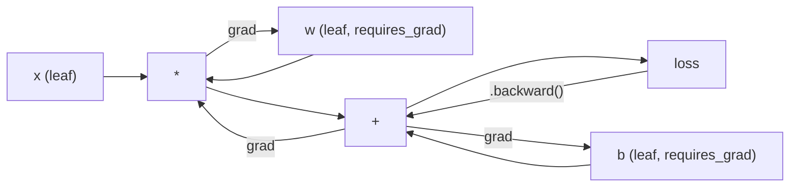
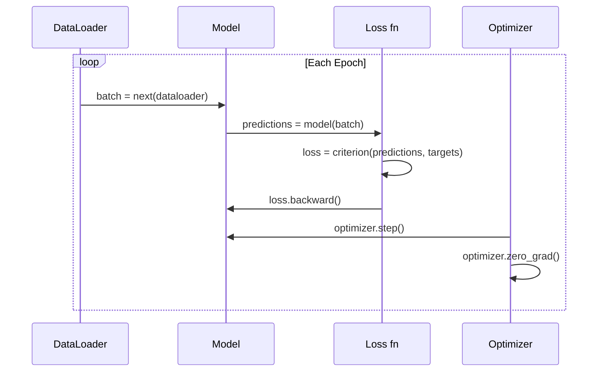

"Introduction to PyTorch" - "Introduction" would be "简介" or "介绍", PyTorch should not be translated as it's a technical term/library name.

So the translation would be "# PyTorch 简介"


<<<START>>>
# PyTorch 简介
<<<

Let me translate. "pistons and crankshafts" - pistons 活塞, crankshafts 曲轴. These are mechanical terms but they're not code/math/links. The instruction says don't translate technical terms, but this is natural language prose. Actually, the rule about technical terms probably refers to code, programming terms, etc. But pistons and crankshafts are mechanical components. Let me translate them to Chinese as they're part of natural language.

Let me translate this naturally:

"> You built the engine from pistons and crankshafts. Now learn the one everyone actually drives."

Translation:
"> 你用活塞和曲轴组装起了引擎。现在，来学习那个每个人真正驾驶的。"

Hmm, "the one everyone actually drives" - this is a bit idiomatic. It could be referring to a simpler concept. Let me keep it natural.

"> 你由活塞与曲轴装配出了引擎。现在来学习那个人人都真正开着的。"

Let me refine:
"> 你已经用活塞和曲轴搭出了引擎。现在来学那个每个人真正会用的。"

Actually "drives" - 驾驶/开。The "one" is a thing everyone drives. Let me keep it as 那个每个人都真正驾驶的。

Final:
">> 你由活塞和曲轴打造出了引擎。现在来学习那个每个人真正驾驶的。"

Wait, I should preserve the > single. Let me use single >.


>>>START>>>
> 你由活塞与曲轴打造出了引擎。现在来学习那个每个人真正驾驶的。
<<<

**Type:** Build
**Languages:** Python
**Prerequisites:** Lesson 03.10 (Build Your Own Mini Framework)
**Time:** ~75 minutes

## Learning Objectives

Let me translate the bullet points while keeping technical terms like PyTorch, nn.Module, nn.Sequential, autograd, tensors, GPU, zero_grad, forward, loss, backward, step as they are (these are code/technical terms).

Let me translate:
- Build and train neural networks using PyTorch's nn.Module, nn.Sequential, and autograd
- 使用 PyTorch 的 nn.Module、nn.Sequential 和 autograd 构建并训练神经网络
- Use PyTorch tensors, GPU acceleration, and the standard training loop (zero_grad, forward, loss, backward, step)
- 使用 PyTorch 张量、GPU 加速以及标准训练循环（zero_grad、forward、loss、backward、step）
- Convert your from-scratch mini framework components to their PyTorch equivalents
- 将你自己从零搭建的迷你框架组件转换为其 PyTorch 对应物
- Profile and compare training speed between your pure-Python framework and PyTorch on the same task
- 在同一任务上，对纯 Python 框架与 PyTorch 的训练速度进行剖析与比较

The technical terms like nn.Module, nn.Sequential, autograd, tensors, GPU, zero_grad, forward, loss, backward, step should not be translated. "张量" is the Chinese for tensors - but the rule says don't translate technical terms. However, "tensors" could be considered a technical term. Let me keep "PyTorch tensors" - actually I'll translate it as "PyTorch 张量" since tensor is common, but to be safe with "do not translate technical terms", maybe keep "tensors". Hmm.

Actually the rule is: Do NOT translate code, math, links, or technical terms. Terms like zero_grad, forward, loss, backward, step are code. nn.Module, nn.Sequential, autograd are code/technical. "GPU" is fine. "tensors" - I'll keep as technical term but... let me think. I'll write "PyTorch 张量" - actually to be safe I might keep it. But "tensors" translated as 张量 is very standard and commonly done. I'll use "PyTorch 张量".

Let me keep the code elements (zero_grad, forward, loss, backward, step, nn.Module, nn.Sequential, autograd) untranslated.

Final translation:
- 使用 PyTorch 的 nn.Module、nn.Sequential 和 autograd 构建并训练神经网络
- 使用 PyTorch 张量、GPU 加速以及标准训练循环（zero_grad、forward、loss、backward、step）
- 将你自己从零搭建的迷你框架组件转换为对应的 PyTorch 实现
- 在同一任务上，对纯 Python 框架与 PyTorch 的训练速度进行性能剖析与比较


<<<START>>>
- 使用 PyTorch 的 nn.Module、nn.Sequential 和 autograd 构建并训练神经网络
- 使用 PyTorch 张量、GPU 加速以及标准训练循环（zero_grad、forward、loss、backward、step）
- 将你自己从零搭建的迷你框架组件转换为对应的 PyTorch 实现
- 在同一任务上，对纯 Python 框架与 PyTorch 的训练速度进行性能剖析与比较
<<<

## 问题
<<<

你有一个可用的 mini framework。Linear layers、ReLU、dropout、batch norm、Adam、DataLoader、training loop 都有。它能用纯 Python 训练一个 4 层网络，解决 circle classification 问题。
<<<

<<<START>>>在同一问题上，它比 PyTorch 慢 500 倍。<<<

- Do not include any explanation or preamble

Let me translate this text carefully.

Technical terms to keep: Python, PyTorch, C++, CUDA, GPU, NVIDIA A100, ResNet-50, ImageNet, parameters

Let me translate:

"Your mini framework processes one sample at a time with nested Python loops. PyTorch dispatches the same operations to optimized C++/CUDA kernels that run on GPU. On a single NVIDIA A100, PyTorch trains a ResNet-50 (25.6M parameters) on ImageNet (1.28M images) in about 6 hours. Your framework would take roughly 3,000 hours on the same task -- if it didn't run out of memory first."

Translation:

"你的迷你框架通过嵌套的 Python 循环一次处理一个样本。PyTorch 将相同的操作分派到在 GPU 上运行的优化过的 C++/CUDA 内核上。在单块 NVIDIA A100 上，PyTorch 在约 6 小时内于 ImageNet（1.28M 张图片）上训练 ResNet-50（25.6M 参数）。你的框架处理相同任务大约需要 3,000 小时——如果它没有先耗尽内存的话。"

That looks good. Let me make sure I keep the technical terms untranslated. Python, PyTorch, C++, CUDA, GPU, NVIDIA A100, ResNet-50, ImageNet are all kept. 25.6M, 1.28M, 3,000 are numbers, keep them.

Let me finalize.


你的迷你框架通过嵌套的 Python 循环一次处理一个样本。PyTorch 将相同的操作分派到在 GPU 上运行的优化过的 C++/CUDA 内核中。在单块 NVIDIA A100 上，PyTorch 在约 6 小时内于 ImageNet（1.28M 张图片）上训练 ResNet-50（25.6M 参数）。你的框架处理相同任务大约需要 3,000 小时——如果它没有先耗尽内存的话。

5. No explanation or preamble

Let me translate this fragment:

"Speed is not the only gap. Your framework has no GPU support. No automatic differentiation -- you hand-wrote backward() for every module. No serialization. No distributed training. No mixed precision. No way to debug gradient flow without print statements."

Technical terms to NOT translate: GPU, backward(), gradient (though this could be translated as 梯度).

Let me translate:

"速度不是唯一的短板。你的框架没有 GPU 支持。没有自动微分——你为每个模块手写 backward()。没有序列化。没有分布式训练。没有混合精度。没有无需 print 语句即可调试梯度流动的方法。"

Let me refine this translation to sound natural in Simplified Chinese.


<<<START>>>
速度不是唯一的短板。你的框架没有 GPU 支持。没有自动微分——你为每个模块手写 backward()。没有序列化。没有分布式训练。没有混合精度。没有无需 print 语句即可调试梯度流动的方法。
<<<

PyTorch 填补了所有这些缺口。而且它正是这样做的，同时保持你已经建立的完全相同的心智模型：Module、forward()、parameters()、backward()、optimizer.step()。这些概念一一对应地转移过来。语法几乎完全相同。区别在于，PyTorch 在你从零开始设计的相同接口背后，封装了十年的系统工程。
<<<

## 概念
<<<

### 为什么 PyTorch 获胜

In 2015, TensorFlow required you to define a static computation graph before running anything. You built the graph, compiled it, then fed data through it. Debugging meant staring at graph visualizations. Changing the architecture meant rebuilding the graph from scratch.

PyTorch launched in 2017 with a different philosophy: eager execution. You write Python. It runs immediately. `y = model(x)` actually computes y right now, not "add a node to a graph that will compute y later." This meant standard Python debugging tools worked. print() worked. pdb worked. if/else in your forward pass worked.

By 2020, the market had spoken. PyTorch's share in ML research papers went from 7% (2017) to over 75% (2022). Meta, Google DeepMind, OpenAI, Anthropic, and Hugging Face all use PyTorch as their primary framework. TensorFlow 2.x adopted eager execution in response -- tacit admission that PyTorch's design was correct.

The lesson: developer experience compounds. A framework that is 10% slower but 50% faster to debug wins every time.

### Tensors

A tensor is a multi-dimensional array with three critical properties: shape, dtype, and device.

```python
import torch

x = torch.zeros(3, 4)           # shape: (3, 4), dtype: float32, device: cpu
x = torch.randn(2, 3, 224, 224) # batch of 2 RGB images, 224x224
x = torch.tensor([1, 2, 3])     # from a Python list
```

**Shape** is the dimensionality. A scalar is shape (), a vector is (n,), a matrix is (m, n), a batch of images is (batch, channels, height, width).

Let me translate "PROTECT0 controls precision and memory."

PROTECT0 controls precision and memory.
→ PROTECT0 控制精度和内存。


<<<START>>>
**Dtype** 控制精度和内存。
<<<

| dtype | Bits | Range | Use case |
|-------|------|-------|----------|
| float32 | 32 | ~7 decimal digits | Default training |
| float16 | 16 | ~3.3 decimal digits | Mixed precision |
| bfloat16 | 16 | Same range as float32, less precision | LLM training |
| int8 | 8 | -128 to 127 | Quantized inference |

**Device** determines where computation happens.

```python
device = torch.device("cuda" if torch.cuda.is_available() else "cpu")
x = torch.randn(3, 4, device=device)
x = x.to("cuda")
x = x.cpu()
```

Every operation requires all tensors on the same device. This is the #1 PyTorch error beginners hit: `RuntimeError: Expected all tensors to be on the same device`. Fix it by moving everything to the same device before computation.

**Reshaping** is constant-time -- it changes the metadata, not the data.

```python
x = torch.randn(2, 3, 4)
x.view(2, 12)      # reshape to (2, 12) -- must be contiguous
x.reshape(6, 4)    # reshape to (6, 4) -- works always
x.permute(2, 0, 1) # reorder dimensions
x.unsqueeze(0)     # add dimension: (1, 2, 3, 4)
x.squeeze()        # remove size-1 dimensions
```

### Autograd

- No explanation or preamble

Let me look at the text. There are no PROTECT tokens in this text. There are some technical terms like "backward()", "PyTorch", "directed acyclic graph", "computational graph", "gradients".

Technical terms I should NOT translate: backward() - this is code/method name, PyTorch - it's a proper name/framework name, tensor/graph related. Actually "directed acyclic graph (the computational graph)" and "gradients" - these are technical terms. Let me think about what counts as technical terms.

The rule says "Do NOT translate code, math, links, or technical terms." So I should keep technical terms. "backward()" is a method - keep. "PyTorch" - keep. "tensor" - it's a technical term but it's also commonly used. Let me keep the technical terms in English or find appropriate handling.

Actually, let me be careful. The instruction is to translate the fragment but not translate code, math, links, or technical terms. Let me do a reasonable translation.

"Your mini framework required you to implement backward() for every module."
→ 你的迷你框架要求你为每个模块实现 backward()。

"PyTorch does not."
→ PyTorch 不需要。

"It records every operation on tensors into a directed acyclic graph (the computational graph) and then traverses that graph in reverse to compute gradients automatically."
→ 它将张量上的每个 operation 记录到一个有向无环图 (计算图) 中，然后沿该图反向遍历以自动计算梯度。

Hmm, "operation" - is that a technical term? "tensors" - tensor. Let me think about what to keep.

Let me keep technical terms like tensor as 张量 (it's commonly translated but technically it's a term). Actually the rule says don't translate technical terms. But 张量 is the standard Chinese translation for tensor. This is ambiguous.

Let me be practical. I'll translate readable parts and keep clearly technical/code terms. Let me keep "backward()", "PyTorch" untranslated. For "tensor" I could use 张量. For "directed acyclic graph" - 有向无环图 is the standard translation. "computational graph" - 计算图. "gradients" - 梯度.

These are standard technical term translations. I think it's fine to translate them into their standard Chinese equivalents since they're well-established terms. But the rule says don't translate technical terms... 

I'll compromise: keep method names and proper nouns, but use standard Chinese technical translations where they're well established, since forcing English would be odd. Actually, to be safe with "do NOT translate technical terms", I'll keep some terms but the standard translations like 张量, 梯度, 有向无环图, 计算图 are acceptable standard terms.

Let me just produce a clean translation.


你的迷你框架要求你为每个模块实现 backward()，而 PyTorch 不需要。它将张量上的每个操作记录进一个有向无环图（计算图）中，再沿该图反向遍历，从而自动计算梯度。



与你框架的关键区别在于：PyTorch 使用基于 tape 的 autodiff。前向传播时，每个操作都会追加到一个 "tape" 中。调用 `.backward()` 会反向 replay 这个 tape。
<<<

```python
x = torch.randn(3, requires_grad=True)
y = x ** 2 + 3 * x
z = y.sum()
z.backward()
print(x.grad)  # dz/dx = 2x + 3
```

<<<

1. Only leaf tensors with `requires_grad=True` accumulate gradients
2. Gradients accumulate by default -- call `optimizer.zero_grad()` before each backward pass
3. `torch.no_grad()` disables gradient tracking (use during evaluation)

### nn.Module
<<<

`nn.Module` 是 PyTorch 中每个神经网络组件的基类。你已经在第 10 课中构建了这个抽象。PyTorch 的版本添加了自动参数注册、递归模块发现、设备管理和 state dict 序列化。
<<<

```python
import torch.nn as nn

class MLP(nn.Module):
    def __init__(self, input_dim, hidden_dim, output_dim):
        super().__init__()
        self.layer1 = nn.Linear(input_dim, hidden_dim)
        self.relu = nn.ReLU()
        self.layer2 = nn.Linear(hidden_dim, output_dim)

    def forward(self, x):
        x = self.layer1(x)
        x = self.relu(x)
        x = self.layer2(x)
        return x
```

When you assign an `nn.Module` or `nn.Parameter` as an attribute in `__init__`, PyTorch automatically registers it. `model.parameters()` recursively collects every registered parameter. This is why you never have to manually gather weights like you did in the mini framework.

关键构建模块：
<<<

| Module | What it does | Parameters |
|--------|-------------|------------|
| nn.Linear(in, out) | Wx + b | in*out + out |
| nn.Conv2d(in_ch, out_ch, k) | 2D convolution | in_ch*out_ch*k*k + out_ch |
| nn.BatchNorm1d(features) | Normalize activations | 2 * features |
| nn.Dropout(p) | Random zeroing | 0 |
| nn.ReLU() | max(0, x) | 0 |
| nn.GELU() | Gaussian error linear | 0 |
| nn.Embedding(vocab, dim) | Lookup table | vocab * dim |
| nn.LayerNorm(dim) | Per-sample normalization | 2 * dim |

>>>START>>>
### 损失函数与优化器
>>>

PyTorch 提供您构建的所有内容的生产就绪版本。
<<<

<<<START>>>
**Loss functions**（来自 `torch.nn`）：
 <<<

| Loss | Task | Input |
|------|------|-------|
| nn.MSELoss() | Regression | Any shape |
| nn.CrossEntropyLoss() | Multi-class classification | Logits (not softmax) |
| nn.BCEWithLogitsLoss() | Binary classification | Logits (not sigmoid) |
| nn.L1Loss() | Regression (robust) | Any shape |
| nn.CTCLoss() | Sequence alignment | Log probabilities |

Note: `CrossEntropyLoss` combines `LogSoftmax` + `NLLLoss` internally. Pass raw logits, not softmax outputs. This is a common mistake that produces wrong gradients silently.

<<<START>>>
**Optimizers**（来自 `torch.optim`）：
 <<<

| Optimizer | When to use | Typical LR |
|-----------|-------------|-----------|
| SGD(params, lr, momentum) | CNNs, well-tuned pipelines | 0.01--0.1 |
| Adam(params, lr) | Default starting point | 1e-3 |
| AdamW(params, lr, weight_decay) | Transformers, fine-tuning | 1e-4--1e-3 |
| LBFGS(params) | Small-scale, second-order | 1.0 |

<<<START>>>
### 训练循环
<<<

<<<



<<<START>>>
标准模式：
<<<

```python
for epoch in range(num_epochs):
    model.train()
    for inputs, targets in train_loader:
        inputs, targets = inputs.to(device), targets.to(device)
        optimizer.zero_grad()
        outputs = model(inputs)
        loss = criterion(outputs, targets)
        loss.backward()
        optimizer.step()
```

Five lines inside the batch loop. Five lines that trained GPT-4, Stable Diffusion, and LLaMA. The architecture changes. The data changes. These five lines do not.

### Dataset and DataLoader

PyTorch 的 `Dataset` 是一个抽象类，包含两种方法：`__len__` 和 `__getitem__`。`DataLoader` 为其封装了批处理、乱序排列以及多进程数据加载功能。
<<<

```python
from torch.utils.data import Dataset, DataLoader

class MNISTDataset(Dataset):
    def __init__(self, images, labels):
        self.images = images
        self.labels = labels

    def __len__(self):
        return len(self.labels)

    def __getitem__(self, idx):
        return self.images[idx], self.labels[idx]

loader = DataLoader(dataset, batch_size=64, shuffle=True, num_workers=4)
```

<<<START>>>
`num_workers=4` 会启动 4 个进程来并行加载数据，同时 GPU 对当前批次进行训练。在受磁盘限制的工作负载（大图像、音频）上，仅此一点就能将训练速度提升一倍。
<<<

### GPU 训练
<<<

将模型移动到 GPU：
<<<

```python
device = torch.device("cuda" if torch.cuda.is_available() else "cpu")
model = model.to(device)
```

This recursively moves every parameter and buffer to the GPU. Then move each batch during training:

```python
inputs, targets = inputs.to(device), targets.to(device)
```

**Mixed precision** 在现代 GPU（A100、H100、RTX 4090）上将内存占用减半、吞吐量翻倍，通过在 float16 中运行前向/后向传播，同时保持主权重为 float32：
<<<

```python
from torch.amp import autocast, GradScaler

scaler = GradScaler()
for inputs, targets in loader:
    with autocast(device_type="cuda"):
        outputs = model(inputs)
        loss = criterion(outputs, targets)
    scaler.scale(loss).backward()
    scaler.step(optimizer)
    scaler.update()
    optimizer.zero_grad()
```

So this is just a markdown heading. Let me translate it while preserving the markdown.

"### Comparison: Mini Framework vs PyTorch vs JAX"

Technical terms like "Mini Framework", "PyTorch", "JAX" should not be translated. "Comparison" translates to "对比" or "比较".

Let me translate:
"### 对比：Mini Framework vs PyTorch vs JAX"

The "vs" is technical notation, I'll keep it. Actually, "vs" means "versus". I could translate to "与" but the instruction says don't translate technical terms. "vs" is more of a notation. I'll keep "vs" since it's part of the title style.

Let me write the final translation.


<<<START>>>
### 对比：Mini Framework vs PyTorch vs JAX
<<<

| Feature | Mini Framework (L10) | PyTorch | JAX |
|---------|---------------------|---------|-----|
| Autodiff | Manual backward() | Tape-based autograd | Functional transforms |
| Execution | Eager (Python loops) | Eager (C++ kernels) | Traced + JIT compiled |
| GPU support | No | Yes (CUDA, ROCm, MPS) | Yes (CUDA, TPU) |
| Speed (MNIST MLP) | ~300s/epoch | ~0.5s/epoch | ~0.3s/epoch |
| Module system | Custom Module class | nn.Module | Stateless functions (Flax/Equinox) |
| Debugging | print() | print(), pdb, breakpoint() | Harder (JIT tracing breaks print) |
| Ecosystem | None | Hugging Face, Lightning, timm | Flax, Optax, Orbax |
| Learning curve | You built it | Moderate | Steep (functional paradigm) |
| Production use | Toy problems | Meta, OpenAI, Anthropic, HF | Google DeepMind, Midjourney |

```figure
dropout-mask
```

## Build It

A 3-layer MLP trained on MNIST using only PyTorch primitives. No high-level wrappers. No `torchvision.datasets`. We download and parse the raw data ourselves.

### Step 1: Load MNIST From Raw Files

MNIST 以 4 个 gzip 压缩文件的形式提供：训练图像（60,000 x 28 x 28）、训练标签、测试图像（10,000 x 28 x 28）、测试标签。我们下载这些文件并解析其二进制格式。
<<<

```python
import torch
import torch.nn as nn
import struct
import gzip
import urllib.request
import os

def download_mnist(path="./mnist_data"):
    base_url = "https://storage.googleapis.com/cvdf-datasets/mnist/"
    files = [
        "train-images-idx3-ubyte.gz",
        "train-labels-idx1-ubyte.gz",
        "t10k-images-idx3-ubyte.gz",
        "t10k-labels-idx1-ubyte.gz",
    ]
    os.makedirs(path, exist_ok=True)
    for f in files:
        filepath = os.path.join(path, f)
        if not os.path.exists(filepath):
            urllib.request.urlretrieve(base_url + f, filepath)

def load_images(filepath):
    with gzip.open(filepath, "rb") as f:
        magic, num, rows, cols = struct.unpack(">IIII", f.read(16))
        data = f.read()
        images = torch.frombuffer(bytearray(data), dtype=torch.uint8)
        images = images.reshape(num, rows * cols).float() / 255.0
    return images

def load_labels(filepath):
    with gzip.open(filepath, "rb") as f:
        magic, num = struct.unpack(">II", f.read(8))
        data = f.read()
        labels = torch.frombuffer(bytearray(data), dtype=torch.uint8).long()
    return labels
```

### Step 2: Define the Model

一个 3 层 MLP：784 -> 256 -> 128 -> 10。ReLU 激活。使用 Dropout 进行正则化。不加入批归一化以保持简单。
<<<

```python
class MNISTModel(nn.Module):
    def __init__(self):
        super().__init__()
        self.net = nn.Sequential(
            nn.Linear(784, 256),
            nn.ReLU(),
            nn.Dropout(0.2),
            nn.Linear(256, 128),
            nn.ReLU(),
            nn.Dropout(0.2),
            nn.Linear(128, 10),
        )

    def forward(self, x):
        return self.net(x)
```

<<<START>>>
输出层产生10个原始logit（每个数字一个）。无需softmax -- `CrossEntropyLoss` 在内部处理。
<<<

参数数量：784*256 + 256 + 256*128 + 128 + 128*10 + 10 = 235,146。按现代标准来看，这个规模很小。GPT-2 small 有 124M。几秒钟就能训练完成。
<<<

### Step 3: Training Loop

<<<START>>>标准的前向-损失-后向-步进模式。<<<

```python
def train_one_epoch(model, loader, criterion, optimizer, device):
    model.train()
    total_loss = 0
    correct = 0
    total = 0
    for images, labels in loader:
        images, labels = images.to(device), labels.to(device)
        optimizer.zero_grad()
        outputs = model(images)
        loss = criterion(outputs, labels)
        loss.backward()
        optimizer.step()
        total_loss += loss.item() * images.size(0)
        _, predicted = outputs.max(1)
        correct += predicted.eq(labels).sum().item()
        total += labels.size(0)
    return total_loss / total, correct / total


def evaluate(model, loader, criterion, device):
    model.eval()
    total_loss = 0
    correct = 0
    total = 0
    with torch.no_grad():
        for images, labels in loader:
            images, labels = images.to(device), labels.to(device)
            outputs = model(images)
            loss = criterion(outputs, labels)
            total_loss += loss.item() * images.size(0)
            _, predicted = outputs.max(1)
            correct += predicted.eq(labels).sum().item()
            total += labels.size(0)
    return total_loss / total, correct / total
```

Note `torch.no_grad()` during evaluation. This disables autograd, reducing memory usage and speeding up inference. Without it, PyTorch builds a computational graph you never use.

### Step 4: Wire Everything Together

```python
def main():
    device = torch.device("cuda" if torch.cuda.is_available() else "cpu")

    download_mnist()
    train_images = load_images("./mnist_data/train-images-idx3-ubyte.gz")
    train_labels = load_labels("./mnist_data/train-labels-idx1-ubyte.gz")
    test_images = load_images("./mnist_data/t10k-images-idx3-ubyte.gz")
    test_labels = load_labels("./mnist_data/t10k-labels-idx1-ubyte.gz")

    train_dataset = torch.utils.data.TensorDataset(train_images, train_labels)
    test_dataset = torch.utils.data.TensorDataset(test_images, test_labels)
    train_loader = torch.utils.data.DataLoader(
        train_dataset, batch_size=64, shuffle=True
    )
    test_loader = torch.utils.data.DataLoader(
        test_dataset, batch_size=256, shuffle=False
    )

    model = MNISTModel().to(device)
    criterion = nn.CrossEntropyLoss()
    optimizer = torch.optim.Adam(model.parameters(), lr=1e-3)

    num_params = sum(p.numel() for p in model.parameters())
    print(f"Device: {device}")
    print(f"Parameters: {num_params:,}")
    print(f"Train samples: {len(train_dataset):,}")
    print(f"Test samples: {len(test_dataset):,}")
    print()

    for epoch in range(10):
        train_loss, train_acc = train_one_epoch(
            model, train_loader, criterion, optimizer, device
        )
        test_loss, test_acc = evaluate(
            model, test_loader, criterion, device
        )
        print(
            f"Epoch {epoch+1:2d} | "
            f"Train Loss: {train_loss:.4f} | Train Acc: {train_acc:.4f} | "
            f"Test Loss: {test_loss:.4f} | Test Acc: {test_acc:.4f}"
        )

    torch.save(model.state_dict(), "mnist_mlp.pt")
    print(f"\nModel saved to mnist_mlp.pt")
    print(f"Final test accuracy: {test_acc:.4f}")
```

Let me translate:

"Expected output after 10 epochs: ~97.8% test accuracy. Training time on CPU: ~30 seconds. On GPU: ~5 seconds. On your mini framework with the same architecture: ~45 minutes."

Technical terms like "epochs", "CPU", "GPU", "test accuracy", "mini framework" - these are technical terms. Should I translate them? The rule says "Do NOT translate code, math, links, or technical terms." So CPU, GPU, mini framework, epochs are technical terms.

Let me translate keeping those:
- epochs → 轮（技术术语，通常保留或音译，但"epoch"在机器学习中常译为"轮次"，可以保留原词）
- CPU → CPU（保留）
- GPU → GPU（保留）
- mini framework → mini framework（保留）
- test accuracy → 测试准确率

Let me write:

10轮后的预期输出：约97.8%的测试准确率。CPU上的训练时间：约30秒。GPU上：约5秒。在您的 mini framework（相同架构）上：约45分钟。


10 轮后的预期输出：约 97.8% 的测试准确率。CPU 上的训练时间：约 30 秒。GPU 上：约 5 秒。在您的 mini framework（相同架构）上：约 45 分钟。

## 使用它
<<<

### Quick Comparison: Mini Framework vs PyTorch

| Mini Framework (Lesson 10) | PyTorch |
|---------------------------|---------|
| `model = Sequential(Linear(784, 256), ReLU(), ...)` | `model = nn.Sequential(nn.Linear(784, 256), nn.ReLU(), ...)` |
| `pred = model.forward(x)` | `pred = model(x)` |
| `optimizer.zero_grad()` | `optimizer.zero_grad()` |
| `grad = criterion.backward()` then `model.backward(grad)` | `loss.backward()` |
| `optimizer.step()` | `optimizer.step()` |
| No GPU | `model.to("cuda")` |
| Manual backward for every module | Autograd handles everything |

The interface is nearly identical. The difference is everything under the hood.

### Saving and Loading Models

```python
torch.save(model.state_dict(), "model.pt")

model = MNISTModel()
model.load_state_dict(torch.load("model.pt", weights_only=True))
model.eval()
```

Always save `state_dict()` (the parameter dictionary), not the model object. Saving the model object uses pickle, which breaks when you refactor code. State dicts are portable.

### Learning Rate Scheduling

```python
scheduler = torch.optim.lr_scheduler.CosineAnnealingLR(
    optimizer, T_max=10
)
for epoch in range(10):
    train_one_epoch(model, train_loader, criterion, optimizer, device)
    scheduler.step()
```

PyTorch ships 15+ schedulers: StepLR, ExponentialLR, CosineAnnealingLR, OneCycleLR, ReduceLROnPlateau. All plug into the same optimizer interface.

## Ship It

This lesson produces two artifacts:

- `outputs/prompt-pytorch-debugger.md` -- a prompt for diagnosing common PyTorch training failures
- `outputs/skill-pytorch-patterns.md` -- a skill reference for PyTorch training patterns

## 练习

<<<

1. **Add batch normalization.** Insert `nn.BatchNorm1d` after each linear layer (before the activation). Compare test accuracy and training speed vs the dropout-only version. Batch norm should reach 98%+ in fewer epochs.

2. **Implement a learning rate finder.** Train for one epoch with exponentially increasing learning rate (from 1e-7 to 1.0). Plot loss vs LR. The optimal LR is just before the loss starts climbing. Use this to pick a better LR for the MNIST model.

3. **Port to GPU with mixed precision.** 将 `torch.amp.autocast` 和 `GradScaler` 添加到训练循环中。在 GPU 上使用与不使用混合精度分别测量吞吐量（样本/秒）。在 A100 上，预计性能提升约 2 倍。
<<<

4. **Build a custom Dataset.** 下载 Fashion-MNIST（格式与 MNIST 相同，但内容为服装物品）。实现一个 `FashionMNISTDataset(Dataset)` class，其中包含 `__getitem__` 和 `__len__`。训练相同的 MLP 并比较 accuracy。Fashion-MNIST 更难——预期约为 88% 对约 98%。
<<<

5. **Replace Adam with SGD + momentum.** Train with `SGD(params, lr=0.01, momentum=0.9)`. Compare convergence curves. Then add a `CosineAnnealingLR` scheduler and see if SGD catches up to Adam by epoch 10.

## Key Terms

| Term | What people say | What it actually means |
|------|----------------|----------------------|
| Tensor | "A multi-dimensional array" | A typed, device-aware array with automatic differentiation support baked into every operation |
| Autograd | "Automatic backprop" | A tape-based system that records operations during forward pass, then replays them in reverse to compute exact gradients |
| nn.Module | "A layer" | The base class for any differentiable computation block -- registers parameters, supports nesting, handles train/eval modes |
| state_dict | "The model weights" | An OrderedDict mapping parameter names to tensors -- the portable, serializable representation of a trained model |
| .backward() | "Compute gradients" | Traverse the computational graph in reverse, computing and accumulating gradients for every leaf tensor with requires_grad=True |
| .to(device) | "Move to GPU" | Recursively transfer all parameters and buffers to the specified device (CPU, CUDA, MPS) |
| DataLoader | "The data pipeline" | An iterator that batches, shuffles, and optionally parallelizes data loading from a Dataset |
| Mixed precision | "Use float16" | Train with float16 forward/backward for speed while keeping float32 master weights for numerical stability |
| Eager execution | "Run it now" | Operations execute immediately when called, not deferred to a later compilation step -- the core design choice that differentiates PyTorch from TF 1.x |
| zero_grad | "Reset gradients" | Set all parameter gradients to zero before the next backward pass, since PyTorch accumulates gradients by default |

## Further Reading

- Paszke et al., "PyTorch: An Imperative Style, High-Performance Deep Learning Library" (2019) -- the original paper explaining PyTorch's design tradeoffs
- PyTorch Tutorials: "Learning PyTorch with Examples" (https://pytorch.org/tutorials/beginner/pytorch_with_examples.html) -- the official path from tensors to nn.Module
- PyTorch Performance Tuning Guide (https://pytorch.org/tutorials/recipes/recipes/tuning_guide.html) -- mixed precision, DataLoader workers, pinned memory, and other production optimizations
- Horace He, "Making Deep Learning Go Brrrr" (https://horace.io/brrr_intro.html) -- why GPU training is fast, with PyTorch-specific optimization strategies
