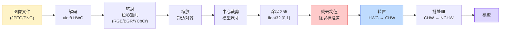
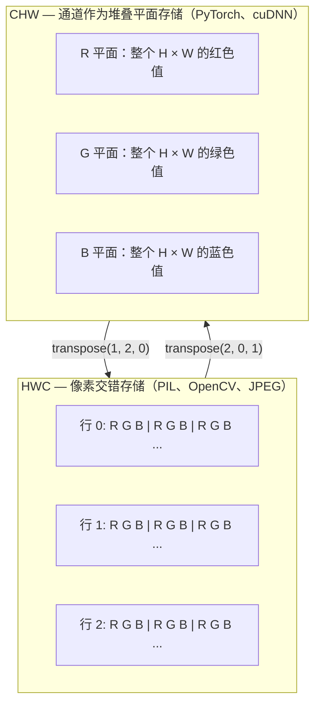

# 图像基础 — 像素、通道与色彩空间

> 图像是一张光样本的张量。你将用到的所有视觉模型都源于这一基本事实。

**类型：** Build
**语言：** Python
**前置知识：** Phase 1 Lesson 12（张量运算）、Phase 3 Lesson 11（PyTorch 入门）
**时间：** 约 45 分钟

## 学习目标

- 解释连续场景如何被离散化为像素，以及采样/量化决策如何设定所有下游模型的上限
- 将图像作为 NumPy 数组进行读取、切片和检查，并在 HWC 与 CHW 布局之间自如切换
- 在 RGB、灰度、HSV 和 YCbCr 之间进行转换，并阐明每种色彩空间存在的原因
- 按照预训练 PyTorch 视觉模型的预期，精确应用像素级预处理（归一化、标准化、缩放、通道置前）

## 问题所在

你将要阅读的每一篇论文、下载的每一个预训练权重、调用的每一个视觉 API，都假设输入具有特定的编码方式。如果模型需要 `float32` 而传入的是 `uint8` 图像，程序仍会正常运行——但会悄无声息地产生垃圾输出。将 BGR 喂给用 RGB 训练的网络，准确率会暴跌十个点。模型期望 channels-first 却传入 channels-last 输入时，第一层卷积会把高度当作特征通道来处理。这一切都不会报错。它只会毁坏你的指标，然后你花一周时间去追查一个潜伏在你加载文件方式中的 bug。

一旦知道卷积在滑动扫描什么，它并不复杂。困难之处在于，"一张图像"对于相机、JPEG 解码器、PIL、OpenCV、torchvision 和 CUDA 内核来说意味着不同的东西。每个技术栈都有自己的轴顺序、字节范围和通道约定。无法理清这些的视觉工程师会让管道处处失灵。

本课夯实基础，让本阶段的后续内容得以在此基础上构建。学完本课后，你将了解什么是像素、为什么每个像素有三个数值而非一个、"用 ImageNet 统计量归一化"实际做了什么，以及如何在我们这个阶段其他课程所依赖的两种或三种布局之间自由迁移。

## 核心概念

### 完整预处理流程一览

所有生产级视觉系统都是同一组可逆变换序列。错一步，模型看到的输入就与其训练时的输入不同。



两个红框和蓝框是 80% 的静默故障所在：缺少标准化和错误的布局。

### 像素是样本，不是方块

相机传感器对落在微小探测器阵列上的光子进行计数。每个探测器在极短的时间积分光信号，并输出与命中光子数成正比的电压。传感器随后将该电压离散化为一个整数。一个探测器成为一个像素。

```
连续场景                          传感器网格                    数字图像
（无限细节）                     （H × W 个探测器）             （H × W 个整数）

    ~~~~~                        +--+--+--+--+--+                 210 198 180 155 120
   ~   ~   ~                     |  |  |  |  |  |                 205 195 178 152 118
  ~ 光 ~        ---->           +--+--+--+--+--+     ---->       200 190 175 150 115
   ~~~~~                         |  |  |  |  |  |                 195 185 170 148 112
                                 +--+--+--+--+--+                 188 180 165 145 108
```

这一步骤涉及两个关键选择，它们决定了所有下游任务的上限：

- **空间采样** 决定每度场景对应多少个探测器。过少会导致边缘锯齿化（混叠）。过多则存储和计算开销急剧膨胀。
- **强度量化** 决定电压被划分成多少精细的区间。8 位给出 256 个等级，是显示领域的标准。10、12、16 位提供更平滑的渐变，对医学成像、HDR 和原始传感器管线至关重要。

像素不是带面积的彩色方块。它是一个单独的测量值。当你缩放或旋转图像时，你是在对该测量网格进行重新采样。

### 为什么有三个通道

单个探测器对整个可见光谱范围内的光子进行计数——这就是灰度图。要获得颜色，传感器在网格上覆盖一层红、绿、蓝滤色片的马赛克。去马赛克处理后，每个空间位置都有三个整数：分别对应附近的红色滤镜探测器、绿色滤镜探测器和蓝色滤镜探测器的响应值。这三个整数就是像素的 RGB 三元组。

```
内存中一个像素：

    (R, G, B) = (210, 140, 30)   <- 偏红橙色

一张 H × W 的 RGB 图像：

    shape (H, W, 3)     存储为   H 行，每行 W 个像素，每个像素 3 个值
                                    每个值在 [0, 255] 范围内（uint8）
```

三并不是魔法数字。深度摄像机增加一个 Z 通道。卫星图像添加红外和紫外波段。医学扫描通常有一个通道（X 光、CT）或多个通道（高光谱）。通道数是最后一个轴；卷积层学会沿该轴进行混合。

### 两种布局约定：HWC 与 CHW

同一个张量，两种排列顺序。每个库选择一种。

```
HWC（高度，宽度，通道）                  CHW（通道，高度，宽度）

   W ->                                    H ->
  +-----+-----+-----+                     +-----+-----+
H |R G B|R G B|R G B|                   C |R R R R R R|
| +-----+-----+-----+                   | +-----+-----+
v |R G B|R G B|R G B|                   v |G G G G G G|
  +-----+-----+-----+                     +-----+-----+
                                          |B B B B B B|
                                          +-----+-----+

   PIL、OpenCV、matplotlib、            PyTorch、大多数深度学习
   磁盘上几乎所有图像文件               框架、cuDNN 内核
```

CHW 的存在是因为卷积核沿 H 和 W 滑动。将通道轴置于首位意味着每个核在每个通道上看到连续的二维平面，便于向量化。磁盘格式采用 HWC 是因为这与传感器输出的扫描线一致。

你将会键入成千上万次的单行转换：

```
img_chw = img_hwc.transpose(2, 0, 1)      # NumPy
img_chw = img_hwc.permute(2, 0, 1)        # PyTorch tensor
```

内存布局可视化：



### 字节范围与数据类型

三种约定占据主流：

| 约定 | dtype | 范围 | 常见场景 |
|------|-------|------|----------|
| 原始 | `uint8` | [0, 255] | 磁盘文件、PIL、OpenCV 输出 |
| 归一化 | `float32` | [0.0, 1.0] | 执行 `img.astype('float32') / 255` 之后 |
| 标准化 | `float32` | 约 [-2, +2] | 减去均值并除以标准差之后 |

卷积神经网络是在标准化输入上训练的。ImageNet 统计量 `mean=[0.485, 0.456, 0.406]`，`std=[0.229, 0.224, 0.225]` 是在整个 ImageNet 训练集上以 [0, 1] 归一化像素计算出的三个通道的算术均值和标准差。将原始 `uint8` 喂给期望标准化 float 的模型，是应用视觉中最常见的静默故障。

### 色彩空间及其存在原因

RGB 是采集格式，但并非对模型来说最有用的表示。

```
 RGB                    HSV                           YCbCr / YUV

 R 红                   H 色调（角度 0-360）          Y 亮度（明暗）
 G 绿                   S 饱和度（0-1）              Cb 色度蓝-黄
 B 蓝                   V 亮度/明度（0-1）           Cr 色度红-绿

 线性到传感器输出        将颜色与                    将亮度与颜色分离。
                         亮度分离。适用于：          JPEG 及大多数视频
                         颜色阈值、UI               编解码器对色度通道
                         滑块、简单滤镜             压缩更激进，因为
                                                       人眼对色度细节的
                                                       敏感度低于对 Y 的
                                                       敏感度
```

对于大多数现代 CNN，你直接传入 RGB。以下情况会遇到其他色彩空间：

- **HSV** —— 经典 CV 代码、基于颜色的分割、白平衡。
- **YCbCr** —— 阅读 JPEG 内部结构、视频管线、仅对 Y 操作的超分辨率模型。
- **灰度** —— OCR、文档模型，以及颜色是干扰变量而非信号的任何场景。

从 RGB 得到的灰度是加权和，而非平均值，因为人眼对绿色比红或蓝更敏感：

```
Y = 0.299 R + 0.587 G + 0.114 B       （ITU-R BT.601，经典权重）
```

### 宽高比、缩放与插值

每个模型都有固定的输入尺寸（大多数 ImageNet 分类器为 224×224，现代检测器为 384×384 或 512×512）。你的图像很少恰好匹配。三个关键的缩放选择：

- **缩放到短边对齐，再中心裁剪** —— 标准 ImageNet 方案。保留宽高比，裁掉边缘的一条像素带。
- **缩放并填充** —— 保留宽高比和所有像素，添加黑边。检测和 OCR 的标准做法。
- **直接缩放到目标尺寸** —— 拉伸图像。计算廉价，几何变形，对许多分类任务已足够。

插值方法决定当新网格与原网格不对齐时如何计算中间像素：

```
最近邻（Nearest neighbour）  最快，块状，仅适用于遮罩/标签
双线性（Bilinear）           快速，平滑，大多数图像缩放的默认选择
双三次（Bicubic）            较慢，放大时更锐利
兰索斯（Lanczos）            最慢，质量最佳，用于最终显示
```

经验法则：训练用双线性，待展示的资源用双三次或兰索斯，包含整数类别 ID 的标签用最近邻。

```figure
conv-output-size
```

## 动手实现

### 步骤 1：构建图像张量并检查其形状

从一个确定性的合成图像开始，使第一个实验仅在 NumPy 支持下即可离线运行。文件解码是独立的边界问题：一旦 JPEG 或 PNG 解码器返回 RGB 字节，下面的所有张量操作都是一致的。

```python
import numpy as np

def synthetic_rgb(h=128, w=192, seed=0):
    rng = np.random.default_rng(seed)
    yy, xx = np.meshgrid(np.linspace(0, 1, h), np.linspace(0, 1, w), indexing="ij")
    r = (np.sin(xx * 6) * 0.5 + 0.5) * 255
    g = yy * 255
    b = (1 - yy) * xx * 255
    rgb = np.stack([r, g, b], axis=-1) + rng.normal(0, 6, (h, w, 3))
    return np.clip(rgb, 0, 255).astype(np.uint8)

arr = synthetic_rgb()

print(f"type:   {type(arr).__name__}")
print(f"dtype:  {arr.dtype}")
print(f"shape:  {arr.shape}     # (H, W, C)")
print(f"min:    {arr.min()}")
print(f"max:    {arr.max()}")
print(f"pixel at (0, 0): {arr[0, 0]}")
```

期望输出：`shape: (H, W, 3)`，`dtype: uint8`，范围 `[0, 255]`。无论字节来自相机、图像解码器还是这个合成生成器，这都是标准的解码表示。

### 步骤 2：分离通道与重排布局

分别提取 R、G、B，然后将 HWC 转换为 CHW 以适配 PyTorch。

```python
R = arr[:, :, 0]
G = arr[:, :, 1]
B = arr[:, :, 2]
print(f"R shape: {R.shape}, mean: {R.mean():.1f}")
print(f"G shape: {G.shape}, mean: {G.mean():.1f}")
print(f"B shape: {B.shape}, mean: {B.mean():.1f}")

arr_chw = arr.transpose(2, 0, 1)
print(f"\nHWC shape: {arr.shape}")
print(f"CHW shape: {arr_chw.shape}")
```

三个灰度平面，每通道一个。CHW 仅重新排列轴；在内存布局允许的情况下，严格来说不需要复制数据。

### 步骤 3：灰度与 HSV 转换

加权和灰度，然后手动实现 RGB 到 HSV 的转换。

```python
def rgb_to_grayscale(rgb):
    weights = np.array([0.299, 0.587, 0.114], dtype=np.float32)
    return (rgb.astype(np.float32) @ weights).astype(np.uint8)

def rgb_to_hsv(rgb):
    rgb_f = rgb.astype(np.float32) / 255.0
    r, g, b = rgb_f[..., 0], rgb_f[..., 1], rgb_f[..., 2]
    cmax = np.max(rgb_f, axis=-1)
    cmin = np.min(rgb_f, axis=-1)
    delta = cmax - cmin

    h = np.zeros_like(cmax)
    mask = delta > 0
    argmax = np.argmax(rgb_f, axis=-1)
    rmax = mask & (argmax == 0)
    gmax = mask & (argmax == 1)
    bmax = mask & (argmax == 2)
    h[rmax] = ((g[rmax] - b[rmax]) / delta[rmax]) % 6
    h[gmax] = ((b[gmax] - r[gmax]) / delta[gmax]) + 2
    h[bmax] = ((r[bmax] - g[bmax]) / delta[bmax]) + 4
    h = h * 60.0

    s = np.divide(delta, cmax, out=np.zeros_like(delta), where=cmax > 0)
    v = cmax
    return np.stack([h, s, v], axis=-1)

gray = rgb_to_grayscale(arr)
hsv = rgb_to_hsv(arr)
print(f"gray shape: {gray.shape}, range: [{gray.min()}, {gray.max()}]")
print(f"hsv   shape: {hsv.shape}")
print(f"hue range: [{hsv[..., 0].min():.1f}, {hsv[..., 0].max():.1f}] degrees")
print(f"sat range: [{hsv[..., 1].min():.2f}, {hsv[..., 1].max():.2f}]")
print(f"val range: [{hsv[..., 2].min():.2f}, {hsv[..., 2].max():.2f}]")
```

色调以度为单位输出，饱和度和明度在 [0, 1] 范围内。这与 OpenCV 的 `hsv_full` 约定一致。

### 步骤 4：归一化、标准化与逆向还原

从原始字节到预训练 ImageNet 模型所期望的精确张量，再还原回去。

```python
mean = np.array([0.485, 0.456, 0.406], dtype=np.float32)
std = np.array([0.229, 0.224, 0.225], dtype=np.float32)

def preprocess_imagenet(rgb_uint8):
    x = rgb_uint8.astype(np.float32) / 255.0
    x = (x - mean) / std
    x = x.transpose(2, 0, 1)
    return x

def deprocess_imagenet(chw_float32):
    x = chw_float32.transpose(1, 2, 0)
    x = x * std + mean
    x = np.clip(x * 255.0, 0, 255).astype(np.uint8)
    return x

x = preprocess_imagenet(arr)
print(f"preprocessed shape: {x.shape}     # (C, H, W)")
print(f"preprocessed dtype: {x.dtype}")
print(f"preprocessed mean per channel:  {x.mean(axis=(1, 2)).round(3)}")
print(f"preprocessed std  per channel:  {x.std(axis=(1, 2)).round(3)}")

roundtrip = deprocess_imagenet(x)
max_diff = np.abs(roundtrip.astype(int) - arr.astype(int)).max()
print(f"roundtrip max pixel diff: {max_diff}    # should be 0 or 1")
```

每通道的均值应接近零，标准差接近一。preprocess/deprocess 这一对操作正是 torchvision 中每个 `transforms.Normalize` 调用在幕后执行的内容。

### 步骤 5：从零实现缩放

最近邻将每个输出坐标四舍五入到最近的源像素。双线性插值找到四个邻近像素并按距离混合。下面两种实现均使用端点对齐坐标，使首尾源像素保持固定。

```python
def resize_coordinates(source_length, target_length):
    if target_length == 1:
        return np.zeros(1, dtype=np.float32)
    return np.linspace(0, source_length - 1, target_length, dtype=np.float32)

def nearest_resize(image, target_height, target_width):
    y = np.rint(resize_coordinates(image.shape[0], target_height)).astype(int)
    x = np.rint(resize_coordinates(image.shape[1], target_width)).astype(int)
    return image[y[:, None], x[None, :]]

def bilinear_resize(image, target_height, target_width):
    y = resize_coordinates(image.shape[0], target_height)
    x = resize_coordinates(image.shape[1], target_width)
    y0 = np.floor(y).astype(int)
    x0 = np.floor(x).astype(int)
    y1 = np.minimum(y0 + 1, image.shape[0] - 1)
    x1 = np.minimum(x0 + 1, image.shape[1] - 1)
    wy = (y - y0)[:, None, None]
    wx = (x - x0)[None, :, None]

    source = image.astype(np.float32)
    top = source[y0[:, None], x0[None, :]] * (1 - wx)
    top += source[y0[:, None], x1[None, :]] * wx
    bottom = source[y1[:, None], x0[None, :]] * (1 - wx)
    bottom += source[y1[:, None], x1[None, :]] * wx
    result = top * (1 - wy) + bottom * wy
    return np.clip(np.rint(result), 0, 255).astype(image.dtype)

target_height = arr.shape[0] * 3
target_width = arr.shape[1] * 3
nearest = nearest_resize(arr, target_height, target_width)
bilinear = bilinear_resize(arr, target_height, target_width)

def local_roughness(x):
    gy = np.diff(x.astype(float), axis=0)
    gx = np.diff(x.astype(float), axis=1)
    return float(np.abs(gy).mean() + np.abs(gx).mean())

for name, out in [("nearest", nearest), ("bilinear", bilinear)]:
    print(f"{name:>8}  shape={out.shape}  roughness={local_roughness(out):6.2f}")
```

最近邻在粗糙度得分上最高，因为它保留了硬边缘。双线性更平滑，因为每个新像素在每个轴上混合了两个位置。可运行的配套程序将同一可分离思路扩展到每轴四个邻居，使用 Catmull-Rom 三次样条核，然后在不依赖图像库的情况下输出三种结果。

## 实际应用

PyTorch 对批处理、设备感知的张量执行相同的操作。下面的代码将短边缩放至 256，取中心裁剪，对各通道标准化，并生成预训练模型所期望的 NCHW 张量。

```python
import torch
import torch.nn.functional as F

image_hwc = torch.from_numpy(synthetic_rgb(256, 320))
batch = image_hwc.permute(2, 0, 1).unsqueeze(0).float() / 255.0

height, width = batch.shape[-2:]
scale = 256 / min(height, width)
resized_height = round(height * scale)
resized_width = round(width * scale)
batch = F.interpolate(
    batch,
    size=(resized_height, resized_width),
    mode="bilinear",
    align_corners=False,
    antialias=True,
)

top = (resized_height - 224) // 2
left = (resized_width - 224) // 2
batch = batch[:, :, top:top + 224, left:left + 224]

mean = torch.tensor([0.485, 0.456, 0.406]).view(1, 3, 1, 1)
std = torch.tensor([0.229, 0.224, 0.225]).view(1, 3, 1, 1)
batch = (batch - mean) / std

print(f"tensor dtype: {batch.dtype}")
print(f"batched shape: {tuple(batch.shape)}")
print(f"per-channel mean: {batch.mean(dim=(0, 2, 3)).tolist()}")
print(f"per-channel std:  {batch.std(dim=(0, 2, 3)).tolist()}")
```

四个步骤，顺序不可更改：将字节转为 float 并将 HWC 置换为 NCHW，将短边缩放到 256，取 224×224 中心裁剪，然后减去 ImageNet 均值并除以其标准差。颠倒此顺序会悄无声息地改变抵达模型的数据。

## 交付成果

本课产出：

- `outputs/prompt-vision-preprocessing-audit.md` — 一个提示词，将任意模型卡片或数据集卡片转化为团队必须遵守的精确预处理不变量检查清单。
- `outputs/skill-image-tensor-inspector.md` — 一个技能，给定任意图像形状张量或数组，报告其 dtype、布局、范围，以及判断其是原始、归一化还是标准化状态。

## 练习

1. **(简单)** 创建一个 2×2 RGB `uint8` 数组，包含四种不同颜色。将 HWC 转换为 CHW 再转回，打印两种形状，并证明往返过程保留了所有值。
2. **(中等)** 编写 `standardize(img, mean, std)` 及其逆操作，使其在任意 uint8 图像上通过 `roundtrip_max_diff <= 1` 测试。你的函数须同时对单张 HWC 图像和 NCHW 批次使用同一调用方式。
3. **(困难)** 取一个 3 通道 ImageNet 标准化的张量，将其输入一个学习 RGB 加权混合为单通道灰度的 1×1 卷积。将权重初始化为 `[0.299, 0.587, 0.114]`，冻结后验证输出与手动 `rgb_to_grayscale` 在浮点误差范围内一致。还有哪些经典色彩空间变换可以写成 1×1 卷积？

## 核心术语

| 术语 | 人们常说的 | 实际含义 |
|------|-----------|----------|
| Pixel（像素） | "一个彩色方块" | 在网格某一位置的光强度单次采样——颜色为三个数值，灰度为一个数值 |
| Channel（通道） | "颜色" | 堆叠为图像张量的并行空间网格之一；HWC 中为末轴，CHW 中为首轴 |
| HWC / CHW | "形状" | 图像张量的轴顺序；磁盘和 PIL 使用 HWC，PyTorch 和 cuDNN 使用 CHW |
| Normalize（归一化） | "缩放图像" | 除以 255 使像素落在 [0, 1] 范围内——必要但不充分 |
| Standardize（标准化） | "零中心化" | 每通道减去均值并除以标准差，使输入分布与模型训练时匹配 |
| Grayscale conversion（灰度转换） | "平均各通道" | 使用系数 0.299/0.587/0.114 的加权和，与人眼亮度感知匹配 |
| Interpolation（插值） | "缩放如何选取像素" | 新网格与原网格不对齐时决定输出值的规则——标签用最近邻，训练用双线性，显示用双三次 |
| Aspect ratio（宽高比） | "宽比高" | 区分"缩放并填充"与"缩放并拉伸"的比例 |

## 延伸阅读

- [Charles Poynton — A Guided Tour of Color Space](https://poynton.ca/PDFs/Guided_tour.pdf) — 关于为何存在如此多色彩空间以及何时各自重要的最清晰技术分析
- [PyTorch Vision Transforms Docs](https://pytorch.org/vision/stable/transforms.html) — 你在生产中实际组合的完整变换流水线
- [How JPEG Works (Colt McAnlis)](https://www.youtube.com/watch?v=F1kYBnY6mwg) — 对色差子采样、DCT 以及 JPEG 为何对 YCbCr 而非 RGB 编码的锐利图解
- [ImageNet Preprocessing Conventions (torchvision models)](https://pytorch.org/vision/stable/models.html) — `mean=[0.485, 0.456, 0.406]` 的权威来源，以及 zoo 中每个模型为何都期望如此
