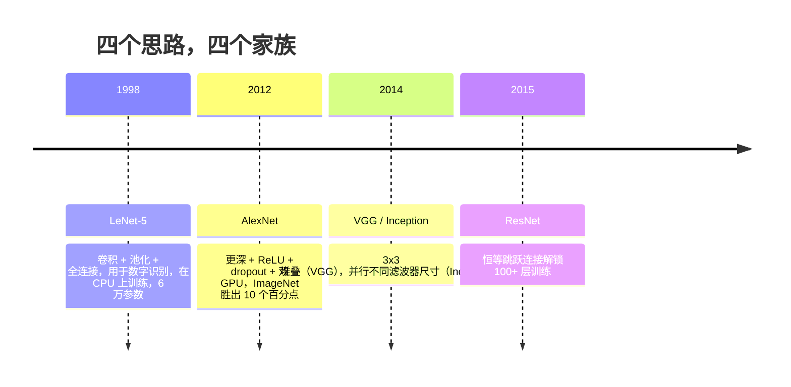
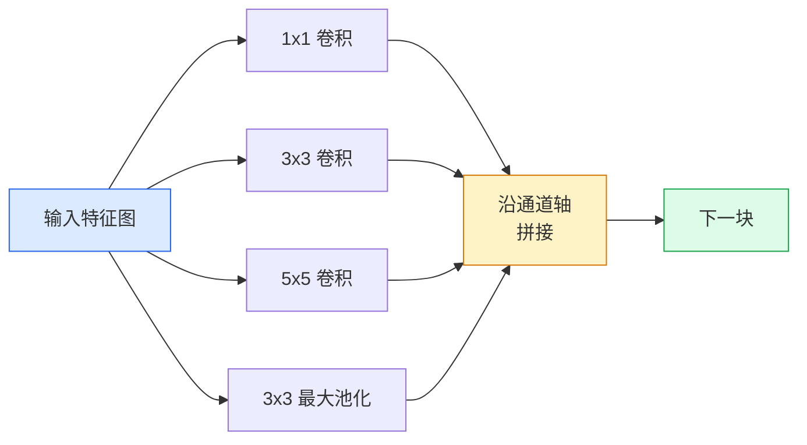
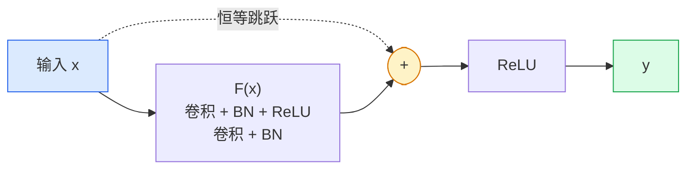

# CNNs — LeNet 到 ResNet

> 过去三十年里每一款重要 CNN 都是同一套"卷积–非线性–下采样"配方加上一个核心新思路。按时间顺序学透这些思路。

**类型：** 学习 + 构建
**语言：** Python
**前置知识：** 第三阶段第 11 课（PyTorch）、第四阶段第 01 课（图像基础）、第四阶段第 02 课（从零实现卷积）
**用时：** 约 75 分钟

## 学习目标

- 追踪 LeNet-5 → AlexNet → VGG → Inception → ResNet 的架构谱系，并能说出每类网络贡献的那个核心新思路
- 用 PyTorch 分别实现 LeNet-5、VGG 风格块、ResNet BasicBlock，每段不超过 40 行
- 解释残差连接如何把一个 1,000 层无法训练的网变成 SOTA
- 在查阅源码之前，仅凭结构描述就能推断出现代主干网络（ResNet-18、ResNet-50）的输出形状、感受野和参数量

## 问题背景

2011 年 ImageNet 最佳分类器 top-5 准确率约 74%。2012 年 AlexNet 拿到 85%。2015 年 ResNet 达到 96%。没有新数据，没有新一代 GPU，增长完全来自架构思路。懂视觉的工程师必须清楚每个思路出自哪篇论文——因为 2026 年所有投入生产的主干都是那几块积木的重组——而且这些思路一直在跨领域迁移：分组卷积从 CNN 跑到 Transformer，残差连接从 ResNet 跑遍所有 LLM，批归一化活在扩散模型里。

按时间顺序学习这些网络还能帮你免疫一个常见错误：明明 LeNet 大小的网就能解决问题，却去搬最大的可用模型。MNIST 不需要 ResNet。了解每类网络的缩放曲线，才知道自己在曲线上坐哪儿。

## 核心概念

### 改变视觉的四个思路



经典视觉里没有任何其他跳跃比这四个更重要。

### LeNet-5（1998）

Yann LeCun 的数字识别器。6 万参数。两个卷积–池化块，两个全连接层，tanh 激活。它定义了每一条 CNN 都继承的模板：

```
输入 (1, 32, 32)
  卷积 5x5 -> (6, 28, 28)
  平均池化 2x2 -> (6, 14, 14)
  卷积 5x5 -> (16, 10, 10)
  平均池化 2x2 -> (16, 5, 5)
  展平 -> 400
  全连接 -> 120
  全连接 -> 84
  全连接 -> 10
```

现代世界所称的"CNN"——卷积与下采样交替进行，最后接一个小分类头——就是 LeNet 的更深层、更大通道数、更好激活的版本。

### AlexNet（2012）

三项改变共同打破了 ImageNet：

1. **ReLU** 替代 tanh。梯度不再消失，训练速度提升六倍。
2. **Dropout** 用在全连接头。正则化成为一种层结构，而非技巧。
3. **深度与宽度**。五个卷积层、三个全连接层、6,000 万参数，在双 GPU 上训练，模型在两块卡之间切分。

论文图 2 展示的 GPU 切分是两条并行数据流。那种并行是硬件 workaround，不是架构洞察——但上面三个思路至今存在于你用的每一款模型中。

### VGG（2014）

VGG 的问题是：如果只用 3x3 卷积，并且往深了堆，会发生什么？

```
块结构：  卷积 3x3 -> 卷积 3x3 -> 池化 2x2
重复：    16 或 19 个卷积层
```

两个 3x3 卷积覆盖的感受野与一个 5x5 卷积相同，但参数量更少（2×9×C² = 18C² vs 25×C²），且中间多了一个 ReLU。VGG 把这一观察变成了一套完整架构。极简风格——一种块类型，重复使用——使其成为此后所有工作的参照点。

参数量：1.38 亿，训练慢，推理贵。

### Inception（2014，同年）

Google 对"我该用哪种卷积核尺寸？"的回答是：全部用，并行跑。



每条分支各司其职——1x1 用于通道混合，3x3 捕获局部纹理，5x5 捕获更大模式，池化捕获平移不变特征——拼接让下一层自由选择有用的分支。Inception v1 在每条分支内部使用 1x1 卷积作为瓶颈，以保持参数量可控。

### 退化问题

到 2015 年，VGG-19 能训练，VGG-32 不行。深度本应带来收益，但超过约 20 层后，训练误差和测试误差同时恶化。这不是过拟合。这是优化器找不到有效权重——梯度在每一层都被乘法缩小。

```
朴素深层网络：
  y = f_L( f_{L-1}( ... f_1(x) ... ) )

对浅层权重的梯度：
  dL/dW_1 = dL/dy * df_L/df_{L-1} * ... * df_2/df_1 * df_1/dW_1

每个乘法项的量级约为（权重量级）×（激活增益）。
连续乘 100 个增益 < 1 的项，梯度实际上为零。
```

VGG 在 19 层有效是因为同期发表的批归一化（batch norm）保持了激活量的良好缩放。但即使批归一化也无法拯救 30 层以上的深度。

### ResNet（2015）

He、Zhang、Ren、Sun 提出一个改动，解决了所有问题：

```
标准块：   y = F(x)
残差块：   y = F(x) + x
```

`+ x` 意味着该块始终可以选择"什么都不做"——只要把 `F(x)` 推到零即可。一个 1,000 层的 ResNet 最差也不会比 1 层网络差，因为每个额外块都有一个平凡的逃生通道。有了这个保证，优化器愿意让每个块都*稍微有用*——而稍微有用，堆 100 次，就是 SOTA。



两种块变体无处不在：

- **BasicBlock**（ResNet-18、ResNet-34）：两个 3x3 卷积，跳跃跨越两者。
- **Bottleneck**（ResNet-50、-101、-152）：1x1 降维 → 3x3 中间 → 1x1 升维，跳跃跨越整个 trio。通道数高时更省。

当跳跃需要跨越下采样（stride=2）时，恒等路径替换为一个 1x1 stride=2 卷积以对齐形状。

### 残差的意义超出视觉

这个思路本质上不是关于图像分类的。它是把深层网络从"祈祷梯度能活下来"变成一种可靠、可扩展的工程工具。下一阶段你要学的每一个 Transformer，在每个块里都有完全相同的跳跃连接。没有 ResNet，就没有 GPT。

## 动手实现

### 第一步：LeNet-5

一个最小且忠实于原作的 LeNet。tanh 激活，平均池化。唯一的现代让步是在下游使用 `nn.CrossEntropyLoss`，而非原始的 Gaussian 连接。

```python
import torch
import torch.nn as nn
import torch.nn.functional as F

class LeNet5(nn.Module):
    def __init__(self, num_classes=10):
        super().__init__()
        self.conv1 = nn.Conv2d(1, 6, kernel_size=5)
        self.conv2 = nn.Conv2d(6, 16, kernel_size=5)
        self.pool = nn.AvgPool2d(2)
        self.fc1 = nn.Linear(16 * 5 * 5, 120)
        self.fc2 = nn.Linear(120, 84)
        self.fc3 = nn.Linear(84, num_classes)

    def forward(self, x):
        x = self.pool(torch.tanh(self.conv1(x)))
        x = self.pool(torch.tanh(self.conv2(x)))
        x = torch.flatten(x, 1)
        x = torch.tanh(self.fc1(x))
        x = torch.tanh(self.fc2(x))
        return self.fc3(x)

net = LeNet5()
x = torch.randn(1, 1, 32, 32)
print(f"output: {net(x).shape}")
print(f"params: {sum(p.numel() for p in net.parameters()):,}")
```

期望输出：`output: torch.Size([1, 10])`，`params: 61,706`。这就是开启现代视觉的全部数字分类器。

### 第二步：一个 VGG 块

一个可复用块：两个 3x3 卷积，ReLU，批归一化，最大池化。

```python
class VGGBlock(nn.Module):
    def __init__(self, in_c, out_c):
        super().__init__()
        self.conv1 = nn.Conv2d(in_c, out_c, kernel_size=3, padding=1)
        self.bn1 = nn.BatchNorm2d(out_c)
        self.conv2 = nn.Conv2d(out_c, out_c, kernel_size=3, padding=1)
        self.bn2 = nn.BatchNorm2d(out_c)
        self.pool = nn.MaxPool2d(2)

    def forward(self, x):
        x = F.relu(self.bn1(self.conv1(x)))
        x = F.relu(self.bn2(self.conv2(x)))
        return self.pool(x)

class MiniVGG(nn.Module):
    def __init__(self, num_classes=10):
        super().__init__()
        self.stack = nn.Sequential(
            VGGBlock(3, 32),
            VGGBlock(32, 64),
            VGGBlock(64, 128),
        )
        self.head = nn.Sequential(
            nn.AdaptiveAvgPool2d(1),
            nn.Flatten(),
            nn.Linear(128, num_classes),
        )

    def forward(self, x):
        return self.head(self.stack(x))

net = MiniVGG()
x = torch.randn(1, 3, 32, 32)
print(f"output: {net(x).shape}")
print(f"params: {sum(p.numel() for p in net.parameters()):,}")
```

三个 VGG 块处理 CIFAR 尺寸输入，一个自适应池化，一个全连接层。约 29 万参数，对 CIFAR-10 足够用。

### 第三步：ResNet BasicBlock

ResNet-18 和 ResNet-34 的核心积木。

```python
class BasicBlock(nn.Module):
    def __init__(self, in_c, out_c, stride=1):
        super().__init__()
        self.conv1 = nn.Conv2d(in_c, out_c, kernel_size=3, stride=stride, padding=1, bias=False)
        self.bn1 = nn.BatchNorm2d(out_c)
        self.conv2 = nn.Conv2d(out_c, out_c, kernel_size=3, stride=1, padding=1, bias=False)
        self.bn2 = nn.BatchNorm2d(out_c)
        if stride != 1 or in_c != out_c:
            self.shortcut = nn.Sequential(
                nn.Conv2d(in_c, out_c, kernel_size=1, stride=stride, bias=False),
                nn.BatchNorm2d(out_c),
            )
        else:
            self.shortcut = nn.Identity()

    def forward(self, x):
        out = F.relu(self.bn1(self.conv1(x)))
        out = self.bn2(self.conv2(out))
        out = out + self.shortcut(x)
        return F.relu(out)
```

卷积层 `bias=False` 是批归一化的惯例——BN 的 beta 参数已经承担了偏置角色，同时保留卷积偏置是浪费。`shortcut` 仅在 stride 或通道数变化时才需要真实卷积；否则就是无操作的恒等映射。

### 第四步：一个微型 ResNet

堆四组 BasicBlock，得到一个可在 CIFAR 尺寸输入上工作的 ResNet。

```python
class TinyResNet(nn.Module):
    def __init__(self, num_classes=10):
        super().__init__()
        self.stem = nn.Sequential(
            nn.Conv2d(3, 32, kernel_size=3, stride=1, padding=1, bias=False),
            nn.BatchNorm2d(32),
            nn.ReLU(inplace=True),
        )
        self.layer1 = self._make_group(32, 32, num_blocks=2, stride=1)
        self.layer2 = self._make_group(32, 64, num_blocks=2, stride=2)
        self.layer3 = self._make_group(64, 128, num_blocks=2, stride=2)
        self.layer4 = self._make_group(128, 256, num_blocks=2, stride=2)
        self.head = nn.Sequential(
            nn.AdaptiveAvgPool2d(1),
            nn.Flatten(),
            nn.Linear(256, num_classes),
        )

    def _make_group(self, in_c, out_c, num_blocks, stride):
        blocks = [BasicBlock(in_c, out_c, stride=stride)]
        for _ in range(num_blocks - 1):
            blocks.append(BasicBlock(out_c, out_c, stride=1))
        return nn.Sequential(*blocks)

    def forward(self, x):
        x = self.stem(x)
        x = self.layer1(x)
        x = self.layer2(x)
        x = self.layer3(x)
        x = self.layer4(x)
        return self.head(x)

net = TinyResNet()
x = torch.randn(1, 3, 32, 32)
print(f"output: {net(x).shape}")
print(f"params: {sum(p.numel() for p in net.parameters()):,}")
```

四组，每组两个块。第 2、3、4 组起始处 stride=2。每次下采样通道数翻倍。约 280 万参数。这是可以干净地缩放至 ResNet-152 的标准配方。

### 第五步：对比参数–特征效率

将同一输入送入三款网络，对比参数量。

```python
def summary(name, net, x):
    y = net(x)
    params = sum(p.numel() for p in net.parameters())
    print(f"{name:12s}  input {tuple(x.shape)} -> output {tuple(y.shape)}  params {params:>10,}")

x = torch.randn(1, 3, 32, 32)
summary("LeNet5",     LeNet5(),       torch.randn(1, 1, 32, 32))
summary("MiniVGG",    MiniVGG(),      x)
summary("TinyResNet", TinyResNet(),   x)
```

三款模型，三个时代，参数量相差三个数量级。在 CIFAR-10 准确率上，大致为：LeNet 60%，MiniVGG 89%，TinyResNet 93%（训练数个 epoch 后）。

## 实际应用

`torchvision.models` 提供上述所有模型的预训练版本。调用签名在各家族之间完全一致——这正是主干抽象的意义所在。

```python
from torchvision.models import resnet18, ResNet18_Weights, vgg16, VGG16_Weights

r18 = resnet18(weights=ResNet18_Weights.IMAGENET1K_V1)
r18.eval()

print(f"ResNet-18 params: {sum(p.numel() for p in r18.parameters()):,}")
print(r18.layer1[0])
print()

v16 = vgg16(weights=VGG16_Weights.IMAGENET1K_V1)
v16.eval()
print(f"VGG-16   params: {sum(p.numel() for p in v16.parameters()):,}")
```

ResNet-18 有 1,170 万参数。VGG-16 有 1.38 亿参数。ImageNet top-1 准确率相近（69.8% vs 71.6%）。残差连接为你换来 12 倍的参数效率优势。这就是 ResNet 变体从 2016 年到 2021 年 ViT 登场前一直主导——并且仍在计算资源受限的真实部署中占据主流——的原因。

迁移学习的配方始终相同：加载预训练权重，冻结主干，替换分类头。

```python
for p in r18.parameters():
    p.requires_grad = False
r18.fc = nn.Linear(r18.fc.in_features, 10)
```

三行代码。你现在拥有一个继承 ImageNet 所付费 representations 的 10 类 CIFAR 分类器。

## 交付物

本课产出：

- `outputs/prompt-backbone-selector.md`——一个提示词，根据任务、数据集规模和算力预算选择合适的 CNN 家族（LeNet/VGG/ResNet/MobileNet/ConvNeXt）。
- `outputs/skill-residual-block-reviewer.md`——一个技能，读取 PyTorch 模块并标记跳跃连接的错误（stride 变化时缺少 shortcut、shortcut 激活顺序错误、BN 相对于加法的放置位置错误）。

## 练习

1. **（简单）** 逐层手算 `TinyResNet` 的参数量，与 `sum(p.numel() for p in net.parameters())` 对比。参数的主要开销花在哪儿——卷积、BN，还是分类头？
2. **（中等）** 实现 Bottleneck 块（1x1 → 3x3 → 1x1，带跳跃），并用它构建一个 ResNet-50 风格的 CIFAR 网络。对比参数量与 `TinyResNet`。
3. **（困难）** 从 `BasicBlock` 中移除跳跃连接，在 CIFAR-10 上分别训练 34 块"朴素"网络和 34 块 ResNet，各 10 个 epoch。绘制两者的训练损失–epoch 曲线，复现 He 等论文图 1 的结果：深层朴素网络收敛到的损失高于其更浅的孪生网络。

## 关键术语

| 术语 | 人们怎么说 | 实际含义 |
|------|-----------|---------|
| Backbone | "模型本身" | 产生特征图并送入任务头的卷积块堆栈 |
| Residual connection | "跳跃连接" | `y = F(x) + x`；让优化器通过学习恒等映射（设 F 为零）来处理任意深度 |
| BasicBlock | "带跳跃的两个 3x3 卷积" | ResNet-18/34 的积木：卷积–BN–ReLU–卷积–BN–相加–ReLU |
| Bottleneck | "1x1 降维，3x3，1x1 升维" | ResNet-50/101/152 的积木；高通道数时更省，因为 3x3 在缩减宽度上运行 |
| Degradation problem | "越深越差" | 朴素卷积超过约 20 层后，训练误差和测试误差同时上升；由残差连接解决，而非更多数据 |
| Stem | "第一层" | 将 3 通道输入转换为基础特征宽度的初始卷积；ImageNet 常用 7x7 stride=2，CIFAR 常用 3x3 stride=1 |
| Head | "分类器" | 最后一个主干块之后的层：自适应池化、展平、全连接层 |
| Transfer learning | "预训练权重" | 加载在 ImageNet 上训练好的主干，仅在自己的任务上微调分类头 |

## 延伸阅读

- [Deep Residual Learning for Image Recognition（He 等，2015）](https://arxiv.org/abs/1512.03385)——ResNet 论文，每张图都值得细读
- [Very Deep Convolutional Networks（Simonyan & Zisserman，2014）](https://arxiv.org/abs/1409.1556)——VGG 论文，仍是"为什么用 3x3"的最佳参考
- [ImageNet Classification with Deep CNNs（Krizhevsky 等，2012）](https://papers.nips.cc/paper_files/paper/2012/hash/c399862d3b9d6b76c8436e924a68c45b-Abstract.html)——AlexNet，终结手工特征时代的论文
- [Going Deeper with Convolutions（Szegedy 等，2014）](https://arxiv.org/abs/1409.4842)——Inception v1，并行滤波器思路至今仍在视觉 Transformer 中出现
