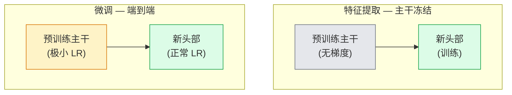

# 迁移学习与微调

> 别人花了一百万 GPU 小时教一个网络认识边缘、纹理和物体部件。你应当在训练自己的模型之前借用这些特征。

**类型：** Build
**语言：** Python
**前置知识：** Phase 4 Lesson 03（卷积神经网络）、Phase 4 Lesson 04（图像分类）
**耗时：** ~75 分钟

## 学习目标

- 区分特征提取与微调，并根据数据集规模、领域距离和计算预算选择合适方案
- 加载预训练主干，替换其分类头，用不到 20 行代码仅训练分类头达到可用基线
- 逐步解冻层并使用判别性学习率，使早期通用特征获得比晚期任务专用特征更小的更新
- 诊断三种常见故障：因解冻块的学习率过高导致的特征漂移、因数据集太小导致的 BatchNorm 统计量坍缩，以及灾难性遗忘

## 问题所在

在 ImageNet 上训练一个 ResNet-50 需要约 2,000 GPU 小时。几乎没有任何团队能为其交付的每个任务都承担这样的预算。每个团队实际交付的大多是一个预训练主干，搭配在新任务的数百或数千张图像上训练的头部。

这并非走捷径。任何 ImageNet 训练 CNN 的第一个卷积块都学习边缘和类 Gabor 滤波器。接下来的几个块学习纹理和简单模式。中间的块学习物体部件。最后的块学习开始看起来像 1,000 个 ImageNet 类别的组合。这层级结构的前 90% 几乎可以无损地迁移到医学影像、工业检测、卫星数据和所有其他视觉任务——因为自然的词汇库对边缘和纹理是有限的。你需要训练的正是最后那 10%。

正确迁移学习有三个陷阱等着你：用过高的学习率销毁预训练特征、因冻结过多而让模型信息匮乏，以及让 BatchNorm 的运行统计量漂移到整个网络从未见过的极小数据集上。本课程将有意识地逐一讲解这些问题。

## 核心概念

### 特征提取 vs 微调

两种范式，由你对预训练特征有多信任以及你有多少数据来决定。



经验法则：

| 数据集规模 | 领域距离 | 方案 |
|--------------|-----------------|--------|
| < 1k 张图像 | 接近 ImageNet | 冻结主干，仅训练头部 |
| 1k-10k | 接近 | 冻结前 2-3 个阶段，微调其余部分 |
| 10k-100k | 任意 | 使用判别性学习率端到端微调 |
| 100k+ | 远 | 微调全部参数；若领域足够远可考虑从头训练 |

"接近 ImageNet"大致意味着自然 RGB 照片，包含类对象内容。医学 CT 扫描、高空卫星影像和显微图像属于远领域——特征仍然有用，但你需要让更多层适应。

### 为什么冻结有效

CNN 在 ImageNet 上学习的特征并非专属于这 1,000 个类别。它们专为自然图像的统计特性而存在：特定方向的边缘、纹理、对比度模式、形状基元。这些统计特性在人类能够说出的几乎所有视觉领域中都是稳定的。这就是为什么在 ImageNet 上训练的模型，仅用一个新线性头（不微调主干）就能在 CIFAR-10 上达到 80%+ 的零样本准确率。分类头正在学习为当前任务加权哪些已学特征。

### 判别性学习率

当你解冻时，早期层应比晚期层训练得更慢。早期层编码你想要保留的通用特征；晚期层编码你需要大幅调整的任务专用结构。

```
典型配方：

  阶段 0（stem + 第一组）: lr = base_lr / 100   （基本固定）
  阶段 1:                       lr = base_lr / 10
  阶段 2:                       lr = base_lr / 3
  阶段 3（最后主干组）: lr = base_lr
  头部:                          lr = base_lr （或略高）
```

在 PyTorch 中，这只是传递给优化器的参数组列表。一个模型，五个学习率，零额外代码。

### BatchNorm 问题

BN 层持有 `running_mean` 和 `running_var` 缓冲区，这些是在 ImageNet 上计算的。如果你的任务有不同的像素分布——不同的光照、不同的传感器、不同的色彩空间——这些缓冲区就是错误的。按优先级排列有三种方案：

1. **以训练模式微调 BN。** 让 BN 与其他参数一起更新运行统计量。当任务数据集为中等规模（≥ 5k 样本）时的默认选择。
2. **以评估模式冻结 BN。** 保留 ImageNet 统计量，仅训练权重。当你的数据集足够小、BN 的移动平均会变得嘈杂时适用。
3. **用 GroupNorm 替换 BN。** 完全消除移动平均问题。用于 GPU 每卡批次极小的检测和分割主干。

处理不当会无声地将准确率降低 5-15%。

### 头部设计

分类头由 1-3 个线性层加可选 dropout 组成。每个 torchvision 主干都有一个默认头部，你需要将其替换：

```
backbone.fc = nn.Linear(backbone.fc.in_features, num_classes)          # ResNet
backbone.classifier[1] = nn.Linear(..., num_classes)                    # EfficientNet, MobileNet
backbone.heads.head = nn.Linear(..., num_classes)                       # torchvision ViT
```

对于小数据集，单个线性层通常就足够了。添加一个隐藏层（Linear -> ReLU -> Dropout -> Linear）在任务分布距离主干训练分布较远时有帮助。

### 逐层学习率衰减

现代微调（BEiT、DINOv2、ViT-B 微调）中使用的判别性学习率的平滑版本。不必将层分组为阶段，而是给每一层一个比其上层的略小学习率：

```
lr_layer_k = base_lr * decay^(L - k)
```

当 decay = 0.75 且 L = 12 个 transformer 块时，第一个块的训练速率为头部的 `0.75^11 ≈ 0.04x`。对于 transformer 微调比 CNN 更重要，在 CNN 中按阶段分组的 LR 通常已足够。

### 评估指标

迁移学习实验需要你在从头训练时不会跟踪的两个数值：

- **仅预训练准确率** —— 主干冻结时头部的准确率。这是你的下界。
- **微调后准确率** —— 端到端训练后同一模型的准确率。这是你的上界。

若微调后低于仅预训练，则存在学习率或 BN 的 bug。始终同时打印两个数值。

```figure
transfer-learning
```

## 动手实践

### 步骤 1：加载预训练主干并检查

```python
import torch
import torch.nn as nn
from torchvision.models import resnet18, ResNet18_Weights

backbone = resnet18(weights=ResNet18_Weights.IMAGENET1K_V1)
print(backbone)
print()
print("classifier head:", backbone.fc)
print("feature dim:", backbone.fc.in_features)
```

`ResNet18` 有四个阶段（`layer1..layer4`）加上一个 stem 和一个 `fc` 头部。每个 torchvision 分类主干都有类似的结构。

### 步骤 2：特征提取 —— 冻结全部，替换头部

```python
def make_feature_extractor(num_classes=10):
    model = resnet18(weights=ResNet18_Weights.IMAGENET1K_V1)
    for p in model.parameters():
        p.requires_grad = False
    model.fc = nn.Linear(model.fc.in_features, num_classes)
    return model

model = make_feature_extractor(num_classes=10)
trainable = sum(p.numel() for p in model.parameters() if p.requires_grad)
frozen = sum(p.numel() for p in model.parameters() if not p.requires_grad)
print(f"trainable: {trainable:>10,}")
print(f"frozen:    {frozen:>10,}")
```

只有 `model.fc` 可训练。主干是一个冻结的特征提取器。

### 步骤 3：判别性微调

一个构建具有阶段特定学习率参数组的工具函数。

```python
def discriminative_param_groups(model, base_lr=1e-3, decay=0.3):
    stages = [
        ["conv1", "bn1"],
        ["layer1"],
        ["layer2"],
        ["layer3"],
        ["layer4"],
        ["fc"],
    ]
    groups = []
    for i, names in enumerate(stages):
        lr = base_lr * (decay ** (len(stages) - 1 - i))
        params = [p for n, p in model.named_parameters()
                  if any(n.startswith(k) for k in names)]
        if params:
            groups.append({"params": params, "lr": lr, "name": "_".join(names)})
    return groups

model = resnet18(weights=ResNet18_Weights.IMAGENET1K_V1)
model.fc = nn.Linear(model.fc.in_features, 10)
for p in model.parameters():
    p.requires_grad = True

groups = discriminative_param_groups(model)
for g in groups:
    print(f"{g['name']:>10s}  lr={g['lr']:.2e}  params={sum(p.numel() for p in g['params']):>8,}")
```

`decay=0.3` 表示每个阶段以下一阶段 30% 的速率训练。`fc` 获得 `base_lr`，`layer4` 获得 `0.3 * base_lr`，`conv1` 获得 `0.3^5 * base_lr ≈ 0.00243 * base_lr`。听起来很极端；但经验上有效。

### 步骤 4：BatchNorm 处理

冻结 BN 运行统计量但不冻结其权重的辅助函数。

```python
def freeze_bn_stats(model):
    for m in model.modules():
        if isinstance(m, (nn.BatchNorm1d, nn.BatchNorm2d, nn.BatchNorm3d)):
            m.eval()
            for p in m.parameters():
                p.requires_grad = False
    return model
```

在每个 epoch 开始时调用 `model.train()` 之后调用它。`model.train()` 将所有内容切换到训练模式；此函数仅对 BN 层撤销该操作。

### 步骤 5：最小端到端微调循环

```python
from torch.optim import SGD
from torch.utils.data import DataLoader
from torch.optim.lr_scheduler import CosineAnnealingLR
import torch.nn.functional as F

def fine_tune(model, train_loader, val_loader, device, epochs=5, base_lr=1e-3, freeze_bn=False):
    model = model.to(device)
    groups = discriminative_param_groups(model, base_lr=base_lr)
    optimizer = SGD(groups, momentum=0.9, weight_decay=1e-4, nesterov=True)
    scheduler = CosineAnnealingLR(optimizer, T_max=epochs)

    for epoch in range(epochs):
        model.train()
        if freeze_bn:
            freeze_bn_stats(model)
        tr_loss, tr_correct, tr_total = 0.0, 0, 0
        for x, y in train_loader:
            x, y = x.to(device), y.to(device)
            logits = model(x)
            loss = F.cross_entropy(logits, y, label_smoothing=0.1)
            optimizer.zero_grad()
            loss.backward()
            optimizer.step()
            tr_loss += loss.item() * x.size(0)
            tr_total += x.size(0)
            tr_correct += (logits.argmax(-1) == y).sum().item()
        scheduler.step()

        model.eval()
        va_total, va_correct = 0, 0
        with torch.no_grad():
            for x, y in val_loader:
                x, y = x.to(device), y.to(device)
                pred = model(x).argmax(-1)
                va_total += x.size(0)
                va_correct += (pred == y).sum().item()
        print(f"epoch {epoch}  train {tr_loss/tr_total:.3f}/{tr_correct/tr_total:.3f}  "
              f"val {va_correct/va_total:.3f}")
    return model
```

在上述配方下对 CIFAR-10 训练五个 epoch，可将 `ResNet18-IMAGENET1K_V1` 从约 70% 的零样本线性探测准确率提升至约 93% 的微调准确率。仅训练头部时，不触碰主干的情况下准确率会在约 86% 处 plateau。

### 步骤 6：渐进式解冻

一个每个 epoch 从尾部向头部逐个解冻一个阶段的调度方案。以额外几个 epoch 为代价减轻特征漂移。

```python
def progressive_unfreeze_schedule(model):
    stages = ["layer4", "layer3", "layer2", "layer1"]
    yielded = set()

    def start():
        for p in model.parameters():
            p.requires_grad = False
        for p in model.fc.parameters():
            p.requires_grad = True

    def unfreeze(epoch):
        if epoch < len(stages):
            name = stages[epoch]
            yielded.add(name)
            for n, p in model.named_parameters():
                if n.startswith(name):
                    p.requires_grad = True
            return name
        return None

    return start, unfreeze
```

在第一个 epoch 之前调用一次 `start()`。在每个 epoch 开始时调用 `unfreeze(epoch)`。每当可训练参数集合发生变化时重建优化器，否则冻结参数的缓存矩仍会干扰它。

## 应用

对于大多数真实任务，`torchvision.models` + 三行代码已足够。上面更重的手动实现在遇到库默认值无法解决的问题时才派上用场。

```python
from torchvision.models import resnet50, ResNet50_Weights

model = resnet50(weights=ResNet50_Weights.IMAGENET1K_V2)
model.fc = nn.Linear(model.fc.in_features, num_classes)
optimizer = torch.optim.AdamW(model.parameters(), lr=1e-4, weight_decay=1e-4)
```

两个其他生产级默认选项：

- `timm` 提供约 800 个预训练视觉主干，具有统一的 API（`timm.create_model("resnet50", pretrained=True, num_classes=10)`。超出 torchvision 库的微调时，它是行业标准。
- 对于 transformer，`transformers.AutoModelForImageClassification.from_pretrained(name, num_labels=N)` 为你提供的 ViT / BEiT / DeiT 与文本模型具有相同的加载语义。

## 交付物

本课产出：

- `outputs/prompt-fine-tune-planner.md` —— 一个根据数据集规模、领域距离和计算预算来选择特征提取、渐进微调或端到端微调的 prompt。
- `outputs/skill-freeze-inspector.md` —— 一个技能，给定 PyTorch 模型时报告哪些参数可训练、哪些 BatchNorm 层处于评估模式、以及优化器是否真正被喂入了可训练参数。

## 练习

1. **（简单）** 在同一合成 CIFAR 数据集上，分别以线性探测（主干冻结）和完整微调方式训练 `ResNet18`。并排报告两者的准确率。解释哪个差距表明特征迁移良好，哪个表明迁移不佳。
2. **（中等）** 故意引入一个 bug：将主干阶段的 `base_lr` 设为 `1e-1` 而非头部。展示训练损失爆炸，然后应用 `discriminative_param_groups` 辅助函数进行恢复。记录每个阶段开始发散时的学习率。
3. **（困难）** 取一个医学影像数据集（如 CheXpert-small、PatchCamelyon 或 HAM10000），比较三种范式：(a) ImageNet 预训练冻结主干 + 线性头部；(b) ImageNet 预训练端到端微调；(c) 从头训练。报告每种的准确率和计算成本。数据集规模达到多少时从头训练变得具有竞争力？

## 关键术语

| 术语 | 人们怎么说 | 实际含义 |
|------|----------------|----------------|
| 特征提取 | "冻结并训练头部" | 主干参数冻结，仅新的分类头部接收梯度 |
| 微调 | "端到端重新训练" | 所有参数可训练，通常学习率远低于从头训练 |
| 判别性学习率 | "早期层使用较小 LR" | 优化器参数组中早期阶段 LR 是晚期阶段 LR 的一个分数 |
| 逐层学习率衰减 | "平滑 LR 梯度" | 每层 LR 乘以 decay^(L - k)；在 transformer 微调中常见 |
| 灾难性遗忘 | "模型丢失了 ImageNet 知识" | 过高的学习率在学到新任务信号之前就覆盖了预训练特征 |
| BN 统计漂移 | "运行均值错误" | BatchNorm running_mean/var 在不同于当前任务的分布上计算，无声地损害准确率 |
| 线性探测 | "冻结主干 + 线性头部" | 对预训练特征的评估 —— 在冻结表示之上最佳线性分类器的准确率 |
| 灾难性坍缩 | "全部预测同一个类别" | 当微调学习率高到足以在头部梯度稳定之前就摧毁特征时发生 |

## 延伸阅读

- [How transferable are features in deep neural networks? (Yosinski et al., 2014)](https://arxiv.org/abs/1411.1792) —— 量化特征在各层间可迁移性的论文
- [Universal Language Model Fine-tuning (ULMFiT, Howard & Ruder, 2018)](https://arxiv.org/abs/1801.06146) —— 原始判别性学习率 / 渐进式解冻配方；这些思路可直接迁移到视觉领域
- [timm documentation](https://huggingface.co/docs/timm) —— 现代视觉主干的参考文档及其训练所用的精确微调默认值
- [A Simple Framework for Linear-Probe Evaluation (Kornblith et al., 2019)](https://arxiv.org/abs/1805.08974) —— 为什么线性探测准确率重要以及如何正确报告它
