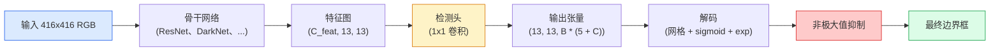

# 目标检测 — 从零实现 YOLO

> 检测 = 分类 + 回归，在特征图的每个位置运行，再用非极大值抑制进行清理。

**类型：** 构建
**语言：** Python
**前置知识：** 阶段 4 课程 03（CNN）、阶段 4 课程 04（图像分类）、阶段 4 课程 05（迁移学习）
**预计时间：** ~75 分钟

## 学习目标

- 解释网格与锚点设计如何将检测转化为密集预测问题，并说明输出张量中每个数值的含义
- 计算边界框的交并比（IoU），并从零实现非极大值抑制
- 在预训练骨干网络之上构建最小化的 YOLO 风格检测头，包括分类损失、置信度损失和边框回归损失
- 读懂一行检测指标（Precision@0.5、Recall、mAP@0.5、mAP@0.5:0.95），并判断下一步应该调节哪个超参数

## 问题背景

分类器会说"这张图片里有一只狗。"检测器会说"在像素坐标 (112, 40, 280, 210) 处有一只狗，在 (400, 180, 560, 310) 处有一只猫，画面中没有其他物体。"这一结构性变化——预测数量可变的带标签边界框，而非每张图片预测一个标签——正是每一个自主系统、每一个监控产品、每一个文档版面解析器和每一条工厂视觉产线所依赖的核心能力。

检测也是视觉工程权衡集中的地方。你需要准确的位置（回归头）、正确的类别（分类头）、模型知道何时没有可检测物体（置信度分数），以及每个真实物体只对应一个预测（非极大值抑制）。缺少任何一环，管线就会出现漏检、幻觉框，或同一个物体在略有不同的位置上被预测了十五次。

YOLO（You Only Look Once，Redmon 等人 2016 年）通过单次前向传播实现了所有这些目标的实时运行，而这些结构决策至今仍是现代检测器的骨干（YOLOv8、YOLOv9、YOLO-NAS、RT-DETR）。掌握核心后，所有变体都只是相同组件的不同排列组合。

## 概念详解

### 检测即密集预测

分类器每张图片输出 C 个数值。YOLO 风格的检测器每张图片输出 `(S × S × (5 + C))` 个数值，其中 S 是空间网格尺寸。



每个 `S × S` 网格单元预测 `B` 个边界框。对于每个框：

- 4 个数值描述几何形状：`tx, ty, tw, th`
- 1 个数值是置信度分数："这个单元中心是否有物体？"
- C 个数值是类别概率

每个单元总计：`B × (5 + C)`。对于 VOC 数据集，`S=13, B=2, C=20`，每个单元即为 50 个数值。

### 为什么需要网格与锚点

朴素回归会对每个物体预测 `(x, y, w, h)` 作为绝对坐标。这对卷积网络来说很难学，因为平移图像不应导致所有预测同等平移——每个物体都有固定的空间位置。网格通过将所有物体中心分配到其所在的网格单元来解决这个问题；只有该单元负责预测对应物体。

锚点解决第二个问题。一个 3×3 的卷积核难以从一个 16 像素感受野的单元中直接回归出 500 像素宽的框。因此我们预先为每个单元定义 `B` 个先验框形状（锚点），模型预测相对于每个锚点的小偏移量。模型学会的是选择合适的锚点并轻微调整它，而非从零开始回归。

```
锚点先验形状示例（416x416 输入）：

  小框：   (30,  60)
  中框：  (75,  170)
  大框： (200, 380)

在每个网格单元，每个锚点都会输出 (tx, ty, tw, th, obj, c_1, ..., c_C)。
```

现代检测器通常使用 FPN 在不同分辨率上搭配不同的锚点集——浅层高分辨率图用小锚点，深层低分辨率图用大锚点。原理相同，尺度更多。

### 解码预测

原始的 `tx, ty, tw, th` 不是边界框坐标；它们是回归目标，需要在绘图前进行变换：

```
中心 x = (sigmoid(tx) + cell_x) * stride
中心 y = (sigmoid(ty) + cell_y) * stride
宽度   = anchor_w * exp(tw)
高度   = anchor_h * exp(th)
```

`s i g m o i d` 将中心偏移限制在单元格内；`e x p` 允许宽度从锚点自由缩放而不发生符号翻转；`stride` 将网格坐标缩放回像素坐标。这一解码步骤自 v2 以来在所有 YOLO 版本中保持一致。

### IoU

检测中用于衡量两个边界框相似度的通用指标：

```
IoU(A, B) = 面积(A 与 B 的交集) / 面积(A 与 B 的并集)
```

IoU = 1 表示完全重合；IoU = 0 表示无重叠。预测框与真实框之间的 IoU 决定了该预测是否算作真正例（通常 IoU >= 0.5）。两个预测框之间的 IoU 则被 NMS 用于去重。

### 非极大值抑制

在同一物体上，训练了相邻锚点的卷积网络往往会预测出重叠的框。NMS 保留置信度最高的预测，删除与已选框 IoU 超过阈值的任何其他预测。

```
NMS(boxes, scores, iou_threshold):
    按分数降序排列边界框
    keep = []
    while 框集合非空:
        选择得分最高的框，加入 keep
        删除与已选框 IoU > iou_threshold 的所有框
    return keep
```

常用阈值：0.45。最近的检测器会用 `soft-NMS`、`DIoU-NMS` 或直接学习抑制过程（如 RT-DETR），但结构目的相同。

### 损失函数

YOLO 损失是三个损失的加权求和：

```
L = lambda_coord * L_box(pred, target, 当 obj=1 时)
  + lambda_obj   * L_obj(pred, 1,     当 obj=1 时)
  + lambda_noobj * L_obj(pred, 0,     当 obj=0 时)
  + lambda_cls   * L_cls(pred, target, 当 obj=1 时)
```

只有包含物体的单元格才会对边框回归和分类损失有贡献。不含物体的单元格仅对置信度损失有贡献（教会模型保持沉默）。`lambda_noobj` 通常较小（约 0.5），因为绝大多数单元格是空的，否则它们会主导总损失。

现代变体用 CIoU / DIoU 替换 MSE 边框损失（直接优化 IoU），用焦点损失处理类别不平衡，并用质量焦点损失平衡置信度。三组件结构保持不变。

### 检测指标

准确率无法直接迁移到检测任务。以下是四个有效指标：

- **Precision@IoU=0.5** —— 在所有被判为正例的预测中，多少实际上是正确的。
- **Recall@IoU=0.5** —— 在所有真实物体中，我们找到了多少。
- **AP@0.5** —— IoU 阈值为 0.5 时的精确率-召回率曲线面积；每个类别一个数值。
- **mAP@0.5:0.95** —— IoU 阈值 0.5、0.55、...、0.95 下 AP 的平均值。即 COCO 指标；最严格也最有信息量。

报告这四个数值。若检测器在 mAP@0.5 上表现强但在 mAP@0.5:0.95 上表现弱，说明定位粗略而不精确；改用更好的边框回归损失。若检测器精度高但召回率低，说明模型过于保守；降低置信度阈值或提高置信度权重。

```figure
object-detection-nms
```

## 动手构建

### 第 1 步：IoU

本课的核心工具。接受两组 `(x1, y1, x2, y2)` 格式的边界框数组。

```python
import numpy as np

def box_iou(boxes_a, boxes_b):
    ax1, ay1, ax2, ay2 = boxes_a[:, 0], boxes_a[:, 1], boxes_a[:, 2], boxes_a[:, 3]
    bx1, by1, bx2, by2 = boxes_b[:, 0], boxes_b[:, 1], boxes_b[:, 2], boxes_b[:, 3]

    inter_x1 = np.maximum(ax1[:, None], bx1[None, :])
    inter_y1 = np.maximum(ay1[:, None], by1[None, :])
    inter_x2 = np.minimum(ax2[:, None], bx2[None, :])
    inter_y2 = np.minimum(ay2[:, None], by2[None, :])

    inter_w = np.clip(inter_x2 - inter_x1, 0, None)
    inter_h = np.clip(inter_y2 - inter_y1, 0, None)
    inter = inter_w * inter_h

    area_a = (ax2 - ax1) * (ay2 - ay1)
    area_b = (bx2 - bx1) * (by2 - by1)
    union = area_a[:, None] + area_b[None, :] - inter
    return inter / np.clip(union, 1e-8, None)
```

返回 `(N_a, N_b)` 的成对 IoU 矩阵。传入单条真实框时，将其形状设为 `(1, 4)` 即可。

### 第 2 步：非极大值抑制

```python
def nms(boxes, scores, iou_threshold=0.45):
    order = np.argsort(-scores)
    keep = []
    while len(order) > 0:
        i = order[0]
        keep.append(i)
        if len(order) == 1:
            break
        rest = order[1:]
        ious = box_iou(boxes[[i]], boxes[rest])[0]
        order = rest[ious <= iou_threshold]
    return np.array(keep, dtype=np.int64)
```

确定性算法，排序时间复杂度为 O(N log N)，与 `torchvision.ops.nms` 在相同输入下的行为一致。

### 第 3 步：边框编码与解码

在像素坐标与网络实际回归的 `(tx, ty, tw, th)` 目标之间转换。

```python
def encode(box_xyxy, cell_x, cell_y, stride, anchor_wh):
    x1, y1, x2, y2 = box_xyxy
    cx = 0.5 * (x1 + x2)
    cy = 0.5 * (y1 + y2)
    w = x2 - x1
    h = y2 - y1
    tx = cx / stride - cell_x
    ty = cy / stride - cell_y
    tw = np.log(w / anchor_wh[0] + 1e-8)
    th = np.log(h / anchor_wh[1] + 1e-8)
    return np.array([tx, ty, tw, th])


def decode(tx_ty_tw_th, cell_x, cell_y, stride, anchor_wh):
    tx, ty, tw, th = tx_ty_tw_th
    cx = (sigmoid(tx) + cell_x) * stride
    cy = (sigmoid(ty) + cell_y) * stride
    w = anchor_wh[0] * np.exp(tw)
    h = anchor_wh[1] * np.exp(th)
    return np.array([cx - w / 2, cy - h / 2, cx + w / 2, cy + h / 2])


def sigmoid(x):
    return 1.0 / (1.0 + np.exp(-x))
```

测试：编码一个框再解码，你应该能恢复出接近原始的结果（受 sigmoid 反函数在 `tx` 超出范围内并非完美可逆的影响）。

### 第 4 步：最小化 YOLO 检测头

对特征图应用一个 1×1 卷积，重塑为 `(B, S, S, num_anchors, 5 + C)`。

```python
import torch
import torch.nn as nn

class YOLOHead(nn.Module):
    def __init__(self, in_c, num_anchors, num_classes):
        super().__init__()
        self.num_anchors = num_anchors
        self.num_classes = num_classes
        self.conv = nn.Conv2d(in_c, num_anchors * (5 + num_classes), kernel_size=1)

    def forward(self, x):
        n, _, h, w = x.shape
        y = self.conv(x)
        y = y.view(n, self.num_anchors, 5 + self.num_classes, h, w)
        y = y.permute(0, 3, 4, 1, 2).contiguous()
        return y
```

输出形状：`(N, H, W, num_anchors, 5 + C)`。最后一维包含 `[tx, ty, tw, th, obj, cls_0, ..., cls_{C-1}]`。

### 第 5 步：真实框分配

为每个真实框决定哪个 `(单元格, 锚点)` 负责预测。

```python
def assign_targets(boxes_xyxy, classes, anchors, stride, grid_size, num_classes):
    num_anchors = len(anchors)
    target = np.zeros((grid_size, grid_size, num_anchors, 5 + num_classes), dtype=np.float32)
    has_obj = np.zeros((grid_size, grid_size, num_anchors), dtype=bool)

    for box, cls in zip(boxes_xyxy, classes):
        x1, y1, x2, y2 = box
        cx, cy = 0.5 * (x1 + x2), 0.5 * (y1 + y2)
        gx, gy = int(cx / stride), int(cy / stride)
        bw, bh = x2 - x1, y2 - y1

        ious = np.array([
            (min(bw, aw) * min(bh, ah)) / (bw * bh + aw * ah - min(bw, aw) * min(bh, ah))
            for aw, ah in anchors
        ])
        best = int(np.argmax(ious))
        aw, ah = anchors[best]

        target[gy, gx, best, 0] = cx / stride - gx
        target[gy, gx, best, 1] = cy / stride - gy
        target[gy, gx, best, 2] = np.log(bw / aw + 1e-8)
        target[gy, gx, best, 3] = np.log(bh / ah + 1e-8)
        target[gy, gx, best, 4] = 1.0
        target[gy, gx, best, 5 + cls] = 1.0
        has_obj[gy, gx, best] = True
    return target, has_obj
```

锚点选择策略是"与真实框的最佳形状 IoU"——这是 YOLOv2/v3 分配方式的廉价代理。v5 及以后版本使用了更复杂的策略（任务对齐匹配、动态 k 匹配），但本质思想相同。

### 第 6 步：三个损失项

```python
def yolo_loss(pred, target, has_obj, lambda_coord=5.0, lambda_obj=1.0, lambda_noobj=0.5, lambda_cls=1.0):
    has_obj_t = torch.from_numpy(has_obj).bool()
    target_t = torch.from_numpy(target).float()

    # 边框回归损失：仅在含物体的单元格上计算
    box_pred = pred[..., :4][has_obj_t]
    box_true = target_t[..., :4][has_obj_t]
    loss_box = torch.nn.functional.mse_loss(box_pred, box_true, reduction="sum")

    # 置信度损失
    obj_pred = pred[..., 4]
    obj_true = target_t[..., 4]
    loss_obj_pos = torch.nn.functional.binary_cross_entropy_with_logits(
        obj_pred[has_obj_t], obj_true[has_obj_t], reduction="sum")
    loss_obj_neg = torch.nn.functional.binary_cross_entropy_with_logits(
        obj_pred[~has_obj_t], obj_true[~has_obj_t], reduction="sum")

    # 分类损失：仅在含物体的单元格上计算
    cls_pred = pred[..., 5:][has_obj_t]
    cls_true = target_t[..., 5:][has_obj_t]
    loss_cls = torch.nn.functional.binary_cross_entropy_with_logits(
        cls_pred, cls_true, reduction="sum")

    total = (lambda_coord * loss_box
             + lambda_obj * loss_obj_pos
             + lambda_noobj * loss_obj_neg
             + lambda_cls * loss_cls)
    return total, {"box": loss_box.item(), "obj_pos": loss_obj_pos.item(),
                   "obj_neg": loss_obj_neg.item(), "cls": loss_cls.item()}
```

五个超参数是每个 YOLO 教程要么硬编码要么进行扫参的变量。比例关系很重要：`lambda_coord=5, lambda_noobj=0.5` 对应原始 YOLOv1 论文，仍是一个合理的默认值。

### 第 7 步：推理管线

解码原始头部输出，应用 sigmoid/exp，对置信度设定阈值，然后执行 NMS。

```python
def postprocess(pred_tensor, anchors, stride, img_size, conf_threshold=0.25, iou_threshold=0.45):
    pred = pred_tensor.detach().cpu().numpy()
    grid_h, grid_w = pred.shape[1], pred.shape[2]
    num_anchors = len(anchors)

    boxes, scores, classes = [], [], []
    for gy in range(grid_h):
        for gx in range(grid_w):
            for a in range(num_anchors):
                tx, ty, tw, th, obj, *cls = pred[0, gy, gx, a]
                score = sigmoid(obj) * sigmoid(np.array(cls)).max()
                if score < conf_threshold:
                    continue
                cls_idx = int(np.argmax(cls))
                cx = (sigmoid(tx) + gx) * stride
                cy = (sigmoid(ty) + gy) * stride
                w = anchors[a][0] * np.exp(tw)
                h = anchors[a][1] * np.exp(th)
                boxes.append([cx - w / 2, cy - h / 2, cx + w / 2, cy + h / 2])
                scores.append(float(score))
                classes.append(cls_idx)

    if not boxes:
        return np.zeros((0, 4)), np.zeros((0,)), np.zeros((0,), dtype=int)
    boxes = np.array(boxes)
    scores = np.array(scores)
    classes = np.array(classes)
    keep = nms(boxes, scores, iou_threshold)
    return boxes[keep], scores[keep], classes[keep]
```

这就是完整的评估路径：检测头 → 解码 → 阈值过滤 → NMS。

## 使用方式

`torchvision.models.detection` 提供了具备相同概念结构的工业级检测器。加载预训练模型只需三行代码。

```python
import torch
from torchvision.models.detection import fasterrcnn_resnet50_fpn_v2

model = fasterrcnn_resnet50_fpn_v2(weights="DEFAULT")
model.eval()
with torch.no_grad():
    predictions = model([torch.randn(3, 400, 600)])
print(predictions[0].keys())
print(f"boxes:  {predictions[0]['boxes'].shape}")
print(f"scores: {predictions[0]['scores'].shape}")
print(f"labels: {predictions[0]['labels'].shape}")
```

对于实时推理管线，`ultralytics`（YOLOv8/v9）是行业标准：`from ultralytics import YOLO; model = YOLO('yolov8n.pt'); model(img)`。模型内部完成了解码和 NMS，返回与你刚刚构建的相同的 `boxes / scores / labels` 三元组。

## 交付物

本课将产出：

- `outputs/prompt-detection-metric-reader.md` —— 一个提示词模板，能将 `precision, recall, AP, mAP@0.5:0.95` 一行指标转化为单行诊断结论与最重要的下一步实验建议。
- `outputs/skill-anchor-designer.md` —— 一个技能脚本，给定真实框数据集后，对 `(w, h)` 执行 k-means，返回各 FPN 级别的锚点集以及选择锚点数量的覆盖统计信息。

## 练习题

1. **(简单)** 实现 `box_iou`，并与 `torchvision.ops.box_iou` 在 1,000 组随机框对上对比。验证最大绝对误差低于 `1e-6`。
2. **(中等)** 将 `yolo_loss` 改写为使用 CIoU 边框损失而非 MSE 的版本。在 100 张合成数据集上展示：在相同训练轮数下，CIoU 收敛到的最终 mAP@0.5:0.95 优于 MSE。
3. **(困难)** 实现多尺度推理：将同一张图以三种分辨率送入模型，合并所有预测框，最后执行一次 NMS。在预留验证集上测量相比单尺度推理的 mAP 提升幅度。

## 核心术语

| 术语 | 常见说法 | 实际含义 |
|------|----------|----------|
| Anchor（锚点） | "Box prior" | 每个网格单元预定义的框形状，网络从中预测偏移量而非绝对坐标 |
| IoU | "Overlap" | 两个框的交并比；检测任务中的通用相似度度量 |
| NMS | "Deduplicate" | 贪心算法，保留最高分预测并移除与已选框 IoU 超过阈值的重叠框 |
| Objectness（置信度） | "Is there something here" | 每锚点、每单元格的标量，预测该单元格中心是否包含物体 |
| Grid stride（网格步长） | "Downsample factor" | 每格对应的像素数；416 像素输入搭配 13 格检测头时，stride 为 32 |
| mAP | "Mean average precision" | 精确率-召回率曲线下面积在所有类别上（COCO 还需在所有 IoU 阈值上）的平均值 |
| AP@0.5 | "PASCAL VOC AP" | IoU 阈值为 0.5 时的平均精度；宽松版本的指标 |
| mAP@0.5:0.95 | "COCO AP" | IoU 阈值从 0.5 到 0.95（步长 0.05）的平均精度；严格版本，也是当前社区标准 |

## 延伸阅读

- [YOLOv1: You Only Look Once (Redmon et al., 2016)](https://arxiv.org/abs/1506.02640) —— 奠基论文；此后所有 YOLO 版本都是对该结构的改进
- [YOLOv3 (Redmon & Farhadi, 2018)](https://arxiv.org/abs/1804.02767) —— 引入多尺度 FPN 风格检测头的论文；仍是图解最清晰的版本
- [Ultralytics YOLOv8 文档](https://docs.ultralytics.com) —— 当前工业参考；涵盖数据集格式、数据增强与训练配方
- [The Illustrated Guide to Object Detection (Jonathan Hui)](https://jonathan-hui.medium.com/object-detection-series-24d03a12f904) —— 对完整检测器家族最好的通俗讲解；理解 DETR、RetinaNet、FCOS 与 YOLO 之间关系的必读资源
