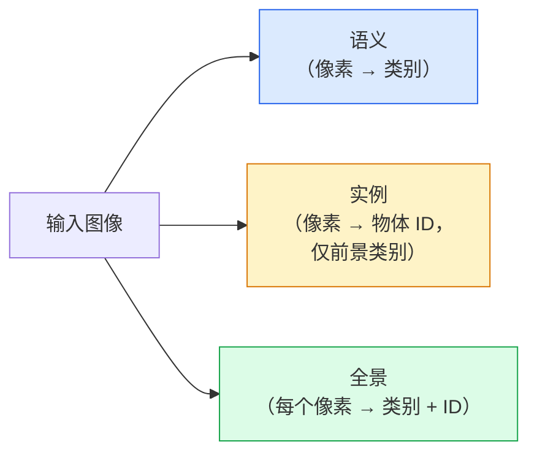
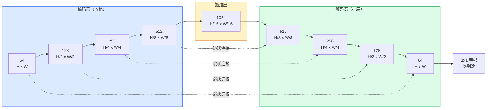

# 语义分割 — U-Net

> 分割是在每个像素上做分类。U-Net 的做法是将下采样的编码器与上采样的解码器配对，并在两者之间连接跳跃连接。

**类型：** 构建
**语言：** Python
**前置知识：** 第四阶段 课程03（卷积神经网络）、第四阶段 课程04（图像分类）
**耗时：** 约 75 分钟

## 学习目标

- 区分语义分割、实例分割和全景分割，并为给定问题选择合适的任务
- 使用 PyTorch 从零构建 U-Net，包含编码器块、瓶颈层、使用转置卷积的解码器以及跳跃连接
- 实现像素级交叉熵损失、Dice 损失，以及目前医学和工业分割中作为默认方案的组合损失
- 按类别读取 IoU 和 Dice 指标，并诊断低分是源于小目标召回率、边界精度还是类别不平衡

## 问题背景

分类输出每张图片一个标签。检测输出每张图片若干个边界框。分割输出每个像素一个标签。对于大小为 `H x W` 的输入，输出是形状为 `H x W`（语义）或 `H x W x N_instances`（实例）的张量。这意味着每张图片有数百万个预测，而非一个。

分割的结构正是它驱动几乎所有密集预测视觉产品的原因：医学影像（肿瘤掩码）、自动驾驶（道路、车道、障碍物）、卫星图像（建筑轮廓、作物边界）、文档解析（布局区域）、机器人（可抓取区域）。这些任务都无法通过给物体画个框来解决；它们需要精确的轮廓。

架构问题表述简单但求解不易：你需要网络同时看到图像的全局上下文（这是什么场景）和局部像素细节（哪个像素是道路、哪个是人行道）。标准 CNN 通过空间压缩来获取上下文，从而丢失了细节。U-Net 的设计同时兼顾了这两者。

## 概念

### 语义 vs 实例 vs 全景



- **语义** 说"这个像素是道路，那个像素是车"。两辆并排的车会合并成一个blob。
- **实例** 说"这个像素是车 #3，那个像素是车 #5"。忽略背景内容（"stuff" = 天空、道路、草地）。
- **全景** 统一两者：每个像素获得类别标签，每个实例获得唯一 ID，背景和前景物体都被分割。

本课涵盖语义分割。下一课（Mask R-CNN）将涵盖实例分割。

### U-Net 结构



编码器将空间分辨率四次减半，通道数翻倍。解码器反向操作：四次翻倍空间分辨率，通道数减半。跳跃连接在每个分辨率级别将匹配的编码器特征与解码器特征拼接。最终的 1x1 卷积将 `64 -> 类别数` 映射到全分辨率。

为什么需要跳跃连接：当解码器尝试输出像素级预测时，它看到的只是小尺寸特征图。如果没有跳跃连接，它无法准确定位边缘，因为这些信息在编码器中被压缩掉了。跳跃连接将编码器在下行过程中计算的高分辨率特征图直接交给解码器。

### 转置卷积 vs 双线性上采样

解码器需要扩展空间维度。两种方案：

- **转置卷积**（`nn.ConvTranspose2d`）— 可学习的上采样。U-Net 原始默认方案。如果步长和卷积核尺寸不能整除，可能产生棋盘格伪影。
- **双线性上采样 + 3x3 卷积** — 平滑上采样后接卷积。伪影更少，参数更少，现在是现代默认方案。

两种方案都常见。对于第一个 U-Net，双线性更安全。

### 像素网格上的交叉熵

对于 C 类的语义分割，模型输出为 `(N, C, H, W)`。目标为 `(N, H, W)`，包含整数类别 ID。交叉熵与分类情况相同，只是在每个空间位置应用：

```
损失 = 对所有 (n, h, w) 求均值：-log( softmax(logits[n, :, h, w])[target[n, h, w]] )
```

PyTorch 的 `F.cross_entropy` 原生支持这种形状。无需 reshape。

### Dice 损失及为什么需要它

交叉熵平等对待每个像素。当某一类占据画面主体时（医学影像：99% 背景，1% 肿瘤），这是错误的。网络可以通过全部预测为背景获得 99% 的准确率，但实际上毫无用处。

Dice 损失通过直接优化预测掩码与真实掩码之间的重叠来解决此问题：

```
Dice(p, y) = 2 * sum(p * y) / (sum(p) + sum(y) + epsilon)
Dice损失 = 1 - Dice
```

其中 `p` 是某个类别的 sigmoid/softmax 概率图，`y` 是二值真实掩码。只有当重叠完美时损失才为零。由于是基于比率计算，类别不平衡对它没有影响。

实践中使用**组合损失**：

```
L = L_cross_entropy + lambda * L_dice       (lambda ~ 1)
```

交叉熵在训练早期提供稳定的梯度；Dice 在训练后期专注于匹配掩码形状。这种组合是医学影像的默认方案，在任何类别不平衡的数据集上都难以超越。

### 评估指标

- **像素准确率** — 正确预测的像素百分比。计算便宜。与分类中的准确率一样，在类别不平衡数据上表现很差。
- **各类 IoU** — 每个类别掩码的交并比；跨类别平均 = mIoU。
- **Dice（像素级 F1）** — 与 IoU 类似；`Dice = 2 * IoU / (1 + IoU)`。医学影像领域偏好 Dice，驱动社区偏好 IoU；两者单调相关。
- **边界 F1** — 衡量预测边界与真实边界的接近程度，即使微小偏移也会受到惩罚。对半导体检测等高精度任务很重要。

按类别报告 IoU，而不仅仅是 mIoU。平均 IoU 会掩盖这样的情况：一个类别 15%，其他九个类别 85%。

### 输入分辨率权衡

U-Net 的编码器将分辨率四次减半，因此输入必须能被 16 整除。医学图像通常是 512x512 或 1024x1024。自动驾驶裁剪图是 2048x1024。U-Net 的显存成本随 `H * W * C_max` 增长，在 1024x1024 输入和 1024 瓶颈通道时，前向传播已占用数 GB 显存。

两种标准解决方案：
1. **切片处理** — 以 256x256 的图块（带重叠）处理，然后拼接。
2. **用空洞卷积替换瓶颈层** — 保持更高的空间分辨率，同时扩大感受野（DeepLab 系列）。

对于第一个模型，256x256 输入配合 64 通道基数的 U-Net 在 8 GB 显存上可舒适训练。

```figure
segmentation-flood
```

## 构建代码

### 第 1 步：编码器块

两个 3x3 卷积，带批归一化和 ReLU。第一个卷积改变通道数；第二个保持不变。

```python
import torch
import torch.nn as nn
import torch.nn.functional as F

class DoubleConv(nn.Module):
    def __init__(self, in_c, out_c):
        super().__init__()
        self.net = nn.Sequential(
            # 第一个卷积改变通道数，bias=False 因为 BN 的 beta 参数已处理偏置
            nn.Conv2d(in_c, out_c, kernel_size=3, padding=1, bias=False),
            nn.BatchNorm2d(out_c),
            nn.ReLU(inplace=True),
            # 第二个卷积保持通道数不变
            nn.Conv2d(out_c, out_c, kernel_size=3, padding=1, bias=False),
            nn.BatchNorm2d(out_c),
            nn.ReLU(inplace=True),
        )

    def forward(self, x):
        return self.net(x)
```

此块在整个网络中重复使用。`bias=False` 是因为 BN 的 beta 参数已处理偏置。

### 第 2 步：下采样和上采样块

```python
class Down(nn.Module):
    def __init__(self, in_c, out_c):
        super().__init__()
        self.net = nn.Sequential(
            nn.MaxPool2d(2),
            DoubleConv(in_c, out_c),
        )

    def forward(self, x):
        return self.net(x)


class Up(nn.Module):
    def __init__(self, in_c, out_c):
        super().__init__()
        # 双线性上采样作为现代默认方案
        self.up = nn.Upsample(scale_factor=2, mode="bilinear", align_corners=False)
        self.conv = DoubleConv(in_c, out_c)

    def forward(self, x, skip):
        x = self.up(x)
        # 仅比较空间维度，处理尺寸不能被16整除的输入
        if x.shape[-2:] != skip.shape[-2:]:
            x = F.interpolate(x, size=skip.shape[-2:], mode="bilinear", align_corners=False)
        # 将跳跃连接特征与上采样特征拼接
        x = torch.cat([skip, x], dim=1)
        return self.conv(x)
```

仅比较空间维度（`shape[-2:]`）来处理尺寸不能被 16 整除的输入；安全的 `F.interpolate` 在拼接前对齐张量。比较完整形状还会因通道数差异触发，那应该是明显的错误而非静默插值。

### 第 3 步：U-Net

```python
class UNet(nn.Module):
    def __init__(self, in_channels=3, num_classes=2, base=64):
        super().__init__()
        self.inc = DoubleConv(in_channels, base)
        self.d1 = Down(base, base * 2)
        self.d2 = Down(base * 2, base * 4)
        self.d3 = Down(base * 4, base * 8)
        self.d4 = Down(base * 8, base * 16)
        # 上采样块需要拼接跳跃连接特征，因此输入通道数翻倍
        self.u1 = Up(base * 16 + base * 8, base * 8)
        self.u2 = Up(base * 8 + base * 4, base * 4)
        self.u3 = Up(base * 4 + base * 2, base * 2)
        self.u4 = Up(base * 2 + base, base)
        # 最终 1x1 卷积映射到类别数
        self.outc = nn.Conv2d(base, num_classes, kernel_size=1)

    def forward(self, x):
        x1 = self.inc(x)
        x2 = self.d1(x1)
        x3 = self.d2(x2)
        x4 = self.d3(x3)
        x5 = self.d4(x4)
        x = self.u1(x5, x4)
        x = self.u2(x, x3)
        x = self.u3(x, x2)
        x = self.u4(x, x1)
        return self.outc(x)

net = UNet(in_channels=3, num_classes=2, base=32)
x = torch.randn(1, 3, 256, 256)
print(f"output: {net(x).shape}")
print(f"params: {sum(p.numel() for p in net.parameters()):,}")
```

输出形状 `(1, 2, 256, 256)` — 与输入相同的空间尺寸，`num_classes` 个通道。`base=32` 时约 770 万参数。

### 第 4 步：损失函数

```python
def dice_loss(logits, targets, num_classes, eps=1e-6):
    probs = F.softmax(logits, dim=1)
    # 将目标转换为 one-hot 编码并调整维度顺序
    targets_one_hot = F.one_hot(targets, num_classes).permute(0, 3, 1, 2).float()
    dims = (0, 2, 3)
    intersection = (probs * targets_one_hot).sum(dim=dims)
    denom = probs.sum(dim=dims) + targets_one_hot.sum(dim=dims)
    dice = (2 * intersection + eps) / (denom + eps)
    # 对各类别取平均（macro Dice）
    return 1 - dice.mean()


def combined_loss(logits, targets, num_classes, lam=1.0):
    ce = F.cross_entropy(logits, targets)
    dc = dice_loss(logits, targets, num_classes)
    # 组合损失：交叉熵 + lambda * Dice 损失
    return ce + lam * dc, {"ce": ce.item(), "dice": dc.item()}
```

Dice 按类别计算后取平均（macro Dice）。`eps` 防止批次中不存在的类别出现除以零。

### 第 5 步：IoU 指标

```python
@torch.no_grad()
def iou_per_class(logits, targets, num_classes):
    preds = logits.argmax(dim=1)
    ious = torch.zeros(num_classes)
    for c in range(num_classes):
        pred_c = (preds == c)
        true_c = (targets == c)
        inter = (pred_c & true_c).sum().float()
        union = (pred_c | true_c).sum().float()
        # 并集为 0 的类别返回 nan
        ious[c] = (inter / union) if union > 0 else torch.tensor(float("nan"))
    return ious
```

返回长度为 C 的向量。`nan` 标记批次中不存在的类别 — 计算 mIoU 时不要对这些类别取平均。

### 第 6 步：用于端到端验证的合成数据集

在彩色背景上生成形状，让网络学习形状而非像素颜色。

```python
import numpy as np
from torch.utils.data import Dataset, DataLoader

def synthetic_segmentation(num_samples=200, size=64, seed=0):
    rng = np.random.default_rng(seed)
    images = np.zeros((num_samples, size, size, 3), dtype=np.float32)
    masks = np.zeros((num_samples, size, size), dtype=np.int64)
    for i in range(num_samples):
        bg = rng.uniform(0, 1, (3,))
        images[i] = bg
        masks[i] = 0
        num_shapes = rng.integers(1, 4)
        for _ in range(num_shapes):
            cls = int(rng.integers(1, 3))
            color = rng.uniform(0, 1, (3,))
            cx, cy = rng.integers(10, size - 10, size=2)
            r = int(rng.integers(4, 12))
            yy, xx = np.meshgrid(np.arange(size), np.arange(size), indexing="ij")
            if cls == 1:
                # 生成圆形掩码
                mask = (xx - cx) ** 2 + (yy - cy) ** 2 < r ** 2
            else:
                # 生成方形掩码
                mask = (np.abs(xx - cx) < r) & (np.abs(yy - cy) < r)
            images[i][mask] = color
            masks[i][mask] = cls
        images[i] += rng.normal(0, 0.02, images[i].shape)
        images[i] = np.clip(images[i], 0, 1)
    return images, masks


class SegDataset(Dataset):
    def __init__(self, images, masks):
        self.images = images
        self.masks = masks

    def __len__(self):
        return len(self.images)

    def __getitem__(self, i):
        # 将 HWC 格式转换为 CHW 格式
        img = torch.from_numpy(self.images[i]).permute(2, 0, 1).float()
        mask = torch.from_numpy(self.masks[i]).long()
        return img, mask
```

三个类别：背景（0）、圆形（1）、方形（2）。网络必须学会区分形状。

### 第 7 步：训练循环

```python
def train_one_epoch(model, loader, optimizer, device, num_classes):
    model.train()
    loss_sum, total = 0.0, 0
    iou_sum = torch.zeros(num_classes)
    for x, y in loader:
        x, y = x.to(device), y.to(device)
        logits = model(x)
        loss, _ = combined_loss(logits, y, num_classes)
        optimizer.zero_grad()
        loss.backward()
        optimizer.step()
        loss_sum += loss.item() * x.size(0)
        total += x.size(0)
        iou_sum += iou_per_class(logits, y, num_classes).nan_to_num(0)
    return loss_sum / total, iou_sum / len(loader)
```

在合成数据集上运行 10-30 个 epoch，观察形状类别的 mIoU 攀升至 0.9 以上。注意 `nan_to_num(0)` 将批次中不存在的类别视为零；对于准确的逐类别 IoU，应在评估时按存在性掩码并使用 `torch.nanmean` 跨批次平均，而非在此处平均。

## 使用方式

对于生产环境，`segmentation_models_pytorch`（"smp"）将每种标准分割架构与任意 torchvision 或 timm 骨干网封装在一起。只需三行代码：

```python
import segmentation_models_pytorch as smp

model = smp.Unet(
    encoder_name="resnet34",
    encoder_weights="imagenet",
    in_channels=3,
    classes=3,
)
```

实际工作中还值得了解的架构：
- **DeepLabV3+** — 用空洞卷积替换基于最大池化的下采样，使瓶颈层保持分辨率；在卫星和驾驶数据上边界更精细。
- **SegFormer** — 用分层 Transformer 替换卷积编码器；目前在多个基准测试中处于 SOTA。
- **Mask2Former** / **OneFormer** — 在单一架构中统一语义、实例和全景分割。

这三种均可在 `smp` 或 `transformers` 中直接替换，数据加载器相同。

## 交付成果

本课产出：

- `outputs/prompt-segmentation-task-picker.md` — 一个提示词，用于在语义、实例和全景分割之间进行选择，并为给定任务命名架构。
- `outputs/skill-segmentation-mask-inspector.md` — 一个技能，报告类别分布、预测掩码统计以及欠预测或边界模糊的类别。

## 练习

1. **(简单)** 为实现二值分割任务（前景 vs 背景）实现 `bce_dice_loss`。在合成二分类数据集上验证，当前景仅占 5% 像素时，组合损失比单独使用 BCE 收敛更快。
2. **(中等)** 将 `nn.Upsample + conv` 上采样块替换为 `nn.ConvTranspose2d` 上采样块。在合成数据集上分别训练两者并比较 mIoU。观察转置卷积版本中棋盘格伪影出现的位置。
3. **(困难)** 选择一个真实分割数据集（Oxford-IIIT Pets、Cityscapes 迷你分割或医学子集），训练 U-Net 使其达到 `smp.Unet` 基准 2 个 IoU 点以内。报告各类别 IoU 并识别哪些类别从损失函数中添加 Dice 获益最多。

## 关键术语

| 术语 | 人们常说的 | 实际含义 |
|------|-----------|---------|
| 语义分割 | "为每个像素打标签" | 按像素分类到 C 个类别；同类实例合并 |
| 实例分割 | "为每个物体打标签" | 区分同一类别的不同实例；仅前景 |
| 全景分割 | "语义 + 实例" | 每个像素获得类别；每个物体实例也获得唯一 ID |
| 跳跃连接 | "U-Net 桥梁" | 将编码器特征拼接到匹配分辨率的解码器特征；保留高频细节 |
| 转置卷积 | "反卷积" | 可学习上采样；可能产生棋盘格伪影 |
| Dice 损失 | "重叠损失" | 1 - 2\|A ∩ B\| / (\|A\| + \|B\|)；直接优化掩码重叠，对类别不平衡鲁棒 |
| mIoU | "平均交并比" | 跨类别的平均 IoU；分割领域的社区标准指标 |
| 边界 F1 | "边界精度" | 仅在边界像素上计算的 F1 分数；对精度关键型任务重要 |

## 延伸阅读

- [U-Net: Convolutional Networks for Biomedical Image Segmentation (Ronneberger et al., 2015)](https://arxiv.org/abs/1505.04597) — 原始论文；每个人复制的那张图在第 2 页
- [Fully Convolutional Networks (Long et al., 2015)](https://arxiv.org/abs/1411.4038) — 首次将分割变为端到端卷积问题的论文
- [segmentation_models_pytorch](https://github.com/qubvel/segmentation_models.pytorch) — 生产环境分割的参考库；包含所有标准架构和所有标准损失
- [Lessons learned from training SOTA segmentation (kaggle.com competitions)](https://www.kaggle.com/code/iafoss/carvana-unet-pytorch) — 详解 TTA、伪标签和类别权重在真实数据上为何重要
