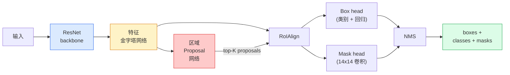

# 实例分割 — Mask R-CNN

> 在 Faster R-CNN 检测器上加一个微小的 mask 分支，就得到了实例分割。难点在于 RoIAlign，而且它比看起来更难。

**类型：** Build + Learn
**语言：** Python
**前置知识：** Phase 4 Lesson 06 (YOLO), Phase 4 Lesson 07 (U-Net)
**时间：** 约 75 分钟

## 学习目标

- 完整追溯 Mask R-CNN 架构：backbone、FPN、RPN、RoIAlign、box head、mask head
- 从零实现 RoIAlign，并解释为何不再使用 RoIPool
- 使用 torchvision 的 `maskrcnn_resnet50_fpn_v2` 预训练模型生成生产级实例 mask，并正确解读其输出格式
- 通过替换 box head 和 mask head 并冻结 backbone，在小规模自定义数据集上微调 Mask R-CNN

## 问题背景

语义分割为每个类别提供一个 mask。实例分割为每个物体提供一个 mask，即使两个物体属于同一类别。计数个体、跨帧追踪以及测量任务（如墙面每块砖的边界框、显微图像中每个细胞）都依赖实例分割。

Mask R-CNN (He et al., 2017) 通过将实例分割重新定义为“检测 + mask”解决了这一问题。该设计如此优雅，以至于接下来五年里几乎所有的实例分割论文都是 Mask R-CNN 的变体，而 torchvision 的实现至今仍是中小规模数据集的生产默认方案。

棘手的工程问题在于采样：如何从一个角点不与像素边界对齐的 proposal box 中裁剪出固定大小的特征区域？处理不当会在全局损失小数个 mAP 点。RoIAlign 便是答案。

## 核心概念

### 架构



需要理解五个部分：

1. **Backbone** —— 在 ImageNet 上训练的 ResNet-50 或 ResNet-101。输出 stride 为 4、8、16、32 的分层特征图。
2. **FPN（Feature Pyramid Network）** —— 通过自顶向下路径与侧向连接，使每个层级都获得包含 C 个通道的语义丰富特征。检测模块会根据目标大小查询对应的 FPN 层级。
3. **RPN（Region Proposal Network）** —— 一个轻量卷积头，在每个 anchor 位置预测“这里是否有物体？”以及“如何优化边界框？”。每张图像约输出 1000 个 proposals。
4. **RoIAlign** —— 从任意 FPN 层级的任意 box 中采样固定大小（如 7x7）的特征块。采用双线性插值采样，无量化。
5. **Heads** —— 包含两层结构的 box head 用于优化边界框并预测类别，以及一个小型卷积 mask head 为每个 proposal 输出 `28x28` 的二进制 mask。

### 为何是 RoIAlign 而非 RoIPool

原始 Fast R-CNN 使用 RoIPool，它将 proposal box 划分为网格，在每个单元格内取最大特征值，并将所有坐标四舍五入为整数。这种四舍五入会导致特征图与输入像素坐标之间产生最多一个特征图像素的对齐偏差——在 224x224 图像上影响尚可，但若特征图 stride 为 32，则后果严重。

```
RoIPool:
  box (34.7, 51.3, 98.2, 142.9)
  四舍五入 -> (34, 51, 98, 142)
  划分网格 -> 对每个单元格边界取整
  每步累积对齐偏差

RoIAlign:
  box (34.7, 51.3, 98.2, 142.9)
  使用双线性插值在精确浮点坐标处采样
  全程无取整操作
```

RoIAlign 几乎免费地为 COCO 上的 mask AP 带来 3-4 个点的提升。如今所有关注定位精度的检测器都采用它——包括 YOLOv7 seg、RT-DETR、Mask2Former 等。

### RPN 简述

在特征图的每个位置放置 K 个不同尺寸和长宽比的 anchor box。为每个 anchor 预测一个物体置信度分数，以及一个回归偏移量以将其优化为更贴合的边界框。按分数保留 top ~1000 个 box，在 IoU=0.7 处执行 NMS，将幸存者交给后续 head。RPN 使用独立的 mini-loss 进行训练——结构与 Lesson 6 中的 YOLO loss 相同，只是仅区分两类（物体/背景）。

### Mask head

对于每个 proposal（经 RoIAlign 处理后），mask head 是一个轻量 FCN：四个 3x3 卷积、一个 2x 反卷积，以及一个输出 `num_classes` 个通道、分辨率为 `28x28` 的最终 1x1 卷积。仅保留与预测类别对应的通道，其余丢弃。这实现了 mask 预测与分类的解耦。

将 28x28 的 mask 上采样至 proposal 的原始像素尺寸，即可得到最终的二进制 mask。

### 损失函数

Mask R-CNN 的损失由以下几项相加而成：

```
L = L_rpn_cls + L_rpn_box + L_box_cls + L_box_reg + L_mask
```

- `L_rpn_cls`、`L_rpn_box` —— 针对 RPN proposals 的物体置信度与边界框回归损失。
- `L_box_cls` —— head 分类器在 (C+1) 个类别（含背景）上的交叉熵损失。
- `L_box_reg` —— head 边界框回归的 smooth L1 损失。
- `L_mask` —— 28x28 mask 输出的逐像素二元交叉熵损失。

每项损失均有各自的默认权重；torchvision 实现将其作为构造函数参数暴露。

### 输出格式

``torchvision.models.detection.maskrcnn_resnet50_fpn_v2`` 返回一个字典列表，每张图像对应一个：

```
{
    "boxes":  (N, 4) 以 (x1, y1, x2, y2) 像素坐标表示的边界框,
    "labels": (N,) 类别 ID，0 表示背景，因此索引从 1 开始,
    "scores": (N,) 置信度分数,
    "masks":  (N, 1, H, W) 取值范围 [0, 1] 的浮点 mask——阈值设为 0.5 即可转为二值 mask,
}
```

该 mask 已经是全图像分辨率。28x28 的 head 输出已在内部完成上采样。

```figure
cv3-roialign-sampling
```

## 动手实现

### 步骤 1：从零实现 RoIAlign

这是 Mask R-CNN 中比用文字描述更易于通过代码理解的组件。

```python
import torch
import torch.nn.functional as F

def roi_align_single(feature, box, output_size=7, spatial_scale=1 / 16.0):
    """
    feature: (C, H, W) 单张图像的特征图
    box: (x1, y1, x2, y2) 原始图像像素坐标
    output_size: 输出网格的边长（box head 用 7，mask head 用 14）
    spatial_scale: 特征图步长的倒数
    """
    C, H, W = feature.shape
    x1, y1, x2, y2 = [c * spatial_scale - 0.5 for c in box]
    bin_w = (x2 - x1) / output_size
    bin_h = (y2 - y1) / output_size

    grid_y = torch.linspace(y1 + bin_h / 2, y2 - bin_h / 2, output_size)
    grid_x = torch.linspace(x1 + bin_w / 2, x2 - bin_w / 2, output_size)
    yy, xx = torch.meshgrid(grid_y, grid_x, indexing="ij")

    gx = 2 * (xx + 0.5) / W - 1
    gy = 2 * (yy + 0.5) / H - 1
    grid = torch.stack([gx, gy], dim=-1).unsqueeze(0)
    sampled = F.grid_sample(feature.unsqueeze(0), grid, mode="bilinear",
                            align_corners=False)
    return sampled.squeeze(0)
```

每个采样点都位于双线性插值计算出的精确位置上。无取整，无量化，梯度无损。

### 步骤 2：与 torchvision 的 RoIAlign 对比

```python
from torchvision.ops import roi_align

feature = torch.randn(1, 16, 50, 50)
boxes = torch.tensor([[0, 10, 20, 100, 90]], dtype=torch.float32)  # (batch_idx, x1, y1, x2, y2)

ours = roi_align_single(feature[0], boxes[0, 1:].tolist(), output_size=7, spatial_scale=1/4)
theirs = roi_align(feature, boxes, output_size=(7, 7), spatial_scale=1/4, sampling_ratio=1, aligned=True)[0]

print(f"ours shape:   {tuple(ours.shape)}")
print(f"theirs shape: {tuple(theirs.shape)}")
print(f"max|diff|:    {(ours - theirs).abs().max().item():.3e}")
```

当 `sampling_ratio=1` 且 `aligned=True` 时，两者差异可控制在 `1e-5` 以内。

### 步骤 3：加载预训练 Mask R-CNN

```python
import torch
from torchvision.models.detection import maskrcnn_resnet50_fpn_v2, MaskRCNN_ResNet50_FPN_V2_Weights

model = maskrcnn_resnet50_fpn_v2(weights=MaskRCNN_ResNet50_FPN_V2_Weights.DEFAULT)
model.eval()
print(f"参数量: {sum(p.numel() for p in model.parameters()):,}")
print(f"类别数（含背景）: {len(model.roi_heads.box_predictor.cls_score.out_features * [0])}")
```

共 46M 参数，91 个类别（COCO 数据集）。第一个类别（id 0）为背景；模型实际检测的所有物体均从 id 1 开始。

### 步骤 4：运行推理

```python
with torch.no_grad():
    x = torch.randn(3, 400, 600)
    predictions = model([x])
p = predictions[0]
print(f"boxes:  {tuple(p['boxes'].shape)}")
print(f"labels: {tuple(p['labels'].shape)}")
print(f"scores: {tuple(p['scores'].shape)}")
print(f"masks:  {tuple(p['masks'].shape)}")
```

mask 张量的形状为 `(N, 1, H, W)`。阈值设为 0.5 即可为每个物体得到二值 mask：

```python
binary_masks = (p['masks'] > 0.5).squeeze(1)  # (N, H, W) 布尔型
```

### 步骤 5：替换 head 以适配自定义类别数

常见的微调方案：复用 backbone、FPN 和 RPN；替换两个分类 head。

```python
from torchvision.models.detection.faster_rcnn import FastRCNNPredictor
from torchvision.models.detection.mask_rcnn import MaskRCNNPredictor

def build_custom_maskrcnn(num_classes):
    model = maskrcnn_resnet50_fpn_v2(weights=MaskRCNN_ResNet50_FPN_V2_Weights.DEFAULT)
    in_features = model.roi_heads.box_predictor.cls_score.in_features
    model.roi_heads.box_predictor = FastRCNNPredictor(in_features, num_classes)
    in_features_mask = model.roi_heads.mask_predictor.conv5_mask.in_channels
    hidden_layer = 256
    model.roi_heads.mask_predictor = MaskRCNNPredictor(in_features_mask, hidden_layer, num_classes)
    return model

custom = build_custom_maskrcnn(num_classes=5)
print(f"自定义 cls_score.out_features: {custom.roi_heads.box_predictor.cls_score.out_features}")
```

``num_classes` 必须包含背景类，因此若数据集有 4 个物体类别，则使用 `num_classes=5`。

### 步骤 6：冻结无需训练的参数

在小型数据集上，冻结 backbone 和 FPN。仅训练 RPN 的物体置信度+回归以及两个 head。

```python
def freeze_backbone_and_fpn(model):
    # torchvision 的 Mask R-CNN 将 FPN 打包在 `model.backbone` 内部（即
    # `model.backbone.fpn`），因此遍历 `model.backbone.parameters()` 可同时覆盖
    # ResNet 特征层与 FPN 的侧向/输出卷积。
    for p in model.backbone.parameters():
        p.requires_grad = False
    return model

custom = freeze_backbone_and_fpn(custom)
trainable = sum(p.numel() for p in custom.parameters() if p.requires_grad)
print(f"冻结后可训练参数: {trainable:,}")
```

在 500 张图像的数据集上，这决定了模型是正常收敛还是过拟合。

## 投入使用

torchvision 中 Mask R-CNN 的完整训练循环仅需 40 行，且在不同任务间基本无需修改——更换数据集即可运行。

```python
def train_step(model, images, targets, optimizer):
    model.train()
    loss_dict = model(images, targets)
    losses = sum(loss for loss in loss_dict.values())
    optimizer.zero_grad()
    losses.backward()
    optimizer.step()
    return {k: v.item() for k, v in loss_dict.items()}
```

``targets`` 列表必须包含每张图像的字典，其中含有 `boxes`、`labels` 和 `masks`（形状为 `(num_instances, H, W)` 的二值张量）。模型在训练时返回包含各项损失的字典，在评估时返回预测列表，具体由 `model.training` 决定。

``pycocotools`` 评估器可同时计算 box 和 mask 的 mAP@IoU=0.5:0.95；你需要同时查看这两个指标，才能判断瓶颈究竟在 box head 还是 mask head。

## 交付成果

完成本课你将产出：

- `outputs/prompt-instance-vs-semantic-router.md` —— 一个包含三个问题的 prompt，用于判断应使用实例分割、语义分割还是全景分割，并推荐起始模型。
- `outputs/skill-mask-rcnn-head-swapper.md` —— 一项技能，根据新的 `num_classes` 自动生成在任何 torchvision 检测模型上替换 head 的 10 行代码。

## 练习

1. **(简单)** 使用 100 个随机 box 将你的 RoIAlign 与 `torchvision.ops.roi_align` 进行对比验证。报告最大绝对误差。同时运行 RoIPool（2017 年以前的行为），展示其在边界附近的 box 上会产生约 1-2 个特征图像素的偏差。
2. **(中等)** 在 50 张图像的自定义数据集（任意两个类别：气球、鱼、坑洼、Logo
