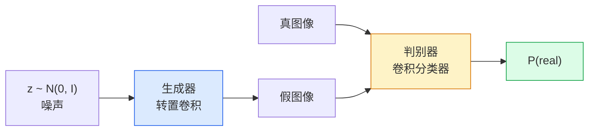
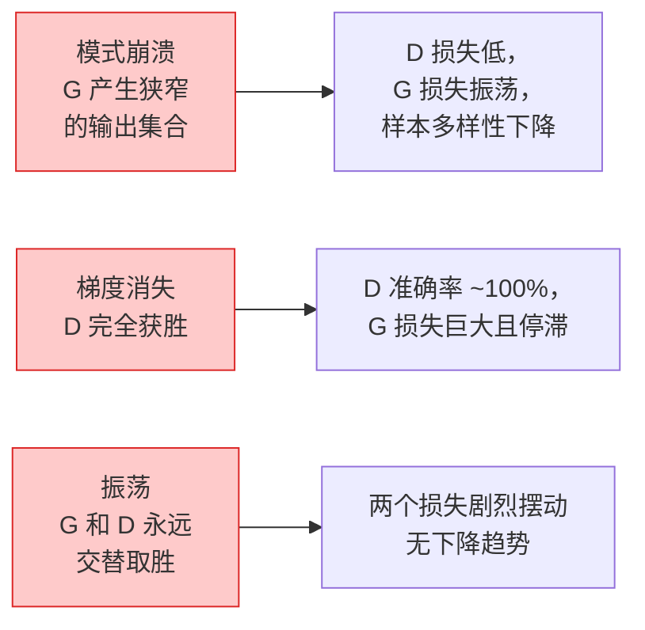

# 图像生成 — GAN

> GAN 是一个固定博弈中的两个神经网络。一个负责绘制，一个负责批评。它们共同成长，直到画作骗过评论者。

**类型:** 构建
**语言:** Python
**前置知识:** Phase 4 课程 03（CNN），Phase 3 课程 06（优化器），Phase 3 课程 07（正则化）
**时间:** ~75 分钟

## 学习目标

- 解释生成器与判别器之间的极小极大博弈，以及为何均衡点对应 p_model = p_data
- 使用 PyTorch 实现 DCGAN，用不足 60 行代码生成清晰的 32x32 合成图像
- 通过三种标准技巧稳定 GAN 训练：非饱和损失、谱归一化、TTUR（双时标更新规则）
- 解读训练曲线，区分健康收敛、模式崩溃、振荡和判别器完全获胜

## 问题所在

分类任务教会网络将图像映射到标签。生成任务则反转了这个问题：采样生成看起来来自同一分布的新图像。没有可以逐像素对比的"正确答案"；只有一个你想要模仿的分布。

标准损失函数（MSE、交叉熵）无法衡量"这个样本是否来自真实分布"。最小化逐像素误差会产生模糊的平均结果，而非逼真的样本。突破在于学习损失本身：训练一个负责区分真假的第二网络，并用它的判断来推动生成器。

GAN（Goodfellow 等，2014）定义了该框架。到 2018 年 StyleGAN 已经能生成与照片难以区分的 1024x1024 人脸。扩散模型随后在质量和可控性上接管了王座，但让扩散模型落地的每一个技巧——归一化选择、隐空间、特征损失——都首先在 GAN 上被理解。

## 概念

### 两个网络



**生成器** G 接收一个噪声向量 `z` 并输出图像。**判别器** D 接收图像并输出单个标量：图像为真的概率。

### 博弈

G 希望 D 出错，D 希望正确。形式化描述如下：

```
min_G max_D  E_x[log D(x)] + E_z[log(1 - D(G(z)))]
```

从左向右读：D 在最大化真实图像（`log D(real)`）和伪造图像（`log (1 - D(fake))`）上的准确率。G 在最小化 D 对伪造图像的准确率——它希望 `D(G(z))` 尽可能大。

Goodfellow 证明了该极小极大博弈存在全局均衡点，此时 `p_G = p_data`，D 在所有位置输出 0.5，且生成分布与真实分布之间的 Jensen-Shannon 散度为零。难点在于如何到达那里。

### 非饱和损失

上述形式在数值上不稳定。训练初期，对于所有假样本 `D(G(z))` 都接近零，因此 `log(1 - D(G(z)))` 对 G 的梯度趋于消失。解决方法：翻转 G 的损失。

```
L_D = -E_x[log D(x)] - E_z[log(1 - D(G(z)))]
L_G = -E_z[log D(G(z))]                          # 非饱和损失
```

现在当 `D(G(z))` 接近零时，G 的损失很大且梯度具有信息量。所有现代 GAN 都使用该变体训练。

### DCGAN 架构规则

Radford、Metz、Chintala（2015）从多年失败的实验中提炼出五条规则，使 GAN 训练变得稳定：

1. 用步幅卷积替换池化操作（两个网络都适用）。
2. 在生成器和判别器中都使用批量归一化，但 G 的输出层和 D 的输入层除外。
3. 在更深层次的网络上移除全连接层。
4. G 使用 ReLU 激活所有层，输出层除外（输出使用 tanh，值域在 [-1, 1]）。
5. D 在所有层使用 LeakyReLU（negative_slope=0.2）。

所有现代基于卷积的 GAN（StyleGAN、BigGAN、GigaGAN）仍以这些规则为起点，一次替换一处组件。

### 故障模式及其特征



- **模式崩溃**：G 找到一个能骗过 D 的图像，只重复生产它。修复方法：添加 minibatch discrimination、谱归一化或标签条件化。
- **判别器获胜**：D 增长过快，G 的梯度消失。修复方法：减小 D 的规模、降低 D 的学习率，或在实际标签上应用标签平滑。
- **振荡**：两个网络交替取胜，从未接近均衡点。修复方法：使用 TTUR（D 的学习速度比 G 快 2-4 倍），或切换到 Wasserstein 损失。

### 评估

GAN 没有 ground truth，你怎么知道它是否在工作？

- **样本检查** — 每个 epoch 结束时查看 64 个样本。这是必须做的。
- **FID（Fréchet Inception Distance）** — 真实图像集与生成图像集的 Inception-v3 特征分布之间的距离。越低越好。社区标准。
- **Inception Score** — 较旧且更脆弱的方法；优先使用 FID。
- **生成模型精确率/召回率** — 分别衡量质量（精确率）和覆盖度（召回率）。比单独使用 FID 更有信息量。

对于小规模合成数据实验，样本检查就足够了。

```figure
cv-gan-image
```

## 构建

### 步骤 1：生成器

一个小型 DCGAN 生成器，接收 64 维噪声并输出 32x32 图像。

```python
import torch
import torch.nn as nn

class Generator(nn.Module):
    def __init__(self, z_dim=64, img_channels=3, feat=64):
        super().__init__()
        self.net = nn.Sequential(
            nn.ConvTranspose2d(z_dim, feat * 4, kernel_size=4, stride=1, padding=0, bias=False),
            nn.BatchNorm2d(feat * 4),
            nn.ReLU(inplace=True),
            nn.ConvTranspose2d(feat * 4, feat * 2, kernel_size=4, stride=2, padding=1, bias=False),
            nn.BatchNorm2d(feat * 2),
            nn.ReLU(inplace=True),
            nn.ConvTranspose2d(feat * 2, feat, kernel_size=4, stride=2, padding=1, bias=False),
            nn.BatchNorm2d(feat),
            nn.ReLU(inplace=True),
            nn.ConvTranspose2d(feat, img_channels, kernel_size=4, stride=2, padding=1, bias=False),
            nn.Tanh(),
        )

    def forward(self, z):
        return self.net(z.view(z.size(0), -1, 1, 1))
```

四个转置卷积，每个都使用 `kernel_size=4, stride=2, padding=1`，能干净地将空间尺寸翻倍。通过 tanh 将输出激活值限制在 [-1, 1]。

### 步骤 2：判别器

生成器的镜像。使用 LeakyReLU、步幅卷积，最终以单个标量 logit 输出。

```python
class Discriminator(nn.Module):
    def __init__(self, img_channels=3, feat=64):
        super().__init__()
        self.net = nn.Sequential(
            nn.Conv2d(img_channels, feat, kernel_size=4, stride=2, padding=1),
            nn.LeakyReLU(0.2, inplace=True),
            nn.Conv2d(feat, feat * 2, kernel_size=4, stride=2, padding=1, bias=False),
            nn.BatchNorm2d(feat * 2),
            nn.LeakyReLU(0.2, inplace=True),
            nn.Conv2d(feat * 2, feat * 4, kernel_size=4, stride=2, padding=1, bias=False),
            nn.BatchNorm2d(feat * 4),
            nn.LeakyReLU(0.2, inplace=True),
            nn.Conv2d(feat * 4, 1, kernel_size=4, stride=1, padding=0),
        )

    def forward(self, x):
        return self.net(x).view(-1)
```

最后一个卷积将 `4x4` 特征图降为 `1x1`。每个图像输出单个标量；在计算损失时仅应用 sigmoid。

### 步骤 3：训练步骤

交替执行：每个批次先更新 D 一次，再更新 G 一次。

```python
import torch.nn.functional as F

def train_step(G, D, real, z, opt_g, opt_d, device):
    real = real.to(device)
    bs = real.size(0)

    # D 步骤
    opt_d.zero_grad()
    d_real = D(real)
    d_fake = D(G(z).detach())
    loss_d = (F.binary_cross_entropy_with_logits(d_real, torch.ones_like(d_real))
              + F.binary_cross_entropy_with_logits(d_fake, torch.zeros_like(d_fake)))
    loss_d.backward()
    opt_d.step()

    # G 步骤
    opt_g.zero_grad()
    d_fake = D(G(z))
    loss_g = F.binary_cross_entropy_with_logits(d_fake, torch.ones_like(d_fake))
    loss_g.backward()
    opt_g.step()

    return loss_d.item(), loss_g.item()
```

D 步骤中的 `G(z).detach()` 至关重要：我们不想在更新 G 时让梯度流回 G。忘记这一点是初学者的经典错误。

### 步骤 4：在合成形状上的完整训练循环

```python
from torch.utils.data import DataLoader, TensorDataset
import numpy as np

def synthetic_images(num=2000, size=32, seed=0):
    rng = np.random.default_rng(seed)
    imgs = np.zeros((num, 3, size, size), dtype=np.float32) - 1.0
    for i in range(num):
        r = rng.uniform(6, 12)
        cx, cy = rng.uniform(r, size - r, size=2)
        yy, xx = np.meshgrid(np.arange(size), np.arange(size), indexing="ij")
        mask = (xx - cx) ** 2 + (yy - cy) ** 2 < r ** 2
        color = rng.uniform(-0.5, 1.0, size=3)
        for c in range(3):
            imgs[i, c][mask] = color[c]
    return torch.from_numpy(imgs)

device = "cuda" if torch.cuda.is_available() else "cpu"
data = synthetic_images()
loader = DataLoader(TensorDataset(data), batch_size=64, shuffle=True)

G = Generator(z_dim=64, img_channels=3, feat=32).to(device)
D = Discriminator(img_channels=3, feat=32).to(device)
opt_g = torch.optim.Adam(G.parameters(), lr=2e-4, betas=(0.5, 0.999))
opt_d = torch.optim.Adam(D.parameters(), lr=2e-4, betas=(0.5, 0.999))

for epoch in range(10):
    for (batch,) in loader:
        z = torch.randn(batch.size(0), 64, device=device)
        ld, lg = train_step(G, D, batch, z, opt_g, opt_d, device)
    print(f"epoch {epoch}  D {ld:.3f}  G {lg:.3f}")
```

`Adam(lr=2e-4, betas=(0.5, 0.999))` 是 DCGAN 的默认配置——较低的 beta1 防止动量项在对抗博弈中过度稳定。

### 步骤 5：采样

```python
@torch.no_grad()
def sample(G, n=16, z_dim=64, device="cpu"):
    G.eval()
    z = torch.randn(n, z_dim, device=device)
    imgs = G(z)
    imgs = (imgs + 1) / 2
    return imgs.clamp(0, 1)
```

采样前务必切换到 eval 模式。对于 DCGAN 而言这很关键，因为批量归一化会使用运行统计量而非当前批次的统计量。

### 步骤 6：谱归一化

作为判别器中 BN 的即插即用替换方案，保证网络是 1-Lipschitz 连续的。可修复大多数"D 赢太多"的失败。

```python
from torch.nn.utils import spectral_norm

def build_sn_discriminator(img_channels=3, feat=64):
    return nn.Sequential(
        spectral_norm(nn.Conv2d(img_channels, feat, 4, 2, 1)),
        nn.LeakyReLU(0.2, inplace=True),
        spectral_norm(nn.Conv2d(feat, feat * 2, 4, 2, 1)),
        nn.LeakyReLU(0.2, inplace=True),
        spectral_norm(nn.Conv2d(feat * 2, feat * 4, 4, 2, 1)),
        nn.LeakyReLU(0.2, inplace=True),
        spectral_norm(nn.Conv2d(feat * 4, 1, 4, 1, 0)),
    )
```

将 `Discriminator` 替换为 `build_sn_discriminator()`，通常就不需要 TTUR 技巧了。谱归一化是你能够应用的最简单的单一稳健性提升。

## 使用

对于严肃的生成任务，使用预训练权重或切换到扩散模型。两个常用库：

- `torch_fidelity`：无需编写自定义评估代码即可计算生成器的 FID / IS。
- `pytorch-gan-zoo`（已弃用）和 `StudioGAN`：提供经过测试的 DCGAN、WGAN-GP、SN-GAN、StyleGAN 和 BigGAN 实现。

2026 年，GAN 仍然是以下场景的最佳选择：实时图像生成（延迟 <10 ms）、风格迁移、需要精确控制的一对一图像转换（Pix2Pix、CycleGAN）。扩散模型在照片级真实感和文本条件控制方面胜出。

## 交付成果

本课产出：

- `outputs/prompt-gan-training-triage.md` — 一个提示词，用于读取训练曲线描述并识别故障模式（模式崩溃、D 获胜、振荡）以及单一推荐修复方法。
- `outputs/skill-dcgan-scaffold.md` — 一个技能，根据 `z_dim`、目标 `image_size` 和 `num_channels` 生成 DCGAN 脚手架代码，包含训练循环和样本保存功能。

## 练习

1. **(简单)** 在合成圆形数据集上训练上面的 DCGAN，并在每个 epoch 结束时保存 16 个样本的网格图。在第几个 epoch 生成的圆形变得明显是圆的？
2. **(中等)** 将判别器的批量归一化替换为谱归一化。并排训练两个版本。哪一个收敛更快？哪一个个版本在三组随机种子下方差更低？
3. **(困难)** 实现条件 DCGAN：将类别标签同时输入 G 和 D（在 G 中将 one-hot 编码拼接到噪声向量，在 D 中拼接一个类别嵌入通道）。在课程 7 的"圆形 vs 方形"合成数据集上训练，并通过使用特定标签采样来展示条件控制的效果。

## 关键术语

| 术语 | 人们怎么说 | 实际含义 |
|------|-----------|---------|
| Generator（生成器，G） | "画东西的网络" | 将噪声映射到图像；训练目标是欺骗判别器 |
| Discriminator（判别器，D） | "评论者" | 二分类器；训练目标是区分真实图像和生成图像 |
| Minimax（极小极大） | "博弈" | 对对抗损失的 G 取极小、D 取极大；均衡点是 p_G = p_data |
| Non-saturating loss（非饱和损失） | "数值上合理的版本" | G 的损失为 -log(D(G(z))) 而非 log(1 - D(G(z)))，避免训练初期的梯度消失 |
| Mode collapse（模式崩溃） | "生成器只画一种东西" | G 只产生数据分布的一个小子集；通过谱归一化、minibatch discrimination 或更大的批次修复 |
| TTUR（双时标更新规则） | "两个学习率" | D 的学习速度比 G 快，通常快 2-4 倍；稳定训练过程 |
| Spectral norm（谱归一化） | "1-Lipschitz 层" | 一种权重归一化方法，约束每层的 Lipschitz 常数；阻止 D 变得任意陡峭 |
| FID（Fréchet Inception Distance） | "Fréchet Inception 距离" | 真实图像集与生成图像集的 Inception-v3 特征分布之间的距离；标准评估指标 |

## 延伸阅读

- [Generative Adversarial Networks (Goodfellow et al., 2014)](https://arxiv.org/abs/1406.2661) — 开创一切的论文
- [DCGAN (Radford, Metz, Chintala, 2015)](https://arxiv.org/abs/1511.06434) — 使 GAN 变得可训练的架构规则
- [Spectral Normalization for GANs (Miyato et al., 2018)](https://arxiv.org/abs/1802.05957) — 最实用的单一稳定化技巧
- [StyleGAN3 (Karras et al., 2021)](https://arxiv.org/abs/2106.12423) — 当前 SOTA GAN；读起来像过去十年所有技巧的精选合集
