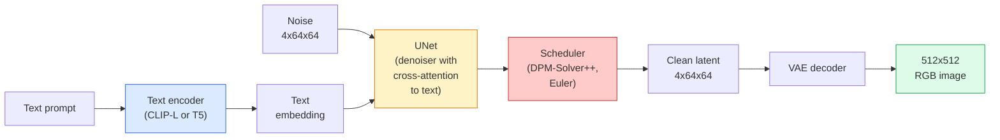

# Stable Diffusion — 架构与微调

> Stable Diffusion 是一种 DDPM，运行于预训练 VAE 的潜空间中，通过交叉注意力机制进行文本条件控制，由快速的确定性 ODE 求解器采样，并借助无分类器引导（CFG）进行调控。

**类型：** 学习 + 使用
**语言：** Python
**前置知识：** 第 4 阶段 第 10 课（扩散模型）、第 7 阶段 第 2 课（自注意力）
**时间：** 约 75 分钟

## 学习目标

- 梳理 Stable Diffusion 管线的五个组成部分：VAE、文本编码器、U-Net、调度器、安全过滤器 —— 以及各自的功能
- 解释潜扩散（latent diffusion）的原理，以及为何在 4x64x64 的潜空间中训练（而非 3x512x512 的像素图像）能将计算量降低 48 倍且不损失质量
- 使用 `diffusers` 进行图像生成、图生图、图像修复和 ControlNet 引导生成
- 在小型自定义数据集上使用 LoRA 微调 Stable Diffusion，并在推理时加载 LoRA 适配器

## 问题背景

直接在 512x512 RGB 图像上训练 DDPM 代价高昂。每个训练步骤都要通过一个接收 3x512x512 = 786,432 个输入值的 U-Net 进行反向传播，而采样过程需要对该 U-Net 执行 50 次以上的前向传递。在 Stable Diffusion 1.5（2022 年发布）的质量水平上，像素空间扩散训练大约需要 256 GPU·月的算力，每张图像在消费级 GPU 上需要 10–30 秒。

使开源权重的文本到图像成为可能的诀窍是**潜扩散**（Rombach 等人，CVPR 2022）。先训练一个 VAE，将 3x512x512 的图像映射到 4x64x64 的潜张量再还原回去，然后在该潜空间中执行扩散。计算量下降了 `(3\*512\*512)/(4\*64\*64) = 48` 倍。在同一块 GPU 上，采样时间从几十秒缩短到不到两秒。

几乎所有现代图像生成模型——SDXL、SD3、FLUX、HunyuanDiT、Wan-Video——都是潜扩散模型，仅在自动编码器、去噪器（U-Net 或 DiT）和文本条件控制方面有所变体。学会 Stable Diffusion，就等于掌握了这一模板。

## 核心概念

### 管线结构



- **VAE** —— 冻结的自动编码器。编码器将图像转换为潜变量（用于图生图和训练），解码器将潜变量还原为图像。
- **文本编码器** —— CLIP 文本编码器（SD 1.x/2.x）、CLIP-L + CLIP-G（SDXL），或 T5-XXL（SD3/FLUX）。输出一系列 token 嵌入向量。
- **U-Net** —— 去噪器。包含交叉注意力层，在每一分辨率层级上从潜变量对文本嵌入进行注意力计算。
- **调度器** —— 采样算法（DDIM、Euler、DPM-Solver++）。选择 sigmas，将预测噪声混合回潜变量。
- **安全过滤器** —— 可选的 NSFW / 非法内容输出过滤器。

### 无分类器引导（CFG）

普通的文本条件学习 `epsilon_theta(x_t, t, c)`，对每个提示 `c` 训练一个网络。CFG 在训练中随机以 10% 的概率丢弃 `c`（替换为空嵌入），使得同一个模型能同时预测条件噪声和无条件噪声。推理时：

```
eps = eps_uncond + w * (eps_cond - eps_uncond)
```

`w` 为引导尺度。`w=0` 是无条件，`w=1` 是纯条件，`w>1` 会推动输出"更贴合提示"，代价是多样性降低。SD 的默认值为 `w=7.5`。

CFG 是文本到图像能达到生产级质量的原因。没有它，提示对输出的引导作用较弱；有了它，提示占据主导地位。

### 潜空间几何

VAE 的 4 通道潜空间不只是一张压缩图像。它是一个流形，其中的算术运算大致对应语义编辑（提示工程和插值都发生在这里），扩散 U-Net 的全部建模能力也都训练在这个空间上。对一个随机的 4x64x64 潜张量进行解码并不会产生随机外观的图像——而是产生垃圾，因为只有潜空间中特定的子流形才能解码为有效的图像。

两个直接后果：

1. **图生图（Img2img）** = 将图像编码为潜变量，添加部分噪声，运行去噪器，再解码。图像结构得以保留，因为编码近乎可逆；内容由提示决定。
2. **图像修复（Inpainting）** = 与图生图相同，但去噪器仅更新被掩码的区域，未被掩码的区域保留原始编码潜变量。

### U-Net 架构

SD 的 U-Net 是在第 10 课 TinyUNet 基础上的放大版本，增加了三个部分：

- 在每个空间分辨率上都配有**Transformer 模块**，包含自注意力 + 对文本嵌入的交叉注意力。
- 通过正弦编码 MLP 的**时间嵌入**。
- 编码器与解码器在匹配分辨率之间的**跳跃连接**。

SD 1.5 总参数量约 8.6 亿。SDXL 约 26 亿。FLUX 约 120 亿。参数增长的主体在注意力层。

### LoRA 微调

完整微调 Stable Diffusion 需要 20+ GB 显存，并更新 8.6 亿个参数。LoRA（低秩自适应）保持基座模型冻结，仅在注意力层中注入小型低秩分解矩阵。一个 SD 的 LoRA 适配器通常只有 10–50 MB，在单张消费级 GPU 上 10–60 分钟即可训练完成，推理时作为即插即用的修改加载。

```
Original: W_q : (d_in, d_out)   冻结
LoRA:     W_q + alpha * (A @ B)  其中 A : (d_in, r), B : (r, d_out)

r 通常取 4-32。
```

LoRA 是社区微调几乎全部的发布形式。CivitAI 和 Hugging Face 上托管着数百万个。

### 常见的调度器

- **DDIM** —— 确定性，约 50 步，简单。
- **Euler 祖先采样** —— 随机性，30–50 步，样本更具创造性。
- **DPM-Solver++ 2M Karras** —— 确定性，20–30 步，生产环境默认。
- **LCM / TCD / Turbo** —— 一致性模型及蒸馏变体，1–4 步，以一定质量为代价。

在 `diffusers` 中更换调度器只需一行代码，有时无需重新训练就能修复采样问题。

```figure
cv3-latent-compression
```

## 动手实现

本课直接使用 `diffusers` 端到端操作，而非从零重建 Stable Diffusion。需要重建的各个组件（VAE、文本编码器、U-Net、调度器）各自是独立的课程主题；本课的目标是掌握生产级 API 的熟练运用。

### 步骤 1：文生图

```python
import torch
from diffusers import StableDiffusionPipeline

pipe = StableDiffusionPipeline.from_pretrained(
    "runwayml/stable-diffusion-v1-5",
    torch_dtype=torch.float16,
).to("cuda")

image = pipe(
    prompt="a dog riding a skateboard in tokyo, studio ghibli style",
    guidance_scale=7.5,
    num_inference_steps=25,
    generator=torch.Generator("cuda").manual_seed(42),
).images[0]
image.save("dog.png")
```

`float16` 将显存占用减半且无明显质量损失。默认 DPM-Solver++ 下 `num_inference_steps=25` 的效果与 DDIM 下的 50 步相当。

### 步骤 2：更换调度器

```python
from diffusers import DPMSolverMultistepScheduler, EulerAncestralDiscreteScheduler

pipe.scheduler = DPMSolverMultistepScheduler.from_config(pipe.scheduler.config)
pipe.scheduler = EulerAncestralDiscreteScheduler.from_config(pipe.scheduler.config)
```

调度器状态与 U-Net 权重解耦。你可以在 DDPM 上训练，用任意调度器采样。

### 步骤 3：图生图

```python
from diffusers import StableDiffusionImg2ImgPipeline
from PIL import Image

img2img = StableDiffusionImg2ImgPipeline.from_pretrained(
    "runwayml/stable-diffusion-v1-5",
    torch_dtype=torch.float16,
).to("cuda")

init_image = Image.open("dog.png").convert("RGB").resize((512, 512))
out = img2img(
    prompt="a dog riding a skateboard, oil painting",
    image=init_image,
    strength=0.6,
    guidance_scale=7.5,
).images[0]
```

`strength` 控制去噪前添加的噪声量（0.0 = 不变，1.0 = 完全重生成）。0.5–0.7 是风格迁移的标准范围。

### 步骤 4：图像修复

```python
from diffusers import StableDiffusionInpaintPipeline

inpaint = StableDiffusionInpaintPipeline.from_pretrained(
    "runwayml/stable-diffusion-inpainting",
    torch_dtype=torch.float16,
).to("cuda")

image = Image.open("dog.png").convert("RGB").resize((512, 512))
mask = Image.open("dog_mask.png").convert("L").resize((512, 512))

out = inpaint(
    prompt="a cat",
    image=image,
    mask_image=mask,
    guidance_scale=7.5,
).images[0]
```

掩码中的白色像素是要重生成的区域。黑色像素会被保留。

### 步骤 5：加载 LoRA

```python
pipe.load_lora_weights("sayakpaul/sd-lora-ghibli")
pipe.fuse_lora(lora_scale=0.8)

image = pipe(prompt="a village square in ghibli style").images[0]
```

`lora_scale` 控制强度；0.0 表示无效果，1.0 表示完全生效。`fuse_lora` 将适配器烘焙进权重以换取速度，但会导致无法切换。在加载不同适配器前请调用 `pipe.unfuse_lora()`。

### 步骤 6：LoRA 训练（概述）

实际的 LoRA 训练在 `peft` 或 `diffusers.training` 中实现。核心流程如下：

```python
# 伪代码
for step, batch in enumerate(dataloader):
    images, prompts = batch
    latents = vae.encode(images).latent_dist.sample() * 0.18215

    t = torch.randint(0, num_train_timesteps, (batch_size,))
    noise = torch.randn_like(latents)
    noisy_latents = scheduler.add_noise(latents, noise, t)

    text_emb = text_encoder(tokenizer(prompts))

    pred_noise = unet(noisy_latents, t, text_emb)  # LoRA 权重在此注入

    loss = F.mse_loss(pred_noise, noise)
    loss.backward()
    optimizer.step()
```

仅有 LoRA 矩阵接收梯度；基座 U-Net、VAE 和文本编码器均冻结。批次大小设为 1 并开启梯度检查点时，8 GB 显存即可运行。

## 生产应用

在生产环境中，你实际需要做的决策：

- **模型家族**：SD 1.5 适合开源社区微调生态，SDXL 适合更高质量需求，SD3 / FLUX 适合前沿效果和严格许可证要求的场景。
- **调度器**：DPM-Solver++ 2M Karras 用于 20–30 步的高质量场景；LCM-LoRA 用于延迟低于 1 秒的实时场景。
- **精度**：4080/4090 用 `float16`，A100 及更新型号用 `bfloat16`，显存紧张时用 `int8`（通过 `bitsandbytes` 或 `compel`）。
- **条件控制**：纯文本即可；需要更强控制时，在基座管线之上叠加 ControlNet（canny、depth、pose、segmentation）。

批量生成推荐使用 `AUTO1111` / `ComfyUI` 等社区工具；生产 API 推荐使用 `diffusers` + `accelerate` 或配合 TensorRT 编译的 `optimum-nvidia`。

## 任务产出

本课完成后你将产出：

- `outputs/prompt-sd-pipeline-planner.md` —— 一条提示词，根据延迟预算、质量目标和许可证约束，选择 SD 1.5 / SDXL / SD3 / FLUX 及对应的调度器和精度。
- `outputs/skill-lora-training-setup.md` —— 一项技能，可为自定义数据集写出完整的 LoRA 训练配置，包括标注、秩（rank）、批次大小和学习率。

## 练习

1. **（简单）** 用 `guidance_scale` 在 `[1, 3, 5, 7.5, 10, 15]` 中取值生成同一提示，描述图像变化。在什么引导值下开始出现瑕疵？
2. **（中等）** 取一张真实照片，用 `StableDiffusionImg2ImgPipeline` 在 `strength` 为 `[0.2, 0.4, 0.6, 0.8, 1.0]` 下各生成一次。哪个强度能在改变风格的同时保留构图？为什么 1.0 会完全忽略输入图像？
3. **（困难）** 在 10–20 张同一主体（宠物、Logo、角色）的图像上训练一个 LoRA，并用该主体生成全新场景。报告能最好地保留身份特征且不过拟合到输入图像的 LoRA 秩和训练步数。

## 关键术语

| 术语 | 人们怎么说 | 实际含义 |
|------|-----------|---------|
| 潜扩散（Latent diffusion） | "在潜空间里扩散" | 整个 DDPM 在 VAE 潜空间（4x64x64）而非像素空间（3x512x512）中运行，计算量节省 48 倍 |
| VAE 缩放因子 | "0.18215" | 将 VAE 原始潜变量缩放至近似单位方差的常数，所有 SD 管线中硬编码 |
| 无分类器引导（Classifier-free guidance） | "CFG" | 混合条件与无条件噪声预测，是最具影响力的推理调节参数 |
| 调度器（Scheduler） | "采样器" | 将噪声与模型预测转化为去噪潜变量轨迹的算法 |
| LoRA | "低秩适配器" | 小型低秩分解矩阵，微调注意力层而不触碰基座权重 |
| 交叉注意力（Cross-attention） | "图文注意力" | 从潜变量 token 到文本 token 的注意力，在每个 U-Net 层级注入提示信息 |
| ControlNet | "结构条件控制" | 一个独立训练的适配器，通过额外输入（canny、depth、pose、分割图）引导 SD |
| DPM-Solver++ | "默认调度器" | 二阶确定性 ODE 求解器；2026 年在低步数（20–30）下提供最佳质量 |

## 延伸阅读

- [High-Resolution Image Synthesis with Latent Diffusion (Rombach et al., 2022)](https://arxiv.org/abs/2112.10752) —— Stable Diffusion 论文；包含所有论证设计合理性的消融实验
- [Classifier-Free Diffusion Guidance (Ho & Salimans, 2022)](https://arxiv.org/abs/2207.12598) —— CFG 论文
- [LoRA: Low-Rank Adaptation of Large Language Models (Hu et al., 2021)](https://arxiv.org/abs/2106.09685) —— LoRA 最初面向 NLP；引入 SD 时几乎无需改动
- [diffusers documentation](https://huggingface.co/docs/diffusers) —— 所有 SD / SDXL / SD3 / FLUX 管线的官方参考文档
