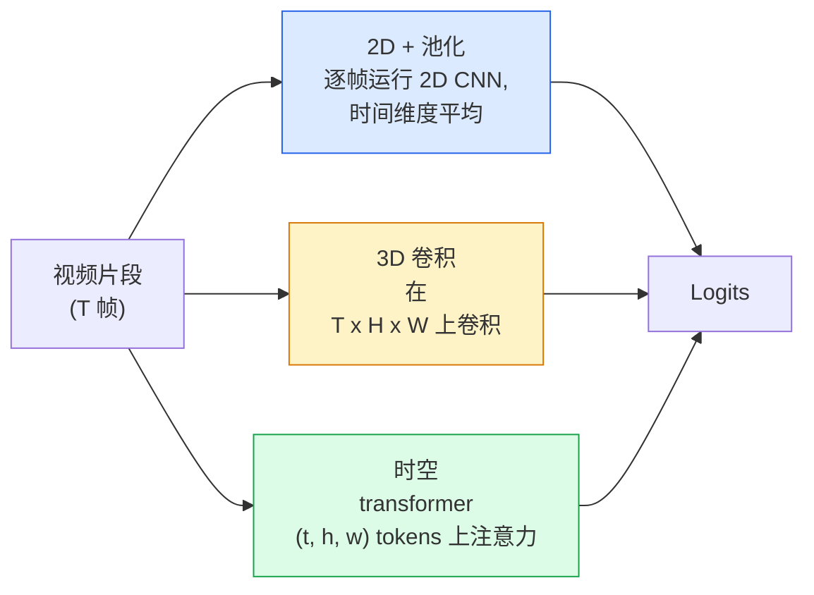

# Video Understanding — Temporal Modeling

> 视频是图像序列加上连接它们的物理规律。每种视频模型要么把时间当作额外轴（3D 卷积），要么当作可关注的序列（transformer），要么视为提取一次并池化的特征（2D+池化）。

**类型：** 学习 + 构建
**语言：** Python
**前置知识：** Phase 4 Lesson 03 (CNNs), Phase 4 Lesson 04 (Image Classification)
**时长：** 约 45 分钟

## Learning Objectives

- 区分三种主要视频建模方法（2D+pool、3D conv、spatio-temporal transformer），并预测它们在成本与精度上的权衡
- 使用 PyTorch 实现帧采样、时序池化和一个 2D+pool 基线分类器
- 解释 I3D 的 "inflated" 3D 核为何能从 ImageNet 权重迁移良好，以及 factorised (2+1)D conv 有何不同
- 熟悉标准动作识别数据集与评估指标：Kinetics-400/600、UCF101、Something-Something V2；clip 级别与 video 级别的 top-1 精度

## The Problem

一段 30 秒 30fps 的视频包含 900 帧图像。朴素地看，视频分类就是在每帧上运行图像分类，再进行某种聚合。这在动作几乎存在于几乎所有帧中时有效（如体育、烹饪、健身视频），但当动作本身由运动定义时则完全失败："从左向右推某个东西" 在每一帧里看起来都是两个静止物体。

每个视频架构的核心问题是：时序结构在何时、以何种方式被建模？这个答案决定了其余所有方面 —— 计算成本、预训练策略、能否复用 ImageNet 权重、模型在哪些数据集上训练。

本课比静态图像课程更简短。核心图像流水线已完备，视频理解主要关乎时序叙事：采样、建模与聚合。

## The Concept

### The three architectural families



### 2D + pool

取一个 2D CNN（ResNet、EfficientNet、ViT），对每个采样帧独立运行，对逐帧 embedding 做平均（或 max-pool、attention-pool），然后将池化后的向量输入分类器。

优点：
- ImageNet 预训练直接迁移。
- 最简单实现。
- 成本低：T 帧 * 单张图片推理成本。

缺点：
- 无法建模运动。动作 = 外观的聚合。
- 时序池化是顺序不变的；"开门" 和 "关门" 看起来一样。

适用场景：外观主导的任务、小视频数据集上的迁移学习、初始基线。

### 3D convolutions

将 2D (H, W) 核替换为 3D (T, H, W) 核。网络同时沿空间和时间卷积。早期家族包括 C3D、I3D、SlowFast。

I3D 技巧：取一个预训练的 2D ImageNet 模型，在每个 2D 核上沿新的时间轴 "膨胀"。一个 3x3 的 2D 卷积变成一个 3x3x3 的 3D 卷积。这给 3D 模型带来强大的预训练权重，而非从头训练。

优点：
- 直接建模运动。
- I3D 膨胀提供免费的迁移学习。

缺点：
- 对于时域核为 3 且堆叠 3 次的情形，比 2D 对应模型多 T/8 倍 FLOPs。
- 时域核较小；长程运动需要金字塔或双流方法。

适用场景：以运动为信号的动作识别（Something-Something V2、运动密集型类别的 Kinetics）。

### Spatio-temporal transformers

将视频 tokenize 为时空 patch 网格，并对所有 patch 做注意力。TimeSformer、ViViT、Video Swin、VideoMAE。

关键注意力模式：
- **Joint** — 在 (t, h, w) 上做单个大注意力。复杂度为 `T*H*W` 的二次方；昂贵。
- **Divided** — 每 block 两次注意力：一次沿时间，一次沿空间。近似线性扩展。
- **Factorised** — 时间注意力与空间注意力在 block 间交替。

优点：
- 各主流 benchmark 上的 SOTA 精度。
- 通过 patch 膨胀从图像 transformer（ViT）迁移。
- 支持通过稀疏注意力处理长上下文视频。

缺点：
- 计算密集。
- 需要仔细选择注意力模式，否则运行时会爆炸。

适用场景：大数据集、高保真视频理解、多模态视频+文本任务。

### Frame sampling

一个 30fps 的 10 秒片段有 300 帧；将所有 300 帧喂入任何模型都是浪费。标准策略：

- **Uniform sampling** — 在片段中等距选取 T 帧。2D+pool 的默认策略。
- **Dense sampling** — 随机连续 T 帧窗口。3D 卷积常用，因为运动需要相邻帧。
- **Multi-clip** — 从同一段视频采样多个 T 帧窗口，对每个进行分类，在测试时平均预测结果。

T 通常为 8、16、32 或 64。更高的 T = 更多计算换取更多时序信号。

### Evaluation

两个层级：
- **Clip-level accuracy** — 模型看到单个 T 帧 clip，报告 top-k。
- **Video-level accuracy** — 对视频内多个 clip 的 clip-level 预测取平均；更高且更稳定。

始终同时报告两者。一个 clip 78% / video 82% 的模型高度依赖测试时平均；而 80% / 81% 的模型单 clip 更稳健。

### Datasets you will meet

- **Kinetics-400 / 600 / 700** — 通用动作数据集。40 万片段；YouTube URL（许多现已失效）。
- **Something-Something V2** — 运动定义的动作（"从左向右移动 X"）。2D+pool 无法解决。
- **UCF-101**, **HMDB-51** — 较老、较小，但仍被报告。
- **AVA** — 时空动作 *定位*；比分类更难。

```figure
v4-video-temporal
```

## Build It

### Step 1: Frame sampler

可对帧列表（或视频 tensor）工作的均匀采样与密集采样。

```python
import numpy as np

def sample_uniform(num_frames_total, T):
    if num_frames_total <= T:
        return list(range(num_frames_total)) + [num_frames_total - 1] * (T - num_frames_total)
    step = num_frames_total / T
    return [int(i * step) for i in range(T)]


def sample_dense(num_frames_total, T, rng=None):
    rng = rng or np.random.default_rng()
    if num_frames_total <= T:
        return list(range(num_frames_total)) + [num_frames_total - 1] * (T - num_frames_total)
    start = int(rng.integers(0, num_frames_total - T + 1))
    return list(range(start, start + T))
```

两者都返回 `T` 个索引，用于切片视频 tensor。

### Step 2: A 2D+pool baseline

对每帧运行 2D ResNet-18，平均池化特征，分类。

```python
import torch
import torch.nn as nn
from torchvision.models import resnet18, ResNet18_Weights

class FramePool(nn.Module):
    def __init__(self, num_classes=400, pretrained=True):
        super().__init__()
        weights = ResNet18_Weights.IMAGENET1K_V1 if pretrained else None
        backbone = resnet18(weights=weights)
        self.features = nn.Sequential(*(list(backbone.children())[:-1]))  # 保留全局平均池化
        self.head = nn.Linear(512, num_classes)

    def forward(self, x):
        # x: (N, T, 3, H, W)
        N, T = x.shape[:2]
        x = x.view(N * T, *x.shape[2:])
        feats = self.features(x).view(N, T, -1)
        pooled = feats.mean(dim=1)
        return self.head(pooled)

model = FramePool(num_classes=10)
x = torch.randn(2, 8, 3, 224, 224)
print(f"output: {model(x).shape}")
print(f"params: {sum(p.numel() for p in model.parameters()):,}")
```

一千一百万参数，ImageNet 预训练，逐帧运行，平均，分类。这个基线在外观主导的任务上通常比正规 3D 模型低 5-10 个点 —— 有时更好，因为它复用了更强的 ImageNet backbone。

### Step 3: An I3D-style inflated 3D conv

通过沿新的时间轴重复权重，将单个 2D 卷积变成 3D 卷积。

```python
def inflate_2d_to_3d(conv2d, time_kernel=3):
    out_c, in_c, kh, kw = conv2d.weight.shape
    weight_3d = conv2d.weight.data.unsqueeze(2)  # (out, in, 1, kh, kw)
    weight_3d = weight_3d.repeat(1, 1, time_kernel, 1, 1) / time_kernel
    conv3d = nn.Conv3d(in_c, out_c, kernel_size=(time_kernel, kh, kw),
                        padding=(time_kernel // 2, conv2d.padding[0], conv2d.padding[1]),
                        stride=(1, conv2d.stride[0], conv2d.stride[1]),
                        bias=False)
    conv3d.weight.data = weight_3d
    return conv3d

conv2d = nn.Conv2d(3, 64, kernel_size=3, padding=1, bias=False)
conv3d = inflate_2d_to_3d(conv2d, time_kernel=3)
print(f"2D weight shape:  {tuple(conv2d.weight.shape)}")
print(f"3D weight shape:  {tuple(conv3d.weight.shape)}")
x = torch.randn(1, 3, 8, 56, 56)
print(f"3D output shape:  {tuple(conv3d(x).shape)}")
```

除以 `time_kernel` 可保持激活量级大致恒定 —— 这对不在首轮破坏 batch-norm 统计量很重要。

### Step 4: Factorised (2+1)D conv

将 3D 卷积拆分为 2D（空间）和 1D（时序）卷积。相同的感受野，更少的参数，在某些 benchmark 上精度更好。

```python
class Conv2Plus1D(nn.Module):
    def __init__(self, in_c, out_c, kernel_size=3):
        super().__init__()
        mid_c = (in_c * out_c * kernel_size * kernel_size * kernel_size) \
                // (in_c * kernel_size * kernel_size + out_c * kernel_size)
        self.spatial = nn.Conv3d(in_c, mid_c, kernel_size=(1, kernel_size, kernel_size),
                                 padding=(0, kernel_size // 2, kernel_size // 2), bias=False)
        self.bn = nn.BatchNorm3d(mid_c)
        self.act = nn.ReLU(inplace=True)
        self.temporal = nn.Conv3d(mid_c, out_c, kernel_size=(kernel_size, 1, 1),
                                  padding=(kernel_size // 2, 0, 0), bias=False)

    def forward(self, x):
        return self.temporal(self.act(self.bn(self.spatial(x))))

c = Conv2Plus1D(3, 64)
x = torch.randn(1, 3, 8, 56, 56)
print(f"(2+1)D output: {tuple(c(x).shape)}")
```

完整的 R(2+1)D 网络与 ResNet-18 相同，只是将每个 3x3 卷积替换为 `Conv2Plus1D`。

## Use It

两个库覆盖生产级视频工作：

- `torchvision.models.video` — R(2+1)D、MViT、Swin3D，带预训练 Kinetics 权重。API 与图像模型相同。
- `pytorchvideo` (Meta) — 模型 zoo、Kinetics / SSv2 / AVA 的数据加载器、标准变换。

对于视觉-语言视频模型（视频描述、视频 QA），使用 `transformers`（`VideoMAE`、`VideoLLaMA`、`InternVideo`）。

## Ship It

本课产出：

- `outputs/prompt-video-architecture-picker.md` — 一个 prompt，根据外观 vs 运动、数据集大小和计算预算选择 2D+pool / I3D / (2+1)D / transformer。
- `outputs/skill-frame-sampler-auditor.md` — 一个技能，检查视频流水线的采样器并标记常见 bug：off-by-one 索引、`num_frames < T` 时的不均匀采样、缺少保持纵横比的裁剪等。

## Exercises

1. **(Easy)** 计算 FramePool（T=8）与 I3D 风格 3D ResNet（T=8）的 FLOPs（近似）。论证为何 2D+pool 便宜 3-5 倍。
2. **(Medium)** 生成合成视频数据集：随机方向移动的随机球，标签为运动方向（"left-to-right"、"right-to-left"、"diagonal-up"）。在其上训练 FramePool。证明其达到接近随机的精度，说明仅凭外观不足以完成运动任务。
3. **(Hard)** 通过将 ResNet-18 中每个 Conv2d 替换为 `Conv2Plus1D` 构建 R(2+1)D-18。将从 ImageNet 预训练的 ResNet-18 膨胀到第一个 conv 的权重。在 exercise 2 的运动数据集上训练并超越 FramePool。

## Key Terms

| Term | 人们怎么说 | 实际含义 |
|------|-----------|---------|
| 2D + pool | "逐帧分类器" | 对每个采样帧运行 2D CNN，跨时间平均池化特征，分类 |
| 3D convolution | "空时核" | 在 (T, H, W) 上卷积的核；可原生建模运动 |
| Inflation | "将 2D 权重提升到 3D" | 通过在新生成的时间轴上重复 2D 卷积权重初始化 3D 卷积权重，然后除以 kernel_T 以保持激活尺度 |
| (2+1)D | "因子化卷积" | 将 3D 拆分为 2D 空间 + 1D 时序；参数更少，中间有额外非线性 |
| Divided attention | "先时间后空间" | Transformer block 每层两次注意力：一次在同帧 token 上，一次在同一位置 token 上 |
| Clip | "T 帧窗口" | 采样的 T 帧子序列；视频模型消费的基本单元 |
| Clip vs video accuracy | "两种评估设置" | Clip = 每视频一个样本，video = 多个采样 clip 的平均 |
| Kinetics | "视频领域的 ImageNet" | 400-700 动作类别，30 万+ YouTube 片段，标准视频预训练语料库 |

## Further Reading

- [I3D: Quo Vadis, Action Recognition (Carreira & Zisserman, 2017)](https://arxiv.org/abs/1705.07750) — 引入膨胀和 Kinetics 数据集
- [R(2+1)D: A Closer Look at Spatiotemporal Convolutions (Tran et al., 2018)](https://arxiv.org/abs/1711.11248) — 因子化卷积，仍是强基线
- [TimeSformer: Is Space-Time Attention All You Need? (Bertasius et al., 2021)](https://arxiv.org/abs/2102.05095) — 首个强视频 transformer
- [VideoMAE (Tong et al., 2022)](https://arxiv.org/abs/2203.12602) — 视频掩码自编码器预训练；当前主导的预训练方案
