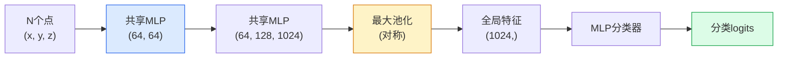

# 3D视觉 — 点云与NeRF

> 3D视觉有两种形态。点云是传感器的原始输出。NeRF是学习得到的体场。两者都回答"空间中是什么、在哪里"的问题。

**类型：** 学习 + 构建
**语言：** Python
**前置知识：** 第4阶段 第03课（CNN）、第1阶段 第12课（张量运算）
**耗时：** 约45分钟

## 学习目标

- 区分显式（点云、网格、体素）和隐式（有符号距离场、NeRF）3D表示方式及其适用场景
- 理解PointNet的对称函数技巧，使神经网络对无序点集具有置换不变性
- 追踪NeRF前向传播流程：光线投射、体渲染、位置编码、MLP密度+颜色头
- 使用 `nerfstudio` 或 `instant-ngp` 从少量已标定图像中进行预训练3D重建

## 问题

相机产生2D图像。激光雷达产生一组无序的3D点。运动恢复结构（SfM）流水线产生稀疏的3D关键点云。NeRF从少数已标定图像重建整个3D场景。这些都是"视觉"任务，但没有一种输出是CNN期望的密集张量。

3D视觉至关重要，因为几乎所有高价值机器人任务都在3D空间中运行：抓取、避障、导航、AR遮挡、3D内容采集。只理解2D图像的视觉工程师无法进入增长最快的领域分支（AR/VR内容、机器人、自动驾驶栈、基于NeRF的房地产或建筑3D重建）。

两种表示方式各有所长。点云是传感器直接免费提供的。NeRF及其后继者（3D高斯溅射、神经SDF）是你让神经网络学习场景时得到的结果。

## 概念

### 点云

点云是R^3中的无序N点集合，每个点可选地附带特征（颜色、强度、法向量）。

```
cloud = [
  (x1, y1, z1, r1, g1, b1),
  (x2, y2, z2, r2, g2, b2),
  ...
  (xN, yN, zN, rN, gN, bN),
]
```

无网格，无连接关系。两个特性使其难以被神经网络处理：

- **置换不变性** — 输出不应依赖于点的顺序。
- **可变N** — 单一模型必须处理不同大小的点云。

PointNet（Qi等，2017）用一种思路同时解决这两个问题：对每个点应用共享MLP，然后用对称函数（最大池化）聚合。结果是一个固定大小的向量，与顺序无关。

```
f(P) = max_{p in P} MLP(p)
```

这就是PointNet的核心。更深 variants（PointNet++、Point Transformer）添加了层次化采样和局部聚合，但对称函数技巧不变。

### PointNet架构



"共享MLP"意味着相同的MLP独立作用于每个点。为效率起见，实现为沿点维度的1x1卷积。

### 神经辐射场（NeRF）

NeRF（Mildenhall等，2020）提出了"能否从N张照片重建3D场景？"的问题，并用一个本身就是场景的神经网络给出了答案。该网络将 `(x, y, z, 视角方向)` 映射到 `(密度, 颜色)`。渲染新视角是对该网络进行光线投射循环。

```
NeRF MLP:  (x, y, z, theta, phi) -> (sigma, r, g, b)

渲染新视角的像素 (u, v)：
  1. 从相机通过像素 (u, v) 发射一条光线
  2. 沿光线在距离 t_1, t_2, ..., t_N 处采样点
  3. 在每个点查询MLP
  4. 用 (1 - exp(-sigma * dt)) 加权合成颜色
  5. 求和得到渲染像素颜色
```

损失函数比较渲染像素与训练照片中的真实像素。反向传播通过渲染步骤更新MLP。无需3D真值，无需显式几何 — 场景存储在MLP权重中。

### NeRF中的位置编码

直接在 `(x, y, z)` 上使用的普通MLP无法表示高频细节，因为MLP在频谱上偏向低频。NeRF通过在MLP之前将每个坐标编码为傅里叶特征向量来解决此问题：

```
gamma(p) = (sin(2^0 pi p), cos(2^0 pi p), sin(2^1 pi p), cos(2^1 pi p), ...)
```

最高 L=10 个频率层。这与transformer用于位置的技巧相同，也再次出现在扩散时间条件中（第10课）。没有它，NeRF看起来会很模糊。

### 体渲染

```
C(r) = sum_i T_i * (1 - exp(-sigma_i * delta_i)) * c_i

T_i  = exp(- sum_{j<i} sigma_j * delta_j)
delta_i = t_{i+1} - t_i
```

`T_i` 是透射率 — 有多少光 survives 到达点i。`(1 - exp(-sigma_i * delta_i))` 是点i处的不透明度。`c_i` 是颜色。最终像素是沿光线的加权和。

### NeRF的替代方案

纯NeRF训练慢（数小时）且渲染慢（每张图像数秒）。后续发展：

- **Instant-NGP**（2022）— 哈希网格编码替代MLP的位置输入；秒级训练。
- **Mip-NeRF 360** — 处理无界场景和抗锯齿。
- **3D高斯溅射**（2023）— 用数百万个3D高斯函数替代体场；分钟级训练，实时渲染。当前生产默认方案。

2026年几乎所有实际NeRF产品实际上是3D高斯溅射。心智模型仍然是NeRF。

### 数据集与基准

- **ShapeNet** — 作为点云的3D CAD模型的分类与分割。
- **ScanNet** — 真实室内扫描用于分割。
- **KITTI** — 用于自动驾驶的室外激光雷达点云。
- **NeRF Synthetic** / **Blended MVS** — 用于视角合成的已标定图像数据集。
- **Mip-NeRF 360** 数据集 — 无界真实场景。

```figure
nerf-rays
```

## 构建

### 步骤1：PointNet分类器

```python
import torch
import torch.nn as nn

class PointNet(nn.Module):
    def __init__(self, num_classes=10):
        super().__init__()
        self.mlp1 = nn.Sequential(
            nn.Conv1d(3, 64, 1),    nn.BatchNorm1d(64),   nn.ReLU(inplace=True),
            nn.Conv1d(64, 64, 1),   nn.BatchNorm1d(64),   nn.ReLU(inplace=True),
        )
        self.mlp2 = nn.Sequential(
            nn.Conv1d(64, 128, 1),  nn.BatchNorm1d(128),  nn.ReLU(inplace=True),
            nn.Conv1d(128, 1024, 1), nn.BatchNorm1d(1024), nn.ReLU(inplace=True),
        )
        self.head = nn.Sequential(
            nn.Linear(1024, 512),   nn.BatchNorm1d(512),  nn.ReLU(inplace=True),
            nn.Dropout(0.3),
            nn.Linear(512, 256),    nn.BatchNorm1d(256),  nn.ReLU(inplace=True),
            nn.Dropout(0.3),
            nn.Linear(256, num_classes),
        )

    def forward(self, x):
        # x: (N, 3, num_points) — 转置以适应Conv1d
        x = self.mlp1(x)
        x = self.mlp2(x)
        x = torch.max(x, dim=-1)[0]       # (N, 1024)
        return self.head(x)

pts = torch.randn(4, 3, 1024)
net = PointNet(num_classes=10)
print(f"输出: {net(pts).shape}")
print(f"参数: {sum(p.numel() for p in net.parameters()):,}")
```

约160万参数。每个点云处理1,024个点。

### 步骤2：位置编码

```python
def positional_encoding(x, L=10):
    """
    x: (..., D) -> (..., D * 2 * L)
    """
    freqs = 2.0 ** torch.arange(L, dtype=x.dtype, device=x.device)
    args = x.unsqueeze(-1) * freqs * 3.141592653589793
    sinc = torch.cat([args.sin(), args.cos()], dim=-1)
    return sinc.reshape(*x.shape[:-1], -1)

x = torch.randn(5, 3)
y = positional_encoding(x, L=10)
print(f"输入:  {x.shape}")
print(f"编码后: {y.shape}     # (5, 60)")
```

乘以 `2^l * pi` 产生逐步更高的频率。

### 步骤3：小型NeRF MLP

```python
class TinyNeRF(nn.Module):
    def __init__(self, L_pos=10, L_dir=4, hidden=128):
        super().__init__()
        self.L_pos = L_pos
        self.L_dir = L_dir
        pos_dim = 3 * 2 * L_pos
        dir_dim = 3 * 2 * L_dir
        self.trunk = nn.Sequential(
            nn.Linear(pos_dim, hidden), nn.ReLU(inplace=True),
            nn.Linear(hidden, hidden),  nn.ReLU(inplace=True),
            nn.Linear(hidden, hidden),  nn.ReLU(inplace=True),
            nn.Linear(hidden, hidden),  nn.ReLU(inplace=True),
        )
        self.sigma = nn.Linear(hidden, 1)
        self.color = nn.Sequential(
            nn.Linear(hidden + dir_dim, hidden // 2), nn.ReLU(inplace=True),
            nn.Linear(hidden // 2, 3), nn.Sigmoid(),
        )

    def forward(self, x, d):
        x_enc = positional_encoding(x, self.L_pos)
        d_enc = positional_encoding(d, self.L_dir)
        h = self.trunk(x_enc)
        sigma = torch.relu(self.sigma(h)).squeeze(-1)
        rgb = self.color(torch.cat([h, d_enc], dim=-1))
        return sigma, rgb

nerf = TinyNeRF()
x = torch.randn(128, 3)
d = torch.randn(128, 3)
s, c = nerf(x, d)
print(f"sigma: {s.shape}   rgb: {c.shape}")
```

相比原始NeRF很小（原始NeRF有2个深度为8的MLP主干）。足以演示架构。

### 步骤4：沿光线的体渲染

```python
def volumetric_render(sigma, rgb, t_vals):
    """
    sigma: (..., N_samples)
    rgb:   (..., N_samples, 3)
    t_vals: (N_samples,) 沿光线的距离
    """
    delta = torch.cat([t_vals[1:] - t_vals[:-1], torch.full_like(t_vals[:1], 1e10)])
    alpha = 1.0 - torch.exp(-sigma * delta)
    trans = torch.cumprod(torch.cat([torch.ones_like(alpha[..., :1]), 1.0 - alpha + 1e-10], dim=-1), dim=-1)[..., :-1]
    weights = alpha * trans
    rendered = (weights.unsqueeze(-1) * rgb).sum(dim=-2)
    depth = (weights * t_vals).sum(dim=-1)
    return rendered, depth, weights


N = 64
t_vals = torch.linspace(2.0, 6.0, N)
sigma = torch.rand(N) * 0.5
rgb = torch.rand(N, 3)
rendered, depth, weights = volumetric_render(sigma, rgb, t_vals)
print(f"渲染颜色: {rendered.tolist()}")
print(f"深度:           {depth.item():.2f}")
```

一条光线，64个采样点，合成单个RGB像素和深度值。

## 使用

对于实际工作：

- `nerfstudio`（Tancik等）— 当前NeRF/Instant-NGP/高斯溅射的参考库。提供命令行和Web查看器。
- `pytorch3d`（Meta）— 可微渲染、点云工具、网格操作。
- `open3d` — 点云处理、配准、可视化。

对于部署，3D高斯溅射已基本替代纯NeRF，因为其渲染速度提高100倍。重建质量相当。

## 交付物

本课产出：

- `outputs/prompt-3d-task-router.md` — 一个根据任务和输入数据路由到正确3D表示（点云、网格、体素、NeRF、高斯溅射）的提示词。
- `outputs/skill-point-cloud-loader.md` — 一个编写PyTorch `Dataset` 的技能，用于处理.ply/.pcd/.xyz文件，包含正确的归一化、居中点和点采样。

## 练习

1. **（简单）** 验证PointNet的置换不变性：将同一份点云运行两次，一次打乱点的顺序。验证输出在浮点误差范围内一致。
2. **（中等）** 实现一个最小化的光线生成函数，给定相机内参和位姿，为H x W图像的每个像素生成光线起点和方向。
3. **（困难）** 在合成数据集上训练TinyNeRF，该数据集由彩色立方体的渲染视图组成（通过可微渲染或简单光线追踪器生成）。报告第1、10、100轮的渲染损失。模型在第几轮开始产生可辨认的视图？

## 关键术语

| 术语 | 人们怎么说 | 实际含义 |
|------|-----------|---------|
| 点云 | "激光雷达的3D点" | 无序的 (x, y, z) 集合 + 每点可选特征 |
| PointNet | "首个点云神经网络" | 每点共享MLP + 对称（最大）池化；内置置换不变性 |
| NeRF | "本身就是场景的MLP" | 将 (x, y, z, 方向) 映射到 (密度, 颜色) 的网络；通过光线投射渲染 |
| 位置编码 | "傅里叶特征" | 将每个坐标编码为多频率的sin/cos，以克服MLP的低频偏向 |
| 体渲染 | "光线积分" | 使用透射率和alpha沿光线合成采样点为单个像素 |
| Instant-NGP | "哈希网格NeRF" | 用多分辨率哈希网格替代NeRF的坐标MLP；快100-1000倍 |
| 3D高斯溅射 | "百万高斯函数" | 场景 = 3D高斯函数集合；实时渲染，分钟级训练 |
| SDF | "有符号距离场" | 返回到最近表面有符号距离的函数；另一种隐式表示 |

## 延伸阅读

- [PointNet (Qi等, 2017)](https://arxiv.org/abs/1612.00593) — 置换不变分类器
- [NeRF (Mildenhall等, 2020)](https://arxiv.org/abs/2003.08934) — 使3D重建成为神经网络问题的论文
- [Instant-NGP (Müller等, 2022)](https://arxiv.org/abs/2201.05989) — 哈希网格，1000倍加速
- [3D高斯溅射 (Kerbl等, 2023)](https://arxiv.org/abs/2308.04079) — 替代NeRF的生产架构
