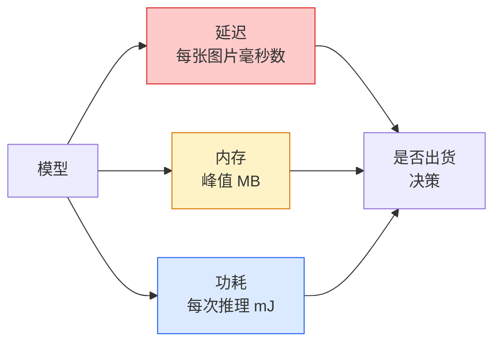

# 实时视觉 — 边缘部署

> 边缘推理是指在配备 2 GB 内存的设备上让准确率达到 90% 的模型以 30 fps 运行。每一个百分比点的精度都需要与毫秒级的延迟进行权衡。

**类型：** 学习 + 实践
**语言：** Python
**前置知识：** 阶段 4 课程 04（图像分类），阶段 10 课程 11（量化）
**预计时间：** 约 75 分钟

## 学习目标

- 测量任意 PyTorch 模型的推理延迟、峰值内存和吞吐量，理解 FLOPs / 参数量 / 延迟的权衡关系
- 使用 PyTorch 的训练后静态量化将视觉模型量化为 INT8，并验证精度损失 < 1%
- 导出为 ONNX 格式并使用 ONNX Runtime 或 TensorRT 编译；说出最常见的三种导出失败情况及修复方法
- 解释在边缘约束下如何选择 MobileNetV3、EfficientNet-Lite、ConvNeXt-Tiny 或 MobileViT

## 问题所在

训练时的视觉模型是一个浮点数巨兽：1 亿参数，每次前向传播 10 GFLOPs，占用 2 GB 显存。这些都装不进手机、车载娱乐系统、工业相机或无人机。部署视觉系统意味着要在比训练环境小 100 倍的预算内完成同样的预测。

三个关键因素决定了成败：模型选择（采用相同方案但更小的架构）、量化（INT8 替代 FP32）以及推理运行时（ONNX Runtime、TensorRT、Core ML、TFLite）。能否正确运用这些手段，决定了你的项目是只能在工作站上演示，还是能在售价 30 美元的相机模块上出货。

本课程先建立测量规范（无法测量就无法优化），然后逐一讲解这三个关键因素。目标不是掌握每一种边缘运行时，而是了解有哪些杠杆可用，以及如何验证每个杠杆是否按预期工作。

## 核心概念

### 三个预算维度



- **延迟**：p50、p95、p99。仅看平均值会掩盖对实时系统至关重要的尾部行为。
- **峰值内存**：设备在整个运行过程中见过的最大值，而非稳态平均值。这很重要，因为在嵌入式目标上 OOM（内存溢出）是致命的。
- **功耗 / 能量**：电池供电设备上每次推理的毫焦耳数。通常用 CPU/GPU 利用率 × 时间来代理。

一张包含（模型、延迟、内存、精度）的表格，是边缘部署决策的依据。每个单元格都应在目标设备上测量，而不是工作站上。

### 测量规范

每条边缘分析都应遵循三条规则：

1. **预热**模型：在测量前先进行 5-10 次虚拟前向传播。冷缓存和 JIT 编译会产生不具代表性的首次数值。
2. **同步** GPU 负载：在计时块前后使用 `torch.cuda.synchronize()`。没有这一步，你测量的是内核调度时间，而非内核执行时间。
3. **固定输入尺寸**为生产分辨率。224x224 上的延迟不等于 512x512 上的延迟。

### FLOPs 作为代理指标

FLOPs（每次推理的浮点运算次数）是一个廉价且与设备无关的延迟代理指标。用于架构对比很有用，但作为绝对墙钟时间的代理则不可靠。一个 FLOPs 多 10% 的模型在实践中可能快 2 倍，因为它使用了硬件友好的算子（深度可分离卷积编译效果很好，大尺寸 7x7 卷积则不然）。

原则：用 FLOPs 做架构搜索，用设备上的延迟做部署决策。

### 一段话说清量化

将 FP32 的权重和激活值替换为 INT8。模型体积缩小 4 倍，内存带宽需求降低 4 倍，在有 INT8 内核的硬件上（现代移动 SoC 和所有搭载 Tensor Core 的 NVIDIA GPU）计算速度提升 2-4 倍。视觉任务上使用训练后静态量化，精度损失通常为 0.1-1 个百分点。

类型：

- **动态量化** — 权重量化为 INT8，激活值在 FP 中计算。简单，加速有限。
- **静态量化（训练后）** — 权重量化 + 用小校准集校准激活值范围。比动态量化快得多。
- **量化感知训练（QAT）** — 在训练期间模拟量化，使模型能自适应。精度最优，需要标注数据。

对于视觉任务，训练后静态量化能带来 95% 的收益，仅需 5% 的 effort。仅当 PTQ 的精度损失不可接受时才使用 QAT。

### 剪枝与蒸馏

- **剪枝** — 移除不重要的权重（基于幅值）或通道（结构化）。在参数过剩的模型上效果良好；对已经紧凑的架构帮助有限。
- **蒸馏** — 训练一个小学生模型来模仿大学老师模型的 logits。通常能挽回大部分因模型缩小而损失的精度。是生产级边缘模型的标准做法。

### 推理运行时

- **PyTorch eager** — 速度慢，不适合部署。仅用于开发。
- **TorchScript** — 已属遗留技术。已被 `torch.compile` 和 ONNX 导出取代。
- **ONNX Runtime** — 中性运行时。CPU、CUDA、CoreML、TensorRT、OpenVINO 都有对应的 ONNX 提供程序。从这里开始。
- **TensorRT** — NVIDIA 的编译器。在 NVIDIA GPU（工作站和 Jetson）上延迟最低。可与 ONNX Runtime 集成或独立使用。
- **Core ML** — Apple 的 iOS/macOS 运行时。需要 `.mlmodel` 或 `.mlpackage`。
- **TFLite** — Google 的 Android/ARM 运行时。需要 `.tflite`。
- **OpenVINO** — Intel 的 CPU/VPU 运行时。需要 `.xml` + `.bin`。

实际操作流程：导出 PyTorch -> ONNX -> 为目标平台选择运行时。ONNX 是通用的中间语言。

### 边缘架构选择器

| 预算 | 模型 | 原因 |
|------|------|------|
| < 3M 参数 | MobileNetV3-Small | 编译兼容性好，良好基线 |
| 3-10M | EfficientNet-Lite-B0 | TFLite 上参数量/精度比最优 |
| 10-20M | ConvNeXt-Tiny | 参数量/精度比最优，CPU 友好 |
| 20-30M | MobileViT-S 或 EfficientViT | 具有 ImageNet 精度的 Transformer |
| 30-80M | Swin-V2-Tiny | 如果支持窗口注意力机制 |

除非有特定理由，否则全部量化为 INT8。

```figure
cnn-param-count
```

## 动手实践

### 步骤 1：正确测量延迟

```python
import time
import torch

def measure_latency(model, input_shape, device="cpu", warmup=10, iters=50):
    model = model.to(device).eval()
    x = torch.randn(input_shape, device=device)
    with torch.no_grad():
        # 预热：执行 warmup 次前向传播
        for _ in range(warmup):
            model(x)
        if device == "cuda":
            torch.cuda.synchronize()
        times = []
        # 正式测量：执行 iters 次
        for _ in range(iters):
            if device == "cuda":
                torch.cuda.synchronize()
            t0 = time.perf_counter()
            model(x)
            if device == "cuda":
                torch.cuda.synchronize()
            times.append((time.perf_counter() - t0) * 1000)
    times.sort()
    return {
        "p50_ms": times[len(times) // 2],
        "p95_ms": times[int(len(times) * 0.95)],
        "p99_ms": times[int(len(times) * 0.99)],
        "mean_ms": sum(times) / len(times),
    }
```

预热、同步、使用 `time.perf_counter()`。报告百分位数，而非仅平均值。

### 步骤 2：参数量与 FLOPs 计数

```python
def parameter_count(model):
    """计算模型总参数量"""
    return sum(p.numel() for p in model.parameters())

def flops_estimate(model, input_shape):
    """
    粗略估算卷积/全连接模型的 FLOPs。生产环境请使用 `fvcore` 或 `ptflops`。
    """
    total = 0
    def conv_hook(m, inp, out):
        nonlocal total
        c_out, c_in, kh, kw = m.weight.shape
        h, w = out.shape[-2:]
        total += 2 * c_in * c_out * kh * kw * h * w
    def linear_hook(m, inp, out):
        nonlocal total
        total += 2 * m.in_features * m.out_features
    hooks = []
    for m in model.modules():
        if isinstance(m, torch.nn.Conv2d):
            hooks.append(m.register_forward_hook(conv_hook))
        elif isinstance(m, torch.nn.Linear):
            hooks.append(m.register_forward_hook(linear_hook))
    model.eval()
    with torch.no_grad():
        model(torch.randn(input_shape))
    for h in hooks:
        h.remove()
    return total
```

实际项目请使用 `fvcore.nn.FlopCountAnalysis` 或 `ptflops`；它们能正确处理所有模块类型。

### 步骤 3：训练后静态量化

```python
def quantise_ptq(model, calibration_loader, backend="x86"):
    import torch.ao.quantization as tq
    model = model.eval().cpu()
    model.qconfig = tq.get_default_qconfig(backend)
    # 插入观察器
    tq.prepare(model, inplace=True)
    # 用真实数据校准
    with torch.no_grad():
        for x, _ in calibration_loader:
            model(x)
    # 融合并量化
    tq.convert(model, inplace=True)
    return model
```

三个步骤：配置、准备（插入观察器）、用真实数据校准、转换（融合 + 量化）。要求模型已融合（`Conv -> BN -> ReLU` 合并为 `ConvBnReLU`），`torch.ao.quantization.fuse_modules` 可处理此操作。

### 步骤 4：导出为 ONNX

```python
def export_onnx(model, sample_input, path="model.onnx"):
    model = model.eval()
    torch.onnx.export(
        model,
        sample_input,
        path,
        input_names=["input"],
        output_names=["output"],
        dynamic_axes={"input": {0: "batch"}, "output": {0: "batch"}},
        opset_version=17,
    )
    return path
```

`opset_version=17` 是 2026 年的安全默认值。`dynamic_axes` 允许使用任意批次大小运行 ONNX 模型。

### 步骤 5：基准测试与对比

```python
import torch.nn as nn
from torchvision.models import mobilenet_v3_small

def compare_regimes():
    model = mobilenet_v3_small(weights=None, num_classes=10)
    params = parameter_count(model)
    flops = flops_estimate(model, (1, 3, 224, 224))
    lat_fp32 = measure_latency(model, (1, 3, 224, 224), device="cpu")
    print(f"FP32 MobileNetV3-Small: {params:,} 参数  {flops/1e9:.2f} GFLOPs  "
          f"p50={lat_fp32['p50_ms']:.2f}ms  p95={lat_fp32['p95_ms']:.2f}ms")
```

对 `resnet50`、`efficientnet_v2_s` 和 `convnext_tiny` 运行相同函数，即可获得部署决策所需的对比表格。

## 生产应用

生产栈通常收敛于以下三条路径之一：

- **Web / 无服务器**：PyTorch -> ONNX -> ONNX Runtime（CPU 或 CUDA 提供程序）。最简单，对大多数场景足够。
- **NVIDIA 边缘（Jetson、GPU 服务器）**：PyTorch -> ONNX -> TensorRT。延迟最优，工程投入最大。
- **移动端**：PyTorch -> ONNX -> Core ML（iOS）或 TFLite（Android）。导出前先量化。

测量工具方面，`torch-tb-profiler`、`nvprof` / `nsys` 以及 macOS 上的 Instruments 可提供逐层分解。`benchmark_app`（OpenVINO）和 `trtexec`（TensorRT）提供独立的命令行数值。

## 交付物

本课产出：

- `outputs/prompt-edge-deployment-planner.md` — 一个提示词，根据目标设备和延迟 SLA 选择骨干网络、量化策略和运行时。
- `outputs/skill-latency-profiler.md` — 一个技能脚本，编写完整的延迟基准测试脚本，包含预热、同步、百分位数和内存跟踪。

## 练习

1. **(简单)** 在 CPU 上测量 `resnet18`、`mobilenet_v3_small`、`efficientnet_v2_s` 和 `convnext_tiny` 在 224x224 分辨率下的 p50 延迟。报告表格并指出哪种架构具有最优的精度/毫秒比。
2. **(中等)** 对 `mobilenet_v3_small` 应用训练后静态量化。报告 FP32 与 INT8 的延迟差异，以及在 CIFAR-10 或类似数据集预留子集上的精度损失。
3. **(困难)** 将 `convnext_tiny` 导出为 ONNX，使用 `onnxruntime` 的 `CPUExecutionProvider` 运行，并与 PyTorch eager 基线对比延迟。找出 ONNX Runtime 首次快于基线的层并解释原因。

## 核心术语

| 术语 | 人们怎么说 | 实际含义 |
|------|-----------|---------|
| 延迟 | "有多快" | 从输入到输出的时间；p50/p95/p99 百分位数，而非平均值 |
| FLOPs | "模型大小" | 每次前向传播的浮点运算次数；计算成本的粗略代理 |
| INT8 量化 | "8 位" | 将 FP32 权重/激活值替换为 8 位整数；约 4 倍更小，2-4 倍更快 |
| PTQ | "训练后量化" | 无需重新训练即可量化已训练模型；简单，通常够用 |
| QAT | "量化感知训练" | 在训练期间模拟量化；精度最优，需要标注数据 |
| ONNX | "中性格式" | 由所有主流推理运行时支持的模型交换格式 |
| TensorRT | "NVIDIA 编译器" | 将 ONNX 编译为 NVIDIA GPU 上的优化引擎 |
| 蒸馏 | "老师 -> 学生" | 训练小模型模仿大模型的 logits；可挽回大部分损失的精度 |

## 延伸阅读

- [EfficientNet (Tan & Le, 2019)](https://arxiv.org/abs/1905.11946) — 高效架构的复合缩放方法
- [MobileNetV3 (Howard et al., 2019)](https://arxiv.org/abs/1905.02244) — 采用 h-swish 和 squeeze-excite 的移动优先架构
- [TensorRT 优化实用指南 (NVIDIA)](https://developer.nvidia.com/blog/accelerating-model-inference-with-tensorrt-tips-and-best-practices-for-pytorch-users/) — 如何真正获得论文中的吞吐量数字
- [ONNX Runtime 文档](https://onnxruntime.ai/docs/) — 量化、图优化、提供程序选择
