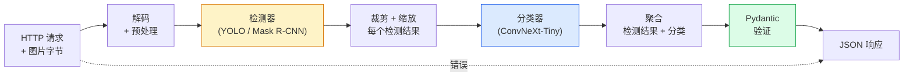

# 构建完整视觉管道 — 毕业设计项目

> 生产级视觉系统是一个由数据契约串联的模型与规则链条。这些组件在本阶段已经就位；毕业设计项目将它们端到端地连接起来。

**类型：** 构建
**语言：** Python
**前置知识：** 第4阶段课程 01-15
**时间：** 约120分钟

## 学习目标

- 设计一个生产级视觉管道，能够检测目标、分类它们，并输出结构化 JSON——且处理所有失败路径
- 将检测器（Mask R-CNN 或 YOLO）、分类器（ConvNeXt-Tiny）和数据契约（Pydantic）接入同一服务
- 对端到端管道进行基准测试，并识别第一个性能瓶颈（通常是预处理，其次是检测器）
- 交付一个最小化的 FastAPI 服务，接受图片上传，运行管道，并返回检测结果与分类

## 问题背景

独立的视觉模型很有用；视觉产品是它们的链条。零售货架审计是一个检测器加上一个商品分类器再加上一个价格 OCR 管道。自动驾驶是 2D 检测器加上 3D 检测器加上分割器加上追踪器再加上规划器。医疗预筛查是一个分割器加上一个区域分类器再加上临床医生 UI。

将这些链条连接起来是将 ML 原型转化为产品的关键。模型之间的每个接口都是新的 bug 温床。每一个坐标变换、每一次归一化、每一处 mask 缩放都是潜在的静默失败点。管道的强度取决于它最薄弱的接口。

本毕业设计项目搭建了一个最小可行管道：检测 + 分类 + 结构化输出 + 服务层。第4阶段的其余内容都可以嵌入这个骨架：将 Mask R-CNN 替换为 YOLOv8、添加 OCR 头、添加分割分支、添加追踪器。架构是稳定的；各组件是可插拔的。

## 概念

### 管道架构



七个阶段。两个模型阶段开销较大；其余五个阶段是 bug 滋生的地方。

### 使用 Pydantic 的数据契约

每个模型边界都成为一个类型化对象。这能让静默失败变成明显的错误。

```
Detection(
    box: tuple[float, float, float, float],   # (x1, y1, x2, y2)，绝对像素坐标
    score: float,                              # [0, 1]
    class_id: int,                             # 来自检测器的标签映射
    mask: Optional[list[list[int]]],           # 若存在则为 RLE 编码
)

PipelineResult(
    image_id: str,
    detections: list[Detection],
    classifications: list[Classification],
    inference_ms: float,
)
```

当检测器返回的框格式为 `(cx, cy, w, h)` 而非 `(x1, y1, x2, y2)` 时，Pydantic 的验证会在边界处失败，你能立即发现问题，而不是去调试一个静默返回空区域的下游裁剪。

### 延迟去向何处

三个事实几乎适用于所有视觉管道：

1. **预处理往往是最大的单个耗时块。** JPEG 解码、颜色空间转换、缩放——这些是 CPU 密集型操作，容易被忽略。
2. **检测器主导 GPU 时间。** 70%-90% 的 GPU 时间消耗在检测前向推理上。
3. **后处理（NMS、RLE 编解码）在 GPU 上廉价，在 CPU 上昂贵。** 始终使用实际目标平台进行性能剖析。

了解延迟分布是将优化转化为优先级列表的关键。

### 失败模式

- **空检测结果** — 返回空列表，不要崩溃。记录日志。
- **越界框** — 在裁剪前将坐标钳制到图片尺寸范围内。
- **过小的裁剪** — 对于小于分类器最小输入尺寸的框，跳过分类。
- **损坏的上传文件** — 返回 400 响应并附带具体的错误码，而不是 500。
- **模型加载失败** — 在服务启动时失败，而不是在首次请求时。

一个生产级管道会针对每种情况分别处理，而不是写出掩盖失败的通用 `try/except`。每个失败都有命名的错误码和对应的响应。

### 批处理

生产级服务需要服务多个客户端。跨请求对检测与分类进行批处理可以提升吞吐量。权衡在于：等待批次填满会带来额外的延迟。典型方案：收集请求最多 20ms，批量处理，然后分发响应。`torchserve` 和 `triton` 原生支持此功能；负载可预测的小型服务可以自建微批处理器。

```figure
v4-vision-pipeline
```

## 构建过程

### 步骤1：定义数据契约

```python
from pydantic import BaseModel, Field
from typing import List, Optional, Tuple

class Detection(BaseModel):
    box: Tuple[float, float, float, float]
    score: float = Field(ge=0, le=1)
    class_id: int = Field(ge=0)
    mask_rle: Optional[str] = None


class Classification(BaseModel):
    detection_index: int
    class_id: int
    class_name: str
    score: float = Field(ge=0, le=1)


class PipelineResult(BaseModel):
    image_id: str
    detections: List[Detection]
    classifications: List[Classification]
    inference_ms: float
```

五秒的代码工作可以在任何严肃的管道上节省一小时的调试时间。

### 步骤2：最小化 Pipeline 类

```python
import time
import numpy as np
import torch
from PIL import Image

class VisionPipeline:
    def __init__(self, detector, classifier, class_names,
                 device="cpu", min_crop=32):
        self.detector = detector.to(device).eval()
        self.classifier = classifier.to(device).eval()
        self.class_names = class_names
        self.device = device
        self.min_crop = min_crop

    def preprocess(self, image):
        """
        image: PIL.Image 或 np.ndarray (H, W, 3) uint8
        返回: device 上的 CHW float 张量
        """
        if isinstance(image, Image.Image):
            image = np.asarray(image.convert("RGB"))
        tensor = torch.from_numpy(image).permute(2, 0, 1).float() / 255.0
        return tensor.to(self.device)

    @torch.no_grad()
    def detect(self, image_tensor):
        return self.detector([image_tensor])[0]

    @torch.no_grad()
    def classify(self, crops):
        if len(crops) == 0:
            return []
        batch = torch.stack(crops).to(self.device)
        logits = self.classifier(batch)
        probs = logits.softmax(-1)
        scores, cls = probs.max(-1)
        return list(zip(cls.tolist(), scores.tolist()))

    def run(self, image, image_id="anonymous"):
        t0 = time.perf_counter()
        tensor = self.preprocess(image)
        det = self.detect(tensor)

        crops = []
        detections = []
        valid_indices = []
        for i, (box, score, cls) in enumerate(zip(det["boxes"], det["scores"], det["labels"])):
            x1, y1, x2, y2 = [max(0, int(b)) for b in box.tolist()]
            x2 = min(x2, tensor.shape[-1])
            y2 = min(y2, tensor.shape[-2])
            detections.append(Detection(
                box=(x1, y1, x2, y2),
                score=float(score),
                class_id=int(cls),
            ))
            if (x2 - x1) < self.min_crop or (y2 - y1) < self.min_crop:
                continue
            crop = tensor[:, y1:y2, x1:x2]
            crop = torch.nn.functional.interpolate(
                crop.unsqueeze(0),
                size=(224, 224),
                mode="bilinear",
                align_corners=False,
            )[0]
            crops.append(crop)
            valid_indices.append(i)

        class_preds = self.classify(crops)

        classifications = []
        for valid_idx, (cls_id, cls_score) in zip(valid_indices, class_preds):
            classifications.append(Classification(
                detection_index=valid_idx,
                class_id=int(cls_id),
                class_name=self.class_names[cls_id],
                score=float(cls_score),
            ))

        return PipelineResult(
            image_id=image_id,
            detections=detections,
            classifications=classifications,
            inference_ms=(time.perf_counter() - t0) * 1000,
        )
```

每个接口都是类型化的。每条失败路径都有明确的应对策略。

### 步骤3：接入检测器与分类器

```python
from torchvision.models.detection import maskrcnn_resnet50_fpn_v2
from torchvision.models import convnext_tiny

# 使用 ImageNet 预训练权重，无需训练即可搭建真实管道
detector = maskrcnn_resnet50_fpn_v2(weights="DEFAULT")
classifier = convnext_tiny(weights="DEFAULT")
class_names = [f"imagenet_class_{i}" for i in range(1000)]

pipe = VisionPipeline(detector, classifier, class_names)

# 使用合成图片进行冒烟测试
test_image = (np.random.rand(400, 600, 3) * 255).astype(np.uint8)
result = pipe.run(test_image, image_id="demo")
print(result.model_dump_json(indent=2)[:500])
```

### 步骤4：FastAPI 服务

```python
from fastapi import FastAPI, UploadFile, HTTPException
from io import BytesIO

app = FastAPI()
pipe = None  # 在启动时初始化

@app.on_event("startup")
def load():
    global pipe
    detector = maskrcnn_resnet50_fpn_v2(weights="DEFAULT").eval()
    classifier = convnext_tiny(weights="DEFAULT").eval()
    pipe = VisionPipeline(detector, classifier, class_names=[f"c{i}" for i in range(1000)])

@app.post("/detect")
async def detect_endpoint(file: UploadFile):
    if file.content_type not in {"image/jpeg", "image/png", "image/webp"}:
        raise HTTPException(status_code=400, detail="unsupported image type")
    data = await file.read()
    try:
        img = Image.open(BytesIO(data)).convert("RGB")
    except Exception:
        raise HTTPException(status_code=400, detail="cannot decode image")
    result = pipe.run(img, image_id=file.filename or "upload")
    return result.model_dump()
```

使用 `uvicorn main:app --host 0.0.0.0 --port 8000` 启动服务。使用 `curl -F 'file=@dog.jpg' http://localhost:8000/detect` 进行测试。

### 步骤5：管道基准测试

```python
import time

def benchmark(pipe, num_runs=20, image_size=(400, 600)):
    img = (np.random.rand(*image_size, 3) * 255).astype(np.uint8)
    pipe.run(img)  # 预热

    stages = {"preprocess": [], "detect": [], "classify": [], "total": []}
    for _ in range(num_runs):
        t0 = time.perf_counter()
        tensor = pipe.preprocess(img)
        t1 = time.perf_counter()
        det = pipe.detect(tensor)
        t2 = time.perf_counter()
        crops = []
        for box in det["boxes"]:
            x1, y1, x2, y2 = [max(0, int(b)) for b in box.tolist()]
            x2 = min(x2, tensor.shape[-1])
            y2 = min(y2, tensor.shape[-2])
            if (x2 - x1) >= pipe.min_crop and (y2 - y1) >= pipe.min_crop:
                crop = tensor[:, y1:y2, x1:x2]
                crop = torch.nn.functional.interpolate(
                    crop.unsqueeze(0), size=(224, 224), mode="bilinear", align_corners=False
                )[0]
                crops.append(crop)
        pipe.classify(crops)
        t3 = time.perf_counter()
        stages["preprocess"].append((t1 - t0) * 1000)
        stages["detect"].append((t2 - t1) * 1000)
        stages["classify"].append((t3 - t2) * 1000)
        stages["total"].append((t3 - t0) * 1000)

    for stage, times in stages.items():
        times.sort()
        print(f"{stage:12s}  p50={times[len(times)//2]:7.1f} ms  p95={times[int(len(times)*0.95)]:7.1f} ms")
```

CPU 上的典型输出：预处理约 3ms，检测 300-500ms，分类 20-40ms，总计 350-550ms。在 GPU 上，检测仅需 20-40ms，预处理和分类的相对占比开始变得显著。

## 使用方式

生产模板都收敛到相同的结构，此外还包括：

- **模型版本控制** — 始终在响应中记录模型名称和权重哈希。
- **逐请求追踪 ID** — 记录每次请求每个阶段的耗时，以便将慢响应与特定阶段关联。
- **降级路径** — 如果分类器超时，返回不带分类的检测结果，而不是让整个请求失败。
- **安全过滤器** — NSFW / PII 过滤器在分类之后、响应离开服务之前运行。
- **批量接口** — 一个 `/detect_batch` 接口，接受图片 URL 列表进行批量处理。

对于生产级部署，`torchserve`、`Triton Inference Server` 和 `BentoML` 开箱即用地提供了批处理、版本控制、指标和健康检查功能。直接运行 `FastAPI` 对于原型和小规模产品而言已经足够。

## 交付物

本课产出的内容：

- `outputs/prompt-vision-service-shape-reviewer.md` — 一个提示词，用于审查视觉服务代码中的契约/响应格式违规，并指出首个破坏性 bug。
- `outputs/skill-pipeline-budget-planner.md` — 一个技能，给定目标延迟和吞吐量，为每个管道阶段分配时间预算，并标记哪个阶段会首先超出预算。

## 练习

1. **（简单）** 在任意开放数据集的 10 张图片上运行管道。报告每个阶段的平均耗时，以及每张图片的检测数量分布。
2. **（中等）** 在 `Detection` 中添加 mask 输出字段并以 RLE 编码。验证即使对于包含 10 个目标的图片，JSON 大小也保持在 1MB 以内。
3. **（困难）** 在分类器前端添加一个微批处理器：收集最多 10ms 的裁剪区域，一次性执行 GPU 推理，然后按请求返回结果。测量在每秒 5 个并发请求下的吞吐量提升和延迟增加。

## 关键术语

| 术语 | 人们常说的说法 | 实际含义 |
|------|--------------|---------|
| 管道 | "系统" | 一组有序的前处理、推理和后处理步骤，每两步之间都有类型化的接口 |
| 数据契约 | " schema" | 每个阶段的输入和输出都必须符合的 Pydantic / dataclass 定义；在边界处捕获集成 bug |
| 预处理 | "模型之前" | 解码、颜色转换、缩放、归一化；通常是最大的 CPU 耗时来源 |
| 后处理 | "模型之后" | NMS、mask 缩放、阈值处理、RLE 编码；GPU 上廉价，CPU 上昂贵 |
| 微批处理器 | "收集后转发" | 聚合器，等待固定时间窗口内收集多个请求，执行单次批量前向推理 |
| 追踪 ID | "请求 id" | 在每个阶段记录的逐请求标识符，以便端到端追踪慢请求 |
| 失败码 | "命名错误" | 每类失败对应具体的错误码，而非通用的 500；支持客户端重试逻辑 |
| 健康检查 | "就绪探针" | 一个轻量级端点，报告服务是否可正常响应；负载均衡器依赖此机制 |

## 延伸阅读

- [Full Stack Deep Learning — Deploying Models](https://fullstackdeeplearning.com/course/2022/lecture-5-deployment/) — 生产 ML 部署的标准概述
- [BentoML docs](https://docs.bentoml.com) — 提供批处理、版本控制和指标的部署框架
- [torchserve docs](https://pytorch.org/serve/) — PyTorch 官方部署库
- [NVIDIA Triton Inference Server](https://developer.nvidia.com/triton-inference-server) — 支持批处理和多模型的高吞吐部署服务器
