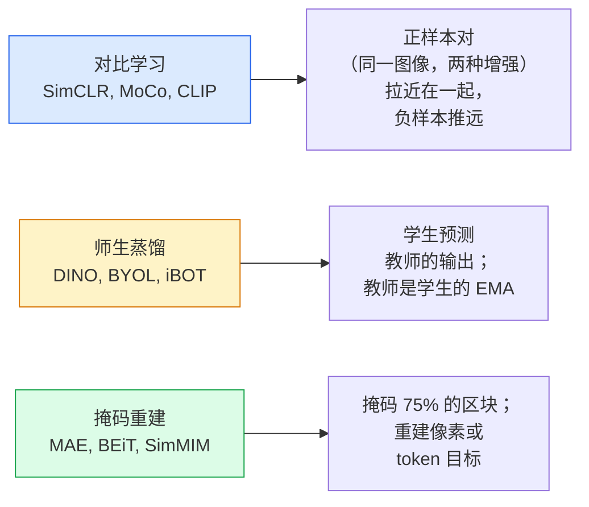

# 自监督视觉 — SimCLR、DINO、MAE

> 标签是监督视觉的瓶颈。自监督预训练消除了这个瓶颈：从 1 亿张无标签图像中学习视觉特征，然后在 1 万张有标签图像上微调。

**类型：** 学习 + 构建
**语言：** Python
**前置知识：** Phase 4 Lesson 04（图像分类）、Phase 4 Lesson 14（ViT）
**时长：** 约 75 分钟

## 学习目标

- 追溯三大自监督家族——对比学习（SimCLR）、师生蒸馏（DINO）、掩码重建（MAE）——并说明各自优化的目标
- 从零实现 InfoNCE 损失，并解释为什么批量大小为 512 可行而 32 失败
- 说明 MAE 的 75% 掩码比例并非随意设定，以及它与 BERT 文本的 15% 有何不同
- 使用 DINOv2 或 MAE 的 ImageNet 检查点进行线性探测和零样本检索

## 问题所在

监督式 ImageNet 包含 130 万张已标注图像，标注成本估计为 1000 万美元。医疗和工业数据集规模更小，标注成本甚至更高。每个视觉团队都在问：我们能否在廉价的无标签数据（YouTube 帧、网络爬取、摄像头画面、卫星扫描）上进行预训练，然后在少量有标签集上微调？

自监督学习就是答案。在现代自监督 ViT 于 LAION 或 JFT 数据上训练后，微调时的准确率可以达到或超越监督式 ImageNet。它比监督预训练更好地迁移到下游任务（检测、分割、深度估计）。DINOv2（Meta，2023）和 MAE（Meta，2022）是目前可迁移视觉特征的生产级默认选择。

概念上的转变在于：预文本任务（模型被训练去做的任务）不必是下游任务。关键是它迫使模型学习有用的特征。预测灰度图像的颜色、旋转图像并要求模型分类旋转角度、掩码区块并重建它们——这些都曾经有效。三种可扩展的方法是：对比学习、师生蒸馏和掩码重建。

## 核心概念

### 三大流派



### 对比学习（SimCLR）

取一张图像，应用两种随机增强，得到两个视图。将两者送入同一个编码器加上投影头。最小化一个损失，其含义是"这两个嵌入应该相近"以及"这个嵌入应该远离批次中每张其他图像的嵌入"。

```
正样本对 (z_i, z_j) 的损失（每批次 2N 个视图）：

   L_ij = -log( exp(sim(z_i, z_j) / tau) / sum_k ∈ 批次 \ {i} exp(sim(z_i, z_k) / tau) )

sim = 余弦相似度
tau = 温度系数（标准值为 0.1）
```

这就是 InfoNCE 损失。它需要每个正样本对应大量负样本，因此批次大小很重要——SimCLR 需要 512-8192。MoCo 引入了动量队列来存储过往批次的负样本，从而将负样本数量与批次大小解耦。

### 师生蒸馏（DINO）

两个相同架构的网络：学生网络 and 教师网络。教师网络是学生网络权重的指数移动平均（EMA）。两者都看到图像的增强视图。学生网络的输出被训练来匹配教师网络的输出——无需显式的负样本。

```
loss = CE( student_output(view_1),  teacher_output(view_2) )
     + CE( student_output(view_2),  teacher_output(view_1) )

teacher_weights = m * teacher_weights + (1 - m) * student_weights   (m ≈ 0.996)
```

为何不会坍缩为"预测常数"：教师网络的输出经过中心化（减去各维度的均值）和锐化（除以较小的温度系数）。中心化防止某一维度占主导；锐化防止输出坍缩为均匀分布。

DINOv2 是在 1.42 亿张精心筛选的图像上扩展的 DINO。所得特征是零样本视觉检索和密集预测的当前 SOTA。

### 掩码重建（MAE）

掩码 ViT 输入的 75% 区块。仅让可见的 25% 通过编码器。一个小解码器接收编码器的输出以及在掩码位置处的掩码 token，并被训练来重建掩码区块的像素。

```
编码器：可见的 25% 区块 -> 特征
解码器：特征 + 掩码位置的掩码 token -> 重建像素
损失：仅对掩码区块的重建像素与原始像素之间的 MSE
```

使 MAE 成功的关键设计选择：

- **75% 的掩码比例** — 很高。迫使编码器学习语义特征；如果只掩码 25%，任务几乎易如反掌（相邻像素高度相关，CNN 也能轻松完成）。
- **不对称的编码器/解码器** — 大型 ViT 编码器只看可见区块；小型解码器（8 层，512 维）负责重建。预训练速度比原始的 BEiT 快 3 倍。
- **像素空间重建目标** — 比 BEiT 的 token 化目标更简单，且在 ViT 上效果更好。

预训练完成后，丢弃解码器。编码器就是特征提取器。

### 为什么是 75% 而不是 15%

BERT 掩码 15% 的 token。MAE 掩码 75%。差异在于信息密度。

- 自然语言每个 token 的熵很高。预测 15% 的 token 仍然困难，因为每个掩码位置有许多合理的补全可能。
- 图像区块的熵很低——未掩码的邻域通常能几乎精确地决定掩码区块的像素。为了让预测需要语义理解，你必须激进地掩码。

75% 足够高，使得简单的空间插值无法完成任务；编码器必须表征图像内容。

### 线性探测评估

自监督预训练后，标准的评估方式是**线性探测**：冻结编码器，在 ImageNet 标签上训练一个线性分类器。报告 top-1 准确率。

- SimCLR ResNet-50：约 71%（2020）
- DINO ViT-S/16：约 77%（2021）
- MAE ViT-L/16：约 76%（2022）
- DINOv2 ViT-g/14：约 86%（2023）

线性探测是纯特征质量的度量；微调通常增加 2-5 个百分点，但同时也混合了头部重训练的效果。

```figure
data-augmentation
```

## 动手实现

### 步骤 1：双视图增强流水线

```python
import torch
import torchvision.transforms as T

# 定义双视图训练增强流水线
two_view_train = lambda: T.Compose([
    T.RandomResizedCrop(96, scale=(0.2, 1.0)),
    T.RandomHorizontalFlip(),
    T.ColorJitter(0.4, 0.4, 0.4, 0.1),
    T.RandomGrayscale(p=0.2),
    T.ToTensor(),
])


class TwoViewDataset(torch.utils.data.Dataset):
    def __init__(self, base):
        self.base = base
        self.aug = two_view_train()

    def __len__(self):
        return len(self.base)

    def __getitem__(self, i):
        img, _ = self.base[i]
        v1 = self.aug(img)
        v2 = self.aug(img)
        return v1, v2
```

每个 `__getitem__` 返回同一图像的两个增强视图；不需要标签。

### 步骤 2：InfoNCE 损失

```python
import torch.nn.functional as F

def info_nce(z1, z2, tau=0.1):
    """
    z1, z2: (N, D) L2 归一化的配对视图嵌入
    """
    N, D = z1.shape
    z = torch.cat([z1, z2], dim=0)  # (2N, D)
    sim = z @ z.T / tau              # (2N, 2N)

    # 将对角线位置（自身相似性）设为负无穷
    mask = torch.eye(2 * N, dtype=torch.bool, device=z.device)
    sim = sim.masked_fill(mask, float("-inf"))

    # 目标标签：前 N 个的正样本是后 N 个，反之亦然
    targets = torch.cat([torch.arange(N, 2 * N), torch.arange(0, N)]).to(z.device)
    return F.cross_entropy(sim, targets)
```

调用前需对嵌入进行 L2 归一化。`tau=0.1` 是 SimCLR 的默认值；降低会使损失更尖锐，且需要更多负样本。

### 步骤 3：InfoNCE  sanity check

```python
z1 = F.normalize(torch.randn(16, 32), dim=-1)
z2 = z1.clone()
loss_same = info_nce(z1, z2, tau=0.1).item()
z2_random = F.normalize(torch.randn(16, 32), dim=-1)
loss_random = info_nce(z1, z2_random, tau=0.1).item()
print(f"InfoNCE with identical pairs:  {loss_same:.3f}")
print(f"InfoNCE with random pairs:     {loss_random:.3f}")
```

相同对应该产生低损失（大批次和低温下接近 0）。随机对应该给出 log(2N-1) = ~log(31) = ~3.4（16 对批次）。

### 步骤 4：类 MAE 掩码

```python
def random_mask_indices(num_patches, mask_ratio=0.75, seed=0):
    g = torch.Generator().manual_seed(seed)
    n_keep = int(num_patches * (1 - mask_ratio))
    perm = torch.randperm(num_patches, generator=g)
    visible = perm[:n_keep]
    masked = perm[n_keep:]
    return visible.sort().values, masked.sort().values


num_patches = 196
visible, masked = random_mask_indices(num_patches, mask_ratio=0.75)
print(f"visible: {len(visible)} / {num_patches}")
print(f"masked:  {len(masked)} / {num_patches}")
```

简单、快速，且对给定种子 deterministic。实际 MAE 实现会批量处理并保留每个样本的掩码。

## 实际使用

DINOv2 是 2026 年的生产标准：

```python
import torch
from transformers import AutoImageProcessor, AutoModel

processor = AutoImageProcessor.from_pretrained("facebook/dinov2-base")
model = AutoModel.from_pretrained("facebook/dinov2-base")
model.eval()

# 用于零样本检索的每张图像嵌入
with torch.no_grad():
    inputs = processor(images=[pil_image], return_tensors="pt")
    outputs = model(**inputs)
    embedding = outputs.last_hidden_state[:, 0]  # CLS token
```

得到的 768 维嵌入是现代图像检索、密集对应和零样本迁移流水线的基础。在下游任务上微调时，通常只需要一个线性头部。

对于图像-文本嵌入，SigLIP 或 OpenCLIP 是对应的等效方案；对于类 MAE 微调，`timm` 仓库提供了所有 MAE 检查点。

## 交付成果

本课产出：

- `outputs/prompt-ssl-pretraining-picker.md` — 一个 prompt，根据数据集大小、计算资源和下游任务选择 SimCLR / MAE / DINOv2。
- `outputs/skill-linear-probe-runner.md` — 一个技能，为任意冻结编码器 + 有标签数据集编写线性探测评估。

## 练习题

1. **(简单)** 验证当你对齐良好的嵌入降低温度时 InfoNCE 损失下降，而对随机嵌入降低温度时损失上升。绘制 `tau ∈ [0.05, 0.1, 0.2, 0.5]` 与损失的曲线图。
2. **(中等)** 实现类 DINO 的中心化缓冲。证明没有中心化时，学生网络会在几个 epoch 内坍缩为常向量。
3. **(困难)** 在 CIFAR-100 上使用 Lesson 10 中的 TinyUNet 作为主干训练 MAE。报告 10、50 和 200 个 epoch 时的线性探测准确率。证明 MAE 预训练的线性探测优于在同一 1000 图像子集上从头训练的监督线性探测。

## 关键术语

| 术语 | 人们常说的 | 实际含义 |
|------|-----------|---------|
| 自监督 | "无标签" | 从无标签数据产生有用表示的预文本任务 |
| 预文本任务 | "假任务" | SSL 期间使用的目标（重建区块、匹配视图）；预训练后丢弃 |
| 线性探测 | "冻结编码器 + 线性头部" | 标准 SSL 评估：仅在冻结特征上方训练线性分类器 |
| InfoNCE | "对比损失" | 对余弦相似度做 softmax；正样本对是目标类，其余都是负样本 |
| EMA 教师 | "移动平均教师" | 权重为学生网络指数移动平均的教师网络；BYOL、MoCo、DINO 使用 |
| 掩码比例 | "掩码的区块百分比" | MAE 期间掩码的区块比例；视觉为 75%，文本为 15% |
| 表示坍缩 | "常数输出" | SSL 失败情况，编码器对所有输入输出常向量；通过中心化、锐化或负样本防止 |
| DINOv2 | "生产级 SSL 主干" | Meta 2023 年自监督 ViT；2026 年最强的通用图像特征 |

## 延伸阅读

- [SimCLR (Chen et al., 2020)](https://arxiv.org/abs/2002.05709) — 对比学习参考
- [DINO (Caron et al., 2021)](https://arxiv.org/abs/2104.14294) — 带动量、中心化和锐化的师生蒸馏
- [MAE (He et al., 2022)](https://arxiv.org/abs/2111.06377) — ViT 的掩码自编码器预训练
- [DINOv2 (Oquab et al., 2023)](https://arxiv.org/abs/2304.07193) — 将自监督 ViT 扩展到生产级特征
