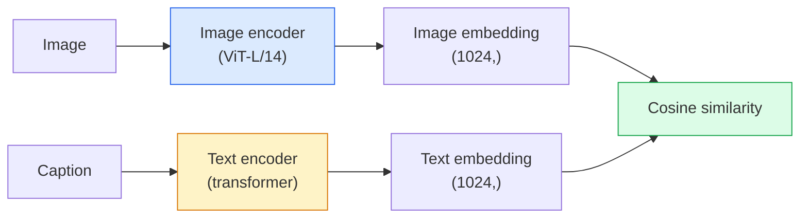

# Open-Vocabulary Vision — CLIP

> 联合训练图像编码器和文本编码器，使得匹配的 (image, caption) 对落在共享空间中的同一点上。这就是全部窍门。

**类型：** Build + Use
**语言：** Python
**前置知识：** Phase 4 Lesson 14 (ViT)、Phase 4 Lesson 17 (Self-Supervised)
**时间：** ~45 分钟

## Learning Objectives

- 解释 CLIP 的双塔架构和对比训练目标
- 使用预训练的 CLIP（或 SigLIP）进行零样本分类，无需任何任务特定训练
- 从零实现零样本分类：编码 class prompts，计算余弦相似度，取 argmax
- 区分 CLIP、SigLIP、OpenCLIP 和 LLaVA/LLaMA-vision 模型——它们在 2026 年的各自用途

## The Problem

传统分类器是闭词汇表的：一个 1000 类的 ImageNet 模型只能预测 1000 个标签。每个新类别都需要标注数据和重新训练的分类头。

CLIP (Radford 等，OpenAI 2021) 展示了在从网络爬取的 4 亿 (image, caption) 对上训练产生的模型，可以在推理时分类到任意类别集合，只需通过自然语言描述即可。你用一句话给出一个新类别。

这种能力——零样本迁移——使得每个现代视觉系统都以 CLIP 家族的检查点起步。检测（Grounding DINO、OWL-ViT）、分割（CLIPSeg、SAM）、检索、内容审核、VLM 和文生图都建立在 CLIP 风格的联合嵌入之上。

## The Concept

### Two towers



两个编码器都以线性投影结束到相同的嵌入维度（CLIP-B/32 为 512，CLIP-L/14 为 1024）。L2 归一化后计算余弦相似度。

### The objective

给定一批 N 个 (image, caption) 对，构建一个 NxN 相似度矩阵。训练两个编码器使得对角线（匹配对）具有高相似度，非对角线（非匹配对）具有低相似度。

```
sim_matrix = image_embeddings @ text_embeddings.T / tau

loss_i2t = cross_entropy(sim_matrix,       targets=arange(N))
loss_t2i = cross_entropy(sim_matrix.T,     targets=arange(N))
loss = (loss_i2t + loss_t2i) / 2
```

对称是因为图像到文本和文本到图像的检索都应有效。`tau`（温度）通常作为标量参数学习，初始化为 0.07。

### SigLIP: a better loss

SigLIP (Zhai 等，2023) 用逐对 sigmoid 替换了 softmax：

```
loss = mean over pairs of log(1 + exp(-y_ij * sim_ij))
y_ij = +1 if matching, -1 otherwise
```

逐对损失去除了 CLIP 所需的批次级归一化。SigLIP 在小批次下训练更好，在相同数据量下匹配或超越 CLIP。

### Zero-shot classification

给定一个训练好的 CLIP：

1. 对于每个类别，构造提示："a photo of a {class}"。
2. 用文本编码器编码所有类别提示 -> `T` shape (C, d)。
3. 编码测试图像 -> `I` shape (1, d)。
4. 相似度 = `I @ T.T` shape (1, C)。
5. Argmax -> 预测类别。

提示工程很重要。OpenAI 为 ImageNet 发布了 80 个提示模板（"a photo of a {}", "a blurry photo of a {}", "a sketch of a {}", ...）。对每个类别平均所有模板的嵌入，可获得额外 1-3% 的 top-1 准确率。

### Where CLIP-style models are used in 2026

- **零样本分类** — 直接使用。
- **图像检索** — 编码所有图像一次，在推理时嵌入查询。
- **文本条件检测** — Grounding DINO、OWL-ViT 将 CLIP 文本塔包装在检测器周围。
- **文本条件分割** — CLIPSeg；SAM 通过 CLIP 使用文本提示输入。
- **VLMs** — LLaVA、Qwen-VL、InternVL 将 CLIP 家族视觉编码器接入 LLM。
- **文生图** — Stable Diffusion、DALL-E 3 基于 CLIP 文本嵌入进行条件生成。

一旦拥有共享嵌入空间，每个视觉+语言任务都变成距离计算。

```figure
clip-contrastive
```

## Build It

### Step 1: A tiny two-tower model

真正的 CLIP 是 ViT + transformer。对于本课，塔是预提取特征上的小型 MLP，以便在 CPU 上可见训练信号。

```python
import torch
import torch.nn as nn
import torch.nn.functional as F


class TwoTower(nn.Module):
    def __init__(self, img_in=128, txt_in=64, emb=64):
        super().__init__()
        self.image_proj = nn.Sequential(nn.Linear(img_in, 128), nn.ReLU(), nn.Linear(128, emb))
        self.text_proj = nn.Sequential(nn.Linear(txt_in, 128), nn.ReLU(), nn.Linear(128, emb))
        self.logit_scale = nn.Parameter(torch.ones([]) * 2.6592)  # ln(1/0.07)

    def forward(self, img_feats, txt_feats):
        i = F.normalize(self.image_proj(img_feats), dim=-1)
        t = F.normalize(self.text_proj(txt_feats), dim=-1)
        return i, t, self.logit_scale.exp()
```

两个投影，共享维度输出，可学习的温度。与真实 CLIP API 形状相同。

### Step 2: Contrastive loss

```python
def clip_loss(image_emb, text_emb, logit_scale):
    N = image_emb.size(0)
    sim = logit_scale * image_emb @ text_emb.T
    targets = torch.arange(N, device=sim.device)
    l_i = F.cross_entropy(sim, targets)
    l_t = F.cross_entropy(sim.T, targets)
    return (l_i + l_t) / 2
```

对称。更高的 logit_scale = 更尖锐的 softmax = 更有信心但不稳定性风险。

### Step 3: Zero-shot classifier

```python
@torch.no_grad()
def zero_shot_classify(model, image_feats, class_text_feats, class_names):
    """
    image_feats:      (N, img_in)
    class_text_feats: (C, txt_in)   每个类别一个平均嵌入
    """
    i = F.normalize(model.image_proj(image_feats), dim=-1)
    t = F.normalize(model.text_proj(class_text_feats), dim=-1)
    sim = i @ t.T
    pred = sim.argmax(dim=-1)
    return [class_names[p] for p in pred.tolist()]
```

每步一行。这就是使用生产级 CLIP 检查点时的确切零样本流程。

### Step 4: Sanity check

```python
torch.manual_seed(0)
model = TwoTower()

img = torch.randn(8, 128)
txt = torch.randn(8, 64)
i, t, scale = model(img, txt)
loss = clip_loss(i, t, scale)
print(f"batch size: {i.size(0)}   loss: {loss.item():.3f}")
```

随机初始化模型的损失应接近 `log(N) = log(8) = 2.08`——这是尚未学到任何结构时的对称交叉熵目标。

## Use It

OpenCLIP 是 2026 年的社区默认：

```python
import open_clip
import torch
from PIL import Image

model, _, preprocess = open_clip.create_model_and_transforms("ViT-B-32", pretrained="laion2b_s34b_b79k")
tokenizer = open_clip.get_tokenizer("ViT-B-32")

image = preprocess(Image.open("dog.jpg")).unsqueeze(0)
text = tokenizer(["a photo of a dog", "a photo of a cat", "a photo of a car"])

with torch.no_grad():
    image_features = model.encode_image(image)
    text_features = model.encode_text(text)
    image_features = image_features / image_features.norm(dim=-1, keepdim=True)
    text_features = text_features / text_features.norm(dim=-1, keepdim=True)
    probs = (100.0 * image_features @ text_features.T).softmax(dim=-1)

print(probs)
```

SigLIP 更新，在小规模下训练更好，是新工作首选：`google/siglip-base-patch16-224`。Hugging Face 同时提供两者。

## Ship It

本课产出：

- `outputs/prompt-zero-shot-class-picker.md` — 一个提示，给定类别列表和领域设计零样本 CLIP 的类别模板。
- `outputs/skill-image-text-retriever.md` — 一个技能，使用任意 CLIP 检查点构建图像嵌入索引，支持文本查询和图像查询。

## Exercises

1. **(Easy)** 使用预训练的 OpenCLIP ViT-B/32 和 80 模板提示集在 CIFAR-10 上进行零样本分类。报告 top-1 准确率；应在 85-90% 左右。
2. **(Medium)** 在相同的 CIFAR-10 任务上比较单模板（"a photo of a {}"）与 80 模板平均嵌入。量化差距并解释为什么模板有帮助。
3. **(Hard)** 构建零样本图像检索索引：用 CLIP 嵌入 1,000 张图像，构建 FAISS 索引，用自然语言描述查询。报告你用手动编写的 20 个保留查询的 recall@5。

## Key Terms

| Term | What people say | What it actually means |
|------|----------------|----------------------|
| Two-tower | "Dual encoder" | 分离的图像和文本编码器，最终汇入共享维度投影头 |
| Zero-shot | "No task-specific training" | 推理时仅用文本描述的类别进行分类；不接触任何标签 |
| Temperature / logit_scale | "tau" | 可学习的标量，在 softmax 前缩放相似度矩阵 |
| Prompt template | "A photo of a {}" | 类别名称的自然语言包装；平均多个模板提升零样本准确率 |
| CLIP | "Image+text model" | 2021 年 OpenAI 模型；2026 年该领域的词汇表 |
| SigLIP | "Sigmoid CLIP" | 用逐对 sigmoid 替换 softmax；在小批次下训练更好 |
| OpenCLIP | "Open reproduction" | 在 LAION 上训练的社区 CLIP 变体；开源管道的生产默认 |
| VLM | "Vision-language model" | CLIP 家族编码器加 LLM，训练用于回答关于图像的问题 |

## Further Reading

- [CLIP: Learning Transferable Visual Models from Natural Language Supervision (Radford et al., 2021)](https://arxiv.org/abs/2103.00020)
- [SigLIP: Sigmoid Loss for Language-Image Pre-Training (Zhai et al., 2023)](https://arxiv.org/abs/2303.15343)
- [OpenCLIP](https://github.com/mlfoundations/open_clip) — 社区代码库
- [DINOv2 vs CLIP vs MAE: a features comparison](https://huggingface.co/blog/dinov2) — HF 指南含并列用例
