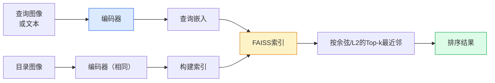

# 图像检索与度量学习

> 检索系统通过嵌入空间中的距离对候选项进行排序。度量学习是塑造该空间的学科，使距离的含义符合你的需求。

**类型：** 构建
**语言：** Python
**先决条件：** 第四阶段第14课（ViT）、第四阶段第18课（CLIP）
**时间：** 约45分钟

## 学习目标

- 解释三元组、对比度和基于代理的度量学习损失函数，并为给定数据集选择合适的损失
- 正确实现L2归一化和余弦相似度，并审计"同一物品"与"同一类别"检索之间的差异
- 构建FAISS索引，按文本和图像查询它，并报告保留查询集的recall@K
- 使用DINOv2、CLIP和SigLIP作为现成的嵌入骨干网络，并了解每种模型在什么场景下占优

## 问题背景

检索在生产级视觉应用中无处不在：重复检测、反向图片搜索、视觉搜索（"查找相似商品"）、人脸重识别、监控中的人员重识别、电商中的实例级匹配。产品问题始终相同："给定这张查询图像，对我的目录进行排序。"

两个设计决策决定了整个系统。一个是嵌入——由什么模型生成向量。另一个是索引——如何在大规模下找到最近邻。这两个组件在2026年已成标准化配置（嵌入用DINOv2，索引用FAISS），因此门槛提高了：真正的难点在于为你的应用定义*什么算作相似*，然后塑造嵌入空间使距离与之匹配。

这种塑造就是度量学习。它是一个小但高杠杆的领域。

## 概念解析

### 检索概览



### 四类损失函数

| 损失函数 | 需要的数据 | 优点 | 缺点 |
|----------|-----------|------|------|
| **对比度损失** | (锚点, 正样本) + 负样本 | 简单，适用于任意配对标签 | 没有足够多的负样本时收敛慢 |
| **三元组损失** | (锚点, 正样本, 负样本) | 直观；可直接控制边界 | 难样本挖掘成本高 |
| **NT-Xent / InfoNCE** | 配对 + 批次内挖掘的负样本 | 可扩展到大批次 | 需要大批次或动量队列 |
| **基于代理的损失（ProxyNCA）** | 仅类别标签 | 快速、稳定，无需挖掘 | 在小数据集上可能过拟合到代理 |

对于大多数生产用例，从预训练骨干网络开始，仅当现成嵌入在你的测试集上表现不佳时才添加度量学习微调。

### 三元组损失形式化

```
L = max(0, ||f(a) - f(p)||^2 - ||f(a) - f(n)||^2 + margin)
```

将锚点 `a` 拉近正样本 `p`，将其推离负样本 `n`，`margin` 确保两者之间存在间隔。这种三图像结构可泛化到任意相似度排序。

挖掘至关重要：简单三元组（`n` 已远离 `a`）贡献零损失；只有难样本三元组才能教网络。半难样本挖掘（`n` 比 `p` 远但在边界内）是2016年FaceNet的配方，至今仍占主导地位。

### 余弦相似度 vs L2距离

两种度量，两种约定：

- **余弦相似度**：向量之间的夹角。需要L2归一化嵌入。
- **L2距离**：欧几里得距离。可在原始或归一化嵌入上使用，但通常与L2归一化 + 平方L2配对使用。

对于大多数现代网络，两者是等价的：当 `||a|| = ||b|| = 1` 时，`||a - b||^2 = 2 - 2 cos(a, b)`。选择与你嵌入训练匹配的约定；混合使用会悄无声息地改变"最近"的含义。

### Recall@K

标准检索指标：

```
recall@K = 在前K个结果中至少有一个正确匹配的查询比例
```

并排报告 recall@1、@5、@10。若 recall@10 高于0.95而 recall@1 低于0.5，说明嵌入空间具有正确的结构但排序有噪声——尝试更长的微调或重排序步骤。

对于重复检测，precision@K 更为重要，因为每个假阳性都是用户可见的错误。对于视觉搜索，recall@K 是产品信号。

### FAISS 一句话概括

Facebook AI 相似度搜索。近邻搜索的事实标准库。三种索引选择：

- `IndexFlatIP` / `IndexFlatL2` —— 暴力搜索，精确，无需训练。用于约100万向量以下。
- `IndexIVFFlat` —— 分区为K个单元，仅搜索最近的几个单元。近似、快速，需要训练数据。
- `IndexHNSW` —— 基于图，多查询场景最快，索引较大。

对于10万向量，你可能想要 `IndexFlatIP` 配合余弦相似度。对于1000万向量，你想要 `IndexIVFFlat`。对于1亿以上配合产品量化（`IndexIVFPQ`）。

### 实例级 vs 类别级检索

两个名称相同但截然不同的问题：

- **类别级** —— "在目录中找到猫。" 类别条件相似度；现成的CLIP/DINOv2嵌入效果良好。
- **实例级** —— "在目录中找到*这个exact产品*。" 需要在同类中区分视觉上相似的细粒度对象；现成嵌入表现不佳；使用度量学习微调很重要。

在选择模型之前，始终先问自己在解决哪种问题。

```figure
metric-embedding
```

## 动手实现

### 步骤1：三元组损失

```python
import torch
import torch.nn.functional as F

def triplet_loss(anchor, positive, negative, margin=0.2):
    # 计算锚点-正样本和锚点-负样本的L2距离
    d_ap = F.pairwise_distance(anchor, positive, p=2)
    d_an = F.pairwise_distance(anchor, negative, p=2)
    # 三元组损失：正样本距离应比负样本距离小至少margin
    return F.relu(d_ap - d_an + margin).mean()
```

一行代码即可。适用于L2归一化或原始嵌入。

### 步骤2：半难样本挖掘

给定一批嵌入和标签，为每个锚点找到最难的半难负样本。

```python
def semi_hard_negatives(emb, labels, margin=0.2):
    # 计算批次内所有对的距离矩阵
    dist = torch.cdist(emb, emb)
    # 标记同类和异类配对
    same_class = labels[:, None] == labels[None, :]
    diff_class = ~same_class
    N = emb.size(0)

    # 找到每个锚点的 hardest positive（同类中距离最远的）
    positives = dist.clone()
    positives[~same_class] = float("-inf")
    positives.fill_diagonal_(float("-inf"))
    pos_idx = positives.argmax(dim=1)

    # 找到半难负样本：异类、比正样本远、但在边界内
    semi_hard = dist.clone()
    semi_hard[same_class] = float("inf")
    d_ap = dist[torch.arange(N), pos_idx].unsqueeze(1)
    semi_hard[dist <= d_ap] = float("inf")
    neg_idx = semi_hard.argmin(dim=1)

    # 回退：若无半难负样本，则取最近负样本
    fallback_mask = semi_hard[torch.arange(N), neg_idx] == float("inf")
    if fallback_mask.any():
        hardest = dist.clone()
        hardest[same_class] = float("inf")
        neg_idx = torch.where(fallback_mask, hardest.argmin(dim=1), neg_idx)
    return pos_idx, neg_idx
```

每个锚点获得同类中最难的正样本，以及一个比正样本远但在边界内的半难负样本。

### 步骤3：Recall@K

```python
def recall_at_k(query_emb, gallery_emb, query_labels, gallery_labels, k=1):
    # L2归一化嵌入上的内积等于余弦相似度
    sim = query_emb @ gallery_emb.T
    _, top_k = sim.topk(k, dim=-1)
    # 检查前K个结果中是否有正确匹配
    matches = (gallery_labels[top_k] == query_labels[:, None]).any(dim=-1)
    return matches.float().mean().item()
```

在L2归一化嵌入上使用内积的Top-k等于余弦的Top-k。报告至少有一个正确近邻的查询的平均比例。

### 步骤4：整合

```python
import torch
import torch.nn as nn
from torch.optim import Adam

class Encoder(nn.Module):
    def __init__(self, in_dim=128, emb_dim=64):
        super().__init__()
        self.net = nn.Sequential(
            nn.Linear(in_dim, 128), nn.ReLU(),
            nn.Linear(128, emb_dim),
        )

    def forward(self, x):
        # 输出L2归一化的嵌入
        return F.normalize(self.net(x), dim=-1)

torch.manual_seed(0)
num_classes = 6
protos = F.normalize(torch.randn(num_classes, 128), dim=-1)

def sample_batch(bs=32):
    # 采样一批嵌入及其标签
    labels = torch.randint(0, num_classes, (bs,))
    x = protos[labels] + 0.15 * torch.randn(bs, 128)
    return x, labels

enc = Encoder()
opt = Adam(enc.parameters(), lr=3e-3)

for step in range(200):
    x, y = sample_batch(32)
    emb = enc(x)
    pos_idx, neg_idx = semi_hard_negatives(emb, y)
    loss = triplet_loss(emb, emb[pos_idx], emb[neg_idx])
    opt.zero_grad(); loss.backward(); opt.step()
```

经过数百步后，嵌入簇会形成每类一个簇的结构。

## 生产应用

2026年的生产堆栈：

- **DINOv2 + FAISS** —— 通用视觉检索。开箱即用。
- **CLIP + FAISS** —— 当查询是文本时。
- **微调DINOv2 + FAISS** —— 实例级检索、人脸重识别、时尚、电商。
- **Milvus / Weaviate / Qdrant** —— 围绕FAISS或HNSW的托管向量数据库包装器。

对于SOTA实例检索，配方是：DINOv2骨干网络 + 嵌入头，使用实例标签配对的三元组或InfoNCE损失进行微调，在FAISS中建立索引。

## 交付物

本课产生：

- `outputs/prompt-retrieval-loss-picker.md` —— 一个针对给定检索问题选择三元组/InfoNCE/ProxyNCA的损失选择prompt。
- `outputs/skill-recall-at-k-runner.md` —— 一个编写clean评估框架的技能，支持recall@K的train/val/gallery划分和适当的数据契约。

## 练习

1. **(简单)** 运行上面的玩具示例。使用PCA在训练前后绘制嵌入，观察六个簇的形成。
2. **(中等)** 添加ProxyNCA损失实现：每个类别一个学习的"代理"，对余弦相似度进行标准交叉熵。比较与三元组损失在玩具数据上的收敛速度。
3. **(困难)** 取1000张ImageNet验证图像，通过HuggingFace用DINOv2嵌入，构建FAISS平面索引，并报告以相同图像作为查询时的 recall@{1, 5, 10}（应为1.0）以及以ImageNet标签作为真实标签的保留划分上的 recall。

## 关键术语

| 术语 | 人们怎么说 | 实际含义 |
|------|-----------|---------|
| 度量学习 | "塑造空间" | 训练编码器使其输出空间中的距离反映目标相似度 |
| 三元组损失 | "拉与推" | L = max(0, d(a, p) - d(a, n) + margin)；标准度量学习损失 |
| 半难样本挖掘 | "有用的负样本" | 比锚点比正样本远但在边界内的负样本；经验上信息量最大 |
| 基于代理的损失 | "类别原型" | 每类一个学习的代理；对相似度进行交叉熵；无需配对挖掘 |
| Recall@K | "Top-K命中率" | 在前K个结果中至少有一个正确结果的查询比例 |
| 实例检索 | "找到这个exact东西" | 细粒度匹配；现成特征通常表现不佳 |
| FAISS | "NN库" | Facebook的近邻库；支持精确和近似索引 |
| HNSW | "图索引" | 层次可导航小世界；快速近似近邻，内存开销小 |

## 延伸阅读

- [FaceNet: A Unified Embedding for Face Recognition (Schroff et al., 2015)](https://arxiv.org/abs/1503.03832) — 三元组损失/半难样本挖掘论文
- [In Defense of the Triplet Loss for Person Re-Identification (Hermans et al., 2017)](https://arxiv.org/abs/1703.07737) — 三元组微调实用指南
- [FAISS documentation](https://github.com/facebookresearch/faiss/wiki) — 每种索引及其权衡
- [SMoT: Metric Learning Taxonomy (Kim et al., 2021)](https://arxiv.org/abs/2010.06927) — 现代损失及其关联的综述
