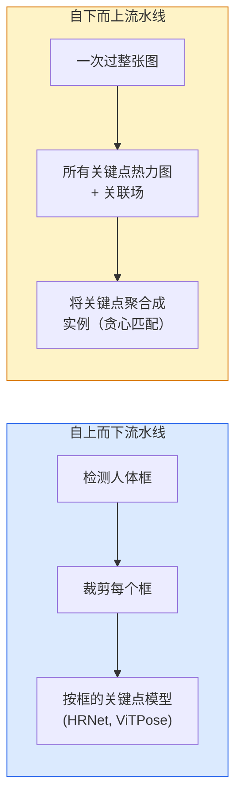

# 关键点检测与姿态估计

> 姿态是一组有序的关键点集合。关键点检测器是一个热力图回归器。其余的都是记录工作。

**类型：** 构建
**语言：** Python
**前置课程：** 第四阶段第06课（检测）、第四阶段第07课（U-Net）
**时间：** 约45分钟

## 学习目标

- 区分自上而下和自下而上的姿态估计，并说明各自的使用场景
- 使用以高斯关键点为目标的回归方式预测K个关键点的热力图，并在推理时提取关键点坐标
- 解释部分亲和场（PAFs）以及自下而上流水线如何将关键点关联到实例中
- 使用 MediaPipe Pose 或 MMPose 进行生产级关键点估计，并理解其输出格式

## 问题描述

关键点任务隐藏在多种名称之下：人体姿态（17个身体关节）、面部特征点（68或478个点）、手部（21个点）、动物姿态、机器人物体姿态、医学解剖标志点。它们都共享相同的结构：检测物体上的K个离散点，并输出它们的(x, y)坐标。

姿态估计是动作捕捉、健身应用、体育分析、手势控制、动画、AR试穿和机器人抓取的基础。2D情况已成熟；3D姿态（从单目相机估算世界坐标中的关节位置）是当前研究前沿。

工程上的问题是规模。单张图片、单人的姿态估计是一个20ms的问题。而在人群中以30fps进行多人姿态估计，则是一个具有不同架构的不同问题。

## 概念

### 自上而下 vs 自下而上



- **自上而下（Top-down）** — 先检测人，然后对每个裁剪区域运行单人关键点模型。精度最高；随人数线性扩展。
- **自下而上（Bottom-up）** — 一次前向传播预测所有关键点加上关联场；然后分组。无论人群规模如何，时间恒定。

自上而下（HRNet、ViTPose）是精度领先者；自下而上（OpenPose、HigherHRNet）是拥挤场景下吞吐量的领先者。

### 热力图回归

不直接回归`(x, y)`，而是为每个关键点预测一个`H x W`的热力图，在高斯分布的中心位于真实位置处有一个峰。

```
target[k, y, x] = exp(-((x - cx_k)^2 + (y - cy_k)^2) / (2 sigma^2))
```

推理时，每个热力图的argmax即为预测的关键点位置。

为什么热力图比直接回归效果更好：网络的空間结构（卷积特征图）与空间输出自然对齐。高斯目标还能起到正则化作用——小的定位误差会产生小的损失，而不是零。

### 亚像素定位

Argmax给出的是整数坐标。为了达到亚像素精度，可以拟合一个抛物线到argmax及其邻域，或使用著名的偏移公式`(dx, dy) = 0.25 * (heatmap[y, x+1] - heatmap[y, x-1], ...)`方向。

### 部分亲和场（PAFs）

OpenPose解决自下而上关联的技巧。对于每对相连的关键点（例如左肩到左肘），预测一个2通道场，编码从一个指向另一个的单位向量。要将肩部与其肘部关联，沿候选点对连线积分PAF；积分最高的点对被匹配。

```
对于每条连接（肢体）：
  PAF通道：2个（单位向量x, y）
  线积分：沿采样点的 sum(PAF · line_direction)
  积分越高 = 匹配越强
```

优雅且能扩展到任意人群规模，无需逐人裁剪。

### COCO关键点

标准的人体姿态数据集：每人17个关键点，使用PCK（正确关键点百分比）和OKS（对象关键点相似度）作为指标。OKS是关键点版本的IoU，也是COCO mAP@OKS报告的指标。

### 2D vs 3D

- **2D姿态** — 图像坐标；已达到生产质量（MediaPipe、HRNet、ViTPose）。
- **3D姿态** — 世界/相机坐标；仍是活跃研究。常见方法：
  - 用小MLP将2D预测提升到3D（VideoPose3D）。
  - 从图像直接回归3D（PyMAF、MHFormer）。
  - 多视角设置（CMU Panoptic）用于地面真值。

```figure
cv3-pose-heatmap
```

## 构建

### 步骤1：高斯热力图目标

```python
import numpy as np
import torch

def gaussian_heatmap(size, cx, cy, sigma=2.0):
    yy, xx = np.meshgrid(np.arange(size), np.arange(size), indexing="ij")
    return np.exp(-((xx - cx) ** 2 + (yy - cy) ** 2) / (2 * sigma ** 2)).astype(np.float32)

hm = gaussian_heatmap(64, 32, 32, sigma=2.0)
print(f"峰值: {hm.max():.3f} at ({hm.argmax() % 64}, {hm.argmax() // 64})")
```

将每个关键点的热力图沿通道轴堆叠即可得到完整的目标张量。

### 步骤2：小型关键点头

一个U-Net风格的模型，输出K个热力图通道。

```python
import torch.nn as nn
import torch.nn.functional as F

class TinyKeypointNet(nn.Module):
    def __init__(self, num_keypoints=4, base=16):
        super().__init__()
        self.down1 = nn.Sequential(nn.Conv2d(3, base, 3, 2, 1), nn.ReLU(inplace=True))
        self.down2 = nn.Sequential(nn.Conv2d(base, base * 2, 3, 2, 1), nn.ReLU(inplace=True))
        self.mid = nn.Sequential(nn.Conv2d(base * 2, base * 2, 3, 1, 1), nn.ReLU(inplace=True))
        self.up1 = nn.ConvTranspose2d(base * 2, base, 2, 2)
        self.up2 = nn.ConvTranspose2d(base, num_keypoints, 2, 2)

    def forward(self, x):
        h1 = self.down1(x)
        h2 = self.down2(h1)
        h3 = self.mid(h2)
        u1 = self.up1(h3)
        return self.up2(u1)
```

输入`(N, 3, H, W)`，输出`(N, K, H, W)`。损失是对高斯目标的逐像素MSE。

### 步骤3：推理 — 提取关键点坐标

```python
def heatmap_to_coords(heatmaps):
    """
    heatmaps: (N, K, H, W)
    returns:  (N, K, 2) 图像像素中的浮点坐标
    """
    N, K, H, W = heatmaps.shape
    hm = heatmaps.reshape(N, K, -1)
    idx = hm.argmax(dim=-1)
    ys = (idx // W).float()
    xs = (idx % W).float()
    return torch.stack([xs, ys], dim=-1)

coords = heatmap_to_coords(torch.randn(2, 4, 32, 32))
print(f"坐标: {coords.shape}")  # (2, 4, 2)
```

推理时一行搞定。如需亚像素细化，则在argmax附近插值。

### 步骤4：合成关键点数据集

简单起见：在白画布上画四个点并学习预测它们。

```python
def make_synthetic_sample(size=64):
    img = np.ones((3, size, size), dtype=np.float32)
    rng = np.random.default_rng()
    kps = rng.integers(8, size - 8, size=(4, 2))
    for cx, cy in kps:
        img[:, cy - 2:cy + 2, cx - 2:cx + 2] = 0.0
    hms = np.stack([gaussian_heatmap(size, cx, cy) for cx, cy in kps])
    return img, hms, kps
```

简单到足够让一个小模型在一分钟内学会。

### 步骤5：训练

```python
model = TinyKeypointNet(num_keypoints=4)
opt = torch.optim.Adam(model.parameters(), lr=3e-3)

for step in range(200):
    batch = [make_synthetic_sample() for _ in range(16)]
    imgs = torch.from_numpy(np.stack([b[0] for b in batch]))
    hms = torch.from_numpy(np.stack([b[1] for b in batch]))
    pred = model(imgs)
    # 上采样pred到全分辨率
    pred = F.interpolate(pred, size=hms.shape[-2:], mode="bilinear", align_corners=False)
    loss = F.mse_loss(pred, hms)
    opt.zero_grad(); loss.backward(); opt.step()
```

## 使用

- **MediaPipe Pose** — Google的生产级姿态估计器；附带WebGL +移动端运行时，延迟低于10ms。
- **MMPose**（OpenMMLab）— 全面的研究代码库；包含所有SOTA架构及预训练权重。
- **YOLOv8-pose** — 单次前向传播实现最快的实时多人姿态估计。
- **transformers HumanDPT / PoseAnything** — 较新的视觉-语言方法，用于开放词汇姿态（任意物体、任意关键点集）。

## 交付

本课产出：

- `outputs/prompt-pose-stack-picker.md` — 一个根据延迟、人群规模和2D/3D需求选择 MediaPipe / YOLOv8-pose / HRNet / ViTPose 的提示词。
- `outputs/skill-heatmap-to-coords.md` — 一个技能，编写生产级姿态模型使用的亚像素热力图到坐标转换例程。

## 练习

1. **(简单)** 在合成4点数据集上训练小型关键点模型。报告200步后预测关键点与真实关键点之间的平均L2误差。
2. **(中等)** 添加亚像素细化：给定argmax位置，沿x和y方向从邻近像素拟合一维抛物线。报告相比整数argmax的精度提升。
3. **(困难)** 构建一个2人合成数据集，每张图像显示两个4关键点模式的实例。训练一个带PAFs的自下而上流水线，预测哪些关键点属于哪个实例，并评估OKS。

## 关键术语

| 术语 | 人们怎么说 | 实际含义 |
|------|-----------|---------|
| Keypoint（关键点） | "一个标志点" | 物体上一个特定的有序点（关节、角点、特征点） |
| Pose（姿态） | "骨架" | 属于同一个实例的有序关键点集合 |
| Top-down（自上而下） | "先检测再姿态" | 两阶段流水线：人体检测器 + 按裁剪的关键点模型；精度最高 |
| Bottom-up（自下而上） | "先姿态后分组" | 单次通过预测所有关键点 + 分组；人群规模下时间恒定 |
| Heatmap（热力图） | "高斯目标" | 每个关键点一个H x W张量，峰值位于真实位置；首选的回归目标 |
| PAF（部分亲和场） | "肢体亲和场" | 2通道单位向量场，编码肢体方向；用于将关键点聚合成实例 |
| OKS（对象关键点相似度） | "关键点IoU" | Object Keypoint Similarity；COCO的姿态评估指标 |
| HRNet | "高分辨率网络" | 主导的自上而下关键点架构；全程保留高分辨率特征 |

## 延伸阅读

- [OpenPose (Cao et al., 2017)](https://arxiv.org/abs/1812.08008) — 带PAFs的自下而上方法；仍是对该方法最好的介绍
- [HRNet (Sun et al., 2019)](https://arxiv.org/abs/1902.09212) — 自上而下的参考架构
- [ViTPose (Xu et al., 2022)](https://arxiv.org/abs/2204.12484) — 用纯ViT作为姿态骨干网络；多个基准上的当前SOTA
- [MediaPipe Pose](https://developers.google.com/mediapipe/solutions/vision/pose_landmarker) — 生产级实时姿态；2026年部署最快的方案
